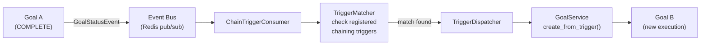
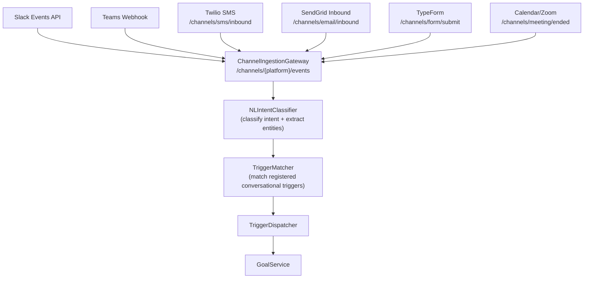
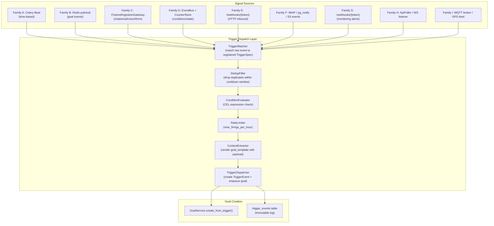

# AgentVerse Trigger Architecture Specification

> **Status:** Architecture Design — Ready for Implementation Planning  
> **Date:** 2026-08-15  
> **Author:** AgentVerse Platform Team  
> **Scope:** Complete trigger system redesign — all 9 trigger families, 40+ trigger types  
> **Current baseline:** 10 trigger types (`CRON`, `INTERVAL`, `ONCE`, `WEBHOOK`, `REST`, `EVENT`, `FILE_DROP`, `ALERTMANAGER`, `DATADOG`, `PAGERDUTY`)  
> **Target:** 40+ trigger types across 9 families with unified dispatch architecture

---

## 1. Executive Summary

Every agent goal in AgentVerse must be *started* by something. Today that "something" is limited to schedules, webhooks, and a few monitoring integrations. This specification designs the complete trigger system — the layer that converts any real-world signal into a goal execution request.

The target architecture covers:

| Family | Triggers | Key capability unlocked |
|---|---|---|
| **A. Time** | CRON, INTERVAL, ONCE, BUSINESS_CALENDAR, RELATIVE_DELAY, DEADLINE | Business-aware scheduling |
| **B. Goal Chaining** | GOAL_COMPLETED, GOAL_FAILED, GOAL_SCORE_BELOW, HITL_APPROVED, HITL_REJECTED | Multi-step autonomous pipelines |
| **C. Conversational / Chat** | CHAT_COMMAND, CHAT_KEYWORD, CHAT_MENTION, EMAIL_INTENT, SMS_INBOUND, VOICE_TRANSCRIPT, MEETING_ENDED, FORM_SUBMISSION | "Talk to your agents" from any channel |
| **D. Condition / State** | CONDITION, COUNTER_THRESHOLD, COMPOUND, STATE_TRANSITION, WINDOW_AGGREGATE | Any data point becomes a trigger |
| **E. Inbound HTTP / Webhook** | WEBHOOK, REST, GITHUB_WEBHOOK, JIRA_WEBHOOK, STRIPE_WEBHOOK, SLACK_EVENT, SALESFORCE_EVENT, CONFLUENCE_WEBHOOK, LINEAR_WEBHOOK | Platform-native structured events |
| **F. Data / Storage** | FILE_DROP, DB_ROW_CHANGE, S3_EVENT, EMAIL_ARRIVAL, RSS_FEED, GOOGLE_SHEETS, SHAREPOINT | Data changes trigger action |
| **G. Observability / Alerting** | ALERTMANAGER, DATADOG, PAGERDUTY, GRAFANA_ALERT, CLOUDWATCH, SENTRY_ISSUE, LOG_PATTERN | Ops events drive remediation |
| **H. Polling / External API** | API_POLL, GRAPHQL_SUBSCRIPTION, WEBSOCKET_MESSAGE, PRICE_THRESHOLD | External state changes trigger agents |
| **I. IoT / Physical** | MQTT, GEOFENCE, SENSOR_THRESHOLD | Physical world → digital action |

---

## 2. Architecture Principles

| Principle | Decision | Rationale |
|---|---|---|
| **Single dispatch path** | All triggers funnel into one `TriggerDispatcher` service | No special-casing per trigger type in goal creation |
| **Unified `TriggerEvent` envelope** | Every trigger produces a `TriggerEvent` with standard metadata | Enables audit trail, deduplication, and replay |
| **Trigger ≠ goal** | A trigger fires an event; the `GoalService` decides whether to create a goal | Allows conditions, deduplication, HITL gates at the intake boundary |
| **Immutable event log** | All trigger firings written to `trigger_events` append-only table | Replay, debugging, compliance |
| **Tenant-scoped everything** | Every trigger belongs to exactly one tenant; RLS enforced at DB | Multi-tenant isolation |
| **Deduplication by default** | Duplicate events within a 60-second window are dropped | Prevents re-trigger storms from flaky webhooks |
| **Back-pressure aware** | Trigger dispatcher checks tenant goal queue depth before enqueueing | Prevents queue flooding from high-frequency triggers |
| **NL-definable** | Every trigger can be described in natural language and parsed by `NLScheduler` | Non-technical users can configure triggers |

---

## 3. Unified Data Model

### 3.1 `TriggerType` Enum (complete)

```python
class TriggerType(enum.StrEnum):
    # ── Family A: Time ─────────────────────────────────────────────
    CRON               = "cron"               # existing
    INTERVAL           = "interval"           # existing
    ONCE               = "once"               # existing
    BUSINESS_CALENDAR  = "business_calendar"  # NEW
    RELATIVE_DELAY     = "relative_delay"     # NEW
    DEADLINE           = "deadline"           # NEW

    # ── Family B: Goal Chaining ────────────────────────────────────
    GOAL_COMPLETED     = "goal_completed"     # NEW
    GOAL_FAILED        = "goal_failed"        # NEW
    GOAL_SCORE_BELOW   = "goal_score_below"   # NEW
    HITL_APPROVED      = "hitl_approved"      # NEW
    HITL_REJECTED      = "hitl_rejected"      # NEW
    MEMORY_CREATED     = "memory_created"     # NEW

    # ── Family C: Conversational / Chat ───────────────────────────
    CHAT_COMMAND       = "chat_command"       # NEW
    CHAT_KEYWORD       = "chat_keyword"       # NEW
    CHAT_MENTION       = "chat_mention"       # NEW
    EMAIL_INTENT       = "email_intent"       # NEW
    SMS_INBOUND        = "sms_inbound"        # NEW
    VOICE_TRANSCRIPT   = "voice_transcript"   # NEW
    MEETING_ENDED      = "meeting_ended"      # NEW
    FORM_SUBMISSION    = "form_submission"    # NEW

    # ── Family D: Condition / State ───────────────────────────────
    CONDITION          = "condition"          # NEW
    COUNTER_THRESHOLD  = "counter_threshold"  # NEW
    COMPOUND           = "compound"           # NEW
    STATE_TRANSITION   = "state_transition"   # NEW
    WINDOW_AGGREGATE   = "window_aggregate"   # NEW

    # ── Preserved existing ────────────────────────────────────────
    EVENT              = "event"              # existing (Redis pub/sub channel)

    # ── Family E: Inbound HTTP / Webhook ──────────────────────────
    WEBHOOK            = "webhook"            # existing
    REST               = "rest"               # existing
    GITHUB_WEBHOOK     = "github_webhook"     # NEW
    JIRA_WEBHOOK       = "jira_webhook"       # NEW
    STRIPE_WEBHOOK     = "stripe_webhook"     # NEW
    SLACK_EVENT        = "slack_event"        # NEW
    TEAMS_WEBHOOK      = "teams_webhook"      # NEW (Teams Connector Cards + channel webhooks)
    DISCORD_EVENT      = "discord_event"      # NEW
    SALESFORCE_EVENT   = "salesforce_event"   # NEW
    CONFLUENCE_WEBHOOK = "confluence_webhook" # NEW
    LINEAR_WEBHOOK     = "linear_webhook"     # NEW

    # ── Family F: Data / Storage ──────────────────────────────────
    FILE_DROP          = "file_drop"          # existing
    DB_ROW_CHANGE      = "db_row_change"      # NEW
    S3_EVENT           = "s3_event"           # NEW
    EMAIL_ARRIVAL      = "email_arrival"      # NEW
    RSS_FEED           = "rss_feed"           # NEW
    GOOGLE_SHEETS      = "google_sheets"      # NEW
    SHAREPOINT         = "sharepoint"         # NEW

    # ── Family G: Observability / Alerting ────────────────────────
    ALERTMANAGER       = "alertmanager"       # existing
    DATADOG            = "datadog"            # existing
    PAGERDUTY          = "pagerduty"          # existing
    GRAFANA_ALERT      = "grafana_alert"      # NEW
    CLOUDWATCH         = "cloudwatch"         # NEW
    SENTRY_ISSUE       = "sentry_issue"       # NEW
    LOG_PATTERN        = "log_pattern"        # NEW

    # ── Family H: Polling / External API ─────────────────────────
    API_POLL           = "api_poll"           # NEW
    GRAPHQL_SUBSCRIPTION = "graphql_subscription" # NEW
    WEBSOCKET_MESSAGE  = "websocket_message"  # NEW
    PRICE_THRESHOLD    = "price_threshold"    # NEW

    # ── Family I: IoT / Physical ──────────────────────────────────
    MQTT               = "mqtt"               # NEW
    GEOFENCE           = "geofence"           # NEW
    SENSOR_THRESHOLD   = "sensor_threshold"   # NEW
```

### 3.2 `TriggerSpec` Dataclass (extended)

```python
@dataclass
class TriggerSpec:
    # ── Core ──────────────────────────────────────────────────────
    trigger_type: TriggerType = TriggerType.ONCE
    description: str = ""
    condition: str = ""           # CEL/JSONPath expression gating all trigger types
    cooldown_seconds: int = 60    # minimum seconds between firings (dedup window)
    max_firings_per_hour: int = 0 # 0 = unlimited; rate cap
    goal_template: str = ""       # NL template for goal text; {{payload.field}} interpolation
    # ── Lifecycle ─────────────────────────────────────────────────
    enabled: bool = True          # False = paused; trigger registered but won't fire
    priority: int = 5             # 1 (highest) – 10 (lowest); controls queue ordering
    max_total_fires: int = 0      # 0 = unlimited; auto-disable after N total firings
    expires_at_iso: str = ""      # ISO datetime after which trigger auto-disables
    on_failure_notify: str = ""   # email/slack channel to alert on trigger dispatch failure
    tags: list = None             # free-form labels for grouping/filtering triggers

    # ── Family A: Time ────────────────────────────────────────────
    cron_expression: str = ""
    timezone: str = "UTC"
    interval_seconds: int = 0
    fire_at_iso: str = ""
    business_calendar_id: str = ""  # reference to a BusinessCalendar object
    relative_to_field: str = ""     # JSONPath into triggering context (e.g. "$.contract.expires_at")
    relative_offset_seconds: int = 0  # negative = before, positive = after
    deadline_field: str = ""        # field containing the deadline ISO timestamp

    # ── Family B: Goal Chaining ───────────────────────────────────
    watch_goal_id: str = ""         # specific goal ID to watch, or "" = any goal
    watch_agent_id: str = ""        # filter by agent
    score_threshold: float = 0.0    # for GOAL_SCORE_BELOW
    score_dimension: str = ""       # "overall" | specific dimension name
    hitl_queue_id: str = ""         # for HITL_APPROVED / HITL_REJECTED
    memory_type: str = ""           # for MEMORY_CREATED: type of memory

    # ── Family C: Conversational ──────────────────────────────────
    channel_type: str = ""          # "slack" | "teams" | "discord" | "sms" | ...
    channel_id: str = ""            # specific channel, DM, or phone number
    command_pattern: str = ""       # exact command string e.g. "/run-agent"
    keyword_pattern: str = ""       # regex or keyword list (comma-separated)
    mention_bot_id: str = ""        # bot user ID to watch for @mentions
    email_sender_filter: str = ""   # regex on sender address
    email_subject_filter: str = ""  # regex on subject line
    nl_intent_class: str = ""       # intent classifier label to match
    form_id: str = ""               # TypeForm/Gravity Forms form ID
    meeting_platform: str = ""      # "zoom" | "meet" | "teams"

    # ── Family D: Condition / State ───────────────────────────────
    condition_expression: str = ""  # CEL expression: "payload.amount > 10000"
    counter_event_type: str = ""    # event type to count
    counter_threshold: int = 0
    counter_window_seconds: int = 3600  # rolling window
    compound_logic: str = ""        # "A AND B" | "A OR B OR C"
    compound_trigger_ids: list = None   # sub-trigger IDs forming the compound
    state_machine_id: str = ""
    from_state: str = ""
    to_state: str = ""
    aggregate_function: str = ""    # "count" | "sum" | "avg" | "max"
    aggregate_field: str = ""       # field to aggregate
    aggregate_threshold: float = 0.0
    aggregate_window_seconds: int = 300

    # ── Family E: Inbound HTTP ────────────────────────────────────
    webhook_token: str = ""         # existing
    webhook_signature_header: str = ""   # header containing HMAC signature
    webhook_signature_secret: str = ""   # HMAC signing secret (stored in vault)
    webhook_event_filter: str = ""  # e.g. "action == 'push'" for GitHub
    github_repo: str = ""           # "org/repo" to filter
    github_events: list = None      # ["push", "pull_request", "issues"]
    jira_project_key: str = ""
    jira_issue_events: list = None  # ["created", "updated", "status_changed"]
    stripe_event_types: list = None # ["payment_intent.succeeded", ...]
    slack_workspace_id: str = ""
    slack_event_types: list = None  # ["message", "app_mention", "reaction_added"]
    salesforce_object: str = ""     # "Opportunity", "Lead", etc.
    salesforce_events: list = None  # ["created", "updated", "field_change"]

    # ── Family F: Data / Storage ──────────────────────────────────
    file_watch_path: str = ""       # existing (FILE_DROP)
    file_pattern: str = "*"         # glob pattern
    db_table: str = ""              # PostgreSQL table name
    db_event: str = "INSERT"        # "INSERT" | "UPDATE" | "DELETE"
    db_condition: str = ""          # SQL WHERE clause fragment
    s3_bucket: str = ""
    s3_prefix: str = ""
    s3_events: list = None          # ["s3:ObjectCreated:*", ...]
    email_imap_host: str = ""
    email_folder: str = "INBOX"
    rss_url: str = ""
    rss_poll_interval_seconds: int = 900
    sheets_spreadsheet_id: str = ""
    sheets_range: str = ""

    # ── Family G: Observability ───────────────────────────────────
    # (ALERTMANAGER, DATADOG, PAGERDUTY already handled by WEBHOOK)
    log_pattern_regex: str = ""
    log_source: str = ""            # "cloudwatch" | "loki" | "splunk"
    sentry_project: str = ""
    sentry_min_events_per_hour: int = 10
    grafana_alert_name: str = ""
    cloudwatch_alarm_name: str = ""

    # ── Family H: Polling ─────────────────────────────────────────
    poll_url: str = ""
    poll_method: str = "GET"
    poll_headers: dict = None
    poll_interval_seconds: int = 60
    poll_compare_path: str = ""     # JSONPath to extract comparison value
    poll_compare_operator: str = "changed"  # "changed" | "gt" | "lt" | "eq"
    poll_compare_value: str = ""
    graphql_endpoint: str = ""
    graphql_subscription_query: str = ""
    ws_url: str = ""
    ws_message_pattern: str = ""    # regex on message content

    # ── Family I: IoT ─────────────────────────────────────────────
    mqtt_broker: str = ""
    mqtt_topic: str = ""
    mqtt_qos: int = 0
    geofence_lat: float = 0.0
    geofence_lon: float = 0.0
    geofence_radius_meters: float = 100.0
    geofence_event: str = "enter"   # "enter" | "exit" | "both"
    sensor_device_id: str = ""
    sensor_metric: str = ""
    sensor_operator: str = "gt"
    sensor_threshold: float = 0.0

    # ── EVENT: Redis pub/sub (existing) ─────────────────────────────
    event_channel: str = ""       # Redis channel name to subscribe to
    event_filter: str = ""        # CEL filter on channel message payload

    # ── TEAMS_WEBHOOK / DISCORD_EVENT ────────────────────────────
    teams_tenant_id: str = ""     # Azure AD tenant ID for Teams webhook auth
    teams_channel_id: str = ""    # Teams channel ID filter
    discord_server_id: str = ""   # Discord guild/server ID
    discord_channel_id: str = ""  # Discord channel ID filter
```

### 3.3 `TriggerEvent` Envelope

Every trigger firing produces a `TriggerEvent` that is:
1. Written to `trigger_events` (immutable audit log)
2. Deduplicated by `(trigger_id, dedup_key)` within cooldown window
3. Dispatched to `GoalService.create_from_trigger()`

```python
@dataclass
class TriggerEvent:
    event_id: str                  # uuid4
    trigger_id: str                # FK → triggers table
    tenant_id: str
    fired_at: datetime
    trigger_type: TriggerType
    dedup_key: str                 # deterministic hash for dedup
    raw_payload: dict              # original raw payload from source
    extracted_context: dict        # parsed fields available as {{payload.X}}
    goal_text: str                 # rendered goal_template with context injected
    agent_id: str | None           # pre-resolved agent, or None for auto-routing
    metadata: dict                 # source-specific metadata (channel, repo, etc.)
    fired_by: str                  # "system" | user_id (for REST/chat triggers)
```

---

## 4. Family A — Time Triggers

### 4.1 Existing: `CRON`, `INTERVAL`, `ONCE`
No changes. Continue using Celery Beat.

### 4.2 New: `BUSINESS_CALENDAR`

Fires on business-day-aware schedules. Respects holidays, working hours, and timezone.

```
"First business day of each month at 09:00 EST"
"Last Friday of Q2"
"Every weekday at 17:30, skipping UK public holidays"
```

**Architecture:**
- `BusinessCalendar` objects stored in `business_calendars` table per tenant
- Populated from iCal feeds (Google Calendar, Outlook calendar URL)
- At fire time, `BusinessCalendarEvaluator.next_fire(spec, now)` computes the next eligible datetime
- Celery Beat schedules a `ONCE` task for the next fire time; reschedules itself after firing

```python
class BusinessCalendarEvaluator:
    def next_fire(self, spec: TriggerSpec, from_dt: datetime) -> datetime:
        """Walk forward from from_dt until a business day/time match is found."""
        ...
    
    def is_business_day(self, dt: datetime, calendar_id: str) -> bool:
        """True if dt is not a weekend or holiday in the calendar."""
        ...
```

### 4.3 New: `RELATIVE_DELAY`

Fires N seconds before/after a datetime field inside a triggering context.

```
"3 days before contract.expires_at"
"1 hour after order.confirmed_at"
```

**Architecture:**
- `RelativeDelayScheduler` reads `relative_to_field` (JSONPath) from the source object
- Computes absolute fire time = `field_value + relative_offset_seconds`
- Schedules a `ONCE` Celery ETA task

**Example:** Contract expiry reminder agent
```python
TriggerSpec(
    trigger_type=TriggerType.RELATIVE_DELAY,
    relative_to_field="$.contract.expires_at",
    relative_offset_seconds=-(3 * 86400),  # 3 days before
    goal_template="Review and renew contract {{context.contract.contract_id}} expiring on {{context.contract.expires_at}}"
)
```

### 4.4 New: `DEADLINE`

Purpose-built for SLA/deadline monitoring. Polls a data source and fires N seconds before a deadline field value.

```
"Fire 48 hours before any open support ticket's SLA due_at exceeds"
"Fire 7 days before any subscription.renewal_date"
```

**Architecture:**
- `DeadlineMonitor` Celery Beat task runs every 5 minutes
- Queries configured data source for rows where `deadline_field` is within `lookahead_window`
- Creates one `ONCE` task per matching row (deduplicated by row ID + deadline time)

---

## 5. Family B — Goal Chaining Triggers

This family enables **autonomous multi-step pipelines** — chains of goals where output of one goal triggers the next.

### 5.1 Architecture Overview



**Key principle:** Goal chaining does NOT create direct goal-to-goal dependencies in the AgentGraph. The trigger system is the coupling mechanism — goals remain independently schedulable.

### 5.2 `GOAL_COMPLETED`

Fires when a goal with matching criteria reaches `GoalStatus.COMPLETE`.

```python
TriggerSpec(
    trigger_type=TriggerType.GOAL_COMPLETED,
    watch_agent_id="data-extraction-agent",
    condition="payload.overall_score >= 0.85",
    goal_template="Process extracted data from goal {{payload.goal_id}}: {{payload.output_summary}}"
)
```

**Filter options:**
| Field | Effect |
|---|---|
| `watch_goal_id` | Only fire for a specific goal ID |
| `watch_agent_id` | Only fire for goals run by this agent |
| `condition` | CEL expression on the completed goal's scorecard/output |
| `goal_template` | Goal text with `{{payload.*}}` interpolated from the completed goal's output |

**Event payload (available as `{{payload.*}}`):**
```json
{
  "goal_id": "goal-abc123",
  "agent_id": "data-extraction-agent",
  "status": "COMPLETE",
  "overall_score": 0.91,
  "output_summary": "Extracted 47 fields from invoice INV-2026-0891",
  "output": { "invoice_id": "INV-2026-0891", "total": 14500.00, ... },
  "tenant_id": "tenant-xyz",
  "completed_at": "2026-08-15T14:23:11Z",
  "iterations_used": 3,
  "cost_usd": 0.08
}
```

### 5.3 `GOAL_FAILED`

Fires when a goal reaches `GoalStatus.FAILED` or `GoalStatus.MAX_ITERATIONS_EXCEEDED`.

```python
TriggerSpec(
    trigger_type=TriggerType.GOAL_FAILED,
    watch_agent_id="payment-processor-agent",
    goal_template="Investigate and retry failed payment processing goal {{payload.goal_id}}: {{payload.failure_reason}}"
)
```

**Use cases:**
- Automatic remediation: failed deploy → rollback agent
- Escalation: failed invoice extraction → manual review agent
- Alerting: failed critical goal → notification agent

### 5.4 `GOAL_SCORE_BELOW`

Fires when a completed goal's evaluation score falls below a threshold. Bridges the eval system to the trigger system.

```python
TriggerSpec(
    trigger_type=TriggerType.GOAL_SCORE_BELOW,
    watch_agent_id="customer-support-agent",
    score_threshold=0.70,
    score_dimension="rag_quality",   # "" = overall_score
    goal_template="Quality regression detected in agent {{payload.agent_id}}. Goal {{payload.goal_id}} scored {{payload.score}} on {{payload.dimension}}. Investigate and propose prompt improvement."
)
```

**Architecture:** `EvalRunner.score_and_persist()` publishes a `GoalScoredEvent` to Redis. `ChainTriggerConsumer` evaluates registered `GOAL_SCORE_BELOW` triggers.

### 5.5 `HITL_APPROVED` / `HITL_REJECTED`

Fires when a human approves or rejects an item in the HITL queue. Closes the human-in-the-loop circuit.

```python
# HITL_APPROVED: execute the approved action
TriggerSpec(
    trigger_type=TriggerType.HITL_APPROVED,
    hitl_queue_id="contract-above-1m-queue",
    goal_template="Execute approved contract workflow for {{payload.contract_id}} — approved by {{payload.approver}} with notes: {{payload.approval_notes}}"
)

# HITL_REJECTED: trigger corrective path
TriggerSpec(
    trigger_type=TriggerType.HITL_REJECTED,
    hitl_queue_id="contract-above-1m-queue",
    goal_template="Contract {{payload.contract_id}} was rejected by {{payload.approver}}. Reason: {{payload.rejection_reason}}. Notify originator and archive."
)
```

**Event payload:**
```json
{
  "hitl_item_id": "hitl-456",
  "queue_id": "contract-above-1m-queue",
  "approver": "legal-team@company.com",
  "decision": "approved",
  "approval_notes": "Reviewed and cleared by legal",
  "original_goal_id": "goal-original-123",
  "context": { "contract_id": "CNT-2026-0099", ... },
  "decided_at": "2026-08-15T16:45:00Z"
}
```

### 5.6 Pipeline Example: Invoice Processing → Payment → Notification

```
TRIGGER: FILE_DROP (PDF arrives in /invoices/incoming/)
  ↓
Goal 1: "Extract all fields from invoice {{filename}}"
  → GOAL_COMPLETED trigger (score >= 0.85)
  ↓
Goal 2: "Validate extracted invoice {{payload.output.invoice_id}} against PO database"
  → GOAL_COMPLETED trigger (payload.output.validation_status == "APPROVED")
  ↓
Goal 3: "Process payment for invoice {{payload.output.invoice_id}} amount {{payload.output.total}}"
  → GOAL_COMPLETED trigger
  ↓
Goal 4: "Send payment confirmation to vendor {{payload.output.vendor_email}}"
```

---

## 6. Family C — Conversational / Chat Triggers

Enables agents to be activated from any messaging channel — Slack, Teams, email, SMS, or voice.

### 6.1 Architecture Overview



**`ChannelIngestionGateway`** is a new FastAPI router group at `/api/v1/channels/` that accepts inbound events from each messaging platform.

### 6.2 `CHAT_COMMAND`

Fires on exact command strings prefixed with `/`.

```python
TriggerSpec(
    trigger_type=TriggerType.CHAT_COMMAND,
    channel_type="slack",
    channel_id="C04ABC123",          # specific channel, or "" for all channels
    command_pattern="/deploy",
    goal_template="Deploy {{payload.args.service}} to {{payload.args.env}} as requested by {{payload.user_name}} in #{{payload.channel_name}}"
)
```

**Slash command parsing:** `CHAT_COMMAND` triggers run `CommandParser` which extracts positional args and named flags:
```
/deploy order-service staging --version v2.4.1
→ args.service = "order-service"
→ args.env = "staging"  
→ flags.version = "v2.4.1"
```

**Security:** Commands validated against a `SlashCommandRegistry` per tenant. Unknown commands return ephemeral "unknown command" error to user.

**Channels supported:**
| Platform | Delivery mechanism |
|---|---|
| Slack | Slack Events API → `/channels/slack/events` |
| Microsoft Teams | Teams outgoing webhook → `/channels/teams/events` |
| Discord | Discord bot events → `/channels/discord/events` |

### 6.3 `CHAT_KEYWORD`

Fires when a message contains a matching keyword or regex pattern.

```python
TriggerSpec(
    trigger_type=TriggerType.CHAT_KEYWORD,
    channel_type="slack",
    channel_id="C04INCIDENTS",
    keyword_pattern=r"\b(P1|P2|URGENT|critical)\b",
    goal_template="Incident detected in #{{payload.channel_name}} by {{payload.user_name}}: '{{payload.message_text}}' — triage and create incident report"
)
```

**Noise reduction:** Keywords only evaluated in configured channels. Bot messages excluded by default. Message threads (not top-level) excluded unless `include_threads=True`.

### 6.4 `CHAT_MENTION`

Fires when the AgentVerse bot is @mentioned.

```python
TriggerSpec(
    trigger_type=TriggerType.CHAT_MENTION,
    channel_type="slack",
    mention_bot_id="U0BOT123",
    nl_intent_class="",   # "" = forward full message as goal
    goal_template="{{payload.message_text_without_mention}}"
)
```

**NL intent classification:** When `nl_intent_class` is set, `NLIntentClassifier` runs on the message. Only fires if classified intent matches. When empty, the full message text (minus the @mention) becomes the goal directly.

**Example interaction:**
```
User: @agentverse summarize all open P1 tickets from this week
→ TriggerEvent fired with goal: "Summarize all open P1 tickets from this week"
→ GoalService creates goal, assigns to support-analyst-agent
→ Bot replies with SSE stream of agent progress
```

### 6.5 `EMAIL_INTENT`

Fires when an inbound email matches sender/subject/intent filters.

```python
TriggerSpec(
    trigger_type=TriggerType.EMAIL_INTENT,
    email_sender_filter=r"@(acmecorp\.com|bigclient\.io)$",
    email_subject_filter=r"(invoice|payment|PO)",
    nl_intent_class="accounts_payable",
    goal_template="Process inbound invoice email from {{payload.from_email}}: subject '{{payload.subject}}', attachment: {{payload.attachment_urls[0]}}"
)
```

**Delivery:** Inbound email via SendGrid Inbound Parse → `/api/v1/channels/email/inbound`

**NL intent classifier pipeline:**
1. Extract sender, subject, body text
2. Run `NLIntentClassifier.classify(text)` → intent label + confidence
3. Match against trigger's `nl_intent_class`
4. Fire if confidence >= `intent_confidence_threshold` (default 0.75)

### 6.6 `SMS_INBOUND`

Fires on inbound SMS from Twilio/Vonage.

```python
TriggerSpec(
    trigger_type=TriggerType.SMS_INBOUND,
    channel_id="+447700900000",    # phone number to watch (or "" for all)
    keyword_pattern="STATUS",
    goal_template="Send status report via SMS to {{payload.from_number}}"
)
```

### 6.7 `VOICE_TRANSCRIPT`

Fires when a post-call transcript contains a keyword or intent.

```python
TriggerSpec(
    trigger_type=TriggerType.VOICE_TRANSCRIPT,
    keyword_pattern=r"(cancel|refund|escalate)",
    nl_intent_class="churn_risk",
    goal_template="Customer {{payload.customer_id}} called and expressed {{payload.intent}} during call {{payload.call_id}}. Duration: {{payload.duration_seconds}}s. Create retention offer."
)
```

**Delivery:** Post-call webhook from Twilio, Zoom Phone, or RingCentral → `/api/v1/channels/voice/transcript`

### 6.8 `MEETING_ENDED`

Fires when a calendar meeting ends, using the meeting recording/transcript.

```python
TriggerSpec(
    trigger_type=TriggerType.MEETING_ENDED,
    meeting_platform="zoom",
    keyword_pattern="action item",  # only fire if transcript contains this
    goal_template="Generate meeting summary and extract action items from {{payload.meeting_title}} ({{payload.duration_minutes}}min) attended by {{payload.attendees_str}}"
)
```

**Delivery:** Zoom/Teams/Meet webhook → `/api/v1/channels/meeting/ended`

**Payload:**
```json
{
  "meeting_id": "zoom-98765432",
  "meeting_title": "Q3 Planning — Engineering",
  "platform": "zoom",
  "started_at": "2026-08-15T14:00:00Z",
  "ended_at": "2026-08-15T15:12:00Z",
  "duration_minutes": 72,
  "attendees": ["alice@co.com", "bob@co.com"],
  "recording_url": "https://zoom.us/rec/...",
  "transcript_url": "https://zoom.us/transcript/...",
  "transcript_text": "Alice: Let's align on Q3 priorities..."
}
```

### 6.9 `FORM_SUBMISSION`

Fires when a web form is submitted (TypeForm, Gravity Forms, HubSpot Forms).

```python
TriggerSpec(
    trigger_type=TriggerType.FORM_SUBMISSION,
    form_id="typef-abc123",
    condition="payload.responses.budget_range == 'enterprise'",
    goal_template="Enterprise lead submitted: {{payload.responses.company_name}}, {{payload.responses.use_case}}. Contact: {{payload.responses.email}}"
)
```

---

## 7. Family D — Condition / State Triggers

Enables any data value or computed condition to fire goals.

### 7.1 `CONDITION`

The most powerful trigger: fires when a CEL (Common Expression Language) expression evaluates to `true` against an incoming event payload.

```python
TriggerSpec(
    trigger_type=TriggerType.CONDITION,
    event_channel="orders.created",   # listen on this Redis channel
    condition_expression="payload.order_total > 10000 && payload.customer_tier == 'enterprise'",
    goal_template="High-value enterprise order {{payload.order_id}} requires VIP onboarding. Amount: ${{payload.order_total}}"
)
```

**CEL expression evaluator:** Uses `google-cel-python` library. Expressions evaluated against the `TriggerEvent.raw_payload` dict.

**Supported operators:** `>`, `<`, `>=`, `<=`, `==`, `!=`, `&&`, `||`, `!`, `in`, `contains`, `matches` (regex), `size()`, `type()`

**Examples:**
```
# Risk-based
"payload.risk_score > 0.8 && payload.country in ['IR', 'SY', 'KP']"

# Multi-field
"payload.invoice.status == 'overdue' && payload.invoice.days_overdue >= 30"

# String match
"payload.feedback.text.contains('urgent') || payload.priority == 'high'"

# Nested
"payload.order.items.size() > 50 && payload.order.total > 100000"
```

### 7.2 `COUNTER_THRESHOLD`

Fires when a rolling count of events crosses a threshold within a time window.

```python
TriggerSpec(
    trigger_type=TriggerType.COUNTER_THRESHOLD,
    event_channel="auth.login_failed",
    counter_event_type="login_failed",
    counter_threshold=10,
    counter_window_seconds=300,  # 10 failures in 5 minutes
    condition="payload.user_id == watch_user_id",  # group by user
    goal_template="Brute-force attack detected on user {{payload.user_id}}: {{payload.count}} failed logins in {{payload.window_seconds}}s. Block account and notify security."
)
```

**Implementation:** `CounterStore` backed by Redis `INCR` + sliding window with TTL.

**Use cases:**
- Login failure rate → account lockout agent
- Error rate spike → incident response agent
- Order volume milestone → marketing agent ("100th order!")

### 7.3 `COMPOUND`

Fires when a combination of other triggers all fire within a time window (AND) or any fires (OR).

```python
TriggerSpec(
    trigger_type=TriggerType.COMPOUND,
    compound_logic="A AND B",
    compound_trigger_ids=["trigger-high-cpu", "trigger-high-memory"],
    aggregate_window_seconds=120,  # both must fire within 2 minutes
    goal_template="System under compound stress: high CPU AND high memory simultaneously. Investigate and scale."
)
```

**Logic evaluation:** `CompoundTriggerEvaluator` maintains a Redis set of "recently fired sub-triggers" per tenant per compound trigger ID. Evaluates the logic expression when any sub-trigger fires.

**Logic operators:** `AND`, `OR`, `NOT`, `(`, `)`, numeric thresholds (e.g. `"ANY 2 OF [A,B,C,D]"`)

### 7.4 `STATE_TRANSITION`

Fires when an entity transitions from one state to another in a defined state machine.

```python
# Register state machine
StateMachine(
    id="deal-pipeline",
    states=["prospect", "qualified", "proposal", "negotiation", "closed_won", "closed_lost"],
    transitions=[
        ("qualified", "proposal", "trigger-assign-ae"),
        ("proposal", "negotiation", "trigger-legal-review"),
        ("negotiation", "closed_won", "trigger-onboarding"),
        ("*", "closed_lost", "trigger-loss-analysis"),
    ]
)

# Trigger on specific transition
TriggerSpec(
    trigger_type=TriggerType.STATE_TRANSITION,
    state_machine_id="deal-pipeline",
    from_state="negotiation",
    to_state="closed_won",
    goal_template="Deal {{payload.entity_id}} won! Initiate onboarding for {{payload.entity.company_name}}, value: ${{payload.entity.deal_value}}"
)
```

**State machine updates** via `POST /api/v1/state-machines/{id}/transition` or via tool call from within a goal.

### 7.5 `WINDOW_AGGREGATE`

Fires when a rolling aggregate (count/sum/avg/max/min) of a numeric field crosses a threshold.

```python
TriggerSpec(
    trigger_type=TriggerType.WINDOW_AGGREGATE,
    event_channel="orders.completed",
    aggregate_function="sum",
    aggregate_field="payload.order_total",
    aggregate_threshold=1_000_000.0,
    aggregate_window_seconds=3600,  # $1M in sales in last hour
    goal_template="Revenue milestone: ${{payload.aggregate_value}} in the last hour. Generate and send sales flash report."
)
```

---

## 8. Family E — Inbound HTTP / Webhook (Typed Variants)

### 8.1 Design Pattern: Typed vs Generic Webhook

Generic `WEBHOOK` accepts any payload. Typed variants (`GITHUB_WEBHOOK`, `JIRA_WEBHOOK`, etc.) add:
1. **Signature verification** built-in (HMAC-SHA256)
2. **Structured payload parsing** with known schemas
3. **Event type filtering** without requiring CEL expressions
4. **`{{payload.*}}` ergonomics** with typed field names

### 8.2 `GITHUB_WEBHOOK`

```python
TriggerSpec(
    trigger_type=TriggerType.GITHUB_WEBHOOK,
    github_repo="acme-corp/backend",
    github_events=["push"],
    condition="payload.ref == 'refs/heads/main'",
    webhook_signature_secret="vault://github-webhook-secret",
    goal_template="New push to main on {{payload.repository.full_name}} by {{payload.pusher.name}}. Commits: {{payload.commits | length}}. Run deployment pipeline."
)
```

**Payload fields available as `{{payload.*}}`:** Full GitHub event schema. Event type auto-detected from `X-GitHub-Event` header.

**Built-in events supported:**
- `push`, `pull_request`, `pull_request_review`, `issues`, `issue_comment`
- `release`, `workflow_run`, `check_run`, `deployment_status`

### 8.3 `JIRA_WEBHOOK`

```python
TriggerSpec(
    trigger_type=TriggerType.JIRA_WEBHOOK,
    jira_project_key="ENG",
    jira_issue_events=["jira:issue_updated"],
    condition="payload.changelog.items[0].field == 'status' && payload.issue.fields.status.name == 'Done'",
    goal_template="Jira issue {{payload.issue.key}} moved to Done. Update release notes and notify stakeholders."
)
```

### 8.4 `STRIPE_WEBHOOK`

```python
TriggerSpec(
    trigger_type=TriggerType.STRIPE_WEBHOOK,
    stripe_event_types=["customer.subscription.deleted"],
    webhook_signature_secret="vault://stripe-webhook-secret",
    goal_template="Subscription cancelled for customer {{payload.data.object.customer}}. Plan: {{payload.data.object.plan.nickname}}. Initiate offboarding workflow."
)
```

### 8.5 `SLACK_EVENT`

```python
TriggerSpec(
    trigger_type=TriggerType.SLACK_EVENT,
    slack_workspace_id="T04WORKSPACE",
    slack_event_types=["reaction_added"],
    condition="payload.event.reaction == 'white_check_mark' && payload.event.item.type == 'message'",
    goal_template="Message approved via ✅ reaction in Slack by {{payload.event.user}}. Create task in Jira for message: {{payload.event.item.text}}"
)
```

---

## 9. Family F — Data / Storage Triggers

### 9.1 `DB_ROW_CHANGE`

Leverages PostgreSQL `LISTEN/NOTIFY` — zero additional infrastructure.

```sql
-- Trigger function written once per watched table
CREATE OR REPLACE FUNCTION notify_trigger_watchers()
RETURNS trigger AS $$
DECLARE
  payload json;
BEGIN
  payload = json_build_object(
    'table', TG_TABLE_NAME,
    'operation', TG_OP,
    'row', row_to_json(NEW),
    'old_row', CASE WHEN TG_OP = 'UPDATE' THEN row_to_json(OLD) ELSE NULL END
  );
  PERFORM pg_notify('db_changes', payload::text);
  RETURN NEW;
END;
$$ LANGUAGE plpgsql;
```

```python
TriggerSpec(
    trigger_type=TriggerType.DB_ROW_CHANGE,
    db_table="orders",
    db_event="INSERT",
    db_condition="payload.row.total > 50000",
    goal_template="Large order inserted: {{payload.row.order_id}}, customer {{payload.row.customer_id}}, ${{payload.row.total}}. Route for manual VIP approval."
)
```

**`DbChangeListener`** runs as a long-lived asyncio task, listens on `LISTEN db_changes`, routes to `TriggerMatcher`.

### 9.2 `EMAIL_ARRIVAL`

IMAP IDLE connection monitors an inbox. Alternative: SendGrid Inbound Parse webhook.

```python
TriggerSpec(
    trigger_type=TriggerType.EMAIL_ARRIVAL,
    email_imap_host="imap.gmail.com",
    email_folder="INBOX",
    email_sender_filter=r"@(vendor-a|vendor-b)\.com$",
    email_subject_filter=r"(Invoice|PO|Quote)",
    goal_template="Invoice email received from {{payload.from_email}}: '{{payload.subject}}'. Process for accounts payable."
)
```

**Architecture:** `EmailArrivalMonitor` Celery Beat task polls IMAP IDLE (or uses SendGrid webhook). Credentials stored in tenant vault.

### 9.3 `API_POLL`

Periodically polls an external REST endpoint and fires when the response changes or crosses a threshold.

```python
TriggerSpec(
    trigger_type=TriggerType.API_POLL,
    poll_url="https://api.coinbase.com/v2/exchange-rates?currency=BTC",
    poll_interval_seconds=60,
    poll_compare_path="$.data.rates.USD",
    poll_compare_operator="gt",
    poll_compare_value="100000",
    goal_template="Bitcoin crossed $100K! Current price: {{payload.current_value}}. Generate market analysis report."
)
```

**`ApiPoller`** Celery Beat task. Stores last value in Redis. On change/threshold, creates `TriggerEvent`.

---

## 10. System Architecture: Unified Dispatch

### 10.1 Component Diagram



### 10.2 `TriggerDispatcher` Processing Pipeline

```python
class TriggerDispatcher:
    async def dispatch(
        self,
        raw_event: dict,
        trigger_spec: TriggerSpec,
        tenant_ctx: TenantContext,
    ) -> TriggerEvent | None:
        
        # 1. Deduplication
        dedup_key = self._compute_dedup_key(raw_event, trigger_spec)
        if await self._dedup_store.is_duplicate(
            trigger_spec.trigger_id, dedup_key, trigger_spec.cooldown_seconds
        ):
            return None  # drop duplicate
        
        # 2. Condition evaluation
        if trigger_spec.condition:
            result = self._cel_evaluator.evaluate(
                trigger_spec.condition, {"payload": raw_event}
            )
            if not result:
                return None  # condition not met
        
        # 3. Rate limiting
        if trigger_spec.max_firings_per_hour > 0:
            if not await self._rate_limiter.allow(
                trigger_spec.trigger_id, trigger_spec.max_firings_per_hour
            ):
                logger.warning("trigger rate limit exceeded", trigger_id=trigger_spec.trigger_id)
                return None
        
        # 4. Context extraction + goal text rendering
        context = self._extract_context(raw_event, trigger_spec)
        goal_text = self._render_template(trigger_spec.goal_template, context)
        
        # 5. Create TriggerEvent
        event = TriggerEvent(
            event_id=uuid4().hex,
            trigger_id=trigger_spec.trigger_id,
            tenant_id=tenant_ctx.tenant_id,
            fired_at=datetime.now(UTC),
            trigger_type=trigger_spec.trigger_type,
            dedup_key=dedup_key,
            raw_payload=raw_event,
            extracted_context=context,
            goal_text=goal_text,
            agent_id=trigger_spec.agent_id or None,
            metadata=self._build_metadata(raw_event, trigger_spec),
            fired_by="system",
        )
        
        # 6. Persist to audit log
        await self._event_store.append(event)
        
        # 7. Enqueue goal
        await self._goal_service.create_from_trigger(event, tenant_ctx)
        
        return event
```

### 10.3 `NLIntentClassifier` for Conversational Triggers

```python
class NLIntentClassifier:
    """Classifies inbound message text into intent labels for CHAT_KEYWORD/EMAIL_INTENT triggers."""
    
    async def classify(
        self, text: str, candidate_intents: list[str]
    ) -> tuple[str, float]:
        """Returns (intent_label, confidence_score)."""
        # Uses embedding cosine similarity against registered intent examples
        # Falls back to LLM zero-shot classification if confidence < 0.6
        ...
    
    async def register_intent(
        self, label: str, examples: list[str], tenant_id: str
    ) -> None:
        """Register a new intent with example phrases for embedding-based matching."""
        ...
```

---

## 11. Database Schema

### 11.1 `triggers` table (extended)

```sql
ALTER TABLE triggers
    ADD COLUMN family                   TEXT NOT NULL DEFAULT 'time',
    ADD COLUMN goal_template            TEXT NOT NULL DEFAULT '',
    ADD COLUMN cooldown_seconds         INTEGER NOT NULL DEFAULT 60,
    ADD COLUMN max_firings_per_hour     INTEGER NOT NULL DEFAULT 0,
    -- Family B: Goal chaining
    ADD COLUMN watch_goal_id            TEXT,
    ADD COLUMN watch_agent_id           TEXT,
    ADD COLUMN score_threshold          FLOAT,
    ADD COLUMN score_dimension          TEXT,
    ADD COLUMN hitl_queue_id            TEXT,
    -- Family C: Conversational
    ADD COLUMN channel_type             TEXT,
    ADD COLUMN channel_id               TEXT,
    ADD COLUMN command_pattern          TEXT,
    ADD COLUMN keyword_pattern          TEXT,
    ADD COLUMN nl_intent_class          TEXT,
    ADD COLUMN intent_confidence_threshold FLOAT DEFAULT 0.75,
    ADD COLUMN email_sender_filter      TEXT,
    ADD COLUMN email_subject_filter     TEXT,
    ADD COLUMN meeting_platform         TEXT,
    ADD COLUMN form_id                  TEXT,
    -- Family D: Condition
    ADD COLUMN condition_expression     TEXT,
    ADD COLUMN counter_event_type       TEXT,
    ADD COLUMN counter_threshold        INTEGER,
    ADD COLUMN counter_window_seconds   INTEGER DEFAULT 3600,
    ADD COLUMN compound_logic           TEXT,
    ADD COLUMN compound_trigger_ids     TEXT[],
    ADD COLUMN state_machine_id         TEXT,
    ADD COLUMN from_state               TEXT,
    ADD COLUMN to_state                 TEXT,
    ADD COLUMN aggregate_function       TEXT,
    ADD COLUMN aggregate_field          TEXT,
    ADD COLUMN aggregate_threshold      FLOAT,
    ADD COLUMN aggregate_window_seconds INTEGER DEFAULT 300,
    -- Family E: Typed webhooks
    ADD COLUMN github_repo              TEXT,
    ADD COLUMN github_events            TEXT[],
    ADD COLUMN jira_project_key         TEXT,
    ADD COLUMN jira_issue_events        TEXT[],
    ADD COLUMN stripe_event_types       TEXT[],
    ADD COLUMN slack_workspace_id       TEXT,
    ADD COLUMN slack_event_types        TEXT[],
    ADD COLUMN webhook_signature_secret TEXT,  -- vault reference
    -- Family F: Data
    ADD COLUMN db_table                 TEXT,
    ADD COLUMN db_event                 TEXT DEFAULT 'INSERT',
    ADD COLUMN db_condition             TEXT,
    ADD COLUMN s3_bucket                TEXT,
    ADD COLUMN s3_prefix                TEXT,
    ADD COLUMN email_imap_host          TEXT,
    ADD COLUMN email_folder             TEXT DEFAULT 'INBOX',
    ADD COLUMN rss_url                  TEXT,
    -- Family H: Polling
    ADD COLUMN poll_url                 TEXT,
    ADD COLUMN poll_interval_seconds    INTEGER DEFAULT 60,
    ADD COLUMN poll_compare_path        TEXT,
    ADD COLUMN poll_compare_operator    TEXT DEFAULT 'changed',
    ADD COLUMN poll_compare_value       TEXT,
    -- Family I: IoT
    ADD COLUMN mqtt_broker              TEXT,
    ADD COLUMN mqtt_topic               TEXT,
    ADD COLUMN geofence_lat             FLOAT,
    ADD COLUMN geofence_lon             FLOAT,
    ADD COLUMN geofence_radius_meters   FLOAT DEFAULT 100.0;
```

### 11.2 `trigger_events` table (new)

```sql
CREATE TABLE trigger_events (
    id              BIGSERIAL PRIMARY KEY,
    event_id        UUID NOT NULL UNIQUE DEFAULT gen_random_uuid(),
    trigger_id      UUID NOT NULL REFERENCES triggers(id),
    tenant_id       UUID NOT NULL,
    fired_at        TIMESTAMPTZ NOT NULL DEFAULT NOW(),
    trigger_type    TEXT NOT NULL,
    dedup_key       TEXT NOT NULL,
    raw_payload     JSONB,
    extracted_context JSONB,
    goal_text       TEXT,
    goal_id         UUID,          -- FK set after GoalService creates the goal
    fired_by        TEXT DEFAULT 'system',
    metadata        JSONB
) PARTITION BY RANGE (fired_at);

-- Partition by month for efficient pruning
CREATE INDEX idx_trigger_events_trigger_id ON trigger_events(trigger_id, fired_at DESC);
CREATE INDEX idx_trigger_events_tenant_fired ON trigger_events(tenant_id, fired_at DESC);
CREATE UNIQUE INDEX idx_trigger_events_dedup ON trigger_events(trigger_id, dedup_key, fired_at);

-- RLS
ALTER TABLE trigger_events ENABLE ROW LEVEL SECURITY;
CREATE POLICY tenant_isolation ON trigger_events USING (tenant_id = current_setting('app.tenant_id')::uuid);
```

### 11.3 `state_machines` + `state_machine_states` tables (new)

```sql
CREATE TABLE state_machines (
    id          UUID PRIMARY KEY DEFAULT gen_random_uuid(),
    tenant_id   UUID NOT NULL,
    name        TEXT NOT NULL,
    description TEXT,
    states      TEXT[] NOT NULL,
    created_at  TIMESTAMPTZ DEFAULT NOW()
);

CREATE TABLE state_machine_transitions (
    id              UUID PRIMARY KEY DEFAULT gen_random_uuid(),
    machine_id      UUID NOT NULL REFERENCES state_machines(id),
    from_state      TEXT NOT NULL,  -- '*' for wildcard
    to_state        TEXT NOT NULL,
    trigger_id      UUID REFERENCES triggers(id)  -- optional: auto-fire this trigger
);

CREATE TABLE entity_states (
    id          UUID PRIMARY KEY DEFAULT gen_random_uuid(),
    machine_id  UUID NOT NULL REFERENCES state_machines(id),
    entity_id   TEXT NOT NULL,      -- external entity ID (deal ID, order ID, etc.)
    tenant_id   UUID NOT NULL,
    current_state TEXT NOT NULL,
    updated_at  TIMESTAMPTZ DEFAULT NOW(),
    metadata    JSONB,
    UNIQUE(machine_id, entity_id)
);
```

---

## 12. API Design

### 12.1 Trigger CRUD (extended)

```
POST   /api/v1/triggers                     # create trigger (any type)
GET    /api/v1/triggers                     # list all triggers for tenant
GET    /api/v1/triggers/{id}                # get trigger spec
PUT    /api/v1/triggers/{id}                # update trigger
DELETE /api/v1/triggers/{id}                # delete trigger
POST   /api/v1/triggers/{id}/fire           # manual fire (REST type)
POST   /api/v1/triggers/{id}/test           # test fire (dry-run, no goal created)
GET    /api/v1/triggers/{id}/events         # history of firings
GET    /api/v1/triggers/{id}/events/stats   # firing stats (count, last fired, etc.)
```

### 12.2 Channel Ingestion Gateway (new router group)

```
POST   /api/v1/channels/slack/events          # Slack Events API
POST   /api/v1/channels/teams/events          # Microsoft Teams webhook
POST   /api/v1/channels/discord/events        # Discord bot events
POST   /api/v1/channels/email/inbound         # SendGrid Inbound Parse
POST   /api/v1/channels/sms/inbound           # Twilio/Vonage SMS
POST   /api/v1/channels/voice/transcript      # Post-call transcript
POST   /api/v1/channels/meeting/ended         # Zoom/Meet/Teams meeting ended
POST   /api/v1/channels/form/{form_id}/submit # TypeForm / Gravity Forms
```

### 12.3 State Machine API (new)

```
POST   /api/v1/state-machines                         # create machine
GET    /api/v1/state-machines                         # list machines
GET    /api/v1/state-machines/{id}                    # get machine spec
PUT    /api/v1/state-machines/{id}                    # update machine
POST   /api/v1/state-machines/{id}/transition         # trigger state transition for an entity
GET    /api/v1/state-machines/{id}/entities/{entity_id}/state  # get current state
```

### 12.4 Trigger Test Request/Response

```json
// POST /api/v1/triggers/{id}/test
// Request
{
  "sample_payload": {
    "order_id": "ORD-12345",
    "total": 15000,
    "customer_tier": "enterprise"
  }
}

// Response
{
  "would_fire": true,
  "dedup_would_block": false,
  "condition_result": true,
  "rendered_goal_text": "High-value enterprise order ORD-12345 requires VIP onboarding. Amount: $15000",
  "extracted_context": { "order_id": "ORD-12345", "total": 15000 },
  "dry_run_event_id": "dry-run-abc123"
}
```

---

## 13. Security Model

### 13.1 Webhook Signature Verification

All inbound webhooks (Family E, G) verified before processing:

```python
class WebhookSignatureVerifier:
    def verify(
        self,
        payload_bytes: bytes,
        signature_header: str,
        secret: str,
        algorithm: str = "sha256",
    ) -> bool:
        """HMAC-SHA256 verification. Supports GitHub, Stripe, Jira, Slack formats."""
        expected = hmac.new(
            secret.encode(), payload_bytes, hashlib.sha256
        ).hexdigest()
        received = signature_header.split("=")[-1]  # strip "sha256=" prefix
        return hmac.compare_digest(expected, received)
```

Secrets stored in `TenantVault` — never in plain text in `triggers` table. Column `webhook_signature_secret` holds `vault://key-name` reference.

### 13.2 Conversational Channel Auth

| Channel | Auth mechanism |
|---|---|
| Slack | Signing secret + `X-Slack-Signature` header |
| Teams | Outgoing webhook HMAC |
| Twilio SMS | Auth token signature on request URL |
| SendGrid Inbound | Signed webhook (key from SendGrid settings) |
| TypeForm | `tf-signature` header |

### 13.3 Tenant Isolation for Conversational Triggers

- Each Slack workspace / Teams channel / email address mapped to exactly one `tenant_id` via `channel_tenant_mappings` table
- Inbound events rejected if no mapping found
- All `TriggerEvent`s carry `tenant_id` enforced by RLS

### 13.4 Goal Template Injection Prevention

`goal_template` uses a **sandboxed Jinja2** renderer with:
- Only `{{payload.*}}` and `{{context.*}}` namespace accessible
- No `__class__`, `__mro__`, `globals()`, or system attributes
- Maximum rendered length: 2,048 characters
- HTML/JS escaped by default

---

## 14. Tenant Plan-Tier Limits

Each AgentVerse billing plan enforces trigger-level quotas at both CREATE time and runtime:

| Quota | Free | Starter | Professional | Enterprise |
|---|---|---|---|---|
| Max triggers per tenant | 5 | 25 | 200 | Unlimited |
| Max firings per trigger per hour | 10 | 60 | 600 | Custom |
| Max concurrent in-flight trigger goals | 2 | 10 | 100 | Custom |
| DLQ retention (days) | 3 | 14 | 30 | 90 |
| Max payload size (KB) | 64 | 256 | 1024 | 4096 |
| Webhook signature algorithm | HMAC-SHA256 | HMAC-SHA256 | HMAC-SHA256 + Ed25519 | HMAC-SHA256 + Ed25519 + custom |
| Goal-chaining depth | 3 | 5 | 10 | 50 |
| Cron expressions | Hourly+ | 15-min+ | 1-min+ | 1-second (custom Quartz) |
| Circuit-breaker override | No | No | Yes | Yes |
| NL trigger config | Limited | Full | Full | Full + training |
| Simulation mode | No | Yes | Yes | Yes |
| Cross-tenant templates | No | No | No | Yes |

Enforcement happens in two places:

1. **CREATE time** (`POST /api/v1/triggers`): `TriggerQuotaEnforcer.check_create(tenant_id, trigger_count)` raises `TriggerQuotaExceeded` (HTTP 429) if the tenant would exceed `max_triggers_per_tenant`.

2. **Runtime** (`TriggerDispatcher._rate_limit_check`): Uses the tenant's plan to derive the effective `max_firings_per_hour` — the per-trigger `TriggerSpec.max_firings_per_hour` is capped at the plan ceiling.

```python
def _effective_rate_cap(spec: TriggerSpec, tenant_plan: str) -> int:
    plan_caps = {
        "free":         10,
        "starter":      60,
        "professional": 600,
        "enterprise":   spec.max_firings_per_hour or 999_999,
    }
    plan_cap = plan_caps.get(tenant_plan, 10)
    user_cap  = spec.max_firings_per_hour
    if user_cap == 0:
        return plan_cap          # 0 = user wants unlimited; enforce plan ceiling
    return min(user_cap, plan_cap)
```

---

## 14b. Observability

### 14.1 Metrics

```python
# Prometheus metrics emitted by TriggerDispatcher
TRIGGER_FIRED_TOTAL = Counter(
    "agentverse_trigger_fired_total",
    "Total trigger firings",
    ["trigger_type", "tenant_plan", "outcome"]  # outcome: fired|deduped|condition_blocked|rate_limited
)

TRIGGER_FIRE_LATENCY = Histogram(
    "agentverse_trigger_fire_latency_seconds",
    "Time from event receipt to goal enqueue",
    ["trigger_type"]
)

TRIGGER_GOAL_CREATED_TOTAL = Counter(
    "agentverse_trigger_goal_created_total",
    "Goals created by triggers",
    ["trigger_type", "agent_id"]
)

CHANNEL_INBOUND_TOTAL = Counter(
    "agentverse_channel_inbound_total",
    "Inbound channel events received",
    ["channel_type", "outcome"]  # outcome: matched|no_match|auth_failed
)
```

### 14.2 Structured Logging

Every `TriggerDispatcher.dispatch()` call emits a structured log:

```json
{
  "event": "trigger_dispatch",
  "trigger_id": "trig-abc123",
  "trigger_type": "goal_completed",
  "tenant_id": "tenant-xyz",
  "fired_at": "2026-08-15T14:23:11.512Z",
  "outcome": "fired",
  "dedup_key": "hash-abc",
  "goal_id": "goal-new-789",
  "latency_ms": 12,
  "condition_evaluated": true,
  "condition_result": true
}
```

### 14.3 Trigger Health Dashboard

New Grafana dashboard panels:
- Triggers firing rate by type (heatmap)
- Dedup rate per trigger (high dedup = flaky source)
- Condition block rate (conditions too restrictive?)
- Channel inbound volume by platform
- Goal chain depth (how many chained goals per root trigger)

---

## 15. Implementation Roadmap

### Phase 1 — Goal Chaining (Sprint 1–2)

**Deliverables:**
- `GOAL_COMPLETED`, `GOAL_FAILED`, `GOAL_SCORE_BELOW`
- `HITL_APPROVED`, `HITL_REJECTED`
- `ChainTriggerConsumer` subscribing to Redis goal events
- `trigger_events` table + audit API
- `TriggerDispatcher` with dedup + condition evaluation
- Unit tests + integration tests

**Unlocks:** Multi-step autonomous pipelines without human orchestration.

---

### Phase 2 — Conversational Triggers (Sprint 3–4)

**Deliverables:**
- `ChannelIngestionGateway` router group
- `CHAT_COMMAND`, `CHAT_MENTION`, `CHAT_KEYWORD`
- `EMAIL_INTENT` via SendGrid Inbound Parse
- `NLIntentClassifier` (embedding + LLM fallback)
- `FORM_SUBMISSION`
- Slack + Teams integration docs

**Unlocks:** "Talk to your agents" from any channel.

---

### Phase 3 — Condition / State (Sprint 5–6)

**Deliverables:**
- `CONDITION` with CEL evaluator
- `COUNTER_THRESHOLD` with Redis sliding window
- `STATE_TRANSITION` with state machine API
- `COMPOUND` trigger evaluator
- `WINDOW_AGGREGATE`

**Unlocks:** Any data point can trigger agents. Full workflow state machine.

---

### Phase 4 — Typed Webhooks + Data Triggers (Sprint 7–8)

**Deliverables:**
- `GITHUB_WEBHOOK`, `JIRA_WEBHOOK`, `STRIPE_WEBHOOK`, `SLACK_EVENT`
- `DB_ROW_CHANGE` via `pg_notify`
- `EMAIL_ARRIVAL` via IMAP IDLE
- `API_POLL`
- Webhook signature verification framework

**Unlocks:** Platform-native integrations with zero config from users.

---

### Phase 5 — Advanced + IoT (Sprint 9–10)

**Deliverables:**
- `MEETING_ENDED`, `VOICE_TRANSCRIPT`, `SMS_INBOUND`
- `BUSINESS_CALENDAR`, `DEADLINE`, `RELATIVE_DELAY`
- `MQTT`, `GEOFENCE`
- `GRAPHQL_SUBSCRIPTION`, `WEBSOCKET_MESSAGE`
- `TEAMS_WEBHOOK`, `DISCORD_EVENT`
- NL scheduler extended for all new types

---

## 16. Dead Letter Queue & Failure Handling

Every trigger firing can fail at three points: (1) payload validation, (2) condition evaluation, (3) goal enqueue. Each failure path is handled differently.

### 16.1 Failure Classification

| Failure type | Cause | Action |
|---|---|---|
| `SIGNATURE_INVALID` | HMAC mismatch on inbound webhook | Return 401; do NOT retry; emit security event |
| `PAYLOAD_TOO_LARGE` | Payload exceeds 1 MB | Return 413; log; discard |
| `CONDITION_ERROR` | CEL expression raised exception | Log + alert; treat as condition=false; do NOT fire |
| `TEMPLATE_RENDER_ERROR` | `{{payload.missing_field}}` in `goal_template` | Render missing vars as `""` (graceful); emit warning |
| `GOAL_ENQUEUE_FAILED` | GoalService/Celery unavailable | **Retry with exponential backoff** (3 attempts, 5s/15s/45s) → DLQ |
| `RATE_LIMITED` | `max_firings_per_hour` exceeded | Discard silently; increment metric |
| `DEDUP_BLOCKED` | Duplicate within cooldown window | Discard silently; no error |

### 16.2 Dead Letter Queue (DLQ)

Failed firings that exhaust retries go to the `trigger_dlq` table:

```sql
CREATE TABLE trigger_dlq (
    id              UUID PRIMARY KEY DEFAULT gen_random_uuid(),
    trigger_id      UUID NOT NULL REFERENCES triggers(id),
    tenant_id       UUID NOT NULL,
    failed_at       TIMESTAMPTZ NOT NULL DEFAULT NOW(),
    failure_type    TEXT NOT NULL,
    error_message   TEXT,
    raw_payload     JSONB,
    retry_count     INTEGER NOT NULL DEFAULT 0,
    resolved_at     TIMESTAMPTZ,  -- set when manually reprocessed
    CONSTRAINT fk_trigger_rls CHECK (true)
);
ALTER TABLE trigger_dlq ENABLE ROW LEVEL SECURITY;
CREATE POLICY tenant_isolation ON trigger_dlq USING (tenant_id = current_setting('app.tenant_id')::uuid);
```

**DLQ API:**
```
GET  /api/v1/triggers/dlq              # list DLQ entries for tenant
POST /api/v1/triggers/dlq/{id}/retry   # manually retry a failed firing
POST /api/v1/triggers/dlq/{id}/dismiss # mark as resolved without retry
```

### 16.3 Failure Notifications

When `on_failure_notify` is set on a `TriggerSpec`, `TriggerDispatcher` calls `NotificationService` on any `GOAL_ENQUEUE_FAILED` event after all retries are exhausted:

```python
if trigger_spec.on_failure_notify and retry_count >= max_retries:
    await notification_service.send(
        channel=trigger_spec.on_failure_notify,  # "email:ops@co.com" | "slack:#ops-alerts"
        subject=f"Trigger '{trigger_spec.description}' failed to fire",
        body=f"Trigger {trigger_spec.trigger_id} failed after {retry_count} retries. "
             f"Last error: {error_message}. View DLQ: /triggers/dlq",
    )
```

### 16.4 Goal Template Variable Validation

When a `TriggerSpec` is created or updated, `TemplateValidator` statically checks the `goal_template` for undefined variables against a schema registry:

```python
class TemplateValidator:
    def validate(
        self, template: str, trigger_type: TriggerType
    ) -> list[str]:
        """Returns list of validation warnings. Empty = valid."""
        vars_in_template = re.findall(r'\{\{payload\.([^}]+)\}\}', template)
        known_fields = PAYLOAD_SCHEMA_REGISTRY.get(trigger_type, {})
        warnings = []
        for var in vars_in_template:
            field = var.split(".")[0]
            if field not in known_fields:
                warnings.append(
                    f"Field '{{payload.{var}}}' not in known schema for {trigger_type}. "
                    f"Will render as empty string if missing at runtime."
                )
        return warnings
```

The API returns warnings (not errors) on `POST /api/v1/triggers` — template validation never blocks creation.

---

## 17. Trigger Lifecycle Management

### 17.1 Pause and Resume

```
POST /api/v1/triggers/{id}/pause    # sets enabled=False; trigger stays registered
POST /api/v1/triggers/{id}/resume   # sets enabled=True; trigger fires again
```

`TriggerDispatcher` checks `trigger_spec.enabled` before processing any event. Paused triggers are excluded from Celery Beat schedules within 60 seconds via the next Beat poll.

### 17.2 Trigger Version History

Every PUT to `/api/v1/triggers/{id}` writes the previous spec to `trigger_versions`:

```sql
CREATE TABLE trigger_versions (
    id          UUID PRIMARY KEY DEFAULT gen_random_uuid(),
    trigger_id  UUID NOT NULL REFERENCES triggers(id),
    tenant_id   UUID NOT NULL,
    version     INTEGER NOT NULL,
    spec_json   JSONB NOT NULL,       -- full TriggerSpec at that version
    changed_by  TEXT,                  -- user_id or "system"
    changed_at  TIMESTAMPTZ DEFAULT NOW(),
    change_note TEXT                   -- optional human-readable reason
);
```

**API:** `GET /api/v1/triggers/{id}/versions` returns the full version history.

### 17.3 Trigger Priority

`TriggerSpec.priority` (1–10, default 5) determines Celery queue routing when a trigger fires:

| Priority | Celery queue | Use case |
|---|---|---|
| 1–2 | `triggers.critical` | P1 incident alerts, payment failures |
| 3–5 | `triggers.standard` | Default — most workflow automations |
| 6–8 | `triggers.background` | Non-urgent batch, analytics, reports |
| 9–10 | `triggers.low` | Housekeeping, archival, log ingestion |

Lower number = higher priority. `triggers.critical` workers process jobs before `triggers.standard` workers even if both are backlogged.

### 17.4 Teams Webhook (`TEAMS_WEBHOOK`) and Discord (`DISCORD_EVENT`)

**`TEAMS_WEBHOOK`** handles Microsoft Teams Connector Card and Adaptive Card Action payloads — distinct from the conversational `CHAT_COMMAND` path which requires the bot to be installed in the workspace.

```python
TriggerSpec(
    trigger_type=TriggerType.TEAMS_WEBHOOK,
    teams_tenant_id="azure-ad-tenant-xyz",
    teams_channel_id="19:channel@thread.tacv2",
    webhook_event_filter="payload.type == 'AdaptiveCard'",
    webhook_signature_secret="vault://teams-connector-secret",
    goal_template="Teams Adaptive Card submitted by {{payload.from.name}}: {{payload.value}}"
)
```

Delivered via Teams Connector → `POST /api/v1/channels/teams/events`. Signature verified using Teams connector HMAC.

**`DISCORD_EVENT`** handles Discord bot events (messages, reactions, slash commands):

```python
TriggerSpec(
    trigger_type=TriggerType.DISCORD_EVENT,
    discord_server_id="123456789012345678",
    discord_channel_id="987654321098765432",
    keyword_pattern="!deploy|!status",
    goal_template="Discord command from {{payload.author.username}}: {{payload.content}}"
)
```

Delivered via Discord Interactions endpoint → `POST /api/v1/channels/discord/events`.

---

## 18. NL Trigger Configuration

All trigger types are NL-configurable via the `NLScheduler` extended:

```python
# User says:
"When the invoice extraction goal completes with a score above 0.85, 
 start the payment processing goal"

# NLScheduler parses to:
TriggerSpec(
    trigger_type=TriggerType.GOAL_COMPLETED,
    watch_agent_id="invoice-extraction-agent",
    condition="payload.overall_score > 0.85",
    goal_template="Process payment for extracted invoice {{payload.output.invoice_id}}"
)

# User says:
"Every time someone says 'urgent' in the #incidents Slack channel, 
 create an incident triage goal"

# NLScheduler parses to:
TriggerSpec(
    trigger_type=TriggerType.CHAT_KEYWORD,
    channel_type="slack",
    channel_id="C04INCIDENTS",
    keyword_pattern="urgent",
    goal_template="Triage urgent incident reported by {{payload.user_name}}: {{payload.message_text}}"
)
```

---

## 19. RBAC & Permission Model

Every trigger operation is gated by the `TriggerPermissionMatrix`:

```python
TriggerPermissionMatrix = {
    "admin":     ["create", "read", "update", "delete", "enable", "disable", "fire_manual", "view_history"],
    "developer": ["create", "read", "update", "enable", "disable", "fire_manual", "view_history"],
    "operator":  ["read", "enable", "disable", "fire_manual", "view_history"],
    "viewer":    ["read", "view_history"],
    "api_key":   ["fire_manual"],   # external callers: fire only, no CRUD
}
```

**Chatbot / conversational triggers** additionally verify:
- Slack/Teams user is a member of the tenant workspace (`/api/v1/auth/verify_member`)
- User has `operator` role or above
- The trigger's `allowed_roles` list (default: `["admin", "developer", "operator"]`) includes the caller's role

**API-key-scoped triggers**: A trigger can be locked to a specific API key via `allowed_api_keys: list[str]` on `TriggerSpec`. Any webhook that does not present an API key in this list is rejected with HTTP 403 before HMAC is checked.

**Audit gate**: Every `create`, `update`, `enable`, `disable`, and `delete` action on a trigger is written to `TriggerAuditEvent` before the operation is applied:

```python
@dataclass
class TriggerAuditEvent:
    event_id:       str            # uuid7
    tenant_id:      str
    trigger_id:     str
    actor_id:       str            # user_id or api_key_id
    actor_role:     str
    action:         str            # create | update | enable | disable | delete | fire_manual
    before_state:   dict | None    # snapshot of TriggerSpec before change
    after_state:    dict | None    # snapshot after change
    occurred_at:    datetime
    ip_address:     str | None
    request_id:     str
```

---

## 20. Idempotency Design

All trigger operations are idempotent end-to-end:

### Trigger Firing Idempotency

Each `TriggerEvent` carries an `idempotency_key` that is derived deterministically from the triggering signal:

| Trigger family | Key composition |
|---|---|
| **Webhook / HTTP** | `sha256(trigger_id + request_body_hash + timestamp_bucket)` |
| **Cron / Interval** | `trigger_id + scheduled_fire_time_iso` |
| **Goal chaining** | `trigger_id + source_goal_id + completion_event_id` |
| **DB row change** | `trigger_id + table + primary_key + txn_id` |
| **Chat / conversational** | `trigger_id + message_id` |

The `trigger_events` table enforces `UNIQUE (tenant_id, idempotency_key)`. Duplicate events within the deduplication window return HTTP 200 with the original `event_id` rather than creating a new goal.

### Goal Creation Idempotency

When the dispatcher creates a goal from a trigger, it passes `idempotency_key` to `GoalService.create_goal()`. The goal service checks `goals.idempotency_key` before INSERT, returning the existing goal ID if already created. This prevents double-goal creation on retries.

### Trigger CRUD Idempotency

All `PUT /triggers/{id}` operations use `If-Match: <etag>` optimistic concurrency. Concurrent updates from two processes fail the second with HTTP 409, forcing a re-read before retry.

---

## 21. Circuit Breaker & Fault Isolation

Each trigger has its own per-trigger circuit breaker to prevent cascading failures:

```python
@dataclass
class TriggerCircuitBreaker:
    trigger_id:              str
    state:                   Literal["closed", "open", "half_open"] = "closed"
    failure_count:           int = 0
    success_count:           int = 0
    failure_threshold:       int = 5          # consecutive failures → open
    success_threshold:       int = 2          # successes in half-open → closed
    open_duration_seconds:   int = 60         # probe after this delay
    last_failure_at:         datetime | None = None
    last_state_change_at:    datetime | None = None
```

**State transitions:**
- `closed → open`: 5 consecutive goal-creation failures for this trigger (e.g., downstream API unavailable, goal service overloaded)
- `open → half_open`: After `open_duration_seconds`, one probe firing is allowed
- `half_open → closed`: 2 consecutive successes in half-open state
- `half_open → open`: Any failure while half-open resets the timer

**Effects when open:**
- Webhook triggers return **HTTP 202** (accepted but not dispatched) rather than 200; payload is stored in DLQ
- Cron/interval triggers skip the firing silently and emit `trigger_circuit_open` metric
- Chat triggers send a user-visible error: "Agent temporarily unavailable — retry in 60 seconds"

**Tenant-level circuit breaker** (above the per-trigger level): If a tenant's aggregate goal failure rate exceeds 80% over a 5-minute window, ALL their triggers are suspended for 120 seconds and `#platform-ops` is alerted.

---

## 22. Observability & Distributed Tracing

All trigger operations emit OTel spans and structured metrics.

### Span Hierarchy

```
agentverse.trigger.fire  ← root span (created when signal arrives)
  ├── agentverse.trigger.validate_signature
  ├── agentverse.trigger.evaluate_condition
  ├── agentverse.trigger.dedup_check
  ├── agentverse.trigger.rate_limit_check
  ├── agentverse.trigger.circuit_breaker_check
  └── agentverse.trigger.dispatch_goal  ← child span
        └── agentverse.goal.create
```

Span attributes:

```python
{
    "trigger.id":          trigger_spec.trigger_id,
    "trigger.type":        trigger_spec.trigger_type.value,
    "trigger.tenant_id":   tenant_ctx.tenant_id,
    "trigger.family":      trigger_spec.trigger_type.family,
    "trigger.idempotency_key": event.idempotency_key,
    "trigger.fired_at":    event.fired_at.isoformat(),
    "trigger.goal_created": True | False,
    "trigger.skip_reason":  "dedup" | "rate_limit" | "circuit_open" | "condition_false" | None,
}
```

### Prometheus Metrics

| Metric | Type | Labels |
|---|---|---|
| `agentverse_trigger_firings_total` | Counter | `trigger_type`, `tenant_plan`, `result` (success/dedup/rate_limited/circuit_open/error) |
| `agentverse_trigger_dispatch_latency_seconds` | Histogram | `trigger_type`, `tenant_plan` |
| `agentverse_trigger_goal_created_total` | Counter | `trigger_type`, `tenant_plan` |
| `agentverse_trigger_circuit_state` | Gauge (0=closed, 1=half_open, 2=open) | `trigger_id`, `tenant_id` |
| `agentverse_trigger_dlq_depth` | Gauge | `trigger_type`, `tenant_id` |
| `agentverse_trigger_rate_limit_drops_total` | Counter | `trigger_type`, `tenant_id` |

### Alert Rules

```yaml
# PagerDuty P2 alert: trigger DLQ depth spike
- alert: TriggerDLQDepthHigh
  expr: agentverse_trigger_dlq_depth > 100
  for: 5m
  labels: { severity: warning }

# PagerDuty P1 alert: circuit breaker open across many triggers
- alert: TriggerCircuitBreakerCascade
  expr: count(agentverse_trigger_circuit_state == 2) by (tenant_id) > 10
  for: 2m
  labels: { severity: critical }
```

---

## 23. Simulation & Testing Mode

### Trigger Simulation Mode

`TriggerSpec.simulation_mode: bool = False`

When `simulation_mode=True`:
- The trigger fires normally through the full pipeline (dedup, rate limit, condition evaluation, circuit breaker)
- Instead of calling `GoalService.create_goal()`, the dispatcher writes to `simulated_trigger_events` table
- Returns a `SimulatedTriggerResult` with `would_have_fired: bool`, `goal_template_rendered: str`, `skip_reason: str | None`
- No real goals are created, no Celery tasks are enqueued

```python
@dataclass
class SimulatedTriggerResult:
    trigger_id:              str
    trigger_type:            TriggerType
    would_have_fired:        bool
    skip_reason:             str | None     # "dedup" | "rate_limit" | "condition_false" | None
    goal_template_rendered:  str            # fully resolved goal text
    condition_evaluated:     bool | None    # result of condition_expression
    estimated_cost_usd:      float | None   # estimated LLM cost of the resulting goal
    simulated_at:            datetime
```

### Sandbox Test Payloads

Each trigger type ships a `test_payload_factory()` that generates a realistic sample payload for testing without live integrations:

```python
# Example: test a GitHub webhook trigger without a real push
result = await trigger_service.simulate(
    trigger_id="trg_abc123",
    test_payload=TriggerType.GITHUB_WEBHOOK.test_payload_factory(
        event="push",
        repo="acme/backend",
        branch="main",
        author="engineer@acme.com",
    )
)
assert result.would_have_fired is True
assert "Summarise commits in acme/backend" in result.goal_template_rendered
```

### Chaos / Failure Injection

For integration testing, the `TriggerChaosHarness` wraps the dispatcher and injects controlled failures:

```python
chaos = TriggerChaosHarness(
    inject_signature_failure_pct=10,    # 10% of webhooks fail HMAC
    inject_condition_timeout_pct=5,     # 5% of CEL evaluations time out
    inject_goal_service_down_for=30,    # goal service unavailable for 30 s
)
async with chaos.active():
    await fire_test_webhooks(n=100)

assert chaos.stats.dlq_writes >= 5      # failed events landed in DLQ
assert chaos.stats.circuit_breaker_opens >= 1
```

---

## 24. Open Questions

| Question | Options | Recommendation |
|---|---|---|
| CEL vs Jinja2 for `condition_expression` | CEL (typed, sandboxed), JSONPath, simple Python subset | **CEL** — type-safe, widely adopted, sandboxed |
| Goal chaining cycle detection | Infinite loop prevention when Goal A → Goal B → Goal A | Add `trigger_chain_depth` to `GoalState`; block at depth > 10 |
| Conversational response path | After chat trigger fires a goal, how does the agent reply to the chat? | New `GoalResponseChannel` field on goal — SSE streams to channel bot |
| Rate limit granularity | Per-trigger vs per-tenant-per-type vs global | Per-trigger (most granular, most configurable) |
| MQTT broker hosting | Self-hosted Mosquitto vs managed (HiveMQ, AWS IoT Core) | Start with managed AWS IoT Core; abstract via `MQTTClient` interface |
| `DB_ROW_CHANGE` table scope | Any table vs only tenant-owned tables | **Only tables in the tenant's schema** — prevents cross-tenant snooping |
| Trigger version retention | How many versions to keep per trigger | Keep last 50; archive older to cold storage after 90 days |
| Cross-tenant trigger templates | Should enterprise tenants share trigger templates across sub-tenants? | Add `trigger_templates` table scoped to parent tenant; sub-tenants inherit with override capability |
| `TEAMS_WEBHOOK` vs `CHAT_COMMAND` for Teams | Two different delivery mechanisms for Teams | Both supported: `TEAMS_WEBHOOK` for Connector Cards, `CHAT_COMMAND` for bot-installed slash commands |
| DLQ retention policy | How long to keep failed firings in DLQ | 30 days by default; configurable per tenant via `dlq_retention_days` on tenant settings |
| Priority starvation | Low-priority triggers may starve if high-priority floods queue | Implement token bucket per priority tier to guarantee minimum throughput for all tiers |
