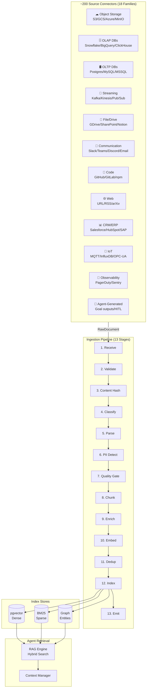
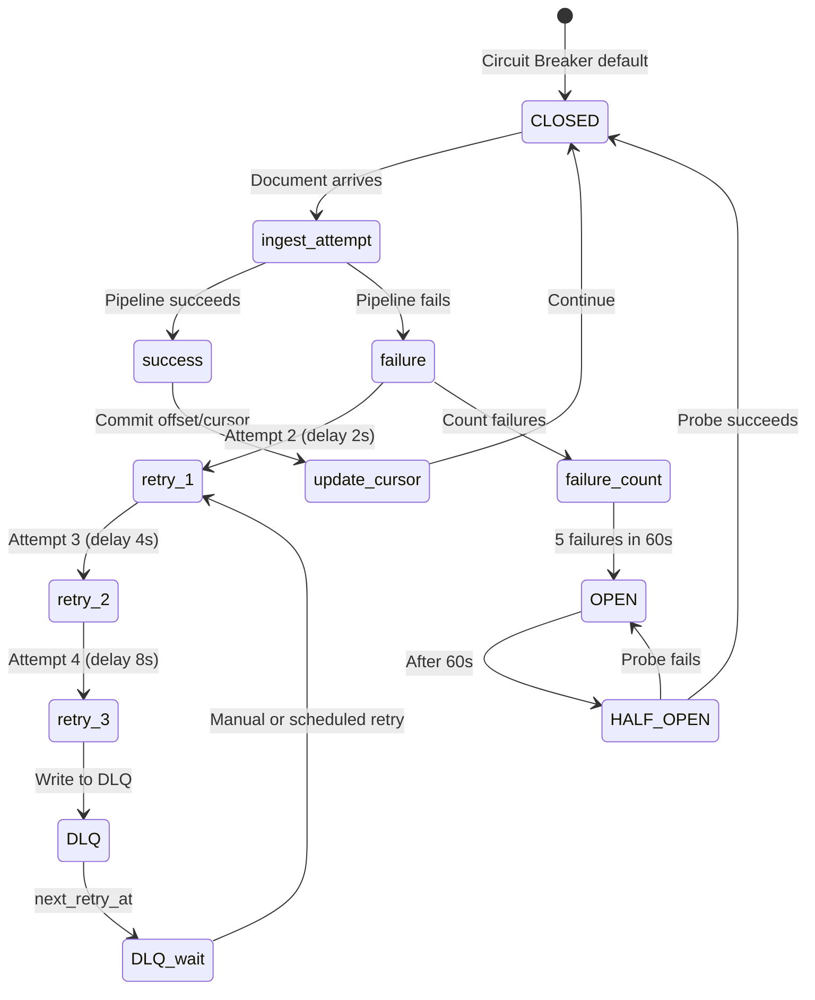

# AgentVerse Knowledge Ingestion System — Complete World-Class Specification

> **Status:** Architecture Design — Ready for Implementation Planning
> **Date:** 2026-08-17
> **Author:** AgentVerse Platform Team
> **Scope:** All ingestion sources (~200 connectors), full pipeline architecture,
>            frontend UX, resilience patterns, scalability, observability
> **Baseline:** 15 connectors/ingestors (7.5% coverage)
> **Target:** ~200 source types across 18 families, unified ingestion pipeline

---

## TABLE OF CONTENTS

**PART 1** — Executive Summary & Vision
**PART 2** — Architecture Principles & Engineering Laws
**PART 3** — Unified Data Model
**PART 4** — Complete Source Taxonomy (~200 sources, 18 families)
**PART 5** — Ingestion Pipeline Architecture (13-stage)
**PART 6** — Connector Interface Contract
**PART 7** — Chunking Strategy Matrix
**PART 8** — Embedding & Indexing Strategy
**PART 9** — Resilience Patterns (12 patterns)
**PART 10** — Scalability Architecture
**PART 11** — Security & Privacy (PII, ACL-aware)
**PART 12** — Observability & Monitoring
**PART 13** — Multi-Tenancy & Quota Management
**PART 14** — Backend API Design (38 endpoints)
**PART 15** — Database Schema
**PART 16** — Frontend UX Architecture
**PART 17** — UI Component System
**PART 18** — Motion & Animation Language
**PART 19** — Source-Family Detail Specifications
**PART 20** — Testing Strategy
**PART 21** — Implementation Roadmap (5 tiers)
**PART 22** — Tradeoffs & Open Questions

---

## PART 1 — Executive Summary & Vision

### 1.1 The Problem

AgentVerse agents are only as good as their knowledge. Today, knowledge reaches
agents through 15 manually-coded connectors (7.5% of all useful sources).
The remaining 92.5% of organisational knowledge — data lakes, streaming systems,
OLAP databases, IoT telemetry, observability systems, CRM/ERP, scientific data,
legal/financial records — is invisible to agents.

### 1.2 The Vision

Every data source in the universe becomes a first-class knowledge source for
AgentVerse agents within one configuration form, without custom code.

```
Any Source → Connector → Pipeline → Vector Store → Agent Context
```

### 1.3 Design Goals

| Goal | Metric |
|------|--------|
| Source coverage | ~200 source types across 18 families |
| Time-to-first-chunk | < 30s for any file-based source |
| Incremental latency | < 5 min from source change → agent visible |
| Deduplication | 100% — content hash prevents any duplicate chunk |
| PII safety | 100% — all content passes PII detection before embedding |
| ACL-aware retrieval | Source permissions propagated to chunk metadata |
| Tenant isolation | RLS at every layer |
| Observability | OTel span per document, Prometheus metric per source type |

### 1.4 Architectural Decision: Unified Pipeline

All sources — regardless of protocol, modality, or frequency — funnel into
one `IngestionPipeline` with a 13-stage processing graph. Connectors are thin
adapters; all intelligence lives in the shared pipeline.

```
┌─────────────────────────────────────────────────────────────┐
│  Source Connector (thin adapter: fetch + normalize)          │
└──────────────────────────┬──────────────────────────────────┘
                           │ RawDocument
┌──────────────────────────▼──────────────────────────────────┐
│  Ingestion Pipeline (13 shared stages)                       │
│  1. Receive → 2. Validate → 3. Classify → 4. Parse          │
│  5. PII Detect → 6. Quality Gate → 7. Chunk                 │
│  8. Enrich → 9. Embed → 10. Deduplicate → 11. Index         │
│  12. Provenance → 13. Emit                                   │
└──────────────────────────┬──────────────────────────────────┘
                           │ IndexedChunks
              ┌────────────┼────────────┐
              ▼            ▼            ▼
         pgvector      BM25 index   Graph nodes
```

---

## PART 2 — Architecture Principles & Engineering Laws

### 2.1 Core Laws (Non-Negotiable)

Every connector and every pipeline stage MUST satisfy:

```
LAW-01  Single pipeline path
        No type-specific goal creation; all sources use IngestionPipeline.ingest()

LAW-02  Idempotency
        Content SHA-256 written before embedding. Duplicate content → skip, not error.

LAW-03  Incremental by default
        Every connector implements get_delta(cursor) → (docs, next_cursor).
        Full re-index is an emergency operation, not normal mode.

LAW-04  Tenant isolation
        tenant_id on every document, chunk, job, cursor. RLS on all tables.

LAW-05  Provenance immutability
        source_url, ingested_at, source_version, author never updated after write.

LAW-06  PII before embedding
        PII detection runs BEFORE text reaches the embedder. Zero PII in vectors.

LAW-07  ACL propagation
        Source permissions encoded in chunk.allowed_roles / chunk.allowed_tenant_users.
        Retrieval API enforces ACL before returning chunks.

LAW-08  Schema-versioned embeddings
        When embedding model changes, all existing chunks are queued for re-embedding.
        Chunks carry embedding_model_id + embedding_model_version.

LAW-09  Priority queue routing
        Celery: enterprise → professional → starter → free queue order.
        Same tasks; different SLAs.

LAW-10  Back-pressure
        Connector scheduler checks ingestion queue depth before enqueuing.
        If depth > PLAN_LIMIT, skip batch until queue drains.

LAW-11  Never block event loop
        All I/O in connectors is async. CPU-bound parsing dispatched to thread pool.

LAW-12  Observability at every stage
        OTel span wraps each pipeline stage. Prometheus counter per (tenant, source_type, stage, result).

LAW-13  No credentials in logs or spans
        Credentials stripped from span attributes. Vault references only.
```

### 2.2 Quality Principles

```
QUALITY-01  Minimum chunk size: 50 tokens (configurable per source type)
QUALITY-02  Language detection before embedding (iso-639 code stored)
QUALITY-03  Confidence scoring: every chunk has quality_score 0–1
QUALITY-04  Freshness TTL per source family (streaming=15min, web=24h, static=7d)
QUALITY-05  Human-in-the-loop gate: low-quality chunks flagged for review
```

### 2.3 Security Principles

```
SEC-01  OAuth2 PKCE for user-facing connectors (Notion, GDrive, Slack, etc.)
SEC-02  Service accounts + Vault for server-side connectors (Snowflake, Kafka, etc.)
SEC-03  Secrets never stored in DB — Vault references only
SEC-04  Webhook HMAC-SHA256 verification before ingestion begins
SEC-05  Content scanning: detect malicious payloads in ingested files
SEC-06  PII redaction with audit trail (what was detected + redacted)
SEC-07  Data residency: per-tenant embedding store region selection
SEC-08  RBAC on ingestion config: admin/developer can create; viewer cannot
```

---

## PART 3 — Unified Data Model

### 3.1 `SourceType` Enum

```python
class SourceFamily(enum.StrEnum):
    OBJECT_STORAGE   = "object_storage"   # S3, GCS, Azure Blob, MinIO
    OLAP_DATABASE    = "olap_database"    # ClickHouse, Snowflake, BigQuery, etc.
    OLTP_DATABASE    = "oltp_database"    # PostgreSQL, MySQL, MSSQL, Oracle
    NOSQL_DATABASE   = "nosql_database"   # MongoDB, DynamoDB, Firestore
    STREAMING        = "streaming"        # Kafka, Pulsar, Kinesis, Pub/Sub
    FILE_SYSTEM      = "file_system"      # Local FS, NFS, SFTP
    DOCUMENT_STORE   = "document_store"   # GDrive, Notion, Confluence, SharePoint
    COMMUNICATION    = "communication"    # Slack, Teams, Discord, Email
    CODE_REPOSITORY  = "code_repository"  # GitHub, GitLab, Bitbucket
    WEB              = "web"              # URL crawl, RSS, Reddit, HN
    CRM_ERP          = "crm_erp"         # Salesforce, HubSpot, SAP
    SUPPORT          = "support"          # Zendesk, Intercom, ServiceNow
    IOT_TELEMETRY    = "iot_telemetry"    # MQTT, InfluxDB, OPC-UA
    OBSERVABILITY    = "observability"    # PagerDuty, Sentry, Grafana
    SCIENTIFIC       = "scientific"       # arXiv, PubMed, FHIR
    GRAPH_DATABASE   = "graph_database"   # Neo4j, Neptune, TigerGraph
    VECTOR_DATABASE  = "vector_database"  # Pinecone, Weaviate, Qdrant (as source)
    AGENT_GENERATED  = "agent_generated"  # Goal outputs, HITL decisions, learnings
```

### 3.2 `SourceConfig` Dataclass

```python
@dataclass
class SourceConfig:
    # Identity
    source_id:         str                    # UUID
    tenant_id:         str
    name:              str                    # Human display name
    family:            SourceFamily
    source_type:       str                    # e.g. "snowflake", "s3", "kafka"
    enabled:           bool = True

    # Connection (all secrets as vault:// references)
    connection_config: dict = field(default_factory=dict)
    # e.g. {"host": "...", "db": "...", "credentials": "vault://tenant/snowflake"}

    # Sync policy
    sync_mode:         str = "incremental"    # full | incremental | streaming
    sync_interval_seconds: int = 3600         # poll interval for pull-based
    cursor_field:      str = ""               # for incremental (e.g. "updated_at")
    cursor_value:      str = ""               # last known cursor position

    # Content filtering
    include_patterns:  list[str] = field(default_factory=list)  # glob/regex
    exclude_patterns:  list[str] = field(default_factory=list)
    max_doc_size_bytes: int = 10_485_760      # 10 MB default

    # Processing policy
    chunking_strategy: str = "auto"          # auto | fixed | semantic | ast | etc.
    chunk_size_tokens: int = 512
    chunk_overlap_tokens: int = 64
    embedding_model:   str = "auto"          # auto | text-embedding-3-large | etc.
    language_hint:     str = ""              # BCP-47 (blank = auto-detect)

    # Access control
    inherit_source_acl: bool = True          # carry source ACL to chunks
    allowed_roles:     list[str] = field(default_factory=list)
    allowed_user_ids:  list[str] = field(default_factory=list)

    # Quality
    min_quality_score: float = 0.3
    pii_action:        str = "redact"        # redact | reject | allow
    freshness_ttl_seconds: int = 86400       # 24h default

    # Metadata
    tags:              list[str] = field(default_factory=list)
    collection_id:     str = ""              # target knowledge collection
    created_at:        str = ""
    updated_at:        str = ""
    last_synced_at:    str | None = None
    total_docs_indexed: int = 0
    total_chunks:      int = 0
    version:           int = 1
```

### 3.3 `RawDocument` (connector output)

```python
@dataclass
class RawDocument:
    doc_id:         str          # source-assigned unique ID
    source_id:      str          # SourceConfig.source_id
    tenant_id:      str
    content:        bytes        # raw bytes
    content_type:   str          # MIME type
    title:          str = ""
    source_url:     str = ""
    author:         str = ""
    created_at:     str = ""
    modified_at:    str = ""
    version:        str = ""
    language:       str = ""
    metadata:       dict = field(default_factory=dict)
    acl:            list[str] = field(default_factory=list)   # allowed principals
    content_hash:   str = ""     # SHA-256; populated by pipeline
```

### 3.4 `IngestionJob` (tracking)

```python
@dataclass
class IngestionJob:
    job_id:         str
    source_id:      str
    tenant_id:      str
    status:         str      # pending | running | completed | failed | paused
    sync_mode:      str      # full | incremental | streaming
    started_at:     str | None = None
    completed_at:   str | None = None
    docs_discovered: int = 0
    docs_skipped:    int = 0   # dedup hit
    docs_failed:     int = 0
    docs_indexed:    int = 0
    chunks_created:  int = 0
    error_message:   str = ""
    cursor_before:   str = ""
    cursor_after:    str = ""
    triggered_by:    str = ""  # scheduler | webhook | manual | trigger_id
```

### 3.5 `IndexedChunk` (extends existing `Chunk`)

```python
@dataclass
class IndexedChunk(Chunk):
    # Provenance
    source_id:              str = ""
    source_type:            str = ""
    source_url:             str = ""
    doc_id:                 str = ""
    doc_title:              str = ""
    doc_author:             str = ""
    doc_modified_at:        str = ""
    doc_version:            str = ""
    chunk_index:            int = 0
    total_chunks_in_doc:    int = 0
    # Access control
    acl:                    list[str] = field(default_factory=list)
    # Quality
    quality_score:          float = 1.0
    language:               str = "en"
    has_pii_redacted:       bool = False
    # Versioning
    embedding_model_id:     str = ""
    embedding_model_version: str = ""
    content_hash:           str = ""
    # Freshness
    ingested_at:            str = ""
    expires_at:             str | None = None
```

---

## PART 4 — Complete Source Taxonomy (~200 sources, 18 Families)

### Family 1: Object Storage (10 sources)

| Source | Sync Mode | Formats | Auth | Gap |
|--------|-----------|---------|------|-----|
| **AWS S3** | Event (S3 notifications) + Incremental list | Any file format | IAM Role / Access Key | ❌ MISSING |
| **Google Cloud Storage** | Pub/Sub notifications + list | Any file format | Service Account / OAuth2 | ❌ MISSING |
| **Azure Blob Storage** | Event Grid + list | Any file format | Managed Identity / SAS | ❌ MISSING |
| **MinIO** | Webhook (bucket notification) + list | Any file format | Access Key | ❌ MISSING |
| **Cloudflare R2** | S3-compatible | Any file format | API Token | ❌ MISSING |
| **Backblaze B2** | Event-based + list | Any file format | App Key | ❌ MISSING |
| **Wasabi** | S3-compatible | Any file format | Access Key | ❌ MISSING |
| **Delta Lake** | Time-travel CDF | Parquet + metadata | Cloud auth | ❌ MISSING |
| **Apache Iceberg** | Snapshot incremental | Parquet + Avro + ORC | Catalog auth | ❌ MISSING |
| **Apache Hudi** | CDC commit timeline | Parquet | Cloud auth | ❌ MISSING |

**Incremental strategy:** S3 uses `ListObjectsV2` with `StartAfter` cursor keyed on `LastModified`. Delta/Iceberg use native snapshot IDs.

---

### Family 2: OLAP / Analytics Databases (18 sources)

| Source | Sync Mode | Protocol | What to Extract | Gap |
|--------|-----------|---------|----------------|-----|
| **ClickHouse** | Materialized view delta | HTTP + native | Tables, aggregations | ❌ MISSING |
| **Apache Druid** | Segment metadata + SQL | REST SQL | Segment summaries | ❌ MISSING |
| **Apache Pinot** | Segment-level delta | REST | Real-time OLAP answers | ❌ MISSING |
| **DuckDB** | Full scan + checkpoint | in-process | Local Parquet/CSV analytics | ❌ MISSING |
| **Apache Spark** | DataFrame export | PySpark | Batch transforms | ❌ MISSING |
| **Trino / Presto** | SQL federation | JDBC | Cross-source queries | ❌ MISSING |
| **StarRocks** | CDC + snapshot | MySQL wire | Sub-second OLAP | ❌ MISSING |
| **QuestDB** | REST range queries | REST | Time-series ranges | ❌ MISSING |
| **TimescaleDB** | Continuous aggregates | PostgreSQL wire | Hypertable summaries | ❌ MISSING |
| **Databricks** | Delta Live Table feed | DBFS + Delta | Lakehouse tables | ❌ MISSING |
| **Firebolt** | Snapshot query | REST SQL | Cloud OLAP results | ❌ MISSING |
| **Amazon Redshift** | Unload + COPY | PostgreSQL wire | Data warehouse | ❌ MISSING |
| **BigQuery** | Storage Read API + incremental | REST + gRPC | GCP data warehouse | ❌ MISSING |
| **Snowflake** | Streams + Tasks | REST / Snowpark | Cloud data warehouse | ❌ MISSING |
| **Azure Synapse** | Delta + SQL | SQL / REST | Azure data warehouse | ❌ MISSING |
| **Amazon Athena** | Result pagination | REST | Serverless S3 SQL | ❌ MISSING |
| **Google Looker** | Explore API | REST | BI semantic layer | ❌ MISSING |
| **dbt** | Artifacts (manifest.json) | File | Model docs + lineage | ❌ MISSING |

**Incremental strategy:** Most use `WHERE updated_at > :cursor` with `ORDER BY updated_at` for pagination. Snowflake/BigQuery use native CDC streams. Databricks uses Delta table versions.

---

### Family 3: Streaming / Message Systems (14 sources)

| Source | Consumer Model | Format | Gap |
|--------|---------------|--------|-----|
| **Apache Kafka** | Consumer group, offset commit | Avro/JSON/Protobuf | PARTIAL (trigger only) |
| **Confluent Platform** | Kafka + Schema Registry | Avro + Schema evolution | ❌ MISSING |
| **Apache Pulsar** | Subscription + ack | Any | ❌ MISSING |
| **RabbitMQ** | Queue consumer + ack | Any | ❌ MISSING |
| **NATS JetStream** | Consumer + sequence | Any | ❌ MISSING |
| **AWS Kinesis Data Streams** | Shard iterator | JSON | ❌ MISSING |
| **AWS Kinesis Firehose** | S3 delivery → watch | JSON/Parquet | ❌ MISSING |
| **AWS SQS** | Long-poll + delete | JSON | ❌ MISSING |
| **AWS SNS → SQS fan-out** | SQS consumer | JSON | ❌ MISSING |
| **Azure Service Bus** | AMQP consumer + complete | Any | ❌ MISSING |
| **Azure Event Grid** | Webhook push | CloudEvents | ❌ MISSING |
| **Google Pub/Sub** | Pull + ack | Any | ❌ MISSING |
| **Redpanda** | Kafka-compatible | Any | ❌ MISSING |
| **Memphis.dev** | REST + Kafka compat | Any | ❌ MISSING |

**Exactly-once pattern:** Consumer commits offset only after `IngestionPipeline.ingest()` returns success. Idempotency key = `{source_id}:{partition}:{offset}`.

---

### Family 4: OLTP / Relational Databases (14 sources)

| Source | CDC Method | Deduplication |
|--------|-----------|--------------|
| **PostgreSQL** | `pg_notify` + logical replication (pgoutput) | `{schema}.{table}.{pk}` |
| **MySQL / MariaDB** | Binlog (Debezium) | `{db}.{table}.{pk}` |
| **Microsoft SQL Server** | CDC / CT tables | `{schema}.{table}.{pk}` |
| **Oracle Database** | LogMiner / Oracle GoldenGate | `{schema}.{table}.{pk}` |
| **IBM DB2** | CDC via Q-Replication | `{schema}.{table}.{pk}` |
| **CockroachDB** | Changefeed (Avro/JSON) | `{db}.{table}.{pk}` |
| **PlanetScale** | Vitess CDC + branch API | `{keyspace}.{table}.{pk}` |
| **Neon** | Logical replication | PostgreSQL CDC |
| **Supabase** | Realtime (PostgreSQL replication) | PostgreSQL CDC |
| **TiDB** | TiCDC (row-level) | `{db}.{table}.{pk}` |
| **YugabyteDB** | CDC API | `{db}.{table}.{pk}` |
| **SingleStore** | Binlog | `{db}.{table}.{pk}` |
| **SQLite** | File-watch + WAL read | `{table}.{pk}` |
| **DynamoDB** | DynamoDB Streams | `{table}.{pk}` (NoSQL crossover) |

**Row-to-text strategy:** Column values serialized to sentence pairs: `"The {table} record with id {pk}: {col1} is {val1}, {col2} is {val2}..."`. Schema-aware templates configurable per table.

---

### Family 5: NoSQL / Document Databases (9 sources)

| Source | Incremental | Format |
|--------|------------|--------|
| **MongoDB** | Change streams | BSON/JSON |
| **CouchDB** | Changes feed (`_changes`) | JSON |
| **FaunaDB** | Event streaming | JSON |
| **DynamoDB** | DynamoDB Streams | JSON |
| **Cassandra / Scylla** | CDC + tombstone filter | CQL rows |
| **HBase** | Replication endpoint | Cells |
| **Firestore** | Realtime listeners | JSON |
| **Azure Cosmos DB** | Change feed processor | JSON |
| **RavenDB** | Changes API | JSON |

---

### Family 6: Key-Value / Cache Stores (6 sources)

| Source | Method | What |
|--------|--------|------|
| **Redis** | Keyspace notifications | Config, feature flags, KV state |
| **Redis Stack** | JSON module changes | Structured documents |
| **etcd** | Watch API | Kubernetes configs, service registry |
| **Zookeeper** | Watch API | Distributed configs |
| **Consul KV** | Watch API | Service configs, health checks |
| **Vault KV** | Audit log (metadata only, never secrets) | Secret path structure |

---

### Family 7: Graph Databases (7 sources)

| Source | Export Method | Format |
|--------|--------------|--------|
| **Neo4j** | Cypher stream / APOC export | Nodes + relationships → sentence pairs |
| **Amazon Neptune** | SPARQL / Gremlin export | RDF triples |
| **TigerGraph** | REST API + GSQL | Graph patterns |
| **Memgraph** | Bolt + Kafka Streams | Graph events |
| **Dgraph** | GraphQL / DQL | JSON graph |
| **ArangoDB** | REST + AQL | Multi-model (doc + graph) |
| **FalkorDB** | Redis-compatible | Cypher queries |

**Triple-to-text strategy:** `(subject) –[predicate]→ (object)` rendered as: `"{subject} {predicate} {object}."` One chunk per N triples with overlap.

---

### Family 8: Search / Vector Databases (as source) (12 sources)

These are also ingestion targets but can be sources when migrating or federating:

| Source | Protocol |
|--------|---------|
| **Elasticsearch** | Scroll / PIT API |
| **OpenSearch** | Same as Elasticsearch |
| **Solr** | Cursor-based export |
| **Algolia** | Browse API |
| **Typesense** | Export API |
| **Meilisearch** | Dump / export |
| **Pinecone** | Fetch API (batch) |
| **Weaviate** | GraphQL export |
| **Qdrant** | REST scroll |
| **Chroma** | Collection export |
| **Milvus / Zilliz** | SDK batch fetch |
| **pgvector** | SQL `SELECT` |

---

### Family 9: File Sync / Drive Systems (11 sources)

| Source | Incremental | Auth | Gap |
|--------|------------|------|-----|
| **Google Drive** | Drive API changes feed | OAuth2 PKCE | ✅ EXISTS (needs delta) |
| **Google Docs** | Docs API revision history | OAuth2 | ❌ MISSING |
| **Google Sheets** | Sheets API value ranges | OAuth2 | ❌ MISSING |
| **Google Slides** | Slides API | OAuth2 | ❌ MISSING |
| **OneDrive** | Graph API delta token | OAuth2 PKCE | ❌ MISSING |
| **SharePoint** | Delta feed | OAuth2 | ✅ EXISTS |
| **Dropbox** | Delta cursor + webhooks | OAuth2 PKCE | ❌ MISSING |
| **Box** | Events API + webhooks | OAuth2 PKCE | ❌ MISSING |
| **Nextcloud** | WebDAV + Activity feed | OAuth2 / Basic | ❌ MISSING |
| **Seafile** | Events API | API Token | ❌ MISSING |
| **iCloud Drive** | CloudKit + WebDAV | OAuth2 | ❌ MISSING |

---

### Family 10: Communication & Collaboration (14 sources)

| Source | What to Ingest | Gap |
|--------|---------------|-----|
| **Slack** | Messages, threads, reactions, files | ✅ EXISTS |
| **Microsoft Teams** | Messages, channels, meeting transcripts | ❌ MISSING |
| **Discord** | Server messages, threads, forum posts | ❌ MISSING |
| **Email (IMAP)** | Thread + reply chains, attachments | ✅ EXISTS |
| **Gmail** | Labels + filters, full thread | ❌ MISSING |
| **Outlook 365** | Graph API, conversation threads | ❌ MISSING |
| **Zoom** | Meeting transcripts, recordings | ❌ MISSING |
| **Google Meet** | Meeting transcripts | ❌ MISSING |
| **Loom** | Video summaries + transcripts | ❌ MISSING |
| **Linear** | Issues, comments, projects | ❌ MISSING |
| **Asana** | Tasks, projects, comments | ❌ MISSING |
| **Monday.com** | Boards, items, updates | ❌ MISSING |
| **Trello** | Cards, lists, comments | ❌ MISSING |
| **Notion** | Pages, databases, comments | ✅ EXISTS |

---

### Family 11: Code & Developer Systems (14 sources)

| Source | What | Gap |
|--------|------|-----|
| **GitHub** | Code (AST), Issues, PRs, Discussions, Wiki | ✅ EXISTS (code only) |
| **GitLab** | Same as GitHub | ❌ MISSING |
| **Bitbucket** | Same as GitHub | ❌ MISSING |
| **GitHub Issues & PRs** | Decision history, resolution notes | ❌ MISSING |
| **Stack Overflow** | Q&A pairs, accepted answers | ❌ MISSING |
| **npm / PyPI / Maven** | Package README, CHANGELOG, types | ❌ MISSING |
| **OpenAPI / Swagger specs** | Schema-aware tool descriptions | ❌ MISSING |
| **Jupyter Notebooks** | Cell-by-cell (code + output) chunking | ❌ MISSING |
| **Terraform / Bicep** | IaC → infrastructure knowledge | ❌ MISSING |
| **Kubernetes manifests** | YAML → intent extraction | ❌ MISSING |
| **Postman collections** | API usage patterns | ❌ MISSING |
| **Backstage** | Software catalogue | ❌ MISSING |
| **ReadTheDocs / Sphinx** | Generated docs | ❌ MISSING |
| **ADRs (markdown)** | Architecture decisions | ❌ MISSING |

---

### Family 12: Web & Internet (16 sources)

| Source | Method | Rate Limit Strategy |
|--------|--------|-------------------|
| **Arbitrary URL crawl** | trafilatura + sitemap | robots.txt + polite delay |
| **RSS / Atom feeds** | Feed polling | Delta by entry ID |
| **Twitter/X** | v2 filtered stream | API rate caps |
| **Reddit** | PRAW + pushshift | 60 req/min |
| **Hacker News** | Algolia API + Firebase | No auth required |
| **YouTube transcripts** | youtube-transcript-api | Per-video |
| **Medium** | RSS + public scrape | Per-post |
| **Substack** | RSS | Per-newsletter |
| **Dev.to** | REST API | 10 req/min |
| **Wikipedia** | MediaWiki API + dumps | Bulk weekly + delta |
| **arXiv** | OAI-PMH daily harvest | Backfill + daily |
| **PubMed** | E-utilities API | 10 req/s with key |
| **Common Crawl** | WARC files on S3 | Batch job only |
| **Internet Archive** | Wayback CDX API | Per-URL |
| **GitHub Trending** | REST API | Hourly cache |
| **Podcast RSS** | RSS + Whisper transcription | Per-episode |

---

### Family 13: CRM / ERP / Sales (16 sources)

| Source | What to Extract | Auth |
|--------|----------------|------|
| **Salesforce** | Objects: Contact, Account, Opportunity, Case, Note, Activity | OAuth2 PKCE |
| **HubSpot** | Contacts, Companies, Deals, Tickets, Engagements | OAuth2 |
| **Pipedrive** | Deals, Notes, Activities, Persons | API Token / OAuth2 |
| **Zoho CRM** | Records, Modules, Notes | OAuth2 |
| **SAP** | Business objects (BAPI/OData) | SSO / SAML |
| **Oracle ERP** | REST / SOAP modules | SAML |
| **Workday** | Job descriptions, org chart | OAuth2 |
| **BambooHR** | Handbook, policies, org chart | API Key |
| **ADP** | Compliance documents | OAuth2 |
| **Greenhouse** | Job descriptions, interview guides | API Key |
| **Lever** | Job posts, scorecards | API Key |
| **Monday.com** | CRM boards | API Key |
| **QuickBooks** | Chart of accounts, products | OAuth2 |
| **Xero** | Account descriptions, contacts | OAuth2 |
| **Stripe** | Product catalog, pricing, invoice notes | API Key |
| **NetSuite** | ERP modules | TBA token |

---

### Family 14: Customer Support (8 sources)

| Source | What |
|--------|------|
| **Zendesk** | Tickets, Comments, Help Center articles, macros |
| **Intercom** | Conversations, Articles, Company notes |
| **Freshdesk** | Tickets, Solution articles |
| **Help Scout** | Conversations, Docs |
| **ServiceNow** | Incidents, KB articles, CMDB, runbooks |
| **Jira Service Mgmt** | Tickets, SLA records |
| **Gorgias** | E-commerce support conversations |
| **Kustomer** | CRM + support history |

---

### Family 15: IoT / Edge / Telemetry (11 sources)

| Source | Protocol | Data Model |
|--------|----------|-----------|
| **MQTT broker** | MQTT v3/v5 | Topic → time-windowed aggregation |
| **OPC-UA** | Binary TCP | Tag → time-series summary |
| **Modbus** | TCP/RTU | Register maps → reading summaries |
| **InfluxDB** | Line protocol + Flux | Measurement windows |
| **Prometheus remote_write** | Protobuf | Metric names + label sets |
| **AWS IoT Core** | MQTT + Shadow | Device state history |
| **Azure IoT Hub** | AMQP / MQTT | Device telemetry |
| **Google Cloud IoT** | MQTT | Device data |
| **Thingsboard** | REST + MQTT | IoT platform readings |
| **Home Assistant** | REST + WebSocket | Smart home state events |
| **InfluxDB 3.0** | Flight SQL | Time-series ranges |

---

### Family 16: Observability & Operations (8 sources)

| Source | What to Index |
|--------|--------------|
| **PagerDuty** | Incident history, resolution notes, runbooks |
| **Sentry** | Error patterns, stack traces, issue context |
| **Grafana** | Dashboard panel descriptions, alert rules |
| **Datadog** | Monitor descriptions, logs, APM summaries |
| **OpsGenie** | Runbooks, on-call schedules |
| **CloudWatch** | Log groups, alarm descriptions |
| **OpenTelemetry** | Span patterns, service topology |
| **Jaeger** | Distributed trace summaries |

---

### Family 17: Scientific & Regulatory (14 sources)

| Source | Protocol | Domain |
|--------|----------|--------|
| **arXiv** | OAI-PMH | CS, Physics, Math papers |
| **PubMed / MEDLINE** | E-utilities | Biomedical |
| **Semantic Scholar** | REST API | Citations + abstracts |
| **CrossRef** | REST API | DOI metadata |
| **Zenodo** | REST API | Open research data |
| **FHIR R4** | REST | Healthcare records |
| **SNOMED CT** | FHIR Terminology | Medical terms |
| **SEC EDGAR** | EDGAR full-text | Financial filings (10-K, 10-Q) |
| **USPTO** | OAI-PMH | Patent texts |
| **EUR-Lex** | REST | EU regulations |
| **CourtListener** | REST API | Case law |
| **Wikidata** | SPARQL | Entity triples |
| **DBpedia** | SPARQL | RDF |
| **Gene Ontology** | OBO | Biological ontologies |

---

### Family 18: Agent-Generated Knowledge (6 source types)

This family is unique to AgentVerse — agents themselves produce knowledge:

| Source | What | Trigger |
|--------|------|---------|
| **Goal outputs** | Agent-produced artifacts, reports, analysis | `goal.completed` event |
| **HITL decisions** | Human-approved answers — highest quality | HITL approval event |
| **Execution traces** | Tool call patterns, error resolutions | `goal.completed` |
| **Agent evaluations** | Score + rationale → quality-weighted KB | Eval completion |
| **Self-reflection** | LongTermMemoryStore learnings | Memory creation event |
| **User corrections** | Explicit negative → positive feedback pairs | User feedback API |

---

## PART 5 — Ingestion Pipeline Architecture (13 Stages)

```
                    ┌─────────────────────────────────────────────┐
                    │         Connector Adapter Layer              │
                    │  (thin: fetch, normalize → RawDocument)      │
                    └────────────────┬────────────────────────────┘
                                     │ RawDocument
                    ┌────────────────▼────────────────────────────┐
                    │  Stage 1: RECEIVE                            │
                    │  • Validate tenant quota                     │
                    │  • Accept or reject based on plan limits     │
                    │  • Emit span: ingestion.receive              │
                    └────────────────┬────────────────────────────┘
                                     │
                    ┌────────────────▼────────────────────────────┐
                    │  Stage 2: VALIDATE                           │
                    │  • MIME type check                           │
                    │  • Max file size enforcement                 │
                    │  • Malware/content scan (ClamAV / custom)   │
                    │  • Webhook signature verify (if applicable) │
                    └────────────────┬────────────────────────────┘
                                     │
                    ┌────────────────▼────────────────────────────┐
                    │  Stage 3: CONTENT HASH CHECK                 │
                    │  • SHA-256(content)                         │
                    │  • Check `indexed_documents` table          │
                    │  • If exists and not stale → SKIP           │
                    │  • Early exit: 0 embeddings consumed        │
                    └────────────────┬────────────────────────────┘
                                     │
                    ┌────────────────▼────────────────────────────┐
                    │  Stage 4: CLASSIFY                           │
                    │  • ContentClassifier → ContentType          │
                    │  • Language detection (langdetect / fastText)│
                    │  • Content category (code/prose/table/etc.) │
                    └────────────────┬────────────────────────────┘
                                     │
                    ┌────────────────▼────────────────────────────┐
                    │  Stage 5: PARSE                              │
                    │  • ParserRegistry.get(content_type)         │
                    │  • Structured text extraction                │
                    │  • Metadata extraction                       │
                    │  • Image/table/code block identification     │
                    └────────────────┬────────────────────────────┘
                                     │
                    ┌────────────────▼────────────────────────────┐
                    │  Stage 6: PII DETECTION & REDACTION          │
                    │  • Presidio analyzer: PERSON, EMAIL, PHONE, │
                    │    CREDIT_CARD, SSN, IP_ADDR, MEDICAL        │
                    │  • Action: redact | reject | allow           │
                    │  • Audit log: what was detected              │
                    └────────────────┬────────────────────────────┘
                                     │
                    ┌────────────────▼────────────────────────────┐
                    │  Stage 7: QUALITY GATE                       │
                    │  • Min token count check                     │
                    │  • Gibberish detection                       │
                    │  • Duplicate paragraph filter               │
                    │  • Quality score computation 0–1            │
                    │  • Below threshold → DLQ + flag for review   │
                    └────────────────┬────────────────────────────┘
                                     │
                    ┌────────────────▼────────────────────────────┐
                    │  Stage 8: CHUNK                              │
                    │  • ChunkingStrategySelector.select()        │
                    │  • Strategy: fixed | semantic | ast |        │
                    │    heading | table | timestamp | scene |     │
                    │    parent-child | late | sentence-window     │
                    └────────────────┬────────────────────────────┘
                                     │
                    ┌────────────────▼────────────────────────────┐
                    │  Stage 9: CONTEXTUAL ENRICHMENT              │
                    │  • ContextualEnricher: prepend doc summary  │
                    │  • Metadata injection                        │
                    │  • Entity extraction (NER)                   │
                    │  • Keyword extraction (KeyBERT / YAKE)      │
                    └────────────────┬────────────────────────────┘
                                     │
                    ┌────────────────▼────────────────────────────┐
                    │  Stage 10: EMBED                             │
                    │  • EmbeddingPolicySelector.select()         │
                    │  • Model: text-embedding-3-large (default)  │
                    │  • Batch up to 512 chunks per API call       │
                    │  • Retry w/ exponential backoff              │
                    │  • Cost tracking per tenant                  │
                    └────────────────┬────────────────────────────┘
                                     │
                    ┌────────────────▼────────────────────────────┐
                    │  Stage 11: CHUNK-LEVEL DEDUPLICATION         │
                    │  • SHA-256(chunk_text) → check per collection│
                    │  • Near-duplicate: cosine similarity > 0.98 │
                    │  • Exact duplicate: skip write               │
                    └────────────────┬────────────────────────────┘
                                     │
                    ┌────────────────▼────────────────────────────┐
                    │  Stage 12: INDEX                             │
                    │  • Write to pgvector (primary)              │
                    │  • Write to BM25 index (keyword)            │
                    │  • Write to graph (entities + relations)    │
                    │  • Update `indexed_documents` cursor        │
                    └────────────────┬────────────────────────────┘
                                     │
                    ┌────────────────▼────────────────────────────┐
                    │  Stage 13: EMIT & PROVENANCE                 │
                    │  • Write IngestionJob completion             │
                    │  • Emit `knowledge.ingested` Redis event     │
                    │  • Update SourceConfig.last_synced_at        │
                    │  • Emit OTel span close                      │
                    │  • Increment Prometheus counters             │
                    └─────────────────────────────────────────────┘
```

---

## PART 6 — Connector Interface Contract

```python
from abc import ABC, abstractmethod
from typing import AsyncIterator

class BaseConnector(ABC):
    """Every connector MUST implement this contract."""

    @abstractmethod
    async def validate_connection(self, config: SourceConfig) -> ConnectionHealth:
        """Test connectivity + auth. Called during source creation."""

    @abstractmethod
    async def get_delta(
        self,
        config: SourceConfig,
        cursor: str | None,
    ) -> AsyncIterator[tuple[RawDocument, str]]:
        """
        Yield (document, new_cursor) tuples.
        cursor=None means full initial sync.
        Yields in source-modified-at ascending order.
        MUST be resumable: if interrupted, resume from last yielded cursor.
        """

    @abstractmethod
    def estimate_doc_count(self, config: SourceConfig) -> int | None:
        """Return estimated total docs for progress reporting. None = unknown."""

    # ── Optional overrides ───────────────────────────────────────

    async def on_webhook(
        self,
        config: SourceConfig,
        payload: bytes,
        headers: dict,
    ) -> AsyncIterator[RawDocument]:
        """Handle real-time push events (webhooks). Default: NotImplemented."""
        raise NotImplementedError

    async def get_acl(
        self,
        config: SourceConfig,
        doc_id: str,
    ) -> list[str]:
        """Return allowed principals for a document. Default: tenant-wide."""
        return []

    async def delete_doc(
        self,
        config: SourceConfig,
        doc_id: str,
    ) -> None:
        """Handle source-side deletions. Default: no-op."""
        pass

    @property
    @abstractmethod
    def source_type(self) -> str:
        """e.g. 's3', 'snowflake', 'kafka'"""

    @property
    def supports_streaming(self) -> bool:
        return False

    @property
    def supports_acl_propagation(self) -> bool:
        return False

    @property
    def supports_deletion_tracking(self) -> bool:
        return False


@dataclass
class ConnectionHealth:
    ok: bool
    latency_ms: float
    error: str = ""
    metadata: dict = field(default_factory=dict)
    # e.g. {"bucket": "my-bucket", "region": "us-east-1", "doc_count_estimate": 12000}
```

---

## PART 7 — Chunking Strategy Matrix

| Content Type | Strategy | Rationale |
|-------------|---------|-----------|
| **Prose / articles** | Semantic (sentence-transformer boundary) | Preserve semantic coherence |
| **Markdown / MDX** | Heading-based | Natural structure |
| **Code** | AST (language-aware) | Function/class boundaries |
| **PDF (text)** | Heading + layout | Preserve visual structure |
| **PDF (scanned/OCR)** | Fixed + layout analysis | No structure available |
| **HTML** | DOM node semantic | `<article>`, `<section>` aware |
| **Database rows** | Row batching | N rows per chunk, overlapping column summary |
| **JSON / JSONL** | Schema-inferred | Object per chunk; array batching |
| **CSV / Excel** | Row batching + column description | Schema header + N rows |
| **Jupyter notebooks** | Cell-pair (code + output) | Code cell + its output |
| **OpenAPI specs** | Operation-level | One endpoint + schema per chunk |
| **ADRs** | Section-based | Decision/context/consequences |
| **Emails** | Thread-level | Full thread = one unit; reply-chain overlap |
| **Audio transcripts** | Timestamp-windowed | 60-second windows, 10-second overlap |
| **Video transcripts** | Scene-based | Shot boundary detection |
| **Graph triples** | N-triple batches | 20 triples per chunk |
| **Time-series** | Window aggregate | 1-hour window → statistical summary |
| **Log lines** | Pattern group | 50 similar lines batched |
| **IaC (Terraform/YAML)** | Resource-block | One resource definition per chunk |

---

## PART 8 — Embedding & Indexing Strategy

### 8.1 Embedding Model Routing

```
Content Type     →  Model
───────────────────────────────────────────────────────
English prose    →  text-embedding-3-large (1536d)
Code             →  voyage-code-2 (1536d)
Multilingual     →  multilingual-e5-large (1024d)
Short labels     →  text-embedding-3-small (512d)
Medical/legal    →  pubmedbert-embeddings (768d)  [domain-specific]
Images           →  CLIP (512d)                   [multimodal]
```

### 8.2 Index Targets

| Index | Technology | Purpose |
|-------|-----------|---------|
| **Vector (dense)** | pgvector (IVFFlat + HNSW) | Semantic similarity |
| **Keyword (sparse)** | BM25 (Tantivy via pg_bm25) | Exact term matching |
| **Knowledge graph** | NetworkX + neo4j (optional) | Entity relationships |
| **Summary index** | pgvector (doc-level embeddings) | RAPTOR tree levels |

### 8.3 Re-embedding Trigger

When `embedding_model_id` changes:
1. All existing chunks for tenant queued to `reembedding_jobs` table
2. Celery batch job processes in background
3. New chunks served until old ones replaced
4. Progress visible in UI

---

## PART 9 — Resilience Patterns (12 Patterns)

### R-01: Exponential Backoff with Jitter

```python
# Applied to: all connector HTTP calls, embedding API calls
initial_delay = 1.0
max_delay = 60.0
max_attempts = 5
jitter = random.uniform(0, 0.5)
delay = min(initial_delay * (2 ** attempt) + jitter, max_delay)
```

### R-02: Circuit Breaker (per connector type per tenant)

```
State: CLOSED → OPEN (after 5 failures in 60s) → HALF_OPEN → CLOSED
When OPEN: reject new ingestion jobs for this source, surface in UI as "paused"
Metric: agentverse_ingestion_circuit_state{source_type, tenant_id}
```

### R-03: Bulkhead (per tenant concurrency cap)

```python
PLAN_CONCURRENT_INGESTION_JOBS = {
    "free": 1,
    "starter": 3,
    "professional": 10,
    "enterprise": 50,
}
```

### R-04: Dead Letter Queue (DLQ)

```
3 retries → DLQ table with:
  - raw document bytes
  - failure stage
  - error message + stack
  - retry_count
  - next_retry_at (exponential backoff)
UI: DLQ panel with per-source failed doc list, retry / dismiss actions
```

### R-05: Rate Limiting (per source type per tenant)

```python
PLAN_INGESTION_RATE_LIMITS = {
    "free":         {"docs_per_hour": 100,    "mb_per_hour": 50},
    "starter":      {"docs_per_hour": 1_000,  "mb_per_hour": 500},
    "professional": {"docs_per_hour": 10_000, "mb_per_hour": 5_000},
    "enterprise":   {"docs_per_hour": None,   "mb_per_hour": None},
}
```

### R-06: Idempotency (content-hash deduplication)

```
SHA-256(normalized_text) → indexed_documents.content_hash (UNIQUE)
On collision → skip embedding, update `last_seen_at`
Near-dedup: cosine(new_embedding, existing) > 0.98 → skip
```

### R-07: Cursor-Based Resumable Sync

```
Every connector stores cursor in source_configs.cursor_value
If job crashes → resume from cursor, not from beginning
Cursor format per source:
  S3:        "2026-08-17T10:00:00Z"   (LastModified)
  Kafka:     "partition:12:offset:9876"
  Snowflake: "2026-08-17T10:00:00.000Z"
  MongoDB:   "{'_data': '...resume_token...'}"
```

### R-08: Graceful Degradation

```
If embedder unavailable → buffer docs in `pending_embedding` table
If pgvector unavailable → write to fallback in-memory store
If BM25 index unavailable → serve vector-only results with warning
Agents always get a response; quality degrades gracefully
```

### R-09: Back-Pressure Control

```
Before enqueuing batch:
  1. Check Celery queue depth for tenant
  2. Check tenant's concurrent_ingestion_jobs count
  3. If either > threshold → defer batch by 5 minutes
  4. Surface in UI as "throttled"
Prevents ingestion storms from starving agent execution queues
```

### R-10: Schema Version Migration

```
When embedding model changes:
  1. New model_version written to source_configs
  2. All existing chunks tagged needs_reembedding = true
  3. Background job processes in priority order
  4. Old chunks still served during migration
  5. Progress bar in UI
```

### R-11: Webhook Signature Verification

```
All push-based sources (S3 events, Kafka webhooks, etc.):
  - HMAC-SHA256 verification before pipeline entry
  - Reject with 401 if invalid
  - No partial processing on tampered payloads
```

### R-12: Timeouts at Every Boundary

```
Connector HTTP call:          30s
Parser (CPU-bound):           60s (via thread pool)
PII detection:               10s
Embedding API call:           30s per batch
Single stage timeout:         120s
Full document pipeline:       300s
Connector initial sync:       24h (long-running Celery task)
```

---

## PART 10 — Scalability Architecture

### 10.1 Celery Task Routing

```python
INGESTION_QUEUE_ROUTING = {
    "enterprise":   "ingestion.enterprise",   # dedicated worker pool
    "professional": "ingestion.professional",
    "starter":      "ingestion.starter",
    "free":         "ingestion.free",
}
# SLA: enterprise < 1min, professional < 5min, starter < 30min, free < 2h
```

### 10.2 Horizontal Scaling Points

```
┌─────────────────────────────────────────────────┐
│  Ingestion Workers (stateless, scale horizontally)
│  - Each worker handles one IngestionJob at a time
│  - CPU: 2 vCPU per worker (parser + embed overhead)
│  - Scale: KEDA on Celery queue depth
└─────────────────────────────────────────────────┘

┌─────────────────────────────────────────────────┐
│  Embedding Batch Service (separate pool)
│  - Batches chunks: up to 512 per API call
│  - Rate-limited globally: 1M tokens/min
│  - Per-tenant token budget enforced
└─────────────────────────────────────────────────┘

┌─────────────────────────────────────────────────┐
│  Vector Write Service (connection pool)
│  - pgvector: PgBouncer pool, 50 write connections
│  - Write batches: 1000 chunks per transaction
│  - HNSW index built offline (not during write)
└─────────────────────────────────────────────────┘
```

### 10.3 Throughput Targets

| Tier | Docs/hour | MB/hour | Concurrent Jobs |
|------|-----------|---------|----------------|
| Free | 100 | 50 | 1 |
| Starter | 1,000 | 500 | 3 |
| Professional | 10,000 | 5,000 | 10 |
| Enterprise | Unlimited | Unlimited | 50+ |

### 10.4 Large-Scale Ingestion (initial sync)

For sources with millions of docs (Snowflake warehouse, S3 data lake):
1. **Partitioned initial sync** — parallel workers per partition key
2. **Streaming write** — chunks written as processed, not batched at end
3. **Progress checkpointing** — every 1000 docs, cursor committed
4. **Fan-out parallelism** — up to `cpu_count * 2` parallel parse workers

---

## PART 11 — Security & Privacy

### 11.1 PII Detection Matrix

```
PII Entity          │ Detect  │ Redact  │ Flag Only
────────────────────┼─────────┼─────────┼───────────
Full name           │   ✅    │   opt   │   opt
Email address       │   ✅    │   ✅    │   opt
Phone number        │   ✅    │   ✅    │   opt
Credit card         │   ✅    │   ✅    │   ❌
SSN / Tax ID        │   ✅    │   ✅    │   ❌
Passport / Driver   │   ✅    │   ✅    │   ❌
IP address          │   ✅    │   opt   │   opt
Medical record      │   ✅    │   opt   │   opt
Date of birth       │   ✅    │   opt   │   opt
Bank account        │   ✅    │   ✅    │   ❌
Biometric data      │   ✅    │   ✅    │   ❌
```

Action per field is configurable per source config (`pii_action: redact|reject|allow`).

### 11.2 ACL-Aware Retrieval

```
Source permission → chunk.acl (list of principals)
At retrieval time:
  WHERE chunk.tenant_id = $tenant_id
  AND (chunk.acl = '[]'                    -- public within tenant
       OR $user_id = ANY(chunk.acl)        -- user explicitly allowed
       OR $user_role = ANY(chunk.acl))     -- role allowed
```

### 11.3 Credential Management

```
All connector credentials stored as Vault references:
  vault://tenant/{tenant_id}/sources/{source_id}/credentials

Never:
  - Stored in DB plaintext
  - Logged in spans or Prometheus labels
  - Returned in API responses (only masked preview)

Rotation: credential rotation does not interrupt active sync jobs
  (connector re-fetches from Vault at each job start)
```

---

## PART 12 — Observability & Monitoring

### 12.1 Prometheus Metrics

```python
# Per source ingestion rate
INGESTION_DOCS_TOTAL = Counter(
    "agentverse_ingestion_docs_total",
    "Documents ingested",
    ["source_type", "tenant_plan", "result"]  # result: indexed|skipped|failed
)
INGESTION_CHUNKS_TOTAL = Counter(
    "agentverse_ingestion_chunks_total",
    "Chunks created",
    ["source_type", "chunking_strategy"]
)
INGESTION_LATENCY_SECONDS = Histogram(
    "agentverse_ingestion_pipeline_latency_seconds",
    "Full pipeline duration",
    ["source_type", "stage"],
    buckets=[.1, .5, 1, 5, 10, 30, 60, 300]
)
INGESTION_QUEUE_DEPTH = Gauge(
    "agentverse_ingestion_queue_depth",
    "Pending ingestion jobs",
    ["tenant_plan"]
)
INGESTION_CIRCUIT_STATE = Gauge(
    "agentverse_ingestion_circuit_state",
    "0=closed 1=half_open 2=open",
    ["source_type", "tenant_id"]
)
INGESTION_DLQ_DEPTH = Gauge(
    "agentverse_ingestion_dlq_depth",
    "DLQ entries",
    ["source_type", "tenant_id"]
)
EMBEDDING_TOKENS_TOTAL = Counter(
    "agentverse_embedding_tokens_total",
    "Tokens sent to embedding model",
    ["model_id", "tenant_id"]
)
INGESTION_PII_DETECTED_TOTAL = Counter(
    "agentverse_ingestion_pii_detected_total",
    "PII entities detected",
    ["entity_type", "action"]
)
```

### 12.2 OTel Span Hierarchy

```
ingestion.job (job_id, source_type, tenant_id)
  ├── ingestion.connector.fetch (source_id, cursor)
  ├── ingestion.pipeline.receive
  ├── ingestion.pipeline.validate
  ├── ingestion.pipeline.content_hash_check  → result=skip|continue
  ├── ingestion.pipeline.classify
  ├── ingestion.pipeline.parse               → content_type, word_count
  ├── ingestion.pipeline.pii_detect          → entities_found
  ├── ingestion.pipeline.quality_gate        → quality_score
  ├── ingestion.pipeline.chunk               → strategy, chunk_count
  ├── ingestion.pipeline.enrich
  ├── ingestion.pipeline.embed               → model_id, token_count, cost_usd
  ├── ingestion.pipeline.dedup               → result=skip|write
  ├── ingestion.pipeline.index               → vector_written, bm25_written
  └── ingestion.pipeline.emit
```

### 12.3 Grafana Dashboard Panels

1. **Ingestion Throughput** — docs/min by source_type, last 24h
2. **Pipeline Stage Latency** — p50/p95/p99 per stage
3. **Error Rate by Source** — % failed docs per source type
4. **DLQ Depth Trend** — gauge per tenant + trend line
5. **Embedding Cost** — tokens/day + estimated cost by tenant
6. **Queue Depth** — pending jobs per plan tier
7. **Circuit Breaker Map** — per-source circuit state heat map
8. **PII Detection** — entities found/redacted per day

---

## PART 13 — Multi-Tenancy & Quota Management

### 13.1 Plan Limits

| Quota | Free | Starter | Professional | Enterprise |
|-------|------|---------|-------------|-----------|
| Max sources | 2 | 10 | 50 | Unlimited |
| Max docs total | 1,000 | 50,000 | 500,000 | Unlimited |
| Max chunks total | 10,000 | 500,000 | 5,000,000 | Unlimited |
| Max doc size | 5 MB | 20 MB | 100 MB | 1 GB |
| Sync frequency (min) | 24h | 1h | 15min | 1min |
| Concurrent jobs | 1 | 3 | 10 | 50+ |
| Docs/hour | 100 | 1,000 | 10,000 | Unlimited |
| Embedding tokens/month | 1M | 50M | 500M | Unlimited |
| Source families allowed | File, Web | + Collab, Code | + DB, Stream | All |
| PII detection | Basic | Standard | Advanced | Custom model |
| ACL propagation | ❌ | ❌ | ✅ | ✅ |
| Streaming connectors | ❌ | ❌ | ✅ | ✅ |

### 13.2 Quota Enforcement Points

```
1. CREATE source config  →  TenantQuotaEnforcer.check_source_create()
2. Start ingestion job   →  TenantQuotaEnforcer.check_job_start()
3. Each document         →  TenantQuotaEnforcer.check_doc_quota()
4. Each chunk write      →  TenantQuotaEnforcer.check_chunk_quota()
5. Embedding API call    →  TenantQuotaEnforcer.check_token_quota()
```

---

## PART 14 — Backend API Design (38 Endpoints)

### 14.1 Sources CRUD

```
POST   /api/v1/sources                          Create source
GET    /api/v1/sources                          List sources (paginated, filterable)
GET    /api/v1/sources/{id}                     Get source
PATCH  /api/v1/sources/{id}                     Update source config
DELETE /api/v1/sources/{id}                     Delete source + all indexed data
POST   /api/v1/sources/{id}/enable              Enable source
POST   /api/v1/sources/{id}/disable             Disable source
GET    /api/v1/sources/{id}/health              Test connection + auth
POST   /api/v1/sources/{id}/sync                Trigger manual sync (immediate)
POST   /api/v1/sources/{id}/sync/cancel         Cancel running sync
GET    /api/v1/sources/{id}/sync/status         Current job status
GET    /api/v1/sources/{id}/sync/history        Past sync job list
POST   /api/v1/sources/{id}/reindex             Delete + full re-index
GET    /api/v1/sources/{id}/stats               Doc count, chunk count, last sync
```

### 14.2 Source Discovery

```
GET    /api/v1/sources/catalogue                All supported source types (18 families)
GET    /api/v1/sources/catalogue/{type}         Schema for one source type
POST   /api/v1/sources/validate                 Validate config before save
GET    /api/v1/sources/{id}/preview             Sample 5 docs before full sync
```

### 14.3 Jobs & Documents

```
GET    /api/v1/ingestion/jobs                   List all jobs (filterable by status/source)
GET    /api/v1/ingestion/jobs/{job_id}          Job detail + progress
GET    /api/v1/ingestion/jobs/{job_id}/logs     Streaming job logs
GET    /api/v1/ingestion/documents              List indexed documents
GET    /api/v1/ingestion/documents/{doc_id}     Document detail + chunks
DELETE /api/v1/ingestion/documents/{doc_id}     Remove document + chunks
```

### 14.4 DLQ

```
GET    /api/v1/ingestion/dlq                    List DLQ entries
POST   /api/v1/ingestion/dlq/{id}/retry         Retry failed document
POST   /api/v1/ingestion/dlq/{id}/dismiss       Mark as resolved
POST   /api/v1/ingestion/dlq/retry-all          Retry all DLQ entries for source
```

### 14.5 Quota & Analytics

```
GET    /api/v1/ingestion/quota                  Current tenant quota usage
GET    /api/v1/ingestion/analytics              Ingestion stats (docs/day, tokens)
GET    /api/v1/ingestion/cost                   Embedding cost breakdown by source
```

### 14.6 OAuth & Webhooks

```
GET    /api/v1/sources/oauth/{type}/authorize   OAuth2 PKCE start
GET    /api/v1/sources/oauth/{type}/callback    OAuth2 callback
DELETE /api/v1/sources/oauth/{type}/revoke      Revoke OAuth token
POST   /api/v1/webhooks/sources/{token}         Incoming webhook for push sources
```

---

## PART 15 — Database Schema

### 15.1 `source_configs` table

```sql
CREATE TABLE source_configs (
    id                    UUID PRIMARY KEY DEFAULT gen_random_uuid(),
    tenant_id             UUID NOT NULL,
    name                  TEXT NOT NULL,
    family                TEXT NOT NULL,
    source_type           TEXT NOT NULL,
    enabled               BOOLEAN NOT NULL DEFAULT true,
    sync_mode             TEXT NOT NULL DEFAULT 'incremental',
    sync_interval_seconds INTEGER NOT NULL DEFAULT 3600,
    connection_config     JSONB NOT NULL DEFAULT '{}',
    cursor_value          TEXT NOT NULL DEFAULT '',
    include_patterns      JSONB NOT NULL DEFAULT '[]',
    exclude_patterns      JSONB NOT NULL DEFAULT '[]',
    max_doc_size_bytes    INTEGER NOT NULL DEFAULT 10485760,
    chunking_strategy     TEXT NOT NULL DEFAULT 'auto',
    chunk_size_tokens     INTEGER NOT NULL DEFAULT 512,
    chunk_overlap_tokens  INTEGER NOT NULL DEFAULT 64,
    embedding_model       TEXT NOT NULL DEFAULT 'auto',
    language_hint         TEXT NOT NULL DEFAULT '',
    inherit_source_acl    BOOLEAN NOT NULL DEFAULT true,
    allowed_roles         JSONB NOT NULL DEFAULT '[]',
    min_quality_score     FLOAT NOT NULL DEFAULT 0.3,
    pii_action            TEXT NOT NULL DEFAULT 'redact',
    freshness_ttl_seconds INTEGER NOT NULL DEFAULT 86400,
    collection_id         UUID,
    tags                  JSONB NOT NULL DEFAULT '[]',
    last_synced_at        TIMESTAMPTZ,
    total_docs_indexed    INTEGER NOT NULL DEFAULT 0,
    total_chunks          INTEGER NOT NULL DEFAULT 0,
    version               INTEGER NOT NULL DEFAULT 1,
    created_at            TIMESTAMPTZ NOT NULL DEFAULT NOW(),
    updated_at            TIMESTAMPTZ NOT NULL DEFAULT NOW()
);
CREATE INDEX idx_source_configs_tenant ON source_configs(tenant_id);
CREATE INDEX idx_source_configs_type ON source_configs(tenant_id, source_type);
ALTER TABLE source_configs ENABLE ROW LEVEL SECURITY;
CREATE POLICY source_tenant_isolation ON source_configs
    USING (tenant_id = current_setting('app.tenant_id')::uuid);
```

### 15.2 `ingestion_jobs` table

```sql
CREATE TABLE ingestion_jobs (
    id                UUID PRIMARY KEY DEFAULT gen_random_uuid(),
    source_id         UUID NOT NULL REFERENCES source_configs(id) ON DELETE CASCADE,
    tenant_id         UUID NOT NULL,
    status            TEXT NOT NULL DEFAULT 'pending',
    sync_mode         TEXT NOT NULL,
    triggered_by      TEXT NOT NULL DEFAULT 'scheduler',
    started_at        TIMESTAMPTZ,
    completed_at      TIMESTAMPTZ,
    docs_discovered   INTEGER NOT NULL DEFAULT 0,
    docs_skipped      INTEGER NOT NULL DEFAULT 0,
    docs_failed       INTEGER NOT NULL DEFAULT 0,
    docs_indexed      INTEGER NOT NULL DEFAULT 0,
    chunks_created    INTEGER NOT NULL DEFAULT 0,
    bytes_processed   BIGINT NOT NULL DEFAULT 0,
    tokens_consumed   INTEGER NOT NULL DEFAULT 0,
    cursor_before     TEXT NOT NULL DEFAULT '',
    cursor_after      TEXT NOT NULL DEFAULT '',
    error_message     TEXT NOT NULL DEFAULT '',
    created_at        TIMESTAMPTZ NOT NULL DEFAULT NOW()
);
CREATE INDEX idx_ingestion_jobs_source ON ingestion_jobs(source_id, created_at DESC);
CREATE INDEX idx_ingestion_jobs_tenant ON ingestion_jobs(tenant_id, status);
ALTER TABLE ingestion_jobs ENABLE ROW LEVEL SECURITY;
```

### 15.3 `indexed_documents` table

```sql
CREATE TABLE indexed_documents (
    id              UUID PRIMARY KEY DEFAULT gen_random_uuid(),
    tenant_id       UUID NOT NULL,
    source_id       UUID NOT NULL REFERENCES source_configs(id) ON DELETE CASCADE,
    doc_id          TEXT NOT NULL,
    title           TEXT NOT NULL DEFAULT '',
    source_url      TEXT NOT NULL DEFAULT '',
    author          TEXT NOT NULL DEFAULT '',
    content_hash    TEXT NOT NULL,
    language        TEXT NOT NULL DEFAULT 'en',
    chunk_count     INTEGER NOT NULL DEFAULT 0,
    quality_score   FLOAT NOT NULL DEFAULT 1.0,
    has_pii_redacted BOOLEAN NOT NULL DEFAULT false,
    acl             JSONB NOT NULL DEFAULT '[]',
    doc_metadata    JSONB NOT NULL DEFAULT '{}',
    source_modified_at TIMESTAMPTZ,
    ingested_at     TIMESTAMPTZ NOT NULL DEFAULT NOW(),
    expires_at      TIMESTAMPTZ,
    CONSTRAINT uq_indexed_document UNIQUE (tenant_id, source_id, doc_id)
);
CREATE INDEX idx_indexed_docs_source ON indexed_documents(source_id, ingested_at DESC);
CREATE INDEX idx_indexed_docs_hash ON indexed_documents(content_hash);
ALTER TABLE indexed_documents ENABLE ROW LEVEL SECURITY;
```

### 15.4 `ingestion_dlq` table

```sql
CREATE TABLE ingestion_dlq (
    id              UUID PRIMARY KEY DEFAULT gen_random_uuid(),
    tenant_id       UUID NOT NULL,
    source_id       UUID NOT NULL REFERENCES source_configs(id) ON DELETE CASCADE,
    job_id          UUID,
    doc_id          TEXT NOT NULL DEFAULT '',
    failed_stage    TEXT NOT NULL,
    failure_type    TEXT NOT NULL,
    error_message   TEXT NOT NULL DEFAULT '',
    raw_doc_ref     TEXT NOT NULL DEFAULT '',  -- S3 key or inline JSON
    retry_count     INTEGER NOT NULL DEFAULT 0,
    next_retry_at   TIMESTAMPTZ,
    resolved_at     TIMESTAMPTZ,
    created_at      TIMESTAMPTZ NOT NULL DEFAULT NOW()
);
ALTER TABLE ingestion_dlq ENABLE ROW LEVEL SECURITY;
```

---

## PART 16 — Frontend UX Architecture

### 16.1 Feature Structure

```
src/features/ingestion/
├── SourcesPage.tsx                ← Main route /knowledge/sources
├── SourceDetailPage.tsx           ← Route /knowledge/sources/:id
├── components/
│   ├── SourceList.tsx             ← All sources, grouped by family
│   ├── SourceCard.tsx             ← Individual source card with status
│   ├── SourceCreateWizard.tsx     ← 4-step creation wizard
│   ├── SourceHealthBadge.tsx      ← connected/warning/error indicator
│   ├── SyncProgressPanel.tsx      ← Real-time sync progress
│   ├── SourceStatsPanel.tsx       ← Doc count, chunk count, cost
│   ├── DLQPanel.tsx               ← Failed document list + actions
│   ├── DocumentBrowser.tsx        ← Browse indexed docs + chunks
│   ├── ChunkInspector.tsx         ← Inspect individual chunk + embedding
│   ├── QuotaUsageBar.tsx          ← Quota usage visualization
│   ├── IngestionJobHistory.tsx    ← Past sync jobs timeline
│   └── families/
│       ├── ObjectStorageForm.tsx  ← S3/GCS/Azure Blob config
│       ├── OLAPDatabaseForm.tsx   ← Snowflake/BigQuery/ClickHouse
│       ├── OLTPDatabaseForm.tsx   ← PostgreSQL/MySQL/MSSQL
│       ├── StreamingForm.tsx      ← Kafka/Kinesis/Pub/Sub
│       ├── FileSystemForm.tsx     ← GDrive/SharePoint/Dropbox
│       ├── CommunicationForm.tsx  ← Slack/Teams/Email
│       ├── CodeRepoForm.tsx       ← GitHub/GitLab/Bitbucket
│       ├── WebCrawlForm.tsx       ← URL crawl, RSS, social
│       ├── CRMERPForm.tsx         ← Salesforce/HubSpot/SAP
│       ├── SupportForm.tsx        ← Zendesk/Intercom/ServiceNow
│       ├── IoTForm.tsx            ← MQTT/InfluxDB/OPC-UA
│       ├── ObservabilityForm.tsx  ← PagerDuty/Sentry/Grafana
│       ├── ScientificForm.tsx     ← arXiv/PubMed/FHIR
│       └── AgentGeneratedForm.tsx ← Goal outputs, HITL, learnings
├── hooks/
│   ├── useSources.ts              ← TanStack Query: list, create, update, delete
│   ├── useSourceHealth.ts         ← Connection health polling
│   ├── useSyncJob.ts              ← Job status + SSE progress
│   ├── useDocumentBrowser.ts      ← Paginated document list
│   └── useIngestionQuota.ts       ← Quota polling
├── state/
│   └── sourceFilters.ts           ← Zustand: family filter, status, search
└── types.ts                       ← TypeScript types for all 18 families
```

### 16.2 Key User Flows

**Flow 1: Add a new source**
```
SourcesPage → [+ Add Source] → SourceCreateWizard
  Step 1: Pick family (18 family cards with icons)
  Step 2: Pick source type (within family)
  Step 3: Configure (family-specific form + auth)
  Step 4: Test connection → [Preview 5 docs] → [Start Sync]
```

**Flow 2: Monitor sync progress**
```
SourceCard (status=syncing) → [View Progress] → SyncProgressPanel
  - SSE-streamed progress: docs discovered / indexed / failed
  - Real-time chunk count
  - ETA countdown
  - [Cancel] button
```

**Flow 3: Investigate failures**
```
SourceCard (status=error) → [View DLQ] → DLQPanel
  - List of failed documents with stage + error
  - [Retry] individual doc
  - [Retry All] bulk action
  - [Dismiss] to archive
```

**Flow 4: Browse indexed knowledge**
```
SourceDetailPage → [Browse Docs] → DocumentBrowser
  - Search across indexed docs for this source
  - Click doc → ChunkInspector
    - All chunks with text preview
    - Quality score badge
    - PII redaction indicator
    - [View in context] shows surrounding chunks
```

---

## PART 17 — UI Component System

### 17.1 SourceCard

```tsx
interface SourceCardProps {
  source: SourceConfig;
  job: IngestionJob | null;
  onSync: () => void;
  onConfigure: () => void;
  onDelete: () => void;
}
// Shows:
// - Family icon + color (18 unique colors)
// - Source name + type badge
// - SourceHealthBadge: ● connected | ⚠ warning | ✕ error
// - Last synced: "2 hours ago"
// - Doc count / Chunk count
// - [Sync now] [Configure] [...] menu
// - If syncing: SyncProgressMini inline progress bar
```

### 17.2 SourceCreateWizard Steps

```
Step 1 — Family Picker
  ┌─────────────────────────────────────────────────────────────────┐
  │  Object Storage    │  OLAP Database     │  OLTP Database       │
  │  ☁ S3, GCS, Azure │  🗄 Snowflake, BQ  │  🛢 Postgres, MySQL  │
  ├─────────────────────────────────────────────────────────────────┤
  │  Streaming         │  File & Drive      │  Communication       │
  │  📨 Kafka, Kinesis │  📁 GDrive, Notion │  💬 Slack, Teams     │
  ├─────────────────────────────────────────────────────────────────┤
  │  Code & Dev        │  Web & Internet    │  CRM & ERP           │
  │  🔧 GitHub, npm    │  🌐 URL, RSS       │  📊 Salesforce, HubSpot │
  ├─────────────────────────────────────────────────────────────────┤
  │  IoT & Telemetry   │  Observability     │  Scientific          │
  │  📡 MQTT, InfluxDB │  🔔 PagerDuty, OTel │  🔬 arXiv, FHIR    │
  └─────────────────────────────────────────────────────────────────┘

Step 2 — Type Picker (within family)
  Grid of type cards with description tooltip + "sources count" badge

Step 3 — Configure
  Family-specific form with:
  - Connection fields (host, db, credentials OAuth/API key)
  - Sync policy (incremental vs full, schedule)
  - Content filter (include/exclude patterns)
  - Processing policy (chunking, embedding model)
  - Access control (inherit ACL, allowed roles)
  - Advanced (PII action, quality threshold)

Step 4 — Test & Preview
  [Test Connection] → spinner → ✅ Connected (latency: 45ms)
  [Preview 5 docs] → preview panel with sample documents
  [Start Sync] → begins background job
```

### 17.3 SyncProgressPanel

```tsx
// Real-time SSE-driven progress
<SyncProgressPanel jobId={job.id}>
  {/* Animated progress ring (docs_indexed / docs_discovered) */}
  <CircularProgress value={progress} size={120} animated />

  {/* Stage pipeline visualization */}
  <PipelineStages current="embed" stages={STAGES} />
  {/* Stage dots: receive → validate → classify → parse → pii → quality
                  → chunk → enrich → embed → dedup → index → emit */}

  {/* Live counters */}
  <StatRow label="Discovered" value={job.docs_discovered} delta="+12/s" />
  <StatRow label="Indexed"    value={job.docs_indexed}    color="green" />
  <StatRow label="Skipped"    value={job.docs_skipped}    color="amber" />
  <StatRow label="Failed"     value={job.docs_failed}     color="red" />

  {/* ETA + elapsed */}
  <ETA elapsed={elapsed} remaining={eta} />

  {/* Cancel button */}
  <button onClick={cancelJob}>Cancel Sync</button>
</SyncProgressPanel>
```

---

## PART 18 — Motion & Animation Language

### 18.1 Design Principles

```
1. Motion is informative, never decorative
2. Every animation communicates state change or progress
3. Reduced-motion: all animations respect prefers-reduced-motion
4. Duration: micro=150ms, short=250ms, medium=400ms, long=600ms
5. Easing: enter=ease-out, exit=ease-in, state-change=ease-in-out
```

### 18.2 Specific Animations

**Source Card — Status Transitions**
```css
/* connecting → connected */
.health-badge-enter {
  animation: pulse-in 400ms ease-out;
  /* dot scales 0→1.2→1, color fades amber→green */
}

/* syncing indicator */
.sync-ring {
  animation: rotate 2s linear infinite;
  /* smooth rotation, pauses on prefers-reduced-motion */
}
```

**Create Wizard — Step Transitions**
```css
/* Between wizard steps: horizontal slide */
.step-enter  { transform: translateX(100%); opacity: 0; }
.step-active { transform: translateX(0);    opacity: 1; transition: 300ms ease-out; }
.step-exit   { transform: translateX(-100%); opacity: 0; transition: 250ms ease-in; }
```

**Sync Progress — Counter Increments**
```tsx
// Numeric counters use spring animation (Framer Motion)
<motion.span
  key={job.docs_indexed}
  initial={{ y: -10, opacity: 0 }}
  animate={{ y: 0,   opacity: 1 }}
  transition={{ type: "spring", stiffness: 300, damping: 20 }}
>
  {job.docs_indexed.toLocaleString()}
</motion.span>
```

**DLQ Panel — Entry removal on retry**
```tsx
// Row fades + slides out on successful retry
<AnimatePresence>
  {entries.map(entry => (
    <motion.div
      key={entry.id}
      layout
      exit={{ opacity: 0, x: 60, height: 0 }}
      transition={{ duration: 250 }}
    >
      <DLQRow entry={entry} />
    </motion.div>
  ))}
</AnimatePresence>
```

**DocumentBrowser — Chunk reveal**
```tsx
// Chunks reveal staggered on panel open
<motion.div
  initial="hidden"
  animate="visible"
  variants={{
    visible: { transition: { staggerChildren: 0.04 } }
  }}
>
  {chunks.map(chunk => (
    <motion.div
      variants={{ hidden: { opacity: 0, y: 8 }, visible: { opacity: 1, y: 0 } }}
    />
  ))}
</motion.div>
```

**Pipeline Stage Visualization — active stage pulse**
```tsx
// Active pipeline stage has pulsing ring
<motion.div
  animate={{ scale: [1, 1.1, 1], opacity: [1, 0.8, 1] }}
  transition={{ repeat: Infinity, duration: 1.5, ease: "easeInOut" }}
  className="ring-2 ring-primary ring-offset-2"
/>
```

**Source Family Cards — hover lift**
```css
.family-card {
  transition: transform 200ms ease-out, box-shadow 200ms ease-out;
}
.family-card:hover {
  transform: translateY(-4px);
  box-shadow: 0 8px 24px rgba(0,0,0,0.12);
}
```

**QuotaUsageBar — fill animation on mount**
```tsx
<motion.div
  initial={{ width: 0 }}
  animate={{ width: `${usagePercent}%` }}
  transition={{ duration: 800, ease: "easeOut", delay: 200 }}
  className={cn("h-2 rounded-full", usagePercent > 90 ? "bg-red-500" : "bg-primary")}
/>
```

### 18.3 Family Icon & Color System

```tsx
const FAMILY_CONFIG = {
  object_storage:  { icon: Cloud,     color: "sky-500",    label: "Object Storage" },
  olap_database:   { icon: BarChart3, color: "violet-500", label: "OLAP / Analytics" },
  oltp_database:   { icon: Database,  color: "blue-500",   label: "Relational DB" },
  nosql_database:  { icon: Layers,    color: "indigo-500", label: "NoSQL Database" },
  streaming:       { icon: Zap,       color: "amber-500",  label: "Streaming" },
  file_system:     { icon: FolderOpen,color: "orange-500", label: "File & Drive" },
  document_store:  { icon: FileText,  color: "yellow-500", label: "Document Store" },
  communication:   { icon: MessageSquare, color: "green-500", label: "Communication" },
  code_repository: { icon: Code2,     color: "teal-500",   label: "Code & Dev" },
  web:             { icon: Globe,     color: "cyan-500",   label: "Web & Internet" },
  crm_erp:         { icon: Briefcase, color: "rose-500",   label: "CRM & ERP" },
  support:         { icon: Headphones,color: "pink-500",   label: "Customer Support" },
  iot_telemetry:   { icon: Cpu,       color: "lime-500",   label: "IoT & Telemetry" },
  observability:   { icon: Activity,  color: "red-500",    label: "Observability" },
  scientific:      { icon: FlaskConical, color: "purple-500", label: "Scientific" },
  graph_database:  { icon: GitBranch, color: "fuchsia-500",label: "Graph DB" },
  vector_database: { icon: Sparkles,  color: "emerald-500",label: "Vector Store" },
  agent_generated: { icon: Bot,       color: "stone-500",  label: "Agent-Generated" },
};
```

---

## PART 19 — Source-Family Detail Specifications

### 19.1 Object Storage — S3 Connector Spec

```python
class S3ConnectorConfig:
    bucket:          str
    prefix:          str = ""              # key prefix filter
    region:          str = "us-east-1"
    credentials:     str = ""              # vault:// reference
    endpoint_url:    str = ""              # MinIO / R2 override
    notification_mode: str = "polling"    # polling | sqs_event | eventbridge

class S3Connector(BaseConnector):
    source_type = "s3"
    supports_deletion_tracking = True

    async def get_delta(self, config, cursor):
        # list_objects_v2 with StartAfter=cursor (LastModified based)
        # yields (RawDocument, new_cursor) for each object
        # raw content downloaded to bytes → pipeline

    async def on_webhook(self, config, payload, headers):
        # Parse S3 event notification JSON
        # yield RawDocument for each created/modified object
```

**Supported formats from S3:** Any format handled by ParserRegistry (PDF, DOCX, CSV, JSON, Parquet, code, etc.)

---

### 19.2 OLAP Database — Snowflake Connector Spec

```python
class SnowflakeConnectorConfig:
    account:    str                       # <org>-<account>
    warehouse:  str
    database:   str
    schema:     str
    tables:     list[str]                 # ["ORDERS", "CUSTOMERS"]
    query:      str = ""                  # custom SQL (overrides tables)
    credentials: str                      # vault://
    cursor_col: str = "UPDATED_AT"       # incremental column
    row_template: str = "auto"           # auto | custom jinja template

class SnowflakeConnector(BaseConnector):
    source_type = "snowflake"

    async def get_delta(self, config, cursor):
        # SELECT * FROM {table} WHERE {cursor_col} > :cursor
        # Each row → text via row_to_text(row, schema, template)
        # Yields (RawDocument, new_cursor)

def row_to_text(row: dict, schema: dict, template: str) -> str:
    if template == "auto":
        # "Orders record id=ORD-001: customer_id is C-123,
        #  status is shipped, amount is 150.00 USD, created 2026-01-01."
        parts = [f"{col} is {val}" for col, val in row.items()]
        return f"{schema.table} record {row.get('id', '')}: " + ", ".join(parts) + "."
    return render_jinja(template, row)
```

---

### 19.3 Streaming — Kafka Connector Spec

```python
class KafkaConnectorConfig:
    bootstrap_servers: list[str]
    topics:            list[str]
    group_id:          str
    security_protocol: str = "PLAINTEXT"  # SASL_SSL | SSL | PLAINTEXT
    sasl_mechanism:    str = ""
    credentials:       str = ""           # vault://
    schema_registry:   str = ""           # Confluent SR URL
    value_format:      str = "json"       # json | avro | protobuf | bytes
    offset_reset:      str = "latest"     # latest | earliest

class KafkaConnector(BaseConnector):
    source_type = "kafka"
    supports_streaming = True

    async def get_delta(self, config, cursor):
        # Consumer group mode: poll, yield, commit on pipeline success
        # cursor = JSON: {"topic": {"0": 100, "1": 200}}
        # Exactly-once: commit only after pipeline.ingest() succeeds

    # Streaming mode: continuous consumer running as background task
    # New messages → ingestion pipeline in near real-time
```

---

### 19.4 Web Crawl Connector Spec

```python
class WebCrawlConnectorConfig:
    seed_urls:          list[str]
    max_depth:          int = 3
    max_pages:          int = 1000
    include_url_pattern: str = ""         # regex
    exclude_url_pattern: str = ""
    respect_robots_txt:  bool = True
    crawl_delay_seconds: float = 1.0     # polite delay
    javascript_rendering: bool = False   # Playwright for JS-heavy sites
    sitemap_url:         str = ""        # sitemap.xml for faster discovery

class WebCrawlConnector(BaseConnector):
    source_type = "web_crawl"

    async def get_delta(self, config, cursor):
        # trafilatura for clean text extraction
        # cursor = set of already-seen URL hashes
        # Sitemap-guided discovery if available
        # robots.txt parsed and respected
        # Yields (RawDocument, new_cursor) for each new/changed page
```

---

### 19.5 Agent-Generated Knowledge Connector Spec

```python
class AgentGeneratedConnectorConfig:
    source_types:    list[str] = ["goal_output", "hitl_decision", "evaluation"]
    min_eval_score:  float = 0.7          # only ingest high-quality outputs
    agent_ids:       list[str] = []       # empty = all agents
    auto_ingest:     bool = True          # subscribe to Redis events

class AgentGeneratedConnector(BaseConnector):
    source_type = "agent_generated"
    supports_streaming = True

    async def get_delta(self, config, cursor):
        # Query goal_outputs table WHERE completed_at > cursor
        # Filter by min eval_score if set
        # Yields (RawDocument, new_cursor)

    async def on_webhook(self, config, payload, headers):
        # Triggered by goal.completed Redis event
        # Immediate ingestion of goal output
        # Highest quality signals → highest priority queue
```

---

## PART 20 — Testing Strategy

### 20.1 Test Pyramid

| Layer | Target | Tools |
|-------|--------|-------|
| Unit (connector logic) | 2 per connector = ~400 | pytest, fakeredis |
| Unit (pipeline stages) | 3 per stage = 39 | pytest, mock |
| Integration (pipeline E2E) | 20 | testcontainers |
| Contract (connector interface) | 1 per connector = ~200 | pytest |
| Security (PII, ACL, auth) | 30 | pytest |
| Performance (throughput, latency) | 10 | locust |
| Frontend unit (components) | 60 | Vitest + Testing Library |
| Frontend integration (hooks + MSW) | 20 | Vitest + MSW |
| E2E (Playwright) | 15 | Playwright |
| **Total** | **~800** | |

### 20.2 Mandatory Tests per Connector

```python
# For every connector X, these tests MUST exist:

def test_{X}_validate_connection_success()
def test_{X}_validate_connection_failure_bad_credentials()
def test_{X}_get_delta_returns_raw_documents()
def test_{X}_get_delta_respects_cursor_incremental()
def test_{X}_get_delta_handles_empty_source()
def test_{X}_dedup_skips_unchanged_content()
def test_{X}_rate_limit_respected()
```

### 20.3 Pipeline Stage Tests

```python
def test_pipeline_pii_redacts_email_before_embedding()
def test_pipeline_dedup_skips_identical_content()
def test_pipeline_quality_gate_rejects_below_threshold()
def test_pipeline_acl_propagated_to_chunk()
def test_pipeline_circuit_breaker_opens_after_5_failures()
def test_pipeline_dlq_written_on_parse_failure()
def test_pipeline_resumable_after_interrupt()
def test_pipeline_embedding_cost_tracked_per_tenant()
```

---

## PART 21 — Implementation Roadmap (5 Tiers)

### Tier 1 — Foundation Hardening (1–2 weeks)
*Improve existing 15 connectors to full contract compliance*

| Task | Source | What |
|------|--------|------|
| T1-01 | All existing | Add `get_delta(cursor)` to all 15 connectors |
| T1-02 | All existing | Content hash dedup in pipeline |
| T1-03 | IngestionOrchestrator | PII detection stage (Presidio integration) |
| T1-04 | IngestionOrchestrator | Quality gate (min token count, gibberish) |
| T1-05 | DB | Migrations: source_configs, ingestion_jobs, indexed_documents, ingestion_dlq |
| T1-06 | API | 38 endpoints (CRUD + sync + DLQ + preview) |
| T1-07 | Celery | Priority queue routing (enterprise→free) |
| T1-08 | Frontend | SourcesPage with 15 working connectors |

### Tier 2 — Object Storage + Analytics (2–3 weeks)
*Highest ROI — unlocks data lake and warehouse knowledge*

| Source | Priority |
|--------|---------|
| AWS S3 | P0 — most common data lake |
| Google Cloud Storage | P0 |
| Azure Blob Storage | P0 |
| MinIO | P1 — already in infra |
| Snowflake | P0 — most common warehouse |
| BigQuery | P0 |
| ClickHouse | P1 |
| DuckDB | P1 — local analytics |
| Delta Lake / Iceberg | P2 — lakehouse formats |

### Tier 3 — Communication + Developer + Web (2–3 weeks)
*Unlocks team knowledge and code understanding*

| Source | Priority |
|--------|---------|
| Microsoft Teams | P0 |
| Gmail | P0 |
| GitHub Issues/PRs | P0 |
| Jupyter Notebooks | P0 |
| OpenAPI specs | P0 |
| Web crawl (trafilatura) | P1 |
| YouTube transcripts | P1 |
| arXiv / PubMed | P1 |
| Linear / Asana | P2 |

### Tier 4 — Streaming + Databases + CRM (3–4 weeks)
*Real-time knowledge and enterprise system coverage*

| Source | Priority |
|--------|---------|
| Kafka | P0 |
| PostgreSQL CDC | P1 |
| Snowflake Streams | P1 |
| Salesforce (extend) | P0 |
| HubSpot | P1 |
| Zendesk | P1 |
| ServiceNow | P1 |
| AWS Kinesis | P1 |
| Google Pub/Sub | P1 |

### Tier 5 — IoT + Scientific + Specialized (4–6 weeks)
*Domain-specific and edge sources*

| Source | Priority |
|--------|---------|
| MQTT | P1 |
| InfluxDB | P1 |
| PagerDuty + Sentry | P1 |
| FHIR (healthcare) | P2 |
| SEC EDGAR | P2 |
| Patent systems | P3 |
| OPC-UA / Modbus | P3 |

---

## PART 22 — Tradeoffs & Open Questions

### Tradeoffs

| Decision | Option A (chosen) | Option B (rejected) | Reason |
|----------|------------------|--------------------|-|
| Chunking during ingest vs at query | Ingest-time | Query-time | Latency at retrieval; storage tradeoff acceptable |
| Embedding at ingest vs on-demand | Ingest-time | On-demand | Predictable retrieval latency |
| Full re-index vs incremental | Incremental default | Full default | Cost and latency; full available as emergency op |
| Row-to-text template vs LLM | Template (jinja) | LLM | Cost and latency; LLM available as premium option |
| Managed connectors vs user-defined | Managed SDK | Raw plugin system | Security; extensibility via SDK contract |
| Sync scheduler: Celery beat vs cron | Celery beat | pg cron | Existing infra; pg cron as fallback |

### Open Questions

```
OQ-01  What is the right default freshness TTL per source family?
       (Streaming=real-time, Web=24h, DB=1h, Static doc=7d suggested)

OQ-02  Should agent-generated knowledge have a separate collection
       or be mixed with source-ingested knowledge?
       (Separate collection with merge at retrieval preferred)

OQ-03  What PII redaction approach for non-English sources?
       (Presidio has limited multilingual support; fallback to LLM-based)

OQ-04  How to handle schema evolution in OLAP databases without
       full re-index? (Schema diff → re-chunk only changed rows)

OQ-05  Should streaming connectors (Kafka, Kinesis) write directly
       to vector store or batch every N messages? (Batch of 100 preferred)

OQ-06  Cross-tenant knowledge sharing: should there be a "global"
       knowledge base for public domain sources (Wikipedia, arXiv)?
       (Yes, with explicit tenant opt-in controls)
```

---

### Diagram 1: Complete System Architecture



---

### Diagram 2: Connector Adapter Pattern


---

### Diagram 3: Resilience Pattern Interaction



---

*Specification created: 2026-08-17*
*Target: ~200 ingestion sources, 18 families*
*Pipeline: 13 stages, 12 resilience patterns*
*API: 38 endpoints*
*Frontend: 14 family forms, 10 components, full animation system*
*Testing: ~800 tests*
