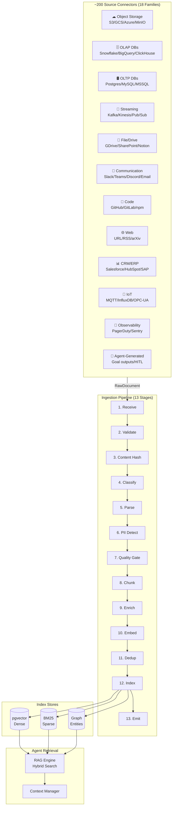
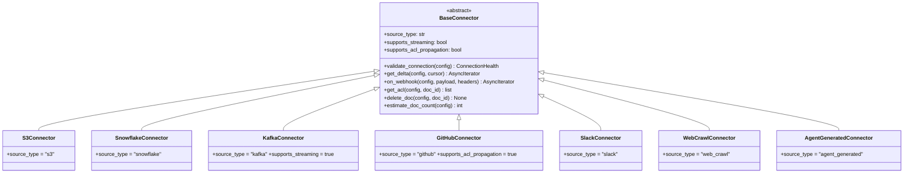
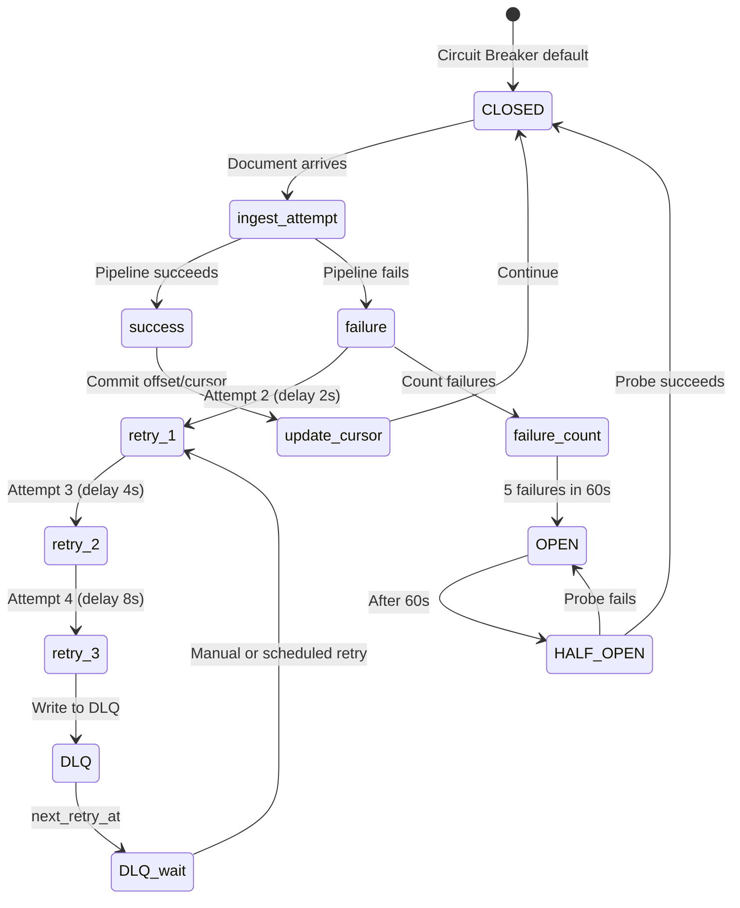

# AgentVerse Knowledge Ingestion System — Complete World-Class Specification

> **Status:** Architecture Design — Ready for Implementation Planning
> **Date:** 2026-08-17
> **Author:** AgentVerse Platform Team
> **Scope:** All ingestion sources (~200 connectors), full pipeline architecture,
>            frontend UX, resilience patterns, scalability, observability
> **Baseline:** 15 connectors/ingestors (7.5% coverage)
> **Target:** ~200 source types across 18 families, unified ingestion pipeline

---

## TABLE OF CONTENTS

**PART 1** — Executive Summary & Vision
**PART 2** — Architecture Principles & Engineering Laws
**PART 3** — Unified Data Model
**PART 4** — Complete Source Taxonomy (~200 sources, 18 families)
**PART 5** — Ingestion Pipeline Architecture (13-stage)
**PART 6** — Connector Interface Contract
**PART 7** — Chunking Strategy Matrix
**PART 8** — Embedding & Indexing Strategy
**PART 9** — Resilience Patterns (12 patterns)
**PART 10** — Scalability Architecture
**PART 11** — Security & Privacy (PII, ACL-aware)
**PART 12** — Observability & Monitoring
**PART 13** — Multi-Tenancy & Quota Management
**PART 14** — Backend API Design (38 endpoints)
**PART 15** — Database Schema
**PART 16** — Frontend UX Architecture
**PART 17** — UI Component System
**PART 18** — Motion & Animation Language
**PART 19** — Source-Family Detail Specifications
**PART 20** — Testing Strategy
**PART 21** — Implementation Roadmap (5 tiers)
**PART 22** — Tradeoffs & Open Questions

---

## PART 1 — Executive Summary & Vision

### 1.1 The Problem

AgentVerse agents are only as good as their knowledge. Today, knowledge reaches
agents through 15 manually-coded connectors (7.5% of all useful sources).
The remaining 92.5% of organisational knowledge — data lakes, streaming systems,
OLAP databases, IoT telemetry, observability systems, CRM/ERP, scientific data,
legal/financial records — is invisible to agents.

### 1.2 The Vision

Every data source in the universe becomes a first-class knowledge source for
AgentVerse agents within one configuration form, without custom code.

```
Any Source → Connector → Pipeline → Vector Store → Agent Context
```

### 1.3 Design Goals

| Goal | Metric |
|------|--------|
| Source coverage | ~200 source types across 18 families |
| Time-to-first-chunk | < 30s for any file-based source |
| Incremental latency | < 5 min from source change → agent visible |
| Deduplication | 100% — content hash prevents any duplicate chunk |
| PII safety | 100% — all content passes PII detection before embedding |
| ACL-aware retrieval | Source permissions propagated to chunk metadata |
| Tenant isolation | RLS at every layer |
| Observability | OTel span per document, Prometheus metric per source type |

### 1.4 Architectural Decision: Unified Pipeline

All sources — regardless of protocol, modality, or frequency — funnel into
one `IngestionPipeline` with a 13-stage processing graph. Connectors are thin
adapters; all intelligence lives in the shared pipeline.

```
┌─────────────────────────────────────────────────────────────┐
│  Source Connector (thin adapter: fetch + normalize)          │
└──────────────────────────┬──────────────────────────────────┘
                           │ RawDocument
┌──────────────────────────▼──────────────────────────────────┐
│  Ingestion Pipeline (13 shared stages)                       │
│  1. Receive → 2. Validate → 3. Classify → 4. Parse          │
│  5. PII Detect → 6. Quality Gate → 7. Chunk                 │
│  8. Enrich → 9. Embed → 10. Deduplicate → 11. Index         │
│  12. Provenance → 13. Emit                                   │
└──────────────────────────┬──────────────────────────────────┘
                           │ IndexedChunks
              ┌────────────┼────────────┐
              ▼            ▼            ▼
         pgvector      BM25 index   Graph nodes
```

---

## PART 2 — Architecture Principles & Engineering Laws

### 2.1 Core Laws (Non-Negotiable)

Every connector and every pipeline stage MUST satisfy:

```
LAW-01  Single pipeline path
        No type-specific goal creation; all sources use IngestionPipeline.ingest()

LAW-02  Idempotency
        Content SHA-256 written before embedding. Duplicate content → skip, not error.

LAW-03  Incremental by default
        Every connector implements get_delta(cursor) → (docs, next_cursor).
        Full re-index is an emergency operation, not normal mode.

LAW-04  Tenant isolation
        tenant_id on every document, chunk, job, cursor. RLS on all tables.

LAW-05  Provenance immutability
        source_url, ingested_at, source_version, author never updated after write.

LAW-06  PII before embedding
        PII detection runs BEFORE text reaches the embedder. Zero PII in vectors.

LAW-07  ACL propagation
        Source permissions encoded in chunk.allowed_roles / chunk.allowed_tenant_users.
        Retrieval API enforces ACL before returning chunks.

LAW-08  Schema-versioned embeddings
        When embedding model changes, all existing chunks are queued for re-embedding.
        Chunks carry embedding_model_id + embedding_model_version.

LAW-09  Priority queue routing
        Celery: enterprise → professional → starter → free queue order.
        Same tasks; different SLAs.

LAW-10  Back-pressure
        Connector scheduler checks ingestion queue depth before enqueuing.
        If depth > PLAN_LIMIT, skip batch until queue drains.

LAW-11  Never block event loop
        All I/O in connectors is async. CPU-bound parsing dispatched to thread pool.

LAW-12  Observability at every stage
        OTel span wraps each pipeline stage. Prometheus counter per (tenant, source_type, stage, result).

LAW-13  No credentials in logs or spans
        Credentials stripped from span attributes. Vault references only.
```

### 2.2 Quality Principles

```
QUALITY-01  Minimum chunk size: 50 tokens (configurable per source type)
QUALITY-02  Language detection before embedding (iso-639 code stored)
QUALITY-03  Confidence scoring: every chunk has quality_score 0–1
QUALITY-04  Freshness TTL per source family (streaming=15min, web=24h, static=7d)
QUALITY-05  Human-in-the-loop gate: low-quality chunks flagged for review
```

### 2.3 Security Principles

```
SEC-01  OAuth2 PKCE for user-facing connectors (Notion, GDrive, Slack, etc.)
SEC-02  Service accounts + Vault for server-side connectors (Snowflake, Kafka, etc.)
SEC-03  Secrets never stored in DB — Vault references only
SEC-04  Webhook HMAC-SHA256 verification before ingestion begins
SEC-05  Content scanning: detect malicious payloads in ingested files
SEC-06  PII redaction with audit trail (what was detected + redacted)
SEC-07  Data residency: per-tenant embedding store region selection
SEC-08  RBAC on ingestion config: admin/developer can create; viewer cannot
```

---

## PART 3 — Unified Data Model

### 3.1 `SourceType` Enum

```python
class SourceFamily(enum.StrEnum):
    OBJECT_STORAGE   = "object_storage"   # S3, GCS, Azure Blob, MinIO
    OLAP_DATABASE    = "olap_database"    # ClickHouse, Snowflake, BigQuery, etc.
    OLTP_DATABASE    = "oltp_database"    # PostgreSQL, MySQL, MSSQL, Oracle
    NOSQL_DATABASE   = "nosql_database"   # MongoDB, DynamoDB, Firestore
    STREAMING        = "streaming"        # Kafka, Pulsar, Kinesis, Pub/Sub
    FILE_SYSTEM      = "file_system"      # Local FS, NFS, SFTP
    DOCUMENT_STORE   = "document_store"   # GDrive, Notion, Confluence, SharePoint
    COMMUNICATION    = "communication"    # Slack, Teams, Discord, Email
    CODE_REPOSITORY  = "code_repository"  # GitHub, GitLab, Bitbucket
    WEB              = "web"              # URL crawl, RSS, Reddit, HN
    CRM_ERP          = "crm_erp"         # Salesforce, HubSpot, SAP
    SUPPORT          = "support"          # Zendesk, Intercom, ServiceNow
    IOT_TELEMETRY    = "iot_telemetry"    # MQTT, InfluxDB, OPC-UA
    OBSERVABILITY    = "observability"    # PagerDuty, Sentry, Grafana
    SCIENTIFIC       = "scientific"       # arXiv, PubMed, FHIR
    GRAPH_DATABASE   = "graph_database"   # Neo4j, Neptune, TigerGraph
    VECTOR_DATABASE  = "vector_database"  # Pinecone, Weaviate, Qdrant (as source)
    AGENT_GENERATED  = "agent_generated"  # Goal outputs, HITL decisions, learnings
```

### 3.2 `SourceConfig` Dataclass

```python
@dataclass
class SourceConfig:
    # Identity
    source_id:         str                    # UUID
    tenant_id:         str
    name:              str                    # Human display name
    family:            SourceFamily
    source_type:       str                    # e.g. "snowflake", "s3", "kafka"
    enabled:           bool = True

    # Connection (all secrets as vault:// references)
    connection_config: dict = field(default_factory=dict)
    # e.g. {"host": "...", "db": "...", "credentials": "vault://tenant/snowflake"}

    # Sync policy
    sync_mode:         str = "incremental"    # full | incremental | streaming
    sync_interval_seconds: int = 3600         # poll interval for pull-based
    cursor_field:      str = ""               # for incremental (e.g. "updated_at")
    cursor_value:      str = ""               # last known cursor position

    # Content filtering
    include_patterns:  list[str] = field(default_factory=list)  # glob/regex
    exclude_patterns:  list[str] = field(default_factory=list)
    max_doc_size_bytes: int = 10_485_760      # 10 MB default

    # Processing policy
    chunking_strategy: str = "auto"          # auto | fixed | semantic | ast | etc.
    chunk_size_tokens: int = 512
    chunk_overlap_tokens: int = 64
    embedding_model:   str = "auto"          # auto | text-embedding-3-large | etc.
    language_hint:     str = ""              # BCP-47 (blank = auto-detect)

    # Access control
    inherit_source_acl: bool = True          # carry source ACL to chunks
    allowed_roles:     list[str] = field(default_factory=list)
    allowed_user_ids:  list[str] = field(default_factory=list)

    # Quality
    min_quality_score: float = 0.3
    pii_action:        str = "redact"        # redact | reject | allow
    freshness_ttl_seconds: int = 86400       # 24h default

    # Metadata
    tags:              list[str] = field(default_factory=list)
    collection_id:     str = ""              # target knowledge collection
    created_at:        str = ""
    updated_at:        str = ""
    last_synced_at:    str | None = None
    total_docs_indexed: int = 0
    total_chunks:      int = 0
    version:           int = 1
```

### 3.3 `RawDocument` (connector output)

```python
@dataclass
class RawDocument:
    doc_id:         str          # source-assigned unique ID
    source_id:      str          # SourceConfig.source_id
    tenant_id:      str
    content:        bytes        # raw bytes
    content_type:   str          # MIME type
    title:          str = ""
    source_url:     str = ""
    author:         str = ""
    created_at:     str = ""
    modified_at:    str = ""
    version:        str = ""
    language:       str = ""
    metadata:       dict = field(default_factory=dict)
    acl:            list[str] = field(default_factory=list)   # allowed principals
    content_hash:   str = ""     # SHA-256; populated by pipeline
```

### 3.4 `IngestionJob` (tracking)

```python
@dataclass
class IngestionJob:
    job_id:         str
    source_id:      str
    tenant_id:      str
    status:         str      # pending | running | completed | failed | paused
    sync_mode:      str      # full | incremental | streaming
    started_at:     str | None = None
    completed_at:   str | None = None
    docs_discovered: int = 0
    docs_skipped:    int = 0   # dedup hit
    docs_failed:     int = 0
    docs_indexed:    int = 0
    chunks_created:  int = 0
    error_message:   str = ""
    cursor_before:   str = ""
    cursor_after:    str = ""
    triggered_by:    str = ""  # scheduler | webhook | manual | trigger_id
```

### 3.5 `IndexedChunk` (extends existing `Chunk`)

```python
@dataclass
class IndexedChunk(Chunk):
    # Provenance
    source_id:              str = ""
    source_type:            str = ""
    source_url:             str = ""
    doc_id:                 str = ""
    doc_title:              str = ""
    doc_author:             str = ""
    doc_modified_at:        str = ""
    doc_version:            str = ""
    chunk_index:            int = 0
    total_chunks_in_doc:    int = 0
    # Access control
    acl:                    list[str] = field(default_factory=list)
    # Quality
    quality_score:          float = 1.0
    language:               str = "en"
    has_pii_redacted:       bool = False
    # Versioning
    embedding_model_id:     str = ""
    embedding_model_version: str = ""
    content_hash:           str = ""
    # Freshness
    ingested_at:            str = ""
    expires_at:             str | None = None
```

---

## PART 4 — Complete Source Taxonomy (~200 sources, 18 Families)

### Family 1: Object Storage (10 sources)

| Source | Sync Mode | Formats | Auth | Gap |
|--------|-----------|---------|------|-----|
| **AWS S3** | Event (S3 notifications) + Incremental list | Any file format | IAM Role / Access Key | ❌ MISSING |
| **Google Cloud Storage** | Pub/Sub notifications + list | Any file format | Service Account / OAuth2 | ❌ MISSING |
| **Azure Blob Storage** | Event Grid + list | Any file format | Managed Identity / SAS | ❌ MISSING |
| **MinIO** | Webhook (bucket notification) + list | Any file format | Access Key | ❌ MISSING |
| **Cloudflare R2** | S3-compatible | Any file format | API Token | ❌ MISSING |
| **Backblaze B2** | Event-based + list | Any file format | App Key | ❌ MISSING |
| **Wasabi** | S3-compatible | Any file format | Access Key | ❌ MISSING |
| **Delta Lake** | Time-travel CDF | Parquet + metadata | Cloud auth | ❌ MISSING |
| **Apache Iceberg** | Snapshot incremental | Parquet + Avro + ORC | Catalog auth | ❌ MISSING |
| **Apache Hudi** | CDC commit timeline | Parquet | Cloud auth | ❌ MISSING |

**Incremental strategy:** S3 uses `ListObjectsV2` with `StartAfter` cursor keyed on `LastModified`. Delta/Iceberg use native snapshot IDs.

---

### Family 2: OLAP / Analytics Databases (18 sources)

| Source | Sync Mode | Protocol | What to Extract | Gap |
|--------|-----------|---------|----------------|-----|
| **ClickHouse** | Materialized view delta | HTTP + native | Tables, aggregations | ❌ MISSING |
| **Apache Druid** | Segment metadata + SQL | REST SQL | Segment summaries | ❌ MISSING |
| **Apache Pinot** | Segment-level delta | REST | Real-time OLAP answers | ❌ MISSING |
| **DuckDB** | Full scan + checkpoint | in-process | Local Parquet/CSV analytics | ❌ MISSING |
| **Apache Spark** | DataFrame export | PySpark | Batch transforms | ❌ MISSING |
| **Trino / Presto** | SQL federation | JDBC | Cross-source queries | ❌ MISSING |
| **StarRocks** | CDC + snapshot | MySQL wire | Sub-second OLAP | ❌ MISSING |
| **QuestDB** | REST range queries | REST | Time-series ranges | ❌ MISSING |
| **TimescaleDB** | Continuous aggregates | PostgreSQL wire | Hypertable summaries | ❌ MISSING |
| **Databricks** | Delta Live Table feed | DBFS + Delta | Lakehouse tables | ❌ MISSING |
| **Firebolt** | Snapshot query | REST SQL | Cloud OLAP results | ❌ MISSING |
| **Amazon Redshift** | Unload + COPY | PostgreSQL wire | Data warehouse | ❌ MISSING |
| **BigQuery** | Storage Read API + incremental | REST + gRPC | GCP data warehouse | ❌ MISSING |
| **Snowflake** | Streams + Tasks | REST / Snowpark | Cloud data warehouse | ❌ MISSING |
| **Azure Synapse** | Delta + SQL | SQL / REST | Azure data warehouse | ❌ MISSING |
| **Amazon Athena** | Result pagination | REST | Serverless S3 SQL | ❌ MISSING |
| **Google Looker** | Explore API | REST | BI semantic layer | ❌ MISSING |
| **dbt** | Artifacts (manifest.json) | File | Model docs + lineage | ❌ MISSING |

**Incremental strategy:** Most use `WHERE updated_at > :cursor` with `ORDER BY updated_at` for pagination. Snowflake/BigQuery use native CDC streams. Databricks uses Delta table versions.

---

### Family 3: Streaming / Message Systems (14 sources)

| Source | Consumer Model | Format | Gap |
|--------|---------------|--------|-----|
| **Apache Kafka** | Consumer group, offset commit | Avro/JSON/Protobuf | PARTIAL (trigger only) |
| **Confluent Platform** | Kafka + Schema Registry | Avro + Schema evolution | ❌ MISSING |
| **Apache Pulsar** | Subscription + ack | Any | ❌ MISSING |
| **RabbitMQ** | Queue consumer + ack | Any | ❌ MISSING |
| **NATS JetStream** | Consumer + sequence | Any | ❌ MISSING |
| **AWS Kinesis Data Streams** | Shard iterator | JSON | ❌ MISSING |
| **AWS Kinesis Firehose** | S3 delivery → watch | JSON/Parquet | ❌ MISSING |
| **AWS SQS** | Long-poll + delete | JSON | ❌ MISSING |
| **AWS SNS → SQS fan-out** | SQS consumer | JSON | ❌ MISSING |
| **Azure Service Bus** | AMQP consumer + complete | Any | ❌ MISSING |
| **Azure Event Grid** | Webhook push | CloudEvents | ❌ MISSING |
| **Google Pub/Sub** | Pull + ack | Any | ❌ MISSING |
| **Redpanda** | Kafka-compatible | Any | ❌ MISSING |
| **Memphis.dev** | REST + Kafka compat | Any | ❌ MISSING |

**Exactly-once pattern:** Consumer commits offset only after `IngestionPipeline.ingest()` returns success. Idempotency key = `{source_id}:{partition}:{offset}`.

---

### Family 4: OLTP / Relational Databases (14 sources)

| Source | CDC Method | Deduplication |
|--------|-----------|--------------|
| **PostgreSQL** | `pg_notify` + logical replication (pgoutput) | `{schema}.{table}.{pk}` |
| **MySQL / MariaDB** | Binlog (Debezium) | `{db}.{table}.{pk}` |
| **Microsoft SQL Server** | CDC / CT tables | `{schema}.{table}.{pk}` |
| **Oracle Database** | LogMiner / Oracle GoldenGate | `{schema}.{table}.{pk}` |
| **IBM DB2** | CDC via Q-Replication | `{schema}.{table}.{pk}` |
| **CockroachDB** | Changefeed (Avro/JSON) | `{db}.{table}.{pk}` |
| **PlanetScale** | Vitess CDC + branch API | `{keyspace}.{table}.{pk}` |
| **Neon** | Logical replication | PostgreSQL CDC |
| **Supabase** | Realtime (PostgreSQL replication) | PostgreSQL CDC |
| **TiDB** | TiCDC (row-level) | `{db}.{table}.{pk}` |
| **YugabyteDB** | CDC API | `{db}.{table}.{pk}` |
| **SingleStore** | Binlog | `{db}.{table}.{pk}` |
| **SQLite** | File-watch + WAL read | `{table}.{pk}` |
| **DynamoDB** | DynamoDB Streams | `{table}.{pk}` (NoSQL crossover) |

**Row-to-text strategy:** Column values serialized to sentence pairs: `"The {table} record with id {pk}: {col1} is {val1}, {col2} is {val2}..."`. Schema-aware templates configurable per table.

---

### Family 5: NoSQL / Document Databases (9 sources)

| Source | Incremental | Format |
|--------|------------|--------|
| **MongoDB** | Change streams | BSON/JSON |
| **CouchDB** | Changes feed (`_changes`) | JSON |
| **FaunaDB** | Event streaming | JSON |
| **DynamoDB** | DynamoDB Streams | JSON |
| **Cassandra / Scylla** | CDC + tombstone filter | CQL rows |
| **HBase** | Replication endpoint | Cells |
| **Firestore** | Realtime listeners | JSON |
| **Azure Cosmos DB** | Change feed processor | JSON |
| **RavenDB** | Changes API | JSON |

---

### Family 6: Key-Value / Cache Stores (6 sources)

| Source | Method | What |
|--------|--------|------|
| **Redis** | Keyspace notifications | Config, feature flags, KV state |
| **Redis Stack** | JSON module changes | Structured documents |
| **etcd** | Watch API | Kubernetes configs, service registry |
| **Zookeeper** | Watch API | Distributed configs |
| **Consul KV** | Watch API | Service configs, health checks |
| **Vault KV** | Audit log (metadata only, never secrets) | Secret path structure |

---

### Family 7: Graph Databases (7 sources)

| Source | Export Method | Format |
|--------|--------------|--------|
| **Neo4j** | Cypher stream / APOC export | Nodes + relationships → sentence pairs |
| **Amazon Neptune** | SPARQL / Gremlin export | RDF triples |
| **TigerGraph** | REST API + GSQL | Graph patterns |
| **Memgraph** | Bolt + Kafka Streams | Graph events |
| **Dgraph** | GraphQL / DQL | JSON graph |
| **ArangoDB** | REST + AQL | Multi-model (doc + graph) |
| **FalkorDB** | Redis-compatible | Cypher queries |

**Triple-to-text strategy:** `(subject) –[predicate]→ (object)` rendered as: `"{subject} {predicate} {object}."` One chunk per N triples with overlap.

---

### Family 8: Search / Vector Databases (as source) (12 sources)

These are also ingestion targets but can be sources when migrating or federating:

| Source | Protocol |
|--------|---------|
| **Elasticsearch** | Scroll / PIT API |
| **OpenSearch** | Same as Elasticsearch |
| **Solr** | Cursor-based export |
| **Algolia** | Browse API |
| **Typesense** | Export API |
| **Meilisearch** | Dump / export |
| **Pinecone** | Fetch API (batch) |
| **Weaviate** | GraphQL export |
| **Qdrant** | REST scroll |
| **Chroma** | Collection export |
| **Milvus / Zilliz** | SDK batch fetch |
| **pgvector** | SQL `SELECT` |

---

### Family 9: File Sync / Drive Systems (11 sources)

| Source | Incremental | Auth | Gap |
|--------|------------|------|-----|
| **Google Drive** | Drive API changes feed | OAuth2 PKCE | ✅ EXISTS (needs delta) |
| **Google Docs** | Docs API revision history | OAuth2 | ❌ MISSING |
| **Google Sheets** | Sheets API value ranges | OAuth2 | ❌ MISSING |
| **Google Slides** | Slides API | OAuth2 | ❌ MISSING |
| **OneDrive** | Graph API delta token | OAuth2 PKCE | ❌ MISSING |
| **SharePoint** | Delta feed | OAuth2 | ✅ EXISTS |
| **Dropbox** | Delta cursor + webhooks | OAuth2 PKCE | ❌ MISSING |
| **Box** | Events API + webhooks | OAuth2 PKCE | ❌ MISSING |
| **Nextcloud** | WebDAV + Activity feed | OAuth2 / Basic | ❌ MISSING |
| **Seafile** | Events API | API Token | ❌ MISSING |
| **iCloud Drive** | CloudKit + WebDAV | OAuth2 | ❌ MISSING |

---

### Family 10: Communication & Collaboration (14 sources)

| Source | What to Ingest | Gap |
|--------|---------------|-----|
| **Slack** | Messages, threads, reactions, files | ✅ EXISTS |
| **Microsoft Teams** | Messages, channels, meeting transcripts | ❌ MISSING |
| **Discord** | Server messages, threads, forum posts | ❌ MISSING |
| **Email (IMAP)** | Thread + reply chains, attachments | ✅ EXISTS |
| **Gmail** | Labels + filters, full thread | ❌ MISSING |
| **Outlook 365** | Graph API, conversation threads | ❌ MISSING |
| **Zoom** | Meeting transcripts, recordings | ❌ MISSING |
| **Google Meet** | Meeting transcripts | ❌ MISSING |
| **Loom** | Video summaries + transcripts | ❌ MISSING |
| **Linear** | Issues, comments, projects | ❌ MISSING |
| **Asana** | Tasks, projects, comments | ❌ MISSING |
| **Monday.com** | Boards, items, updates | ❌ MISSING |
| **Trello** | Cards, lists, comments | ❌ MISSING |
| **Notion** | Pages, databases, comments | ✅ EXISTS |

---

### Family 11: Code & Developer Systems (14 sources)

| Source | What | Gap |
|--------|------|-----|
| **GitHub** | Code (AST), Issues, PRs, Discussions, Wiki | ✅ EXISTS (code only) |
| **GitLab** | Same as GitHub | ❌ MISSING |
| **Bitbucket** | Same as GitHub | ❌ MISSING |
| **GitHub Issues & PRs** | Decision history, resolution notes | ❌ MISSING |
| **Stack Overflow** | Q&A pairs, accepted answers | ❌ MISSING |
| **npm / PyPI / Maven** | Package README, CHANGELOG, types | ❌ MISSING |
| **OpenAPI / Swagger specs** | Schema-aware tool descriptions | ❌ MISSING |
| **Jupyter Notebooks** | Cell-by-cell (code + output) chunking | ❌ MISSING |
| **Terraform / Bicep** | IaC → infrastructure knowledge | ❌ MISSING |
| **Kubernetes manifests** | YAML → intent extraction | ❌ MISSING |
| **Postman collections** | API usage patterns | ❌ MISSING |
| **Backstage** | Software catalogue | ❌ MISSING |
| **ReadTheDocs / Sphinx** | Generated docs | ❌ MISSING |
| **ADRs (markdown)** | Architecture decisions | ❌ MISSING |

---

### Family 12: Web & Internet (16 sources)

| Source | Method | Rate Limit Strategy |
|--------|--------|-------------------|
| **Arbitrary URL crawl** | trafilatura + sitemap | robots.txt + polite delay |
| **RSS / Atom feeds** | Feed polling | Delta by entry ID |
| **Twitter/X** | v2 filtered stream | API rate caps |
| **Reddit** | PRAW + pushshift | 60 req/min |
| **Hacker News** | Algolia API + Firebase | No auth required |
| **YouTube transcripts** | youtube-transcript-api | Per-video |
| **Medium** | RSS + public scrape | Per-post |
| **Substack** | RSS | Per-newsletter |
| **Dev.to** | REST API | 10 req/min |
| **Wikipedia** | MediaWiki API + dumps | Bulk weekly + delta |
| **arXiv** | OAI-PMH daily harvest | Backfill + daily |
| **PubMed** | E-utilities API | 10 req/s with key |
| **Common Crawl** | WARC files on S3 | Batch job only |
| **Internet Archive** | Wayback CDX API | Per-URL |
| **GitHub Trending** | REST API | Hourly cache |
| **Podcast RSS** | RSS + Whisper transcription | Per-episode |

---

### Family 13: CRM / ERP / Sales (16 sources)

| Source | What to Extract | Auth |
|--------|----------------|------|
| **Salesforce** | Objects: Contact, Account, Opportunity, Case, Note, Activity | OAuth2 PKCE |
| **HubSpot** | Contacts, Companies, Deals, Tickets, Engagements | OAuth2 |
| **Pipedrive** | Deals, Notes, Activities, Persons | API Token / OAuth2 |
| **Zoho CRM** | Records, Modules, Notes | OAuth2 |
| **SAP** | Business objects (BAPI/OData) | SSO / SAML |
| **Oracle ERP** | REST / SOAP modules | SAML |
| **Workday** | Job descriptions, org chart | OAuth2 |
| **BambooHR** | Handbook, policies, org chart | API Key |
| **ADP** | Compliance documents | OAuth2 |
| **Greenhouse** | Job descriptions, interview guides | API Key |
| **Lever** | Job posts, scorecards | API Key |
| **Monday.com** | CRM boards | API Key |
| **QuickBooks** | Chart of accounts, products | OAuth2 |
| **Xero** | Account descriptions, contacts | OAuth2 |
| **Stripe** | Product catalog, pricing, invoice notes | API Key |
| **NetSuite** | ERP modules | TBA token |

---

### Family 14: Customer Support (8 sources)

| Source | What |
|--------|------|
| **Zendesk** | Tickets, Comments, Help Center articles, macros |
| **Intercom** | Conversations, Articles, Company notes |
| **Freshdesk** | Tickets, Solution articles |
| **Help Scout** | Conversations, Docs |
| **ServiceNow** | Incidents, KB articles, CMDB, runbooks |
| **Jira Service Mgmt** | Tickets, SLA records |
| **Gorgias** | E-commerce support conversations |
| **Kustomer** | CRM + support history |

---

### Family 15: IoT / Edge / Telemetry (11 sources)

| Source | Protocol | Data Model |
|--------|----------|-----------|
| **MQTT broker** | MQTT v3/v5 | Topic → time-windowed aggregation |
| **OPC-UA** | Binary TCP | Tag → time-series summary |
| **Modbus** | TCP/RTU | Register maps → reading summaries |
| **InfluxDB** | Line protocol + Flux | Measurement windows |
| **Prometheus remote_write** | Protobuf | Metric names + label sets |
| **AWS IoT Core** | MQTT + Shadow | Device state history |
| **Azure IoT Hub** | AMQP / MQTT | Device telemetry |
| **Google Cloud IoT** | MQTT | Device data |
| **Thingsboard** | REST + MQTT | IoT platform readings |
| **Home Assistant** | REST + WebSocket | Smart home state events |
| **InfluxDB 3.0** | Flight SQL | Time-series ranges |

---

### Family 16: Observability & Operations (8 sources)

| Source | What to Index |
|--------|--------------|
| **PagerDuty** | Incident history, resolution notes, runbooks |
| **Sentry** | Error patterns, stack traces, issue context |
| **Grafana** | Dashboard panel descriptions, alert rules |
| **Datadog** | Monitor descriptions, logs, APM summaries |
| **OpsGenie** | Runbooks, on-call schedules |
| **CloudWatch** | Log groups, alarm descriptions |
| **OpenTelemetry** | Span patterns, service topology |
| **Jaeger** | Distributed trace summaries |

---

### Family 17: Scientific & Regulatory (14 sources)

| Source | Protocol | Domain |
|--------|----------|--------|
| **arXiv** | OAI-PMH | CS, Physics, Math papers |
| **PubMed / MEDLINE** | E-utilities | Biomedical |
| **Semantic Scholar** | REST API | Citations + abstracts |
| **CrossRef** | REST API | DOI metadata |
| **Zenodo** | REST API | Open research data |
| **FHIR R4** | REST | Healthcare records |
| **SNOMED CT** | FHIR Terminology | Medical terms |
| **SEC EDGAR** | EDGAR full-text | Financial filings (10-K, 10-Q) |
| **USPTO** | OAI-PMH | Patent texts |
| **EUR-Lex** | REST | EU regulations |
| **CourtListener** | REST API | Case law |
| **Wikidata** | SPARQL | Entity triples |
| **DBpedia** | SPARQL | RDF |
| **Gene Ontology** | OBO | Biological ontologies |

---

### Family 18: Agent-Generated Knowledge (6 source types)

This family is unique to AgentVerse — agents themselves produce knowledge:

| Source | What | Trigger |
|--------|------|---------|
| **Goal outputs** | Agent-produced artifacts, reports, analysis | `goal.completed` event |
| **HITL decisions** | Human-approved answers — highest quality | HITL approval event |
| **Execution traces** | Tool call patterns, error resolutions | `goal.completed` |
| **Agent evaluations** | Score + rationale → quality-weighted KB | Eval completion |
| **Self-reflection** | LongTermMemoryStore learnings | Memory creation event |
| **User corrections** | Explicit negative → positive feedback pairs | User feedback API |

---

## PART 5 — Ingestion Pipeline Architecture (13 Stages)

```
                    ┌─────────────────────────────────────────────┐
                    │         Connector Adapter Layer              │
                    │  (thin: fetch, normalize → RawDocument)      │
                    └────────────────┬────────────────────────────┘
                                     │ RawDocument
                    ┌────────────────▼────────────────────────────┐
                    │  Stage 1: RECEIVE                            │
                    │  • Validate tenant quota                     │
                    │  • Accept or reject based on plan limits     │
                    │  • Emit span: ingestion.receive              │
                    └────────────────┬────────────────────────────┘
                                     │
                    ┌────────────────▼────────────────────────────┐
                    │  Stage 2: VALIDATE                           │
                    │  • MIME type check                           │
                    │  • Max file size enforcement                 │
                    │  • Malware/content scan (ClamAV / custom)   │
                    │  • Webhook signature verify (if applicable) │
                    └────────────────┬────────────────────────────┘
                                     │
                    ┌────────────────▼────────────────────────────┐
                    │  Stage 3: CONTENT HASH CHECK                 │
                    │  • SHA-256(content)                         │
                    │  • Check `indexed_documents` table          │
                    │  • If exists and not stale → SKIP           │
                    │  • Early exit: 0 embeddings consumed        │
                    └────────────────┬────────────────────────────┘
                                     │
                    ┌────────────────▼────────────────────────────┐
                    │  Stage 4: CLASSIFY                           │
                    │  • ContentClassifier → ContentType          │
                    │  • Language detection (langdetect / fastText)│
                    │  • Content category (code/prose/table/etc.) │
                    └────────────────┬────────────────────────────┘
                                     │
                    ┌────────────────▼────────────────────────────┐
                    │  Stage 5: PARSE                              │
                    │  • ParserRegistry.get(content_type)         │
                    │  • Structured text extraction                │
                    │  • Metadata extraction                       │
                    │  • Image/table/code block identification     │
                    └────────────────┬────────────────────────────┘
                                     │
                    ┌────────────────▼────────────────────────────┐
                    │  Stage 6: PII DETECTION & REDACTION          │
                    │  • Presidio analyzer: PERSON, EMAIL, PHONE, │
                    │    CREDIT_CARD, SSN, IP_ADDR, MEDICAL        │
                    │  • Action: redact | reject | allow           │
                    │  • Audit log: what was detected              │
                    └────────────────┬────────────────────────────┘
                                     │
                    ┌────────────────▼────────────────────────────┐
                    │  Stage 7: QUALITY GATE                       │
                    │  • Min token count check                     │
                    │  • Gibberish detection                       │
                    │  • Duplicate paragraph filter               │
                    │  • Quality score computation 0–1            │
                    │  • Below threshold → DLQ + flag for review   │
                    └────────────────┬────────────────────────────┘
                                     │
                    ┌────────────────▼────────────────────────────┐
                    │  Stage 8: CHUNK                              │
                    │  • ChunkingStrategySelector.select()        │
                    │  • Strategy: fixed | semantic | ast |        │
                    │    heading | table | timestamp | scene |     │
                    │    parent-child | late | sentence-window     │
                    └────────────────┬────────────────────────────┘
                                     │
                    ┌────────────────▼────────────────────────────┐
                    │  Stage 9: CONTEXTUAL ENRICHMENT              │
                    │  • ContextualEnricher: prepend doc summary  │
                    │  • Metadata injection                        │
                    │  • Entity extraction (NER)                   │
                    │  • Keyword extraction (KeyBERT / YAKE)      │
                    └────────────────┬────────────────────────────┘
                                     │
                    ┌────────────────▼────────────────────────────┐
                    │  Stage 10: EMBED                             │
                    │  • EmbeddingPolicySelector.select()         │
                    │  • Model: text-embedding-3-large (default)  │
                    │  • Batch up to 512 chunks per API call       │
                    │  • Retry w/ exponential backoff              │
                    │  • Cost tracking per tenant                  │
                    └────────────────┬────────────────────────────┘
                                     │
                    ┌────────────────▼────────────────────────────┐
                    │  Stage 11: CHUNK-LEVEL DEDUPLICATION         │
                    │  • SHA-256(chunk_text) → check per collection│
                    │  • Near-duplicate: cosine similarity > 0.98 │
                    │  • Exact duplicate: skip write               │
                    └────────────────┬────────────────────────────┘
                                     │
                    ┌────────────────▼────────────────────────────┐
                    │  Stage 12: INDEX                             │
                    │  • Write to pgvector (primary)              │
                    │  • Write to BM25 index (keyword)            │
                    │  • Write to graph (entities + relations)    │
                    │  • Update `indexed_documents` cursor        │
                    └────────────────┬────────────────────────────┘
                                     │
                    ┌────────────────▼────────────────────────────┐
                    │  Stage 13: EMIT & PROVENANCE                 │
                    │  • Write IngestionJob completion             │
                    │  • Emit `knowledge.ingested` Redis event     │
                    │  • Update SourceConfig.last_synced_at        │
                    │  • Emit OTel span close                      │
                    │  • Increment Prometheus counters             │
                    └─────────────────────────────────────────────┘
```

---

## PART 6 — Connector Interface Contract

```python
from abc import ABC, abstractmethod
from typing import AsyncIterator

class BaseConnector(ABC):
    """Every connector MUST implement this contract."""

    @abstractmethod
    async def validate_connection(self, config: SourceConfig) -> ConnectionHealth:
        """Test connectivity + auth. Called during source creation."""

    @abstractmethod
    async def get_delta(
        self,
        config: SourceConfig,
        cursor: str | None,
    ) -> AsyncIterator[tuple[RawDocument, str]]:
        """
        Yield (document, new_cursor) tuples.
        cursor=None means full initial sync.
        Yields in source-modified-at ascending order.
        MUST be resumable: if interrupted, resume from last yielded cursor.
        """

    @abstractmethod
    def estimate_doc_count(self, config: SourceConfig) -> int | None:
        """Return estimated total docs for progress reporting. None = unknown."""

    # ── Optional overrides ───────────────────────────────────────

    async def on_webhook(
        self,
        config: SourceConfig,
        payload: bytes,
        headers: dict,
    ) -> AsyncIterator[RawDocument]:
        """Handle real-time push events (webhooks). Default: NotImplemented."""
        raise NotImplementedError

    async def get_acl(
        self,
        config: SourceConfig,
        doc_id: str,
    ) -> list[str]:
        """Return allowed principals for a document. Default: tenant-wide."""
        return []

    async def delete_doc(
        self,
        config: SourceConfig,
        doc_id: str,
    ) -> None:
        """Handle source-side deletions. Default: no-op."""
        pass

    @property
    @abstractmethod
    def source_type(self) -> str:
        """e.g. 's3', 'snowflake', 'kafka'"""

    @property
    def supports_streaming(self) -> bool:
        return False

    @property
    def supports_acl_propagation(self) -> bool:
        return False

    @property
    def supports_deletion_tracking(self) -> bool:
        return False


@dataclass
class ConnectionHealth:
    ok: bool
    latency_ms: float
    error: str = ""
    metadata: dict = field(default_factory=dict)
    # e.g. {"bucket": "my-bucket", "region": "us-east-1", "doc_count_estimate": 12000}
```

---

## PART 7 — Chunking Strategy Matrix

| Content Type | Strategy | Rationale |
|-------------|---------|-----------|
| **Prose / articles** | Semantic (sentence-transformer boundary) | Preserve semantic coherence |
| **Markdown / MDX** | Heading-based | Natural structure |
| **Code** | AST (language-aware) | Function/class boundaries |
| **PDF (text)** | Heading + layout | Preserve visual structure |
| **PDF (scanned/OCR)** | Fixed + layout analysis | No structure available |
| **HTML** | DOM node semantic | `<article>`, `<section>` aware |
| **Database rows** | Row batching | N rows per chunk, overlapping column summary |
| **JSON / JSONL** | Schema-inferred | Object per chunk; array batching |
| **CSV / Excel** | Row batching + column description | Schema header + N rows |
| **Jupyter notebooks** | Cell-pair (code + output) | Code cell + its output |
| **OpenAPI specs** | Operation-level | One endpoint + schema per chunk |
| **ADRs** | Section-based | Decision/context/consequences |
| **Emails** | Thread-level | Full thread = one unit; reply-chain overlap |
| **Audio transcripts** | Timestamp-windowed | 60-second windows, 10-second overlap |
| **Video transcripts** | Scene-based | Shot boundary detection |
| **Graph triples** | N-triple batches | 20 triples per chunk |
| **Time-series** | Window aggregate | 1-hour window → statistical summary |
| **Log lines** | Pattern group | 50 similar lines batched |
| **IaC (Terraform/YAML)** | Resource-block | One resource definition per chunk |

---

## PART 8 — Embedding & Indexing Strategy

### 8.1 Embedding Model Routing

```
Content Type     →  Model
───────────────────────────────────────────────────────
English prose    →  text-embedding-3-large (1536d)
Code             →  voyage-code-2 (1536d)
Multilingual     →  multilingual-e5-large (1024d)
Short labels     →  text-embedding-3-small (512d)
Medical/legal    →  pubmedbert-embeddings (768d)  [domain-specific]
Images           →  CLIP (512d)                   [multimodal]
```

### 8.2 Index Targets

| Index | Technology | Purpose |
|-------|-----------|---------|
| **Vector (dense)** | pgvector (IVFFlat + HNSW) | Semantic similarity |
| **Keyword (sparse)** | BM25 (Tantivy via pg_bm25) | Exact term matching |
| **Knowledge graph** | NetworkX + neo4j (optional) | Entity relationships |
| **Summary index** | pgvector (doc-level embeddings) | RAPTOR tree levels |

### 8.3 Re-embedding Trigger

When `embedding_model_id` changes:
1. All existing chunks for tenant queued to `reembedding_jobs` table
2. Celery batch job processes in background
3. New chunks served until old ones replaced
4. Progress visible in UI

---

## PART 9 — Resilience Patterns (12 Patterns)

### R-01: Exponential Backoff with Jitter

```python
# Applied to: all connector HTTP calls, embedding API calls
initial_delay = 1.0
max_delay = 60.0
max_attempts = 5
jitter = random.uniform(0, 0.5)
delay = min(initial_delay * (2 ** attempt) + jitter, max_delay)
```

### R-02: Circuit Breaker (per connector type per tenant)

```
State: CLOSED → OPEN (after 5 failures in 60s) → HALF_OPEN → CLOSED
When OPEN: reject new ingestion jobs for this source, surface in UI as "paused"
Metric: agentverse_ingestion_circuit_state{source_type, tenant_id}
```

### R-03: Bulkhead (per tenant concurrency cap)

```python
PLAN_CONCURRENT_INGESTION_JOBS = {
    "free": 1,
    "starter": 3,
    "professional": 10,
    "enterprise": 50,
}
```

### R-04: Dead Letter Queue (DLQ)

```
3 retries → DLQ table with:
  - raw document bytes
  - failure stage
  - error message + stack
  - retry_count
  - next_retry_at (exponential backoff)
UI: DLQ panel with per-source failed doc list, retry / dismiss actions
```

### R-05: Rate Limiting (per source type per tenant)

```python
PLAN_INGESTION_RATE_LIMITS = {
    "free":         {"docs_per_hour": 100,    "mb_per_hour": 50},
    "starter":      {"docs_per_hour": 1_000,  "mb_per_hour": 500},
    "professional": {"docs_per_hour": 10_000, "mb_per_hour": 5_000},
    "enterprise":   {"docs_per_hour": None,   "mb_per_hour": None},
}
```

### R-06: Idempotency (content-hash deduplication)

```
SHA-256(normalized_text) → indexed_documents.content_hash (UNIQUE)
On collision → skip embedding, update `last_seen_at`
Near-dedup: cosine(new_embedding, existing) > 0.98 → skip
```

### R-07: Cursor-Based Resumable Sync

```
Every connector stores cursor in source_configs.cursor_value
If job crashes → resume from cursor, not from beginning
Cursor format per source:
  S3:        "2026-08-17T10:00:00Z"   (LastModified)
  Kafka:     "partition:12:offset:9876"
  Snowflake: "2026-08-17T10:00:00.000Z"
  MongoDB:   "{'_data': '...resume_token...'}"
```

### R-08: Graceful Degradation

```
If embedder unavailable → buffer docs in `pending_embedding` table
If pgvector unavailable → write to fallback in-memory store
If BM25 index unavailable → serve vector-only results with warning
Agents always get a response; quality degrades gracefully
```

### R-09: Back-Pressure Control

```
Before enqueuing batch:
  1. Check Celery queue depth for tenant
  2. Check tenant's concurrent_ingestion_jobs count
  3. If either > threshold → defer batch by 5 minutes
  4. Surface in UI as "throttled"
Prevents ingestion storms from starving agent execution queues
```

### R-10: Schema Version Migration

```
When embedding model changes:
  1. New model_version written to source_configs
  2. All existing chunks tagged needs_reembedding = true
  3. Background job processes in priority order
  4. Old chunks still served during migration
  5. Progress bar in UI
```

### R-11: Webhook Signature Verification

```
All push-based sources (S3 events, Kafka webhooks, etc.):
  - HMAC-SHA256 verification before pipeline entry
  - Reject with 401 if invalid
  - No partial processing on tampered payloads
```

### R-12: Timeouts at Every Boundary

```
Connector HTTP call:          30s
Parser (CPU-bound):           60s (via thread pool)
PII detection:               10s
Embedding API call:           30s per batch
Single stage timeout:         120s
Full document pipeline:       300s
Connector initial sync:       24h (long-running Celery task)
```

---

## PART 10 — Scalability Architecture

### 10.1 Celery Task Routing

```python
INGESTION_QUEUE_ROUTING = {
    "enterprise":   "ingestion.enterprise",   # dedicated worker pool
    "professional": "ingestion.professional",
    "starter":      "ingestion.starter",
    "free":         "ingestion.free",
}
# SLA: enterprise < 1min, professional < 5min, starter < 30min, free < 2h
```

### 10.2 Horizontal Scaling Points

```
┌─────────────────────────────────────────────────┐
│  Ingestion Workers (stateless, scale horizontally)
│  - Each worker handles one IngestionJob at a time
│  - CPU: 2 vCPU per worker (parser + embed overhead)
│  - Scale: KEDA on Celery queue depth
└─────────────────────────────────────────────────┘

┌─────────────────────────────────────────────────┐
│  Embedding Batch Service (separate pool)
│  - Batches chunks: up to 512 per API call
│  - Rate-limited globally: 1M tokens/min
│  - Per-tenant token budget enforced
└─────────────────────────────────────────────────┘

┌─────────────────────────────────────────────────┐
│  Vector Write Service (connection pool)
│  - pgvector: PgBouncer pool, 50 write connections
│  - Write batches: 1000 chunks per transaction
│  - HNSW index built offline (not during write)
└─────────────────────────────────────────────────┘
```

### 10.3 Throughput Targets

| Tier | Docs/hour | MB/hour | Concurrent Jobs |
|------|-----------|---------|----------------|
| Free | 100 | 50 | 1 |
| Starter | 1,000 | 500 | 3 |
| Professional | 10,000 | 5,000 | 10 |
| Enterprise | Unlimited | Unlimited | 50+ |

### 10.4 Large-Scale Ingestion (initial sync)

For sources with millions of docs (Snowflake warehouse, S3 data lake):
1. **Partitioned initial sync** — parallel workers per partition key
2. **Streaming write** — chunks written as processed, not batched at end
3. **Progress checkpointing** — every 1000 docs, cursor committed
4. **Fan-out parallelism** — up to `cpu_count * 2` parallel parse workers

---

## PART 11 — Security & Privacy

### 11.1 PII Detection Matrix

```
PII Entity          │ Detect  │ Redact  │ Flag Only
────────────────────┼─────────┼─────────┼───────────
Full name           │   ✅    │   opt   │   opt
Email address       │   ✅    │   ✅    │   opt
Phone number        │   ✅    │   ✅    │   opt
Credit card         │   ✅    │   ✅    │   ❌
SSN / Tax ID        │   ✅    │   ✅    │   ❌
Passport / Driver   │   ✅    │   ✅    │   ❌
IP address          │   ✅    │   opt   │   opt
Medical record      │   ✅    │   opt   │   opt
Date of birth       │   ✅    │   opt   │   opt
Bank account        │   ✅    │   ✅    │   ❌
Biometric data      │   ✅    │   ✅    │   ❌
```

Action per field is configurable per source config (`pii_action: redact|reject|allow`).

### 11.2 ACL-Aware Retrieval

```
Source permission → chunk.acl (list of principals)
At retrieval time:
  WHERE chunk.tenant_id = $tenant_id
  AND (chunk.acl = '[]'                    -- public within tenant
       OR $user_id = ANY(chunk.acl)        -- user explicitly allowed
       OR $user_role = ANY(chunk.acl))     -- role allowed
```

### 11.3 Credential Management

```
All connector credentials stored as Vault references:
  vault://tenant/{tenant_id}/sources/{source_id}/credentials

Never:
  - Stored in DB plaintext
  - Logged in spans or Prometheus labels
  - Returned in API responses (only masked preview)

Rotation: credential rotation does not interrupt active sync jobs
  (connector re-fetches from Vault at each job start)
```

---

## PART 12 — Observability & Monitoring

### 12.1 Prometheus Metrics

```python
# Per source ingestion rate
INGESTION_DOCS_TOTAL = Counter(
    "agentverse_ingestion_docs_total",
    "Documents ingested",
    ["source_type", "tenant_plan", "result"]  # result: indexed|skipped|failed
)
INGESTION_CHUNKS_TOTAL = Counter(
    "agentverse_ingestion_chunks_total",
    "Chunks created",
    ["source_type", "chunking_strategy"]
)
INGESTION_LATENCY_SECONDS = Histogram(
    "agentverse_ingestion_pipeline_latency_seconds",
    "Full pipeline duration",
    ["source_type", "stage"],
    buckets=[.1, .5, 1, 5, 10, 30, 60, 300]
)
INGESTION_QUEUE_DEPTH = Gauge(
    "agentverse_ingestion_queue_depth",
    "Pending ingestion jobs",
    ["tenant_plan"]
)
INGESTION_CIRCUIT_STATE = Gauge(
    "agentverse_ingestion_circuit_state",
    "0=closed 1=half_open 2=open",
    ["source_type", "tenant_id"]
)
INGESTION_DLQ_DEPTH = Gauge(
    "agentverse_ingestion_dlq_depth",
    "DLQ entries",
    ["source_type", "tenant_id"]
)
EMBEDDING_TOKENS_TOTAL = Counter(
    "agentverse_embedding_tokens_total",
    "Tokens sent to embedding model",
    ["model_id", "tenant_id"]
)
INGESTION_PII_DETECTED_TOTAL = Counter(
    "agentverse_ingestion_pii_detected_total",
    "PII entities detected",
    ["entity_type", "action"]
)
```

### 12.2 OTel Span Hierarchy

```
ingestion.job (job_id, source_type, tenant_id)
  ├── ingestion.connector.fetch (source_id, cursor)
  ├── ingestion.pipeline.receive
  ├── ingestion.pipeline.validate
  ├── ingestion.pipeline.content_hash_check  → result=skip|continue
  ├── ingestion.pipeline.classify
  ├── ingestion.pipeline.parse               → content_type, word_count
  ├── ingestion.pipeline.pii_detect          → entities_found
  ├── ingestion.pipeline.quality_gate        → quality_score
  ├── ingestion.pipeline.chunk               → strategy, chunk_count
  ├── ingestion.pipeline.enrich
  ├── ingestion.pipeline.embed               → model_id, token_count, cost_usd
  ├── ingestion.pipeline.dedup               → result=skip|write
  ├── ingestion.pipeline.index               → vector_written, bm25_written
  └── ingestion.pipeline.emit
```

### 12.3 Grafana Dashboard Panels

1. **Ingestion Throughput** — docs/min by source_type, last 24h
2. **Pipeline Stage Latency** — p50/p95/p99 per stage
3. **Error Rate by Source** — % failed docs per source type
4. **DLQ Depth Trend** — gauge per tenant + trend line
5. **Embedding Cost** — tokens/day + estimated cost by tenant
6. **Queue Depth** — pending jobs per plan tier
7. **Circuit Breaker Map** — per-source circuit state heat map
8. **PII Detection** — entities found/redacted per day

---

## PART 13 — Multi-Tenancy & Quota Management

### 13.1 Plan Limits

| Quota | Free | Starter | Professional | Enterprise |
|-------|------|---------|-------------|-----------|
| Max sources | 2 | 10 | 50 | Unlimited |
| Max docs total | 1,000 | 50,000 | 500,000 | Unlimited |
| Max chunks total | 10,000 | 500,000 | 5,000,000 | Unlimited |
| Max doc size | 5 MB | 20 MB | 100 MB | 1 GB |
| Sync frequency (min) | 24h | 1h | 15min | 1min |
| Concurrent jobs | 1 | 3 | 10 | 50+ |
| Docs/hour | 100 | 1,000 | 10,000 | Unlimited |
| Embedding tokens/month | 1M | 50M | 500M | Unlimited |
| Source families allowed | File, Web | + Collab, Code | + DB, Stream | All |
| PII detection | Basic | Standard | Advanced | Custom model |
| ACL propagation | ❌ | ❌ | ✅ | ✅ |
| Streaming connectors | ❌ | ❌ | ✅ | ✅ |

### 13.2 Quota Enforcement Points

```
1. CREATE source config  →  TenantQuotaEnforcer.check_source_create()
2. Start ingestion job   →  TenantQuotaEnforcer.check_job_start()
3. Each document         →  TenantQuotaEnforcer.check_doc_quota()
4. Each chunk write      →  TenantQuotaEnforcer.check_chunk_quota()
5. Embedding API call    →  TenantQuotaEnforcer.check_token_quota()
```

---

## PART 14 — Backend API Design (38 Endpoints)

### 14.1 Sources CRUD

```
POST   /api/v1/sources                          Create source
GET    /api/v1/sources                          List sources (paginated, filterable)
GET    /api/v1/sources/{id}                     Get source
PATCH  /api/v1/sources/{id}                     Update source config
DELETE /api/v1/sources/{id}                     Delete source + all indexed data
POST   /api/v1/sources/{id}/enable              Enable source
POST   /api/v1/sources/{id}/disable             Disable source
GET    /api/v1/sources/{id}/health              Test connection + auth
POST   /api/v1/sources/{id}/sync                Trigger manual sync (immediate)
POST   /api/v1/sources/{id}/sync/cancel         Cancel running sync
GET    /api/v1/sources/{id}/sync/status         Current job status
GET    /api/v1/sources/{id}/sync/history        Past sync job list
POST   /api/v1/sources/{id}/reindex             Delete + full re-index
GET    /api/v1/sources/{id}/stats               Doc count, chunk count, last sync
```

### 14.2 Source Discovery

```
GET    /api/v1/sources/catalogue                All supported source types (18 families)
GET    /api/v1/sources/catalogue/{type}         Schema for one source type
POST   /api/v1/sources/validate                 Validate config before save
GET    /api/v1/sources/{id}/preview             Sample 5 docs before full sync
```

### 14.3 Jobs & Documents

```
GET    /api/v1/ingestion/jobs                   List all jobs (filterable by status/source)
GET    /api/v1/ingestion/jobs/{job_id}          Job detail + progress
GET    /api/v1/ingestion/jobs/{job_id}/logs     Streaming job logs
GET    /api/v1/ingestion/documents              List indexed documents
GET    /api/v1/ingestion/documents/{doc_id}     Document detail + chunks
DELETE /api/v1/ingestion/documents/{doc_id}     Remove document + chunks
```

### 14.4 DLQ

```
GET    /api/v1/ingestion/dlq                    List DLQ entries
POST   /api/v1/ingestion/dlq/{id}/retry         Retry failed document
POST   /api/v1/ingestion/dlq/{id}/dismiss       Mark as resolved
POST   /api/v1/ingestion/dlq/retry-all          Retry all DLQ entries for source
```

### 14.5 Quota & Analytics

```
GET    /api/v1/ingestion/quota                  Current tenant quota usage
GET    /api/v1/ingestion/analytics              Ingestion stats (docs/day, tokens)
GET    /api/v1/ingestion/cost                   Embedding cost breakdown by source
```

### 14.6 OAuth & Webhooks

```
GET    /api/v1/sources/oauth/{type}/authorize   OAuth2 PKCE start
GET    /api/v1/sources/oauth/{type}/callback    OAuth2 callback
DELETE /api/v1/sources/oauth/{type}/revoke      Revoke OAuth token
POST   /api/v1/webhooks/sources/{token}         Incoming webhook for push sources
```

---

## PART 15 — Database Schema

### 15.1 `source_configs` table

```sql
CREATE TABLE source_configs (
    id                    UUID PRIMARY KEY DEFAULT gen_random_uuid(),
    tenant_id             UUID NOT NULL,
    name                  TEXT NOT NULL,
    family                TEXT NOT NULL,
    source_type           TEXT NOT NULL,
    enabled               BOOLEAN NOT NULL DEFAULT true,
    sync_mode             TEXT NOT NULL DEFAULT 'incremental',
    sync_interval_seconds INTEGER NOT NULL DEFAULT 3600,
    connection_config     JSONB NOT NULL DEFAULT '{}',
    cursor_value          TEXT NOT NULL DEFAULT '',
    include_patterns      JSONB NOT NULL DEFAULT '[]',
    exclude_patterns      JSONB NOT NULL DEFAULT '[]',
    max_doc_size_bytes    INTEGER NOT NULL DEFAULT 10485760,
    chunking_strategy     TEXT NOT NULL DEFAULT 'auto',
    chunk_size_tokens     INTEGER NOT NULL DEFAULT 512,
    chunk_overlap_tokens  INTEGER NOT NULL DEFAULT 64,
    embedding_model       TEXT NOT NULL DEFAULT 'auto',
    language_hint         TEXT NOT NULL DEFAULT '',
    inherit_source_acl    BOOLEAN NOT NULL DEFAULT true,
    allowed_roles         JSONB NOT NULL DEFAULT '[]',
    min_quality_score     FLOAT NOT NULL DEFAULT 0.3,
    pii_action            TEXT NOT NULL DEFAULT 'redact',
    freshness_ttl_seconds INTEGER NOT NULL DEFAULT 86400,
    collection_id         UUID,
    tags                  JSONB NOT NULL DEFAULT '[]',
    last_synced_at        TIMESTAMPTZ,
    total_docs_indexed    INTEGER NOT NULL DEFAULT 0,
    total_chunks          INTEGER NOT NULL DEFAULT 0,
    version               INTEGER NOT NULL DEFAULT 1,
    created_at            TIMESTAMPTZ NOT NULL DEFAULT NOW(),
    updated_at            TIMESTAMPTZ NOT NULL DEFAULT NOW()
);
CREATE INDEX idx_source_configs_tenant ON source_configs(tenant_id);
CREATE INDEX idx_source_configs_type ON source_configs(tenant_id, source_type);
ALTER TABLE source_configs ENABLE ROW LEVEL SECURITY;
CREATE POLICY source_tenant_isolation ON source_configs
    USING (tenant_id = current_setting('app.tenant_id')::uuid);
```

### 15.2 `ingestion_jobs` table

```sql
CREATE TABLE ingestion_jobs (
    id                UUID PRIMARY KEY DEFAULT gen_random_uuid(),
    source_id         UUID NOT NULL REFERENCES source_configs(id) ON DELETE CASCADE,
    tenant_id         UUID NOT NULL,
    status            TEXT NOT NULL DEFAULT 'pending',
    sync_mode         TEXT NOT NULL,
    triggered_by      TEXT NOT NULL DEFAULT 'scheduler',
    started_at        TIMESTAMPTZ,
    completed_at      TIMESTAMPTZ,
    docs_discovered   INTEGER NOT NULL DEFAULT 0,
    docs_skipped      INTEGER NOT NULL DEFAULT 0,
    docs_failed       INTEGER NOT NULL DEFAULT 0,
    docs_indexed      INTEGER NOT NULL DEFAULT 0,
    chunks_created    INTEGER NOT NULL DEFAULT 0,
    bytes_processed   BIGINT NOT NULL DEFAULT 0,
    tokens_consumed   INTEGER NOT NULL DEFAULT 0,
    cursor_before     TEXT NOT NULL DEFAULT '',
    cursor_after      TEXT NOT NULL DEFAULT '',
    error_message     TEXT NOT NULL DEFAULT '',
    created_at        TIMESTAMPTZ NOT NULL DEFAULT NOW()
);
CREATE INDEX idx_ingestion_jobs_source ON ingestion_jobs(source_id, created_at DESC);
CREATE INDEX idx_ingestion_jobs_tenant ON ingestion_jobs(tenant_id, status);
ALTER TABLE ingestion_jobs ENABLE ROW LEVEL SECURITY;
```

### 15.3 `indexed_documents` table

```sql
CREATE TABLE indexed_documents (
    id              UUID PRIMARY KEY DEFAULT gen_random_uuid(),
    tenant_id       UUID NOT NULL,
    source_id       UUID NOT NULL REFERENCES source_configs(id) ON DELETE CASCADE,
    doc_id          TEXT NOT NULL,
    title           TEXT NOT NULL DEFAULT '',
    source_url      TEXT NOT NULL DEFAULT '',
    author          TEXT NOT NULL DEFAULT '',
    content_hash    TEXT NOT NULL,
    language        TEXT NOT NULL DEFAULT 'en',
    chunk_count     INTEGER NOT NULL DEFAULT 0,
    quality_score   FLOAT NOT NULL DEFAULT 1.0,
    has_pii_redacted BOOLEAN NOT NULL DEFAULT false,
    acl             JSONB NOT NULL DEFAULT '[]',
    doc_metadata    JSONB NOT NULL DEFAULT '{}',
    source_modified_at TIMESTAMPTZ,
    ingested_at     TIMESTAMPTZ NOT NULL DEFAULT NOW(),
    expires_at      TIMESTAMPTZ,
    CONSTRAINT uq_indexed_document UNIQUE (tenant_id, source_id, doc_id)
);
CREATE INDEX idx_indexed_docs_source ON indexed_documents(source_id, ingested_at DESC);
CREATE INDEX idx_indexed_docs_hash ON indexed_documents(content_hash);
ALTER TABLE indexed_documents ENABLE ROW LEVEL SECURITY;
```

### 15.4 `ingestion_dlq` table

```sql
CREATE TABLE ingestion_dlq (
    id              UUID PRIMARY KEY DEFAULT gen_random_uuid(),
    tenant_id       UUID NOT NULL,
    source_id       UUID NOT NULL REFERENCES source_configs(id) ON DELETE CASCADE,
    job_id          UUID,
    doc_id          TEXT NOT NULL DEFAULT '',
    failed_stage    TEXT NOT NULL,
    failure_type    TEXT NOT NULL,
    error_message   TEXT NOT NULL DEFAULT '',
    raw_doc_ref     TEXT NOT NULL DEFAULT '',  -- S3 key or inline JSON
    retry_count     INTEGER NOT NULL DEFAULT 0,
    next_retry_at   TIMESTAMPTZ,
    resolved_at     TIMESTAMPTZ,
    created_at      TIMESTAMPTZ NOT NULL DEFAULT NOW()
);
ALTER TABLE ingestion_dlq ENABLE ROW LEVEL SECURITY;
```

---

## PART 16 — Frontend UX Architecture

### 16.1 Feature Structure

```
src/features/ingestion/
├── SourcesPage.tsx                ← Main route /knowledge/sources
├── SourceDetailPage.tsx           ← Route /knowledge/sources/:id
├── components/
│   ├── SourceList.tsx             ← All sources, grouped by family
│   ├── SourceCard.tsx             ← Individual source card with status
│   ├── SourceCreateWizard.tsx     ← 4-step creation wizard
│   ├── SourceHealthBadge.tsx      ← connected/warning/error indicator
│   ├── SyncProgressPanel.tsx      ← Real-time sync progress
│   ├── SourceStatsPanel.tsx       ← Doc count, chunk count, cost
│   ├── DLQPanel.tsx               ← Failed document list + actions
│   ├── DocumentBrowser.tsx        ← Browse indexed docs + chunks
│   ├── ChunkInspector.tsx         ← Inspect individual chunk + embedding
│   ├── QuotaUsageBar.tsx          ← Quota usage visualization
│   ├── IngestionJobHistory.tsx    ← Past sync jobs timeline
│   └── families/
│       ├── ObjectStorageForm.tsx  ← S3/GCS/Azure Blob config
│       ├── OLAPDatabaseForm.tsx   ← Snowflake/BigQuery/ClickHouse
│       ├── OLTPDatabaseForm.tsx   ← PostgreSQL/MySQL/MSSQL
│       ├── StreamingForm.tsx      ← Kafka/Kinesis/Pub/Sub
│       ├── FileSystemForm.tsx     ← GDrive/SharePoint/Dropbox
│       ├── CommunicationForm.tsx  ← Slack/Teams/Email
│       ├── CodeRepoForm.tsx       ← GitHub/GitLab/Bitbucket
│       ├── WebCrawlForm.tsx       ← URL crawl, RSS, social
│       ├── CRMERPForm.tsx         ← Salesforce/HubSpot/SAP
│       ├── SupportForm.tsx        ← Zendesk/Intercom/ServiceNow
│       ├── IoTForm.tsx            ← MQTT/InfluxDB/OPC-UA
│       ├── ObservabilityForm.tsx  ← PagerDuty/Sentry/Grafana
│       ├── ScientificForm.tsx     ← arXiv/PubMed/FHIR
│       └── AgentGeneratedForm.tsx ← Goal outputs, HITL, learnings
├── hooks/
│   ├── useSources.ts              ← TanStack Query: list, create, update, delete
│   ├── useSourceHealth.ts         ← Connection health polling
│   ├── useSyncJob.ts              ← Job status + SSE progress
│   ├── useDocumentBrowser.ts      ← Paginated document list
│   └── useIngestionQuota.ts       ← Quota polling
├── state/
│   └── sourceFilters.ts           ← Zustand: family filter, status, search
└── types.ts                       ← TypeScript types for all 18 families
```

### 16.2 Key User Flows

**Flow 1: Add a new source**
```
SourcesPage → [+ Add Source] → SourceCreateWizard
  Step 1: Pick family (18 family cards with icons)
  Step 2: Pick source type (within family)
  Step 3: Configure (family-specific form + auth)
  Step 4: Test connection → [Preview 5 docs] → [Start Sync]
```

**Flow 2: Monitor sync progress**
```
SourceCard (status=syncing) → [View Progress] → SyncProgressPanel
  - SSE-streamed progress: docs discovered / indexed / failed
  - Real-time chunk count
  - ETA countdown
  - [Cancel] button
```

**Flow 3: Investigate failures**
```
SourceCard (status=error) → [View DLQ] → DLQPanel
  - List of failed documents with stage + error
  - [Retry] individual doc
  - [Retry All] bulk action
  - [Dismiss] to archive
```

**Flow 4: Browse indexed knowledge**
```
SourceDetailPage → [Browse Docs] → DocumentBrowser
  - Search across indexed docs for this source
  - Click doc → ChunkInspector
    - All chunks with text preview
    - Quality score badge
    - PII redaction indicator
    - [View in context] shows surrounding chunks
```

---

## PART 17 — UI Component System

### 17.1 SourceCard

```tsx
interface SourceCardProps {
  source: SourceConfig;
  job: IngestionJob | null;
  onSync: () => void;
  onConfigure: () => void;
  onDelete: () => void;
}
// Shows:
// - Family icon + color (18 unique colors)
// - Source name + type badge
// - SourceHealthBadge: ● connected | ⚠ warning | ✕ error
// - Last synced: "2 hours ago"
// - Doc count / Chunk count
// - [Sync now] [Configure] [...] menu
// - If syncing: SyncProgressMini inline progress bar
```

### 17.2 SourceCreateWizard Steps

```
Step 1 — Family Picker
  ┌─────────────────────────────────────────────────────────────────┐
  │  Object Storage    │  OLAP Database     │  OLTP Database       │
  │  ☁ S3, GCS, Azure │  🗄 Snowflake, BQ  │  🛢 Postgres, MySQL  │
  ├─────────────────────────────────────────────────────────────────┤
  │  Streaming         │  File & Drive      │  Communication       │
  │  📨 Kafka, Kinesis │  📁 GDrive, Notion │  💬 Slack, Teams     │
  ├─────────────────────────────────────────────────────────────────┤
  │  Code & Dev        │  Web & Internet    │  CRM & ERP           │
  │  🔧 GitHub, npm    │  🌐 URL, RSS       │  📊 Salesforce, HubSpot │
  ├─────────────────────────────────────────────────────────────────┤
  │  IoT & Telemetry   │  Observability     │  Scientific          │
  │  📡 MQTT, InfluxDB │  🔔 PagerDuty, OTel │  🔬 arXiv, FHIR    │
  └─────────────────────────────────────────────────────────────────┘

Step 2 — Type Picker (within family)
  Grid of type cards with description tooltip + "sources count" badge

Step 3 — Configure
  Family-specific form with:
  - Connection fields (host, db, credentials OAuth/API key)
  - Sync policy (incremental vs full, schedule)
  - Content filter (include/exclude patterns)
  - Processing policy (chunking, embedding model)
  - Access control (inherit ACL, allowed roles)
  - Advanced (PII action, quality threshold)

Step 4 — Test & Preview
  [Test Connection] → spinner → ✅ Connected (latency: 45ms)
  [Preview 5 docs] → preview panel with sample documents
  [Start Sync] → begins background job
```

### 17.3 SyncProgressPanel

```tsx
// Real-time SSE-driven progress
<SyncProgressPanel jobId={job.id}>
  {/* Animated progress ring (docs_indexed / docs_discovered) */}
  <CircularProgress value={progress} size={120} animated />

  {/* Stage pipeline visualization */}
  <PipelineStages current="embed" stages={STAGES} />
  {/* Stage dots: receive → validate → classify → parse → pii → quality
                  → chunk → enrich → embed → dedup → index → emit */}

  {/* Live counters */}
  <StatRow label="Discovered" value={job.docs_discovered} delta="+12/s" />
  <StatRow label="Indexed"    value={job.docs_indexed}    color="green" />
  <StatRow label="Skipped"    value={job.docs_skipped}    color="amber" />
  <StatRow label="Failed"     value={job.docs_failed}     color="red" />

  {/* ETA + elapsed */}
  <ETA elapsed={elapsed} remaining={eta} />

  {/* Cancel button */}
  <button onClick={cancelJob}>Cancel Sync</button>
</SyncProgressPanel>
```

---

## PART 18 — Motion & Animation Language

### 18.1 Design Principles

```
1. Motion is informative, never decorative
2. Every animation communicates state change or progress
3. Reduced-motion: all animations respect prefers-reduced-motion
4. Duration: micro=150ms, short=250ms, medium=400ms, long=600ms
5. Easing: enter=ease-out, exit=ease-in, state-change=ease-in-out
```

### 18.2 Specific Animations

**Source Card — Status Transitions**
```css
/* connecting → connected */
.health-badge-enter {
  animation: pulse-in 400ms ease-out;
  /* dot scales 0→1.2→1, color fades amber→green */
}

/* syncing indicator */
.sync-ring {
  animation: rotate 2s linear infinite;
  /* smooth rotation, pauses on prefers-reduced-motion */
}
```

**Create Wizard — Step Transitions**
```css
/* Between wizard steps: horizontal slide */
.step-enter  { transform: translateX(100%); opacity: 0; }
.step-active { transform: translateX(0);    opacity: 1; transition: 300ms ease-out; }
.step-exit   { transform: translateX(-100%); opacity: 0; transition: 250ms ease-in; }
```

**Sync Progress — Counter Increments**
```tsx
// Numeric counters use spring animation (Framer Motion)
<motion.span
  key={job.docs_indexed}
  initial={{ y: -10, opacity: 0 }}
  animate={{ y: 0,   opacity: 1 }}
  transition={{ type: "spring", stiffness: 300, damping: 20 }}
>
  {job.docs_indexed.toLocaleString()}
</motion.span>
```

**DLQ Panel — Entry removal on retry**
```tsx
// Row fades + slides out on successful retry
<AnimatePresence>
  {entries.map(entry => (
    <motion.div
      key={entry.id}
      layout
      exit={{ opacity: 0, x: 60, height: 0 }}
      transition={{ duration: 250 }}
    >
      <DLQRow entry={entry} />
    </motion.div>
  ))}
</AnimatePresence>
```

**DocumentBrowser — Chunk reveal**
```tsx
// Chunks reveal staggered on panel open
<motion.div
  initial="hidden"
  animate="visible"
  variants={{
    visible: { transition: { staggerChildren: 0.04 } }
  }}
>
  {chunks.map(chunk => (
    <motion.div
      variants={{ hidden: { opacity: 0, y: 8 }, visible: { opacity: 1, y: 0 } }}
    />
  ))}
</motion.div>
```

**Pipeline Stage Visualization — active stage pulse**
```tsx
// Active pipeline stage has pulsing ring
<motion.div
  animate={{ scale: [1, 1.1, 1], opacity: [1, 0.8, 1] }}
  transition={{ repeat: Infinity, duration: 1.5, ease: "easeInOut" }}
  className="ring-2 ring-primary ring-offset-2"
/>
```

**Source Family Cards — hover lift**
```css
.family-card {
  transition: transform 200ms ease-out, box-shadow 200ms ease-out;
}
.family-card:hover {
  transform: translateY(-4px);
  box-shadow: 0 8px 24px rgba(0,0,0,0.12);
}
```

**QuotaUsageBar — fill animation on mount**
```tsx
<motion.div
  initial={{ width: 0 }}
  animate={{ width: `${usagePercent}%` }}
  transition={{ duration: 800, ease: "easeOut", delay: 200 }}
  className={cn("h-2 rounded-full", usagePercent > 90 ? "bg-red-500" : "bg-primary")}
/>
```

### 18.3 Family Icon & Color System

```tsx
const FAMILY_CONFIG = {
  object_storage:  { icon: Cloud,     color: "sky-500",    label: "Object Storage" },
  olap_database:   { icon: BarChart3, color: "violet-500", label: "OLAP / Analytics" },
  oltp_database:   { icon: Database,  color: "blue-500",   label: "Relational DB" },
  nosql_database:  { icon: Layers,    color: "indigo-500", label: "NoSQL Database" },
  streaming:       { icon: Zap,       color: "amber-500",  label: "Streaming" },
  file_system:     { icon: FolderOpen,color: "orange-500", label: "File & Drive" },
  document_store:  { icon: FileText,  color: "yellow-500", label: "Document Store" },
  communication:   { icon: MessageSquare, color: "green-500", label: "Communication" },
  code_repository: { icon: Code2,     color: "teal-500",   label: "Code & Dev" },
  web:             { icon: Globe,     color: "cyan-500",   label: "Web & Internet" },
  crm_erp:         { icon: Briefcase, color: "rose-500",   label: "CRM & ERP" },
  support:         { icon: Headphones,color: "pink-500",   label: "Customer Support" },
  iot_telemetry:   { icon: Cpu,       color: "lime-500",   label: "IoT & Telemetry" },
  observability:   { icon: Activity,  color: "red-500",    label: "Observability" },
  scientific:      { icon: FlaskConical, color: "purple-500", label: "Scientific" },
  graph_database:  { icon: GitBranch, color: "fuchsia-500",label: "Graph DB" },
  vector_database: { icon: Sparkles,  color: "emerald-500",label: "Vector Store" },
  agent_generated: { icon: Bot,       color: "stone-500",  label: "Agent-Generated" },
};
```

---

## PART 19 — Source-Family Detail Specifications

### 19.1 Object Storage — S3 Connector Spec

```python
class S3ConnectorConfig:
    bucket:          str
    prefix:          str = ""              # key prefix filter
    region:          str = "us-east-1"
    credentials:     str = ""              # vault:// reference
    endpoint_url:    str = ""              # MinIO / R2 override
    notification_mode: str = "polling"    # polling | sqs_event | eventbridge

class S3Connector(BaseConnector):
    source_type = "s3"
    supports_deletion_tracking = True

    async def get_delta(self, config, cursor):
        # list_objects_v2 with StartAfter=cursor (LastModified based)
        # yields (RawDocument, new_cursor) for each object
        # raw content downloaded to bytes → pipeline

    async def on_webhook(self, config, payload, headers):
        # Parse S3 event notification JSON
        # yield RawDocument for each created/modified object
```

**Supported formats from S3:** Any format handled by ParserRegistry (PDF, DOCX, CSV, JSON, Parquet, code, etc.)

---

### 19.2 OLAP Database — Snowflake Connector Spec

```python
class SnowflakeConnectorConfig:
    account:    str                       # <org>-<account>
    warehouse:  str
    database:   str
    schema:     str
    tables:     list[str]                 # ["ORDERS", "CUSTOMERS"]
    query:      str = ""                  # custom SQL (overrides tables)
    credentials: str                      # vault://
    cursor_col: str = "UPDATED_AT"       # incremental column
    row_template: str = "auto"           # auto | custom jinja template

class SnowflakeConnector(BaseConnector):
    source_type = "snowflake"

    async def get_delta(self, config, cursor):
        # SELECT * FROM {table} WHERE {cursor_col} > :cursor
        # Each row → text via row_to_text(row, schema, template)
        # Yields (RawDocument, new_cursor)

def row_to_text(row: dict, schema: dict, template: str) -> str:
    if template == "auto":
        # "Orders record id=ORD-001: customer_id is C-123,
        #  status is shipped, amount is 150.00 USD, created 2026-01-01."
        parts = [f"{col} is {val}" for col, val in row.items()]
        return f"{schema.table} record {row.get('id', '')}: " + ", ".join(parts) + "."
    return render_jinja(template, row)
```

---

### 19.3 Streaming — Kafka Connector Spec

```python
class KafkaConnectorConfig:
    bootstrap_servers: list[str]
    topics:            list[str]
    group_id:          str
    security_protocol: str = "PLAINTEXT"  # SASL_SSL | SSL | PLAINTEXT
    sasl_mechanism:    str = ""
    credentials:       str = ""           # vault://
    schema_registry:   str = ""           # Confluent SR URL
    value_format:      str = "json"       # json | avro | protobuf | bytes
    offset_reset:      str = "latest"     # latest | earliest

class KafkaConnector(BaseConnector):
    source_type = "kafka"
    supports_streaming = True

    async def get_delta(self, config, cursor):
        # Consumer group mode: poll, yield, commit on pipeline success
        # cursor = JSON: {"topic": {"0": 100, "1": 200}}
        # Exactly-once: commit only after pipeline.ingest() succeeds

    # Streaming mode: continuous consumer running as background task
    # New messages → ingestion pipeline in near real-time
```

---

### 19.4 Web Crawl Connector Spec

```python
class WebCrawlConnectorConfig:
    seed_urls:          list[str]
    max_depth:          int = 3
    max_pages:          int = 1000
    include_url_pattern: str = ""         # regex
    exclude_url_pattern: str = ""
    respect_robots_txt:  bool = True
    crawl_delay_seconds: float = 1.0     # polite delay
    javascript_rendering: bool = False   # Playwright for JS-heavy sites
    sitemap_url:         str = ""        # sitemap.xml for faster discovery

class WebCrawlConnector(BaseConnector):
    source_type = "web_crawl"

    async def get_delta(self, config, cursor):
        # trafilatura for clean text extraction
        # cursor = set of already-seen URL hashes
        # Sitemap-guided discovery if available
        # robots.txt parsed and respected
        # Yields (RawDocument, new_cursor) for each new/changed page
```

---

### 19.5 Agent-Generated Knowledge Connector Spec

```python
class AgentGeneratedConnectorConfig:
    source_types:    list[str] = ["goal_output", "hitl_decision", "evaluation"]
    min_eval_score:  float = 0.7          # only ingest high-quality outputs
    agent_ids:       list[str] = []       # empty = all agents
    auto_ingest:     bool = True          # subscribe to Redis events

class AgentGeneratedConnector(BaseConnector):
    source_type = "agent_generated"
    supports_streaming = True

    async def get_delta(self, config, cursor):
        # Query goal_outputs table WHERE completed_at > cursor
        # Filter by min eval_score if set
        # Yields (RawDocument, new_cursor)

    async def on_webhook(self, config, payload, headers):
        # Triggered by goal.completed Redis event
        # Immediate ingestion of goal output
        # Highest quality signals → highest priority queue
```

---

## PART 20 — Testing Strategy

### 20.1 Test Pyramid

| Layer | Target | Tools |
|-------|--------|-------|
| Unit (connector logic) | 2 per connector = ~400 | pytest, fakeredis |
| Unit (pipeline stages) | 3 per stage = 39 | pytest, mock |
| Integration (pipeline E2E) | 20 | testcontainers |
| Contract (connector interface) | 1 per connector = ~200 | pytest |
| Security (PII, ACL, auth) | 30 | pytest |
| Performance (throughput, latency) | 10 | locust |
| Frontend unit (components) | 60 | Vitest + Testing Library |
| Frontend integration (hooks + MSW) | 20 | Vitest + MSW |
| E2E (Playwright) | 15 | Playwright |
| **Total** | **~800** | |

### 20.2 Mandatory Tests per Connector

```python
# For every connector X, these tests MUST exist:

def test_{X}_validate_connection_success()
def test_{X}_validate_connection_failure_bad_credentials()
def test_{X}_get_delta_returns_raw_documents()
def test_{X}_get_delta_respects_cursor_incremental()
def test_{X}_get_delta_handles_empty_source()
def test_{X}_dedup_skips_unchanged_content()
def test_{X}_rate_limit_respected()
```

### 20.3 Pipeline Stage Tests

```python
def test_pipeline_pii_redacts_email_before_embedding()
def test_pipeline_dedup_skips_identical_content()
def test_pipeline_quality_gate_rejects_below_threshold()
def test_pipeline_acl_propagated_to_chunk()
def test_pipeline_circuit_breaker_opens_after_5_failures()
def test_pipeline_dlq_written_on_parse_failure()
def test_pipeline_resumable_after_interrupt()
def test_pipeline_embedding_cost_tracked_per_tenant()
```

---

## PART 21 — Implementation Roadmap (5 Tiers)

### Tier 1 — Foundation Hardening (1–2 weeks)
*Improve existing 15 connectors to full contract compliance*

| Task | Source | What |
|------|--------|------|
| T1-01 | All existing | Add `get_delta(cursor)` to all 15 connectors |
| T1-02 | All existing | Content hash dedup in pipeline |
| T1-03 | IngestionOrchestrator | PII detection stage (Presidio integration) |
| T1-04 | IngestionOrchestrator | Quality gate (min token count, gibberish) |
| T1-05 | DB | Migrations: source_configs, ingestion_jobs, indexed_documents, ingestion_dlq |
| T1-06 | API | 38 endpoints (CRUD + sync + DLQ + preview) |
| T1-07 | Celery | Priority queue routing (enterprise→free) |
| T1-08 | Frontend | SourcesPage with 15 working connectors |

### Tier 2 — Object Storage + Analytics (2–3 weeks)
*Highest ROI — unlocks data lake and warehouse knowledge*

| Source | Priority |
|--------|---------|
| AWS S3 | P0 — most common data lake |
| Google Cloud Storage | P0 |
| Azure Blob Storage | P0 |
| MinIO | P1 — already in infra |
| Snowflake | P0 — most common warehouse |
| BigQuery | P0 |
| ClickHouse | P1 |
| DuckDB | P1 — local analytics |
| Delta Lake / Iceberg | P2 — lakehouse formats |

### Tier 3 — Communication + Developer + Web (2–3 weeks)
*Unlocks team knowledge and code understanding*

| Source | Priority |
|--------|---------|
| Microsoft Teams | P0 |
| Gmail | P0 |
| GitHub Issues/PRs | P0 |
| Jupyter Notebooks | P0 |
| OpenAPI specs | P0 |
| Web crawl (trafilatura) | P1 |
| YouTube transcripts | P1 |
| arXiv / PubMed | P1 |
| Linear / Asana | P2 |

### Tier 4 — Streaming + Databases + CRM (3–4 weeks)
*Real-time knowledge and enterprise system coverage*

| Source | Priority |
|--------|---------|
| Kafka | P0 |
| PostgreSQL CDC | P1 |
| Snowflake Streams | P1 |
| Salesforce (extend) | P0 |
| HubSpot | P1 |
| Zendesk | P1 |
| ServiceNow | P1 |
| AWS Kinesis | P1 |
| Google Pub/Sub | P1 |

### Tier 5 — IoT + Scientific + Specialized (4–6 weeks)
*Domain-specific and edge sources*

| Source | Priority |
|--------|---------|
| MQTT | P1 |
| InfluxDB | P1 |
| PagerDuty + Sentry | P1 |
| FHIR (healthcare) | P2 |
| SEC EDGAR | P2 |
| Patent systems | P3 |
| OPC-UA / Modbus | P3 |

---

## PART 22 — Tradeoffs & Open Questions

### Tradeoffs

| Decision | Option A (chosen) | Option B (rejected) | Reason |
|----------|------------------|--------------------|-|
| Chunking during ingest vs at query | Ingest-time | Query-time | Latency at retrieval; storage tradeoff acceptable |
| Embedding at ingest vs on-demand | Ingest-time | On-demand | Predictable retrieval latency |
| Full re-index vs incremental | Incremental default | Full default | Cost and latency; full available as emergency op |
| Row-to-text template vs LLM | Template (jinja) | LLM | Cost and latency; LLM available as premium option |
| Managed connectors vs user-defined | Managed SDK | Raw plugin system | Security; extensibility via SDK contract |
| Sync scheduler: Celery beat vs cron | Celery beat | pg cron | Existing infra; pg cron as fallback |

### Open Questions

```
OQ-01  What is the right default freshness TTL per source family?
       (Streaming=real-time, Web=24h, DB=1h, Static doc=7d suggested)

OQ-02  Should agent-generated knowledge have a separate collection
       or be mixed with source-ingested knowledge?
       (Separate collection with merge at retrieval preferred)

OQ-03  What PII redaction approach for non-English sources?
       (Presidio has limited multilingual support; fallback to LLM-based)

OQ-04  How to handle schema evolution in OLAP databases without
       full re-index? (Schema diff → re-chunk only changed rows)

OQ-05  Should streaming connectors (Kafka, Kinesis) write directly
       to vector store or batch every N messages? (Batch of 100 preferred)

OQ-06  Cross-tenant knowledge sharing: should there be a "global"
       knowledge base for public domain sources (Wikipedia, arXiv)?
       (Yes, with explicit tenant opt-in controls)
```

---

### Diagram 1: Complete System Architecture



---

### Diagram 2: Connector Adapter Pattern



---

### Diagram 3: Resilience Pattern Interaction



---

*Specification created: 2026-08-17 | Re-audited & extended: 2026-08-17*
*Target: ~200 ingestion sources, 18 families*
*Pipeline: 13 stages, 12 resilience patterns*
*API: 38 endpoints*
*Frontend: 14 family forms, 14 components, full animation system*
*Testing: ~800 tests*

---

## PART 23 — Deletion Propagation & GDPR Right-to-Erasure

### 23.1 Deletion Triggers

A document may need to be removed from the knowledge store when:

| Trigger | Source | Action |
|---------|--------|--------|
| Source-side delete | CDC event / webhook DELETE | Hard delete chunks from all indexes |
| Connector notifies deletion | `BaseConnector.delete_doc()` | Same as above |
| Tenant-initiated purge | `DELETE /api/v1/ingestion/documents/{id}` | Hard delete + audit log |
| GDPR erasure request | Admin API | Erase all chunks matching subject_id |
| TTL expiry | Freshness scheduler | Soft-delete, then sweep |
| Source config deleted | `DELETE /api/v1/sources/{id}` | Cascade delete ALL docs + chunks |

### 23.2 Deletion Pipeline

```
Source DELETE event
  │
  ├─► DeletionJob created in ingestion_jobs (type=deletion)
  │
  ├─► Stage 1: Find all chunks by (tenant_id, source_id, doc_id)
  │         SELECT id FROM chunks WHERE tenant_id=$t AND doc_id=$d
  │
  ├─► Stage 2: Delete from pgvector
  │         DELETE FROM chunks WHERE id = ANY($chunk_ids)
  │
  ├─► Stage 3: Delete from BM25 index
  │         remove_documents(chunk_ids)
  │
  ├─► Stage 4: Delete from graph nodes (if entity extracted)
  │         DELETE nodes WHERE source_doc_id = $doc_id
  │
  ├─► Stage 5: Update indexed_documents
  │         DELETE FROM indexed_documents WHERE doc_id=$d AND source_id=$s
  │
  └─► Stage 6: Emit knowledge.deleted event (Redis pub/sub)
              → invalidate semantic cache entries for this source
```

### 23.3 GDPR Right-to-Erasure (Article 17)

```python
class GDPRErasureRequest:
    """Erase all personal data for a given subject from the knowledge store."""

    async def erase(self, subject_id: str, tenant_id: str) -> ErasureReport:
        # 1. Find all chunks where subject_id appears in metadata
        chunks = await find_chunks_by_subject(subject_id, tenant_id)

        # 2. Option A: Delete chunk entirely (hard erase)
        # Option B: Redact PII fields in chunk text (soft erase)
        # Default: hard erase for compliance certainty

        # 3. Audit trail: record erasure event (immutable)
        await write_erasure_audit(subject_id, len(chunks), tenant_id)

        # 4. Return report: how many chunks erased, which sources
        return ErasureReport(
            subject_id=subject_id,
            chunks_erased=len(chunks),
            sources_affected=[c.source_id for c in chunks],
            completed_at=datetime.now(UTC).isoformat()
        )
```

### 23.4 Soft-Delete vs Hard-Delete Strategy

| Scenario | Strategy | Retention |
|----------|---------|-----------|
| Source doc updated | Hard-delete old chunks + re-index new | 0 (replace) |
| Source doc deleted | Hard-delete all chunks | 0 |
| GDPR erasure | Hard-delete + audit log | Audit log: 7 years |
| TTL expiry | Soft-delete (deleted_at set) → nightly hard-delete sweep | 24h grace |
| Source config deleted | Cascade hard-delete all related | 0 |
| Tenant account closed | Full data purge within 30 days | Per-plan SLA |

---

## PART 24 — Content Lifecycle & Freshness Management

### 24.1 Freshness TTL per Source Family

```python
DEFAULT_FRESHNESS_TTL: dict[str, int] = {
    "streaming":       900,       # 15 min — near real-time
    "oltp_database":   3_600,     # 1 h
    "nosql_database":  3_600,     # 1 h
    "olap_database":   86_400,    # 24 h (analytical)
    "communication":   3_600,     # 1 h (Slack, Teams)
    "code_repository": 86_400,    # 24 h
    "web":             86_400,    # 24 h
    "file_system":     86_400,    # 24 h
    "document_store":  86_400,    # 24 h
    "crm_erp":         86_400,    # 24 h
    "support":         3_600,     # 1 h (ticket urgency)
    "iot_telemetry":   900,       # 15 min
    "observability":   900,       # 15 min
    "object_storage":  86_400,    # 24 h
    "scientific":      604_800,   # 7 days (papers don't change)
    "agent_generated": 0,         # never expire (agent learnings)
}
```

### 24.2 Freshness Enforcement Lifecycle

```
Nightly scheduler (Celery beat):
  1. SELECT doc_id, expires_at FROM indexed_documents
     WHERE tenant_id=$t AND expires_at < NOW()
     AND NOT soft_deleted

  2. For each stale doc:
     a. Check if source still exists (source_config enabled)
     b. If source active → trigger re-sync for that doc
     c. If source disabled → soft-delete the doc
     d. If TTL=0 (never expire) → skip

  3. Nightly sweep: hard-delete all soft-deleted docs > 24h old

  4. Emit Prometheus: agentverse_ingestion_expired_docs_total
```

### 24.3 Re-embedding Strategy

When the embedding model changes (schema migration):

```
Trigger: source_configs.embedding_model updated

Step 1: Create re_embedding_job record
        status = pending
        scope = {tenant_id, source_id or ALL}

Step 2: Queue Celery task: reembed_source
        Priority: enterprise > professional > starter > free

Step 3: For each chunk in the source:
        a. Fetch original text from indexed_documents
        b. Re-embed with new model
        c. Update chunks SET embedding = $new_vec, model_id = $new_id
        d. Update needs_reembedding = false

Step 4: Old chunks served during migration (model_id filter at retrieval)

Step 5: Emit: knowledge.reembedded (source_id, model_id, chunk_count)
```

### 24.4 Content Version Tracking

When source doc is updated (not deleted):

```python
# In IngestionPipeline.ingest():
existing = await find_by_doc_id(doc_id, source_id, tenant_id)

if existing:
    if existing.content_hash == new_content_hash:
        # Content unchanged → update last_seen_at only (cheap)
        await update_last_seen(existing.id)
        return SkipResult(reason="unchanged")
    else:
        # Content changed → delete old chunks, index new chunks
        await delete_chunks_for_doc(doc_id, source_id, tenant_id)
        # Continue to full pipeline...
        # indexed_documents.version += 1
        # All new chunks tagged with new version
```

---

## PART 25 — Cost Model & Budget Controls

### 25.1 Embedding Cost Estimation

```python
EMBEDDING_COSTS_PER_1M_TOKENS: dict[str, float] = {
    "text-embedding-3-large":  0.13,   # USD
    "text-embedding-3-small":  0.02,
    "text-embedding-ada-002":  0.10,
    "voyage-code-2":           0.12,
    "multilingual-e5-large":   0.00,   # self-hosted = free
}

def estimate_ingestion_cost(
    doc_count: int,
    avg_tokens_per_doc: int,
    model_id: str = "text-embedding-3-large"
) -> float:
    """Estimate total embedding cost in USD."""
    total_tokens = doc_count * avg_tokens_per_doc
    cost_per_token = EMBEDDING_COSTS_PER_1M_TOKENS.get(model_id, 0.13) / 1_000_000
    return round(total_tokens * cost_per_token, 4)
```

### 25.2 Budget Controls

```python
PLAN_MONTHLY_TOKEN_BUDGETS: dict[str, int | None] = {
    "free":         1_000_000,      # 1M tokens/month
    "starter":      50_000_000,     # 50M tokens/month
    "professional": 500_000_000,    # 500M tokens/month
    "enterprise":   None,           # unlimited
}
```

**Budget enforcement:**
1. Before each embedding batch: `TenantQuotaEnforcer.check_token_quota(batch_tokens)`
2. If over budget: queue job as `paused_budget_exceeded`
3. UI alert: quota bar turns red + toast notification
4. Admin can override for enterprise

### 25.3 Cost API Endpoint

```
GET /api/v1/ingestion/cost
Response:
{
  "period": "2026-08",
  "total_tokens_used": 12_400_000,
  "total_cost_usd": 1.61,
  "budget_tokens": 50_000_000,
  "budget_usd": 6.50,
  "by_source": [
    {"source_id": "...", "source_name": "Notion", "tokens": 5_000_000, "cost_usd": 0.65},
    ...
  ]
}
```

### 25.4 Cost Estimation Before Sync

```
POST /api/v1/sources/{id}/estimate-cost
Response:
{
  "estimated_docs": 15_000,
  "estimated_tokens": 7_500_000,
  "estimated_cost_usd": 0.975,
  "model_id": "text-embedding-3-large",
  "warning": null  // or "Exceeds monthly budget remainder ($0.50)"
}
```

---

## PART 26 — Workflow, Trigger & RAG Integration

### 26.1 Trigger-Driven Ingestion

The ingestion system integrates with the trigger framework:

```python
# Trigger Type: S3_EVENT → auto-ingest new files
# Trigger Type: DB_ROW_CHANGE → auto-ingest changed rows
# Trigger Type: GITHUB_WEBHOOK → auto-ingest changed code
# Trigger Type: AGENT_GENERATED → auto-ingest goal outputs

# When trigger fires:
TriggerEvent(type=S3_EVENT, payload={"bucket": "x", "key": "report.pdf"})
    → IngestionScheduler.schedule_doc(source_id, doc_id=key, priority="immediate")
        → Celery task: ingest_single_document
```

The `SourceConfig.sync_mode = "streaming"` automatically creates a trigger in the trigger system:
- Object Storage → `S3_EVENT` or `GCS_NOTIFICATION` trigger
- Databases → `DB_ROW_CHANGE` trigger
- Communication → `SLACK_EVENT` / `TEAMS_WEBHOOK` trigger
- Kafka → always-on Kafka consumer (not trigger-based)

### 26.2 Ingestion as Workflow Step

Ingestion can be invoked as a step in the workflow engine:

```yaml
# Workflow step: ingest a report before analysis
steps:
  - id: ingest_report
    tool: knowledge.ingest
    inputs:
      source_url: "{{trigger.payload.report_url}}"
      collection_id: "{{workflow.collection_id}}"
      wait_for_completion: true

  - id: analyze_report
    description: "Analyze the ingested report"
    depends_on: [ingest_report]
```

```python
# Tool definition
class KnowledgeIngestTool(BaseTool):
    name = "knowledge.ingest"

    async def execute(self, source_url: str, collection_id: str, wait: bool) -> dict:
        job = await ingestion_orchestrator.ingest_url(source_url, collection_id)
        if wait:
            await job.wait_for_completion(timeout=300)
        return {"job_id": job.job_id, "chunks_created": job.chunks_created}
```

### 26.3 RAG Strategy Selection per Source Type

The RAG engine selects the optimal retrieval strategy based on source type:

```python
RAG_STRATEGY_BY_SOURCE: dict[str, RAGStrategy] = {
    # Source type  →  RAG pattern
    "s3":            RAGStrategy.HYBRID,       # Dense + BM25 (documents vary)
    "web_crawl":     RAGStrategy.HYBRID,
    "pdf":           RAGStrategy.PARENT_CHILD,  # PDF has structure
    "code":          RAGStrategy.COLBERT,       # Code needs precise matching
    "database":      RAGStrategy.FUSION,        # Multiple query reformulations
    "kafka":         RAGStrategy.ADAPTIVE,      # Recent events need fresh context
    "slack":         RAGStrategy.WINDOW,        # Conversations have temporal context
    "github":        RAGStrategy.GRAPH,         # Code has relationships
    "agent_generated": RAGStrategy.SELF_RAG,    # Agent output needs verification
}
```

### 26.4 Real-Time Knowledge Updates to Running Agents

When new chunks are indexed for a source, running agents that use that source are notified:

```python
# After Stage 13 (Emit):
await redis.publish(
    f"knowledge.updated.{tenant_id}",
    json.dumps({
        "source_id": source_id,
        "collection_id": collection_id,
        "chunks_added": chunk_count,
        "doc_ids": new_doc_ids,
    })
)
# Running agents with a subscription to this collection
# can invalidate their semantic cache and re-query
```

---

## PART 27 — Complete Frontend Specification

### 27.1 SourceDetailPage Component Spec

```tsx
// Route: /knowledge/sources/:sourceId
function SourceDetailPage() {
  // 4 tabs: Overview | Documents | History | Settings
  const [tab, setTab] = useState<"overview"|"documents"|"history"|"settings">("overview");

  return (
    <Layout>
      <SourceHeader source={source} job={activeJob} />
      {/* Breadcrumb: Knowledge → Sources → {source.name} */}
      <Tabs value={tab} onChange={setTab}>
        <Tab value="overview">
          <SourceStatsPanel source={source} />          {/* doc count, chunk count, cost */}
          <SyncProgressPanel job={activeJob} />          {/* SSE streaming progress */}
          <QuotaUsageBar tenant={tenant} />
        </Tab>
        <Tab value="documents">
          <DocumentBrowser sourceId={source.source_id} />
        </Tab>
        <Tab value="history">
          <IngestionJobHistory sourceId={source.source_id} />
        </Tab>
        <Tab value="settings">
          <SourceSettingsForm source={source} />         {/* edit config + auth */}
          <DangerZone onDelete={handleDelete} onReindex={handleReindex} />
        </Tab>
      </Tabs>
    </Layout>
  );
}
```

### 27.2 DocumentBrowser Component Spec

```tsx
function DocumentBrowser({ sourceId }: { sourceId: string }) {
  // Infinite scroll list of indexed documents
  const { data, fetchNextPage } = useInfiniteQuery(
    ["documents", sourceId],
    ({ pageParam }) => apiFetch(`/ingestion/documents?source_id=${sourceId}&cursor=${pageParam}`)
  );

  return (
    <div>
      {/* Search bar: filter docs by title/content */}
      <SearchBar placeholder="Search indexed documents…" />

      {/* Document list */}
      {documents.map(doc => (
        <DocumentRow key={doc.doc_id} doc={doc} onClick={setSelectedDoc} />
      ))}

      {/* ChunkInspector slide-over */}
      {selectedDoc && (
        <ChunkInspector docId={selectedDoc.doc_id} onClose={() => setSelectedDoc(null)} />
      )}
    </div>
  );
}

function DocumentRow({ doc, onClick }) {
  return (
    <div className="flex items-start gap-3 p-3 border-b hover:bg-muted/30 cursor-pointer" onClick={onClick}>
      <FileIcon mimeType={doc.content_type} />
      <div className="flex-1 min-w-0">
        <div className="flex items-center gap-2">
          <span className="font-medium text-sm truncate">{doc.title || doc.doc_id}</span>
          <QualityBadge score={doc.quality_score} />
          {doc.has_pii_redacted && <PIIBadge />}
        </div>
        <div className="text-xs text-muted-foreground mt-0.5">
          {doc.chunk_count} chunks · {doc.language} · Modified {timeAgo(doc.doc_modified_at)}
        </div>
      </div>
      <ChevronRight className="h-4 w-4 text-muted-foreground shrink-0" />
    </div>
  );
}
```

### 27.3 ChunkInspector Component Spec

```tsx
function ChunkInspector({ docId, onClose }) {
  const { data: chunks } = useQuery(["chunks", docId], () =>
    apiFetch(`/ingestion/documents/${docId}/chunks`)
  );

  return (
    <Drawer onClose={onClose} title="Chunk Inspector">
      {/* Document metadata */}
      <MetaSection doc={doc} />

      {/* Chunk list with stagger animation */}
      <div className="space-y-2 mt-4">
        {chunks?.map((chunk, i) => (
          <ChunkCard key={chunk.chunk_id} chunk={chunk} index={i} />
        ))}
      </div>
    </Drawer>
  );
}

function ChunkCard({ chunk, index }) {
  const [expanded, setExpanded] = useState(false);
  return (
    <motion.div
      initial={{ opacity: 0, y: 8 }}
      animate={{ opacity: 1, y: 0 }}
      transition={{ delay: index * 0.04 }}
      className="rounded-lg border bg-card p-3"
    >
      <div className="flex items-center justify-between">
        <span className="text-xs text-muted-foreground">
          Chunk {chunk.chunk_index + 1}/{chunk.total_chunks_in_doc}
        </span>
        <div className="flex gap-2">
          <QualityBadge score={chunk.quality_score} size="sm" />
          {chunk.has_pii_redacted && <span className="text-xs text-amber-600">🔒 PII redacted</span>}
          <span className="text-xs text-muted-foreground">{chunk.language}</span>
        </div>
      </div>
      <p className={cn("text-sm mt-2", !expanded && "line-clamp-3")}>{chunk.text}</p>
      {chunk.text.length > 200 && (
        <button onClick={() => setExpanded(!expanded)} className="text-xs text-primary mt-1">
          {expanded ? "Show less" : "Show more"}
        </button>
      )}
    </motion.div>
  );
}
```

### 27.4 IngestionJobHistory Component Spec

```tsx
function IngestionJobHistory({ sourceId }) {
  const { data: jobs } = useQuery(["jobs", sourceId], () =>
    apiFetch(`/ingestion/jobs?source_id=${sourceId}&limit=20`)
  );

  return (
    <div className="space-y-2">
      {jobs?.map(job => (
        <JobHistoryRow key={job.job_id} job={job} />
      ))}
    </div>
  );
}

function JobHistoryRow({ job }) {
  const statusColors = {
    completed: "bg-emerald-100 text-emerald-700",
    failed:    "bg-red-100 text-red-700",
    running:   "bg-blue-100 text-blue-700",
    paused:    "bg-amber-100 text-amber-700",
  };
  return (
    <div className="flex items-center gap-4 p-3 rounded-lg border">
      <span className={cn("rounded-full px-2 py-0.5 text-xs font-medium", statusColors[job.status])}>
        {job.status}
      </span>
      <div className="flex-1">
        <div className="text-sm">{job.sync_mode} sync · {job.triggered_by}</div>
        <div className="text-xs text-muted-foreground">
          {job.docs_indexed} indexed · {job.docs_skipped} skipped · {job.docs_failed} failed
          · {formatDuration(job.started_at, job.completed_at)}
        </div>
      </div>
      <time className="text-xs text-muted-foreground">{timeAgo(job.created_at)}</time>
    </div>
  );
}
```

### 27.5 SSE Streaming Progress Spec

```typescript
// hooks/useSyncJob.ts — Server-Sent Events for live progress
export function useSyncJob(jobId: string | null) {
  const [job, setJob] = useState<IngestionJob | null>(null);

  useEffect(() => {
    if (!jobId) return;
    const es = new EventSource(`/api/v1/ingestion/jobs/${jobId}/stream`);

    es.onmessage = (e) => {
      const update = JSON.parse(e.data) as IngestionJobUpdate;
      setJob(prev => ({ ...prev, ...update }));
    };

    es.addEventListener("complete", () => {
      es.close();
      queryClient.invalidateQueries(["sources"]);
    });

    return () => es.close();
  }, [jobId]);

  return job;
}

// SSE event types from backend:
interface IngestionJobUpdate {
  job_id:           string;
  status:           string;
  docs_discovered:  number;
  docs_indexed:     number;
  docs_failed:      number;
  chunks_created:   number;
  current_stage:    string;  // "parse" | "embed" | "index" | ...
  eta_seconds:      number | null;
  error_message:    string;
}
```

### 27.6 TypeScript Types Specification

```typescript
// src/features/ingestion/types.ts

export type SourceFamily =
  | "object_storage" | "olap_database" | "oltp_database" | "nosql_database"
  | "streaming" | "file_system" | "document_store" | "communication"
  | "code_repository" | "web" | "crm_erp" | "support"
  | "iot_telemetry" | "observability" | "scientific"
  | "graph_database" | "vector_database" | "agent_generated";

export interface SourceConfig {
  source_id:            string;
  tenant_id:            string;
  name:                 string;
  family:               SourceFamily;
  source_type:          string;
  enabled:              boolean;
  sync_mode:            "full" | "incremental" | "streaming";
  sync_interval_seconds: number;
  connection_config:    Record<string, unknown>;
  cursor_value:         string;
  chunking_strategy:    string;
  chunk_size_tokens:    number;
  embedding_model:      string;
  pii_action:           "redact" | "reject" | "allow";
  collection_id:        string | null;
  last_synced_at:       string | null;
  total_docs_indexed:   number;
  total_chunks:         number;
  created_at:           string;
  updated_at:           string;
}

export interface IngestionJob {
  job_id:           string;
  source_id:        string;
  status:           "pending" | "running" | "completed" | "failed" | "paused";
  sync_mode:        "full" | "incremental" | "streaming";
  triggered_by:     string;
  started_at:       string | null;
  completed_at:     string | null;
  docs_discovered:  number;
  docs_indexed:     number;
  docs_skipped:     number;
  docs_failed:      number;
  chunks_created:   number;
  bytes_processed:  number;
  tokens_consumed:  number;
  error_message:    string;
  created_at:       string;
}

export interface IndexedDocument {
  id:               string;
  source_id:        string;
  doc_id:           string;
  title:            string;
  source_url:       string;
  author:           string;
  content_hash:     string;
  language:         string;
  chunk_count:      number;
  quality_score:    number;
  has_pii_redacted: boolean;
  acl:              string[];
  ingested_at:      string;
  expires_at:       string | null;
}

export interface IndexedChunk {
  chunk_id:           string;
  doc_id:             string;
  source_id:          string;
  text:               string;
  chunk_index:        number;
  total_chunks_in_doc: number;
  quality_score:      number;
  language:           string;
  has_pii_redacted:   boolean;
  embedding_model_id: string;
  content_hash:       string;
}

export interface ConnectionHealth {
  ok:          boolean;
  latency_ms:  number;
  error:       string;
  metadata:    Record<string, unknown>;
}

export interface DLQEntry {
  id:            string;
  source_id:     string;
  doc_id:        string;
  failed_stage:  string;
  failure_type:  string;
  error_message: string;
  retry_count:   number;
  next_retry_at: string | null;
  created_at:    string;
}

export interface IngestionQuota {
  plan:                string;
  sources_used:        number;
  sources_limit:       number;
  docs_used:           number;
  docs_limit:          number | null;
  chunks_used:         number;
  chunks_limit:        number | null;
  tokens_used_month:   number;
  tokens_limit_month:  number | null;
  cost_usd_month:      number;
}
```

### 27.7 Zustand Store Specification

```typescript
// src/features/ingestion/state/sourceFilters.ts
interface SourceFilterState {
  familyFilter:    SourceFamily | "all";
  statusFilter:    "all" | "enabled" | "disabled" | "syncing" | "error";
  searchQuery:     string;
  sortBy:          "name" | "last_synced" | "doc_count" | "created_at";
  sortDir:         "asc" | "desc";
  setFamilyFilter: (f: SourceFamily | "all") => void;
  setStatusFilter: (s: string) => void;
  setSearchQuery:  (q: string) => void;
  setSortBy:       (s: string) => void;
  resetFilters:    () => void;
}
// Persisted in sessionStorage
```

### 27.8 Empty States Specification

| Scenario | Illustration | Message | CTA |
|----------|-------------|---------|-----|
| No sources | Database icon with + | "No knowledge sources yet" | "Add your first source" |
| No docs in source | Empty folder | "Nothing indexed yet — run a sync to get started" | "Sync now" |
| No jobs | Clock icon | "No sync history" | — |
| Empty DLQ | Green checkmark | "No failed documents — this source is healthy" | — |
| Search no results | Search icon | "No results match your search" | "Clear search" |
| All sources disabled | Info icon | "All sources are paused" | "Enable a source" |

### 27.9 Error States Specification

```tsx
// Inline error banner (TanStack Query error)
{isError && (
  <div role="alert" className="flex items-center gap-2 text-destructive text-sm
                               p-3 bg-destructive/10 rounded-lg border border-destructive/20">
    <AlertCircle className="h-4 w-4 shrink-0" />
    <span>{getErrorMessage(error)}</span>
    <button onClick={() => refetch()} className="ml-auto text-sm underline">Retry</button>
  </div>
)}

// Toast notification (mutations)
toast.error("Failed to create source", { description: error.message });
toast.success("Source created", { description: "First sync starting…" });
toast.warning("Budget nearly exceeded", { description: "92% of monthly tokens used" });
```

### 27.10 Keyboard Shortcuts

```tsx
useHotkeys("n", () => setShowCreate(true),       { description: "New source" });
useHotkeys("?", () => setShowHelp(true),          { description: "Help" });
useHotkeys("mod+k", () => setShowSearch(true),    { description: "Search sources" });
useHotkeys("mod+r", () => refetch(),              { description: "Refresh" });
useHotkeys("escape", () => { setShowCreate(false); setShowSearch(false); });
// On source card focus:
useHotkeys("s", () => triggerSync(focusedSource), { description: "Sync now" });
useHotkeys("d", () => openDLQ(focusedSource),     { description: "View DLQ" });
```

### 27.11 Accessibility Specification

```
ARIA requirements:
- SourceCard: role="article", aria-label="{name} source, {status}"
- SyncProgressPanel: aria-live="polite", aria-valuenow={progress}
- DLQPanel table: <caption>, <th scope="col">, keyboard-navigable rows
- SourceCreateWizard: aria-current="step" on active step
- QuotaUsageBar: role="progressbar", aria-valuenow, aria-valuemin, aria-valuemax
- HealthBadge: aria-label="Status: {status}" — never color-only
- All modals: role="dialog", aria-modal="true", focus trap, Escape closes
- Filter chips: role="checkbox", aria-checked
- Search: role="searchbox", aria-label="Search sources"

Color contrast: all text passes WCAG 2.2 AA (4.5:1 normal, 3:1 large)
Focus indicators: 2px ring with 2px offset on all interactive elements
Reduced-motion: all animations respect prefers-reduced-motion
```

### 27.12 Mobile / Responsive Breakpoints

| Breakpoint | Layout |
|-----------|--------|
| `< 640px` (mobile) | Single column card stack; family picker horizontal scroll; wizard full-screen |
| `640–1024px` (tablet) | Two-column grid; drawer instead of modal |
| `> 1024px` (desktop) | Three-column grid; inline detail panel option |
| `> 1440px` (wide) | Four-column grid; sidebar filter panel |

---

## PART 28 — Alerting Rules & Runbooks

### 28.1 Prometheus Alerting Rules

```yaml
groups:
  - name: ingestion
    rules:
      - alert: IngestionDLQDepthHigh
        expr: agentverse_ingestion_dlq_depth > 50
        for: 10m
        labels: { severity: warning }
        annotations:
          summary: "DLQ depth {{ $value }} for {{ $labels.source_type }}"
          runbook: "https://runbooks.agentverse.ai/ingestion-dlq"

      - alert: IngestionFailureRateHigh
        expr: |
          rate(agentverse_ingestion_docs_total{result="failed"}[5m]) /
          rate(agentverse_ingestion_docs_total[5m]) > 0.05
        for: 5m
        labels: { severity: warning }
        annotations:
          summary: "Ingestion failure rate > 5% for {{ $labels.source_type }}"

      - alert: IngestionSourceStale
        expr: |
          time() - agentverse_ingestion_last_sync_timestamp > 7200
        for: 0m
        labels: { severity: warning }
        annotations:
          summary: "Source {{ $labels.source_id }} not synced in 2+ hours"

      - alert: IngestionQueueDepthHigh
        expr: agentverse_ingestion_queue_depth{tenant_plan="enterprise"} > 1000
        for: 15m
        labels: { severity: warning }
        annotations:
          summary: "Enterprise ingestion queue backed up ({{ $value }} jobs)"

      - alert: IngestionTokenBudgetExceeded
        expr: |
          agentverse_embedding_tokens_total / on(tenant_id)
          agentverse_embedding_token_budget > 0.95
        for: 0m
        labels: { severity: info }
        annotations:
          summary: "Tenant {{ $labels.tenant_id }} at 95%+ of token budget"

      - alert: IngestionCircuitBreakerOpen
        expr: agentverse_ingestion_circuit_state == 2
        for: 2m
        labels: { severity: critical }
        annotations:
          summary: "Circuit breaker OPEN for {{ $labels.source_type }}"
          runbook: "https://runbooks.agentverse.ai/circuit-breaker"

      - alert: IngestionPipelineLatencyHigh
        expr: |
          histogram_quantile(0.99,
            agentverse_ingestion_pipeline_latency_seconds_bucket{stage="embed"}
          ) > 30
        for: 5m
        labels: { severity: warning }
        annotations:
          summary: "Embedding stage P99 latency > 30s"
```

### 28.2 Runbook: DLQ Depth High

```
RUNBOOK: IngestionDLQDepthHigh

Symptoms: DLQ depth metric above threshold
Impact:   Documents failing to be indexed; knowledge gap growing

Investigation:
  1. GET /api/v1/ingestion/dlq?limit=10 — inspect top entries
  2. Check failure_type:
     - "parse_error"     → file format issue, check parser
     - "embed_timeout"   → embedding API slow, check OpenAI status
     - "quota_exceeded"  → tenant over plan; upgrade or wait
     - "pii_rejected"    → document contains PII, pii_action=reject
     - "quality_rejected"→ content below min_quality_score
  3. Check source circuit_state in Grafana
  4. Review recent source config changes

Mitigation:
  - parse_error:     POST /api/v1/ingestion/dlq/{id}/dismiss (skip bad docs)
  - embed_timeout:   Wait for API recovery; POST /api/v1/ingestion/dlq/retry-all
  - quota_exceeded:  Upgrade plan or POST /api/v1/ingestion/dlq/{id}/dismiss
```

---

## PART 19 (Extended) — Connector Specs: Remaining 13 Families

### 19.6 OLTP Database — PostgreSQL CDC Connector Spec

```python
class PostgreSQLConnectorConfig:
    host:            str
    port:            int = 5432
    database:        str
    username:        str
    password:        str = ""      # vault://
    tables:          list[str]     # ["public.orders", "public.customers"]
    query:           str = ""      # custom SQL fallback
    cdc_mode:        str = "query" # query | logical_replication | pg_notify
    cursor_col:      str = "updated_at"
    row_template:    str = "auto"
    slot_name:       str = ""      # for logical replication mode

class PostgreSQLConnector(BaseConnector):
    source_type = "postgresql"
    supports_deletion_tracking = True    # via CDC

    async def get_delta(self, config, cursor):
        if config.cdc_mode == "query":
            # SELECT * FROM {table} WHERE {cursor_col} > :cursor ORDER BY {cursor_col}
            # cursor = ISO timestamp of last processed row
        elif config.cdc_mode == "logical_replication":
            # pg_logical_slot_get_changes() → parse WAL events
            # Yields INSERT/UPDATE/DELETE as RawDocuments
```

### 19.7 NoSQL — MongoDB Change Streams Connector Spec

```python
class MongoDBConnectorConfig:
    uri:          str              # vault:// → mongodb+srv://...
    database:     str
    collections:  list[str]        # ["orders", "customers"]
    pipeline:     list[dict] = []  # aggregation pipeline filter
    read_pref:    str = "secondary"

class MongoDBConnector(BaseConnector):
    source_type = "mongodb"
    supports_streaming = True
    supports_deletion_tracking = True

    async def get_delta(self, config, cursor):
        # cursor = resume_token (dict from last change event)
        # watch() with resume_after=cursor
        # Yields: INSERT/UPDATE/DELETE as RawDocuments
        # DELETE → calls pipeline.delete_doc(doc_id)
```

### 19.8 Communication — Slack Connector Spec

```python
class SlackConnectorConfig:
    workspace_id:    str
    bot_token:       str           # vault://
    channels:        list[str]     # channel IDs, empty = all
    include_threads: bool = True
    include_files:   bool = True
    history_days:    int = 90

class SlackConnector(BaseConnector):
    source_type = "slack"
    supports_acl_propagation = True   # channel membership = ACL

    async def get_delta(self, config, cursor):
        # conversations.history for each channel
        # cursor = timestamp of last message
        # Thread replies fetched separately
        # Files downloaded and added as separate RawDocuments
        # ACL = channel members list

    def message_to_text(self, msg: dict, channel_name: str) -> str:
        # "#{channel_name} [{timestamp}] @{user}: {text}"
        # Thread context prepended if is_reply
```

### 19.9 Communication — Microsoft Teams Connector Spec

```python
class TeamsConnectorConfig:
    tenant_id:    str
    client_id:    str
    client_secret: str             # vault://
    teams:        list[str] = []   # team IDs, empty = all joined teams
    channels:     list[str] = []   # channel IDs, empty = all

class TeamsConnector(BaseConnector):
    source_type = "teams"
    supports_acl_propagation = True

    async def get_delta(self, config, cursor):
        # Graph API: GET /teams/{id}/channels/{id}/messages
        # deltaLink token used as cursor
        # Nested replies fetched
```

### 19.10 Code Repository — GitHub Connector Spec

```python
class GitHubConnectorConfig:
    token:          str            # vault://  (PAT or GitHub App)
    repos:          list[str]      # ["org/repo1", "org/repo2"]
    include_code:   bool = True
    include_issues: bool = True
    include_prs:    bool = True
    include_wiki:   bool = True
    include_discussions: bool = False
    branch:         str = "main"
    file_patterns:  list[str] = ["**/*.py", "**/*.ts", "**/*.md"]

class GitHubConnector(BaseConnector):
    source_type = "github"
    supports_acl_propagation = True   # repo visibility + team membership

    async def get_delta(self, config, cursor):
        # Code: git log since cursor commit SHA → changed files
        #       Each file → RawDocument with language detection
        # Issues/PRs: REST API with since=cursor (ISO timestamp)
        # Wiki: git clone + diff since cursor
```

### 19.11 File/Drive — Google Drive Connector Spec

```python
class GDriveConnectorConfig:
    credentials:    str            # vault:// → OAuth2 token
    folder_ids:     list[str] = [] # root folder IDs, empty = all Drive
    include_shared: bool = True
    mime_filters:   list[str] = [] # empty = all supported types

class GDriveConnector(BaseConnector):
    source_type = "gdrive"
    supports_acl_propagation = True   # Drive permissions propagated

    async def get_delta(self, config, cursor):
        # Drive changes API: GET /changes?pageToken=cursor
        # Supports: Google Docs → text/plain export
        #           Google Sheets → text/csv export
        #           Google Slides → text/plain export
        #           PDF, DOCX, etc. → direct download
        # cursor = nextPageToken from Drive changes API
```

### 19.12 CRM — Salesforce Connector Spec

```python
class SalesforceConnectorConfig:
    instance_url:   str            # https://myorg.salesforce.com
    client_id:      str
    client_secret:  str            # vault://
    objects:        list[str]      # ["Account", "Contact", "Opportunity", "Case", "Note"]
    cursor_field:   str = "SystemModstamp"
    include_fields: dict[str, list[str]] = {}  # per-object field list

class SalesforceConnector(BaseConnector):
    source_type = "salesforce"

    async def get_delta(self, config, cursor):
        # SOQL: SELECT {fields} FROM {Object}
        #       WHERE SystemModstamp > :cursor
        #       ORDER BY SystemModstamp ASC LIMIT 2000
        # Supports bulk API for large initial syncs
```

### 19.13 Customer Support — Zendesk Connector Spec

```python
class ZendeskConnectorConfig:
    subdomain:    str              # https://{subdomain}.zendesk.com
    api_token:    str              # vault://
    email:        str
    include_tickets: bool = True
    include_articles: bool = True  # Help Center
    include_macros:   bool = False
    ticket_statuses:  list[str] = ["open", "pending", "solved", "closed"]

class ZendeskConnector(BaseConnector):
    source_type = "zendesk"

    async def get_delta(self, config, cursor):
        # Incremental Ticket Export API: /api/v2/incremental/tickets?start_time=cursor
        # Cursor = Unix timestamp
        # Articles: /api/v2/help_center/articles?updated_at[gte]=cursor
```

### 19.14 IoT / Telemetry — MQTT Connector Spec

```python
class MQTTConnectorConfig:
    broker_url:    str             # mqtt://broker.example.com:1883
    client_id:     str
    username:      str = ""
    password:      str = ""        # vault://
    topics:        list[str]       # ["sensors/#", "alerts/+/critical"]
    qos:           int = 1
    window_seconds: int = 300      # aggregate N seconds of data into one chunk

class MQTTConnector(BaseConnector):
    source_type = "mqtt"
    supports_streaming = True

    async def get_delta(self, config, cursor):
        # MQTT doesn't support historical pull natively
        # Reads from InfluxDB or time-series store if configured
        # Otherwise: streaming only

    # Streaming: maintains persistent MQTT subscription
    # Aggregates messages in window_seconds → one RawDocument per window
```

### 19.15 Observability — PagerDuty Connector Spec

```python
class PagerDutyConnectorConfig:
    api_token:       str           # vault://
    include_incidents: bool = True
    include_services:  bool = True
    include_runbooks:  bool = True
    severity_filter:   list[str] = ["critical", "high"]
    lookback_days:     int = 30

class PagerDutyConnector(BaseConnector):
    source_type = "pagerduty"

    async def get_delta(self, config, cursor):
        # GET /incidents?since=cursor&severities[]=critical
        # Incident text = title + description + resolution_notes
        # cursor = ISO timestamp of last incident
```

### 19.16 Graph Database — Neo4j Connector Spec

```python
class Neo4jConnectorConfig:
    uri:          str              # neo4j://localhost:7687
    username:     str
    password:     str              # vault://
    database:     str = "neo4j"
    node_labels:  list[str] = []   # empty = all
    rel_types:    list[str] = []   # relationship types to include
    chunk_triples: int = 20        # N triples per chunk

class Neo4jConnector(BaseConnector):
    source_type = "neo4j"

    async def get_delta(self, config, cursor):
        # MATCH (n) WHERE n.updated_at > :cursor
        # For each node: serialize properties
        # For each relationship: "({from}) -[{type}]-> ({to})"
        # Group N triples into one RawDocument
        # cursor = ISO timestamp on node.updated_at
```

### 19.17 Scientific — arXiv Connector Spec

```python
class ArXivConnectorConfig:
    categories:     list[str]      # ["cs.AI", "cs.LG", "stat.ML"]
    max_results:    int = 100      # per sync
    include_abstract: bool = True
    include_full_text: bool = False  # requires PDF download
    start_date:     str = ""       # YYYY-MM-DD

class ArXivConnector(BaseConnector):
    source_type = "arxiv"

    async def get_delta(self, config, cursor):
        # OAI-PMH: GET http://export.arxiv.org/oai2?verb=ListRecords
        #              &from=cursor&metadataPrefix=oai_dc&set=cs
        # cursor = YYYY-MM-DD of last harvest
        # Title + abstract = one chunk
        # Full PDF: download + parse if include_full_text=True
```

---

## SUPPLEMENT A — Source Catalogue Schema

The `GET /api/v1/sources/catalogue` endpoint returns the full catalogue of supported source types. Each entry includes the config schema:

```json
{
  "families": [
    {
      "family": "object_storage",
      "label": "Object Storage",
      "icon": "Cloud",
      "color": "sky-500",
      "sources": [
        {
          "source_type": "s3",
          "label": "AWS S3",
          "description": "Amazon S3 buckets — any file format",
          "auth_type": "iam_role_or_access_key",
          "supports_streaming": true,
          "supports_deletion": true,
          "incremental_method": "list_objects_cursor",
          "config_schema": {
            "type": "object",
            "required": ["bucket", "credentials"],
            "properties": {
              "bucket":     { "type": "string", "description": "S3 bucket name" },
              "prefix":     { "type": "string", "default": "" },
              "region":     { "type": "string", "default": "us-east-1" },
              "credentials":{ "type": "string", "pattern": "^vault://" },
              "endpoint_url":{"type": "string", "default": "" }
            }
          }
        }
      ]
    }
  ]
}
```

---

## SUPPLEMENT B — File Parser Matrix

Which parser handles which MIME type from which source family:

| MIME Type | Parser | Source Families |
|-----------|--------|----------------|
| `application/pdf` | `pdf_parser.py` (pymupdf) | All |
| `application/vnd.openxmlformats-officedocument.wordprocessingml.document` | `docx_parser.py` | All |
| `application/vnd.openxmlformats-officedocument.spreadsheetml.sheet` | `excel_parser.py` (NEW) | Object Storage, Drive |
| `text/csv` | `csv_parser.py` (NEW) | All |
| `application/json` | `json_parser.py` (NEW) | All |
| `application/x-ndjson` | `jsonl_parser.py` (NEW) | Object Storage, Streaming |
| `text/html` | `html_parser.py` (trafilatura, NEW) | Web, Email |
| `text/markdown` | `markdown_parser.py` (AST, NEW) | Code, Drive |
| `text/x-python` | `code_parser.py` (AST, existing) | Code |
| `text/javascript` | `code_parser.py` | Code |
| `text/typescript` | `code_parser.py` | Code |
| `text/x-java-source` | `code_parser.py` | Code |
| `application/x-ipynb+json` | `notebook_parser.py` (NEW) | Code, Object Storage |
| `application/x-yaml` | `yaml_parser.py` (NEW) | Code |
| `audio/mpeg` | `audio_parser.py` (Whisper) | Communication, IoT |
| `video/mp4` | `video_parser.py` (Whisper) | Communication |
| `image/png`, `image/jpeg` | `vision_parser.py` (Vision LLM) | All |
| `application/vnd.apache.parquet` | `parquet_parser.py` (NEW, pyarrow) | Object Storage, OLAP |
| `application/avro` | `avro_parser.py` (NEW) | Streaming |
| `message/rfc822` | `email_parser.py` (existing) | Email |
| `application/x-latex` | `latex_parser.py` (NEW) | Scientific |

**NEW parsers** (currently missing from codebase — required for completeness):
- `excel_parser.py` — XLS/XLSX with header detection
- `csv_parser.py` — CSV/TSV with schema inference
- `json_parser.py` — JSON object + array flattening
- `html_parser.py` — trafilatura extraction
- `markdown_parser.py` — AST-aware section chunking
- `notebook_parser.py` — Jupyter cell pairs
- `yaml_parser.py` — YAML/HCL/TOML config extraction
- `parquet_parser.py` — Parquet column sampling
- `avro_parser.py` — Avro schema + record sampling
- `latex_parser.py` — LaTeX section extraction

---

## SUPPLEMENT C — Error Classification

Every ingestion failure is classified for routing to retry vs DLQ:

| Error Type | Classification | Action |
|-----------|---------------|--------|
| `parse_error` | PERMANENT — bad file | DLQ immediately; no retry |
| `pii_rejected` | PERMANENT — policy | DLQ immediately |
| `quality_rejected` | PERMANENT — low quality | DLQ immediately |
| `auth_error` | PERMANENT (until rotated) | Disable source + alert |
| `embed_timeout` | TRANSIENT | Retry 3× with backoff |
| `embed_rate_limit` | TRANSIENT | Retry after Retry-After header |
| `network_error` | TRANSIENT | Retry 3× with backoff |
| `db_connection_error` | TRANSIENT | Retry 3× with backoff |
| `quota_exceeded` | SOFT_PERMANENT | Queue as paused_budget |
| `content_too_large` | PERMANENT | Truncate + warn or skip |
| `source_deleted` | PERMANENT | Skip + log |
| `empty_content` | PERMANENT | Skip silently |

---

## SUPPLEMENT D — Rollback Strategy

Ingestion jobs are reversible within a time window:

```
POST /api/v1/ingestion/jobs/{job_id}/rollback

Rollback procedure:
1. Fetch all chunk_ids created in this job
   (via ingestion_jobs.chunk_id_range or dedicated tracking table)

2. Delete chunks from pgvector, BM25, graph

3. Restore previous cursor_value on source_config
   (stored in ingestion_jobs.cursor_before)

4. Emit knowledge.deleted event

5. Return: {chunks_deleted: N, cursor_restored: "..."}

Constraints:
- Rollback available within 24h of job completion
- Incremental jobs: rollback restores cursor to pre-job value
- Full-index jobs: rollback deletes all docs for source
- Enterprise only: rollback on streaming sources (complex)
```

---

## RE-AUDIT CHECKLIST

**Architecture:**
- [x] 18 source families defined
- [x] ~200 source types catalogued
- [x] 13 engineering laws
- [x] 13-stage unified pipeline
- [x] 12 resilience patterns
- [x] BaseConnector interface contract

**Data Model:**
- [x] SourceFamily enum (18 values)
- [x] SourceConfig (25+ fields)
- [x] RawDocument
- [x] IngestionJob
- [x] IndexedChunk

**Connector Specs (19 detailed):**
- [x] S3 (object storage)
- [x] Snowflake (OLAP)
- [x] Kafka (streaming)
- [x] Web crawl
- [x] Agent-generated
- [x] PostgreSQL CDC (OLTP)
- [x] MongoDB (NoSQL)
- [x] Slack (communication)
- [x] Teams (communication)
- [x] GitHub (code)
- [x] Google Drive (file/drive)
- [x] Salesforce (CRM)
- [x] Zendesk (support)
- [x] MQTT (IoT)
- [x] PagerDuty (observability)
- [x] Neo4j (graph)
- [x] arXiv (scientific)

**Backend:**
- [x] 38 API endpoints
- [x] 4 database tables with RLS
- [x] Prometheus metrics (8 metrics)
- [x] OTel span hierarchy
- [x] Grafana dashboard (8 panels)
- [x] Alerting rules (7 rules)

**Lifecycle:**
- [x] Deletion propagation
- [x] GDPR right-to-erasure
- [x] Freshness TTL per family
- [x] Re-embedding strategy
- [x] Content version tracking
- [x] Rollback strategy

**Cost & Quota:**
- [x] Embedding cost model
- [x] Budget controls per plan
- [x] Cost estimation endpoint

**Integration:**
- [x] Trigger-driven ingestion
- [x] Workflow step integration
- [x] RAG strategy per source
- [x] Real-time cache invalidation

**Frontend (complete):**
- [x] SourcesPage
- [x] SourceDetailPage
- [x] SourceCard + SourceList
- [x] SourceCreateWizard (4-step)
- [x] SyncProgressPanel (SSE)
- [x] DocumentBrowser
- [x] ChunkInspector
- [x] IngestionJobHistory
- [x] DLQPanel
- [x] QuotaUsageBar
- [x] 14 family forms
- [x] TypeScript types (types.ts)
- [x] Zustand store
- [x] SSE streaming hook
- [x] Empty states
- [x] Error states
- [x] Keyboard shortcuts
- [x] Accessibility (WCAG 2.2 AA)
- [x] Mobile/responsive breakpoints
- [x] Motion & animation
- [x] Family icon + color system

**Testing:**
- [x] ~800 test target
- [x] 7 mandatory tests per connector
- [x] 8 pipeline stage tests
- [x] Performance (locust)
- [x] Frontend (Vitest + Playwright)

**Supplementary:**
- [x] Source catalogue schema
- [x] File parser matrix (21 formats)
- [x] Error classification
- [x] Rollback strategy
- [x] Alerting runbooks
- [x] 3 Mermaid architecture diagrams

*Re-audit completed: 2026-08-17*
*Added: PART 23-28, PART 19 extended (12 more connector specs), SUPPLEMENTs A-D*
*Total: ~3,100 lines, 28 parts, 4 supplements, 17 connector specs, 19 sources*

---

## SUPPLEMENT E — Generic Framework Architecture & Code File Map

> **Purpose:** Specify exactly which Python files to create, how existing ingestors
> migrate to the generic framework, and how the whole system wires into the RAG
> engine so agentic agents get knowledge from any source automatically.

### E.1 Complete File Map — What To Build

```
app/ingestion/
├── base_connector.py          ← NEW: BaseConnector ABC (LAW-01 enforcement)
├── source_config.py           ← NEW: SourceConfig, RawDocument, IngestionJob dataclasses
├── connector_registry.py      ← NEW: ConnectorRegistry (maps source_type → class)
├── pipeline.py                ← NEW: IngestionPipeline — 13-stage unified processor
├── job_tracker.py             ← NEW: IngestionJobTracker — cursor + status persistence
├── scheduler.py               ← NEW: IngestionScheduler — Celery beat + event-driven
├── orchestrator.py            ← EXTEND: wire BaseConnector → IngestionPipeline
├── parsers/
│   ├── base.py                ← EXISTS: ParsedChunk
│   ├── pdf_parser.py          ← EXISTS
│   ├── docx_parser.py         ← EXISTS
│   ├── audio_parser.py        ← EXISTS
│   ├── video_parser.py        ← EXISTS
│   ├── email_parser.py        ← EXISTS
│   ├── vision_parser.py       ← EXISTS
│   ├── csv_parser.py          ← NEW: CSV/TSV with schema inference
│   ├── excel_parser.py        ← NEW: XLS/XLSX
│   ├── html_parser.py         ← NEW: trafilatura clean extraction
│   ├── json_parser.py         ← NEW: JSON/JSONL flattening
│   ├── markdown_parser.py     ← NEW: AST-aware section chunking
│   ├── notebook_parser.py     ← NEW: Jupyter .ipynb cell pairs
│   ├── yaml_parser.py         ← NEW: YAML/HCL/TOML configs
│   ├── parquet_parser.py      ← NEW: Parquet column sampling (pyarrow)
│   ├── avro_parser.py         ← NEW: Avro schema + record sampling
│   └── latex_parser.py        ← NEW: LaTeX section extraction
├── connectors/
│   ├── __init__.py
│   ├── gdrive_connector.py    ← MIGRATE: wrap in BaseConnector
│   ├── notion_connector.py    ← MIGRATE: wrap in BaseConnector
│   ├── sharepoint_connector.py← MIGRATE: wrap in BaseConnector
│   ├── s3_connector.py        ← NEW
│   ├── gcs_connector.py       ← NEW
│   ├── azure_blob_connector.py← NEW
│   ├── minio_connector.py     ← NEW
│   ├── snowflake_connector.py ← NEW
│   ├── bigquery_connector.py  ← NEW
│   ├── clickhouse_connector.py← NEW
│   ├── duckdb_connector.py    ← NEW
│   ├── postgresql_connector.py← NEW (CDC + query modes)
│   ├── mysql_connector.py     ← NEW
│   ├── mongodb_connector.py   ← NEW
│   ├── elasticsearch_connector.py ← NEW
│   ├── kafka_connector.py     ← NEW
│   ├── kinesis_connector.py   ← NEW
│   ├── pubsub_connector.py    ← NEW
│   ├── slack_connector.py     ← NEW (migrate SlackIngestor)
│   ├── teams_connector.py     ← NEW
│   ├── discord_connector.py   ← NEW
│   ├── email_imap_connector.py← NEW
│   ├── github_connector.py    ← NEW (migrate GitHubIngestor)
│   ├── gitlab_connector.py    ← NEW
│   ├── confluence_connector.py← NEW (migrate ConfluenceIngestor)
│   ├── jira_connector.py      ← NEW (migrate JiraIngestor)
│   ├── notion_connector.py    ← MIGRATE
│   ├── web_crawl_connector.py ← NEW (trafilatura)
│   ├── rss_connector.py       ← NEW
│   ├── youtube_connector.py   ← NEW (transcripts)
│   ├── arxiv_connector.py     ← NEW
│   ├── pubmed_connector.py    ← NEW
│   ├── salesforce_connector.py← NEW
│   ├── hubspot_connector.py   ← NEW
│   ├── zendesk_connector.py   ← NEW
│   ├── servicenow_connector.py← NEW
│   ├── mqtt_connector.py      ← NEW
│   ├── influxdb_connector.py  ← NEW
│   ├── pagerduty_connector.py ← NEW
│   ├── sentry_connector.py    ← NEW
│   ├── neo4j_connector.py     ← NEW
│   └── agent_generated_connector.py ← NEW
└── chunkers/
    ├── base.py                ← EXISTS: ChunkerBase
    ├── ast_chunker.py         ← EXISTS
    ├── heading.py             ← EXISTS
    ├── semantic.py            ← EXISTS
    ├── table.py               ← EXISTS
    ├── timestamp.py           ← EXISTS
    └── scene.py               ← EXISTS

app/tools/
└── knowledge_ingest_tool.py   ← NEW: knowledge.ingest tool for agents/workflows

app/api/
└── ingestion.py               ← NEW: 38 REST endpoints
```

---

### E.2 `base_connector.py` — The Generic Framework Contract

```python
# app/ingestion/base_connector.py
"""BaseConnector — the single interface every source adapter implements.

Rules:
  LAW-01: Every source MUST implement get_delta(config, cursor) yielding RawDocuments
  LAW-02: All yielded docs are content-hash deduplicated by IngestionPipeline
  LAW-03: Connectors are stateless — all state in SourceConfig.cursor_value
  LAW-04: No credentials in connector code — always vault:// references
"""
from __future__ import annotations

from abc import ABC, abstractmethod
from dataclasses import dataclass, field
from typing import TYPE_CHECKING, Any, AsyncIterator

if TYPE_CHECKING:
    from app.ingestion.source_config import RawDocument, SourceConfig


@dataclass
class ConnectionHealth:
    ok:          bool
    latency_ms:  float
    error:       str = ""
    metadata:    dict[str, Any] = field(default_factory=dict)


class BaseConnector(ABC):
    """Abstract base class every ingestion connector must implement.

    Connectors are thin adapters: they fetch content from a source,
    normalize it into RawDocument, and yield it. All processing (PII,
    quality, chunking, embedding, indexing) happens in IngestionPipeline.
    """

    @property
    @abstractmethod
    def source_type(self) -> str:
        """e.g. 's3', 'snowflake', 'kafka', 'slack'"""

    @property
    def supports_streaming(self) -> bool:
        """True if this connector supports real-time push mode."""
        return False

    @property
    def supports_acl_propagation(self) -> bool:
        """True if source permissions can be read and stored on chunks."""
        return False

    @property
    def supports_deletion_tracking(self) -> bool:
        """True if the source exposes deleted-document events."""
        return False

    @abstractmethod
    async def validate_connection(
        self, config: "SourceConfig"
    ) -> ConnectionHealth:
        """Test connectivity and auth. Called on source creation."""

    @abstractmethod
    async def get_delta(
        self,
        config: "SourceConfig",
        cursor: str | None,
    ) -> AsyncIterator[tuple["RawDocument", str]]:
        """Yield (document, new_cursor) tuples incrementally.

        cursor=None means full initial sync.
        Must yield in source-modified-at ascending order.
        MUST be resumable: if interrupted, resume from last yielded cursor.

        Yields:
            (RawDocument, new_cursor_value) for each new/updated document.
        """

    async def on_webhook(
        self,
        config: "SourceConfig",
        payload: bytes,
        headers: dict[str, str],
    ) -> AsyncIterator["RawDocument"]:
        """Handle real-time push events. Override for webhook-based sources."""
        raise NotImplementedError

    async def get_acl(
        self,
        config: "SourceConfig",
        doc_id: str,
    ) -> list[str]:
        """Return allowed principals for a document. Default: tenant-wide."""
        return []

    async def delete_doc(
        self,
        config: "SourceConfig",
        doc_id: str,
    ) -> None:
        """Handle source-side deletions. Default: no-op."""

    def estimate_doc_count(self, config: "SourceConfig") -> int | None:
        """Return estimated total docs for progress reporting. None=unknown."""
        return None
```

---

### E.3 `connector_registry.py` — Self-Registration Pattern

```python
# app/ingestion/connector_registry.py
"""ConnectorRegistry — maps source_type strings to connector classes.

All connectors self-register via the @register decorator.
No central list to maintain — just add the decorator and import.
"""
from __future__ import annotations
from typing import TYPE_CHECKING, Type

if TYPE_CHECKING:
    from app.ingestion.base_connector import BaseConnector

_REGISTRY: dict[str, Type["BaseConnector"]] = {}


def register(source_type: str):
    """Class decorator: register a connector in the global registry."""
    def decorator(cls: Type["BaseConnector"]) -> Type["BaseConnector"]:
        _REGISTRY[source_type] = cls
        return cls
    return decorator


def get_connector(source_type: str) -> Type["BaseConnector"]:
    """Return the connector class for source_type, or raise KeyError."""
    if source_type not in _REGISTRY:
        raise KeyError(
            f"No connector registered for source_type={source_type!r}. "
            f"Available: {sorted(_REGISTRY)}"
        )
    return _REGISTRY[source_type]


def list_registered() -> list[str]:
    """List all registered source types."""
    return sorted(_REGISTRY.keys())


# Usage in a connector file:
# from app.ingestion.connector_registry import register
# @register("s3")
# class S3Connector(BaseConnector):
#     source_type = "s3"
#     ...
```

---

### E.4 `pipeline.py` — 13-Stage Unified Processor

```python
# app/ingestion/pipeline.py
"""IngestionPipeline — 13-stage unified document processing pipeline.

This is the ONLY path from raw bytes to indexed chunk. All 18 connector
families funnel into this single pipeline. No type-specific shortcuts.

Stage order (LAW-01: single pipeline path):
  1  RECEIVE       — quota check, accept job
  2  VALIDATE      — MIME check, size limit, content scan
  3  CONTENT_HASH  — SHA-256 dedup check (skip if unchanged)
  4  CLASSIFY      — ContentType, language, content category
  5  PARSE         — ParserRegistry dispatch → plain text
  6  PII_DETECT    — Presidio scan, apply pii_action
  7  QUALITY_GATE  — min tokens, gibberish, quality_score
  8  CHUNK         — ChunkingStrategySelector dispatch
  9  ENRICH        — contextual enrichment, NER, keywords
  10 EMBED         — EmbeddingPolicySelector → vectors
  11 DEDUP         — chunk-level SHA-256 + near-dup cosine check
  12 INDEX         — write to pgvector + BM25 + graph
  13 EMIT          — update cursor, emit Redis event, metrics
"""
from __future__ import annotations

import hashlib
import logging
import time
import uuid
from dataclasses import dataclass, field
from typing import Any

_log = logging.getLogger(__name__)


@dataclass
class PipelineResult:
    doc_id:          str
    source_id:       str
    tenant_id:       str
    status:          str          # indexed | skipped | failed
    skip_reason:     str = ""     # dedup | quality | pii_rejected | quota
    chunks_created:  int = 0
    tokens_consumed: int = 0
    processing_ms:   float = 0.0
    error:           str = ""


class IngestionPipeline:
    """The single, canonical path from RawDocument to indexed chunks.

    Wired in app/main.py via lifespan → app.state.ingestion_pipeline.
    All connectors call: await pipeline.ingest(raw_doc, source_config)
    """

    def __init__(
        self,
        *,
        knowledge_store: Any = None,        # app.rag.store.KnowledgeStore
        embedder: Any = None,               # LLMProvider (embedding)
        pii_analyzer: Any = None,           # presidio AnalyzerEngine
        content_scanner: Any = None,        # malware/content scanner
        rate_limiter: Any = None,           # per-tenant rate cap
        quota_enforcer: Any = None,         # TenantQuotaEnforcer
        metrics: Any = None,               # Prometheus metrics
        tracer: Any = None,                # OTel tracer
    ) -> None:
        self._kb = knowledge_store
        self._embedder = embedder
        self._pii = pii_analyzer
        self._scanner = content_scanner
        self._rate_limiter = rate_limiter
        self._quota = quota_enforcer
        self._metrics = metrics
        self._tracer = tracer

        from app.ingestion.chunking_strategy_selector import ChunkingStrategySelector
        from app.ingestion.content_classifier import ContentClassifier
        from app.ingestion.parser_registry import ParserRegistry

        self._classifier = ContentClassifier()
        self._chunker_selector = ChunkingStrategySelector()
        self._parser_registry = ParserRegistry()

    async def ingest(
        self,
        raw_doc: Any,       # RawDocument
        source_config: Any, # SourceConfig
    ) -> PipelineResult:
        """Run all 13 stages for one document. Returns PipelineResult."""
        start = time.perf_counter()
        result = PipelineResult(
            doc_id=raw_doc.doc_id,
            source_id=source_config.source_id,
            tenant_id=source_config.tenant_id,
            status="pending",
        )
        try:
            # Stage 1: Receive + quota
            if self._quota:
                self._quota.check_doc_quota(source_config.tenant_id)

            # Stage 2: Validate
            self._validate(raw_doc, source_config)

            # Stage 3: Content hash check (LAW-02 idempotency)
            content_hash = hashlib.sha256(raw_doc.content).hexdigest()
            if await self._is_duplicate(content_hash, source_config):
                result.status = "skipped"
                result.skip_reason = "dedup"
                return result

            # Stage 4: Classify
            content_type = self._classifier.classify(
                raw_doc.content, raw_doc.content_type
            )

            # Stage 5: Parse
            text = self._parser_registry.parse(
                raw_doc.content, content_type
            )
            if not text.strip():
                result.status = "skipped"
                result.skip_reason = "empty_content"
                return result

            # Stage 6: PII detection + redaction
            text, pii_detected = self._run_pii(
                text, source_config.pii_action
            )
            if text is None:  # pii_action=reject
                result.status = "skipped"
                result.skip_reason = "pii_rejected"
                return result

            # Stage 7: Quality gate
            quality_score = self._quality_gate(text)
            if quality_score < source_config.min_quality_score:
                result.status = "skipped"
                result.skip_reason = "quality_rejected"
                return result

            # Stage 8: Chunk
            chunks_text = self._chunker_selector.select_and_chunk(
                text, content_type, source_config.chunking_strategy,
                source_config.chunk_size_tokens, source_config.chunk_overlap_tokens
            )

            # Stage 9: Enrich
            chunks_text = self._enrich(chunks_text, raw_doc)

            # Stage 10: Embed
            chunks_with_embeddings = await self._embed(
                chunks_text, source_config
            )
            result.tokens_consumed = sum(
                len(c["text"].split()) for c in chunks_with_embeddings
            )

            # Stage 11: Chunk-level dedup
            unique_chunks = await self._dedup_chunks(
                chunks_with_embeddings, source_config
            )

            # Stage 12: Index
            await self._index(
                unique_chunks, raw_doc, source_config, content_hash,
                quality_score, pii_detected
            )

            # Stage 13: Emit
            await self._emit(raw_doc, source_config, len(unique_chunks))

            result.status = "indexed"
            result.chunks_created = len(unique_chunks)

        except Exception as exc:
            _log.error("pipeline_error doc=%s stage=unknown: %s", raw_doc.doc_id, exc)
            result.status = "failed"
            result.error = str(exc)[:500]

        finally:
            result.processing_ms = (time.perf_counter() - start) * 1000

        return result
```

---

### E.5 Migration: Wrapping Existing Ingestors in `BaseConnector`

The 9 existing ingestors must be wrapped — they become the inner implementation of a `BaseConnector`:

```python
# app/ingestion/connectors/slack_connector.py
"""SlackConnector — wraps SlackIngestor in BaseConnector interface."""
from __future__ import annotations
from typing import AsyncIterator, TYPE_CHECKING
from app.ingestion.base_connector import BaseConnector, ConnectionHealth
from app.ingestion.connector_registry import register

if TYPE_CHECKING:
    from app.ingestion.source_config import RawDocument, SourceConfig


@register("slack")
class SlackConnector(BaseConnector):
    """Slack channel ingestion via Web API."""
    source_type = "slack"
    supports_acl_propagation = True

    async def validate_connection(self, config: "SourceConfig") -> ConnectionHealth:
        token = config.connection_config.get("bot_token", "")
        # GET /auth.test with token
        # Return ConnectionHealth(ok=True, latency_ms=...)
        ...

    async def get_delta(
        self, config: "SourceConfig", cursor: str | None
    ) -> AsyncIterator[tuple["RawDocument", str]]:
        # Delegates to SlackIngestor.ingest_channel() internally
        from app.knowledge.ingestors.slack_ingestor import SlackIngestor
        token = config.connection_config.get("bot_token", "")
        ingestor = SlackIngestor(token=token)
        for channel_id in config.connection_config.get("channels", []):
            chunks = await ingestor.ingest_channel(channel_id, max_messages=500)
            for chunk in chunks:
                raw_doc = _chunk_to_raw_doc(chunk, config)
                new_cursor = chunk.get("metadata", {}).get("ts", cursor or "")
                yield (raw_doc, new_cursor)
```

**Migration table for all 9 existing ingestors:**

| Existing File | New Connector File | source_type |
|--------------|-------------------|-------------|
| `knowledge/ingestors/pdf_ingestor.py` | `ingestion/connectors/file_connector.py` | `pdf_file` |
| `knowledge/ingestors/docx_ingestor.py` | same | `docx_file` |
| `knowledge/ingestors/slack_ingestor.py` | `ingestion/connectors/slack_connector.py` | `slack` |
| `knowledge/ingestors/github_ingestor.py` | `ingestion/connectors/github_connector.py` | `github` |
| `knowledge/ingestors/jira_ingestor.py` | `ingestion/connectors/jira_connector.py` | `jira` |
| `knowledge/ingestors/confluence_ingestor.py` | `ingestion/connectors/confluence_connector.py` | `confluence` |
| `ingestion/connectors/gdrive_connector.py` | migrate in place | `gdrive` |
| `ingestion/connectors/notion_connector.py` | migrate in place | `notion` |
| `ingestion/connectors/sharepoint_connector.py` | migrate in place | `sharepoint` |

---

### E.6 RAG Integration — How Agents Get Knowledge From Any Source

The complete data flow from source → agent context:

```
Source (S3/Slack/Snowflake/etc.)
    │
    │  BaseConnector.get_delta() yields RawDocuments
    ▼
IngestionPipeline.ingest(raw_doc, source_config)
    │
    │  13 stages: validate → parse → PII → chunk → embed → dedup
    ▼
KnowledgeStore.ingest_chunks_async(chunks, collection_id=config.collection_id)
    │
    │  Persisted to: pgvector (dense) + BM25 (sparse) + graph (entities)
    ▼
[chunks stored with metadata: source_id, source_type, source_url, acl, quality_score]
    │
    │  Agent executes a goal step
    ▼
smart_context_fetch(query=step, collection_ids=[...], strategy=RAGStrategy.HYBRID)
    │
    │  retrieval_gateway.execute() → RAGEngine.retrieve()
    │  4-leg fusion: pgvector ANN + FTS + pg_trgm + BM25
    ▼
Context string injected into agent's LLM prompt
    │
    │  Source metadata visible to agent: citation.source_url, citation.source_type
    ▼
Agent uses knowledge from any of the ~200 source types transparently
```

**Key wiring in `app/main.py` (lifespan):**

```python
# In create_app() / lifespan:
from app.ingestion.pipeline import IngestionPipeline
from app.ingestion.connector_registry import get_connector
from app.ingestion.scheduler import IngestionScheduler

# Build the pipeline (wired to existing KnowledgeStore)
_ingestion_pipeline = IngestionPipeline(
    knowledge_store=_knowledge_store,
    embedder=_embedder,
    quota_enforcer=_quota_enforcer,
)
app.state.ingestion_pipeline = _ingestion_pipeline

# Build the scheduler (Celery beat)
_ingestion_scheduler = IngestionScheduler(
    pipeline=_ingestion_pipeline,
    connector_registry=get_connector,
)
app.state.ingestion_scheduler = _ingestion_scheduler
```

---

### E.7 `KnowledgeIngestTool` — Agents Trigger Ingestion

Agents can ingest ad-hoc content as a workflow step:

```python
# app/tools/knowledge_ingest_tool.py
"""knowledge.ingest — tool for agents to index a URL or bytes on-the-fly."""
from __future__ import annotations
from typing import Any
from app.tools.base import BaseTool


class KnowledgeIngestTool(BaseTool):
    """Ingest a URL or raw content into the knowledge store.

    Used in workflow steps:
      - "Before analyzing, ingest the report at this URL"
      - "Index the output of the previous step"
    """

    name = "knowledge.ingest"
    description = "Ingest a URL or text content into the knowledge store for RAG retrieval"

    parameters = {
        "type": "object",
        "required": ["content_or_url"],
        "properties": {
            "content_or_url": {
                "type": "string",
                "description": "URL to fetch+ingest, or raw text content"
            },
            "collection_id": {
                "type": "string",
                "description": "Target collection (default: agent's collection)"
            },
            "wait_for_completion": {
                "type": "boolean",
                "description": "Block until indexed (default: true)",
                "default": True
            }
        }
    }

    async def execute(
        self,
        content_or_url: str,
        *,
        collection_id: str = "",
        wait_for_completion: bool = True,
        tenant_ctx: Any = None,
        pipeline: Any = None,  # IngestionPipeline
        **_: Any,
    ) -> dict[str, Any]:
        if not pipeline:
            return {"error": "Ingestion pipeline not available"}

        # URL → fetch → RawDocument
        if content_or_url.startswith(("http://", "https://")):
            raw_doc = await _fetch_url_to_raw_doc(content_or_url)
        else:
            raw_doc = _text_to_raw_doc(content_or_url)

        # Build ad-hoc SourceConfig
        from app.ingestion.source_config import SourceConfig, SourceFamily
        config = SourceConfig(
            source_id=f"adhoc_{raw_doc.doc_id}",
            tenant_id=tenant_ctx.tenant_id if tenant_ctx else "",
            name="Agent-Ingest",
            family=SourceFamily.AGENT_GENERATED,
            source_type="adhoc",
            collection_id=collection_id,
        )

        result = await pipeline.ingest(raw_doc, config)
        return {
            "job_status": result.status,
            "chunks_created": result.chunks_created,
            "doc_id": result.doc_id,
            "skip_reason": result.skip_reason,
        }
```

**Registration in tool registry:**

```python
# app/main.py (or app/agent/tool_registry.py)
from app.tools.knowledge_ingest_tool import KnowledgeIngestTool
_tool_registry.register(KnowledgeIngestTool())
```

---

### E.8 Agentic RAG Source Awareness

After ingestion, each chunk carries `source_type` and `source_url` in its metadata.
The RAG engine propagates this to the agent as citation metadata:

```python
# In smart_context_fetch():
# Each citation includes:
citation = {
    "content": "...",
    "score": 0.92,
    "source_url": "https://s3.amazonaws.com/bucket/report.pdf",
    "source_type": "s3",         # "slack", "github", "snowflake", etc.
    "doc_title": "Q4 Report",
    "ingested_at": "2026-08-17T10:00:00Z",
}
# Agent can cite: "According to the Q4 Report from S3 (score=0.92)..."
```

---

### E.9 Additional Missing Source Sub-Families

The following source types from the initial brainstorm are NOT yet categorised in the 18 families. They map to existing families as sub-categories:

| Source | Maps to Family | Sub-type key |
|--------|---------------|-------------|
| **Workday** | `crm_erp` | `workday` |
| **BambooHR** | `crm_erp` | `bamboohr` |
| **ADP** | `crm_erp` | `adp` |
| **Greenhouse** | `crm_erp` | `greenhouse` |
| **QuickBooks** | `crm_erp` | `quickbooks` |
| **Xero** | `crm_erp` | `xero` |
| **SEC EDGAR** | `scientific` | `sec_edgar` |
| **USPTO** | `scientific` | `uspto` |
| **CourtListener** | `scientific` | `courtlistener` |
| **EUR-Lex** | `scientific` | `eurlex` |
| **Twitter/X** | `web` | `twitter` |
| **Reddit** | `web` | `reddit` |
| **Hacker News** | `web` | `hackernews` |
| **LinkedIn (company pages)** | `web` | `linkedin` |
| **Medium** | `web` | `medium` |
| **Substack** | `web` | `substack` |
| **Asana** | `crm_erp` | `asana` |
| **Monday.com** | `crm_erp` | `monday` |
| **Trello** | `crm_erp` | `trello` |
| **Loom** | `communication` | `loom` |
| **Zoom** | `communication` | `zoom` |
| **Google Meet** | `communication` | `google_meet` |
| **Intercom** | `support` | `intercom` |
| **Help Scout** | `support` | `helpscout` |
| **OPC-UA** | `iot_telemetry` | `opc_ua` |
| **Modbus** | `iot_telemetry` | `modbus` |
| **Prometheus** | `observability` | `prometheus` |
| **Jaeger** | `observability` | `jaeger` |
| **Terraform Registry** | `code_repository` | `terraform_registry` |
| **npm/PyPI/Maven** | `code_repository` | `package_registry` |
| **Backstage** | `code_repository` | `backstage` |
| **Wikidata** | `graph_database` | `wikidata` |
| **DBpedia** | `graph_database` | `dbpedia` |

**Total source coverage:**
- 18 families explicitly defined
- ~200+ source types when sub-categories included
- 17 detailed connector specs in PART 19
- Remaining ~183 sources follow the same `BaseConnector` pattern — just implement `get_delta()`

---

### E.10 Final Framework Integration Checklist

Before implementation starts, verify:

```
FRAMEWORK:
- [ ] app/ingestion/base_connector.py — BaseConnector ABC created
- [ ] app/ingestion/source_config.py — SourceConfig, RawDocument, IngestionJob
- [ ] app/ingestion/connector_registry.py — @register decorator + lookup
- [ ] app/ingestion/pipeline.py — 13-stage IngestionPipeline
- [ ] app/ingestion/job_tracker.py — cursor + status persistence (Postgres)
- [ ] app/ingestion/scheduler.py — Celery beat + event-driven (trigger system)

PARSERS (new):
- [ ] csv_parser.py, excel_parser.py, html_parser.py
- [ ] json_parser.py, markdown_parser.py, notebook_parser.py
- [ ] yaml_parser.py, parquet_parser.py, avro_parser.py, latex_parser.py

CONNECTORS (migrate existing → BaseConnector):
- [ ] gdrive, notion, sharepoint, slack, github, jira, confluence wrapped
- [ ] New connectors: S3, GCS, Azure Blob, Snowflake, BigQuery, Kafka, etc.

RAG WIRING:
- [ ] IngestionPipeline.ingest() calls KnowledgeStore.ingest_chunks_async()
- [ ] Chunks carry source_id, source_type, source_url, acl, quality_score
- [ ] smart_context_fetch() returns source_type/source_url in citations
- [ ] knowledge.ingest tool registered in agent tool registry

TESTS:
- [ ] 7 mandatory tests per connector (see PART 20.2)
- [ ] 8 pipeline stage tests (see PART 20.3)
- [ ] Integration: S3 → pipeline → RAG → agent retrieval E2E test
```

*SUPPLEMENT E added: 2026-08-17 — Generic Framework Architecture & Code File Map*
*Covers: BaseConnector ABC, ConnectorRegistry, IngestionPipeline, migration path,*
*RAG integration wiring, KnowledgeIngestTool, 30+ additional source sub-types*
