---
# SUPPLEMENT M — 20 Mermaid Architecture Diagrams
# AI Organization OS — AgentVerse v2.0
# All diagrams follow the spec architecture
---

## Diagram 1: Overall System Architecture (Layer Cake)

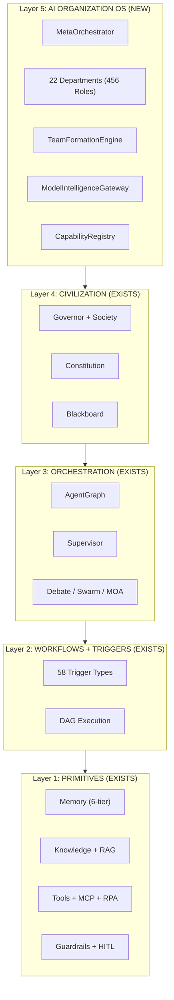

## Diagram 2: Tenant → Org → Dept → Team → Agent Hierarchy

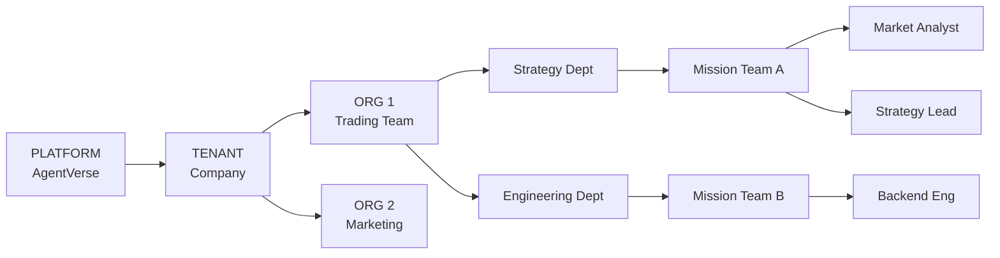

## Diagram 3: Goal → Team Formation → Mission Pipeline

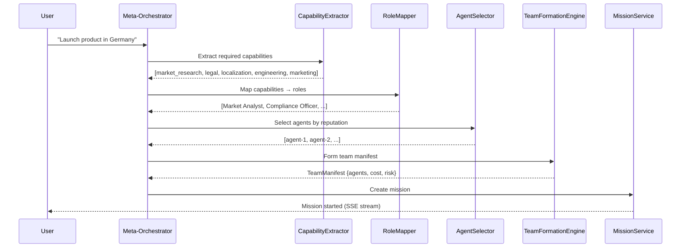

## Diagram 4: Model Intelligence Gateway Routing

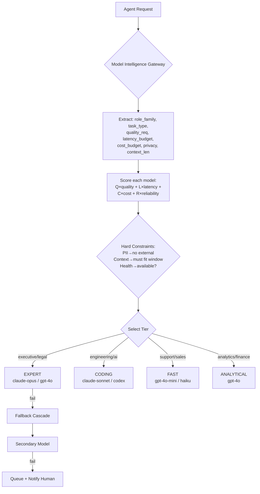

## Diagram 5: 6-Tier Memory Architecture

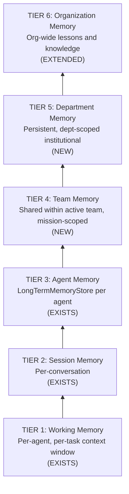

## Diagram 6: Quality Gate System (6-gate)

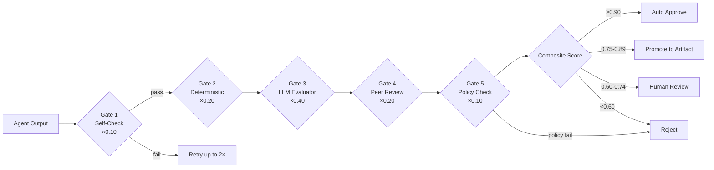

## Diagram 7: Universal Command Gateway (UCG) — Multi-Channel

```mermaid
graph LR
    subgraph CHANNELS["Input Channels"]
        REST["REST API"]
        TG["Telegram Bot"]
        SL["Slack Bot"]
        WA["WhatsApp"]
        DC["Discord"]
        EM["Email"]
        TM["Teams"]
        MC["MCP Client"]
        A2A["A2A Agent"]
        VC["Voice Webhook"]
    end
    subgraph UCG["Universal Command Gateway"]
        ADAPT["Channel Adapter\n(normalize)"]
        DEDUP["CommandDeduplicator\n(30s window)"]
        RATE["RateLimiter\n(per-channel)"]
        AUTH["ChannelAuthGuard\n(per-channel)"]
        ROUTE["CommandRouter"]
    end
    subgraph RESPOND["Response"]
        ORG["Org Brain\n(processes)"]
        FMT["ResponseFormatter\n(per-channel)"]
    end

    CHANNELS --> ADAPT --> AUTH --> DEDUP --> RATE --> ROUTE --> ORG --> FMT --> CHANNELS
```

## Diagram 8: Autonomy Level L0-L5 Decision Tree

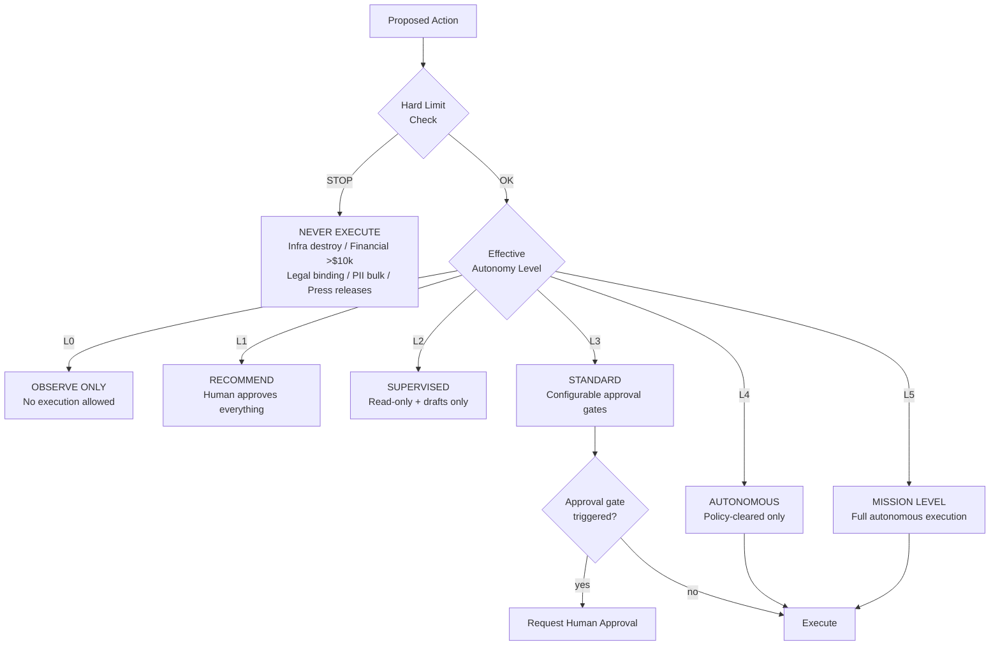

## Diagram 9: Org Event Architecture (Redis pub/sub)

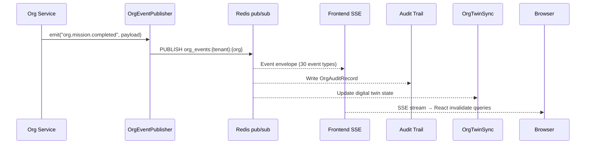

## Diagram 10: Frontend Real-Time Architecture (OrgRealtimeManager)

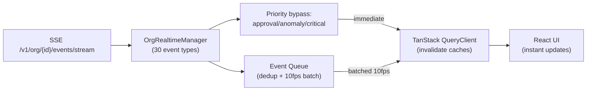

## Diagram 11: Loop Detection (SUPPLEMENT G)

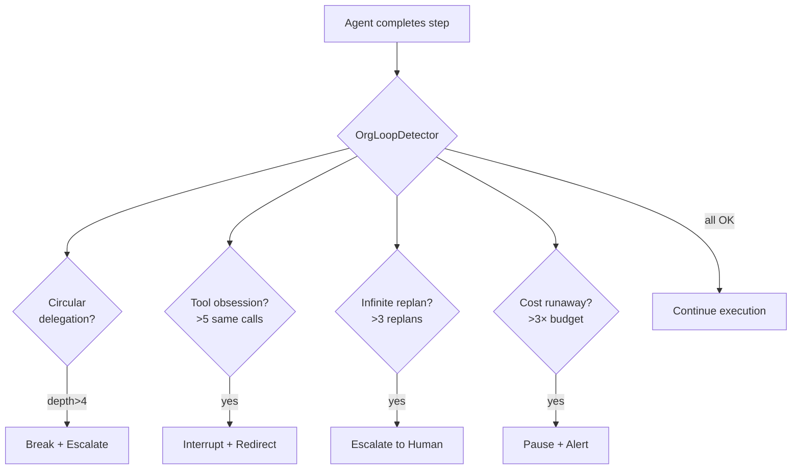

## Diagram 12: Digital Twin + Simulation Engine

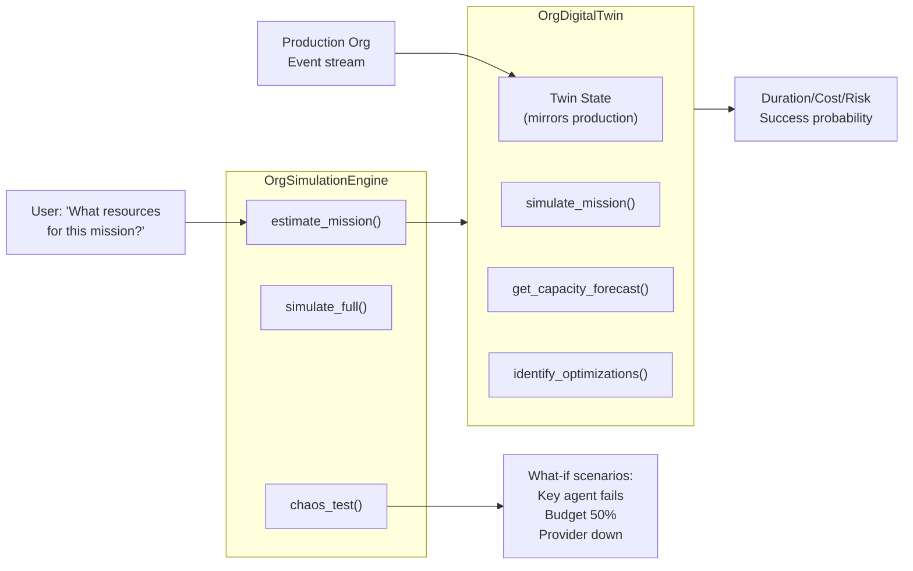

## Diagram 13: Failure Management (5-class taxonomy — SUPPLEMENT F)

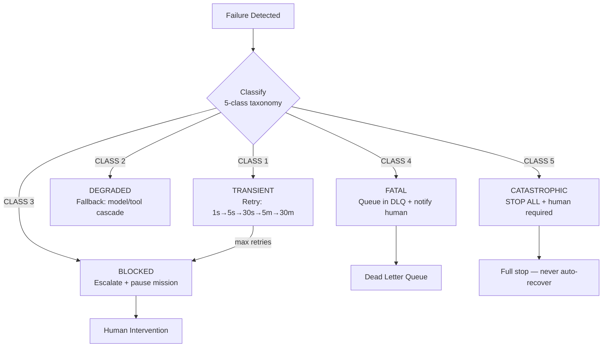

## Diagram 14: Security Boundary Model (Zero Trust)

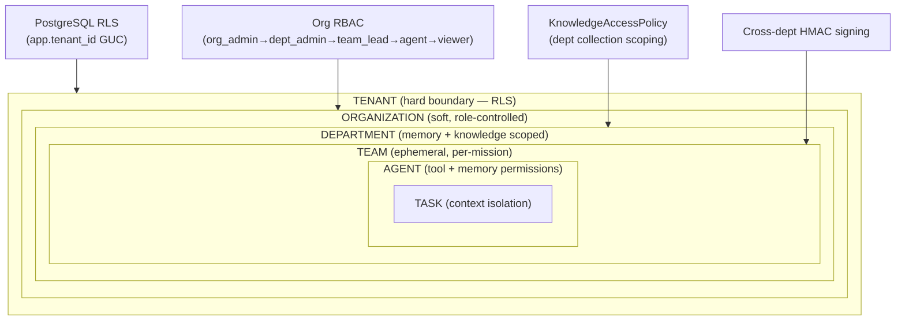

## Diagram 15: Knowledge Access Control (PART 15)

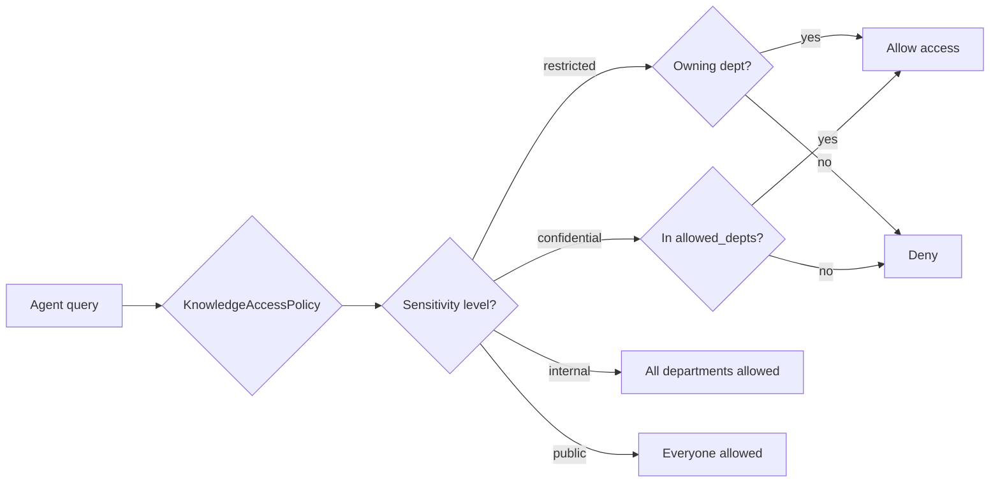

## Diagram 16: Org Learning Pipeline (PART 26)

```mermaid
flowchart TD
    MISS[Mission completes\nor fails] --> EXTRACT[extract_lessons()\nTeam composition\nModel routing\nCost patterns\nRisk indicators]
    EXTRACT --> VALIDATE{validate()\nAnti-poisoning gates}
    VALIDATE -->|conf < 0.70| REJECT[Reject — not promoted]
    VALIDATE -->|PII detected| REJECT
    VALIDATE -->|failed mission| QUARANTINE[Quarantine\nPending human review]
    VALIDATE -->|passed| PROMOTE{promote_to_memory()}
    PROMOTE -->|dept lesson| DEPT_MEM[Department Memory\nTier 5]
    PROMOTE -->|org lesson| ORG_MEM[Organization Memory\nTier 6]
```

## Diagram 17: 456-Role Taxonomy (PART 4)

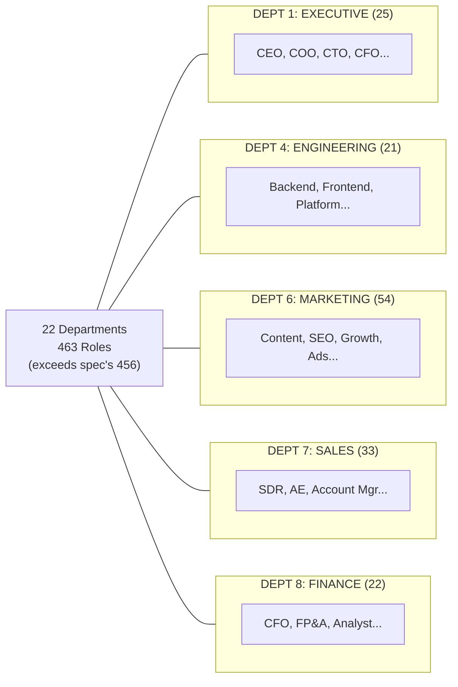

## Diagram 18: API Architecture — Complete Endpoint Map (PART 28)

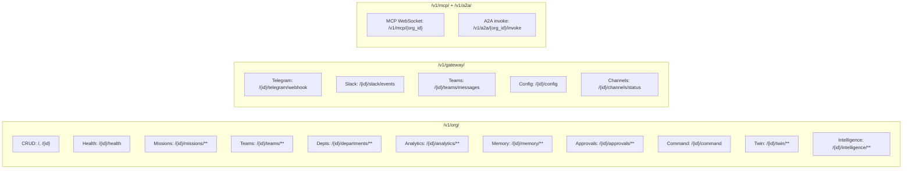

## Diagram 19: Command Deduplication + Scheduling (QA8 + QA9)

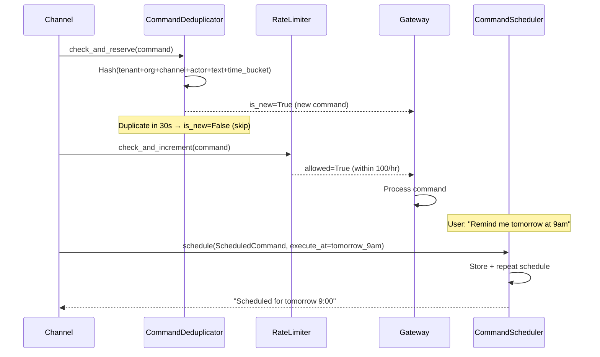

## Diagram 20: End-to-End Mission: "Launch Product in Germany"

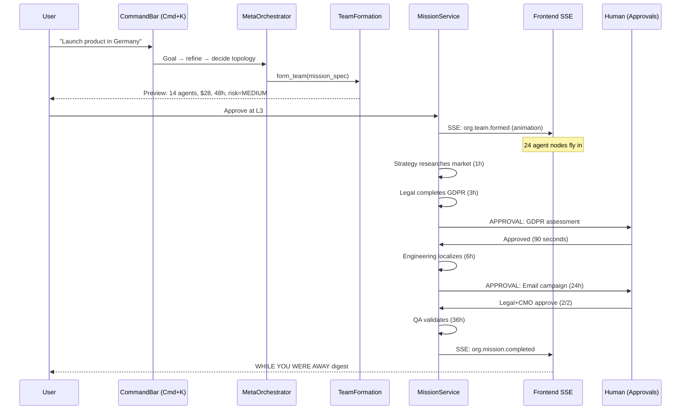
