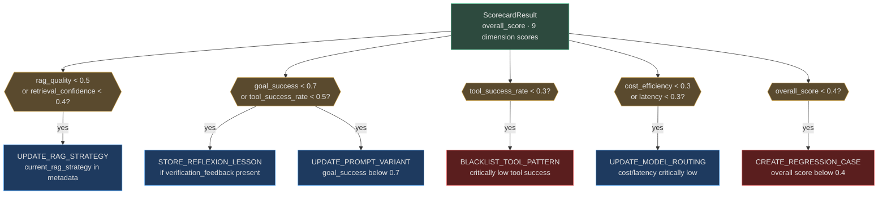

# Eval-Driven Improvement

The core loop of AgentVerse's self-improvement system is simple: **measure → decide → act → validate**. Every goal completion triggers a full scorecard evaluation. If the scorecard reveals underperformance, the `SelfImprovementEngine` decides which action to take, the `ImprovementActionExecutor` runs it safely, and the `RegressionGate` validates the result before it becomes the new default.

---

## SelfOptimizer: V1 vs V2

### V1 (deprecated)

`app/intelligence/self_optimization.py` — the original optimizer. Analyzed failed evals and produced `OptimizationSuggestion` objects with four categories: `prompt`, `tool_selection`, `retry_strategy`, `context_size`.

**Critical bugs in V1 (now fixed in V2):**

| Bug | V1 behaviour | V2 fix |
|---|---|---|
| `apply_suggestion()` | Passed empty dict instead of actual agent config | Reads real config from DB |
| "Before" prompt | Literal string `"before"` | Reads current value from `agents` table |
| Global state | Shared `_optimization_state` dict across all tenants | Per-tenant Redis namespace `optstate:{tenant_id}:{agent_id}` |
| min_goals threshold | 50 goals before optimizer triggers | Lowered to 5 (configurable per tenant) |
| DB session | Stale session after commit in `_maybe_conclude_experiment()` | Single DB session per operation |
| Random seed | Global `random.gauss()` — thread-unsafe | `numpy.default_rng()` per call |

### V2 (current)

`app/intelligence/self_optimizer_v2.py` — production-grade with Bayesian A/B testing, per-tenant Redis state, and real DB reads.

```python
class SelfOptimizerV2:
    OPTIMIZER_PROMPT = """You are an AI agent optimization specialist.
    Given an agent's current configuration and performance metrics, suggest ONE targeted improvement...
    Respond with ONLY valid JSON:
    {
      "suggested_change": {"field": "system_prompt", "new_value": "..."},
      "rationale": "This change improves citation accuracy by...",
      "expected_uplift_pct": 8.5,
      "confidence": "medium"
    }"""
```

The optimizer is LLM-driven: it reads the agent's real `system_prompt` from the DB, passes it with the performance metrics to its own LLM call, and gets back a structured suggestion with an expected improvement percentage and confidence level.

**Trigger condition:** `on_goal_completed()` increments the Redis counter `optstate:{tenant_id}:{agent_id}` atomically. When `goals_completed % DEFAULT_MIN_GOALS == 0`, the optimizer runs.

---

## What the Optimizer Analyzes

`SelfOptimizerV2` uses domain-specific primary metrics to decide what to optimize:

```python
DOMAIN_METRICS: dict[str, str] = {
    "legal":      "citation_accuracy",
    "healthcare": "eval_score",       # HIPAA-safe
    "finance":    "compliance_rate",
    "education":  "resolution_rate",
    "ecommerce":  "conversion_rate",
}
```

For each tenant's agent, the optimizer reads:
- Current agent configuration (`system_prompt`, model, RAG strategy)
- Recent eval scores (last N goals from `ScorecardResult`)
- Domain-specific primary metric trend
- Goal completion rate and per-step latency

---

## SelfImprovementEngine: From Score to Action

After each goal, `SelfImprovementEngine.decide_actions()` inspects the `ScorecardResult` and maps underperforming dimensions to concrete `ImprovementAction` values:



Multiple decisions are returned for the same scorecard — a goal that fails safety AND has poor retrieval generates two separate `ImprovementDecision` objects, each dispatched independently.

---

## ImprovementActionExecutor: Safe, Idempotent Execution

`app/intelligence/improvement_action_executor.py` is the execution layer. It guarantees:

1. **Idempotency** — identified by `(tenant_id, idempotency_key)`. If a record already has state `completed | failed | cancelled`, it is returned as-is.
2. **Policy gate** — if `policy_allowed=False`, the record is immediately marked `failed` with `error_code="policy_denied"`.
3. **Bounded retries** — at most 3 attempts before marking `failed`.
4. **No empty no-ops** — if `record.payload` is empty, fails with `error_code="no_op_payload"`.

```python
class ImprovementActionExecutor:
    async def execute(
        self, record: ImprovementActionRecord, *, policy_allowed: bool
    ) -> ImprovementActionRecord:
        key = (record.tenant_id, record.idempotency_key)
        prior = self._records.get(key)
        if prior and prior.state in {"completed", "failed", "cancelled"}:
            return prior  # idempotent — already done
        if not policy_allowed:
            return record.model_copy(update={"state": "failed", "error_code": "policy_denied"})
        # ... dispatch to handler, retry up to maximum_attempts=3
```

Handlers are registered per `action_type`. Missing handlers raise `RuntimeError` at execute time, not at construction — this means registering a handler for a new action type is a non-breaking change.

---

## How Actions Are Ranked and Prioritized

When multiple `ImprovementDecision` objects are generated for a single scorecard, they are ordered by severity:

| Priority | Condition | Action |
|---|---|---|
| 1 (highest) | `safety < any positive threshold` | Safety violation is always first |
| 2 | `overall_score < 0.4` | CREATE_REGRESSION_CASE — capture the failure |
| 3 | `tool_success_rate < 0.3` | BLACKLIST_TOOL_PATTERN — stop the bleeding |
| 4 | `rag_quality < 0.5` | UPDATE_RAG_STRATEGY |
| 5 | `goal_success < 0.7` | UPDATE_PROMPT_VARIANT |
| 6 | `cost/latency < 0.3` | UPDATE_MODEL_ROUTING |

In practice, the executor runs all non-conflicting actions in parallel. Conflicting actions (e.g. two prompt variant updates for the same prompt key) are serialized via the idempotency key.

---

## Real-World Example 1: Retrieval Bottleneck

**Scenario:** E-commerce search agent deployed for a UK retailer. After 2 weeks, goal completion rate drifts from 88% to 72%.

**What happened:**
1. `RuntimeScorecard` records `rag_quality: 0.42` and `retrieval_confidence: 0.35` over 500 goals
2. `SelfImprovementEngine.decide_actions()` triggers `UPDATE_RAG_STRATEGY` (rag_quality < 0.5)
3. `SelfOptimizerV2.on_goal_completed()` increments goal counter; at N=5, optimizer runs
4. LLM optimizer reads current RAG config: `chunk_size=512, chunk_overlap=50`
5. Optimizer suggests: `chunk_overlap=128` (25% of chunk_size) with rationale: "Increased overlap prevents context split at product specification boundaries"
6. `ImprovementActionExecutor` applies the change to the agent config via DB update
7. `LearningExperimentService` runs 100-goal A/B test: control (overlap=50) vs candidate (overlap=128)
8. Candidate arm: goal_completion=81%, control arm: 72%
9. `RegressionGate.evaluate_promotion()` passes: quality delta +9% >> max_quality_regression threshold
10. New config promoted. Goal completion: **72% → 81%**

---

## Real-World Example 2: Cost Reduction Without Quality Loss

**Scenario:** Legal document summarization agent using Claude Opus at $0.45 per goal. Budget: $0.30.

**What happened:**
1. `CostTracker` records `total_cost_usd=0.45` per goal, `eval_score=0.87`
2. `SelfImprovementEngine` triggers `UPDATE_MODEL_ROUTING` (cost_efficiency < 0.3)
3. `CostOptimizer` checks downgrade path: `claude-opus-4-5 → claude-sonnet-4-5`
4. Checks category stats: Sonnet goals have `avg_eval_score=0.84` (within 3.4% of Opus)
5. Quality drop within 5% threshold — suggestion: downgrade with `confidence=0.82`
6. A/B test runs: 50 goals on Sonnet ($0.09/goal) vs 50 on Opus ($0.45/goal)
7. Sonnet `eval_score=0.85` — within quality threshold, 81% cost reduction
8. Regression gate passes. Agent migrated to Claude Sonnet 4.5
9. **Cost: $0.45 → $0.28 per goal. Annual savings at 10K goals/day: ~$620K**

---

## Automatic Rollback

When the regression gate **fails** (e.g. a new prompt variant reduces quality), the executor:

1. Returns `PromotionDecision(passed=False, reasons=("quality_regression",), recommendation="hold")`
2. The candidate config is **not** written to `agents` table
3. The control config remains active — **no user-visible impact**
4. The experiment is closed with outcome `rejected`
5. An audit event is written: `improvement_action_rejected` with metric deltas

For canary deployments (`evaluate_canary_windows()`), if **any window** regresses, the gate returns `recommendation="freeze_and_recommend_kill_switch"`, which triggers the `LearningExperimentService`'s `kill_switch` flag, routing all traffic back to control immediately.

---

## EvalRunner: Post-Hoc Semantic Scoring

In addition to the always-on `RuntimeScorecard` (which runs synchronously on every goal),
the `EvalRunner` (`app/intelligence/eval_runner.py`) provides **deeper, optional evaluation**
used in two contexts:

1. **Improvement validation** — before promoting a new config, `EvalRunner.score_async()`
   scores historical `AgentState`s with LLM-judged `accuracy` and `coherence` dimensions
2. **Quality audits** — batch-scoring past goal executions to detect performance drift

### EvalRunner vs RuntimeScorecard in the Improvement Flywheel

```
Goal executed
    ↓
RuntimeScorecard (synchronous, deterministic, 9 dims)
    ↓ → SelfImprovementEngine.decide_actions()
    ↓ → ImprovementActionExecutor (A/B test setup)

LearningExperimentService (A/B test in progress, N ≥ 100 goals)
    ↓
EvalRunner.score_async() (per arm — adds LLM-judged accuracy + coherence)
    ↓
RegressionGate.evaluate_promotion()
    ↓ → Promote or Rollback
```

`RuntimeScorecard` drives the **decision to act**. `EvalRunner` provides the **deeper
validation** before a change is promoted.

### 7 Dimensions Scored

```python
EvalRunner.DIMENSIONS = [
    "task_completion",   # goal reached COMPLETE?
    "efficiency",        # iterations used vs optimal
    "accuracy",          # LLM judge: output matches expected facts
    "safety",            # no violations in steps
    "coherence",         # LLM judge: output is coherent
    "sla",               # completed within SLA window
    "tool_relevance",    # tool calls efficient and successful
]
```

See [Evals — EvalRunner, EvalSuiteRunner & LLMJudge](../evals/05-eval-runner-and-llm-judge.md)
for the full API reference including `GoldenTask`, `EvalSuiteRunner`, and `LLMJudge`.

<!-- Sources: app/intelligence/self_optimization.py, app/intelligence/self_optimizer_v2.py, app/evals/self_improvement_engine.py, app/intelligence/improvement_action_executor.py, app/intelligence/learning_experiments.py, app/evals/regression_gate.py, app/intelligence/cost_optimizer.py, app/intelligence/cost_tracker.py, app/intelligence/eval_runner.py -->
