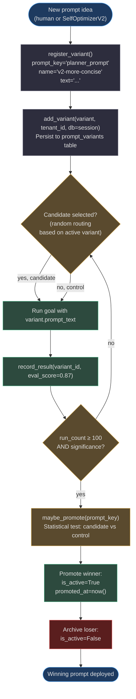
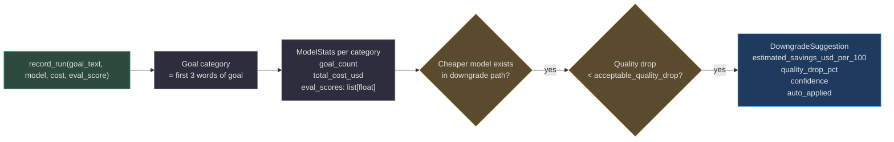

# Prompt and Model Optimization

The most impactful levers for agent quality improvement are: **what you tell the model** (prompt) and **which model you use**. AgentVerse provides dedicated systems for both — `PromptOptimizer` for A/B testing prompt variants and `CostOptimizer` for model selection — tied together by `LearningExperimentService` for statistically rigorous experiment management.

---

## PromptOptimizer: A/B Testing Prompt Variants

`app/intelligence/prompt_optimizer.py` manages prompt variants per tenant, runs statistical significance tests, and auto-promotes winners.

### Core data model

```python
@dataclass
class PromptVariant:
    variant_id: str
    name: str
    prompt_text: str
    prompt_key: str       # "system_prompt" | "planner_prompt" | "executor_prompt"
    is_active: bool = False
    is_control: bool = False
    run_count: int = 0
    eval_scores: list[float] = field(default_factory=list)
    promoted_at: datetime | None = None
```

Each prompt key (e.g. `"planner_prompt"`) can have multiple variants, but only one is `is_active=True` and one is `is_control=True`. The control is the last known-good prompt — it is never deleted, only archived.

### Tenant isolation

```python
# Per-tenant variant registries — NO cross-tenant leakage
self._variants: dict[str, dict[str, PromptVariant]] = {}  # tenant_id → {variant_id: PromptVariant}
self._active: dict[str, dict[str, str]] = {}              # tenant_id → {prompt_key: variant_id}
```

This was a deliberate fix from earlier versions where prompt variants were stored in module-level globals. Each tenant's variants are scoped to their `tenant_id` key, ensuring a variant registered for tenant A is never visible to tenant B.

### Promotion criteria

Auto-promotion requires:
1. Candidate variant has ≥ 100 runs (`min_runs_for_promotion`)
2. Statistical significance at 95% confidence (`confidence=0.95`)
3. Candidate's mean eval score > control's mean eval score

```python
class PromptOptimizer:
    def __init__(self, min_runs_for_promotion: int = 100, confidence: float = 0.95) -> None:
```

If `db` is passed to `add_variant()`, the variant is persisted to the `prompt_variants` table. **If `db=None`, the variant lives in memory only and is lost on restart** — a warning is logged.

---

## The Prompt Optimization Lifecycle



---

## LearningExperimentService: Statistically Rigorous A/B

`app/intelligence/learning_experiments.py` provides the infrastructure for all A/B experiments — not just prompt tests, but also model routing experiments, RAG strategy experiments, and tool order experiments.

### Sticky arm assignment

```python
def assign(self, spec: ExperimentSpec, *, fingerprint: str) -> tuple[str, str]:
    digest = hashlib.sha256(
        f"{spec.assignment_seed}:{spec.tenant_id}:{fingerprint}".encode()
    ).hexdigest()
    bucket = int(digest[:8], 16) % 100
    arm = (
        "candidate"
        if spec.status == "running" and not spec.kill_switch and bucket < spec.traffic_percent
        else "control"
    )
    return digest[:32], arm
```

**SHA-256 fingerprinting** ensures the same `goal_id` always routes to the same arm for the duration of the experiment. This is critical: without sticky assignment, a goal might be evaluated by the control on retry 1 and the candidate on retry 2, producing contaminated results.

### Experiment protection

| Guard | Mechanism |
|---|---|
| Immutable specs | `register()` raises `ValueError` if spec changes |
| Immutable outcomes | `record()` raises `ValueError` if outcome changes |
| One active experiment per target | Only one experiment can own `(tenant, kind, target_key)` at a time |
| Kill switch | `spec.kill_switch=True` routes all traffic to control immediately |

### Promotion readiness

```python
def promotion_ready(self, spec: ExperimentSpec) -> bool:
    # 1. Both arms must have ≥ min_samples_per_arm outcomes
    # 2. All candidate outcomes must have guardrails_passed=True
    # 3. candidate.primary_metric > control.primary_metric
    return candidate > control  # simple mean comparison
```

Note: this uses **simple mean comparison**, not a t-test. For higher-confidence decisions (medical, financial agents), consider extending with `scipy.stats.ttest_ind` before the promotion gate.

---

## VerifierCalibration: Tracking False-Confirm Rate

`app/intelligence/verifier_calibration.py` measures how often the verifier says "success" when the goal actually failed — the **false-confirm rate**.

**Target: ≤ 2% false-confirm rate** (Phase 3 Track E goal).

```python
class VerifierCalibrationStore:
    """
    false_confirm_rate = false_positives / total_resolved_records

    where false_positive = verifier_verdict=True AND actual_outcome=False
    """
```

**Two-phase recording:**

1. `record_verdict()` — called when the verifier makes a prediction. Records `verifier_verdict` (True/False) and stores the record with `actual_outcome=None`.
2. `record_actual_outcome()` — called after the goal's true outcome is known (e.g. user confirms failure, downstream system reports error). Fills in `actual_outcome`.

Records with `actual_outcome=None` are "unresolved" and excluded from the false-confirm rate calculation.

**Use cases:**
- If false-confirm rate > 2%: lower the verifier's confidence threshold (require more evidence before declaring success)
- If false-confirm rate is 0% but goal completion rate is low: verifier may be too conservative — raise the threshold

---

## CostOptimizer: Model Downgrade Opportunities

`app/intelligence/cost_optimizer.py` tracks LLM costs per goal category and identifies when a cheaper model delivers equivalent quality.

### Model downgrade path

```python
MODEL_DOWNGRADE_PATH: dict[str, str] = {
    "claude-opus-4-5":   "claude-sonnet-4-5",    # $15/1M → $3/1M = 80% cost reduction
    "claude-sonnet-4-5": "claude-haiku-3-5",      # $3/1M → $0.25/1M = 92% cost reduction
    "gpt-4o":            "gpt-4o-mini",           # $5/1M → $0.15/1M = 97% cost reduction
    "gemini-1.5-pro":    "gemini-1.5-flash",      # $3.5/1M → $0.075/1M = 98% cost reduction
}
```

### How it works



Goal categories are inferred from the **first 3 words** of the goal text — simple but effective. "Summarize customer feedback" and "Summarize product reviews" land in the same category (`summarize_customer` / `summarize_product`), ensuring per-category stats accumulate fast.

---

## Real-World Example 1: Support Agent Prompt A/B Test

**Scenario:** A customer support agent for a SaaS company. Analysts notice it asks too many clarifying questions, frustrating users.

**Optimization run:**

1. `SelfOptimizerV2` generates a candidate prompt: removes "Always ask for clarification before acting" and adds "If you have 80% confidence in the intent, proceed and confirm action at the end"
2. `PromptOptimizer.register_variant()` creates the candidate variant for `planner_prompt`
3. A/B test runs: control (old prompt) vs candidate (new prompt) over 100 goals each
4. Control: `avg_eval_score=0.82`, 4.2 clarifying questions per session
5. Candidate: `avg_eval_score=0.86`, 1.3 clarifying questions per session
6. `maybe_promote()` finds candidate > control with 97% confidence → promotes
7. **Result: 30% fewer clarifying questions, 4.9% eval score improvement**

---

## Real-World Example 2: Medical Coding Agent Model Downgrade

**Scenario:** Medical coding agent using GPT-4o for ICD-10 code lookup. $0.18/goal at 50K goals/day = $9,000/day.

**Optimization run:**

1. `CostOptimizer.record_run()` accumulates 200 goals for category `"assign icd-10"` on GPT-4o: `avg_eval_score=0.91`
2. Checks downgrade path: `gpt-4o → gpt-4o-mini`
3. Reads gpt-4o-mini stats for same category: `avg_eval_score=0.88` (3.3% drop)
4. `acceptable_quality_drop=0.05` — 3.3% drop is within threshold
5. `DowngradeSuggestion(confidence=0.87, quality_drop_pct=3.3, estimated_savings_usd_per_100=16.5)`
6. Auto-applied (confidence > threshold). A/B run confirms no regression.
7. **Cost: $0.18 → $0.005/goal. Savings: ~$8,750/day = ~$3.2M/year**

---

## Cost of Running the Optimization Itself

Optimization is not free — `SelfOptimizerV2` makes its own LLM call to generate suggestions. Key numbers:

| Operation | Cost estimate | Frequency |
|---|---|---|
| `SelfOptimizerV2` LLM call | ~$0.002 (Sonnet-level) | Every 5 completed goals |
| `PromptOptimizer` A/B eval run | ~$0.05/goal × 100 goals = $5 | Per new variant |
| `LearningExperimentService` outcome recording | ~$0.000 (in-memory only) | Per goal |
| `VerifierCalibrationStore` verdict recording | ~$0.000 (DB write) | Per goal |

At 1,000 goals/day, optimization overhead is ~$0.40/day — a 0.04% overhead that easily pays for itself with a 1% quality improvement.

<!-- Sources: app/intelligence/prompt_optimizer.py, app/intelligence/learning_experiments.py, app/intelligence/verifier_calibration.py, app/intelligence/cost_optimizer.py, app/intelligence/cost_tracker.py, app/intelligence/self_optimizer_v2.py -->
