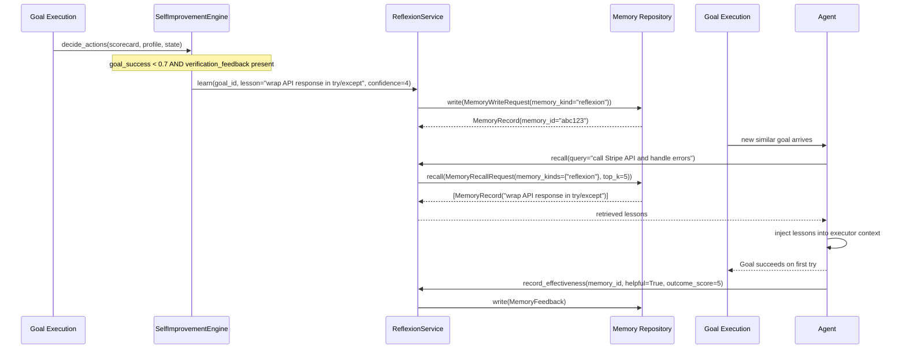

# Reflexion and Memory Feedback

Every goal that fails is a learning opportunity. AgentVerse's reflexion system captures the structured lesson from each failure, stores it in the memory layer, and injects it into future goals that match the same pattern. Over time, an agent that once failed at a class of tasks builds up a library of lessons that makes it effectively impossible to fail at that class again.

This is the **memory-driven improvement loop** — distinct from the statistical A/B testing of prompts or the regression gate for deployments. Reflexion operates at the level of **individual goal failures**, not aggregate metrics.

---

## What Is Reflexion?

Reflexion is a technique where an agent analyzes its own failure, articulates what went wrong and what it would do differently, stores that articulation as a structured memory entry, and retrieves it the next time it faces a similar task.

In AgentVerse, this is implemented by `ReflexionService` (`app/memory/reflexion.py`) which wraps the memory repository with a reflexion-specific interface.

**The key insight:** The lesson is stored in memory, not in the prompt. This means:
1. The prompt stays clean and doesn't grow unboundedly
2. Lessons are retrieved **only when relevant** — not injected into every goal
3. The memory system handles recency decay, so stale lessons don't dominate

---

## ReflexionService: The API

```python
class ReflexionService:
    async def learn(
        self,
        *,
        tenant_id: str,
        goal_id: str,
        execution_id: str,
        safe_lesson: str,           # the lesson text — must be PII-free
        evidence_refs: tuple[str, ...],  # e.g. ("step_3_error", "tool_call_id_7")
        classification: Classification,  # data sensitivity class
        confidence: int,            # 1-5 confidence in this lesson
        idempotency_key: str,
    ) -> MemoryRecord:
        # Writes a MemoryWriteRequest with memory_kind="reflexion"
        # retention_policy_id="reflexion-standard"
```

```python
    async def recall(
        self,
        *,
        tenant_id: str,
        query: str,                         # current goal text
        allowed_data_classes: frozenset[Classification],
        top_k: int = 5,                     # retrieve top 5 relevant lessons
        token_budget: int = 1_000,          # hard limit on total token usage
    ) -> tuple[MemoryRecord, ...]:
        # Queries memory with memory_kinds={"reflexion"}
        # min_confidence=1
```

```python
    async def record_effectiveness(
        self,
        *,
        tenant_id: str,
        memory_id: str,
        execution_id: str,
        used: bool,                         # was the lesson retrieved and used?
        helpful: bool,                      # did it help the goal succeed?
        harmful: bool,                      # did it interfere with the goal?
        outcome_score: int,
        reason: str,
    ) -> MemoryRecord:
        # Writes a MemoryFeedback record
        # Enables lesson effectiveness tracking
```

---

## The Reflexion Loop



---

## When Lessons Are Extracted

The `SelfImprovementEngine` triggers `STORE_REFLEXION_LESSON` when:

```python
if scores.get("goal_success", 1.0) < 0.7 or scores.get("tool_success_rate", 1.0) < 0.5:
    if state and (state.verification_feedback or "").strip():
        actions.append(ImprovementDecision(
            action_type=ImprovementAction.STORE_REFLEXION_LESSON,
            reason="goal failed with actionable feedback",
            metadata={"feedback": (state.verification_feedback or "")[:200]},
        ))
```

The condition is: **goal failed AND the verifier left structured feedback**. The verifier's feedback is the raw material for the lesson — it explains *why* the goal failed, which becomes the core of the lesson text.

**Lesson content guidelines:**

| Good lesson | Bad lesson |
|---|---|
| "When calling the Stripe API, wrap the response in try/except to handle StripeError" | "Be more careful" |
| "The date field in this API uses Unix timestamp, not ISO 8601" | "Handle dates correctly" |
| "Authentication requires Bearer token in Authorization header, not Basic auth" | "Fix authentication" |

Lessons must be **specific** and **actionable** — vague lessons are not retrieved by the semantic search because they don't match any query.

---

## Memory-Assisted Improvement: Patterns Over Time

Beyond single-lesson reflexion, the memory layer tracks **patterns across goals** via:

1. **EpisodicMemory** — raw events from each goal execution, including tool calls, errors, and results
2. **LongTermMemoryStore** — aggregated learnings across many goals for the same tenant/agent
3. **Procedural memory** — success rates per tool sequence, updated after each goal

The improvement engine reads these patterns to identify:
- Tools that fail consistently (→ BLACKLIST_TOOL_PATTERN)
- Goal types where latency is always high (→ UPDATE_MODEL_ROUTING)
- Query patterns where RAG quality is always low (→ UPDATE_RAG_STRATEGY)

---

## Cross-Goal Learning: Lessons That Transfer

Reflexion lessons are stored at the **tenant scope**, not the **goal scope**. This means a lesson learned from a failing "summarize contract" goal can be retrieved and applied to a "review contract clause" goal — if the query is semantically similar.

**Token budget enforcement** (`token_budget: int = 1_000`) ensures that injected lessons don't crowd out the actual goal context. The memory system retrieves top_k lessons but truncates to stay within the budget, prioritizing:
1. Higher `confidence` lessons
2. More recent lessons (recency decay)
3. Higher `outcome_score` from effectiveness feedback

---

## Lesson Lifecycle: Retention and Decay

| Stage | What happens |
|---|---|
| Creation | `learn()` writes with `retention_policy_id="reflexion-standard"` |
| Active | Retrieved by `recall()` when query matches |
| Effectiveness tracking | `record_effectiveness()` marks as helpful/harmful |
| Decay | Lessons with consistently `helpful=False` receive lower retrieval priority |
| Archival | `retention_policy_id="reflexion-standard"` defines the archival window (typically 90 days without use) |

---

## Real-World Example 1: API Response Parsing

**Scenario:** An integration agent for a fintech platform fails 3 times when parsing Plaid API responses.

**Failure pattern:**
- Goal: "Fetch transactions for user {user_id} from Plaid and summarize"
- Error: `KeyError: 'transactions'` — the Plaid sandbox returns `{"request_id": "...", "accounts": [...]}` without `transactions` when auth is not completed
- Verifier feedback: "Step 3 failed: KeyError accessing response['transactions']"

**Reflexion triggers:**

1. `SelfImprovementEngine` detects `goal_success=0.0`, `verification_feedback` present
2. `ReflexionService.learn()` called with:
   ```
   safe_lesson: "Plaid API returns empty transactions array when account link is pending.
   Always check response.get('transactions', []) not response['transactions'].
   If transactions empty, check accounts[].balances.available for auth status."
   confidence: 4
   ```
3. Stored in memory with `memory_kind="reflexion"`

**Next similar goal (2 days later):**
- New goal: "Get Plaid balance data for account #XYZ"
- `recall(query="Plaid balance data account")` → retrieves the lesson
- Agent executor context includes: lesson about Plaid empty response patterns
- Agent uses `response.get('accounts', [])` pattern proactively
- **Goal succeeds first try. Never fails again for Plaid auth-pending cases.**

---

## Real-World Example 2: Cross-Goal Transfer

**Scenario:** Legal contract agent learns a lesson about force majeure clauses. A week later, the same tenant deploys a contract comparison agent.

**Original lesson:** "UK force majeure clauses under English law require: (1) an unforeseeable event, (2) beyond reasonable control, (3) which prevents performance. Check all three conditions before advising enforceability."

**Cross-goal retrieval:**
- New goal: "Compare these two commercial contracts for risk allocation differences"
- The comparison goal's query includes "force majeure" in the contract text
- `recall(query="compare commercial contracts risk allocation force majeure")` retrieves the lesson
- The comparison agent surfaces the UK law conditions proactively — not because it was explicitly trained on them, but because the lesson transferred from the summarization agent

**This is the compounding effect of reflexion** — lessons from specialist goals improve generalist goals, building institutional knowledge at the tenant level.

---

## Privacy: Lessons Are Tenant-Scoped

All reflexion lessons are **strictly scoped to the tenant** that generated them:

```python
await self._repository.write(
    MemoryWriteRequest(
        tenant_id=tenant_id,     # always set from authenticated context
        memory_kind="reflexion",
        content=safe_lesson,     # must be PII-free (caller responsibility)
        ...
    )
)
```

And retrieved with:

```python
await self._repository.recall(
    MemoryRecallRequest(
        tenant_id=tenant_id,      # scoped — no cross-tenant recall possible
        memory_kinds=frozenset({"reflexion"}),
        allowed_data_classes=allowed_data_classes,  # data sensitivity filter
        ...
    )
)
```

The `safe_lesson` content is the **caller's responsibility** to sanitize. The recommended practice is to pass the verifier's feedback through a PII-stripping step before calling `learn()`. The `classification` field on `MemoryWriteRequest` and `allowed_data_classes` on recall provide an additional data sensitivity layer.

**No cross-tenant lesson sharing** exists or is planned — lessons about Tenant A's API keys, business logic, or data formats must never be accessible to Tenant B.

<!-- Sources: app/memory/reflexion.py, app/evals/self_improvement_engine.py, app/memory/contracts.py -->
