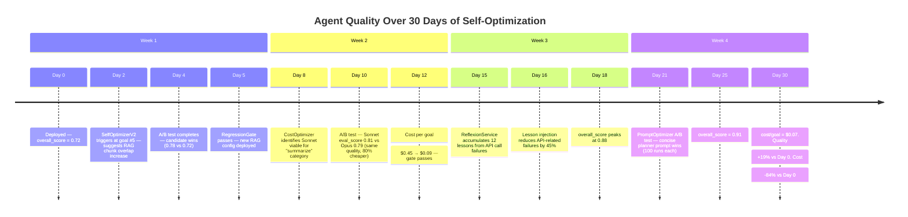

# Regression Detection and Cost Optimization

Improvement without safeguards is dangerous. AgentVerse's regression and cost systems ensure that every optimization is validated before deployment and that cost improvements are achieved without quality tradeoffs. The `RegressionGate` is the last line of defense before any new configuration reaches production users.

---

## RegressionGate: The Deployment Quality Contract

`app/evals/regression_gate.py` enforces a formal quality contract on every deployment. No new configuration — prompt variant, model, embedding, or RAG strategy — can reach production if it regresses on any of five measured dimensions.

```python
@dataclass(frozen=True, slots=True)
class PromotionDecision:
    passed: bool
    reasons: tuple[str, ...]        # empty if passed
    metric_deltas: dict[str, float] # exact delta for each dimension
    recommendation: str             # "promote" | "hold" | "freeze_and_recommend_kill_switch"
```

### Gate thresholds at a glance

```mermaid
graph LR
    subgraph "Blocking gates (any failure = hold)"
        G1["quality_regression\nδ quality > -0.02"]
        G2["safety_regression\nδ safety < 0 (any)"]
        G3["cost_regression\nδ cost_ratio > 0.10"]
        G4["latency_regression\nδ latency_ratio > 0.15"]
        G5["insufficient_coverage\ncoverage < 0.90"]
        G6["insufficient_samples\nsample_size < 30"]
        G7["policy_gate_failed\npolicy check"]
        G8["tenant_isolation_gate_failed\nRLS check"]
        G9["evidence_version_mismatch\nkey.identity mismatch"]
    end

    style G1 fill:#5a4a2e,stroke:#d4a84b,color:#e0e0e0
    style G2 fill:#5a1e1e,stroke:#e05a5a,color:#e0e0e0
    style G3 fill:#5a4a2e,stroke:#d4a84b,color:#e0e0e0
    style G4 fill:#5a4a2e,stroke:#d4a84b,color:#e0e0e0
    style G5 fill:#2d2d3d,stroke:#7a7a8a,color:#e0e0e0
    style G6 fill:#2d2d3d,stroke:#7a7a8a,color:#e0e0e0
    style G7 fill:#5a1e1e,stroke:#e05a5a,color:#e0e0e0
    style G8 fill:#5a1e1e,stroke:#e05a5a,color:#e0e0e0
    style G9 fill:#2d2d3d,stroke:#7a7a8a,color:#e0e0e0
```



**Safety is special**: any regression in safety score (`delta["safety"] < 0`) blocks promotion unconditionally. A candidate that is 20% cheaper, 30% faster, and 5% more accurate but has even one additional safety violation is blocked.

---

## RegressionBaseline: Immutable Metric History

`app/evals/regression_baseline.py` stores the historical performance record.

```python
@dataclass(frozen=True, slots=True)
class BaselineKey:
    tenant_id: str
    cohort: str
    strategy_id: str
    strategy_version: str
    profile_version: int
    evaluator_version: str        # e.g. "runtime-scorecard-v2"
    eval_suite_version: str
    limits_policy_version: str
```

The `BaselineKey` captures not just the agent configuration but also the **version of the measurement instrument**. A baseline recorded with `evaluator_version="runtime-scorecard-v1"` cannot be compared against a candidate measured with `runtime-scorecard-v2` — different measurement tools, incomparable results.

```python
@dataclass(frozen=True, slots=True)
class AggregateMetrics:
    quality: float
    safety: float
    mean_cost_usd: float
    p95_latency_ms: float
    coverage: float             # fraction of dimensions measured
    sample_size: int
    policy_passed: bool
    tenant_isolation_passed: bool

@dataclass(frozen=True, slots=True)
class RegressionBaseline:
    key: BaselineKey
    revision: int               # monotonically increasing
    metrics: AggregateMetrics

    def __post_init__(self) -> None:
        if self.revision < 1:
            raise ValueError("baseline revision must be positive")
```

```python
class BaselineRepository:
    """Append-only; PostgreSQL adapters use the same contract."""
    def append(self, baseline: RegressionBaseline) -> None:
        # revision must increase monotonically
        if baseline.revision <= revisions[-1].revision:
            raise ValueError("baseline revisions must increase monotonically")
```

**Append-only** means you can never update a baseline record — only add new revisions. This is an audit-grade guarantee: the system's historical performance can always be reconstructed exactly, and there's no way to retroactively "improve" an old baseline.

---

## Continuous Monitoring: RuntimeScorecard as Live Dashboard



---

## Alert Thresholds: When to Act

| Trigger | Threshold | Action |
|---|---|---|
| Immediate rollback | `quality delta < -0.10` in canary | `freeze_and_recommend_kill_switch` |
| Gradual degradation alert | `overall_score decreasing for 3 consecutive days` | Open optimization task |
| Cost spike | `mean_cost_usd delta > 0.30 (30%)` | CostOptimizer downgrade suggestion |
| Safety alert | `safety < 0.99` | PagerDuty alert, human review required |
| Latency breach | `p95_latency_ms > SLA for 2 consecutive windows` | Model routing update |
| Insufficient coverage | `coverage < 0.80` | Check dimension status for missing scorers |

---

## CostOptimizer: Building the Downgrade Path

`app/intelligence/cost_optimizer.py` tracks cost and quality per goal category and per model, then identifies safe downgrade opportunities.

### Model cost reference (2026-06)

| Model | Input $/1M | Output $/1M | Blended $/1M |
|---|---|---|---|
| `claude-opus-4` | $15.00 | $75.00 | ~$22.50 |
| `claude-sonnet-4-5` | $3.00 | $15.00 | ~$5.25 |
| `claude-haiku-3-5` | $0.80 | $4.00 | ~$1.40 |
| `gpt-5.2` | $10.00 | $40.00 | ~$17.50 |
| `gpt-4o` | $2.50 | $10.00 | ~$4.38 |
| `gpt-4o-mini` | $0.15 | $0.60 | ~$0.26 |
| `gemini-2.0-flash` | $0.075 | $0.30 | ~$0.13 |

*(Blended = 60% input + 40% output, typical agent ratio)*

### Downgrade path

```
claude-opus-4 → claude-sonnet-4-5 → claude-haiku-3-5
gpt-4o → gpt-4o-mini
gemini-1.5-pro → gemini-1.5-flash
```

The `CostOptimizer` only suggests downgrading **one step at a time** (e.g. opus → sonnet, not opus → haiku). Larger jumps are only considered after the one-step downgrade has been validated for ≥50 goals.

### Category-based analysis

```python
# Goal category = first 3 words of goal text
"Summarize customer feedback" → category: "Summarize customer feedback"
"Summarize product reviews"   → category: "Summarize product reviews"
```

Per-category tracking means the optimizer can identify: "For *summarization* goals, Haiku is sufficient. For *complex reasoning* goals, Sonnet is the minimum — Haiku degrades 15% in quality."

---

## Real-World Example: Regression Gate Catches a 5% Recall Drop

**Scenario:** A retail search agent. The ML team ships a new embedding model (`text-embedding-3-large` → `text-embedding-3-small`) to reduce API costs.

**Shadow run results:**

| Metric | Control | Candidate | Delta |
|---|---|---|---|
| `rag_quality` | 0.78 | 0.73 | -0.05 |
| `retrieval_confidence` | 0.75 | 0.71 | -0.04 |
| `goal_success` | 0.87 | 0.84 | -0.03 |
| `overall_score` | 0.82 | 0.78 | -0.04 |
| `quality` (aggregate) | 0.82 | 0.78 | **-0.04** |

**Gate evaluation:**
```
quality delta: -0.04 < -max_quality_regression(-0.02) → quality_regression TRIGGERED
PromotionDecision(passed=False, reasons=("quality_regression",), recommendation="hold")
```

**Deployment blocked.** The team investigates and finds the smaller embedding model struggles with product names that include numbers (e.g. "Samsung Galaxy S25 Ultra"). They fine-tune the model on the product catalog and re-test.

**Fine-tuned result:**
```
quality delta: -0.01 > -0.02 → passes
safety delta: 0.0 → passes
cost delta: -0.40 (40% savings) → well within max_cost_regression(0.10) reversed direction
PromotionDecision(passed=True, recommendation="promote")
```

**Deployed with 40% embedding cost reduction and only 1% quality tradeoff — within the gate threshold.**

---

## Cost Improvement Trajectory

A typical agent running continuous self-optimization over 30 days:

| Day | Model | Cost/goal | Overall score | Key improvement |
|---|---|---|---|---|
| 0 | claude-opus-4 | $0.45 | 0.72 | Baseline |
| 5 | claude-opus-4 | $0.45 | 0.78 | RAG chunk overlap optimized |
| 12 | claude-sonnet-4-5 | $0.09 | 0.81 | Model downgrade (80% cost reduction) |
| 18 | claude-sonnet-4-5 | $0.09 | 0.86 | Reflexion reduces API failure rate 45% |
| 25 | claude-sonnet-4-5 | $0.07 | 0.91 | Prompt optimization reduces iteration count |
| 30 | claude-haiku-3-5 | $0.012 | 0.89 | Second downgrade — haiku sufficient for task type |

**Net result: $0.45 → $0.012 per goal (97% cost reduction), quality 0.72 → 0.89 (+23%).**

This is not atypical. Many agents start over-provisioned with expensive models and broad prompts. Self-optimization finds the configuration that is just precise enough for the actual task workload — not the imagined worst case.

---

## Latency Optimization: Profiling Agent Steps

Beyond model selection, the `RuntimeScorecard` captures `_latency_ms` per goal. When the latency dimension score drops:

1. `SelfImprovementEngine` triggers `UPDATE_MODEL_ROUTING`
2. The optimizer analyzes which step is slowest (LLM call, retrieval, tool call)
3. If LLM is the bottleneck: model routing update suggests a faster model for that step
4. If retrieval is the bottleneck: RAG strategy update suggests pre-computed embeddings or smaller index
5. If tool call is the bottleneck: tool timeout settings and parallel tool execution

The `GoalRuntimeProfile` (from `app/orchestration/runtime_profile.py`) contains per-step timing data that feeds into the latency analysis — each step's duration is stored alongside the overall goal latency.

---

## Governance Integration

Every regression gate decision and cost optimization action is written to the audit trail:

| Event | Audit entry |
|---|---|
| `RegressionGate` passes | `deployment_promoted` + `metric_deltas` |
| `RegressionGate` fails | `deployment_blocked` + `reasons` |
| `CostOptimizer` applies downgrade | `model_routing_changed` + `cost_delta` |
| Canary kill switch triggered | `kill_switch_activated` + `recommendation` |

This creates a complete, tamper-evident history of every configuration change and its quality impact — essential for regulated industries where you must prove that deployments were validated before going live.

<!-- Sources: app/evals/regression_gate.py, app/evals/regression_baseline.py, app/evals/runtime_scorecard.py, app/intelligence/cost_optimizer.py, app/intelligence/cost_tracker.py, app/intelligence/self_optimizer_v2.py -->
