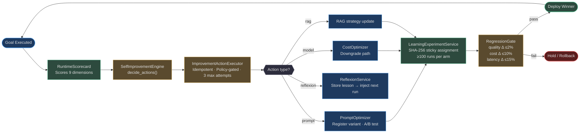
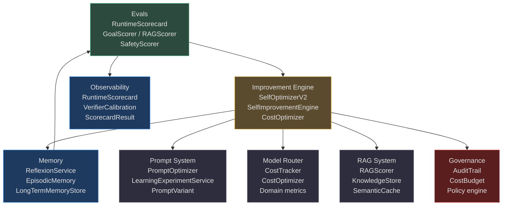

# Agent Improvement

A static agent is a decaying asset. Every deployed capability drifts from the optimal configuration as the world changes, user behavior shifts, and model providers release updates. AgentVerse solves this with an **autonomous improvement flywheel** — a closed-loop system that measures quality on every goal execution, diagnoses root causes, generates targeted improvement actions, validates them against a regression gate, and deploys the winning configuration — all without human intervention for routine optimizations.

---

## Why Agents Must Continuously Improve

| Decay driver | Effect if unaddressed | Flywheel response |
|---|---|---|
| LLM provider model updates | Prompt phrasing assumptions break | PromptOptimizer re-evaluates variants |
| Growing knowledge base | Retrieval precision degrades | SelfImprovementEngine updates RAG strategy |
| New failure modes | Reflexion lessons become stale | ReflexionService learns new patterns |
| Cost increases | Per-goal budget exceeded | CostOptimizer downgrades model path |
| New agent use-cases | Domain-specific prompts underperform | SelfOptimizerV2 adapts per domain |

The improvement flywheel runs **per-completion** (reflexion + scorecard), **per-N-completions** (optimizer trigger), and **per-deployment** (regression gate).

---

## The Improvement Flywheel



<!-- Sources: app/evals/self_improvement_engine.py, app/intelligence/improvement_action_executor.py, app/intelligence/prompt_optimizer.py, app/intelligence/learning_experiments.py, app/evals/regression_gate.py -->

---

## All Improvement Mechanisms at a Glance

| Mechanism | Module | Trigger | Action type | Rollback? |
|---|---|---|---|---|
| **SelfOptimizerV2** | `app/intelligence/self_optimizer_v2.py` | Every N goals (default: 5) | Bayesian A/B test via LLM | Yes — via regression gate |
| **SelfOptimizer** (v1, deprecated) | `app/intelligence/self_optimization.py` | Per eval scorecard | Prompt suggestion, tool selection | Manual only |
| **PromptOptimizer** | `app/intelligence/prompt_optimizer.py` | Per prompt variant registration | A/B test → auto-promote winner | Archive loser variant |
| **ImprovementActionExecutor** | `app/intelligence/improvement_action_executor.py` | Per ImprovementDecision | Idempotent handler dispatch | policy_denied / 3-attempt cap |
| **SelfImprovementEngine** | `app/evals/self_improvement_engine.py` | Per ScorecardResult | 6 action types (see below) | Regression gate |
| **LearningExperimentService** | `app/intelligence/learning_experiments.py` | Per experiment registration | Sticky A/B arm assignment | kill_switch flag |
| **ReflexionService** | `app/memory/reflexion.py` | Per goal failure | Lesson extraction → memory store | N/A (additive) |
| **CostOptimizer** | `app/intelligence/cost_optimizer.py` | Per N goals per category | Model downgrade suggestion | Configurable auto-apply |
| **VerifierCalibrationStore** | `app/intelligence/verifier_calibration.py` | Per verifier verdict + outcome | Calibrate false-confirm threshold | N/A (measurement only) |
| **RegressionGate** | `app/evals/regression_gate.py` | Pre-deployment | Promote / Hold decision | Freeze + recommend kill_switch |

---

## The Six Improvement Action Types

The `SelfImprovementEngine` maps scorecard signals to exactly six action types:

```python
class ImprovementAction(str, enum.Enum):
    UPDATE_PROMPT_VARIANT    = "update_prompt_variant"      # goal_success < 0.7
    UPDATE_MODEL_ROUTING     = "update_model_routing"       # cost/latency < 0.3
    UPDATE_RAG_STRATEGY      = "update_rag_strategy"        # rag_quality < 0.5
    STORE_REFLEXION_LESSON   = "store_reflexion_lesson"     # goal failed w/ feedback
    BLACKLIST_TOOL_PATTERN   = "blacklist_tool_pattern"     # tool_success_rate < 0.3
    CREATE_REGRESSION_CASE   = "create_regression_case"     # overall_score < 0.4
```

Each action is executed by a **registered handler** in `ImprovementActionExecutor`, gated by the tenant's policy, idempotent via `(tenant_id, idempotency_key)`, and capped at 3 attempts before marking as failed.

---

## How Improvement Connects to the Broader Platform



---

## Domain-Specific Improvement Metrics

`SelfOptimizerV2` uses domain-specific success metrics to ensure the optimizer targets what matters for each vertical:

| Domain | Primary metric | Why |
|---|---|---|
| `legal` | `citation_accuracy` | Wrong citations are a liability |
| `healthcare` | `eval_score` | PHI-safe; no patient data in optimization |
| `finance` | `compliance_rate` | Regulatory adherence is non-negotiable |
| `education` | `resolution_rate` | Student problems need to be resolved |
| `ecommerce` | `conversion_rate` | Business outcome is the true signal |

Any domain not in this table defaults to `eval_score`.

---

## Navigation

| File | What it covers |
|---|---|
| [01-eval-driven-improvement.md](./01-eval-driven-improvement.md) | SelfOptimizer V1/V2, ImprovementActionExecutor, action ranking |
| [02-prompt-and-model-optimization.md](./02-prompt-and-model-optimization.md) | PromptOptimizer, LearningExperiments, VerifierCalibration, CostOptimizer |
| [03-reflexion-and-memory-feedback.md](./03-reflexion-and-memory-feedback.md) | ReflexionService, cross-goal learning, lesson injection, privacy |
| [04-regression-detection-and-cost-optimization.md](./04-regression-detection-and-cost-optimization.md) | RegressionGate, BaselineRepository, RuntimeScorecard, cost trajectories |

<!-- Sources: app/intelligence/self_optimizer_v2.py, app/evals/self_improvement_engine.py, app/intelligence/improvement_action_executor.py, app/intelligence/prompt_optimizer.py, app/intelligence/learning_experiments.py, app/memory/reflexion.py, app/intelligence/cost_optimizer.py, app/intelligence/verifier_calibration.py, app/evals/regression_gate.py, app/evals/runtime_scorecard.py -->
