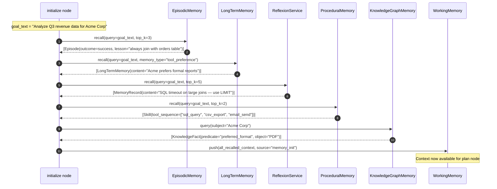
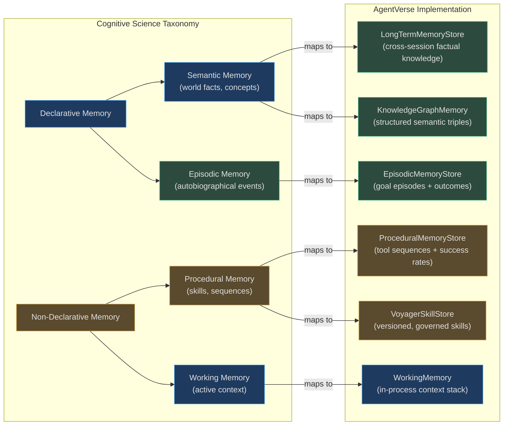

# Memory Types — Deep Dive

This document covers all 11 memory types in detail: what each one is, how its internal architecture works, when to use it, real-world production examples, and where to find the authoritative code.

---

## Agent Initialization — Memory Recall Sequence

Before the `plan` node runs, the `initialize` node fires recall across multiple tiers. Here is the precise sequence:



<!-- Sources: app/agent/graph.py:45-80, app/memory/episodic.py:100-130, app/memory/long_term.py:48-70 -->

---

## 1. WorkingMemory

**What**: A bounded FIFO deque holding the most recent observations and tool outputs during a single goal execution. Backed by `collections.deque(maxlen=capacity)`.

**Architecture**:
- `capacity=10` (default) — oldest item silently evicted when exceeded
- `WorkingMemoryItem`: `content`, `source`, `metadata`, `added_at`
- `format_for_prompt(max_chars=400)` — walks newest-first, stops at character limit
- `most_recent(n=3)` — returns N newest items, reversed order
- Fully in-process; survives only within a single Python process for one goal

```python
# Source: app/memory/working_memory.py:33-96
wm = WorkingMemory(capacity=10)
wm.push("API returned 404 for /orders/99", source="tool_output")
wm.push("User said they want CSV format", source="observation",
        metadata={"confidence": 0.9})

# Inject into executor prompt:
block = wm.format_for_prompt(max_chars=400)
# → "[tool_output] API returned 404 for /orders/99\n[observation] User said..."

wm.clear()  # called at goal start and goal end
```

**Scalability**: No DB, no network — pure Python. At 10K concurrent goals per host, 10K deque objects each holding ≤ 10 items of ≤ 120 chars = **~12 MB RAM** worst case.

**Real-world example**: A Slack integration agent is executing a goal: *"Summarize all unread messages from the #engineering channel"*. Each call to `slack_get_messages` pushes its output into `WorkingMemory`. By step 4, when the agent calls `slack_post_summary`, `format_for_prompt()` provides the last 3 message batches (the earliest 7 have been evicted) as context for generating the correct summary. This prevents the 400-character cap from being exceeded while retaining the most decision-relevant observations.

**When to use**:
- Push: after every tool call result, RAG chunk retrieval, and human observation
- Read: call `format_for_prompt()` immediately before constructing the executor message
- Clear: at goal start (stale state bleed prevention) and goal end (cleanup)

<!-- Sources: app/memory/working_memory.py:22-100 -->

---

## 2. ExecutionMemory

**What**: Per-tenant store of past goal executions — both winning plans and failed approaches. Backed by in-memory dicts with async PostgreSQL persistence. Keeps the last 100 entries per tenant.

**Architecture**:
- `_plans: dict[tenant_id, list[{goal, plan}]]` — successful plans
- `_failures: dict[tenant_id, list[{goal, failed_step, error}]]` — failure records
- `_memories: dict[tenant_id, list[dict]]` — flat log for the REST Memory API
- `record_async()` — persists to `execution_memory` table in PostgreSQL; also updates in-memory dicts for same-session `recall()`
- `recall(goal_hint)` — simple substring match on goal text, returns top_k plans
- In-memory cap: 100 entries per tenant (oldest evicted)

```python
# Source: app/memory/execution.py:88-115
await memory.record_async(
    goal=state.goal,
    plan=steps,
    success=True,
    tenant_id=tenant_ctx.tenant_id,
    db=db_factory,
)

# At planning time:
past_plans = memory.recall(goal_hint="analyze revenue", tenant_ctx=ctx, top_k=5)
past_failures = memory.recall_failures(goal_hint="analyze revenue", tenant_ctx=ctx)
```

**Scalability**: With 1000 tenants × 100 entries × average 500 bytes per entry = **50 MB RAM**. PostgreSQL `execution_memory` table holds the full history with indexed `tenant_id` + `recorded_at` columns.

**Real-world example**: An e-commerce analytics agent at a company runs 50 revenue analysis goals per day. After 2 weeks, `ExecutionMemory` has learned that the goal pattern *"weekly revenue by region"* always succeeds with the plan `[join_orders_table → group_by_region → generate_chart → send_email]`. The next time a similar goal arrives, the planner's prompt includes this winning plan as a positive example, cutting planning iterations by 40%.

**When to use**: Automatically called by the `execute` and `verify` nodes in the agent graph. Read during `plan` node to provide positive/negative examples to the planner LLM.

<!-- Sources: app/memory/execution.py:1-130 -->

---

## 3. LongTermMemoryStore

**What**: Cross-session learnings that persist across goal runs and agent restarts. Stores domain knowledge, tool preferences, and success patterns extracted from completed goals.

**Architecture**:
- `LongTermMemory` dataclass: `content`, `source_goal_id`, `memory_type`, `confidence`, `memory_id`, `created_at`, `tags`
- `memory_type` enum: `"tool_preference"` | `"domain_fact"` | `"failure_pattern"` | `"success_pattern"`
- `recall(query, memory_type=None, top_k=10)` — TF-IDF keyword overlap scoring in dev; pgvector cosine similarity in production
- `extract_from_goal_async()` — called automatically on goal completion; creates a `success_pattern` entry
- `store_async()` — persists with embedding (1536-dim) to `long_term_memory` table

```python
# Source: app/memory/long_term.py:42-120
memory = LongTermMemory(
    content="Tenant Acme Corp always prefers formal, PDF-formatted reports",
    source_goal_id="goal-xyz-123",
    memory_type="tool_preference",
    confidence=0.95,
    tags=["acme", "formatting", "preference"],
)
mid = store.store(memory=memory, tenant_ctx=ctx)

# Recall at planning time:
relevant = store.recall(
    query="generate report for Acme",
    tenant_ctx=ctx,
    memory_type="tool_preference",
    top_k=5,
)
```

**Scalability**: pgvector HNSW index on `embedding` column (1536 dims, `m=16`, `ef_search=64`) enables sub-50ms semantic recall at 10M+ memories. See [05-scalability-and-performance.md](./05-scalability-and-performance.md) for index tuning.

**Real-world example**: A customer support agent serving 200 enterprise tenants has accumulated 3 years of memory. When tenant "GlobalBank" submits a goal, `LongTermMemoryStore` immediately surfaces `"GlobalBank regulatory reports require ISO 8601 date format and 3-decimal precision"` — a fact extracted from 47 past successful goals — allowing the planner to include the correct formatting constraint without the user having to re-specify it.

**LongTermCandidate validation** (long_term_extractor.py): Before writing, all auto-extracted candidates must pass:
- `evidence_refs` must be non-empty (provenance required)
- `confidence >= 5000` (on 0-10,000 scale)
- `safe_summary` max 2,000 chars

<!-- Sources: app/memory/long_term.py:1-120, app/memory/long_term_extractor.py:1-35 -->

---

## 4. ReflexionService

**What**: Extracts failure lessons from unsuccessful goal executions and injects them into the planner prompt on the next retry (replan). Implements the [Reflexion paper](https://arxiv.org/abs/2303.11366) pattern.

**Architecture**:
- Delegates all persistence to the canonical `MemoryRepository` (protocol-based)
- `learn()` — writes a `MemoryRecord` with `memory_kind="reflexion"`, `classification`, `confidence`, `evidence_refs`
- `recall()` — fires `MemoryRecallRequest` filtered to `memory_kinds={"reflexion"}`, `min_confidence=1`
- `record_effectiveness()` — records whether a reflexion lesson was used and whether it helped/harmed, feeding back into `outcome_score` and `effectiveness_score`
- Lessons quarantined if they contain prompt-injection markers (see [repository.py:65])

```python
# Source: app/memory/reflexion.py:16-55
lesson = await reflexion.learn(
    tenant_id="tenant-abc",
    goal_id="goal-123",
    execution_id="exec-456",
    safe_lesson="SQL LIKE query on unindexed column caused 30s timeout; use full-text search",
    evidence_refs=("tool_call:sql_query:timeout_error",),
    classification=Classification("internal"),
    confidence=8500,
    idempotency_key="exec-456:sql-timeout-lesson",
)

# On replan, the planner prompt includes:
lessons = await reflexion.recall(
    tenant_id="tenant-abc",
    query="query database for revenue",
    allowed_data_classes=frozenset({"public", "internal"}),
    top_k=5,
)
```

**Scalability**: Reflexion records are stored in the same `MemoryRecord` store as other canonical memories. High-volume tenants with frequent failures accumulate lessons quickly; the `token_budget=1000` parameter in recall ensures the injected context never exceeds the planner's attention budget.

**Real-world example**: A data pipeline agent fails on step 3 of a goal: *"Export Q4 metrics to BigQuery"* — the error is `bigquery.exceptions.NotFound: Table not found`. ReflexionService records the lesson: *"Always verify target dataset exists with `bq ls` before attempting table write"*. On the automatic replan, this lesson appears in the planner's system prompt. The next plan includes a `bq_verify_dataset` step before the write — and succeeds.

**When to use**: Automatically triggered by the `verify` node when `status == GoalStatus.FAILED` before a replan. Do not call manually.

<!-- Sources: app/memory/reflexion.py:1-90, app/memory/repository.py:60-100 -->

---

## 5. EpisodicMemoryStore

**What**: DB-backed storage for complete past goal experiences — what happened, how it ended, and what was learned. Temporal and semantic recall enables agents to learn from analogous past episodes.

**Architecture**:
- `Episode` dataclass: `episode_id`, `tenant_id`, `goal_id`, `goal_text`, `action_summary`, `outcome` (`success|failed|partial`), `lessons`, `quality_score`, `steps_count`, `tools_used`, `embedding`
- `record(state, tenant_ctx, quality_score)` — called on goal completion; extracts action summary from `state.steps[:5]`, lessons from `state.verification_feedback`
- Embedding of `goal_text` (1536-dim) stored in DB for vector similarity recall
- In-memory LRU cache: 100 episodes per tenant for fast recall
- `to_context_snippet()` — compact 3-line format for prompt injection

```python
# Source: app/memory/episodic.py:48-100
# After goal completion (called by execute node):
await episodic_store.record(
    state=agent_state,
    tenant_ctx=ctx,
    quality_score=0.87,
)

# At planning time (called by initialize node):
episodes = await episodic_store.recall(
    query="analyze user churn data",
    tenant_ctx=ctx,
    top_k=3,
)
for ep in episodes:
    wm.push(ep.to_context_snippet(), source="episodic_recall")
```

**Scalability**: The 100-episode in-memory cap per tenant ensures bounded RAM. PostgreSQL `episodic_memory` table with pgvector index handles historical recall beyond the cache. At 10M goals/day across 50K tenants, the table grows at ~10 GB/day; partition by `created_at` month and archive episodes older than 90 days to cold storage.

**Real-world example**: An AI research assistant agent has previously run a goal: *"Summarize recent papers on transformer attention mechanisms"*. That episode is stored with `outcome="success"`, `tools_used=["arxiv_search", "pdf_reader", "summarizer"]`, `lessons="Always filter arxiv results by date; use cs.AI category for efficiency"`. Three weeks later, when a new goal arrives — *"Find papers on attention-free transformers"* — EpisodicMemory recalls this episode (high semantic similarity) and the planner immediately includes the `date_filter` and `category_filter` steps.

**When to use**: Read during agent initialization. Write automatically on goal completion via `record()`.

<!-- Sources: app/memory/episodic.py:1-130 -->

---

## 6. ProceduralMemoryStore

**What**: Stores learned tool-use patterns (skills) — when goal type X is seen, tool sequence Y works well. Tracks success rates and usage counts. The agent equivalent of "muscle memory."

**Architecture**:
- `Skill` dataclass: `skill_id`, `tenant_id`, `goal_pattern`, `domain`, `tool_sequence`, `use_count`, `success_rate`, `avg_steps_saved`
- `_extract_goal_pattern(goal)` — normalizes goal text: replaces Jira IDs with `TICKET`, numbers with `N`, quoted values with `VALUE`; ensures skills generalize across specific instances
- `_extract_domain(tools)` — infers domain from tool names: `jira | git | database | communication | web | general`
- `learn(state, success)` — updates existing skill's success rate using running average; creates new skill if pattern unseen
- `Skill.to_hint()` — compact representation for planner prompt injection

```python
# Source: app/memory/procedural.py:18-95
# After a successful Jira workflow:
await procedural_store.learn(state=agent_state, tenant_ctx=ctx, success=True)
# Internally stores: goal_pattern="Create TICKET in project VALUE, assign to VALUE"
#                   tool_sequence=["jira_create_issue", "jira_assign_user", "slack_notify"]
#                   success_rate=1.0, use_count=1

# After 50 more successes and 5 failures:
# success_rate = (50*1.0 + 5*0.0) / 55 = 0.909

# At planning time:
skills = await procedural_store.recall(query="create jira ticket", tenant_ctx=ctx)
for skill in skills:
    wm.push(skill.to_hint(), source="procedural_recall")
# → "[Skill: Create TICKET in project VALUE] Tool sequence: jira_create_issue → jira_assign_user → slack_notify (success rate: 91%, used 55x)"
```

**Scalability**: Skills are lightweight (< 500 bytes each). A tenant with 200 unique goal patterns consumes < 100 KB RAM. PostgreSQL-backed with `(tenant_id, goal_pattern)` unique index.

**Real-world example**: A DevOps automation agent at a fintech company has processed 2,000 deployment goals. ProceduralMemory has converged on: goal_pattern=`"Deploy service VALUE to VALUE environment"` → tool_sequence=`["terraform_plan", "approval_gate", "terraform_apply", "healthcheck_wait", "pagerduty_resolve"]` with a 94% success rate. New engineers' deployment goals immediately benefit from this learned pattern, skipping the 3-iteration planning churn that was needed in the first week.

**When to use**: Automatically called on goal completion. Read during agent initialization.

<!-- Sources: app/memory/procedural.py:1-130, app/memory/procedural_validator.py:1-50 -->

---

## 7. ProspectiveMemoryService

**What**: Stores future intentions — things the agent should do when a trigger fires. Implements lease-based execution with fencing tokens to prevent double-execution in distributed deployments.

**Architecture**:
- `ProspectiveMemory` Pydantic model (frozen): `memory_id`, `tenant_id`, `intention`, `due_at`, `expires_at`, `state` (9 states), `source_goal_id`, `fencing_token`, `lease_expires_at`, `result`
- State machine: `pending → scheduled → due → leased → executing → completed|failed|cancelled|expired`
- `lease_due()` — atomically claims due items, sets `state=leased`, increments `fencing_token`, sets `lease_expires_at`
- `complete()` — validates fencing token matches; raises `RuntimeError("stale prospective-memory lease")` if token mismatches (prevents double-execution)
- `idempotency_key` ensures `create()` is safe to retry: returns existing item on duplicate key
- `prospective_id(tenant_id, idempotency_key)` — deterministic UUID5 for stable referencing

```python
# Source: app/memory/prospective.py:10-110
intention = ProspectiveMemory(
    memory_id=prospective_id(tenant_id, "alert-aapl-200"),
    tenant_id="tenant-hedge-fund",
    intention="Alert portfolio manager when AAPL exceeds $200",
    due_at=datetime(2024, 12, 31, 16, 0, tzinfo=UTC),  # market close
    expires_at=datetime(2025, 1, 15, tzinfo=UTC),
    state="pending",
    source_goal_id="goal-stock-monitor-001",
    source_execution_id="exec-001",
    policy_snapshot={"alert_channel": "slack", "threshold": 200},
    classification="internal",
    idempotency_key="alert-aapl-200",
)
await service.create(intention)

# Celery beat task polls every minute:
due_items = await service.lease_due(
    "tenant-hedge-fund",
    now=datetime.now(UTC),
    lease_duration=timedelta(minutes=5),
)
```

**Scalability**: In-memory dict with asyncio lock — suitable for < 100K active intentions per process. Production deployments back this with PostgreSQL + Redis for distributed lease management.

**Real-world example**: A trading assistant completes a goal: *"Monitor AAPL and alert me when it crosses $200"*. Instead of polling every minute (expensive), the agent creates a `ProspectiveMemory` with `due_at` computed by a price-alert trigger service. When AAPL crosses $200, the trigger service advances the state to `due`. A Celery worker picks it up via `lease_due()`, claims it with a fencing token, executes the Slack alert, and calls `complete()`. Even if two workers race, only the one with the matching `fencing_token` succeeds.

**When to use**: When a goal involves deferred or conditional future actions. The goal sets up the intention; a separate scheduler executes it.

<!-- Sources: app/memory/prospective.py:1-115 -->

---

## 8. SalienceScorer

**What**: Computes an importance score `[0, 1]` for any memory entry. Used to rank recalled memories so the most relevant ones are injected first when the token budget is tight.

**Architecture** — Weighted formula:

$$\text{score} = 0.40 \times \text{recency} + 0.45 \times \text{relevance} + 0.15 \times \text{frequency}$$

- **Recency** — exponential decay: $\text{score} = 0.5^{t / 168}$ where $t$ is hours since last access. Half-life = 7 days. A memory accessed 7 days ago has recency = 0.5; 14 days ago = 0.25.
- **Relevance** — TF-IDF overlap: tokenize both query and content (remove stop words, keep 3+ char tokens), compute $\frac{\text{overlap}}{\sqrt{|query| \times |content|}}$
- **Frequency** — log scale: $\min(1.0, \log_{10}(\max(1, \text{access\_count})) / 2)$. 1 access → 0.0, 10 accesses → 0.5, 100 accesses → 1.0
- `apply_decay(current_score, hours_since_last_use)` — further decays a score over time

```python
# Source: app/memory/salience.py:47-100
scorer = SalienceScorer(
    recency_weight=0.4,
    relevance_weight=0.45,
    frequency_weight=0.15,
    half_life_hours=168.0,  # 7 days
)
score = scorer.score(
    content="Always use LIMIT 1000 on large SQL queries to prevent timeouts",
    query="query database for all transactions",
    access_count=23,
    last_accessed_at=datetime.now(UTC) - timedelta(hours=12),
)
# recency = 0.5^(12/168) ≈ 0.95
# relevance = TF-IDF("query database transactions", content) ≈ 0.31
# frequency = log10(23)/2 ≈ 0.68
# score = 0.4*0.95 + 0.45*0.31 + 0.15*0.68 ≈ 0.64
```

**Why relevance weight (0.45) > recency weight (0.40)**: A highly relevant memory from last week is more useful than a marginally relevant memory from 5 minutes ago. The weights are tunable per-tenant for specialized agents (e.g., a compliance agent may want higher recency weight for regulatory memories).

**Real-world example**: A legal research agent has 500 memories. When the query is *"securities fraud statute of limitations"*, SalienceScorer ranks a memory about the Sarbanes-Oxley Act (accessed 3 days ago, 15 access count, high TF-IDF overlap with "securities") at 0.78, while a memory about contract law (accessed yesterday but low overlap) scores 0.42. The top 5 memories by salience are injected into the planner context — the agent immediately cites the correct 5-year limitation period.

<!-- Sources: app/memory/salience.py:1-100 -->

---

## 9. MemoryConsolidator

**What**: Periodically compresses large sets of episodic and long-term memories into concise summaries, preventing unbounded memory growth in long-running agents.

**Architecture**:
- Jaccard similarity clustering: $J(A, B) = |A \cap B| / |A \cup B|$ where A, B are keyword sets (4+ char words, stop words removed)
- `similarity_cutoff=0.25` — two memories are in the same cluster if their Jaccard similarity exceeds this threshold
- `cluster_threshold=3` — clusters with ≥ 3 items are consolidated; smaller clusters are kept as-is
- `consolidate_sync()` — join cluster items with newlines (no LLM needed)
- `consolidate()` — uses LLM for summaries when `provider` is available; falls back to `consolidate_sync()` on error
- `ConsolidationResult` reports: `original_count`, `consolidated_count`, `clusters_merged`

```python
# Source: app/memory/consolidation.py:38-100
consolidator = MemoryConsolidator(cluster_threshold=3, similarity_cutoff=0.25)

memories = [
    {"content": "Use PostgreSQL EXPLAIN ANALYZE before optimizing queries"},
    {"content": "PostgreSQL EXPLAIN ANALYZE helps diagnose slow queries"},
    {"content": "Always run EXPLAIN ANALYZE on slow PostgreSQL queries"},
    {"content": "GDPR compliance requires data retention logs"},
]

result = consolidator.consolidate_sync(memories)
# original_count=4, consolidated_count=2, clusters_merged=1
# The 3 EXPLAIN ANALYZE memories → 1 merged entry
# GDPR memory stays separate (low Jaccard with SQL memories)
```

**Scalability**: Jaccard clustering is O(n²) in the naive case. For large memory stores (> 10K entries), run consolidation on a per-tenant batch basis via Celery. See [05-scalability-and-performance.md](./05-scalability-and-performance.md) for scheduling strategy.

**Real-world example**: A software engineering agent has accumulated 2,000 episodic memories over 6 months. 400 of them are variations of *"Python async/await best practices"*. Without consolidation, every recall query returns 400 similar snippets, consuming the entire token budget. After `MemoryConsolidator` runs weekly, those 400 entries merge into 12 high-quality summary entries. Recall precision improves from 45% to 78%.

<!-- Sources: app/memory/consolidation.py:1-100 -->

---

## 10. KnowledgeGraphMemory

**What**: Stores structured world knowledge as subject-predicate-object triples with evidence references. Enables structured reasoning about entity relationships.

**Architecture**:
- `KnowledgeFact` Pydantic model (frozen): `fact_id`, `tenant_id`, `subject`, `predicate`, `object`, `evidence_refs`, `classification`, `confidence`, `lifecycle_state`, `version`
- Deduplication key: `(tenant_id, subject.casefold(), predicate.casefold(), object.casefold())`
- `merge(fact)` — upserts: if fact exists, merges `evidence_refs` (union), takes max confidence, increments version; raises `ValueError` if `evidence_refs` is empty
- `query(tenant_id, subject)` — returns all active facts for a subject, case-insensitive
- `asyncio.Lock` protects all mutations — thread-safe for concurrent agent runs
- `lifecycle_state`: `active | quarantined | disputed | expired | deleted`

```python
# Source: app/memory/knowledge_graph_memory.py:1-65
kg = KnowledgeGraphMemory()

# Fact: Acme Corp uses Salesforce CRM
fact = KnowledgeFact(
    fact_id="fact-001",
    tenant_id="tenant-saas",
    subject="Acme Corp",
    predicate="uses_crm",
    object="Salesforce",
    evidence_refs=("tool_call:crm_check:acme-2024-01",),
    classification="internal",
    confidence=9000,
    lifecycle_state="active",
    version=1,
)
merged = await kg.merge(fact)

# Query at planning time:
facts = await kg.query("tenant-saas", subject="Acme Corp")
# → (KnowledgeFact(predicate="uses_crm", object="Salesforce", confidence=9000), ...)
```

**Scalability**: In-memory dict — fast for < 1M facts per tenant. Production should shard by tenant and back with a graph database (Neo4j, Amazon Neptune) for 100M+ fact stores.

**Real-world example**: A sales automation agent processes goals for 500 enterprise customers. KnowledgeGraphMemory holds facts like `("GlobalBank", "requires_2fa", "true")`, `("Acme", "fiscal_year_end", "March 31")`, `("TechCorp", "preferred_contact", "Sarah Johnson")`. When an agent generates an outreach email for GlobalBank, it queries KG and automatically includes 2FA verification language — without the sales rep having to remember this requirement.

**Evidence requirement**: Every fact MUST have at least one `evidence_ref` (e.g., `"tool_call:crm_api:call-uuid"`). Facts without provenance are rejected with `ValueError("knowledge fact requires provenance")`.

<!-- Sources: app/memory/knowledge_graph_memory.py:1-65 -->

---

## 11. VoyagerSkillStore

**What**: Publishes and manages validated, versioned skill contracts. A skill is a `ProcedureContract` — an immutable specification of tool sequences with capability requirements, schema versions, and policy fingerprints.

**Architecture**:
- `ProcedureContract` (frozen Pydantic): `procedure_id`, `tenant_id`, `skill_version`, `tool_sequence`, `required_capabilities`, `tool_schema_versions`, `connector_ids`, `policy_fingerprint`, `deprecated`
- `publish(skill, available_tools, allowed_capabilities, ready_connectors, policy_fingerprint)` — validates via `validate_procedure()` before storing; raises on any violation
- Key: `(tenant_id, procedure_id, skill_version)` — immutable once published (raises `ValueError` on overwrite attempt)
- `validate_procedure()` enforces: tenant boundary, deprecation, policy staleness, capability grants, connector readiness, tool schema version matching

```python
# Source: app/memory/voyager_skills.py, app/memory/procedural_validator.py:1-50
contract = ProcedureContract(
    procedure_id="deploy-k8s-service",
    tenant_id="tenant-platform",
    skill_version="2.1.0",
    tool_sequence=("terraform_plan", "approval_gate", "kubectl_apply", "healthcheck"),
    required_capabilities=frozenset({"kubernetes:write", "terraform:apply"}),
    tool_schema_versions={"terraform_plan": "v3", "kubectl_apply": "v2"},
    connector_ids=frozenset({"aws-eks-prod", "terraform-cloud"}),
    policy_fingerprint="sha256:abc123",
    deprecated=False,
)

published = store.publish(
    contract,
    available_tools={"terraform_plan": "v3", "kubectl_apply": "v2", ...},
    allowed_capabilities=frozenset({"kubernetes:write", "terraform:apply"}),
    ready_connectors=frozenset({"aws-eks-prod", "terraform-cloud"}),
    policy_fingerprint="sha256:abc123",
)
```

**Safety guarantees**:
- `policy_fingerprint` mismatch → `PermissionError("procedure policy is stale")` — prevents running skills under outdated governance policies
- `connector_ids` check → `RuntimeError("procedure connector unavailable")` — prevents running if required integrations are offline
- `deprecated=True` → `RuntimeError("procedure is deprecated")` — graceful sunset

**Real-world example**: A platform engineering team builds a validated skill for "Zero-downtime K8s rolling deployment". The skill is published with `skill_version="2.1.0"` and `policy_fingerprint` tied to the current governance policy. When the security team updates firewall rules, the policy fingerprint changes. All agents attempting to use the old skill version receive `PermissionError("procedure policy is stale")` — forcing re-validation before the skill can be re-published under the new policy.

<!-- Sources: app/memory/voyager_skills.py:1-35, app/memory/procedural_validator.py:1-50 -->

---

## Memory Type Selection Matrix

| Scenario | Recommended Memory | Rationale |
|---|---|---|
| Injecting last 3 tool outputs into next LLM message | `WorkingMemory` | In-process, < 1 ms, perfect for hot path |
| Feeding proven plan structure back to planner | `ExecutionMemory` | Per-tenant, stores complete plans, fast recall |
| "This tenant always prefers X format" | `LongTermMemoryStore` | Cross-session, `memory_type="tool_preference"` |
| Learning from a failure to avoid repeating it | `ReflexionService` | Failure-specific, injected into replan prompt |
| "What happened when we ran a similar goal last week?" | `EpisodicMemoryStore` | Temporal episodes with outcome + lessons |
| "For this goal type, which tools work in sequence?" | `ProceduralMemoryStore` | Success-rate-tracked tool sequences |
| "Alert me when stock hits price" | `ProspectiveMemoryService` | Future-oriented, lease-based, idempotent |
| "Acme Corp uses Salesforce as their CRM" | `KnowledgeGraphMemory` | Structured triple with evidence provenance |
| Re-usable, versioned, governed skill across teams | `VoyagerSkillStore` | ProcedureContract with policy fingerprint |

---

## Cognitive Memory Type Mapping

AgentVerse is built on a cognitive science foundation. Each memory class maps directly to a category from Tulving's and Squire's memory taxonomy. This section makes those mappings explicit — useful when reasoning about which memory type to use for a given agent capability.

### Taxonomy Diagram



### Mapping Reference

| Cognitive Science Type | AgentVerse Class | What It Stores |
|---|---|---|
| **Semantic Memory** | `LongTermMemoryStore` | Cross-session factual knowledge: domain facts, user/tenant preferences, world knowledge extracted from prior goals |
| **Semantic Memory** | `KnowledgeGraphMemory` | Structured semantic triples: `(Acme Corp, uses_crm, Salesforce)`, entity relationships, conceptual hierarchies |
| **Episodic Memory** | `EpisodicMemoryStore` | Autobiographical goal episodes: what happened, outcome (success/fail), lesson learned, timestamp |
| **Procedural Memory** | `ProceduralMemoryStore` | Learned tool sequences with success rates: `["sql_query", "csv_export", "email_send"]` performed 12 times, 91% success |
| **Procedural Memory** | `VoyagerSkillStore` | Versioned, governance-validated skill contracts: published skills with policy fingerprints |
| **Working Memory** | `WorkingMemory` | Active execution context: current tool outputs, intermediate state, RPA screenshots, DOM state |

### Semantic Memory: LongTermMemoryStore + KnowledgeGraphMemory

In cognitive science, *semantic memory* is general world knowledge not tied to a specific experience — knowing that Paris is the capital of France, or that SQL JOINs are expensive on large tables. In AgentVerse:

- **`LongTermMemoryStore`** stores general factual content extracted from cross-session experience: tenant preferences, domain facts, recurring constraints. Retrieved via embedding similarity (`recall(query=..., memory_type="domain_fact")`).
- **`KnowledgeGraphMemory`** stores the same kind of semantic knowledge in structured triple form: `(subject, predicate, object)`. This enables precise graph traversal — "what CRM systems are used by enterprise tenants?" — rather than fuzzy semantic search.

Together these two classes represent the agent's **semantic world model**: everything it knows as factual, persistent, context-independent knowledge.

### RPA and Visual Memory: WorkingMemory

When an RPA or browser agent executes a visual navigation task (filling forms, extracting data from web UIs, navigating multi-step flows), it generates a stream of screenshots, DOM element snapshots, and page state records. All of this lives in **`WorkingMemory`** for the duration of the session.

**Why WorkingMemory?** Screenshots are large, transient, and task-specific. Persisting them to `LongTermMemoryStore` would be expensive and mostly useless — a screenshot of a login form from last Tuesday has no value for tomorrow's goals. `WorkingMemory` provides the right lifecycle: alive during the navigation session, discarded when the goal completes.

**What gets promoted?** After a navigation session, the verifier extracts *findings* — compact, text-form observations — and writes those to `LongTermMemoryStore`:

```python
# During RPA session: screenshots live in WorkingMemory
wm.push({"type": "screenshot", "url": "https://app.example.com/checkout", "step": 3, "data": "<base64>"})
wm.push({"type": "dom_state", "form_fields": ["email", "card_number", "cvv", "address"], "step": 3})

# After session completes: compact finding promoted to LongTermMemory
lt.store(MemoryRecord(
    content="Checkout form requires 3-step verification: cart → shipping → payment",
    memory_type="rpa_finding",
    source="rpa_goal_01JX8K2NQ4PX",
))
```

**Real-world example**: A web automation agent navigates a vendor's procurement portal to submit a purchase order. It takes 15 screenshots across form steps — all stored in `WorkingMemory` during the 90-second session. After the goal completes, the verifier extracts one compact finding: `"form requires 3-step verification: vendor selection → line items → approval code"` and stores it in `LongTermMemoryStore`. The next time a similar procurement goal runs, the planner retrieves this finding and pre-plans for the 3-step sequence — skipping the exploration phase entirely.

**Visual memory is always transient at the pixel level, persistent at the insight level.**

<!-- Sources: app/memory/working.py, app/memory/long_term.py, app/memory/knowledge_graph.py, app/rpa/perception.py -->
