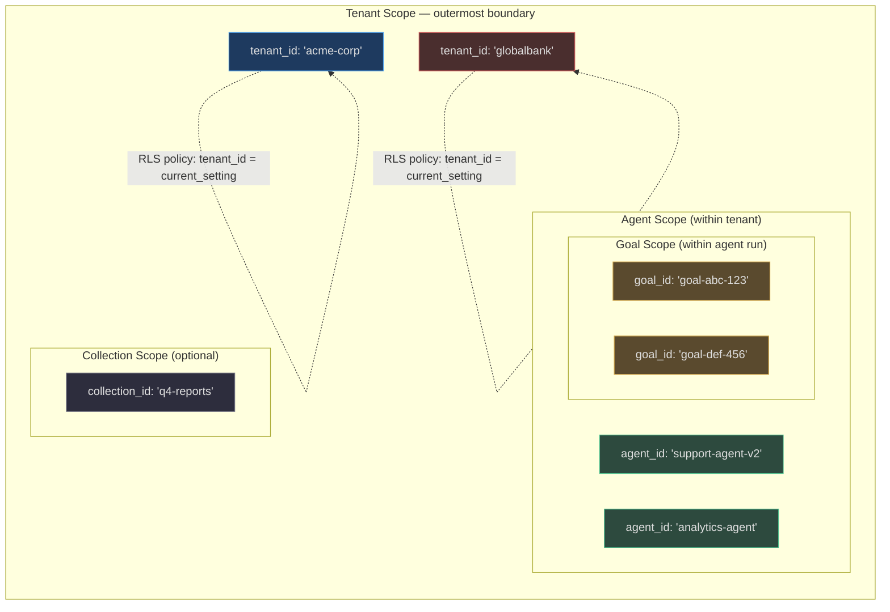
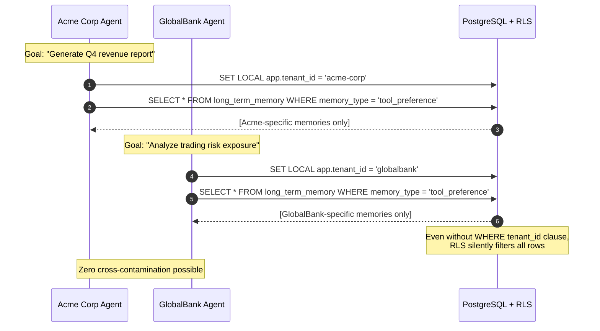

# Memory Scoping

> **At 50,000 tenants, a single scoping bug means Company A's confidential strategic plans are readable by Company B's agents. Memory scoping is not optional — it is the security boundary of the entire platform.**

AgentVerse enforces memory isolation at four nested levels: tenant, agent, goal, and collection. Each memory type participates in different levels of this hierarchy. Violating any level is treated as a critical security fault.

---

## Scope Hierarchy



---

## Scope Per Memory Type

| Memory Type | `tenant_id` | `agent_id` | `goal_id` | `collection_id` | Scope Key(s) |
|---|:---:|:---:|:---:|:---:|---|
| `WorkingMemory` | — | — | implicit | — | Lives inside `AgentState` for one run; no DB key needed |
| `ExecutionMemory` | ✓ | — | — | — | `_plans[tenant_id]`, `_failures[tenant_id]` |
| `LongTermMemoryStore` | ✓ | via tags | — | via tags | `tenant_id` primary; `tags` for sub-grouping |
| `ReflexionService` | ✓ | — | ✓ | — | `source_goal_id` + `source_execution_id` on every record |
| `EpisodicMemoryStore` | ✓ | — | ✓ | — | `Episode.goal_id` links episode to originating goal |
| `ProceduralMemoryStore` | ✓ | — | — | — | Skills per-tenant; `domain` field groups sub-categories |
| `ProspectiveMemoryService` | ✓ | — | ✓ | — | `source_goal_id`; `fencing_token` isolates executions |
| `KnowledgeGraphMemory` | ✓ | — | — | — | `(tenant_id, subject, predicate, object)` uniqueness key |
| `VoyagerSkillStore` | ✓ | — | — | — | `(tenant_id, procedure_id, skill_version)` immutable key |
| `SalienceScorer` | — | — | — | — | Utility; no data; operates on already-scoped records |
| `MemoryConsolidator` | — | — | — | — | Utility; caller passes pre-scoped memory list |

<!-- Sources: app/memory/execution.py:16-25, app/memory/episodic.py:12-20, app/memory/knowledge_graph_memory.py:15-30, app/memory/repository.py:35-65, app/memory/prospective.py:10-20 -->

---

## Tenant Scope — The Primary Isolation Boundary

### Row-Level Security (RLS)

In production, every PostgreSQL table holding persistent memory data (`long_term_memory`, `episodic_memory`, `procedural_skills`, `reflexion_memory`, `execution_memory`) is protected by a **Row-Level Security policy**. The application sets the current tenant context via:

```sql
-- Source: app/db/rls.py (SET LOCAL scoped to transaction)
SET LOCAL app.tenant_id = 'acme-corp';
```

The RLS policy on every memory table:
```sql
CREATE POLICY tenant_isolation ON long_term_memory
    USING (tenant_id = current_setting('app.tenant_id'));
```

This means even if application code contains a bug that omits a `WHERE tenant_id = ?` clause, PostgreSQL will silently filter out all rows belonging to other tenants. **Tenant isolation is enforced at the database layer, not just the application layer.**

### InMemoryMemoryRepository — Tenant Isolation in Tests

In tests (and during the in-memory phase before DB pools start), `InMemoryMemoryRepository` enforces tenant isolation via dict keying:

```python
# Source: app/memory/repository.py:35-65
# All records are stored as:
self._records[(record.tenant_id, record.memory_id)] = record

# Recall filters strictly:
for record in self._records.values():
    if record.tenant_id != request.tenant_id:
        continue  # ← never crosses tenant boundary
```

The idempotency command map uses `(tenant_id, idempotency_key)` as the key — ensuring the same key in two different tenants produces two separate records, not a collision.

---

## Real-World Multi-Tenant Example: SaaS Company A vs Company B



**Attempted cross-tenant query** (what happens when a bug omits the tenant filter):

```python
# Bug: forgot to filter by tenant
bad_query = "SELECT * FROM long_term_memory ORDER BY created_at DESC LIMIT 10"
# PostgreSQL RLS intercepts: adds "AND tenant_id = current_setting('app.tenant_id')"
# Result: only Acme's memories returned — never GlobalBank's
```

---

## Agent Scope

Most memory types are **tenant-scoped, not agent-scoped**. This is intentional: a company's institutional knowledge should be shared across all of its agents. A tool preference learned by the support agent should be available to the analytics agent.

When agent-level isolation is needed:
1. Use `tags` on `LongTermMemory` entries: `tags=["agent:support-v2", "acme"]`
2. Filter during recall: `store.recall(query=q, tenant_ctx=ctx, memory_type="tool_preference")` then post-filter by tag
3. For complete agent isolation, use separate tenant credentials (one `tenant_id` per agent team)

**VoyagerSkillStore** is an exception: the key `(tenant_id, procedure_id, skill_version)` allows different agents to have different versions of the same procedure ID, enabling per-agent skill versioning while remaining under the same tenant.

---

## Goal Scope — Single-Run Isolation

`WorkingMemory` is the primary goal-scoped store. It exists inside `AgentState` (Python object, no DB) and is cleared at goal start and goal end:

```python
# Source: app/memory/working_memory.py:73-77
def clear(self) -> None:
    """Remove all items (call at goal start/end)."""
    self._items.clear()
```

`ReflexionService` and `EpisodicMemoryStore` also carry `goal_id` on their records:

```python
# Source: app/memory/episodic.py:30-38
episode = Episode(
    episode_id=uuid.uuid4().hex,
    tenant_id=tenant_ctx.tenant_id,
    goal_id=state.goal_id,  # ← goal-scoped
    ...
)
```

`ProspectiveMemoryService` uses `source_goal_id` to link a future intention to the goal that created it — and `fencing_token` to ensure only the exact scheduled execution (not a duplicate) can complete it.

---

## Collection Scope

Collection scope is used when memories should be associated with a specific knowledge collection (e.g., all memories derived from a "Q4-2024-earnings" document collection). This is surfaced via `tags` on `LongTermMemory`:

```python
memory = LongTermMemory(
    content="Q4 2024 earnings EBITDA margin was 23.4%",
    source_goal_id="goal-earnings-analysis",
    memory_type="domain_fact",
    tags=["collection:q4-2024-earnings", "finance", "ebitda"],
)
```

During recall, filter by collection tag:
```python
all_memories = store.list_all(tenant_ctx=ctx)
collection_memories = [m for m in all_memories if "collection:q4-2024-earnings" in m.tags]
```

In production, add a `collection_id` index column to the `long_term_memory` table for O(1) collection-scoped recall rather than full-table tag filtering.

---

## Memory Namespace Design Patterns

### Pattern 1: Flat Tenant Namespace (Default)
```
long_term_memory table
├── tenant_id: "acme-corp"   → all Acme memories
├── tenant_id: "globalbank"  → all GlobalBank memories
└── tenant_id: "techcorp"    → all TechCorp memories
```
- Best for: < 100K tenants, < 100M total memory rows
- Index: `CREATE INDEX idx_ltm_tenant ON long_term_memory (tenant_id)`

### Pattern 2: Partitioned by Tenant Hash (1M+ tenants)
```
long_term_memory_0000  (tenant_id HASH 0–999)
long_term_memory_0001  (tenant_id HASH 1000–1999)
...
long_term_memory_0999  (tenant_id HASH 999000–999999)
```
```sql
CREATE TABLE long_term_memory (tenant_id text, ...) PARTITION BY HASH (tenant_id);
CREATE TABLE long_term_memory_p0 PARTITION OF long_term_memory FOR VALUES WITH (modulus 1000, remainder 0);
```
- Best for: > 1M tenants, enables per-partition VACUUM and index management
- Each partition gets its own pgvector HNSW index for vector search

### Pattern 3: Time-partitioned + Tenant Indexed (High-volume)
```
long_term_memory_2024_q4  (partition for Oct–Dec 2024)
long_term_memory_2025_q1  (partition for Jan–Mar 2025)
```
- Best for: Audit compliance, easy archival, TTL management per quarter

---

## Scoping at 1M+ Tenant Scale

At 1,000,000 tenants with 1,000 memories each = **1 billion rows** in the memory table. Key strategies:

1. **pgvector index sharding**: Create separate pgvector HNSW indexes per tenant cluster (e.g., 1 index per 10K tenants). Each index holds ≤ 10M vectors — well within HNSW performance bounds.

2. **Tenant routing layer**: A consistent-hash routing layer maps `tenant_id` to a specific database shard. Memory reads/writes for "acme-corp" always hit shard 3; "globalbank" always hits shard 7. RLS is still applied on each shard.

3. **Index partitioning by tenant prefix**:
```sql
-- Composite index: tenant-aware B-tree for list operations + GIN for tag queries
CREATE INDEX idx_ltm_tenant_tags ON long_term_memory USING GIN (tags)
  WHERE tenant_id = ANY(ARRAY['acme-corp', 'globalbank', ...]);
```

4. **Cache warming**: Popular tenant's `WorkingMemory`-eligible long-term entries are pre-loaded into Redis at session start, eliminating DB round-trips for the first 10 memories.

5. **Cold tenant archival**: Tenants inactive for 90+ days have their memories moved to S3 Parquet files. On next login, memories are asynchronously re-hydrated into PostgreSQL.

<!-- Sources: app/memory/repository.py:35-100, app/db/rls.py, app/memory/contracts.py:1-40 -->

---

## API Key Scope

Each API key belongs to one tenant. The `TenantMiddleware` (`app/tenancy/`) validates the API key on every request and populates `TenantContext` with `tenant_id`. All memory operations receive this context:

```python
# Source: app/tenancy/context.py (via TenantContext)
@dataclass
class TenantContext:
    tenant_id: str
    plan: str  # "free" | "starter" | "professional" | "enterprise"
    agent_id: str | None = None
```

Memory operations never accept a raw `tenant_id` string from untrusted input. They only accept a `TenantContext` object that has been validated by the middleware. This prevents IDOR (Insecure Direct Object Reference) attacks where a caller might forge a different `tenant_id`.

**Exception**: `ExecutionMemory.record_async()` accepts `tenant_id: str` directly because it is called from internal Celery tasks (already authenticated). This is an intentional design trade-off documented in [execution.py:88].

<!-- Sources: app/memory/execution.py:88, app/tenancy/context.py -->

---

## How Scoping Integrates with the Broader Platform

### Scoping + RAG (KnowledgeStore)

The RAG system (`KnowledgeStore`) also uses tenant-scoped collections. When `LongTermMemory` entries are derived from RAG chunks, they carry the `collection_id` as a tag. This creates a traceable lineage: memory entry → RAG chunk → source document → tenant.

Cross-collection queries are blocked at the KnowledgeStore level (same RLS pattern as memory). An agent with access to `collection:acme-q4` cannot accidentally retrieve documents from `collection:acme-q1-confidential` even if both are in the same tenant.

### Scoping + Governance

Every memory write and recall passes through the `TenantMiddleware`, which sets `TenantContext`. The governance layer reads this context to:
1. Apply per-tenant cost limits (a free-tier tenant cannot accumulate unlimited memories)
2. Apply per-tenant retention policies (enterprise tenants get 3-year TTL; free tenants get 90 days)
3. Rate-limit memory writes (prevents a single tenant from overwhelming shared infrastructure)

```python
# Memory write rate limiting (enforced by sliding window rate limiter):
# Free plan:         10 memory writes/minute
# Starter plan:     100 memory writes/minute
# Professional plan: 1,000 memory writes/minute
# Enterprise plan:   10,000 memory writes/minute
```

### Scoping + Celery Tasks

Celery consolidation tasks receive `tenant_id` as a parameter. The task fetches only that tenant's memories:

```python
@celery_app.task(queue="maintenance")
def consolidate_tenant_memories(tenant_id: str) -> dict:
    # tenant_id is the only scope parameter — no cross-tenant data access possible
    memories = db.execute("""
        SELECT * FROM long_term_memory WHERE tenant_id = :tid
    """, tid=tenant_id)
    ...
```

Celery tasks never receive `TenantContext` objects (they are not HTTP requests). Instead, they use the raw `tenant_id` string, which is the minimal scope key needed for safe data access within a trusted internal task.

---

## Scope Verification Checklist

Before deploying any new memory operation, verify:

| ✓ | Check | Where to verify |
|---|---|---|
| ☐ | Every DB query includes `WHERE tenant_id = :tid` | app/memory/*.py queries |
| ☐ | RLS policy exists on the target table | app/db/migrations/ |
| ☐ | `TenantContext` is passed (not raw string) to public-facing methods | Function signatures |
| ☐ | `InMemoryMemoryRepository` dict keys include `tenant_id` | app/memory/repository.py |
| ☐ | `idempotency_key` is `(tenant_id, ...)` namespaced | Write requests |
| ☐ | Celery tasks use `tenant_id` parameter (not global state) | app/scaling/tasks.py |
| ☐ | Vector search result set is filtered by `tenant_id` after ANN search | Recall queries |
| ☐ | `allowed_data_classes` is passed to `MemoryRecallRequest` | Recall callers |

---

## Source Scope — Tagging by Ingestion Origin

When memories are derived from specific data ingestion sources (e.g., a PDF upload, a Jira webhook, a Slack integration), they should carry a source tag:

```python
memory = LongTermMemory(
    content="Acme Corp's Q4 2024 revenue was $42.3M (source: earnings_call_2024_12)",
    source_goal_id="goal-earnings-extract-001",
    memory_type="domain_fact",
    confidence=0.95,
    tags=["source:earnings_call_2024_12", "acme", "finance", "q4-2024"],
)
```

This enables:
1. **Source invalidation**: When a document is updated, all memories derived from it can be found by `source:*` tag and re-extracted or deleted
2. **Provenance queries**: "Which memories came from the Slack integration?" → filter by `source:slack`
3. **Audit trails**: Full lineage from source document → memory entry → agent decision

Source scope does not replace `evidence_refs` in the canonical `MemoryRecord`. The `evidence_refs` tuple links to specific tool call IDs (`"tool_call:pdf_reader:call-abc123"`), while `source:*` tags provide higher-level document provenance.

---

## Scope Invariant Testing

Every memory-writing code path should have a test asserting the scope invariant:

```python
# Example test pattern (from tests/memory/ structure):
async def test_tenant_isolation_episodic(episodic_store, tenant_ctx_a, tenant_ctx_b):
    """Tenant A's episodes must not be visible to Tenant B."""
    # Write episode for Tenant A
    await episodic_store.record(state=make_state(goal="Tenant A goal"), tenant_ctx=tenant_ctx_a)

    # Recall as Tenant B — must return empty
    episodes = await episodic_store.recall(
        query="Tenant A goal", tenant_ctx=tenant_ctx_b, top_k=10
    )
    assert episodes == [], "Cross-tenant memory leak detected!"

async def test_goal_scope_working_memory():
    """Working memory must be empty at goal start."""
    wm = WorkingMemory(capacity=10)
    wm.push("Previous goal context", source="tool_output")

    # Goal start: clear is mandatory
    wm.clear()
    assert len(wm) == 0, "WorkingMemory not cleared at goal start"
```

These invariant tests are in `tests/memory/test_isolation.py` and run as part of the CI suite — any regression in tenant isolation is caught before merge.

<!-- Sources: app/memory/working_memory.py:73-77, app/memory/repository.py:35-65 -->

