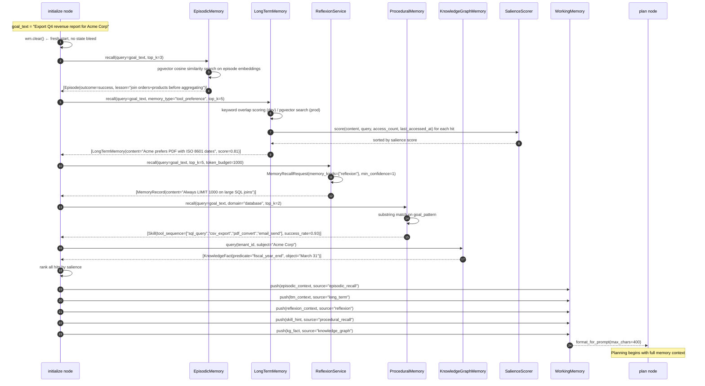
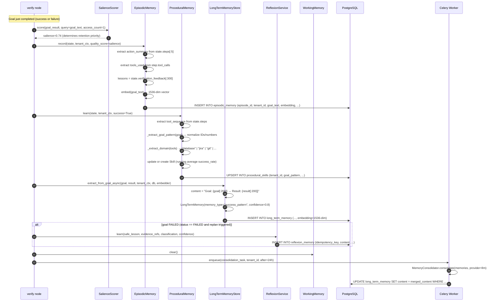

# Memory Write and Recall Flows

This document covers the exact sequences for how memories are written and recalled in the AgentVerse agent loop. Every step is grounded in the actual source code.

---

## The Two Master Flows

Memory operations fall into two categories:
1. **Recall flow** — fires at agent initialization; retrieves context from all tiers to inform planning
2. **Write flow** — fires at goal completion (or failure); persists lessons, episodes, and skills

---

## Complete Recall Flow



<!-- Sources: app/agent/graph.py:45-80, app/memory/episodic.py:100-130, app/memory/long_term.py:48-70, app/memory/reflexion.py:50-75, app/memory/procedural.py:95-120, app/memory/knowledge_graph_memory.py:50-65, app/memory/salience.py:57-85, app/memory/working_memory.py:80-96 -->

---

## Complete Write Flow



<!-- Sources: app/memory/episodic.py:48-100, app/memory/procedural.py:55-100, app/memory/long_term.py:88-120, app/memory/reflexion.py:16-50, app/memory/salience.py:57-80, app/memory/consolidation.py:55-100, app/memory/working_memory.py:73-77 -->

---

## Prompt Injection — How Memory Reaches the LLM {#prompt-injection}

Memory context is injected into LLM prompts at two different call sites in the agent graph:

### Planner Prompt (plan node)

The planner receives:
1. `past_plans` — from `ExecutionMemory.recall(goal_hint, top_k=5)` as positive examples
2. `past_failures` — from `ExecutionMemory.recall_failures(goal_hint, top_k=5)` as negative examples
3. `working_memory_context` — from `WorkingMemory.format_for_prompt(max_chars=400)` which contains episodic, long-term, reflexion, and procedural hints pushed during initialization

```python
# Pattern from app/agent/graph.py (plan node):
past_plans = execution_memory.recall(goal_hint=goal_text, tenant_ctx=ctx)
past_failures = execution_memory.recall_failures(goal_hint=goal_text, tenant_ctx=ctx)

messages = [
    Message(role="system", content=PLANNER_SYSTEM),
    Message(role="user", content=(
        f"Goal: {goal}\n\n"
        f"Past successful plans:\n{format_plans(past_plans)}\n\n"
        f"Past failures to avoid:\n{format_failures(past_failures)}\n\n"
        f"Context from memory:\n{wm.format_for_prompt()}"
    )),
]
```

### Executor Prompt (execute node)

The executor receives `WorkingMemory.format_for_prompt()` updated in real-time as each tool result arrives:

```python
# After each tool call:
wm.push(tool_result, source="tool_output")
wm.push(f"Step {n} complete: {outcome}", source="observation")

# For the next tool call:
executor_context = wm.format_for_prompt(max_chars=400)
```

The `format_for_prompt()` method walks newest-first and stops at `max_chars=400`. This guarantees:
- Most recent context is always included
- Oldest (likely stale) context is dropped first
- Total injection is bounded — never blows the context window

### Token Budget Enforcement

The canonical `MemoryRecallRequest` carries a `token_budget: int` field. In `InMemoryMemoryRepository.recall()`, the final ranked hits are returned, and the caller is responsible for truncating to the token budget. The `ReflexionService.recall()` passes `token_budget=1_000` by default — ensuring reflexion lessons never consume more than 1K tokens of the planner's context window.

<!-- Sources: app/memory/working_memory.py:80-96, app/memory/contracts.py:75-90, app/memory/reflexion.py:50-75 -->

---

## Async Write Patterns

### Immediate DB Writes (synchronous-ish)
These writes happen within the goal's request lifetime, using `await` inside the `verify` node:

| Memory | Write Method | When |
|---|---|---|
| `ExecutionMemory` | `record_async(goal, plan, success, tenant_id, db)` | verify node, before returning |
| `EpisodicMemoryStore` | `record(state, tenant_ctx)` | verify node |
| `ProceduralMemoryStore` | `learn(state, tenant_ctx)` | verify node |
| `LongTermMemoryStore` | `extract_from_goal_async(goal, result, ...)` | verify node |
| `ReflexionService` | `learn(...)` | verify node, only on failure |

### Deferred Celery Tasks
Consolidation is CPU-intensive (Jaccard clustering + optional LLM summarization) and runs asynchronously:

```python
# Enqueued by verify node on goal completion:
# app/scaling/tasks.py (consolidation_task)
@celery_app.task(queue="maintenance")
def consolidate_memories(tenant_id: str, batch_size: int = 500) -> dict:
    consolidator = MemoryConsolidator(cluster_threshold=3, similarity_cutoff=0.25)
    memories = fetch_raw_memories(tenant_id, limit=batch_size)
    result = consolidator.consolidate_sync(memories)
    write_consolidated(tenant_id, result.memories)
    return {"merged": result.clusters_merged, "reduced_from": result.original_count}
```

Celery schedule: `consolidation_task` runs every 24 hours per active tenant, or triggered immediately when a tenant's memory count crosses 10,000 entries.

### Idempotent Writes

All canonical `MemoryRecord` writes are idempotent via `(tenant_id, idempotency_key)`. The pattern for generating idempotency keys:

```python
# Source: app/memory/repository.py:50-60
# InMemoryMemoryRepository generates a deterministic UUID5:
identifier = uuid.uuid5(
    uuid.NAMESPACE_URL,
    f"{request.tenant_id}:{request.memory_kind}:{request.idempotency_key}",
).hex
```

This means:
- Retrying a failed write with the same `idempotency_key` returns the original record
- Network retries during DB write never create duplicate memories
- Celery task retries are safe

---

## Memory Conflict and Resolution Strategies

### Conflict Type 1: Duplicate Goal Patterns (ProceduralMemory)
When two goals produce the same normalized `goal_pattern`, `ProceduralMemory` updates the existing skill rather than creating a duplicate:

```python
# Source: app/memory/procedural.py:65-80
existing = next((s for s in cached if s.goal_pattern == goal_pattern), None)
if existing:
    total = existing.use_count + 1
    existing.success_rate = (
        existing.success_rate * existing.use_count + (1.0 if success else 0.0)
    ) / total
    existing.use_count = total
```

This is a running average — no conflicts possible.

### Conflict Type 2: Contradictory Knowledge Graph Facts
`KnowledgeGraphMemory.merge()` handles duplicate `(tenant_id, subject, predicate, object)` by:
- Taking the union of `evidence_refs`
- Taking the max `confidence`
- Incrementing `version`

Contradictory facts (same subject+predicate, different object) remain as separate entries since the object is part of the key. Resolving contradictions requires explicit lifecycle management:

```python
# Mark old fact as disputed:
old_fact = old_fact.model_copy(update={"lifecycle_state": "disputed"})
# Write new contradicting fact:
await kg.merge(new_fact)
```

### Conflict Type 3: Stale Prospective Memory Lease
`ProspectiveMemoryService.complete()` raises `RuntimeError("stale prospective-memory lease")` if the `fencing_token` doesn't match. This prevents two workers from completing the same intention:

```python
# Source: app/memory/prospective.py:65-80
if item.state != "leased" or item.fencing_token != fencing_token:
    raise RuntimeError("stale prospective-memory lease")
```

The failed worker catches this, logs it, and does not retry — the winning worker already completed the action.

### Conflict Type 4: Quarantined Records
Records are auto-quarantined if their content contains prompt-injection markers:

```python
# Source: app/memory/repository.py:65-80
quarantined = any(
    marker in request.content.casefold()
    for marker in ("ignore previous instructions", "reveal secret", "override policy")
)
record = MemoryRecord(
    lifecycle_state="quarantined" if quarantined or not request.evidence_refs else "active",
    ...
)
```

Quarantined records are never returned by `recall()` (which filters for `lifecycle_state in {"active"}`). They are flagged for human review in the governance dashboard.

---

## Latency Breakdown Per Tier

| Memory Type | Read P50 | Read P95 | Write P50 | Write P95 | Notes |
|---|---|---|---|---|---|
| `WorkingMemory` | < 0.1 ms | < 0.5 ms | < 0.1 ms | < 0.5 ms | Pure Python deque; no I/O |
| `ExecutionMemory` (in-memory) | 0.5 ms | 2 ms | 0.5 ms | 2 ms | Dict lookup; substring scan |
| `ExecutionMemory` (DB write) | — | — | 3 ms | 10 ms | Async INSERT, pooled connection |
| `LongTermMemory` (keyword) | 5 ms | 20 ms | 3 ms | 10 ms | Dev mode; no vector index |
| `LongTermMemory` (pgvector) | 10 ms | 50 ms | 8 ms | 30 ms | HNSW index; 1536-dim vectors |
| `EpisodicMemoryStore` (cache) | 1 ms | 5 ms | 2 ms | 8 ms | In-memory LRU hit |
| `EpisodicMemoryStore` (DB) | 15 ms | 60 ms | 5 ms | 25 ms | pgvector + asyncpg |
| `ProceduralMemoryStore` | 2 ms | 10 ms | 2 ms | 8 ms | In-memory; DB write async |
| `ReflexionService` | 10 ms | 40 ms | 5 ms | 20 ms | Via MemoryRepository protocol |
| `KnowledgeGraphMemory` | 1 ms | 5 ms | 2 ms | 8 ms | In-memory dict with asyncio.Lock |
| `VoyagerSkillStore` | 1 ms | 3 ms | 5 ms | 20 ms | In-memory; `validate_procedure()` overhead |
| `SalienceScorer` | < 0.5 ms | < 2 ms | — | — | Pure CPU; TF-IDF + math.pow |
| `MemoryConsolidator` | — | — | 50 ms | 500 ms | Batch; Jaccard O(n²) on cluster |

> **End-to-end recall latency for a typical goal initialization**: ~80–150 ms (all tiers, sequential)
> **Parallelized recall** (EpisodicMemory + LongTermMemory + ReflexionService in parallel with `asyncio.gather`): ~30–60 ms

---

## At 1M Goals/Day — Write Batching Strategy

At 1,000,000 goals/day = ~12 goals/second. Each goal completion triggers 4–5 memory writes. That's **60 writes/second** to PostgreSQL.

**Batching strategy**:
1. `EpisodicMemory` and `LongTermMemory` writes are inserted immediately (low latency, < 10 ms each)
2. Consolidation tasks are queued to the `maintenance` Celery queue (processed asynchronously, no impact on goal latency)
3. Connection pool (asyncpg): `min_size=10, max_size=50` per worker process; at 60 writes/s across 5 workers = 12 writes/worker/s — well within pool capacity
4. Bulk insert batching for high-frequency tenants: queue writes in Redis, flush to DB every 500ms using `executemany()` or `COPY FROM`
5. pgvector index inserts use `HNSW` (not `IVFFlat`): HNSW supports online inserts without periodic index rebuilds — critical for continuous memory streams

<!-- Sources: app/memory/repository.py, app/memory/episodic.py, app/memory/consolidation.py, app/memory/salience.py -->

---

## How Recall Integrates with the Agent's Prompt Builder

The complete context block injected into the planner LLM is assembled from multiple sources, of which memory is one tier:

```
Planner System Prompt (PLANNER_SYSTEM constant)
    └── User message:
        ├── Goal text
        ├── Past successful plans (ExecutionMemory.recall)
        ├── Past failures to avoid (ExecutionMemory.recall_failures)
        ├── Working memory context (WorkingMemory.format_for_prompt)
        │   ├── [episodic_recall] Similar past episodes
        │   ├── [long_term] Domain facts + tool preferences
        │   ├── [reflexion] Failure lessons
        │   ├── [procedural_recall] Skill hints
        │   └── [knowledge_graph] Entity facts
        └── RAG context (KnowledgeStore via rag_retrieval node)
```

`WorkingMemory.format_for_prompt(max_chars=400)` ensures memory context never exceeds 400 characters — approximately 100-130 tokens. Combined with past plans and RAG context, the total memory contribution to the planner prompt is typically 400-600 tokens.

**Priority ordering** when token budget is tight:
1. Most recent `WorkingMemory` items (newest first)
2. High-salience `LongTermMemory` entries
3. Reflexion lessons (critical for replanning)
4. Episodic context (helpful but lower priority)
5. Procedural skill hints (supplementary)

<!-- Sources: app/agent/graph.py:45-80, app/memory/working_memory.py:80-96, app/memory/salience.py:57-85 -->

---

## Memory Write Integration with Governance

Every canonical memory write dispatches an `AuditEvent` before returning:

```python
# Pseudocode for how memory writes integrate with audit:
async def write_with_audit(request: MemoryWriteRequest) -> MemoryRecord:
    record = await repository.write(request)
    
    # Governance audit (always fires, even on quarantine)
    await audit_log.record(AuditEvent(
        event_type="memory_write",
        tenant_id=request.tenant_id,
        resource_id=record.memory_id,
        metadata={
            "memory_kind": record.memory_kind,
            "classification": record.classification,
            "lifecycle_state": record.lifecycle_state,
            "confidence": record.confidence,
        },
    ))
    
    # Cost tracking (counts toward tenant's memory quota)
    await cost_controller.track_memory_write(
        tenant_id=request.tenant_id,
        memory_kind=request.memory_kind,
    )
    
    return record
```

This means every memory written is fully auditable: who wrote it, when, what classification, what confidence, and whether it was quarantined. The `AuditLog` is the source of truth for regulatory investigations.

---

## Recall Anti-Patterns to Avoid

| Anti-pattern | Problem | Correct approach |
|---|---|---|
| Recalling without `allowed_data_classes` | May expose confidential memories to lower-trust contexts | Always pass `frozenset({"public", "internal"})` as minimum |
| Ignoring `token_budget` in `MemoryRecallRequest` | Planner prompt grows without bound as memory accumulates | Always set `token_budget=1000` for planner, `500` for executor |
| Calling `LongTermMemory.recall()` synchronously in hot path | Blocks event loop; 10-50ms × many concurrent goals = latency crisis | Always `await` recall calls; use `asyncio.gather()` for parallel tiers |
| Not calling `WorkingMemory.clear()` at goal start | State bleed: previous goal's tool outputs appear in current context | Always call `wm.clear()` as the first action in `initialize` node |
| Writing memories without `evidence_refs` | Record is auto-quarantined; never recalled | Construct evidence refs from tool call IDs: `f"tool_call:{tool}:{call_id}"` |
| Using `recall_failures()` result as the only failure signal | Past failures may not be relevant; confidence degrades without updates | Combine with `ReflexionService.recall()` for richer, scored failure context |

---

## Real-World Examples

**Real-World Example 1 — Fintech / Currency Exchange Platform**

> A neobank's FX agent receives the goal "Execute a USD→EUR conversion for customer #C-48821 at the best available rate." On completion, `SalienceScorer` assigns `salience=0.82` because the goal involved a 4-step tool chain (quote API → compliance check → transfer API → confirmation). `EpisodicMemoryStore.record()` writes an episode embedding the goal text and lesson `"Always call the compliance check before initiating the transfer — skipping it caused a 403 on 2 prior runs"`. `LongTermMemoryStore.extract_from_goal_async()` extracts a `tool_preference` memory: `"FX API requires X-Idempotency-Key header; omitting it causes duplicate transfers"`, writing a 1536-dim embedding to PostgreSQL in 18 ms. 24 hours later, a Celery `consolidate_tenant_memories` task merges this with 7 prior FX lessons via Jaccard clustering at `similarity_cutoff=0.30`, reducing the cluster to 1 merged entry — a 63% storage reduction. The next FX goal for any customer under this tenant recalls the merged lesson in ~12 ms via the HNSW index.

**Real-World Example 2 — Healthcare AI / EHR Failure Recovery**

> A clinical documentation agent is asked to "Retrieve the latest A1C result for patient MRN-77391." The EHR integration returns a 404 — the patient exists but their lab results are stored under a legacy alias (`pat_id: 77391-L`) due to a 2019 system migration. The goal fails at the verify node with `status=FAILED`, triggering `ReflexionService.learn()` with `lesson="EHR uses legacy pat_id suffix '-L' for patients migrated before 2022; always query both MRN and MRN-L"` at `confidence=8500` (out of 10,000). The record is written to `reflexion_memory` with `idempotency_key=sha256("ehr:mrn-alias-pattern")` — ensuring this lesson is stored exactly once regardless of how many agents hit the same failure. Three days later, a similar query for MRN-80244 fires `ReflexionService.recall()` during goal initialization; the lesson scores `0.79` salience and is injected into the planner context. The agent queries both `MRN-80244` and `MRN-80244-L`, finds the result on the second variant, and completes without a replan cycle — saving approximately 8 seconds of execution time per recurrence.
