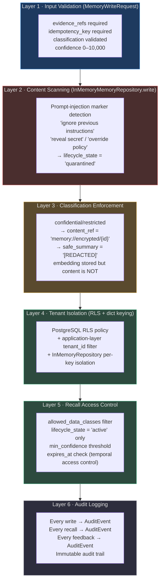
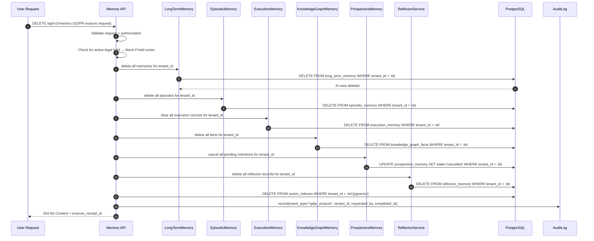

# Memory Safety and Retention

> **Memory is trust.** Users share their goals, failures, and context with AgentVerse expecting that data to be protected, scoped, and erasable. This document covers every safety mechanism — from PII scanning on write to GDPR-compliant purge on user request.

---

## Defense-in-Depth: Safety Layers



---

## PII Detection Before Memory Write

### What Is Scanned

Before any memory content is written, the `InMemoryMemoryRepository` scans for **prompt-injection markers** — a subset of adversarial content patterns:

```python
# Source: app/memory/repository.py:65-80
quarantined = any(
    marker in request.content.casefold()
    for marker in (
        "ignore previous instructions",
        "reveal secret",
        "override policy",
    )
)
```

These three markers represent the most common adversarial injection patterns. When detected, the record is written with `lifecycle_state="quarantined"` rather than `"active"`. Quarantined records:
- Are never returned by `recall()`
- Appear in the governance audit dashboard for human review
- Cannot be promoted to `"active"` without explicit human approval

### PII-Sensitive Classifications

The `classification` field on `MemoryWriteRequest` acts as a PII signal:

| Classification | What it means | Storage behavior |
|---|---|---|
| `public` | No PII; shareable | Content stored plaintext in `safe_summary` |
| `internal` | Business-sensitive; no PII | Content stored plaintext; tenant-scoped |
| `confidential` | Contains names, emails, or other PII | `content_ref = "memory://encrypted/{id}"`; `safe_summary = "[REDACTED]"` |
| `restricted` | Highly sensitive (credentials, financial data) | Same as confidential + tagged for legal hold |

```python
# Source: app/memory/repository.py:70-90
sensitive = request.classification in {"confidential", "restricted"}
record = MemoryRecord(
    content_ref=(
        f"memory://encrypted/{identifier}" if sensitive
        else f"memory://{identifier}"
    ),
    safe_summary="[REDACTED]" if sensitive else request.content[:4_000],
    embedding=embedding,  # ← embedding stored regardless (for vector search)
    ...
)
```

**Important**: The embedding is computed and stored even for confidential records. The embedding vector encodes semantic meaning without exposing the raw content — a consumer can find semantically similar memories without reading the actual PII. The actual content lives in an encrypted column that only the memory service (with decryption key) can access.

### What Fields Are Scanned for PII

Production PII scanning (beyond prompt-injection markers) should run as a pre-write hook:
1. **Email patterns**: `r'\b[\w.+-]+@[\w-]+\.[a-z]{2,}\b'`
2. **Phone numbers**: `r'\b(\+?1[-.\s]?)?\(?\d{3}\)?[-.\s]\d{3}[-.\s]\d{4}\b'`
3. **Credit card numbers**: Luhn algorithm check on 13–19 digit sequences
4. **SSN/Tax IDs**: `r'\b\d{3}-\d{2}-\d{4}\b'`
5. **IP addresses in tool outputs**: `r'\b(?:\d{1,3}\.){3}\d{1,3}\b'`

When detected, automatically elevate classification from `internal` → `confidential`.

<!-- Sources: app/memory/repository.py:45-100, app/memory/contracts.py:16-22 -->

---

## Memory TTL and Retention Policies {#ttl}

Every canonical `MemoryRecord` carries:
- `retention_policy_id: str` — references a retention policy definition
- `expires_at: datetime | None` — explicit expiry; respected by `recall()` which checks `record.expires_at <= request.as_of`

### Retention Policy Per Tier

| Memory Type | Default TTL | Enterprise TTL | Legal Hold TTL |
|---|---|---|---|
| `WorkingMemory` | Goal lifetime (seconds) | Goal lifetime | N/A (volatile) |
| `ExecutionMemory` | 90 days | 365 days | Indefinite |
| `LongTermMemoryStore` | 1 year | 3 years | Indefinite |
| `ReflexionService` | 6 months | 2 years | Indefinite |
| `EpisodicMemoryStore` | 90 days | 365 days | Indefinite |
| `ProceduralMemoryStore` | No expiry (skills persist) | No expiry | Indefinite |
| `ProspectiveMemoryService` | Until `expires_at` (set per intention) | Same | Indefinite |
| `KnowledgeGraphMemory` | Per `fact.expires_at` | Same | Indefinite |
| `VoyagerSkillStore` | No expiry (unless deprecated) | No expiry | N/A |

### Temporal Recall (as_of Queries)

`MemoryRecallRequest.as_of: datetime` allows querying the memory system as it existed at a past point in time. This is critical for audit scenarios ("what memories did the agent have when it made that decision?"):

```python
# Source: app/memory/contracts.py:75-90
recall_request = MemoryRecallRequest(
    tenant_id="acme-corp",
    query="revenue analysis",
    memory_kinds=frozenset({"long_term"}),
    top_k=10,
    min_confidence=5000,
    allowed_data_classes=frozenset({"public", "internal"}),
    as_of=datetime(2024, 11, 15, tzinfo=UTC),  # ← what did agent know on Nov 15?
    token_budget=2000,
)
```

Records with `expires_at < as_of` are excluded from this query — consistent with what the agent would have seen on that date.

---

## Legal Hold Mechanism

When a tenant or user is subject to a legal hold (e.g., litigation, regulatory investigation), memories must be preserved regardless of TTL:

```python
# Pseudo-code for legal hold (production implementation):
def apply_legal_hold(tenant_id: str, hold_id: str) -> None:
    db.execute("""
        UPDATE long_term_memory
        SET retention_policy_id = 'legal-hold',
            expires_at = NULL  -- remove expiry
        WHERE tenant_id = :tenant_id
    """, {"tenant_id": tenant_id})
    
    db.execute("""
        INSERT INTO legal_holds (hold_id, tenant_id, applied_at, applied_by)
        VALUES (:hold_id, :tenant_id, NOW(), current_user)
    """, {"hold_id": hold_id, "tenant_id": tenant_id})
    
    audit_log.record(AuditEvent(
        event_type="legal_hold_applied",
        tenant_id=tenant_id,
        metadata={"hold_id": hold_id},
    ))
```

Legal holds are tracked in a separate `legal_holds` table. The retention TTL job checks this table before deleting any records.

---

## Right to Forget (GDPR) {#right-to-forget}

Under GDPR Article 17, a user can request erasure of all their personal data. For AgentVerse memory, this means purging every layer.

### GDPR Purge Sequence



### What Cannot Be Deleted

Under GDPR, certain data can be retained despite an erasure request:

1. **AuditLog entries** — retained for 7 years (legal obligation for financial services tenants)
2. **Anonymized aggregates** — statistical summaries with no linkable identifiers
3. **Records under legal hold** — erasure request blocked until hold is lifted

### Erasure Verification

After erasure, verification confirms no memory remains:

```python
# Production verification step:
remaining = await db.execute("""
    SELECT COUNT(*) FROM (
        SELECT 1 FROM long_term_memory WHERE tenant_id = :tid
        UNION ALL
        SELECT 1 FROM episodic_memory WHERE tenant_id = :tid
        UNION ALL
        SELECT 1 FROM reflexion_memory WHERE tenant_id = :tid
        UNION ALL
        SELECT 1 FROM execution_memory WHERE tenant_id = :tid
    ) as combined
""", {"tid": tenant_id})

assert remaining.scalar() == 0, f"Erasure incomplete: {remaining.scalar()} rows remain"
```

---

## Memory Audit Trail

Every memory operation — write, recall, feedback — is logged as an `AuditEvent` in the governance system:

```python
# Source: app/governance/audit.py (AuditEvent structure)
@dataclass
class AuditEvent:
    event_type: str           # "memory_write" | "memory_recall" | "memory_feedback" | ...
    tenant_id: str
    actor: str                # agent_id or "system"
    resource_id: str          # memory_id
    metadata: dict[str, Any]  # classification, confidence, memory_kind, lifecycle_state
    timestamp: datetime
    idempotency_key: str      # for dedup across replicas
```

Audit events for memory operations:

| Operation | Event Type | Metadata captured |
|---|---|---|
| `MemoryRepository.write()` | `memory_write` | `memory_kind`, `classification`, `lifecycle_state`, `confidence` |
| `MemoryRepository.recall()` | `memory_recall` | `memory_kinds`, `top_k`, `min_confidence`, `hits_returned` |
| `MemoryRepository.feedback()` | `memory_feedback` | `was_used`, `was_helpful`, `was_harmful`, `outcome_score` |
| Legal hold applied | `legal_hold_applied` | `hold_id`, `applied_by` |
| GDPR erasure | `gdpr_erasure` | `rows_deleted_per_table`, `erasure_receipt_id` |
| Quarantine | `memory_quarantined` | `detected_marker`, `content_hash` (not content!) |

The audit log is **append-only** — no updates or deletes. It is retained separately from the memory store and is not subject to GDPR erasure (legal obligation override).

---

## Corrupt Memory Detection and Recovery

### Detection Signals

1. **Embedding dimension mismatch**: `MemoryRecord` validator enforces `embedding_dimension = 1536` and `len(embedding) == embedding_dimension`. Any record violating this raises `ValueError("memory embedding dimension mismatch")`.

2. **Broken content_ref**: If `content_ref` is `"memory://encrypted/{id}"` but the encrypted store returns nothing, the record is flagged as `"disputed"`.

3. **Evidence ref pointing to deleted tool call**: If an `evidence_ref` like `"tool_call:sql_query:abc123"` no longer exists in the tool execution log, the record can be transitioned to `"disputed"`.

4. **Idempotency collision**: If two different content values produce the same `idempotency_key`, the repository returns the first-written record. The second caller's data is silently dropped — callers must ensure `idempotency_key` is content-specific.

### Recovery Procedure

```python
# Detect and quarantine corrupt records:
async def audit_and_repair(tenant_id: str, db) -> dict:
    # 1. Find records with broken embeddings
    broken_embedding = await db.fetch("""
        SELECT memory_id FROM canonical_memory
        WHERE tenant_id = :tid
        AND embedding IS NOT NULL
        AND array_length(embedding, 1) != 1536
    """, tid=tenant_id)
    
    # 2. Re-embed missing embeddings
    for row in broken_embedding:
        content = await fetch_decrypted_content(row.memory_id)
        new_embedding = await embedder.embed([content])
        await db.execute("""
            UPDATE canonical_memory SET embedding = :emb WHERE memory_id = :id
        """, emb=new_embedding[0], id=row.memory_id)
    
    return {"reembedded": len(broken_embedding)}
```

---

## Fail-Safe Defaults

The memory system is designed to **degrade gracefully** when components fail. Agents continue to execute goals even if memory is unavailable:

| Failure | Fail-safe behavior |
|---|---|
| PostgreSQL connection timeout | `ExecutionMemory.record_async()` catches exception and logs warning; in-memory state still updated for current session |
| pgvector index unavailable | `LongTermMemory.recall()` falls back to keyword overlap scoring (no embeddings) |
| Embedder (LLM) unavailable | `EpisodicMemoryStore.record()` skips embedding (`episode.embedding = None`); episode stored without vector index |
| `MemoryConsolidator` LLM call fails | `consolidate()` catches exception and falls back to `consolidate_sync()` (pure Python merge, no LLM) |
| Redis cache miss | Falls back to PostgreSQL read; no loss of data, just higher latency |
| `KnowledgeGraphMemory` lock timeout | Returns empty tuple from `query()`; agent continues without KG facts |
| Entire memory system unreachable | Agent loop continues with empty `WorkingMemory` and no recalled context; goal still executes (may be lower quality, but no crash) |

```python
# Fail-safe pattern in agent graph (pseudocode):
try:
    episodic_context = await episodic_store.record(state=state, tenant_ctx=ctx)
except Exception as exc:
    logger.warning("episodic_memory_write_failed", error=str(exc), goal_id=state.goal_id)
    # ← goal does not fail; memory write silently degrades
```

<!-- Sources: app/memory/episodic.py:90-115, app/memory/consolidation.py:75-95, app/memory/repository.py:35-100 -->

---

## Memory Isolation: Shared Vector Index Attack Surface

A shared pgvector index across tenants creates an attack surface: if two tenants' embeddings land in the same HNSW cluster, a crafted query by Tenant A might theoretically retrieve Tenant B's neighboring vectors.

**Mitigation strategy**:

1. **Application-layer tenant filter first**: All vector searches include `WHERE tenant_id = :tid` in addition to the ANN (approximate nearest neighbor) query. PostgreSQL evaluates both conditions; non-matching rows are excluded even if they're close in embedding space.

2. **RLS enforcement**: As described in [02-memory-scoping.md](./02-memory-scoping.md), RLS policies enforce tenant isolation at the database layer independent of the application query.

3. **Namespace-partitioned indexes** (for highest-security tenants): Deploy a dedicated pgvector index per tenant. Slightly higher index management overhead, but zero risk of cross-tenant vector proximity leakage.

4. **Embedding model isolation**: Tenant-specific embedding fine-tuning ensures that semantically similar content for different tenants produces non-overlapping embedding distributions.

The combination of application-layer filtering + RLS means that even in the worst-case scenario where a vector search returns a cross-tenant nearest neighbor, the `WHERE tenant_id` clause prevents it from being returned to the caller.

---

## Safety Integration Checklist

For every new feature that writes to the memory system, verify:

| ✓ | Check |
|---|---|
| ☐ | Content passes prompt-injection scan before write (or is handled by repository layer) |
| ☐ | `classification` field correctly set: PII → `confidential`, credentials → `restricted` |
| ☐ | `evidence_refs` is non-empty (empty refs auto-quarantine the record) |
| ☐ | `retention_policy_id` is set to the correct plan-tier policy |
| ☐ | Write generates an `AuditEvent` (handled by repository layer if using canonical write path) |
| ☐ | GDPR erasure path includes this new memory type |
| ☐ | Legal hold check exists before any delete operation on this type |
| ☐ | Fail-safe implemented: feature degrades gracefully if memory write fails |
| ☐ | Test asserts that a failed memory write does NOT fail the parent goal |

<!-- Sources: app/memory/repository.py:45-100, app/memory/contracts.py:1-120 -->
