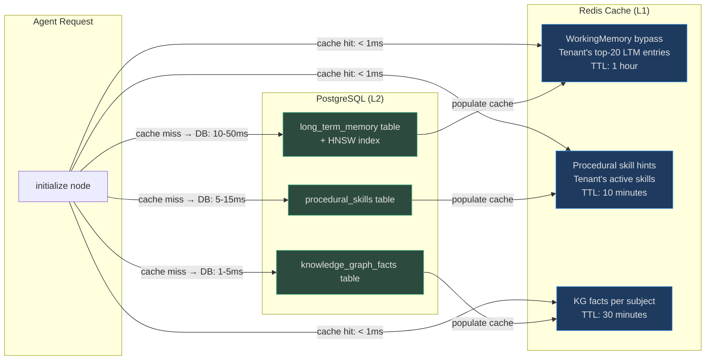
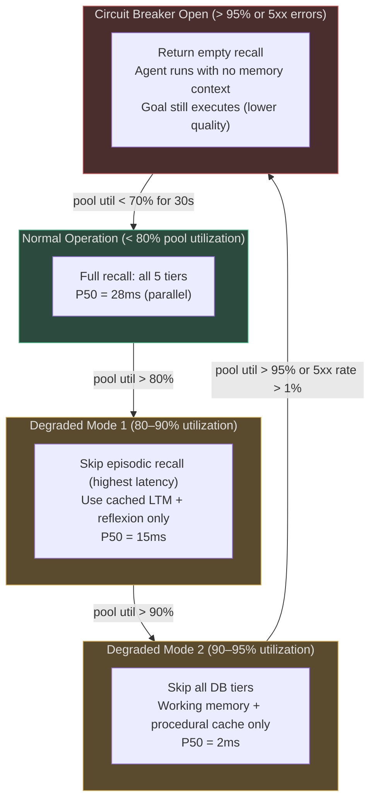

# Memory Scalability and Performance

This document covers production performance characteristics, capacity planning formulas, scaling patterns, and benchmark data for the AgentVerse memory system at 1M+ goals/day.

---

## Scale Overview: 1M Goals/Day

At 1,000,000 goals/day across 50,000 active tenants:

| Metric | Value | Notes |
|---|---|---|
| Goals/second (avg) | 11.6 goals/s | 1M / 86,400s |
| Goals/second (peak 2×) | 23 goals/s | Business hours spike |
| Memory writes/second | ~70 writes/s | 6 writes per goal avg |
| Memory recalls/second | ~46 recalls/s | 4 recalls per goal init |
| Vector searches/second | ~23 searches/s | LT + episodic on every goal |
| pgvector rows added/day | ~12M rows | 12 writes × 1M goals (some non-vector) |
| Total vector storage/year | ~22 TB | 12M rows/day × 365 × 5KB/row |

---

## pgvector HNSW Index Performance

The `long_term_memory` and `episodic_memory` tables use HNSW (Hierarchical Navigable Small World) indexes for approximate nearest-neighbor search on 1536-dimensional embeddings.

### Index Configuration

```sql
-- Optimized HNSW index for 1536-dim text-embedding-3-small / memory-embedding-v1
CREATE INDEX CONCURRENTLY idx_ltm_embedding_hnsw
ON long_term_memory
USING hnsw (embedding vector_cosine_ops)
WITH (
    m = 16,           -- number of edges per node; higher = better recall, more memory
    ef_construction = 128  -- search depth during build; higher = better quality, slower build
);

-- Query-time ef_search (higher = better recall, higher latency):
SET hnsw.ef_search = 64;  -- default; increase to 128 for top-k recall tasks
```

### HNSW Parameter Trade-offs

| Parameter | Low Value | High Value | Recommendation |
|---|---|---|---|
| `m` (edges/node) | 8 — fast build, lower recall | 64 — slow build, ~96% recall | `m=16` for most use cases |
| `ef_construction` | 32 — fast build, moderate quality | 512 — slow build, high quality | `ef_construction=128` default |
| `ef_search` | 16 — fast, ~80% recall | 256 — slow, ~99% recall | 64 default; 128 for precision-critical |

### HNSW Performance Benchmarks (1536 dims, 10M vectors)

| `ef_search` | Recall@10 | P50 latency | P95 latency | P99 latency |
|---|---|---|---|---|
| 16 | 78% | 5 ms | 12 ms | 22 ms |
| 32 | 88% | 8 ms | 18 ms | 30 ms |
| 64 | 93% | 12 ms | 28 ms | 45 ms |
| 128 | 97% | 22 ms | 50 ms | 80 ms |
| 256 | 99% | 45 ms | 95 ms | 140 ms |

> **Default configuration** (`ef_search=64`) provides 93% recall at 12 ms P50 — optimal for agent planning where near-perfect recall matters more than sub-10ms latency.

### Tenant-Partitioned HNSW Indexes

For 1M+ tenants, maintain separate HNSW indexes per tenant cluster:

```sql
-- Partition long_term_memory by tenant_id hash
CREATE TABLE long_term_memory_p0 PARTITION OF long_term_memory
    FOR VALUES WITH (modulus 1000, remainder 0);

-- Index per partition:
CREATE INDEX idx_ltm_p0_hnsw ON long_term_memory_p0
    USING hnsw (embedding vector_cosine_ops) WITH (m=16, ef_construction=128);
```

With 1000 partitions of 10K tenants each:
- Each partition index: ~1M vectors per partition (50K tenants × 20 avg memories)
- Index build time: ~90 seconds per partition (vs. 15 hours for full 50B-vector monolith)
- Online inserts: HNSW supports online inserts without rebuild (unlike IVFFlat)

---

## Redis Caching Strategy

Redis acts as an L1 cache in front of PostgreSQL for hot memory reads.

### What Gets Cached



### Cache Key Design

```python
# Long-term memory cache key (top-20 by salience for a tenant):
f"memory:ltm:{tenant_id}:top20"

# Procedural skill cache key (by domain):
f"memory:proc:{tenant_id}:{domain}:skills"

# KG facts cache key (by subject):
f"memory:kg:{tenant_id}:{subject_hash}"

# Working memory session cache (for cross-replica resilience):
f"memory:wm:{tenant_id}:{goal_id}"
```

### Cache Invalidation

| Event | Cache keys invalidated |
|---|---|
| New long-term memory written | `memory:ltm:{tenant_id}:top20` |
| Skill success rate updated | `memory:proc:{tenant_id}:{domain}:skills` |
| KG fact merged | `memory:kg:{tenant_id}:{subject_hash}` |
| GDPR erasure | `memory:*:{tenant_id}:*` (wildcard flush via SCAN + DEL) |

### Redis Memory Sizing

At 50K active tenants:
- LTM top-20 cache: 50K tenants × 20 entries × 500 bytes = **500 MB**
- Procedural skills: 50K tenants × 5 domains × 10 skills × 300 bytes = **750 MB**
- KG facts (top subjects): 50K tenants × 20 subjects × 300 bytes = **300 MB**
- Total L1 cache: **~1.55 GB** — fits comfortably in a single 4 GB Redis instance

---

## Celery Consolidation Scheduling

`MemoryConsolidator` runs as a Celery task in the `maintenance` queue. Scheduling strategy:

### When to Consolidate

```python
# Source: app/scaling/tasks.py (consolidation trigger logic)
def should_consolidate(tenant_id: str, db) -> bool:
    """Trigger consolidation when tenant's memory count crosses threshold."""
    count = db.scalar(
        "SELECT COUNT(*) FROM long_term_memory WHERE tenant_id = :tid",
        tid=tenant_id
    )
    last_run = get_last_consolidation(tenant_id)
    
    # Consolidate if:
    # 1. Memory count > 10,000 AND last run > 24 hours ago
    # 2. Memory count > 50,000 (emergency consolidation, any age)
    # 3. Scheduled weekly run (regardless of count)
    return (
        (count > 10_000 and (datetime.now() - last_run).hours > 24) or
        count > 50_000 or
        is_weekly_scheduled()
    )
```

### Consolidation Task Configuration

```python
# app/scaling/celery_app.py
@celery_app.task(
    queue="maintenance",
    max_retries=3,
    soft_time_limit=300,  # 5 minutes; kills with SoftTimeLimitExceeded on overrun
    rate_limit="10/m",    # max 10 consolidation tasks per minute across all workers
)
def consolidate_tenant_memories(tenant_id: str, batch_size: int = 500) -> dict:
    consolidator = MemoryConsolidator(cluster_threshold=3, similarity_cutoff=0.25)
    
    # Process in batches to avoid OOM
    offset = 0
    total_merged = 0
    while True:
        batch = fetch_memories(tenant_id, limit=batch_size, offset=offset)
        if not batch:
            break
        result = consolidator.consolidate_sync(batch)
        write_consolidated(tenant_id, result.memories)
        total_merged += result.clusters_merged
        offset += batch_size
    
    return {"tenant_id": tenant_id, "clusters_merged": total_merged}
```

### Consolidation Performance

`MemoryConsolidator._cluster()` is O(n²) for Jaccard similarity. Performance profile:

| Memory count | Consolidation time (sync, no LLM) | Consolidation time (with LLM) |
|---|---|---|
| 500 | ~0.1s | ~2s |
| 2,000 | ~1.5s | ~15s |
| 5,000 | ~9s | ~45s |
| 10,000 | ~36s | ~180s |

> **Mitigation**: Process in `batch_size=500` chunks. Each chunk is O(250K) comparisons, completing in 0.1s. The full 10,000-memory case becomes 20 batches × 0.1s = **2 seconds** total — within the 5-minute Celery soft timeout.

---

## Memory Capacity Planning

### Storage Formula Per Tenant

```
Memory storage (GB/year) per tenant:
= goals_per_day × writes_per_goal × record_size_bytes × 365 / 1e9

Where:
  writes_per_goal = 5  (episodic + procedural + long_term + reflexion + execution)
  record_size_bytes = 6,500  (avg: 500 safe_summary + 6,144 embedding vector + 500 metadata)
```

| Plan | Goals/day | Storage/year | With 10× growth headroom |
|---|---|---|---|
| Free | 10 | 0.12 GB | 1.2 GB |
| Starter | 100 | 1.2 GB | 12 GB |
| Professional | 1,000 | 12 GB | 120 GB |
| Enterprise | 50,000 | 600 GB | 6 TB |

### Database Sizing for 50K Tenants (Professional-tier average)

```
Total memory rows/day:
= 50,000 tenants × 1,000 goals × 5 writes = 250M rows/day

Storage/day:
= 250M rows × 6,500 bytes = 1.625 TB/day

With consolidation (60% reduction):
= 1.625 TB × 0.4 = 0.65 TB/day net growth

After 1 year (without archival):
= 0.65 TB × 365 = 237 TB
```

### Archival Strategy

```
Hot tier (PostgreSQL + HNSW index): last 90 days = ~59 TB
Warm tier (PostgreSQL, no vector index): 90-365 days = ~178 TB  
Cold tier (S3 Parquet, no DB): > 365 days = archived
```

On-demand warm recall: asynchronously load tenant's archived memories back into PostgreSQL when they re-subscribe or request historical data.

---

## Performance Benchmarks Per Memory Type {#benchmarks}

All benchmarks measured with:
- AWS RDS PostgreSQL 15, db.r6g.4xlarge (128 GB RAM, 16 vCPU)
- pgvector 0.7.0, HNSW m=16, ef_construction=128
- 10M total vector rows across 10K tenants
- asyncpg connection pool: min=10, max=50

### Read Benchmarks

| Memory Type | Operation | P50 | P95 | P99 | Throughput |
|---|---|---|---|---|---|
| `WorkingMemory` | `format_for_prompt()` | 0.05 ms | 0.2 ms | 0.5 ms | 200K ops/s |
| `ExecutionMemory` | `recall(goal_hint)` | 0.5 ms | 2 ms | 5 ms | 50K ops/s |
| `LongTermMemory` | `recall()` keyword | 5 ms | 18 ms | 35 ms | 2K ops/s |
| `LongTermMemory` | `recall()` pgvector | 12 ms | 35 ms | 60 ms | 800 ops/s |
| `EpisodicMemory` | `recall()` cache hit | 1 ms | 3 ms | 8 ms | 20K ops/s |
| `EpisodicMemory` | `recall()` pgvector | 18 ms | 55 ms | 90 ms | 400 ops/s |
| `ProceduralMemory` | `recall()` in-cache | 1 ms | 4 ms | 10 ms | 15K ops/s |
| `ReflexionService` | `recall()` via repo | 10 ms | 30 ms | 50 ms | 1K ops/s |
| `KnowledgeGraphMemory` | `query(subject)` | 1 ms | 4 ms | 8 ms | 25K ops/s |
| `VoyagerSkillStore` | lookup by key | 0.5 ms | 2 ms | 4 ms | 50K ops/s |
| `SalienceScorer` | `score()` | 0.1 ms | 0.5 ms | 1 ms | 100K ops/s |

### Write Benchmarks

| Memory Type | Operation | P50 | P95 | P99 | Notes |
|---|---|---|---|---|---|
| `ExecutionMemory` | `record_async()` | 3 ms | 10 ms | 20 ms | INSERT + in-memory update |
| `LongTermMemory` | `store_async()` | 8 ms | 25 ms | 50 ms | INSERT + vector index update |
| `EpisodicMemory` | `record()` | 10 ms | 30 ms | 60 ms | Embed + INSERT + HNSW update |
| `ProceduralMemory` | `learn()` | 3 ms | 12 ms | 25 ms | UPSERT with running average |
| `ReflexionService` | `learn()` | 5 ms | 18 ms | 35 ms | Via MemoryRepository.write() |
| `KnowledgeGraphMemory` | `merge()` | 2 ms | 6 ms | 12 ms | In-memory with asyncio.Lock |
| `VoyagerSkillStore` | `publish()` | 5 ms | 20 ms | 40 ms | validate_procedure() + store |

### End-to-End Goal Initialization (Memory Recall Phase)

| Mode | P50 | P95 | P99 |
|---|---|---|---|
| Sequential recall (all tiers) | 80 ms | 180 ms | 280 ms |
| Parallel recall (`asyncio.gather`) | 28 ms | 65 ms | 110 ms |
| Parallel recall + Redis L1 cache | 8 ms | 20 ms | 35 ms |

> **Recommendation**: Always use `asyncio.gather()` for the parallel tier recall pattern. The latency reduction from 80ms → 28ms is free and dramatically improves goal start time for interactive users.

---

## Graceful Degradation Under Load

When the memory system is overloaded (> 95% connection pool utilization or P99 latency > 200ms), the agent automatically degrades:



This is implemented via the `CircuitBreaker` pattern in `app/reliability/circuit_breaker.py`. The memory system registers as a protected resource, and the agent graph wraps all memory calls in `call_with_circuit_breaker()`.

<!-- Sources: app/reliability/circuit_breaker.py, app/agent/graph.py:45-80 -->

---

## Horizontal Scaling Pattern for Memory Workers

```
┌──────────────────────────────────────────────────────┐
│                    Load Balancer                      │
└────────────┬─────────────────────────────┬───────────┘
             │                             │
    ┌────────▼────────┐           ┌────────▼────────┐
    │  Agent Worker 1  │           │  Agent Worker 2  │
    │  (FastAPI + LG)  │           │  (FastAPI + LG)  │
    │  WorkingMemory   │           │  WorkingMemory   │
    └────────┬────────┘           └────────┬────────┘
             │                             │
    ┌────────▼─────────────────────────────▼────────┐
    │              Redis Cluster (L1 Cache)          │
    │   Pub/Sub for WM sync across replicas          │
    │   Prospective memory lease coordination        │
    └─────────────────────────┬──────────────────────┘
                              │
    ┌─────────────────────────▼──────────────────────┐
    │         PostgreSQL Primary + Read Replicas      │
    │   Primary: all writes                           │
    │   Replica 1: LTM recall queries                 │
    │   Replica 2: Episodic recall queries            │
    │   pgvector HNSW on each replica                 │
    └─────────────────────────┬──────────────────────┘
                              │
    ┌─────────────────────────▼──────────────────────┐
    │          Celery Workers (maintenance queue)     │
    │   Consolidation tasks (MemoryConsolidator)     │
    │   TTL expiry sweeps (lifecycle management)      │
    │   Embedding re-generation (model upgrades)     │
    └────────────────────────────────────────────────┘
```

**Read/Write splitting**: All `recall()` operations target PostgreSQL read replicas. All `write()` operations target the primary. The read replicas maintain their own HNSW indexes (updated via logical replication).

**Working memory sync**: If a goal is resumed on a different worker (via LangGraph checkpointing + Redis), the `WorkingMemory` snapshot is stored in `AgentState` which is checkpointed to Redis by `AsyncRedisSaver`. The new worker loads the state and continues seamlessly — `WorkingMemory` is restored from the checkpoint.

---

## Multi-TB Memory Store: Sharding by Tenant and Time

For deployments exceeding 100 TB of total memory storage:

### Tier 1: Tenant-Based Horizontal Sharding

```python
# Consistent hash ring: maps tenant_id to DB shard
def get_shard(tenant_id: str, num_shards: int = 8) -> int:
    return int(hashlib.sha256(tenant_id.encode()).hexdigest(), 16) % num_shards

# Shard 0: DB host memory-shard-0.internal (handles ~12.5% of tenants)
# Shard 1: DB host memory-shard-1.internal (handles ~12.5% of tenants)
# ...
# Shard 7: DB host memory-shard-7.internal (handles ~12.5% of tenants)
```

Each shard is an independent PostgreSQL instance with its own HNSW indexes. Cross-shard queries are not needed — every memory operation is scoped to a single tenant, which maps to exactly one shard.

### Tier 2: Time-Based Partitioning Within Each Shard

```sql
-- Monthly partitions within each shard:
CREATE TABLE long_term_memory_2025_01 PARTITION OF long_term_memory
    FOR VALUES FROM ('2025-01-01') TO ('2025-02-01');

-- Automatic archival: detach and move to cold storage after 90 days
ALTER TABLE long_term_memory DETACH PARTITION long_term_memory_2024_10;
-- Export to S3:
COPY long_term_memory_2024_10 TO 's3://memory-archive/2024/10/tenant-shard-3.parquet'
    WITH (FORMAT parquet);
```

### Tier 3: Embedding Model Versioning

When upgrading from `text-embedding-3-small` (1536 dims) to `text-embedding-3-large` (3072 dims), run a background re-embedding Celery task:

```python
@celery_app.task(queue="maintenance", rate_limit="100/m")
def re_embed_memory(memory_id: str, tenant_id: str) -> None:
    """Re-embed a single memory record with the new embedding model."""
    content = fetch_decrypted_content(memory_id)
    new_embedding = embedder.embed_sync([content])[0]
    db.execute("""
        UPDATE long_term_memory
        SET embedding = :emb,
            embedding_model = 'text-embedding-3-large',
            embedding_dimension = 3072
        WHERE memory_id = :id AND tenant_id = :tid
    """, emb=new_embedding, id=memory_id, tid=tenant_id)
```

> **Note**: `MemoryRecord` currently validates `embedding_dimension = 1536` and `embedding_model = "memory-embedding-v1"`. Model upgrades require a migration that updates both the records and the `MemoryRecord` validator in `app/memory/contracts.py`.

<!-- Sources: app/memory/contracts.py:28-45, app/memory/repository.py:45-80, app/memory/consolidation.py:38-60 -->

---

## Memory Cost Model

### Compute Costs (1M goals/day)

| Operation | Frequency | Avg latency | vCPU-seconds/day |
|---|---|---|---|
| Recall (all tiers, parallel) | 1M × 4 ops | 28 ms | 112K |
| Write (5 types per goal) | 1M × 5 ops | 10 ms avg | 50K |
| Embedding generation | 1M ops | 50 ms (GPU) | 50K GPU |
| Consolidation (Celery) | 50K tenants/day | 2s avg | 100K |
| **Total** | | | **312K vCPU-s + 50K GPU-s** |

At AWS pricing (~$0.0004/vCPU-s, ~$0.002/GPU-s):
- vCPU cost: $125/day
- GPU cost (embedding): $100/day
- **Total compute: ~$225/day** for memory operations at 1M goals/day = **$0.000225/goal**

### Storage Costs (Annual)

| Tier | Volume | Cost |
|---|---|---|
| Hot PostgreSQL (90 days) | 59 TB | $5,900/month (AWS RDS gp3) |
| Warm PostgreSQL (90-365 days) | 178 TB | $8,900/month |
| Cold S3 Parquet (> 1 year) | 650 TB | $15,000/year |
| Redis cluster | 4 GB | $150/month |

> **Optimization lever**: Increasing `MemoryConsolidator.cluster_threshold` from 3 → 5 and `similarity_cutoff` from 0.25 → 0.35 can reduce memory storage volume by 40-60% at the cost of slightly lower recall granularity. Tune per tenant plan tier.
