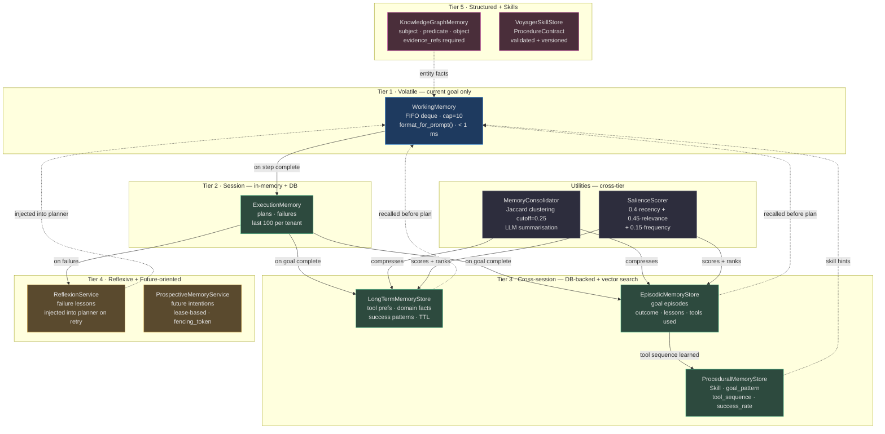
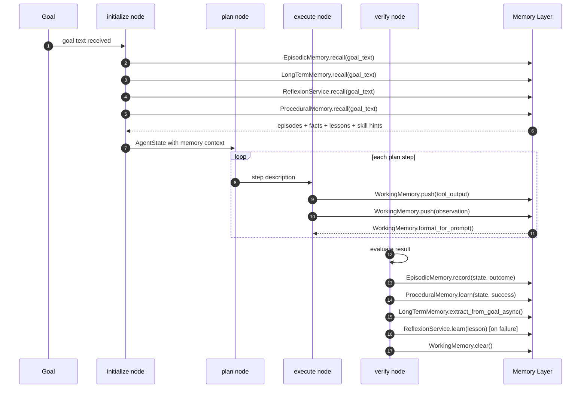
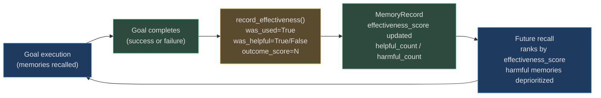
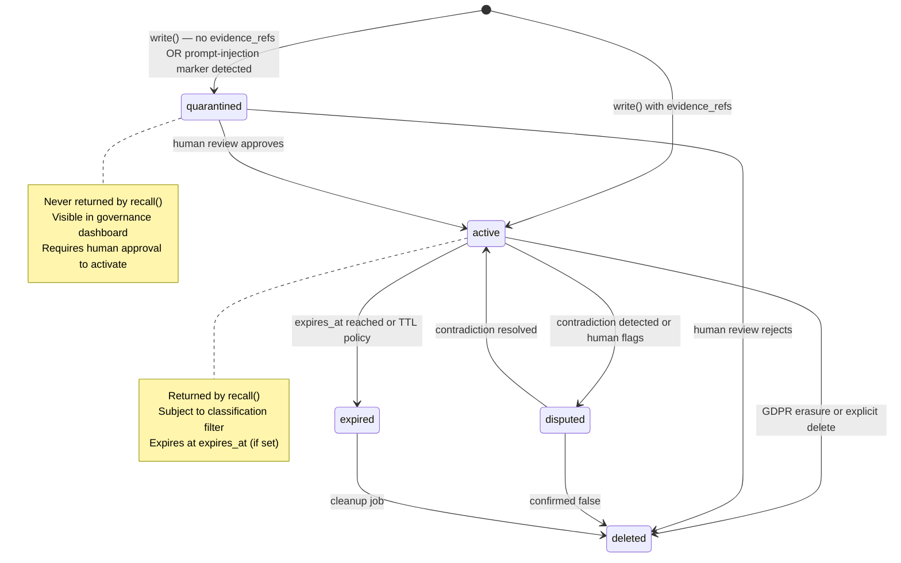

# Agent Memories

> **The defining capability of an autonomous agent is not what it knows at deployment — it's what it *learns and remembers* across millions of goal executions.**

AgentVerse implements **11 distinct memory types** organized across five cognitive tiers. This multi-tier architecture is directly modeled on cognitive science: just as humans maintain working memory (what you're holding right now), episodic memory (what you did last Tuesday), procedural memory (how to ride a bike), and long-term semantic memory (capital of France), AgentVerse agents maintain analogous stores that persist across goals, sessions, and restarts.

Without memory, every goal starts from zero. With a well-tuned memory system, a customer support agent remembers that Acme Corp always prefers formal language; a code review agent has learned that PRs exceeding 500 lines always need an extra verification step; and a financial agent tracks the future intention to alert the user when AAPL hits $200.

---

## The 11 Memory Types

| Memory Type | Class | Tier | Scope | Persistent | Latency | Source |
|---|---|:---:|---|:---:|---|---|
| **Working** | `WorkingMemory` | 1 — Volatile | Goal run (in-process) | No | < 1 ms | [working_memory.py](../../app/memory/working_memory.py) |
| **Execution** | `ExecutionMemory` | 2 — Session | Tenant | Yes (DB) | 2–5 ms | [execution.py](../../app/memory/execution.py) |
| **Long-Term** | `LongTermMemoryStore` | 3 — Cross-session | Tenant | Yes (DB + vector) | 10–50 ms | [long_term.py](../../app/memory/long_term.py) |
| **Reflexion** | `ReflexionService` | 3 — Cross-session | Tenant + goal | Yes (DB) | 10–30 ms | [reflexion.py](../../app/memory/reflexion.py) |
| **Episodic** | `EpisodicMemoryStore` | 3 — Cross-session | Tenant | Yes (DB + vector) | 10–50 ms | [episodic.py](../../app/memory/episodic.py) |
| **Procedural** | `ProceduralMemoryStore` | 3 — Cross-session | Tenant | Yes (DB) | 5–15 ms | [procedural.py](../../app/memory/procedural.py) |
| **Prospective** | `ProspectiveMemoryService` | 4 — Future-oriented | Tenant + goal | Yes (DB) | 2–10 ms | [prospective.py](../../app/memory/prospective.py) |
| **Salience** | `SalienceScorer` | Utility | — | No | < 1 ms | [salience.py](../../app/memory/salience.py) |
| **Consolidation** | `MemoryConsolidator` | Utility | — | No (batch) | 50–500 ms | [consolidation.py](../../app/memory/consolidation.py) |
| **KG Memory** | `KnowledgeGraphMemory` | 5 — Structured | Tenant | Yes (in-memory + lock) | 1–5 ms | [knowledge_graph_memory.py](../../app/memory/knowledge_graph_memory.py) |
| **Voyager Skills** | `VoyagerSkillStore` | 5 — Skill library | Tenant | Yes (in-memory) | 1–3 ms | [voyager_skills.py](../../app/memory/voyager_skills.py) |

> **Classification dimension** — every canonical `MemoryRecord` carries a `classification` field: `public` | `internal` | `confidential` | `restricted`. Confidential and restricted records use encrypted content refs (`memory://encrypted/<id>`) and redacted `safe_summary` fields.

<!-- Sources: app/memory/contracts.py:1-40 -->

---

## Architecture Overview

Five tiers flow from volatile to structured. Utilities (SalienceScorer and MemoryConsolidator) operate across all tiers.



<!-- Sources: app/memory/working_memory.py:22-33, app/memory/execution.py:16-25, app/memory/long_term.py:29-45, app/memory/episodic.py:12-40, app/memory/procedural.py:18-55, app/memory/reflexion.py:8-25, app/memory/prospective.py:10-55, app/memory/salience.py:47-90, app/memory/consolidation.py:38-85 -->

---

## How Memory Powers the Agent Loop

The agent loop (defined in `app/agent/graph.py`) is a LangGraph StateGraph with five nodes:

```
START → initialize → rag_retrieval → plan → execute → verify →
        (complete → END | replan → plan | max_iter → END | waiting_human → END)
```

Memory is injected and written at precise lifecycle events:



<!-- Sources: app/agent/graph.py:1-80, app/memory/execution.py:88-115, app/memory/episodic.py:48-90 -->

---

## Navigation Guide

| Your question | Go to |
|---|---|
| What are all the memory types and how do they differ? | [01-memory-types-deep-dive.md](./01-memory-types-deep-dive.md) |
| How does SalienceScorer calculate scores? | [01-memory-types-deep-dive.md → SalienceScorer](./01-memory-types-deep-dive.md#9-saliencescorer) |
| How does tenant isolation prevent data leakage? | [02-memory-scoping.md](./02-memory-scoping.md) |
| How are memories written and recalled step-by-step? | [03-memory-write-and-recall-flows.md](./03-memory-write-and-recall-flows.md) |
| How does memory injection into planner prompts work? | [03-memory-write-and-recall-flows.md → Prompt Injection](./03-memory-write-and-recall-flows.md#prompt-injection) |
| How is PII prevented from being stored in memory? | [04-memory-safety-and-retention.md](./04-memory-safety-and-retention.md) |
| How do I delete a user's memory for GDPR compliance? | [04-memory-safety-and-retention.md → Right to Forget](./04-memory-safety-and-retention.md#right-to-forget) |
| How does the memory system scale to 1M goals/day? | [05-scalability-and-performance.md](./05-scalability-and-performance.md) |
| What is the latency per memory tier? | [05-scalability-and-performance.md → Benchmarks](./05-scalability-and-performance.md#benchmarks) |

---

## Quick Decision Guide: Which Memory to Use?

```
Is it only needed during THIS goal execution?
├── YES → WorkingMemory (push after every tool call)
└── NO
    ├── Is it a FUTURE intention to act at a trigger?
    │   └── YES → ProspectiveMemoryService
    └── Is it about WHAT HAPPENED in a past goal?
        ├── YES → EpisodicMemoryStore (episodes with outcome + lessons)
        └── Is it HOW TO DO something (tool sequence)?
            ├── YES → ProceduralMemoryStore (Skill with success_rate)
            └── Is it a FAILURE LESSON for the planner?
                ├── YES → ReflexionService (injected on replan)
                └── Is it a STRUCTURED FACT with subject/predicate/object?
                    ├── YES → KnowledgeGraphMemory (evidence_refs required)
                    └── Is it a VALIDATED, VERSIONED skill contract?
                        ├── YES → VoyagerSkillStore (ProcedureContract)
                        └── General cross-session learning?
                            └── LongTermMemoryStore
```

---

## Integration Summary

| System | Integration Point | Direction |
|---|---|---|
| **RAG / KnowledgeStore** | Retrieved chunks pushed into `WorkingMemory` during `rag_retrieval` node | RAG → WM |
| **Knowledge Graph** | `KnowledgeGraphMemory.query()` facts injected into planner context | KG → Plan |
| **Governance / Audit** | Every `MemoryRecord` write/recall logged to `AuditLog` as structured events | Mem → Audit |
| **Guardrails v2** | Repository quarantines records matching prompt-injection markers | Guard → Repo |
| **Prompt Builder** | `WorkingMemory.format_for_prompt()` and recalled memories assembled into executor messages | Mem → Prompt |
| **Celery** | `MemoryConsolidator` runs as a periodic Celery task to compress episodic + long-term stores | Celery → MC |
| **LangGraph Checkpointer** | `MemorySaver` (or `AsyncRedisSaver`) persists `AgentState` including WM snapshot across replicas | LG → State |

<!-- Sources: app/agent/graph.py:45-65, app/memory/repository.py:65-80 -->

---

## The Canonical Memory Record

Every persistent memory (across `ReflexionService`, `LongTermMemoryStore`, `EpisodicMemoryStore`, `ProceduralMemoryStore`) that flows through the canonical `MemoryRepository` protocol is stored as a `MemoryRecord`:

```python
# Source: app/memory/contracts.py:25-60
class MemoryRecord(BaseModel):
    memory_id: str
    tenant_id: str
    memory_kind: MemoryKind  # "execution" | "reflexion" | "long_term" | "episodic" | ...
    content_ref: str         # "memory://{id}" or "memory://encrypted/{id}" for confidential
    safe_summary: str        # max 4,000 chars; "[REDACTED]" for confidential records
    source_goal_id: str
    source_execution_id: str
    evidence_refs: tuple[str, ...]   # ← required; empty = quarantined
    classification: Classification   # "public" | "internal" | "confidential" | "restricted"
    confidence: int          # 0–10,000 scale
    lifecycle_state: LifecycleState  # "active" | "quarantined" | "disputed" | "expired" | "deleted"
    version: int             # incremented on merge
    embedding_model: str     # "memory-embedding-v1"
    embedding_dimension: int # 1536
    embedding: tuple[float, ...] | None
    outcome_score: int       # -10,000 to 10,000 (from MemoryFeedback)
    effectiveness_score: int # -10,000 to 10,000
    recall_count: int
    helpful_count: int
    harmful_count: int
    created_at: datetime
    updated_at: datetime
    expires_at: datetime | None
    retention_policy_id: str
    idempotency_key: str
```

**Key invariants** (enforced by Pydantic validators):
- `embedding_dimension` must be exactly `1536` and `embedding_model` must be `"memory-embedding-v1"`
- `helpful_count` and `harmful_count` cannot both be non-zero on the same feedback event
- Records with empty `evidence_refs` are auto-quarantined and never returned by `recall()`

<!-- Sources: app/memory/contracts.py:25-70 -->

---

## Memory Feedback Loop

Memory quality improves over time through a feedback loop. After each goal that used recalled memories, the `ReflexionService.record_effectiveness()` method updates effectiveness scores:



`MemoryRecallHit.final_score` is computed in the repository as:
```
final_score = semantic_score × 5 + recency_score × 2 + outcome_score + effectiveness_score
```

This means memories that have historically helped agents succeed are ranked higher — and memories that led to failures are progressively demoted.

<!-- Sources: app/memory/reflexion.py:70-90, app/memory/repository.py:95-115 -->

---

## How Memory Connects to the Broader Platform

### RAG ↔ Memory Integration

The `rag_retrieval` node (in the LangGraph agent graph) retrieves chunks from the `KnowledgeStore`. These chunks are pushed into `WorkingMemory`:
```python
wm.push(rag_chunk.content, source="rag_chunk", metadata={"score": rag_chunk.score})
```
Over time, the domains and topics from successful RAG retrievals are extracted into `LongTermMemory` as `"domain_fact"` entries — so the next similar goal benefits from knowing which knowledge collections are most useful.

### Knowledge Graph ↔ Memory Integration

`KnowledgeGraphMemory` is distinct from the `KnowledgeStore` (RAG). The KG Memory stores **agent-learned structured facts** (derived from goal executions), while the KnowledgeStore holds **ingested documents** (PDFs, URLs, APIs). Both feed into `WorkingMemory` during initialization:
- KG facts: `wm.push(fact.object, source="knowledge_graph")`
- RAG chunks: `wm.push(chunk.content, source="rag_chunk")`

### Guardrails ↔ Memory Integration

The `InMemoryMemoryRepository.write()` method scans for prompt-injection markers before writing. This is a lightweight guardrail at the memory layer. Full guardrail evaluation (Guardrails v2.0) runs at the agent loop level and can prevent memories from being created at all for certain goal types.

### Governance / Audit ↔ Memory Integration

Every `MemoryRepository` write and recall generates an `AuditEvent` (see [04-memory-safety-and-retention.md](./04-memory-safety-and-retention.md)). This creates a complete audit trail: for any agent decision, you can reconstruct exactly which memories were recalled, which were used, and whether they were helpful.

---

## Memory Lifecycle States

Every canonical `MemoryRecord` moves through a well-defined lifecycle:



The `lifecycle_state` field is enforced by the `LifecycleState` literal type:
```python
# Source: app/memory/contracts.py:14
LifecycleState = Literal["active", "quarantined", "disputed", "expired", "deleted"]
```

State transitions are tracked in the audit log and require a `version` increment on the `MemoryRecord`. Optimistic concurrency control (`expected_version` parameter on `update_lifecycle()`) prevents race conditions between concurrent state transitions.

<!-- Sources: app/memory/contracts.py:14-22, app/memory/repository.py:22-28 -->

---

## Getting Started: Your First Memory-Aware Agent

Here is the minimal integration pattern for a new agent that uses the memory system:

```python
from app.memory.working_memory import WorkingMemory
from app.memory.execution import ExecutionMemory
from app.memory.long_term import LongTermMemoryStore
from app.tenancy.context import TenantContext

# 1. Initialize memory stores (wired by app.main.create_app in production)
wm = WorkingMemory(capacity=10)
execution_memory = ExecutionMemory()
lt_store = LongTermMemoryStore()

async def run_goal(goal: str, tenant_ctx: TenantContext):
    # 2. Initialize: recall from all tiers
    wm.clear()  # ← ALWAYS clear at goal start
    
    past_plans = execution_memory.recall(goal_hint=goal, tenant_ctx=tenant_ctx)
    lt_memories = lt_store.recall(query=goal, tenant_ctx=tenant_ctx, top_k=5)
    
    for m in lt_memories:
        wm.push(m.content, source="long_term")
    
    # 3. Execute with memory context
    context = wm.format_for_prompt(max_chars=400)
    # ... call LLM with context ...
    
    # 4. Write on completion
    await execution_memory.record_async(
        goal=goal, plan=["step1", "step2"], success=True,
        tenant_id=tenant_ctx.tenant_id, db=None,
    )
    lt_store.extract_from_goal(
        goal=goal, result="success", goal_id="goal-id", tenant_ctx=tenant_ctx
    )
    
    wm.clear()  # ← ALWAYS clear at goal end
```

---

## File Map

```
docs/wiki/agent-memories/
├── README.md                          ← You are here (overview + navigation)
├── 01-memory-types-deep-dive.md      ← All 11 types with code citations + RWEs
├── 02-memory-scoping.md              ← Tenant/agent/goal isolation + namespace design
├── 03-memory-write-and-recall-flows.md ← Full write/recall lifecycle with sequence diagrams
├── 04-memory-safety-and-retention.md ← PII, TTL, GDPR, quarantine, audit trail
└── 05-scalability-and-performance.md ← pgvector HNSW, Redis, Celery, capacity planning
```
