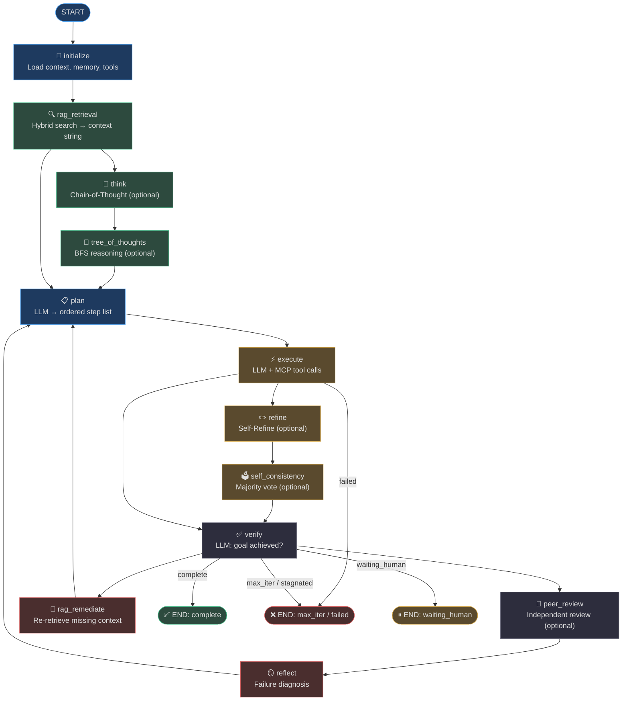
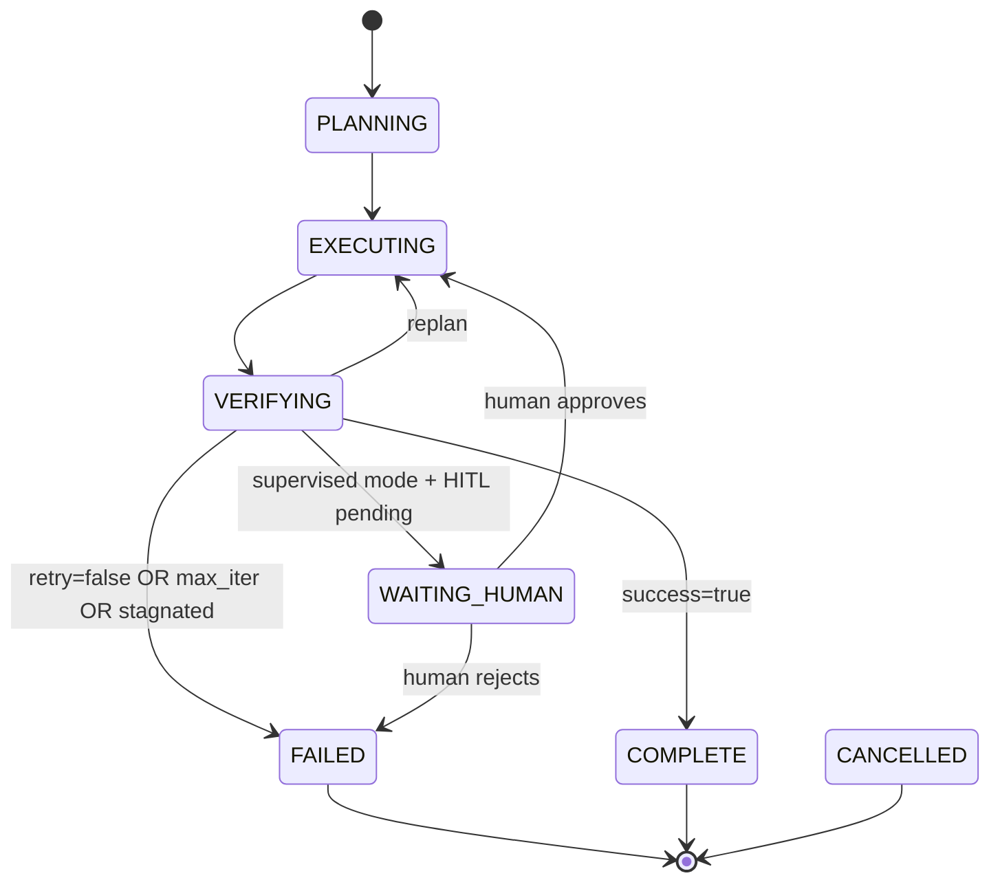
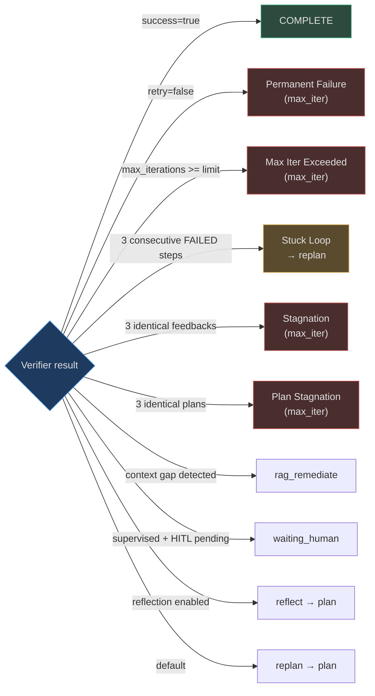
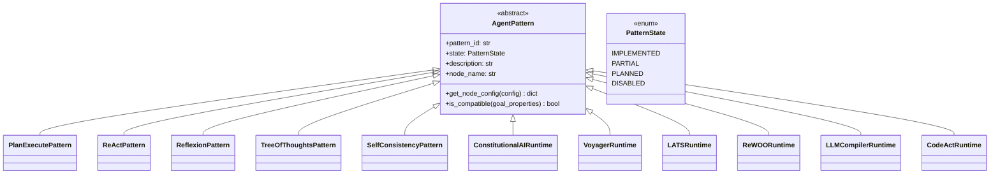
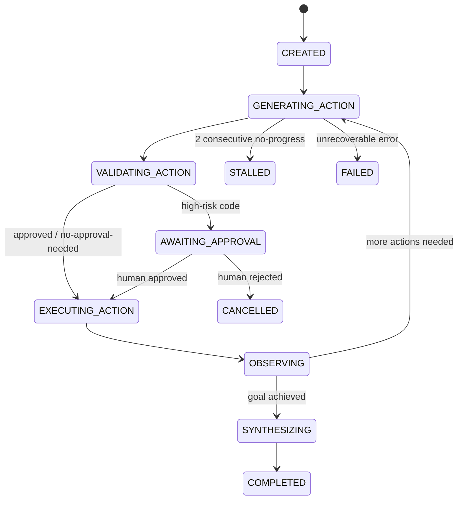
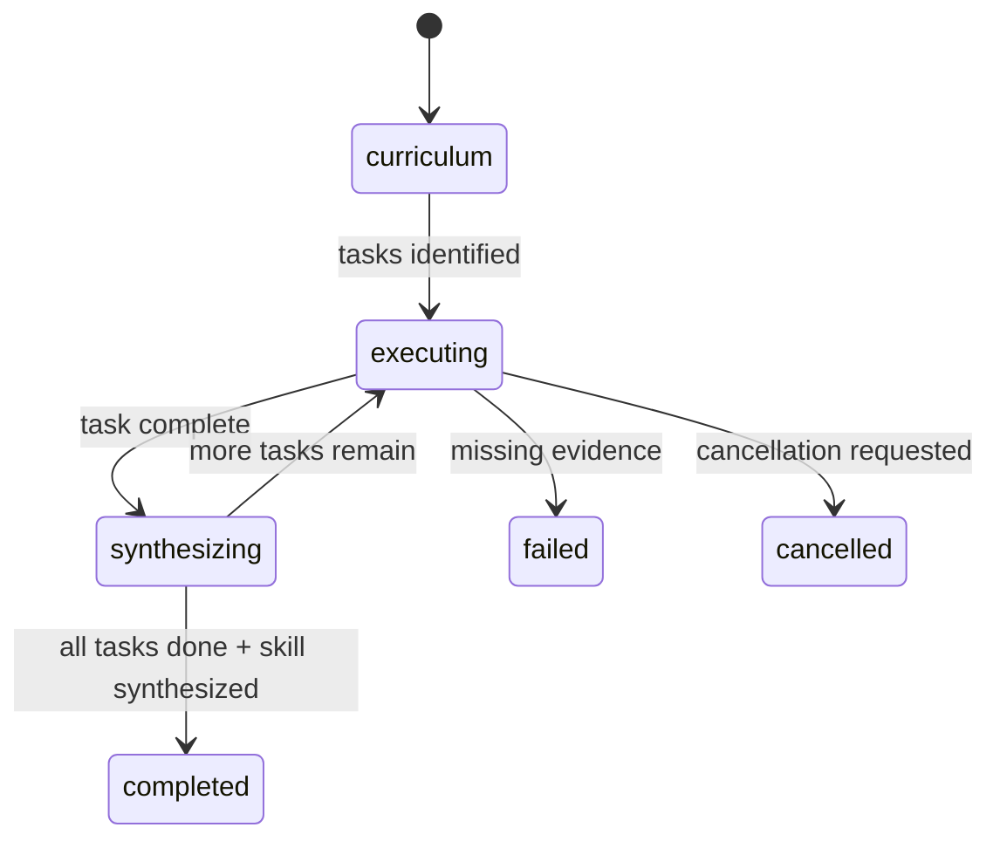
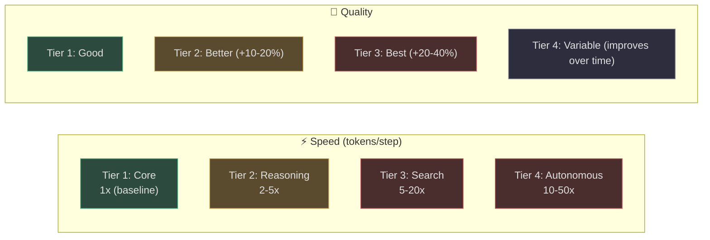

# Agent Patterns

AgentVerse implements **28 distinct agent execution patterns** — from the foundational Plan-Execute loop to exotic Language Agent Tree Search and self-improving Voyager-style skill acquisition. Every pattern is a first-class adapter with a uniform interface, selectable at goal-submission time or composed into the core execution graph.

This page covers:
- The **AgentGraph** runtime that all patterns run inside
- The **state machine lifecycle** — nodes, routing, stuck-loop detection
- **All 28 patterns** with What / Why / How / When structure
- A **pattern selection decision table** for quick lookup
- **Performance characteristics** across speed, quality, and token cost tiers

---

## 1. The AgentGraph Runtime

Every goal in AgentVerse is executed by an instance of [`AgentGraph`](https://github.com/harsh786/agent-verse/blob/main/agent-verse-backend/app/agent/graph.py#L188) — a LangGraph `StateGraph` that wires 12 async node functions into a deterministic state machine.

### 1.1 Graph Topology


<!-- Sources: app/agent/graph.py:380-445 — _build_graph(), edge wiring -->

### 1.2 Graph State

[`GraphState`](https://github.com/harsh786/agent-verse/blob/main/agent-verse-backend/app/agent/graph.py#L120) is a `TypedDict` that flows through every node. [`AgentState`](https://github.com/harsh786/agent-verse/blob/main/agent-verse-backend/app/agent/state.py#L1) is the rich runtime object stored inside it.

```python
# Source: app/agent/state.py:65-100
@dataclass
class AgentState:
    goal: str
    tenant_ctx: TenantContext
    goal_id: str                    # UUID hex — FK to goals table
    status: GoalStatus              # PLANNING → EXECUTING → VERIFYING → ...
    iterations: int                 # current iteration count
    steps: list[StepResult]         # accumulated step history
    plan: list[str]                 # current planned steps
    context: dict[str, Any]         # RAG results, tool outputs, metadata
    verification_feedback: str      # verifier LLM last output
    verification_success: bool      # True when verifier returns success=true
    sub_goals: list[SubGoal]        # for goal-tree decomposition
    ungrounded_claims: list[str]    # Phase 3 citation tracking
    reasoning_evidence: dict        # aggregate pattern evidence
```
<!-- Source: app/agent/state.py:65-100 -->

**`GoalStatus` lifecycle:**


<!-- Source: app/agent/state.py:13-28, app/agent/graph.py:4170-4310 -->

### 1.3 The Three LLM Roles

AgentGraph maintains **three separate LLM providers** — one per role. Each provider is independently routed via [`ModelRouter`](https://github.com/harsh786/agent-verse/blob/main/agent-verse-backend/app/agent/model_router.py) so the cheapest capable model is used for each task.

| Role | Source Prompt | Default Model (Anthropic) | Task |
|---|---|---|---|
| **Planner** | [`PLANNER_SYSTEM`](https://github.com/harsh786/agent-verse/blob/main/agent-verse-backend/app/agent/prompts.py#L10) | `claude-opus-4-8` | Goal → ordered JSON step list |
| **Executor** | [`EXECUTOR_SYSTEM`](https://github.com/harsh786/agent-verse/blob/main/agent-verse-backend/app/agent/prompts.py#L22) | `claude-sonnet-4-5` | Step + context → tool call or direct answer |
| **Verifier** | [`VERIFIER_SYSTEM`](https://github.com/harsh786/agent-verse/blob/main/agent-verse-backend/app/agent/prompts.py#L41) | `claude-haiku-3-5` | All steps → `{success, reason, retry}` JSON |

<!-- Source: app/agent/prompts.py:10-90, app/agent/model_router.py:33-55 -->

### 1.4 Routing Logic and Safety Mechanisms

[`_route()`](https://github.com/harsh786/agent-verse/blob/main/agent-verse-backend/app/agent/graph.py#L4170) is the conditional edge function that runs after every verification:


<!-- Source: app/agent/graph.py:4170-4310 — _route() implementation -->

**`_check_stuck_loop()`** ([line 4475](https://github.com/harsh786/agent-verse/blob/main/agent-verse-backend/app/agent/graph.py#L4475)):
```python
def _check_stuck_loop(self, state: AgentState, window: int = 3) -> bool:
    recent = [s for s in state.steps if hasattr(s, "status")][-window:]
    if len(recent) < window:
        return False
    return all(getattr(s, "status", None) == StepStatus.FAILED for s in recent)
```
Returns `True` when the last 3 steps all have `FAILED` status → triggers early replan rather than burning the remaining iteration budget.

### 1.5 Checkpointing and Resume

Every state transition is persisted via LangGraph's checkpointer:
- **Production**: `AsyncRedisSaver` — survives process restarts, enables cross-replica resume
- **Fallback**: `RedisSaver` (sync) → `MemorySaver` (in-process)
- After each successful step, [`_write_checkpoint()`](https://github.com/harsh786/agent-verse/blob/main/agent-verse-backend/app/agent/graph.py#L4498) writes a `GoalCheckpoint` row to Postgres
- On `run()`, the loop attempts to restore from checkpoint before invoking the graph

### 1.6 AgentRouter

When a goal is submitted without an `agent_id`, [`AgentRouter`](https://github.com/harsh786/agent-verse/blob/main/agent-verse-backend/app/agent/router.py#L42) auto-selects the best-fit registered agent using a **weighted composite score**:

| Signal | Weight | Method |
|---|---|---|
| Keyword overlap (Jaccard) | 40% | Goal tokens vs. agent name + `goal_template` |
| Connector match | 40% | Goal text vs. registered connector IDs |
| History success rate | 20% | Past eval store records (0.0 when unavailable) |

**Anti-affinity**: when the goal explicitly names a system (e.g., "Jira") and the candidate agent belongs to a *different* system (e.g., GitHub), the keyword score is zeroed out. Routing decision is made only when composite score ≥ 0.3.

---

## 2. Pattern Architecture

All patterns live under [`app/agent/patterns/`](https://github.com/harsh786/agent-verse/blob/main/agent-verse-backend/app/agent/patterns/) and inherit from [`AgentPattern`](https://github.com/harsh786/agent-verse/blob/main/agent-verse-backend/app/agent/patterns/base.py):


<!-- Source: app/agent/patterns/base.py, patterns/*.py -->

---

## 3. All 28 Patterns

### 3.1 Tier 1: Core Execution Patterns

These patterns are always active — they define the fundamental execution model and cannot be disabled.

---

#### Plan-Execute
**File**: [`app/agent/patterns/plan_execute.py`](https://github.com/harsh786/agent-verse/blob/main/agent-verse-backend/app/agent/patterns/plan_execute.py)  
**State**: `IMPLEMENTED` — wired as the `plan` node in `AgentGraph`

| | |
|---|---|
| **What** | The planner LLM generates a complete ordered step list in a single call; the executor LLM runs each step sequentially, one step per LLM call. |
| **Why** | Separates strategic thinking (planning) from tactical execution. The planner can reason about the whole goal before committing to any action. |
| **How** | `PLANNER_SYSTEM` prompt instructs the LLM to respond with strict JSON: `{"steps": ["Step 1: ...", "Step 2: ..."]}`. Each step is then dispatched to the execute node independently. |
| **When** | All goals. Plan-Execute is the default execution model for every goal. Other patterns are layered on top of or within it. |

**Prompt excerpt**:
```
PLANNER_SYSTEM: "Given a goal, break it into a minimal ordered list of steps.
Respond ONLY with valid JSON: {"steps": ["Step 1: ...", ...]}"
```
<!-- Source: app/agent/prompts.py:10-18 -->

---

#### ReAct (Reason + Act)
**File**: [`app/agent/patterns/react.py`](https://github.com/harsh786/agent-verse/blob/main/agent-verse-backend/app/agent/patterns/react.py)  
**State**: `IMPLEMENTED` — wired as the `execute` node

| | |
|---|---|
| **What** | Within each step execution, the executor LLM performs a Thought→Action→Observation loop: reason about what to do, call a tool, observe the result, repeat if needed. |
| **Why** | Interleaving reasoning with acting allows the agent to adapt to unexpected tool outputs mid-step rather than being locked into a pre-planned action sequence. |
| **How** | `EXECUTOR_SYSTEM` strictly enforces grounding rules: never fabricate values, never invent tool names. If uncertain, respond `{"tool": null, "result": "INSUFFICIENT DATA: ..."}`. |
| **When** | All goals requiring tool use. ReAct is the execution model active inside every `execute` node invocation. |

<!-- Source: app/agent/patterns/react.py, app/agent/prompts.py:22-38 -->

---

#### Reflection
**File**: [`app/agent/graph.py`](https://github.com/harsh786/agent-verse/blob/main/agent-verse-backend/app/agent/graph.py) — `_node_reflect()`  
**Config flag**: `enable_reflection=True`

| | |
|---|---|
| **What** | After a verification failure, a dedicated reflection node uses `REFLECTION_SYSTEM` to diagnose what went wrong and produce a revised plan prompt. |
| **Why** | Without structured reflection, the planner re-generates the same (or similar) plan. Reflection injects a diagnosis into the next planning call, breaking the failure loop. |
| **How** | `_node_reflect()` collects failed step outputs, passes them to the reflection LLM, and writes the diagnosis into `agent_state.context["reflection_summary"]`. The `reflect → plan` edge means the next planning call receives this context. |
| **When** | Goals that fail on the first plan and have room for recovery (intermediate complexity). Enable via `enable_reflection=True` in `AgentGraph.__init__`. |

<!-- Source: app/agent/graph.py:1037-1060, app/agent/prompts.py:104 -->

---

#### Loop Engineering
**File**: [`app/agent/patterns/loop_engineering.py`](https://github.com/harsh786/agent-verse/blob/main/agent-verse-backend/app/agent/patterns/loop_engineering.py)  
**State**: `IMPLEMENTED` — wired as `_execute_step_with_loop`

| | |
|---|---|
| **What** | Configurable retry loop wrapping each step execution: adaptive retry count, exponential backoff, configurable `loop_until` conditions. |
| **Why** | Transient tool failures (network timeouts, rate limits) shouldn't fail the whole goal. Loop Engineering absorbs transient errors before surfacing them to the verifier. |
| **How** | Wraps individual step execution with bounded retry logic; records retry count and final status in `StepResult`. |
| **When** | All goals — Loop Engineering is always active at the step-execution level. |

<!-- Source: app/agent/patterns/loop_engineering.py:1-25 -->

---

### 3.2 Tier 2: Reasoning Enhancement Patterns

These patterns add **reasoning quality** at the cost of additional LLM calls. They are layered into the graph as optional nodes.

---

#### Chain-of-Thought (CoT)
**File**: [`app/agent/graph.py`](https://github.com/harsh786/agent-verse/blob/main/agent-verse-backend/app/agent/graph.py) — `_node_think()`  
**Config flag**: `enable_cot=True`  
**Prompt**: [`CHAIN_OF_THOUGHT_SYSTEM`](https://github.com/harsh786/agent-verse/blob/main/agent-verse-backend/app/agent/prompts.py#L89)

| | |
|---|---|
| **What** | Before planning, a `think` node runs the Chain-of-Thought prompt to explicitly reason about intent, relevant tools, risks, and approach. |
| **Why** | Forces the planner to articulate its reasoning before committing to a plan, which measurably reduces planning errors on complex goals (Wei et al. 2022). |
| **How** | `CHAIN_OF_THOUGHT_SYSTEM` structures the output as: `INTENT / RELEVANT TOOLS / RISKS / APPROACH`. This structured output is prepended to the planning context. |
| **When** | Complex multi-domain goals where plan quality matters more than latency. Use for goals requiring cross-system coordination. |

**Graph position**: `rag_retrieval → think → plan`

<!-- Source: app/agent/graph.py:394-403, app/agent/prompts.py:89-101 -->

---

#### Self-Consistency
**File**: [`app/agent/patterns/self_consistency.py`](https://github.com/harsh786/agent-verse/blob/main/agent-verse-backend/app/agent/patterns/self_consistency.py)  
**Config flag**: `enable_self_consistency=True`

| | |
|---|---|
| **What** | Samples N completion paths (default: 3) at temperature > 0, then returns the most common response by normalized text comparison. |
| **Why** | Wang et al. 2022 showed that sampling K reasoning paths and taking majority vote improves accuracy 10-20% on complex reasoning tasks versus greedy decoding. |
| **How** | `SelfConsistencyPattern.execute()` fires N parallel async calls to the LLM at `temperature=0.7`. `_most_common()` normalizes and counts responses, returning the most frequent original (un-normalized) version. |
| **When** | Mathematical reasoning, logical deduction, code generation where correctness matters more than speed. Costs ~3× the tokens of a single execution. |

**Graph position**: `execute → self_consistency → verify`

<!-- Source: app/agent/patterns/self_consistency.py:1-100 -->

---

#### Tree of Thoughts (ToT)
**File**: [`app/agent/patterns/tree_of_thoughts.py`](https://github.com/harsh786/agent-verse/blob/main/agent-verse-backend/app/agent/patterns/tree_of_thoughts.py)  
**Config flag**: `enable_tree_of_thoughts=True`

| | |
|---|---|
| **What** | BFS over a tree of reasoning steps. Generates N candidate thoughts per level, evaluates each (score 0–1), keeps top-K, expands the best thought to the next level. |
| **Why** | Yao et al. 2023 demonstrated that deliberate search over a reasoning tree significantly outperforms linear Chain-of-Thought on tasks requiring lookahead (e.g., game of 24, creative writing with constraints). |
| **How** | `TreeOfThoughtsPattern` uses three LLM prompts: `_GENERATE_SYSTEM` (produce a reasoning approach), `_EVALUATE_SYSTEM` (score 0–1 with JSON `{score, promising, reason}`), `_EXPAND_SYSTEM` (expand best path to solution). Configurable: `n_thoughts=3`, `max_depth=2`, `beam_width=2`. |
| **When** | Multi-step problems requiring lookahead: puzzle solving, complex debugging, strategy planning. High token cost (O(N × depth × beam) LLM calls). |

**Graph position**: `rag_retrieval → tree_of_thoughts → plan` (or `think → tree_of_thoughts → plan`)

<!-- Source: app/agent/patterns/tree_of_thoughts.py:1-100 -->

---

#### Few-Shot Chain-of-Thought
**File**: [`app/agent/patterns/few_shot_cot.py`](https://github.com/harsh786/agent-verse/blob/main/agent-verse-backend/app/agent/patterns/few_shot_cot.py)

| | |
|---|---|
| **What** | Dynamically retrieves similar solved examples from a `ReasoningExampleSource`, then constructs a few-shot prompt with those examples before the main reasoning call. |
| **Why** | Dynamically-retrieved few-shot examples outperform fixed examples because they are contextually similar to the current goal, providing the model with relevant precedents. |
| **How** | `FewShotCoTRuntime` queries `ReasoningExampleSource` for semantically similar examples, validates each against `GuardrailChecker` and `DataClassifier`, enforces token budget (max 6000 tokens), then builds a formatted few-shot prompt. |
| **When** | Domain-specific reasoning (e.g., code debugging, analysis) where a library of solved examples exists. Requires an indexed example store. |

<!-- Source: app/agent/patterns/few_shot_cot.py:1-80 -->

---

#### Graph of Thoughts (GoT)
**File**: [`app/agent/patterns/graph_of_thoughts.py`](https://github.com/harsh786/agent-verse/blob/main/agent-verse-backend/app/agent/patterns/graph_of_thoughts.py)

| | |
|---|---|
| **What** | DAG of reasoning: unlike Tree of Thoughts where branches can only diverge, Graph of Thoughts allows thoughts to **merge** (multiple inputs → one output) and **branch** (one input → multiple outputs). |
| **Why** | Some reasoning tasks benefit from synthesizing multiple parallel chains into a unified conclusion — e.g., comparing two analyses, aggregating evidence from different sources. |
| **How** | `GraphOfThoughtsRuntime` maintains `ThoughtNodeState` and `ThoughtEdgeState` collections. `select_frontier()` picks high-scoring, non-pruned nodes (score ≥ 0.55). Up to `max_rounds=6` rounds of generate → evaluate → synthesize. |
| **When** | Tasks requiring synthesis of multiple reasoning chains: comparative analysis, multi-source evidence aggregation, cross-domain problem solving. |

<!-- Source: app/agent/patterns/graph_of_thoughts.py:1-100 -->

---

#### Self-Refine
**File**: [`app/agent/graph.py`](https://github.com/harsh786/agent-verse/blob/main/agent-verse-backend/app/agent/graph.py) — `_node_refine()`  
**Config flag**: `enable_self_refine=True`

| | |
|---|---|
| **What** | After execution, before verification: the agent critiques its own output and generates a revised version. Up to N refinement rounds before passing to the verifier. |
| **Why** | Madaan et al. 2023 showed that iterative self-refinement improves output quality significantly on code generation, dialogue, and math. Each refinement round fixes specific identified issues. |
| **How** | `_node_refine()` fires after `execute`. The LLM receives the current output and a self-critique prompt, produces a refined output. Graph edge: `execute → refine → verify` (or `→ self_consistency → verify`). |
| **When** | Code generation, essay writing, complex responses where iterative improvement is feasible. Adds 1-3 LLM calls per step. |

<!-- Source: app/agent/graph.py:382-390 -->

---

#### Peer Review
**File**: [`app/agent/patterns/peer_review.py`](https://github.com/harsh786/agent-verse/blob/main/agent-verse-backend/app/agent/patterns/peer_review.py)  
**Config flag**: `enable_peer_review=True`

| | |
|---|---|
| **What** | After verification, before routing: a separate LLM reviewer evaluates the output for accuracy, completeness, and quality (score 0.0–1.0). Only approved outputs (score ≥ 0.7) route to completion. |
| **Why** | The verifier confirms goal achievement; peer review adds an orthogonal quality dimension — checking whether the *output* (not just the goal completion) meets quality standards. |
| **How** | `PeerReviewPattern` uses `_PEER_REVIEW_SYSTEM` to produce `{quality_score, critique, suggestions, approved}`. If `approved=false`, the result routes to `replan` rather than `complete`. |
| **When** | Customer-facing outputs, reports, code that will be deployed. Adds one LLM call per verification pass. |

**Graph position**: `verify → peer_review → [complete / replan]`

<!-- Source: app/agent/patterns/peer_review.py:1-80 -->

---

#### Constitutional AI
**File**: [`app/agent/patterns/constitutional_ai.py`](https://github.com/harsh786/agent-verse/blob/main/agent-verse-backend/app/agent/patterns/constitutional_ai.py)

| | |
|---|---|
| **What** | Critique→Revise loop: the LLM critiques its output against a set of constitutional principles (safety rules, style guidelines, factual accuracy policies), then revises accordingly. |
| **Why** | Anthropic's Constitutional AI approach (Bai et al. 2022) enforces nuanced, multi-dimensional constraints that are impractical to express in a single prompt. |
| **How** | `ConstitutionalAIRuntime.revise()` runs two LLM calls: `critique(original, principles)` → `revision(original, critique, principles)`. Enforced through `RuntimeEnforcer.is_capability_allowed()`. Returns `ConstitutionalResult` with all three texts. |
| **When** | Safety-critical outputs, compliance domains (legal, medical, financial), content moderation pipelines. |

<!-- Source: app/agent/patterns/constitutional_ai.py:1-70 -->

---

#### Reflexion
**File**: [`app/agent/patterns/reflexion.py`](https://github.com/harsh786/agent-verse/blob/main/agent-verse-backend/app/agent/patterns/reflexion.py)

| | |
|---|---|
| **What** | **Persistent verbal RL**: after each goal failure, extract a natural-language lesson and store it in `ReflexionStore`. At the next run's planning time, recall relevant lessons and inject them into the planning context. |
| **Why** | Shinn et al. 2023 showed that storing verbal reflections (not gradient updates) allows LLMs to improve across episodes — avoiding the same mistakes on future similar goals. |
| **How** | `ReflexionPattern.store_lesson()` writes `f"For goal '{goal[:60]}': {feedback[:200]}"` to a Postgres-backed `ReflexionStore`. At planning time, `recall_lessons()` retrieves the top-K relevant lessons and prepends them to the planner context. |
| **When** | Agents that run the same class of goals repeatedly (e.g., a Jira agent that repeatedly fails at certain query patterns). Lessons accumulate over time. |

<!-- Source: app/agent/patterns/reflexion.py:1-90 -->

---

### 3.3 Tier 3: Search and Planning Patterns

These patterns replace or augment the planning phase with sophisticated **search algorithms**.

---

#### Language Agent Tree Search (LATS)
**File**: [`app/agent/patterns/lats.py`](https://github.com/harsh786/agent-verse/blob/main/agent-verse-backend/app/agent/patterns/lats.py)

| | |
|---|---|
| **What** | Monte Carlo Tree Search (MCTS) applied to LLM reasoning. Uses UCT (Upper Confidence bound for Trees) to balance exploration vs. exploitation across candidate reasoning paths. |
| **Why** | Zhou et al. 2023 LATS paper demonstrated that tree-search with environment feedback significantly outperforms flat approaches on HumanEval (94.4% vs. 85.4%). Enables deep exploration when simple replanning fails. |
| **How** | `LATSRuntime.select_child()` picks the highest UCT-scored child: `UCT = mean + √(2 × log(parent_visits) / child_visits)`. `backpropagate()` propagates rewards up the tree on terminal nodes. `execute()` runs the full MCTS loop. |
| **When** | Hard reasoning tasks, software debugging, multi-step mathematical problems where the search space is large and first-attempt success is unlikely. |

**UCT Score formula**:
$$\text{UCT}(c) = \frac{v_c}{n_c} + C\sqrt{\frac{\ln n_p}{n_c}}$$

Where $C = \sqrt{2} \approx 1.414$ (`UCT_EXPLORATION` constant).

<!-- Source: app/agent/patterns/lats.py:1-100 — LATSRuntime, UCT_EXPLORATION=1.41421 -->

---

#### ReWOO (Reasoning WithOut Observations)
**File**: [`app/agent/patterns/rewoo.py`](https://github.com/harsh786/agent-verse/blob/main/agent-verse-backend/app/agent/patterns/rewoo.py)

| | |
|---|---|
| **What** | Plans the **complete tool-call sequence upfront** (before executing any tool), using `${variable}` references to pass outputs between steps, then executes all steps in topological order. |
| **Why** | Xu et al. 2023: decoupling planning from execution allows the planner to reason about the *whole* sequence without being distracted by intermediate observations, and enables parallel execution. |
| **How** | `ReWOORuntime.freeze_plan()` validates a `ToolPlanStep` tuple and hashes it for integrity. `validate_variables()` verifies all `${var}` references are produced by ancestor steps (no forward references). `_resolve()` substitutes actual tool outputs at runtime. |
| **When** | Goals with predictable, multi-step tool sequences where the plan is known upfront (e.g., data pipeline tasks, report generation). Reduces latency by batch-executing steps. |

<!-- Source: app/agent/patterns/rewoo.py:1-100 -->

---

#### LLM Compiler
**File**: [`app/agent/patterns/llm_compiler.py`](https://github.com/harsh786/agent-verse/blob/main/agent-verse-backend/app/agent/patterns/llm_compiler.py)

| | |
|---|---|
| **What** | Compiles a task DAG from the plan, analyzes data dependencies, and executes **independent tasks concurrently** using `StructuredPlanExecutor`. |
| **Why** | Kim et al. 2023: parallelizing independent sub-tasks can reduce wall-clock time by 3-5× on multi-step workflows. The compiler determines which tasks have no unmet dependencies and can run simultaneously. |
| **How** | `LLMCompilerRuntime._validate_schema()` type-checks tool arguments against `tool_catalogue`. `StructuredPlanExecutor` handles the concurrent dispatch with proper dependency ordering. Validates `CompiledTask` items before execution. |
| **When** | Complex multi-step goals with independent sub-tasks (e.g., "search GitHub + check Jira + query Slack simultaneously"). Requires structured plan format. |

<!-- Source: app/agent/patterns/llm_compiler.py:1-100 -->

---

#### Least-to-Most
**File**: [`app/agent/patterns/least_to_most.py`](https://github.com/harsh786/agent-verse/blob/main/agent-verse-backend/app/agent/patterns/least_to_most.py)

| | |
|---|---|
| **What** | Progressive decomposition: solve the simplest sub-problem first, use that answer to solve the next harder sub-problem, continuing until the original goal is answered. |
| **Why** | Zhou et al. 2022 showed this recursive scaffolding outperforms CoT on compositional generalization tasks — each sub-answer provides grounding for the next. |
| **How** | Goal is decomposed into an ordered list from simplest to most complex. Each step receives the **answers from all previous steps** as additional context. |
| **When** | Goals with clear compositional structure: multi-step math, tiered data analysis, progressive report generation. |

<!-- Source: app/agent/patterns/least_to_most.py -->

---

### 3.4 Tier 4: Autonomous Agent Patterns

These patterns implement **full autonomy** — recursive self-direction, persistent memory, and skill acquisition.

---

#### AutoGPT
**File**: [`app/agent/patterns/autogpt.py`](https://github.com/harsh786/agent-verse/blob/main/agent-verse-backend/app/agent/patterns/autogpt.py)

| | |
|---|---|
| **What** | Autonomous task decomposition with self-prompting: the agent generates its own next prompt based on its current state, memory, and remaining goal. |
| **Why** | Eliminates the need for a human-provided task breakdown. The agent maintains a persistent memory of past actions and uses it to inform future decisions. |
| **How** | Self-prompting loop that combines long-term memory retrieval, task list management, and next-action generation into a single iterative cycle. |
| **When** | Open-ended research goals, long-horizon tasks without a clear step-by-step path. High autonomy — use with appropriate guardrails. |

---

#### BabyAGI
**File**: [`app/agent/patterns/babyagi.py`](https://github.com/harsh786/agent-verse/blob/main/agent-verse-backend/app/agent/patterns/babyagi.py)

| | |
|---|---|
| **What** | Task-driven architecture with a **persistent task queue**: execute task → create new tasks based on result → prioritize queue → repeat. |
| **Why** | Nakajima 2023: separating task creation, prioritization, and execution allows the agent to dynamically adapt its work queue based on what it learns during execution. |
| **How** | Three specialized LLM calls per cycle: execution agent (do the task), task creation agent (generate next tasks from result), prioritization agent (re-order the queue by relevance to the goal). |
| **When** | Long-running background research tasks, iterative refinement workflows where the next steps emerge from current results. |

---

#### CodeAct
**File**: [`app/agent/patterns/codeact.py`](https://github.com/harsh786/agent-verse/blob/main/agent-verse-backend/app/agent/patterns/codeact.py)

| | |
|---|---|
| **What** | Python code is the **primary action space**: generate Python → validate → (optionally) await approval → execute in sandbox → observe output → repeat. |
| **Why** | Wang et al. 2024: using code as actions provides a unified, expressive action language that outperforms API-based tool calling on complex data manipulation and computation tasks. |
| **How** | `CodeActRuntime` goes through phases: `GENERATING_ACTION → VALIDATING_ACTION → AWAITING_APPROVAL → EXECUTING_ACTION → OBSERVING → SYNTHESIZING`. `CodeWorkloadValidator` validates each generated code snippet before execution. SHA-256 integrity check on code + observation. Up to 8 actions per episode (`max_actions`). |
| **When** | Data analysis, file manipulation, API calls requiring dynamic construction, mathematical computation. Runs in a sandboxed execution environment. |

**Phase state machine**:

<!-- Source: app/agent/patterns/codeact.py:23-64, CodeActPhase enum -->

---

#### Voyager
**File**: [`app/agent/patterns/voyager.py`](https://github.com/harsh786/agent-verse/blob/main/agent-verse-backend/app/agent/patterns/voyager.py)

| | |
|---|---|
| **What** | **Skill acquisition**: identifies capability gaps, runs tasks to fill those gaps, synthesizes reusable skills that are stored in a skill library for future reuse. |
| **Why** | Wang et al. 2023 (Minecraft): an agent that accumulates and reuses skills grows its capability monotonically, solving increasingly complex tasks without human intervention. |
| **How** | `VoyagerRuntime.execute()` iterates through `capability_gaps` (sorted, deduplicated), calls `run_task` for each, and on success calls `synthesize_skill` to store a reusable `ProcedureContract`. Supports graceful cancellation via `asyncio.Event`. Resumes from `VoyagerState` checkpoint on restart. |
| **When** | Long-running agents that benefit from accumulated skills: DevOps automation, research assistants, codebase exploration agents. |

**Voyager state lifecycle**:

<!-- Source: app/agent/patterns/voyager.py:1-80 -->

---

### 3.5 Tier 5: Structured Reasoning Patterns

---

#### Program of Thought
**File**: [`app/agent/patterns/program_of_thought.py`](https://github.com/harsh786/agent-verse/blob/main/agent-verse-backend/app/agent/patterns/program_of_thought.py)

| | |
|---|---|
| **What** | Generate a structured program (Python or pseudo-code) that represents the reasoning process, then execute it to produce the answer. |
| **Why** | Chen et al. 2022: decoupling reasoning (program generation) from computation (program execution) allows each component to do what it does best — LLMs reason, interpreters compute precisely. |
| **How** | LLM generates a Python snippet encoding the reasoning; the snippet is executed in the sandbox; the output is the answer. Particularly powerful for math, data analysis, and logic puzzles. |
| **When** | Mathematical word problems, data transformation tasks, logical deduction chains where computation is complex. |

---

#### Structured Planner
**File**: [`app/agent/prompts.py`](https://github.com/harsh786/agent-verse/blob/main/agent-verse-backend/app/agent/prompts.py#L66) — `STRUCTURED_PLANNER_SYSTEM`

| | |
|---|---|
| **What** | Enhanced planning mode: each step includes `id`, `description`, `tool`, `arguments`, `depends_on`, `risk` (`read`/`write_low`/`write_high`/`destructive`), and `expected_output`. |
| **Why** | Richer plan structure enables dependency-aware parallel execution, risk classification for HITL routing, and idempotency checking. |
| **How** | `STRUCTURED_PLANNER_SYSTEM` outputs strict JSON with full step metadata. `HITL` checks `risk=destructive` steps before execution. LLM Compiler uses `depends_on` for parallel dispatch. |
| **When** | Use when the goal involves destructive operations, parallel sub-tasks, or when auditability of individual steps is required. |

<!-- Source: app/agent/prompts.py:66-86 -->

---

### 3.6 Tier 6: Multi-Agent Patterns

These patterns coordinate **multiple agents** working together.

---

#### Supervisor
**File**: [`app/agent/supervisor.py`](https://github.com/harsh786/agent-verse/blob/main/agent-verse-backend/app/agent/supervisor.py)

| | |
|---|---|
| **What** | A central orchestrator LLM decides which specialist sub-agent to invoke for each sub-task, then synthesizes their outputs into a final result. |
| **Why** | Specialist agents outperform generalists on their domain. A supervisor can dynamically compose agents (Jira + Slack + GitHub) to solve complex cross-system goals. |
| **How** | `Supervisor` maintains a registry of specialist `AgentGraph` instances. For each sub-task, the supervisor LLM selects the most capable agent, invokes it, and collects the `AgentState` result. Errors from sub-agents are surfaced to the supervisor for recovery. |
| **When** | Cross-system goals that require coordinating multiple specialist agents (e.g., "Create a Jira ticket, notify on Slack, and open a GitHub issue"). |

---

#### Multi-Agent Debate
**File**: [`app/agent/debate.py`](https://github.com/harsh786/agent-verse/blob/main/agent-verse-backend/app/agent/debate.py)

| | |
|---|---|
| **What** | 2+ agents generate independent responses to the same prompt, then argue for their position; a judge agent synthesizes the strongest arguments into a final answer. |
| **Why** | Du et al. 2023: multi-agent debate significantly improves factual accuracy and reduces hallucination by forcing agents to critique and defend positions. |
| **How** | `DebateOrchestrator` runs N `AgentGraph` instances in parallel for the opening position, then a second round where each sees all other positions, then the judge synthesizes. |
| **When** | High-stakes decisions requiring validation, research analysis where multiple perspectives are valuable, fact-checking. |

---

#### Consensus
**File**: [`app/agent/patterns/consensus.py`](https://github.com/harsh786/agent-verse/blob/main/agent-verse-backend/app/agent/patterns/consensus.py)

| | |
|---|---|
| **What** | Multiple agents vote on the best plan or answer. The majority-vote answer (or highest-confidence answer above a threshold) is accepted. |
| **Why** | Reduces individual model variance. When N independent agents agree, the answer is more likely to be correct than a single agent's output. |
| **How** | N agents independently produce answers. A consensus function evaluates agreement (exact match or semantic similarity via embeddings). |
| **When** | Critical decisions where reliability > latency, fact verification, content moderation. |

---

#### Goal Trees
**File**: [`app/agent/patterns/goal_tree.py`](https://github.com/harsh786/agent-verse/blob/main/agent-verse-backend/app/agent/patterns/goal_tree.py), [`app/agent/goal_tree.py`](https://github.com/harsh786/agent-verse/blob/main/agent-verse-backend/app/agent/goal_tree.py)  
**Config flags**: `enable_goal_tree=True`, `goal_tree_threshold=4`

| | |
|---|---|
| **What** | Recursively decomposes a complex goal into a tree of sub-goals (`SubGoal` nodes with `depends_on` lists), then executes leaf goals independently (with potential parallelism), propagating results up the tree. |
| **Why** | Complex goals with ≥ 4 independent sub-tasks execute faster in parallel. Each sub-agent gets a focused, smaller goal, improving per-agent quality. |
| **How** | `GOAL_TREE_SYSTEM` prompt decides `decompose=true/false` and produces sub-goal JSON. Decomposition threshold: when the initial plan has ≥ `goal_tree_threshold` (default: 4) steps. Sub-goals with empty `depends_on` are eligible for concurrent execution. Results are merged into the parent `AgentState`. |
| **When** | Complex research goals, large code refactoring tasks, multi-system orchestration where sub-tasks are truly independent. |

**Sub-goal decomposition prompt excerpt**:
```
GOAL_TREE_SYSTEM: "Simple goals (fewer than 4 steps) must NOT be decomposed.
Each sub-goal must be a self-contained, executable task."
```
<!-- Source: app/agent/prompts.py:55-65, app/agent/patterns/goal_tree.py -->

---

### 3.7 Tier 7: Workflow Patterns

---

#### Workflow Planner + Executor
**Files**: [`app/agent/workflow_planner.py`](https://github.com/harsh786/agent-verse/blob/main/agent-verse-backend/app/agent/workflow_planner.py), [`app/agent/workflow_executor.py`](https://github.com/harsh786/agent-verse/blob/main/agent-verse-backend/app/agent/workflow_executor.py)

| | |
|---|---|
| **What** | Static, deterministic workflow execution: pre-defined step sequences with conditional branching, parallel execution blocks, and human-in-the-loop checkpoints. No LLM replanning. |
| **Why** | Audit-critical processes (compliance, billing, provisioning) require reproducible, traceable execution paths. LLM-based replanning introduces non-determinism that is unacceptable in these domains. |
| **How** | `WorkflowPlanner` compiles a YAML/JSON workflow definition into an execution graph. `WorkflowExecutor` runs it step-by-step with transactional semantics (rollback on failure). |
| **When** | Regulated workflows, CI/CD pipelines, multi-step provisioning processes where every step must be auditable and reproducible. |

---

## 4. Pattern Selection Guide

### 4.1 Decision Table by Goal Properties

| Goal Complexity | Domain | Primary Concern | Recommended Pattern |
|---|---|---|---|
| Simple (1-3 steps) | Any | Speed | **Plan-Execute + ReAct** |
| Medium (4-8 steps) | Any | Reliability | **Plan-Execute + Reflection** |
| Complex (8+ steps) | Multi-system | Coordination | **Goal Trees + Supervisor** |
| Complex | Math/Logic | Accuracy | **Self-Consistency + Tree of Thoughts** |
| Complex | Code generation | Correctness | **CodeAct + Self-Refine** |
| Long-horizon | Research | Autonomy | **AutoGPT or BabyAGI** |
| Repeated class | Any | Learning | **Reflexion** |
| Safety-critical | Legal/Medical | Compliance | **Constitutional AI + Peer Review** |
| Predictable steps | Data pipeline | Latency | **ReWOO + LLM Compiler** |
| Hard search | Puzzle/Math | Quality | **LATS or Tree of Thoughts** |
| Deterministic | Compliance | Auditability | **Workflow Planner/Executor** |
| Cross-domain | Research | Factuality | **Multi-Agent Debate** |
| Skill building | Long-running | Capability | **Voyager** |

### 4.2 Performance Characteristics by Tier



| Tier | Patterns | Relative Token Cost | Quality Gain vs. Baseline | Best For |
|---|---|---|---|---|
| **Tier 1: Core** | Plan-Execute, ReAct, Loop Engineering | 1× | Baseline | All production goals |
| **Tier 2: Reasoning** | CoT, Self-Consistency, ToT, Reflection, Peer Review | 2–5× | +10–20% | Complex reasoning |
| **Tier 3: Search** | LATS, Goal Trees, ReWOO, LLM Compiler | 5–20× | +20–40% | Hard search problems |
| **Tier 4: Autonomous** | AutoGPT, BabyAGI, Voyager, CodeAct | 10–50× | Variable / cumulative | Long-horizon tasks |
| **Tier 5: Structured** | Program of Thought, Structured Planner, Few-Shot CoT | 2–4× | +15–25% | Domain-specific tasks |
| **Tier 6: Multi-Agent** | Supervisor, Debate, Consensus, Goal Trees | 5–30× | +25–50% | Cross-system goals |
| **Tier 7: Workflow** | Workflow Planner, Executor | 1× | Deterministic | Audit-critical |

---

## 5. Key Implementation Files

| File | Role | Source |
|---|---|---|
| [`app/agent/graph.py`](https://github.com/harsh786/agent-verse/blob/main/agent-verse-backend/app/agent/graph.py) | `AgentGraph`: LangGraph state machine, all node implementations | Core |
| [`app/agent/state.py`](https://github.com/harsh786/agent-verse/blob/main/agent-verse-backend/app/agent/state.py) | `AgentState`, `GoalStatus`, `StepResult`, `SubGoal` | Core |
| [`app/agent/loop.py`](https://github.com/harsh786/agent-verse/blob/main/agent-verse-backend/app/agent/loop.py) | `AgentLoop` alias (backward compat) → `AgentGraph` | Core |
| [`app/agent/router.py`](https://github.com/harsh786/agent-verse/blob/main/agent-verse-backend/app/agent/router.py) | `AgentRouter`: goal-to-agent routing with 3-signal scoring | Infrastructure |
| [`app/agent/model_router.py`](https://github.com/harsh786/agent-verse/blob/main/agent-verse-backend/app/agent/model_router.py) | `ModelRouter`: task-type → optimal model selection | Infrastructure |
| [`app/agent/prompts.py`](https://github.com/harsh786/agent-verse/blob/main/agent-verse-backend/app/agent/prompts.py) | All LLM system prompts (Planner, Executor, Verifier, CoT, GoalTree) | Infrastructure |
| [`app/agent/patterns/base.py`](https://github.com/harsh786/agent-verse/blob/main/agent-verse-backend/app/agent/patterns/base.py) | `AgentPattern` ABC, `PatternState` enum | Framework |
| [`app/agent/patterns/`](https://github.com/harsh786/agent-verse/blob/main/agent-verse-backend/app/agent/patterns/) | All 28 pattern adapters | Patterns |

---

## Related Pages

| Page | Relationship |
|---|---|
| [RAG System](./rag-system.md) | The `rag_retrieval` node in AgentGraph uses the RAG system to populate context before planning |
| Architecture Overview | AgentGraph is the core execution engine described in CLAUDE.md |
| Governance | HITL gateway, audit log, cost controller are all wired into AgentGraph |
| Providers | ModelRouter and all three LLM roles use the provider abstraction layer |
