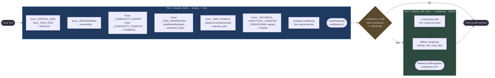
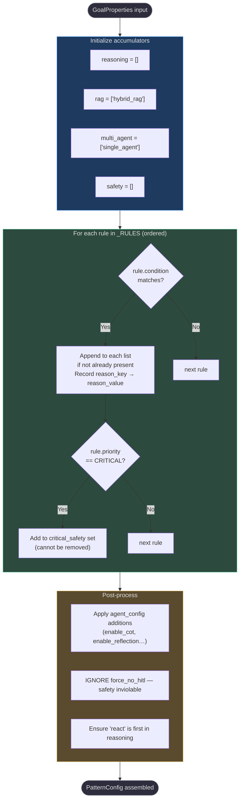
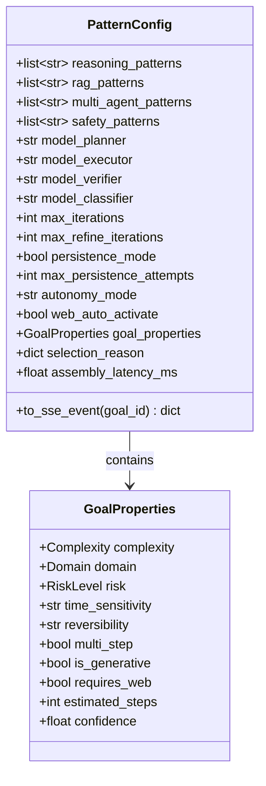
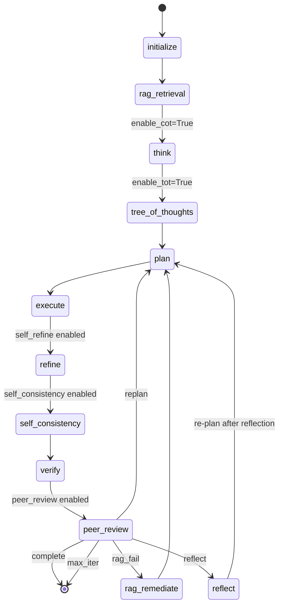

# How AgentVerse Selects and Dispatches Agent Patterns

> **This is the brain of AgentVerse.** Every goal that enters the platform — from "What is the capital of France?" to "Delete all records from the production database" — passes through a deterministic, sub-millisecond pipeline that decides which reasoning strategies, RAG techniques, multi-agent topologies, and safety gates to activate. Getting this selection wrong costs money (over-engineered simple tasks), quality (under-equipped complex tasks), or — in the worst case — causes irreversible damage to production systems.

---

## End-to-End Execution Flow: From HTTP Request to Final Answer

This is the full lifecycle of a goal in AgentVerse — the sequence every goal follows from the moment the client POSTs it to when the SSE stream closes. Understanding this flow answers questions like: *"When does RAG happen? When is the pattern selected? When do LLMs fire? Which model handles planning vs execution vs verification?"*

> **Multi-model routing** is active at **two independent layers**:
> - **Layer 1 — AI Router** (`app/ai_router/router.py`): fires at Phase 1 step ④, selects the best provider/model for `TaskType.PLANNING` based on tenant policy, cost, latency, and capability constraints.
> - **Layer 2 — ModelRouter** (`_model_router` inside `AgentGraph`): fires inside Phase 3 at each LLM node, routing `"planning"` / `"execution"` / `"verification"` / `"think"` / `"reflection"` roles to potentially **different** models (e.g. GPT-5.2 for planning, GPT-4o-mini for verification, Claude for creativity).

```
POST /api/v1/goals
        │
        ▼
╔═════════════════════════════════════════════════════════════════════════╗
║  PHASE 1 — HTTP + Pre-flight  (sync, < 5 ms)                           ║
╠═════════════════════════════════════════════════════════════════════════╣
║  GoalService.submit_goal()                                              ║
║                                                                         ║
║  ① Rate limiter          → check daily + concurrent goal limits (Redis)║
║  ② Goal deduplication    → identical goal already running? return it   ║
║  ③ Goal record created   → status = PENDING                           ║
║  ④ AI Router  ◄─ MULTI-MODEL ROUTING LAYER 1                          ║
║     ai_router.select_model(TaskType.PLANNING, tenant_id)               ║
║     Routing logic (in priority order):                                  ║
║       1. model_override param → use exactly that model                 ║
║       2. Tenant routing policy (per-tenant preferred provider/model)   ║
║       3. Filter available models by capability + health (circuit open?)║
║       4. Apply routing_mode: HIGHEST_QUALITY | CHEAPEST | FASTEST      ║
║     → selects ModelEndpoint { provider, model_id, quality_score … }   ║
║     → model_id logged in execution_context["ai_router_planner"]        ║
║                                                                         ║
║  ⑤ ★ PATTERN SELECTION (RuntimeProfileBuilder.build_with_trace())     ║
║     │                                                                   ║
║     ├─ GoalClassifier.classify_fast()         <1 ms (keyword scan)    ║
║     │    → GoalProperties { complexity, domain, risk, reversibility…} ║
║     │                                                                   ║
║     ├─ GoalClassifier.classify_with_llm()     ~200 ms (OPTIONAL)      ║
║     │    only if confidence ≤ 0.85 AND complexity == MEDIUM           ║
║     │                                                                   ║
║     ├─ PatternAssembler.assemble()            <0.5 ms                 ║
║     │    19 rules fired over GoalProperties → PatternConfig           ║
║     │    { reasoning_patterns, rag_patterns, safety_patterns … }      ║
║     │                                                                   ║
║     └─ DynamicGraphAssembler.assemble()       <0.5 ms                 ║
║          PatternConfig → GoalRuntimeProfile                           ║
║          model_planner / model_executor / model_verifier set here     ║
║          SSE event "pattern_assembled" emitted to client              ║
║                                                                         ║
║  ⑥ Celery task enqueued  → per-plan queue (free/starter/enterprise)   ║
║                                                                         ║
║  HTTP 202 Accepted → { goal_id, status: "pending" }                   ║
╚═════════════════════════════════════════════════════════════════════════╝
        │  (Celery worker picks up task)
        ▼
╔═════════════════════════════════════════════════════════════════════════╗
║  PHASE 2 — Graph Construction  (sync, ~1–5 ms)                         ║
╠═════════════════════════════════════════════════════════════════════════╣
║  GraphFactory.create(profile, services)                                 ║
║  • reasoning_patterns → boolean flags (enable_cot, enable_reflection…)║
║  • AgentGraph.__init__() wires all 20 cross-cutting services           ║
║  • AgentGraph._build() compiles LangGraph (conditional node wiring)   ║
╚═════════════════════════════════════════════════════════════════════════╝
        │
        ▼
╔═════════════════════════════════════════════════════════════════════════╗
║  PHASE 3 — LangGraph Execution  (async, ms → minutes)                  ║
╠═════════════════════════════════════════════════════════════════════════╣
║                                                                         ║
║  ┌─────────────────────────────────────────────────────────────────┐   ║
║  │  NODE: initialize                                                │   ║
║  │  • AgentState created, tenant context injected                  │   ║
║  │  • GuardrailChecker.check_goal() → scan goal for violations    │   ║
║  │  • GroundingChecker → validate factual claims are groundable   │   ║
║  │  • ExecutionMemory.recall() → past plans for similar goals     │   ║
║  │  • LongTermMemoryStore.recall() → Reflexion lessons injected   │   ║
║  │  • OTel span: "graph.initialize" started                       │   ║
║  └─────────────────────────────────────────────────────────────────┘   ║
║                              │                                          ║
║  ┌─────────────────────────────────────────────────────────────────┐   ║
║  │  NODE: rag_retrieval  ← RAG FIRES BEFORE PLANNING              │   ║
║  │  • rag_patterns from runtime profile selects strategy:         │   ║
║  │    hybrid_rag | web_augmented_rag | agentic_rag | FLARE        │   ║
║  │    | RAPTOR | fusion_rag | corrective_rag                      │   ║
║  │  • KnowledgeStore.hybrid_search() → pgvector + BM25           │   ║
║  │  • Retrieved chunks + citations stored in AgentState.context  │   ║
║  │  • SSE "knowledge_retrieved" event emitted                     │   ║
║  └─────────────────────────────────────────────────────────────────┘   ║
║                              │                                          ║
║  ┌─────────────────────────────────────────────────────────────────┐   ║
║  │  NODE: think  (only if chain_of_thought pattern active)         │   ║
║  │  • SemanticCache checked → skip if near-duplicate LLM call     │   ║
║  │  • _model_router.model_for("think")  ◄ LAYER 2 ROUTING        │   ║
║  │    → resolves which model ID handles CoT reasoning             │   ║
║  │  • LLM (CoT model) called with CHAIN_OF_THOUGHT_SYSTEM prompt │   ║
║  │  • CoT reasoning stored in reasoning_evidence                  │   ║
║  └─────────────────────────────────────────────────────────────────┘   ║
║                              │                                          ║
║  ┌─────────────────────────────────────────────────────────────────┐   ║
║  │  NODE: tree_of_thoughts  (only if tree_of_thoughts active)      │   ║
║  │  • TreeOfThoughtsPattern(n_thoughts=3, max_depth=2)            │   ║
║  │  • Explores N solution branches before planning                │   ║
║  │  • Best answer injected into planner context                   │   ║
║  └─────────────────────────────────────────────────────────────────┘   ║
║                              │                                          ║
║  ┌─────────────────────────────────────────────────────────────────┐   ║
║  │  NODE: plan  ← PLANNER LLM   ◄ LAYER 2 ROUTING               │   ║
║  │  • _model_router.model_for_goal("planning", goal=…)           │   ║
║  │    → resolves planning model (default: GPT-5.2 or equivalent) │   ║
║  │    → overrides AI Router selection if runtime profile differs  │   ║
║  │  • ContextPipeline: re-rank + trim retrieved chunks            │   ║
║  │    (separate windows for planner / executor / verifier)        │   ║
║  │  • SemanticCache checked → skip LLM if cached plan exists      │   ║
║  │  • LLM (Planner model): goal + RAG context + lessons → steps  │   ║
║  │  • CircuitBreaker wraps LLM call (fail-fast on provider errors) │   ║
║  │  • SSE "plan_created" event emitted                            │   ║
║  └─────────────────────────────────────────────────────────────────┘   ║
║                              │                                          ║
║  ┌─────────────────────────────────────────────────────────────────┐   ║
║  │  NODE: execute  ← EXECUTOR LLM   ◄ LAYER 2 ROUTING           │   ║
║  │                                                                  │   ║
║  │  _model_router.model_for("execution")  → executor model ID    │   ║
║  │    (may differ from planner — e.g. faster/cheaper model)       │   ║
║  │                                                                  │   ║
║  │  For each step in the plan:                                     │   ║
║  │  ─────────────────────────────────────────────────────────      │   ║
║  │  [A] LLM (Executor model) → Thought + tool call intent        │   ║
║  │                                                                  │   ║
║  │  [B] TOOL GOVERNANCE GATE (every tool call):                   │   ║
║  │      1. OutputSanitizer   → strip PII/secrets from inputs      │   ║
║  │      2. GuardrailChecker  → policy violation on tool+input     │   ║
║  │      3. PermissionMatrix  → tenant+agent allowed for this tool?│   ║
║  │      4. PolicyEngine      → active allow/deny/rate-limit rules │   ║
║  │      5. CostController    → within per-call + per-goal budget? │   ║
║  │      6. CircuitBreaker    → provider healthy (not open)?       │   ║
║  │      7. Bulkhead          → within per-tenant concurrency?     │   ║
║  │      8. DeduplicationCache→ identical call already made?       │   ║
║  │      9. ToolRiskAssessor  → high-risk step? (deploy/delete…)   │   ║
║  │         └── HIGH-RISK → HITLGateway → PAUSE for human approval│   ║
║  │     10. RollbackEngine.register() → log compensating action    │   ║
║  │                                                                  │   ║
║  │  [C] MCP tool execution (actual tool call)                     │   ║
║  │                                                                  │   ║
║  │  [D] POST-TOOL PROCESSING:                                     │   ║
║  │     11. OutputSanitizer   → strip PII/secrets from output      │   ║
║  │     12. GuardrailChecker  → scan tool output for violations    │   ║
║  │     13. AuditLog.record() → immutable audit entry              │   ║
║  │     14. CostController.record() → log actual costs             │   ║
║  │     15. EvalRunner.score() → quality score on step output      │   ║
║  │     16. FLARE check → mid-exec uncertainty? re-trigger RAG     │   ║
║  │                                                                  │   ║
║  │  [E] Executor observes result → next Thought (ReAct loop)      │   ║
║  │  [F] SSE "step_completed" event emitted                        │   ║
║  └─────────────────────────────────────────────────────────────────┘   ║
║                              │                                          ║
║  ┌─────────────────────────────────────────────────────────────────┐   ║
║  │  NODE: refine  (only if self_refine active)                     │   ║
║  │  • LLM iterates on execute output                              │   ║
║  │  • Stops when response starts with NO_CHANGES_NEEDED           │   ║
║  └─────────────────────────────────────────────────────────────────┘   ║
║                              │                                          ║
║  ┌─────────────────────────────────────────────────────────────────┐   ║
║  │  NODE: self_consistency  (only if self_consistency active)      │   ║
║  │  • SelfConsistencyPattern(n_samples=3) → majority vote         │   ║
║  └─────────────────────────────────────────────────────────────────┘   ║
║                              │                                          ║
║  ┌─────────────────────────────────────────────────────────────────┐   ║
║  │  NODE: verify  ← VERIFIER LLM   ◄ LAYER 2 ROUTING            │   ║
║  │  • _model_router.model_for("verification") → verifier model   │   ║
║  │    (often a cheaper model than planner for cost efficiency)    │   ║
║  │  • ContextPipeline verifier context injected                   │   ║
║  │  • LLM (Verifier model): did we satisfy the original goal?    │   ║
║  │  • CircuitBreaker wraps LLM call                               │   ║
║  │  • → "complete" | "replan" | "reflect" | "rag_remediate"       │   ║
║  │  • AuditLog.record() → verification result logged              │   ║
║  │  • SSE "verification_complete" event emitted                   │   ║
║  └─────────────────────────────────────────────────────────────────┘   ║
║                              │                                          ║
║  ┌─────────────────────────────────────────────────────────────────┐   ║
║  │  NODE: peer_review  (only if peer_review active)                │   ║
║  │  • PeerReviewPattern(quality_threshold=0.7)                    │   ║
║  │  • Independent LLM review of output quality                    │   ║
║  └─────────────────────────────────────────────────────────────────┘   ║
║                              │                                          ║
║  ┌─────────────────────────────────────────────────────────────────┐   ║
║  │  _route() → branching decision                                  │   ║
║  │  ├── complete        → END (success path)                      │   ║
║  │  ├── replan          → [plan] (new iteration, max_iterations)  │   ║
║  │  ├── reflect         → [reflect] → diagnosis → [plan]         │   ║
║  │  │     NODE: reflect: _model_router.model_for("reflection")   │   ║
║  │  │     LLM diagnoses failure, updates verification_feedback,  │   ║
║  │  │     increments reflection_attempts                          │   ║
║  │  ├── rag_remediate   → [rag_retrieval] → [plan]               │   ║
║  │  └── max_iterations  → END (timeout, status=FAILED)           │   ║
║  └─────────────────────────────────────────────────────────────────┘   ║
╚═════════════════════════════════════════════════════════════════════════╝
        │
        ▼
╔═════════════════════════════════════════════════════════════════════════╗
║  PHASE 4 — Post-execution & Agent Improvement  (async)                  ║
╠═════════════════════════════════════════════════════════════════════════╣
║  SUCCESS path:                                                          ║
║  • LongTermMemoryStore.extract_from_goal() → save lessons (pgvector)  ║
║  • SelfOptimizer.analyze_success() → adjust strategy weights          ║
║  • EvalRunner final summary → quality score stored                    ║
║  • SemanticCache.store() → cache plan for future near-identical goals  ║
║                                                                         ║
║  FAILURE path:                                                          ║
║  • RollbackEngine.rollback() → execute compensating actions           ║
║  • LongTermMemoryStore.store_failure_lesson() → what went wrong       ║
║  • SelfOptimizer.analyze_failure() → RPA/complex task analysis        ║
║                                                                         ║
║  ALWAYS (success or failure):                                           ║
║  • AuditLog.append() → final immutable audit entry                    ║
║  • CostController.record_total() → total goal cost persisted          ║
║  • GoalRecord updated → status = COMPLETED | FAILED                   ║
║  • Concurrent-goal counter decremented (Redis)                        ║
║  • Goal deduplication entry cleared                                   ║
║  • SSE "goal_completed" or "goal_failed" → client stream closes       ║
║  • OTel root span closed → full distributed trace available in Jaeger ║
╚═════════════════════════════════════════════════════════════════════════╝
```

### Full Activity Diagram

```mermaid
flowchart TD
    START([POST /api/v1/goals]) --> RATE[Rate Limiter\nconcurrent + daily limits]
    RATE --> DEDUP{Goal Deduplication\nredis hash}
    DEDUP -- duplicate --> RETURN_DUP([Return existing goal_id])
    DEDUP -- new goal --> RECORD[Create GoalRecord\nstatus = PENDING]
    RECORD --> AIROUTER[AI Router\nselect model for PLANNING]
    AIROUTER --> CLASSIFY

    subgraph PATTERN_SEL ["Pattern Selection — build_with_trace()"]
        direction TB
        CLASSIFY[classify_fast\nkeyword scan, under 1ms] --> CONF{confidence low\nAND MEDIUM?}
        CONF -- yes --> CL2[classify_with_llm\n~200ms LLM call]
        CONF -- no --> ASSEMBLE
        CL2 --> ASSEMBLE[PatternAssembler\n19 rules fired over GoalProperties]
        ASSEMBLE --> DGA[DynamicGraphAssembler\nPatternConfig to GoalRuntimeProfile]
        DGA --> SSE1[SSE event: pattern_assembled]
    end

    CLASSIFY -.-> PATTERN_SEL
    SSE1 --> QUEUE[Celery task enqueued\nper-plan queue]
    QUEUE --> HTTP202([HTTP 202 Accepted])

    QUEUE --> GF

    subgraph GRAPH_BUILD ["Graph Construction ~1-5ms"]
        direction TB
        GF[GraphFactory.create\nprofile to boolean flags] --> AG[AgentGraph init\n20 cross-cutting services wired]
        AG --> BUILD[AgentGraph._build\nconditional LangGraph compile]
    end

    BUILD --> INIT

    subgraph LANGGRAPH ["LangGraph Execution — Phase 3"]
        direction TB

        INIT[NODE: initialize\nGuardrailChecker check goal\nGroundingChecker\nExecutionMemory recall\nLongTermMemory recall lessons\nOTel span started]

        INIT --> RAGNOD[NODE: rag_retrieval\nRAG strategy from profile\nhybrid or web or agentic or FLARE\nor RAPTOR or fusion or corrective\nKnowledgeStore search\nSSE: knowledge_retrieved]

        RAGNOD --> COTQ{chain_of_thought\nactive?}
        COTQ -- yes --> THINK[NODE: think\nSemanticCache check\nPlanner LLM with CoT prompt\nreasoning stored in evidence]
        COTQ -- no --> TOTQ

        THINK --> TOTQ{tree_of_thoughts\nactive?}
        TOTQ -- yes --> TOT[NODE: tree_of_thoughts\nTreeOfThoughtsPattern\nn=3 branches max_depth=2\nbest branch to planner context]
        TOTQ -- no --> PLANNOD

        TOT --> PLANNOD

        PLANNOD[NODE: plan — Planner LLM 1\nContextPipeline rerank chunks\nSemanticCache check\nPlanner LLM: goal + RAG + lessons to steps\nCircuitBreaker wraps call\nSSE: plan_created]

        PLANNOD --> G1SANIT

        subgraph EXEC_LOOP ["NODE: execute — Executor LLM 2 — ReAct loop"]
            direction TB
            LLM2[Executor LLM: Thought + tool intent] --> G1SANIT
            G1SANIT[1 OutputSanitizer: strip PII from inputs] --> G2GUARD
            G2GUARD[2 GuardrailChecker: policy violation?] --> G3PERM
            G3PERM[3 PermissionMatrix: tool allowed?] --> G4POL
            G4POL[4 PolicyEngine: allow / deny / rate-limit] --> G5COST
            G5COST[5 CostController: within budget?] --> G6CB
            G6CB[6 CircuitBreaker: provider healthy?] --> G7BH
            G7BH[7 Bulkhead: concurrency limit ok?] --> G8DD
            G8DD[8 DeduplicationCache: identical call?] --> RISKQ
            RISKQ{9 ToolRiskAssessor\nhigh-risk step?}
            RISKQ -- HIGH-RISK --> HITL[HITLGateway\nrequest_approval — PAUSE]
            HITL -- approved --> ROLLREG
            RISKQ -- normal --> ROLLREG
            ROLLREG[10 RollbackEngine.register\nlog compensating action] --> TOOLEXEC
            TOOLEXEC[MCP Tool Execution] --> P11SANIT
            P11SANIT[11 OutputSanitizer: strip PII from output] --> P12GRD
            P12GRD[12 GuardrailChecker: scan output] --> P13AUD
            P13AUD[13 AuditLog.record: immutable entry] --> P14COST
            P14COST[14 CostController.record: log costs] --> P15EVAL
            P15EVAL[15 EvalRunner.score: quality score] --> FLAREQ
            FLAREQ{16 FLARE: output uncertain?}
            FLAREQ -- uncertain, re-retrieve --> RAGNOD
            FLAREQ -- ok --> OBSERVE
            OBSERVE[Executor observes result\nnext Thought in loop] --> MOREQ
            MOREQ{more steps?}
            MOREQ -- yes --> LLM2
            MOREQ -- no --> EXECDONE
            EXECDONE[SSE: step_completed]
        end

        EXECDONE --> REFQ{self_refine\nactive?}
        REFQ -- yes --> REFINE[NODE: refine\nLLM iterates on output\nstops on NO_CHANGES_NEEDED]
        REFQ -- no --> SCQ

        REFINE --> SCQ{self_consistency\nactive?}
        SCQ -- yes --> SC[NODE: self_consistency\nSelfConsistencyPattern n=3\nmajority vote answer]
        SCQ -- no --> VERIFYNOD

        SC --> VERIFYNOD

        VERIFYNOD[NODE: verify — Verifier LLM 3\nContextPipeline verifier context\nVerifier LLM: goal satisfied?\nCircuitBreaker wraps call\nAuditLog.record verification\nSSE: verification_complete]

        VERIFYNOD --> PRQ{peer_review\nactive?}
        PRQ -- yes --> PR[NODE: peer_review\nPeerReviewPattern threshold 0.7\nindependent LLM review]
        PRQ -- no --> ROUTEQ

        PR --> ROUTEQ

        ROUTEQ{_route decision}
        ROUTEQ -- complete --> GOALOK([Goal COMPLETE])
        ROUTEQ -- replan --> PLANNOD
        ROUTEQ -- reflect --> REFLECTNOD
        REFLECTNOD[NODE: reflect\nLLM diagnoses failure\nupdates verification_feedback\nincrements reflection_attempts]
        REFLECTNOD --> PLANNOD
        ROUTEQ -- rag_remediate --> RAGNOD
        ROUTEQ -- max_iterations --> GOALTIMEOUT([Goal TIMEOUT — FAILED])
    end

    GOALOK --> SUCPATH
    GOALTIMEOUT --> FAILPATH

    subgraph POST_EXEC ["Phase 4 — Post-Execution and Agent Improvement"]
        direction TB
        SUCPATH[SUCCESS PATH\nLongTermMemory.extract_from_goal\nSelfOptimizer.analyze_success\nEvalRunner final summary\nSemanticCache.store plan]
        FAILPATH[FAILURE PATH\nRollbackEngine.rollback\nLongTermMemory.store_failure\nSelfOptimizer.analyze_failure]
        ALWAYS[ALWAYS path\nAuditLog final entry\nCostController record total\nGoalRecord to COMPLETED or FAILED\nConcurrent counter decrement\nDedup entry cleared\nSSE goal_completed or goal_failed\nOTel root span closed]
    end

    SUCPATH --> ALWAYS
    FAILPATH --> ALWAYS
    ALWAYS --> STREAMEND([SSE stream closes])

    style PATTERN_SEL fill:#1a3a5c,stroke:#4a9ede,color:#e0f0ff
    style GRAPH_BUILD fill:#1a3a5c,stroke:#4a9ede,color:#e0f0ff
    style LANGGRAPH fill:#0d2b1e,stroke:#3a8a5c,color:#e0ffe0
    style EXEC_LOOP fill:#1a2b1a,stroke:#4a8a4a,color:#e0ffe0
    style POST_EXEC fill:#2b2b1a,stroke:#8a8a3a,color:#ffffe0
    style GOALOK fill:#1a3a1a,stroke:#3a8a3a,color:#e0ffe0
    style GOALTIMEOUT fill:#3a1a1a,stroke:#8a3a3a,color:#ffe0e0
    style RETURN_DUP fill:#2b2b2b,stroke:#6a6a6a,color:#e0e0e0
    style STREAMEND fill:#1a1a3a,stroke:#4a4a8a,color:#e0e0ff
    style HITL fill:#4a1a1a,stroke:#cc4444,color:#ffe0e0
```



---

### Multi-Model Routing

AgentVerse routes **different LLM models to different roles** — a single goal execution may simultaneously use GPT-5.2 for planning, GPT-4o-mini for verification, and Claude for creative tasks. This happens at **two independent layers**.

#### Layer 1 — AI Router  (`app/ai_router/router.py`)

Fires once at **Phase 1 step ④** (goal submission, synchronous) to select the best provider+model for `TaskType.PLANNING`.

```
ai_router.select_model(
    task_type  = TaskType.PLANNING,
    tenant_id  = tenant_ctx.tenant_id,
    # optional constraints:
    require_vision     = False,
    require_tools      = False,
    require_structured = False,
    max_cost_per_1k    = <from tenant plan>,
    model_override     = <from request body, if set>,
)
```

**Selection priority (in order):**

| Priority | Logic |
|---|---|
| 1 | `model_override` in request body → use exactly that model, skip all other logic |
| 2 | Tenant routing policy in registry → preferred provider + model for this tenant |
| 3 | Filter all registered models: `is_available=True`, `circuit_open=False` |
| 4 | Apply capability filters (vision, tool-use, structured-output, max cost/1k) |
| 5 | Apply `routing_mode`: `HIGHEST_QUALITY` (default) / `CHEAPEST` / `FASTEST` |

**Supported `TaskType` values:**

| Value | Used when |
|---|---|
| `PLANNING` | Goal submission — selects the planner model |
| `EXECUTION` | (future) Can select a specific executor model via AI Router |
| `VERIFICATION` | (future) Can select a specific verifier model via AI Router |

The selected `ModelEndpoint` is stored in `execution_context["ai_router_planner"]` and passed to `GraphFactory.create()` which wires it into `AgentGraph`.

---

#### Layer 2 — ModelRouter  (`_model_router` inside `AgentGraph`)

Fires **per LangGraph node** during Phase 3 execution. `_model_router` is an instance of `ModelRouter` injected at `AgentGraph` construction time via `GraphFactory`. It knows the `GoalRuntimeProfile` (including per-role model assignments set during pattern selection) and resolves the best model ID for each role on every call.

**Role → model resolution:**

```
_model_router.model_for("think")        →  CoT / reasoning-heavy model
_model_router.model_for_goal("planning", goal=…)  →  planner model (goal-aware)
_model_router.model_for("execution")    →  executor model (speed-optimised)
_model_router.model_for("verification") →  verifier model (often cheaper)
_model_router.model_for("reflection")   →  reflection/diagnosis model
```

**Where each call fires inside the graph:**

| LangGraph node | `_model_router` call | Typical model role |
|---|---|---|
| `_node_think()` | `model_for("think")` | Chain-of-thought / strong reasoning model |
| `_node_plan()` | `model_for_goal("planning", goal)` | Planner — highest quality, goal-aware routing |
| `_node_execute()` | `model_for("execution")` | Executor — fast, tool-capable model |
| `_node_verify()` | `model_for("verification")` | Verifier — cheaper model, binary pass/fail |
| `_node_reflect()` | `model_for("reflection")` | Reflection — diagnostic reasoning |

**`update_from_profile()` — runtime override at plan time:**  
When a plan is created (`_node_plan()`), `_model_router.update_from_profile(runtime_profile)` is called to sync any profile-level model role assignments (e.g. if the plan itself determined that a different model is needed for the next execution steps).

**Example: how a simple RAG goal uses 2 models, a complex CoT+critique goal uses 4:**

```
Simple goal:  "summarise these docs"
  plan node     → model_for_goal("planning")   → GPT-4o (highest quality)
  execute node  → model_for("execution")        → GPT-4o-mini (fast)
  verify node   → model_for("verification")     → GPT-4o-mini (cheap pass/fail)

Complex goal: "build a trading strategy and critique it"
  think node    → model_for("think")            → o3 (deep reasoning)
  plan node     → model_for_goal("planning")    → o3 (goal-aware, complexity=HARD)
  execute node  → model_for("execution")        → GPT-4o (tool-capable)
  verify node   → model_for("verification")     → GPT-4o-mini
  reflect node  → model_for("reflection")       → GPT-4o (diagnosis if verify fails)
```

---

**Summary — where to find each layer in code:**

| Layer | File | Triggers at |
|---|---|---|
| AI Router (Layer 1) | `app/ai_router/router.py` | `goal_service.py` line ~2338 — `ai_router.select_model(TaskType.PLANNING, ...)` |
| ModelRouter (Layer 2) | `app/agent/graph.py` `_model_router` | Per-node: `_node_think`, `_node_plan`, `_node_execute`, `_node_verify`, `_node_reflect` |
| ModelRouter config | `app/agent/graph.py` `_node_plan()` | `_model_router.update_from_profile(runtime_profile)` at line ~1438 |
| Role assignment source | `app/orchestration/graph_factory.py` | `model_role_assignments` in `GoalRuntimeProfile` |

---


| Component | When | Phase |
|---|---|---|
| **Rate limiter / dedup check** | Immediately on POST, before goal is created | 1 |
| **GoalClassifier (Tier-1 keyword)** | During `build_with_trace()`, synchronous | 1 |
| **GoalClassifier (Tier-2 LLM)** | Only if confidence ≤ 0.85 AND complexity == MEDIUM | 1 |
| **PatternAssembler (19 rules)** | During `build_with_trace()`, after classification | 1 |
| **GraphFactory / AgentGraph compile** | After profile is built, before Celery task runs | 3 |
| **RAG retrieval** | **First** thing in the LangGraph, before any LLM planning | 4 |
| **Chain-of-Thought (think node)** | After RAG, before planning (only if CoT pattern active) | 4 |
| **Planner LLM** | After RAG (and optionally CoT/ToT), produces step list | 4 |
| **Executor LLM** | Once per step in the ReAct loop | 4 |
| **Tool calls (MCP)** | Inside the ReAct loop, one per Executor Thought | 4 |
| **Verifier LLM** | After all steps complete, checks goal completion | 4 |
| **Self-refine / Self-consistency / Peer review** | After execute, before verify | 4 |
| **Reflect / Replan loop** | After verify fails, feeds diagnosis back to plan | 4 |
| **Memory write / Audit / Cost record** | After graph exits (success or failure) | 5 |

### All cross-cutting systems and when they fire

The following systems fire at specific points during every goal execution. They are wired into `AgentGraph` at construction time and are always present regardless of which pattern is selected.

| System | Where it fires | What it does |
|---|---|---|
| **Guardrails** (`GuardrailChecker`) | `initialize` node (goal scan) + after every tool output | Scans goal text for policy violations before execution starts; scans each tool result before it enters agent state |
| **Grounding checker** (`grounding_checker`) | `initialize` node | Validates that factual claims in the goal can be grounded; flags hallucination risk |
| **Semantic cache** (`SemanticCache`) | Before every Planner LLM call; after plan produced | Deduplicates identical LLM calls by embedding similarity — avoids re-running expensive planning for near-duplicate goals |
| **Tool deduplication cache** (`DeduplicationCache`) | Before every tool call inside `_execute_step()` | Prevents identical tool invocations within the same goal execution |
| **Permission matrix** (`PermissionMatrix`) | Before every tool call | Checks whether the tool is permitted for this tenant + agent + tool combination |
| **Policy engine** (`PolicyEngine`) | Before every tool call (Redis pub/sub for real-time propagation) | Evaluates active policies: tool allow/deny lists, rate limits, data classification rules |
| **Cost controller** (`CostController`) | Before every LLM call + before every tool call | Checks per-call token budget and per-goal cost budget; blocks execution if exceeded |
| **Circuit breaker** (`CircuitBreaker`) | Wraps every LLM provider call (`call_with_circuit_breaker`) | Opens after N consecutive failures; raises `PermissionError` to prevent cascading LLM failures |
| **Bulkhead** (`RedisBulkheadRegistry`) | Before every tool call (`_execute_step`) | Enforces per-tenant concurrency limits — prevents one tenant from monopolising worker threads |
| **HITL gateway** (`HITLGateway`) | Before tool execution for high-risk steps (keywords: `deploy`, `delete`, `prod`, `payment`, etc.) | Pauses execution and queues an approval request; execution resumes only after human approval or timeout |
| **Rollback engine** (`RollbackEngine`) | Tool execution is registered before call; on failure triggers rollback | Registers each reversible tool call; on downstream failure calls compensating actions |
| **Audit log** (`AuditLog`) | After every tool call + after verify + at goal completion/failure | Appends an immutable append-only audit entry with tenant_id, goal_id, tool, input hash, output hash, timestamp |
| **Execution memory** (`ExecutionMemory`) | `initialize` node (recall) + `execute` node | Recalls past execution plans for similar goals (short-term, per-goal scope); injects as planner context |
| **Long-term memory** (`LongTermMemoryStore`) | `initialize` node (recall Reflexion lessons) + Phase 5 (store) | Recalls lessons from past failures/successes (cross-session); stores new lessons after goal completion |
| **Reflexion pattern** (`ReflexionPattern`) | If enabled: stores lessons during reflect node; recalled at initialize | Stores structured lesson (what went wrong, what to do differently) for future use |
| **Eval runner** (`EvalRunner`) | Wired into `_execute_step()` — scores step outputs against quality criteria | Runs automated evaluation on step outputs; score stored in `reasoning_evidence` |
| **Self-optimizer** (`SelfOptimizer`) | Fires on RPA/browser task failures (`analyze_rpa_failure`) | Analyzes failure patterns and adjusts prompt strategy for subsequent attempts |
| **Output sanitizer** | Before every SSE event emit + before every tool result is stored | Strips PII, secrets, and malicious content from all outputs before they leave the agent boundary |
| **OTel tracer** (`_tracer`) | Every major operation (spans for goal.submit, goal.execute, each node) | Distributed traces sent to OTLP collector (Jaeger); every LLM call, tool call, and node transition is a child span |
| **ContextPipeline** (re-ranker) | In `plan` node, after RAG retrieval | Re-ranks and trims retrieved chunks using `RerankStrategy`; produces separate planner / executor / verifier context windows |
| **FLARE** (uncertainty-triggered retrieval) | Inside `_execute_step()`, when executor output contains uncertainty markers | Re-triggers targeted retrieval mid-execution when the model is uncertain about a fact |

### Governance decision flow within a single tool call

Every tool call in the ReAct loop passes through this gate sequence before the tool is actually invoked:

```
Executor LLM generates Thought → Tool call intent

  1. Output sanitizer     → strip secrets/PII from tool inputs
  2. GuardrailChecker     → policy violation check on tool + input
  3. PermissionMatrix     → tenant+agent allowed to call this tool?
  4. PolicyEngine         → active policy rules (allow/deny/rate-limit)
  5. CostController       → within per-call and per-goal budget?
  6. CircuitBreaker       → provider healthy? (not open-circuited)
  7. Bulkhead             → within per-tenant concurrency limit?
  8. DeduplicationCache   → identical call already made this execution?
  9. ToolRiskAssessor     → is this a high-risk step?
     ├── HIGH-RISK → HITLGateway.request_approval() → PAUSE
     └── normal    → proceed
 10. RollbackEngine.register() → log compensating action
 11. MCP tool execution  → actual tool call
 12. Output sanitizer     → strip secrets/PII from tool output
 13. GuardrailChecker     → scan tool output for policy violations
 14. AuditLog.record()    → immutable audit entry
 15. CostController.record() → log actual token + call costs
 16. EvalRunner.score()   → optional quality score on step output
```

If any gate (steps 2–8) rejects the call, execution is terminated with a structured error and the goal status is set to `FAILED`. The rollback engine fires compensating actions for any previously registered tool calls.

### Agent improvement loop (cross-session learning)

```
Goal N completes (success or partial failure)
        │
        ▼
LongTermMemoryStore.extract_from_goal(agent_state)
  • Extracts: what worked, what failed, which tool patterns were effective
  • Reflexion lessons: structured {situation, action, outcome, lesson}
  • Stored in pgvector with embedding for future semantic recall
        │
        ▼
SelfOptimizer.analyze_failure() (on RPA/complex task failures)
  • Adjusts prompt strategy weights for next attempt
        │
Goal N+1 starts
        │
        ▼
LongTermMemoryStore.recall(goal_text, k=5)
  • Retrieves top-K semantically similar past lessons
  • Injected into planner context BEFORE planning starts
        │
        ▼
Planner benefits from past experience without being retrained
```

This gives AgentVerse a **continual learning loop** that improves without model fine-tuning — each goal makes the next similar goal cheaper and more reliable.

### E2E timeline: simple vs. complex goal

```
Simple goal: "What is the capital of France?"
  Phase 1:  < 2 ms   (Tier-1 classify → react + guardrails only)
  Phase 3:  < 2 ms   (minimal graph, no optional nodes)
  Phase 4:  ~300 ms  (RAG → plan → execute 1 step → verify)
  Total:    ~500 ms

Complex expert goal: "Analyze Q3 data, identify anomalies, write report"
  Phase 1:  < 2 ms   (Tier-1 classify, EXPERT → full pattern set)
  Phase 3:  ~3 ms    (full graph with 6 optional nodes compiled)
  Phase 4:  30–120 s (RAG → think → ToT → plan → execute N steps
                      → self_consistency → verify → [reflect → plan] × K)
  Total:    30–120 s

Critical goal: "Delete all test records from production DB"
  Phase 1:  < 2 ms   (CRITICAL risk detected immediately)
  Phase 3:  ~3 ms    (HITL gateway wired, rollback engine wired)
  Phase 4:  PAUSED   (HITL gateway blocks until human approves)
  After approval: execute with rollback, consensus_verification
```

---


When a client submits a goal, AgentVerse does **not** run the same LangGraph every time. Instead, [`GoalService`](https://github.com/harsh786/agent-verse/blob/main/agent-verse-backend/app/services/goal_service.py#L1001) instantiates a [`RuntimeProfileBuilder`](https://github.com/harsh786/agent-verse/blob/main/agent-verse-backend/app/orchestration/runtime_profile_builder.py) that orchestrates a 7-stage pipeline:

1. **Classify** the goal text into `GoalProperties` (complexity, domain, risk, reversibility …)
2. **Select** patterns via a rule engine that accumulates reasoning, RAG, multi-agent, and safety patterns
3. **Construct** a `GoalRuntimeProfile` with a `PatternConfig`
4. **Assemble** the LangGraph by translating pattern flags into conditional node activations
5. **Compile** and execute the wired graph

The entire selection pipeline completes in **< 2 ms** for Tier-1-only paths and **≤ 250 ms** when the LLM classifier fires. This means pattern selection adds negligible latency while dramatically improving output quality and safety.

---

## 4-Phase Execution Breakdown

Every goal execution passes through exactly four phases. The phases map directly to the ASCII diagram in the E2E flow above.

| Phase | Name | Runtime | Duration | Key work |
|---|---|---|---|---|
| **1** | HTTP + Pre-flight | Synchronous (HTTP request thread) | < 5 ms | Rate limiting, dedup, AI Router model selection, pattern selection, Celery enqueue, HTTP 202 response |
| **2** | Graph Construction | Celery worker, before LangGraph start | 1–5 ms | `GraphFactory.create()` → `AgentGraph._build()` compiles LangGraph StateGraph with boolean feature flags from `GoalRuntimeProfile` |
| **3** | LangGraph Execution | Celery worker, async | 200 ms – minutes | All LLM calls (planner, executor, verifier, CoT), all tool calls (MCP), RAG, HITL, verification, reflection loops |
| **4** | Post-execution | Celery worker, after graph exits | < 50 ms | Memory write, audit log, cost record, agent improvement (LTM store, Reflexion, SelfOptimizer), SSE stream close |

### What changes per phase for multi-model routing

| Phase | Model routing activity |
|---|---|
| Phase 1 | **AI Router** selects `ModelEndpoint` for `TaskType.PLANNING`; stored in execution context |
| Phase 2 | `GraphFactory` injects `model_router` (Layer 2) into `AgentGraph`; role assignments from `GoalRuntimeProfile.model_role_assignments` loaded |
| Phase 3 | `_model_router.model_for(role)` called per LangGraph node — each role may resolve to a different LLM |
| Phase 4 | No model calls; results + cost per model recorded to audit log |

---

## Stage Pipeline at a Glance

| Stage | Component | File | Latency |
|-------|-----------|------|---------|
| 1 | `GoalService` instantiates builder | [`goal_service.py:1001`](https://github.com/harsh786/agent-verse/blob/main/agent-verse-backend/app/services/goal_service.py#L1001) | — |
| 2 | `RuntimeProfileBuilder.build_with_trace()` | [`runtime_profile_builder.py`](https://github.com/harsh786/agent-verse/blob/main/agent-verse-backend/app/orchestration/runtime_profile_builder.py) | orchestrates |
| 3 | `GoalClassifier.classify_fast()` (Tier 1) | [`goal_classifier.py`](https://github.com/harsh786/agent-verse/blob/main/agent-verse-backend/app/orchestration/goal_classifier.py) | < 1 ms |
| 3b | `GoalClassifier.classify_with_llm()` (Tier 2) | [`goal_classifier.py`](https://github.com/harsh786/agent-verse/blob/main/agent-verse-backend/app/orchestration/goal_classifier.py) | ~200 ms (conditional) |
| 4 | `PatternSelector.select_agent_patterns()` | [`pattern_selector.py`](https://github.com/harsh786/agent-verse/blob/main/agent-verse-backend/app/orchestration/pattern_selector.py) | < 0.5 ms |
| 5 | `DynamicGraphAssembler.assemble()` | [`dynamic_graph.py`](https://github.com/harsh786/agent-verse/blob/main/agent-verse-backend/app/agent/dynamic_graph.py) | < 0.5 ms |
| 6 | `GraphFactory.create()` | [`graph_factory.py`](https://github.com/harsh786/agent-verse/blob/main/agent-verse-backend/app/orchestration/graph_factory.py) | < 0.5 ms |
| 7 | `AgentGraph.__init__()` + `_build()` | [`graph.py`](https://github.com/harsh786/agent-verse/blob/main/agent-verse-backend/app/agent/graph.py#L196) | ~1–5 ms |

---

## Complete Pipeline: Sequence Diagram

```mermaid
sequenceDiagram
    autonumber
    participant Client
    participant GoalService
    participant RuntimeProfileBuilder
    participant GoalClassifier
    participant PatternSelector
    participant DynamicGraphAssembler
    participant GraphFactory
    participant AgentGraph
    participant LangGraph

    Client->>GoalService: POST /goals { text, agent_config }

    rect rgb(30, 58, 95)
        Note over GoalService: Stage 1 — Entry Point (goal_service.py:1001)
        GoalService->>RuntimeProfileBuilder: build_with_trace(goal, tenant_id, goal_id, agent_config)
    end

    rect rgb(45, 74, 62)
        Note over GoalClassifier: Stage 2 — Classification
        RuntimeProfileBuilder->>GoalClassifier: classify_fast(goal)
        GoalClassifier-->>RuntimeProfileBuilder: GoalProperties (< 1ms, always)
        alt confidence ≤ 0.85 AND complexity == MEDIUM
            RuntimeProfileBuilder->>GoalClassifier: classify_with_llm(goal, tier1_props)
            GoalClassifier-->>RuntimeProfileBuilder: refined GoalProperties (~200ms)
        end
    end

    rect rgb(58, 42, 24)
        Note over PatternSelector: Stage 3 — Pattern Selection
        RuntimeProfileBuilder->>PatternSelector: select_agent_patterns(props)
        PatternSelector-->>RuntimeProfileBuilder: AgentPatternConfig (reasoning[], multi_agent[], safety[])
        RuntimeProfileBuilder->>PatternSelector: select_rag_strategy(props)
        PatternSelector-->>RuntimeProfileBuilder: RAGStrategyConfig
        RuntimeProfileBuilder->>PatternSelector: select_model_plan(props)
        PatternSelector-->>RuntimeProfileBuilder: ModelPlanConfig
    end

    rect rgb(30, 58, 95)
        Note over RuntimeProfileBuilder: Stage 4 — Profile Assembly
        RuntimeProfileBuilder-->>GoalService: GoalRuntimeProfile + DecisionTrace
        GoalService->>GoalService: Emit SSE: pattern_assembled
    end

    rect rgb(45, 74, 62)
        Note over DynamicGraphAssembler: Stage 5 — Graph Assembly
        GoalService->>DynamicGraphAssembler: assemble(pattern_config, planner, executor, verifier)
        DynamicGraphAssembler->>GraphFactory: create(profile, services)
    end

    rect rgb(58, 42, 24)
        Note over GraphFactory: Stage 6 — Graph Construction
        GraphFactory->>GraphFactory: validate profile (version=2, goal_id, tenant_id)
        GraphFactory->>GraphFactory: map strategy_ids → boolean flags
        GraphFactory->>AgentGraph: AgentGraph(**flags, **services)
    end

    rect rgb(30, 58, 95)
        Note over AgentGraph: Stage 7 — LangGraph Compilation
        AgentGraph->>AgentGraph: _build() → StateGraph + conditional nodes
        AgentGraph->>LangGraph: compile(checkpointer=MemorySaver)
        LangGraph-->>AgentGraph: compiled graph
        AgentGraph-->>GoalService: ready
    end

    GoalService->>LangGraph: invoke({ goal, tenant_ctx, autonomy_mode })
    LangGraph-->>Client: SSE stream of goal events
```



<!-- Sources:
  app/services/goal_service.py:1001–1060
  app/orchestration/runtime_profile_builder.py:1–150
  app/orchestration/goal_classifier.py:1–320
  app/orchestration/pattern_selector.py:1–120
  app/agent/dynamic_graph.py:1–120
  app/orchestration/graph_factory.py:1–60
  app/agent/graph.py:196–446
-->

---

## Stage 1: Goal Classification in Depth

The classifier transforms raw goal text into a structured `GoalProperties` object using a two-tier architecture. Tier 1 always runs; Tier 2 is a conditional refinement.

### Architecture Overview



<!-- Sources:
  app/orchestration/goal_classifier.py:1–320
-->

### GoalProperties Field Reference

| Field | Type | Default | What It Captures | Example Values |
|-------|------|---------|-----------------|---------------|
| `complexity` | `Complexity` | `MEDIUM` | Cognitive load of the goal | `SIMPLE`, `MEDIUM`, `COMPLEX`, `EXPERT` |
| `domain` | `Domain` | `TECHNICAL` | Knowledge domain category | `TECHNICAL`, `CREATIVE`, `ANALYTICAL`, `OPERATIONAL`, `CONVERSATIONAL` |
| `risk` | `RiskLevel` | `LOW` | Consequence severity if the agent makes a mistake | `LOW`, `MEDIUM`, `HIGH`, `CRITICAL` |
| `time_sensitivity` | `str` | `"normal"` | How time-bound the information must be | `"realtime"`, `"normal"`, `"batch"` |
| `knowledge_requirement` | `str` | `"kb_only"` | What knowledge sources are needed | `"none"`, `"kb_only"`, `"web_required"`, `"expert_domain"` |
| `reversibility` | `str` | `"reversible"` | Whether the action can be undone | `"reversible"`, `"irreversible"` |
| `multi_step` | `bool` | `True` | Whether execution requires multiple sequential steps | `True` / `False` |
| `is_generative` | `bool` | `False` | Whether the primary output is creative/generated content | `True` for "write a story", `False` for "get the price" |
| `requires_web` | `bool` | `False` | Whether current internet data is needed | `True` for "latest news", `False` for "explain recursion" |
| `estimated_steps` | `int` | `3` | Predicted number of execution steps (from conjunction count) | `1`, `3`, `5`, `10+` |
| `confidence` | `float` | `0.8` | Classifier confidence in the Tier-1 result | `0.0–1.0` |

Source: [`app/agent/pattern_config.py:35–47`](https://github.com/harsh786/agent-verse/blob/main/agent-verse-backend/app/agent/pattern_config.py#L35-L47)

### Classification Signal Tables

**Risk signals** ([`goal_classifier.py:19–56`](https://github.com/harsh786/agent-verse/blob/main/agent-verse-backend/app/orchestration/goal_classifier.py#L19-L56)):

| Signal Set | Keywords (sample) | Resulting Risk |
|------------|------------------|----------------|
| `_CRITICAL_RISK` | `delete`, `drop`, `truncate`, `production`, `payment`, `charge`, `admin`, `sudo`, `send email blast`, `publish release` | `CRITICAL` |
| `_HIGH_RISK` | `deploy`, `migrate`, `alter table`, `send email`, `send sms`, `release`, `revoke`, `terminate`, `disable account` | `HIGH` |
| `_IRREVERSIBLE` | `delete`, `drop`, `payment`, `transfer`, `charge`, `send email`, `publish`, `release` | `reversibility = "irreversible"` |

**Complexity signals** ([`goal_classifier.py:57–95`](https://github.com/harsh786/agent-verse/blob/main/agent-verse-backend/app/orchestration/goal_classifier.py#L57-L95)):

| Signal Set | Keywords (sample) | Resulting Complexity |
|------------|------------------|---------------------|
| `_COMPLEXITY_EXPERT` | `analyze`, `research`, `compare`, `synthesize`, `comprehensive`, `architecture`, `pipeline`, `integrate`, `automate`, `migrate`, `refactor` | `EXPERT` (≥ 2 hits) |
| `_COMPLEXITY_COMPLEX` | `report`, `summary`, `multiple`, `then`, `followed by`, `step by step`, `summarize` | `COMPLEX` (≥ 2 hits) |
| `_STEP_SEPARATORS` | `and`, `then`, `after`, `followed by`, `also`, `next` | `estimated_steps += 1` per match |

**Domain signals** ([`goal_classifier.py:121–165`](https://github.com/harsh786/agent-verse/blob/main/agent-verse-backend/app/orchestration/goal_classifier.py#L121-L165)):

| Domain | Sample Keywords |
|--------|----------------|
| `TECHNICAL` | `code`, `function`, `api`, `database`, `sql`, `docker`, `kubernetes`, `aws`, `bug`, `deploy`, `script` |
| `ANALYTICAL` | `analyze`, `data`, `metrics`, `statistics`, `forecast`, `trend`, `compare`, `kpi`, `chart`, `dashboard` |
| `CREATIVE` | `write`, `create`, `draft`, `generate`, `compose`, `design`, `brainstorm`, `story`, `blog`, `proposal` |
| `OPERATIONAL` | _(residual — ops/admin tasks not matching above)_ |
| `CONVERSATIONAL` | _(residual — low-signal, simple question)_ |

### Five Classification Examples

| Goal Text | Tier-1 Output | Tier-2? | Notes |
|-----------|--------------|---------|-------|
| `"What is the capital of France?"` | `complexity=SIMPLE, domain=CONVERSATIONAL, risk=LOW, requires_web=False, confidence=0.9` | No — confidence > 0.85 | No expert/complex signals, no risk keywords |
| `"Delete all test records from the production database"` | `complexity=EXPERT, domain=TECHNICAL, risk=CRITICAL, reversibility=irreversible, requires_web=False` | No — CRITICAL overrides | `delete` + `production` → CRITICAL; `delete` → irreversible |
| `"Research and analyze performance tradeoffs between PostgreSQL, MongoDB, Cassandra for our high-write IoT workload, then write a recommendation report"` | `complexity=EXPERT, domain=ANALYTICAL, risk=LOW, multi_step=True, estimated_steps=5, requires_web=False` | Maybe — MEDIUM confidence with ambiguous domain | `analyze`+`compare`+`research` → expert_hits≥2; `then`+`and` → multi_step |
| `"What's the current Bitcoin price and compare it to last month's trend?"` | `complexity=MEDIUM, domain=ANALYTICAL, risk=LOW, requires_web=True, time_sensitivity=realtime` | Possible | `current`+`price` → `requires_web=True` / `realtime` |
| `"Write a creative short story about an AI discovering consciousness"` | `complexity=MEDIUM, domain=CREATIVE, risk=LOW, is_generative=True` | Possible | `write`+`creative`+`story` → CREATIVE; `create`+`generate` → `is_generative=True` |

---

## Stage 2: The Rule Engine

`PatternAssembler.assemble()` ([`pattern_assembler.py:192–270`](https://github.com/harsh786/agent-verse/blob/main/agent-verse-backend/app/agent/pattern_assembler.py#L192-L270)) iterates **all** rules in the `_RULES` list and **accumulates** matching patterns. It does not short-circuit. This means multiple rules can fire for a single goal — and their outputs are additive.

### How Accumulation Works



<!-- Sources:
  app/agent/pattern_assembler.py:192–270
-->

### Complete `_RULES` Reference Table

Source: [`app/agent/pattern_assembler.py:35–190`](https://github.com/harsh786/agent-verse/blob/main/agent-verse-backend/app/agent/pattern_assembler.py#L35-L190)

| # | Priority | Condition | Adds to `reasoning` | Adds to `rag` | Adds to `multi_agent` | Adds to `safety` | Config Overrides | Reason |
|---|----------|-----------|---------------------|--------------|----------------------|-----------------|-----------------|--------|
| 1 | **CRITICAL** | `risk == CRITICAL` | — | — | — | `hitl`, `rollback`, `guardrails`, `consensus_verification` | `autonomy_mode="supervised"`, `persistence_mode=False` | HITL inviolable for critical ops |
| 2 | **CRITICAL** | `risk == HIGH` | — | — | — | `hitl`, `rollback`, `guardrails` | `autonomy_mode="supervised"` | Supervised mode for high-risk |
| 3 | **CRITICAL** | `reversibility == "irreversible"` | — | — | — | `rollback` | — | Rollback required for irreversible actions |
| 4 | **HIGH** | `complexity == EXPERT` | `chain_of_thought`, `reflection`, `self_refine` | — | `goal_tree` | — | `max_iterations=50`, `persistence_mode=True`, `max_persistence_attempts=5` | Deep reasoning for expert-level goals |
| 5 | **HIGH** | `complexity == COMPLEX` | `chain_of_thought`, `reflection` | — | — | — | `max_iterations=25` | Multi-step CoT for complex goals |
| 6 | **HIGH** | `multi_step AND complexity == EXPERT` | — | — | `goal_tree` | — | — | Parallel sub-goals for expert multi-step |
| 7 | **MEDIUM** | `requires_web OR time_sensitivity == "realtime"` | — | `web_augmented_rag` | — | — | `web_auto_activate=True` | Live web data required |
| 8 | **MEDIUM** | `domain == TECHNICAL AND complexity != SIMPLE` | `reflection` | — | — | — | — | Technical precision through reflection |
| 9 | **MEDIUM** | `complexity in (COMPLEX, EXPERT)` | — | `agentic_rag` | — | — | — | Agent-owned retrieval for complex goals |
| 10 | **MEDIUM** | `is_generative OR domain == CREATIVE` | `self_refine` | — | — | — | — | Iterative improvement for generated content |
| 11 | **MEDIUM** | `complexity == EXPERT AND domain == ANALYTICAL AND multi_step` | — | — | `supervisor` | — | — | Supervisor for expert analytical multi-step |
| 12 | **HIGH** | `complexity == EXPERT AND domain == ANALYTICAL` | `self_consistency` | — | — | — | — | Multiple samples for high-accuracy analytical output |
| 13 | **HIGH** | `complexity in (COMPLEX, EXPERT) AND multi_step AND domain NOT IN (CREATIVE, CONVERSATIONAL)` | `tree_of_thoughts` | — | — | — | — | Deliberate search for complex multi-step |
| 14 | **HIGH** | `risk in (CRITICAL, HIGH) AND complexity == EXPERT` | `peer_review` | — | — | — | — | Peer review before delivery for critical/expert |
| 15 | **MEDIUM** | `domain == ANALYTICAL AND complexity != SIMPLE` | — | `fusion_rag` | — | — | — | Multi-source fusion for analytical depth |
| 16 | **MEDIUM** | `requires_web OR time_sensitivity in ("realtime", "recent")` | — | `flare` | — | — | — | Uncertainty-driven retrieval for real-time data |
| 17 | **MEDIUM** | `domain == ANALYTICAL AND complexity in (COMPLEX, EXPERT)` | — | `raptor` | — | — | — | Hierarchical retrieval for long-document analytical goals |
| 18 | **MEDIUM** | `domain == ANALYTICAL AND risk in (HIGH, CRITICAL)` | — | `corrective_rag` | — | — | — | Self-correcting RAG for high-accuracy factual goals |
| 19 | **LOW** | `True` (always) | `react` | — | — | `guardrails` | — | Default reasoning loop + baseline guardrails |

**Key rule engine invariants:**
- `react` is **always** in `reasoning` and **always** first — guaranteed by post-processing even if the LOW rule fires late
- CRITICAL priority safety patterns enter `critical_safety` set — they are tracked separately and cannot be removed by `agent_config`
- `force_no_hitl=True` in `agent_config` is **explicitly ignored** — safety is inviolable ([`pattern_assembler.py:253`](https://github.com/harsh786/agent-verse/blob/main/agent-verse-backend/app/agent/pattern_assembler.py#L253))

### Quick-Reference: Goal Type → Patterns Selected

The table below shows which patterns are selected for the most common goal archetypes. Because all 19 rules run and **accumulate**, a goal that matches multiple rules gets all their patterns combined.

| Goal archetype | Example goal text | Rules fired | `reasoning` patterns | `rag` patterns | `multi_agent` patterns | `safety` patterns | Config |
|---|---|---|---|---|---|---|---|
| **Simple factual** | `"What is the capital of France?"` | 19 | `react` | — | — | `guardrails` | default |
| **Technical medium** | `"Fix the null-pointer bug in UserService"` | 8, 19 | `react`, `reflection` | — | — | `guardrails` | default |
| **Technical complex / multi-step** | `"Refactor the auth module to use JWT, then update all tests"` | 5, 8, 9, 19 | `react`, `chain_of_thought`, `reflection` | `agentic_rag` | — | `guardrails` | `max_iter=25` |
| **Expert technical** | `"Design and implement a multi-tenant RBAC system with migration"` | 4, 5, 6, 8, 9, 13, 19 | `react`, `chain_of_thought`, `reflection`, `self_refine`, `tree_of_thoughts` | `agentic_rag` | `goal_tree` | `guardrails` | `max_iter=50`, `persistence=True` |
| **Creative / generative** | `"Write a blog post about distributed systems tradeoffs"` | 10, 19 | `react`, `self_refine` | — | — | `guardrails` | default |
| **Analytical medium** | `"Summarize our Q3 metrics dashboard"` | 8, 15, 19 | `react`, `reflection` | `fusion_rag` | — | `guardrails` | default |
| **Expert analytical** | `"Analyze performance tradeoffs between Postgres, Mongo, Cassandra and write a recommendation report"` | 4, 5, 6, 9, 11, 12, 13, 15, 17, 19 | `react`, `chain_of_thought`, `reflection`, `self_refine`, `self_consistency`, `tree_of_thoughts` | `agentic_rag`, `fusion_rag`, `raptor` | `goal_tree`, `supervisor` | `guardrails` | `max_iter=50` |
| **Requires web / realtime** | `"What is the current Bitcoin price and compare to last month?"` | 7, 16, 19 | `react` | `web_augmented_rag`, `flare` | — | `guardrails` | `web_auto_activate=True` |
| **High-risk operation** | `"Deploy the release to production and send an announcement email"` | 2, 3, 19 | `react` | — | — | `hitl`, `rollback`, `guardrails` | `autonomy_mode=supervised` |
| **Critical / irreversible** | `"Drop all test records from the production database"` | 1, 3, 4, 9, 19 | `react`, `chain_of_thought`, `reflection`, `self_refine` | `agentic_rag` | — | `hitl`, `rollback`, `guardrails`, `consensus_verification` | `autonomy_mode=supervised`, `persistence=False` |
| **Critical expert** | `"Migrate our production payment database schema and verify data integrity"` | 1, 2, 3, 4, 6, 9, 14, 19 | `react`, `chain_of_thought`, `reflection`, `self_refine`, `peer_review` | `agentic_rag` | `goal_tree` | `hitl`, `rollback`, `guardrails`, `consensus_verification` | `autonomy_mode=supervised`, `max_iter=50` |
| **Analytical + high-risk** | `"Audit our billing data and flag any anomalies for correction"` | 2, 4, 9, 12, 15, 17, 18, 19 | `react`, `chain_of_thought`, `reflection`, `self_refine`, `self_consistency` | `agentic_rag`, `fusion_rag`, `raptor`, `corrective_rag` | — | `hitl`, `rollback`, `guardrails` | `autonomy_mode=supervised` |

> **How to read this table:** Rules are additive — every matching rule adds to the final pattern set. The "Rules fired" column lists all rules (by number) that match the given goal. Patterns from all matched rules are merged before `PatternConfig` is produced.

---

## Stage 3: PatternConfig Output

After the rule engine runs, the result is a fully-populated `PatternConfig` dataclass. Source: [`app/agent/pattern_config.py:48–96`](https://github.com/harsh786/agent-verse/blob/main/agent-verse-backend/app/agent/pattern_config.py#L48-L96)



<!-- Sources:
  app/agent/pattern_config.py:35–100
-->

### PatternConfig Examples for Five Goal Types

| Goal Type | `reasoning_patterns` | `rag_patterns` | `multi_agent_patterns` | `safety_patterns` | `max_iterations` | `autonomy_mode` |
|-----------|---------------------|---------------|----------------------|------------------|-----------------|----------------|
| Simple trivia | `["react"]` | `["hybrid_rag"]` | `["single_agent"]` | `["guardrails"]` | 15 | `"bounded-autonomous"` |
| Delete production data | `["react"]` | `["hybrid_rag"]` | `["single_agent"]` | `["guardrails", "hitl", "rollback", "consensus_verification"]` | 15 | `"supervised"` |
| Expert multi-step research | `["react", "chain_of_thought", "reflection", "self_refine", "self_consistency", "tree_of_thoughts"]` | `["hybrid_rag", "agentic_rag", "fusion_rag", "raptor"]` | `["supervisor", "goal_tree"]` | `["guardrails"]` | 50 | `"bounded-autonomous"` |
| Real-time price lookup | `["react"]` | `["hybrid_rag", "web_augmented_rag", "flare"]` | `["single_agent"]` | `["guardrails"]` | 15 | `"bounded-autonomous"` |
| Creative story | `["react", "self_refine"]` | `["hybrid_rag"]` | `["single_agent"]` | `["guardrails"]` | 15 | `"bounded-autonomous"` |

---

## Stage 4: Graph Construction — Flags to Nodes

### `GoalProperties` → `PatternConfig` → LangGraph Nodes


<!-- Sources:
  app/orchestration/graph_factory.py:35–60
  app/agent/graph.py:362–446
  app/agent/dynamic_graph.py:81–100
-->

### Node Activation Table

Source: [`app/agent/graph.py:362–446`](https://github.com/harsh786/agent-verse/blob/main/agent-verse-backend/app/agent/graph.py#L362-L446)

| Node | Always Active | Flag Condition | Responsibility |
|------|--------------|---------------|---------------|
| `initialize` | ✅ | — | Load agent state, apply tenant context, validate inputs |
| `rag_retrieval` | ✅ | — | Execute primary RAG strategy, build context window |
| `think` | ❌ | `enable_cot = True` | Chain-of-thought reasoning before planning |
| `tree_of_thoughts` | ❌ | `enable_tree_of_thoughts = True` | Multi-path deliberate search before planning |
| `plan` | ✅ | — | LLM generates ordered step list from context + CoT |
| `execute` | ✅ | — | Execute one step via tool calls |
| `self_consistency` | ❌ | `enable_self_consistency = True` | Sample multiple outputs, vote on best |
| `refine` | ❌ | `enable_self_refine = True` | Self-critique and rewrite execution output |
| `verify` | ✅ | — | Verify step completion, determine routing |
| `peer_review` | ❌ | `enable_peer_review = True` | Second LLM reviews output before routing |
| `reflect` | ❌ | `enable_reflection = True` | Meta-cognitive reflection → re-plan |
| `rag_remediate` | ❌ | ≥2 RAG patterns or `agentic_rag` | Re-retrieve with refined query on verification failure |
| `goal_tree_plan` | ❌ | `goal_tree in multi_agent_patterns` | Decompose goal into parallel sub-goals |
| `hitl_check` | ❌ | `hitl in safety_patterns` | Block execution pending human approval |
| `supervisor` | ❌ | `enable_supervisor = True` | Orchestrate multiple sub-agents |
| `debate` | ❌ | `enable_debate = True` | Multi-agent debate for controversial goals |

### LangGraph Topology for Expert Analytical High-Risk Goal



<!-- Sources:
  app/agent/graph.py:392–446
-->

---

## Stage 5: Routing and Stuck-Loop Detection

After each `verify` step, `_route()` ([`graph.py:4170`](https://github.com/harsh786/agent-verse/blob/main/agent-verse-backend/app/agent/graph.py#L4170)) decides the next node:

```python
# Routing outcomes (graph.py:4170)
"complete"       # all steps done
"replan"         # step failed, retry budget remains
"max_iter"       # iteration ceiling reached → END
"waiting_human"  # HITL gate triggered
"rag_remediate"  # retrieval context insufficient
"reflect"        # enable_reflection=True and quality below threshold
```

`_check_stuck_loop()` ([`graph.py:4475`](https://github.com/harsh786/agent-verse/blob/main/agent-verse-backend/app/agent/graph.py#L4475)) detects 3 consecutive step failures and forces a replan rather than retrying indefinitely.

---

## Real-World End-to-End Examples

### Goal A: Simple Trivia

> **"What is the capital of France?"**

| Stage | Result |
|-------|--------|
| Tier-1 classification | `complexity=SIMPLE, domain=CONVERSATIONAL, risk=LOW, requires_web=False, confidence=0.92` |
| Rules fired | Rule 19 only: default `react` + `guardrails` |
| PatternConfig | `reasoning=["react"], rag=["hybrid_rag"], safety=["guardrails"], max_iterations=15` |
| Graph nodes active | `initialize → rag_retrieval → plan → execute → verify` |
| Autonomy mode | `bounded-autonomous` |
| Estimated cost | Minimal — single LLM call |

**Why this matters:** A 5-word question does not activate CoT, reflection, or any RAG augmentation. The graph topology is at its minimum, completing in 1–2 seconds.

---

### Goal B: Production Delete — Safety Inviolable

> **"Delete all test records from the production database"**

| Stage | Result |
|-------|--------|
| Tier-1 classification | `complexity=EXPERT, domain=TECHNICAL, risk=CRITICAL, reversibility=irreversible, requires_web=False` |
| Rules fired | Rules 1 (CRITICAL risk), 3 (irreversible), 4 (EXPERT), 8 (TECHNICAL), 19 (default) |
| PatternConfig | `reasoning=["react", "chain_of_thought", "reflection", "self_refine"], safety=["guardrails", "hitl", "rollback", "consensus_verification"], autonomy_mode="supervised"` |
| Graph nodes active | `+ hitl_check` — execution **blocks** pending human approval |
| Autonomy mode | `supervised` — cannot be overridden |
| `force_no_hitl` | **Ignored** — CRITICAL rule wins |

**Why this matters:** `delete` triggers CRITICAL risk and `irreversible` simultaneously. No amount of `agent_config` flags can suppress HITL. The platform would rather pause and ask than risk data loss.

---

### Goal C: Expert Multi-Step Research

> **"Research and analyze the performance tradeoffs between PostgreSQL, MongoDB, and Cassandra for our high-write IoT workload, then write a recommendation report"**

| Stage | Result |
|-------|--------|
| Tier-1 classification | `complexity=EXPERT, domain=ANALYTICAL, risk=LOW, multi_step=True, estimated_steps=5, requires_web=False, confidence=0.88` |
| Rules fired | Rules 4, 6, 9, 11, 12, 13, 15, 17, 19 |
| `reasoning_patterns` | `["react", "chain_of_thought", "reflection", "self_refine", "self_consistency", "tree_of_thoughts"]` |
| `rag_patterns` | `["hybrid_rag", "agentic_rag", "fusion_rag", "raptor"]` |
| `multi_agent_patterns` | `["goal_tree", "supervisor"]` |
| `max_iterations` | `50` |
| Graph nodes active | All optional nodes except HITL/debate |
| Estimated cost | High — 50 iterations, 6 reasoning strategies, 4 RAG pipelines |

**Why this matters:** Every analytical complexity signal fired — `analyze`, `research`, `compare`, `tradeoffs`. The goal tree decomposes it into parallel sub-goals (one per database). The supervisor orchestrates them. RAPTOR hierarchically indexes long documentation. Fusion RAG blends multiple sources. This goal activates the full platform.

---

### Goal D: Real-Time Data Lookup

> **"What's the current Bitcoin price and compare it to last month's trend?"**

| Stage | Result |
|-------|--------|
| Tier-1 classification | `complexity=MEDIUM, domain=ANALYTICAL, risk=LOW, requires_web=True, time_sensitivity="realtime"` |
| Rules fired | Rules 7 (requires_web), 8 (TECHNICAL≠SIMPLE → reflection — skipped, not TECHNICAL), 9 (MEDIUM — not COMPLEX/EXPERT, skipped), 15 (analytical+≠SIMPLE), 16 (requires_web/realtime), 19 (default) |
| `rag_patterns` | `["hybrid_rag", "web_augmented_rag", "flare", "fusion_rag"]` |
| `web_auto_activate` | `True` — web search fires immediately without planning |
| Graph nodes active | `initialize → rag_retrieval → plan → execute → verify` (+ rag_remediate if needed) |

**Why this matters:** `current` + `price` triggers `requires_web=True` and `time_sensitivity="realtime"`. FLARE (Forward-Looking Active REtrieval) ensures the agent re-queries the web whenever it is uncertain about freshness. `web_auto_activate=True` means the first `rag_retrieval` node performs a live web search before generating the plan.

---

### Goal E: Creative Generation

> **"Write a creative short story about an AI discovering consciousness"**

| Stage | Result |
|-------|--------|
| Tier-1 classification | `complexity=MEDIUM, domain=CREATIVE, risk=LOW, is_generative=True` |
| Rules fired | Rules 10 (is_generative/CREATIVE → self_refine), 19 (default) |
| `reasoning_patterns` | `["react", "self_refine"]` |
| `rag_patterns` | `["hybrid_rag"]` |
| Graph nodes active | `initialize → rag_retrieval → plan → execute → refine → verify` |

**Why this matters:** Creative tasks need iterative refinement, not deep analytical reasoning. `self_refine` adds one dedicated self-critique and rewrite pass after execution, improving narrative coherence without the overhead of CoT/ToT.

---

## Agent Config Overrides: What Works and What Doesn't

Source: [`app/agent/pattern_assembler.py:240–260`](https://github.com/harsh786/agent-verse/blob/main/agent-verse-backend/app/agent/pattern_assembler.py#L240-L260)

```python
# What agent_config CAN do (pattern_assembler.py:240–260):
if agent_config.get("enable_cot") and "chain_of_thought" not in reasoning:
    reasoning.append("chain_of_thought")            # ✅ ADD a reasoning strategy
if agent_config.get("enable_reflection") and "reflection" not in reasoning:
    reasoning.append("reflection")                  # ✅ ADD reflection
if agent_config.get("enable_goal_tree") and "goal_tree" not in multi_agent:
    multi_agent.append("goal_tree")                 # ✅ ADD goal tree

# What agent_config CANNOT do:
# NOTE: force_no_hitl is intentionally IGNORED — CRITICAL rules win
#       (explicitly documented in source — safety is inviolable)
```

| Override | Effect | Respected? |
|----------|--------|-----------|
| `enable_cot: true` | Adds `chain_of_thought` to reasoning | ✅ Yes — additive only |
| `enable_reflection: true` | Adds `reflection` to reasoning | ✅ Yes — additive only |
| `enable_goal_tree: true` | Adds `goal_tree` to multi_agent | ✅ Yes — additive only |
| `max_iterations: 5` | Sets `max_iterations` to 5 | ✅ Yes (floored at 1) |
| `persistence_mode: false` | Overrides persistence setting | ✅ Yes |
| `force_no_hitl: true` | Tries to remove HITL from safety | ❌ **Explicitly ignored** |
| Removing any CRITICAL safety pattern | Any attempt to remove hitl/rollback | ❌ **Impossible** — CRITICAL patterns tracked separately |

---

## The `pattern_assembled` SSE Event

When `RuntimeProfileBuilder.build_with_trace()` completes, `GoalService` emits a Server-Sent Event to the frontend **before** graph execution begins. This is how the UI knows which patterns are active and can render the pattern indicator in real time.

Source: [`app/agent/pattern_config.py:80–96`](https://github.com/harsh786/agent-verse/blob/main/agent-verse-backend/app/agent/pattern_config.py#L80-L96)

```json
{
  "type": "pattern_assembled",
  "goal_id": "goal_01j8xm3p4q5r6s7t8u9v0w1x",
  "complexity": "expert",
  "risk": "high",
  "patterns_active": {
    "reasoning": ["react", "chain_of_thought", "reflection", "self_consistency", "tree_of_thoughts"],
    "rag": ["hybrid_rag", "agentic_rag", "fusion_rag", "raptor"],
    "multi_agent": ["supervisor", "goal_tree"],
    "safety": ["guardrails", "hitl", "rollback"]
  },
  "models": {
    "planner": "gpt-5.2",
    "executor": "gpt-5.2",
    "verifier": "gpt-5.2"
  },
  "selection_reasons": {
    "chain_of_thought": "complexity=expert",
    "hitl": "risk=high — supervised mode",
    "rollback": "reversibility=irreversible — rollback required",
    "self_consistency": "expert analytical — self-consistency improves accuracy",
    "supervisor": "expert analytical multi-step → supervisor",
    "fusion_rag": "analytical domain — fusion RAG for comprehensive coverage",
    "raptor": "analytical+complex — RAPTOR hierarchical retrieval"
  },
  "assembly_latency_ms": 0.8
}
```

The frontend uses `patterns_active` to render the pattern chips in the goal detail view, and `selection_reasons` to populate the tooltip explaining **why** each pattern was activated.

---

## Codebase Navigation Guide

| File | Key Classes / Functions | What It Does | Source |
|------|------------------------|-------------|--------|
| `app/services/goal_service.py` | `GoalService._build_runtime_profile()` | Entry point — instantiates `RuntimeProfileBuilder`, builds profile, persists to Postgres | [`L1001`](https://github.com/harsh786/agent-verse/blob/main/agent-verse-backend/app/services/goal_service.py#L1001) |
| `app/orchestration/runtime_profile_builder.py` | `RuntimeProfileBuilder.build()`, `build_with_trace()` | Orchestrates all pipeline stages; returns `GoalRuntimeProfile + DecisionTrace` | [`L1`](https://github.com/harsh786/agent-verse/blob/main/agent-verse-backend/app/orchestration/runtime_profile_builder.py) |
| `app/orchestration/goal_classifier.py` | `GoalClassifier.classify_fast()`, `classify_with_llm()` | Two-tier goal classifier producing `GoalProperties` | [`L1`](https://github.com/harsh786/agent-verse/blob/main/agent-verse-backend/app/orchestration/goal_classifier.py) |
| `app/agent/goal_classifier.py` | Same interface as above | Legacy wrapper; delegates to `app/orchestration/goal_classifier.py` | [`L1`](https://github.com/harsh786/agent-verse/blob/main/agent-verse-backend/app/agent/goal_classifier.py) |
| `app/agent/pattern_config.py` | `GoalProperties`, `PatternConfig`, `Complexity`, `Domain`, `RiskLevel` | Canonical dataclass contracts driving the assembler and graph | [`L1`](https://github.com/harsh786/agent-verse/blob/main/agent-verse-backend/app/agent/pattern_config.py) |
| `app/agent/pattern_assembler.py` | `PatternAssembler.assemble()`, `_RULES` list, `pattern_assembler` singleton | Rule engine — 19 rules accumulating patterns; `_RULES[0-2]` are inviolable safety rules | [`L1`](https://github.com/harsh786/agent-verse/blob/main/agent-verse-backend/app/agent/pattern_assembler.py) |
| `app/orchestration/pattern_selector.py` | `PatternSelector.select_agent_patterns()`, `select_rag_strategy()`, `select_model_plan()` | Translates `GoalProperties` → `AgentPatternConfig`, `RAGStrategyConfig`, `ModelPlanConfig` | [`L1`](https://github.com/harsh786/agent-verse/blob/main/agent-verse-backend/app/orchestration/pattern_selector.py) |
| `app/agent/dynamic_graph.py` | `DynamicGraphAssembler.assemble()`, `get_active_nodes()`, `_wire_edges()` | Translates `PatternConfig` → `AgentGraph` instance via `GraphFactory`; also exposes active node list | [`L1`](https://github.com/harsh786/agent-verse/blob/main/agent-verse-backend/app/agent/dynamic_graph.py) |
| `app/orchestration/graph_factory.py` | `GraphFactory.create()` | Validates `GoalRuntimeProfile`, maps `strategy_ids` → boolean flags, constructs `AgentGraph` | [`L1`](https://github.com/harsh786/agent-verse/blob/main/agent-verse-backend/app/orchestration/graph_factory.py) |
| `app/agent/graph.py` | `AgentGraph.__init__()`, `_build()`, `_route()`, `_check_stuck_loop()` | The LangGraph StateGraph; `_build()` adds conditional nodes; `_route()` decides next node post-verify | [`L196`](https://github.com/harsh786/agent-verse/blob/main/agent-verse-backend/app/agent/graph.py#L196) |
| `app/orchestration/runtime_profile.py` | `GoalRuntimeProfile`, `AgentPatternConfig`, `GoalProperties`, `Complexity`, `Domain`, `RiskLevel` | Orchestration-layer dataclass contracts (parallel to `app/agent/pattern_config.py`) | [`L1`](https://github.com/harsh786/agent-verse/blob/main/agent-verse-backend/app/orchestration/runtime_profile.py) |
| `app/orchestration/decision_trace.py` | `DecisionTrace.add()`, `to_dict()` | Append-only audit trail of every decision made during profile construction | [`L1`](https://github.com/harsh786/agent-verse/blob/main/agent-verse-backend/app/orchestration/decision_trace.py) |

---

## Stage 6: From `reasoning_patterns` List to Executing Pattern Classes

This is the stage most documentation omits. Once `PatternConfig.reasoning_patterns = ["react", "chain_of_thought", "reflection"]` has been assembled, the system must translate those string names into concrete Python method calls inside a running LangGraph graph.

### Step 1 — String names → Boolean flags (`GraphFactory`)

`app/orchestration/graph_factory.py` extracts every `strategy_id` string from the assembled runtime profile (`primary_strategy + auxiliary_strategies`) and maps each known ID to a boolean flag passed directly to `AgentGraph.__init__()`:

```python
selected_ids: set[str] = {profile.primary_strategy} | set(profile.auxiliary_strategies)

flags = {
    "enable_cot":              "chain_of_thought" in selected_ids,
    "enable_reflection":       "reflection"       in selected_ids,
    "enable_self_refine":      "self_refine"      in selected_ids,
    "enable_self_consistency": "self_consistency" in selected_ids,
    "enable_tree_of_thoughts": "tree_of_thoughts" in selected_ids,
    "enable_peer_review":      "peer_review"      in selected_ids,
    "enable_supervisor":       "supervisor"       in selected_ids,
    "enable_debate":           "debate"           in selected_ids,
}
# AgentGraph stores them: self._enable_cot = enable_cot or "chain_of_thought" in selected_strategy_ids
```

**`"react"` is always present** — it is the default base pattern and drives the `_execute_step()` Thought → Act → Observe loop inside the always-present `execute` node. No flag is needed for it.

### Step 2 — Boolean flags → LangGraph nodes (`AgentGraph._build()`)

`AgentGraph._build()` at `app/agent/graph.py` registers nodes **conditionally** on the flags. The complete conditional node registration map is:

| Flag | LangGraph node added | Method invoked |
|---|---|---|
| Always | `execute` | `_node_execute` → `_execute_step()` |
| `_enable_cot = True` | `think` | `_node_think()` |
| `_enable_tree_of_thoughts = True` | `tree_of_thoughts` | `_node_tree_of_thoughts()` |
| `_enable_reflection = True` | `reflect` | `_node_reflect()` |
| `_enable_self_refine = True` | `refine` | `_node_refine()` |
| `_enable_self_consistency = True` | `self_consistency` | `_node_self_consistency()` |
| `_enable_peer_review = True` | `peer_review` | `_node_peer_review()` |
| `_enable_supervisor = True` | `supervisor` | `_node_supervisor_check()` |
| `_enable_debate = True` | `debate` | `_node_debate()` |

Nodes that are not registered simply do not exist in the compiled graph — their edges are never wired.

### Step 3 — Which Python `AgentPattern` class actually runs

Each node method either calls an `AgentPattern` subclass from `app/agent/patterns/` via `execute_with_evidence()`, or executes inline LLM logic. The precise mapping:

| `reasoning_patterns` entry | LangGraph node | Execution mechanism | `AgentPattern` class |
|---|---|---|---|
| `"react"` | `execute` | `_execute_step()` — inline Thought/Act/Observe loop | None — built directly into `AgentGraph` |
| `"chain_of_thought"` | `think` | Inline LLM call with `CHAIN_OF_THOUGHT_SYSTEM` prompt | None — no external class; runs directly in `_node_think()` |
| `"reflection"` | `reflect` | Inline LLM call; diagnosis populates `verification_feedback` | None — runs directly in `_node_reflect()` |
| `"self_refine"` | `refine` | Inline LLM call; stops when response starts with `NO_CHANGES_NEEDED` | None — runs directly in `_node_refine()` |
| `"self_consistency"` | `self_consistency` | `SelfConsistencyPattern(n_samples=3).execute_with_evidence()` | `app/agent/patterns/self_consistency.py` → `SelfConsistencyPattern` |
| `"tree_of_thoughts"` | `tree_of_thoughts` | `TreeOfThoughtsPattern(n_thoughts=3, max_depth=2).execute_with_evidence()` | `app/agent/patterns/tree_of_thoughts.py` → `TreeOfThoughtsPattern` |
| `"peer_review"` | `peer_review` | `PeerReviewPattern(quality_threshold=0.7).execute_with_evidence()` | `app/agent/patterns/peer_review.py` → `PeerReviewPattern` |

> **Note:** `chain_of_thought`, `reflection`, and `self_refine` do **not** instantiate a separate `AgentPattern` class. They are implemented inline within `AgentGraph` node methods using direct LLM calls and structured prompts. Only `self_consistency`, `tree_of_thoughts`, and `peer_review` delegate to a standalone `AgentPattern` subclass from the `app/agent/patterns/` package.

### Step 4 — Execution order (the compiled graph edges)

The nodes fire in this order, determined by the edges wired in `_build()`:

```
START
  └─► initialize
       └─► rag_retrieval
            ├─► [think]             # if enable_cot (CoT fires BEFORE planning)
            │    └─► [tree_of_thoughts]  # if BOTH flags; or directly if only ToT
            └─► plan                # Planner LLM: goal + CoT context → step list
                 └─► execute        # ReAct loop: Thought → tool call → Observe
                      ├─► [refine]          # if enable_self_refine
                      └─► [self_consistency] # if enable_self_consistency
                           └─► verify       # Verifier LLM: did we reach the goal?
                                └─► [peer_review]  # if enable_peer_review
                                     └─► _route()
                                          ├─► complete  ──► END
                                          ├─► replan    ──► plan  (loop)
                                          ├─► reflect   ──► reflect ──► plan  (loop, if enable_reflection)
                                          ├─► rag_remediate ──► plan
                                          └─► max_iter  ──► END
```

The `reflect` node is **not just a node** — it is also a **routing decision**. When `_enable_reflection = True` and verification fails, `_route()` returns `"reflect"` (instead of `"replan"`), sending the graph to `_node_reflect()` which diagnoses the failure, increments `reflection_attempts`, and pushes the diagnosis back into `plan` for the next cycle.

### Step 5 — Evidence trail

Each node, whether it calls an `AgentPattern` or runs inline, appends an entry to `agent_state.context["reasoning_evidence"]`. This list is the auditable record of exactly which patterns fired and what they found:

```json
[
  { "strategy_id": "chain_of_thought", "status": "completed", "call_count": 1, "safe_rationale_summary": "deliberate reasoning phase completed" },
  { "strategy_id": "self_refine",      "status": "completed", "call_count": 1, "round": 1, "changed": true },
  { "strategy_id": "reflection",       "status": "completed", "call_count": 1, "reflection_round": 1 }
]
```

This evidence is surfaced to the client via SSE events and stored in `AgentState.context` for the LangGraph checkpointer.

### Concrete example: EXPERT analytical goal

Given goal: *"Analyze our Q3 sales data, identify anomalies, and recommend corrective actions"*

1. `GoalClassifier` → `Complexity.EXPERT`, `Domain.ANALYTICAL`, `RiskLevel.MEDIUM`
2. `PatternAssembler` fires rules: EXPERT → CoT + reflection + self_refine; ANALYTICAL+EXPERT → self_consistency
3. `PatternConfig.reasoning_patterns` = `["react", "chain_of_thought", "reflection", "self_refine", "self_consistency"]`
4. `GraphFactory` sets: `enable_cot=True`, `enable_reflection=True`, `enable_self_refine=True`, `enable_self_consistency=True`
5. `AgentGraph._build()` registers nodes: `think`, `reflect`, `refine`, `self_consistency`
6. Execution order:
   ```
   initialize → rag_retrieval → think → plan → execute → refine → self_consistency → verify → _route()
   ```
   On failure: `_route()` → `reflect` → `plan` (re-plans with diagnosis)
7. `SelfConsistencyPattern(n_samples=3)` votes on the execute output; `_node_refine()` iterates until `NO_CHANGES_NEEDED`

### Key source locations

| File | Lines | What it does |
|---|---|---|
| `app/orchestration/graph_factory.py` | `create()` method | Extracts `strategy_ids`, sets boolean flags, constructs `AgentGraph` |
| `app/agent/graph.py` | ~296–306 | `self._enable_cot = enable_cot or "chain_of_thought" in selected_strategy_ids` |
| `app/agent/graph.py` | ~362–441 | `_build()` — conditional node + edge registration |
| `app/agent/graph.py` | ~990–1026 | `_node_think()` — Chain-of-Thought inline |
| `app/agent/graph.py` | ~1027–1090 | `_node_reflect()` — Reflection inline |
| `app/agent/graph.py` | ~916–960 | `_node_refine()` — Self-Refine inline |
| `app/agent/graph.py` | ~1104–1135 | `_node_self_consistency()` → `SelfConsistencyPattern` |
| `app/agent/graph.py` | ~1137–1163 | `_node_tree_of_thoughts()` → `TreeOfThoughtsPattern` |
| `app/agent/graph.py` | ~1164–1220 | `_node_peer_review()` → `PeerReviewPattern` |
| `app/agent/patterns/self_consistency.py` | `SelfConsistencyPattern.execute_with_evidence()` | Samples N responses, returns majority-vote answer |
| `app/agent/patterns/tree_of_thoughts.py` | `TreeOfThoughtsPattern.execute_with_evidence()` | Deliberate search over solution space before planning |
| `app/agent/patterns/peer_review.py` | `PeerReviewPattern.execute_with_evidence()` | Independent LLM reviewer scores output quality |
| `app/agent/patterns/base.py` | `AgentPattern.execute_with_evidence()` | Abstract base; returns `PatternExecution(result, evidence)` |

---

## Design Philosophy

The selection pipeline embodies three non-negotiable principles:

1. **Safety first, always.** CRITICAL safety patterns (`hitl`, `rollback`, `guardrails`, `consensus_verification`) are added by the rule engine and tracked in a separate `critical_safety` set. No downstream component — not `agent_config`, not `force_no_hitl`, not a future override — can remove them. This is the platform's most important invariant.

2. **Additive optimization.** Pattern selection only adds strategies; it never removes the baseline (`react`, `guardrails`, `hybrid_rag`). Every goal gets the minimum viable set. Complexity and domain signals unlock additional strategies on top.

3. **Observable by default.** Every selection decision is recorded in `DecisionTrace` and emitted as the `pattern_assembled` SSE event. Engineers can inspect why any goal activated any pattern — there are no black-box decisions.

---

## Related Pages

| Page | Relationship |
|------|-------------|
| [Agent Loop & State Machine](../agent-loop/01-langgraph-topology.md) | How the wired LangGraph executes step-by-step after pattern selection |
| [RAG Strategy Selection](../rag/02-rag-strategy-selection.md) | Deep-dive on the RAG patterns (`hybrid_rag`, `agentic_rag`, `fusion_rag`, `raptor`, `flare`) |
| [HITL & Safety Gateway](../governance/03-hitl-safety.md) | How `hitl_check` node works, approval flow, and what "supervised" mode means |
| [Goal Service & SSE Events](../services/04-goal-service.md) | Full lifecycle of a goal from HTTP POST to SSE completion stream |
| [Goal Decomposition & Goal Tree](../multi-agent/05-goal-tree.md) | How `goal_tree` decomposes expert goals into parallel sub-goals |
| [Reasoning Strategies Explained](../reasoning/06-reasoning-strategies.md) | CoT, Tree-of-Thoughts, Self-Consistency, Peer Review — what each does and when to use it |
