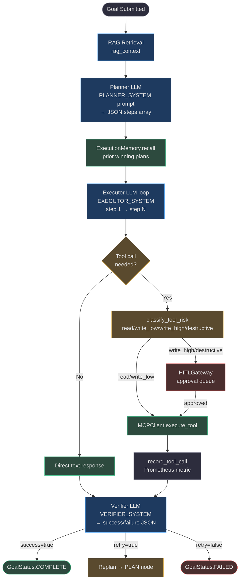
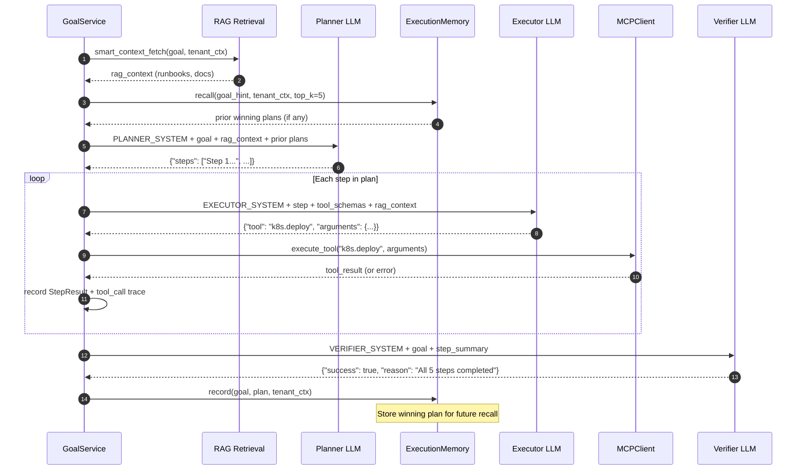
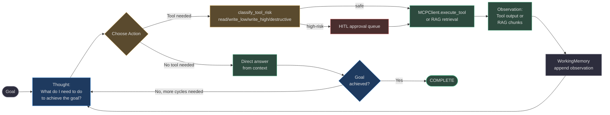
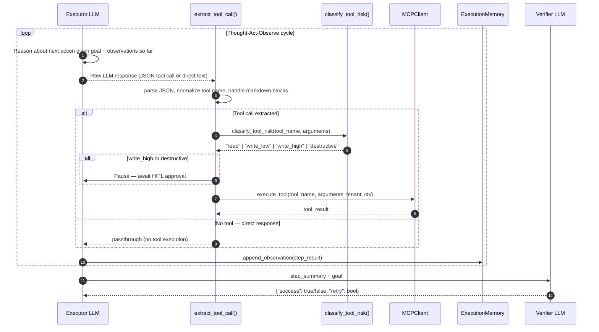
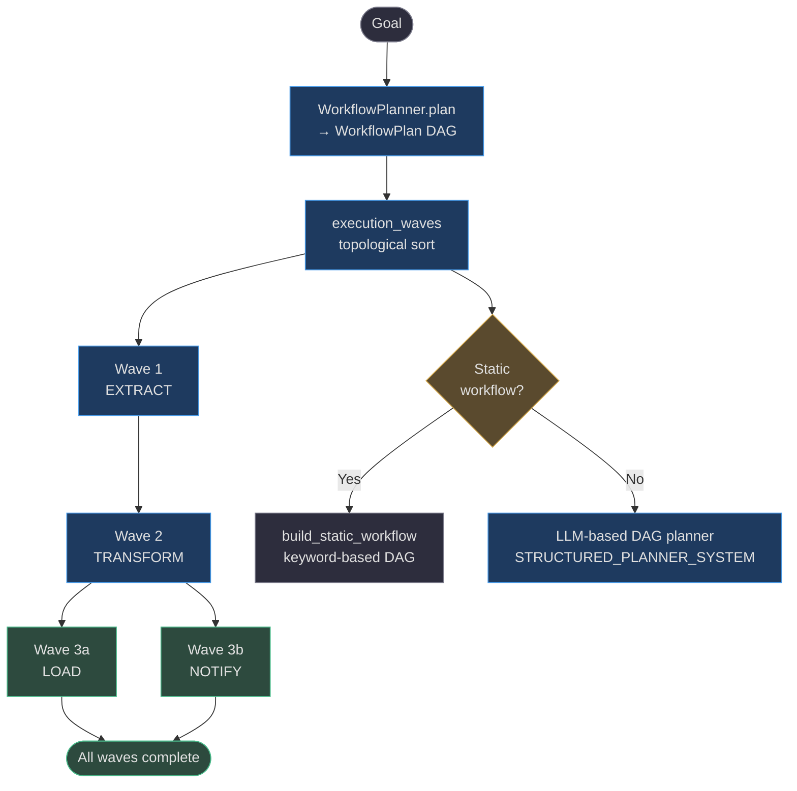
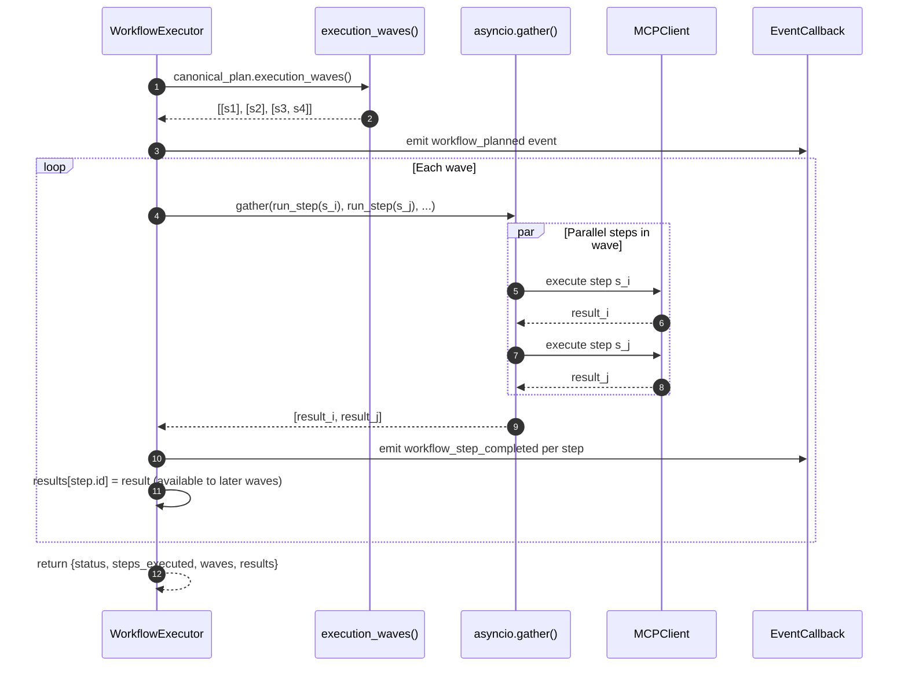
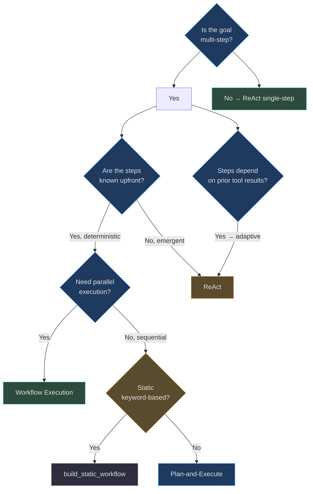

# Core Execution Patterns

Every goal submitted to AgentVerse is processed by one of three core execution patterns. These patterns are not high-level concepts — they are concrete LangGraph nodes wired into [`AgentGraph`](https://github.com/harsh786/agent-verse/blob/main/agent-verse-backend/app/agent/graph.py#L310), connected to real RAG strategies, memory stores, tool-risk classifiers, and scorecard evaluators.

| Pattern | Adapter Class | Graph Node | Best For |
|---|---|---|---|
| Plan-and-Execute | [`PlanExecutePattern`](https://github.com/harsh786/agent-verse/blob/main/agent-verse-backend/app/agent/patterns/plan_execute.py#L5) | `plan` | Multi-step goals with deterministic decomposition |
| ReAct | [`ReActPattern`](https://github.com/harsh786/agent-verse/blob/main/agent-verse-backend/app/agent/patterns/react.py#L5) | `execute` | Iterative reasoning where each action informs the next |
| Workflow Execution | [`WorkflowExecutor`](https://github.com/harsh786/agent-verse/blob/main/agent-verse-backend/app/agent/workflow_executor.py#L45) | `workflow_*` | Deterministic DAGs with parallel wave execution |

---

## 1. Plan-and-Execute

**Core idea:** Decompose the goal upfront, then execute each step sequentially. The planner LLM runs once; the executor LLM runs N times (once per step).

### Architecture



<!-- Sources:
- app/agent/graph.py (AgentGraph._build, topology comment lines 1-15, _DEFAULT_MAX_ITERATIONS L87)
- app/agent/prompts.py (PLANNER_SYSTEM L10, EXECUTOR_SYSTEM L17, VERIFIER_SYSTEM L40)
- app/agent/tool_risk.py (classify_tool_risk, ToolRisk type L9)
- app/governance/hitl.py (HITLGateway)
- app/observability/metrics.py (record_tool_call)
-->

### Real-World Example: DevOps Deployment Agent

**Goal:** _"Deploy the new payments microservice to staging, run smoke tests, and notify the team on Slack."_

The planner LLM receives [`PLANNER_SYSTEM`](https://github.com/harsh786/agent-verse/blob/main/agent-verse-backend/app/agent/prompts.py#L10) and produces:

```json
{
  "steps": [
    "Step 1: Build Docker image for payments-service from Dockerfile",
    "Step 2: Push image to container registry with tag v2.1.0",
    "Step 3: Deploy image to staging Kubernetes cluster",
    "Step 4: Run smoke tests against staging endpoint",
    "Step 5: Post deployment notification to #platform-eng Slack channel"
  ]
}
```
<!-- Source: app/agent/prompts.py:10 -->

**Why this works:**
- Step 3 contains `deploy` — matched by [`_HIGH_RISK_KEYWORDS`](https://github.com/harsh786/agent-verse/blob/main/agent-verse-backend/app/agent/graph.py#L90) — routes through HITL for approval
- [`classify_tool_risk("k8s.deploy")`](https://github.com/harsh786/agent-verse/blob/main/agent-verse-backend/app/agent/tool_risk.py#L55) returns `write_high`
- If Step 3 fails, verifier sets `retry=true` with specific `reason`, triggering replan from the `plan` node

### Sequence: RAG → Plan → Execute → Verify



<!-- Sources:
- app/agent/graph.py (AgentGraph topology, rag_retrieval node, _node_plan, _node_execute, _node_verify)
- app/pipeline/steps.py (smart_context_fetch)
- app/memory/execution.py (ExecutionMemory.recall, ExecutionMemory.record L28, L42)
- app/agent/prompts.py (PLANNER_SYSTEM, EXECUTOR_SYSTEM, VERIFIER_SYSTEM)
- app/mcp/client.py (MCPClient.execute_tool)
-->

### Full Ecosystem Integration

#### RAG

Before the planner receives the goal, [`smart_context_fetch()`](https://github.com/harsh786/agent-verse/blob/main/agent-verse-backend/app/pipeline/steps.py) retrieves relevant context. For a DevOps agent:

| Parameter | Value | Why |
|---|---|---|
| `strategy` | `RAGStrategy.HYBRID` | Operational docs benefit from both dense (semantic) and sparse (keyword) retrieval |
| `collection` | Agent-bound collection | Set via `_agent_collection_ids` on the graph instance |
| Chunker | `HeadingChunker` | Deployment runbooks have section structure — preserve it |
| Embedding | `code+text` modality | Deployment docs often contain CLI commands and YAML snippets |

The resolved strategies are defined in [`RAGStrategy`](https://github.com/harsh786/agent-verse/blob/main/agent-verse-backend/app/rag/contracts.py#L13) — 18 strategies from `NAIVE` through `RAFT`.

#### Memory

[`ExecutionMemory`](https://github.com/harsh786/agent-verse/blob/main/agent-verse-backend/app/memory/execution.py#L14) stores two types of records:

```python
# Record a winning plan after successful completion
exec_memory.record(
    goal="Deploy payments microservice to staging",
    plan=["Step 1: Build...", "Step 2: Push...", "Step 3: Deploy..."],
    tenant_ctx=tenant_ctx,
)

# Record a failure for negative examples
exec_memory.record_failure(
    goal="Deploy payments...",
    failed_step="Step 3: Deploy to K8s",
    error="ImagePullBackOff: registry auth failed",
    tenant_ctx=tenant_ctx,
)
```
<!-- Source: app/memory/execution.py:28-60 -->

Both are injected into the planner prompt as bias: _"use this proven plan structure"_ vs _"avoid this failed approach"_.

#### Prompting System

The three LLM roles have **intentionally separate** system prompts — changing one cannot accidentally affect the others ([`app/agent/prompts.py:7`](https://github.com/harsh786/agent-verse/blob/main/agent-verse-backend/app/agent/prompts.py#L7)):

| Role | Prompt Constant | Key Constraint |
|---|---|---|
| Planner | `PLANNER_SYSTEM` | JSON only: `{"steps": [...]}` |
| Executor | `EXECUTOR_SYSTEM` | Strict grounding rules — never fabricate IDs or counts |
| Verifier | `VERIFIER_SYSTEM` | `success/reason/retry` JSON; TOOL FAILED = not success |
| Structured Planner | `STRUCTURED_PLANNER_SYSTEM` | DAG format with `risk`, `depends_on`, `expected_output` |

The `EXECUTOR_SYSTEM` has six grounding rules that prevent hallucination ([`app/agent/prompts.py:17`](https://github.com/harsh786/agent-verse/blob/main/agent-verse-backend/app/agent/prompts.py#L17)):
- Never fabricate specific values (IDs, counts, dates) without tool evidence
- Never claim a tool succeeded without receiving tool output
- Never invent tool names outside the `ALLOWED TOOLS` list

#### Governance (HITL)

[`_is_high_risk_step()`](https://github.com/harsh786/agent-verse/blob/main/agent-verse-backend/app/agent/graph.py#L97) gates every step against `_HIGH_RISK_KEYWORDS`:

```python
_HIGH_RISK_KEYWORDS = frozenset(
    ("deploy", "delete", "drop", "prod", "production", "destroy", "wipe", "truncate")
)
```
<!-- Source: app/agent/graph.py:90 -->

When a step matches, the graph transitions to `GoalStatus.WAITING_HUMAN` until the `HITLGateway` receives `ApprovalStatus.APPROVED`.

#### Observability

Every tool call is traced by [`record_tool_call()`](https://github.com/harsh786/agent-verse/blob/main/agent-verse-backend/app/observability/metrics.py) (Prometheus counter), and plan latency by [`record_plan_duration()``. OpenTelemetry spans are created via the `AgentGraph._tracer` initialized from `opentelemetry.trace.get_tracer(__name__)`.

#### Evals

[`ScorecardResult`](https://github.com/harsh786/agent-verse/blob/main/agent-verse-backend/app/evals/runtime_scorecard.py#L33) scores 9 dimensions with these weights:

| Dimension | Weight | What it measures |
|---|---|---|
| `goal_success` | **0.30** | Did all planned steps COMPLETE? |
| `rag_quality` | 0.15 | Did retrieved context improve the plan quality? |
| `safety` | 0.15 | Any guardrail violations or policy breaches? |
| `grounding` | 0.10 | Were executor outputs grounded in tool results? |
| `tool_success_rate` | 0.10 | Fraction of tool calls that returned non-error results |
| `citation_quality` | 0.05 | Sources cited in final answer |
| `retrieval_confidence` | 0.05 | Average retrieval score of knowledge chunks |
| `latency` | 0.05 | Normalized inverse of wall-clock time |
| `cost_efficiency` | 0.05 | LLM tokens used vs task complexity |

### Configuration Reference

| Parameter | Default | Location | Effect |
|---|---|---|---|
| `max_iterations` | `100` | [`graph.py:87`](https://github.com/harsh786/agent-verse/blob/main/agent-verse-backend/app/agent/graph.py#L87) | Max plan→execute→verify cycles before termination |
| `enable_reflection` | `False` | [`graph.py:397`](https://github.com/harsh786/agent-verse/blob/main/agent-verse-backend/app/agent/graph.py#L397) | Enable `_node_reflect` after each failed step |
| `enable_goal_tree` | `False` | `AgentGraph.__init__` | Decompose into parallel sub-goals |
| `goal_tree_threshold` | `4` | `AgentGraph.__init__` | Decompose when plan has ≥ N steps |
| `autonomy_mode` | `bounded-autonomous` | `AgentGraph.__init__` | `supervised` / `bounded-autonomous` / `fully-autonomous` |
| `_hitl_timeout` | `300.0` | `AgentGraph.__init__` | Seconds to wait for human approval |

### When NOT to Use Plan-and-Execute

- **Goal requires real-time tool feedback to determine the next step** — use ReAct instead (the plan cannot adapt mid-execution)
- **Goal is a single atomic action** (e.g., "get current time") — a plan is overkill; overhead adds latency without benefit
- **Goal has many external dependencies** that frequently change — static upfront plans go stale; use Workflow with DAG dependency tracking
- **Latency SLA < 2 seconds** — planning adds one full LLM round-trip before any work starts

### Integration Checklist

Before deploying an agent with Plan-and-Execute:

- [ ] At least one `LLMProvider` configured for each role (planner, executor, verifier) — they can share the same provider but benefit from separate model routing
- [ ] `KnowledgeStore` or `retrieval_gateway` configured with an agent-bound collection for RAG context
- [ ] `ExecutionMemory` initialized (in-memory is sufficient for development; Postgres-backed for production cross-session memory)
- [ ] `HITLGateway` wired if any steps are expected to touch `deploy`, `delete`, or `prod` keywords
- [ ] `AuditLog` connected for compliance and post-mortem forensics
- [ ] Prometheus endpoint exposed for `record_plan_duration` / `record_tool_call` metrics

---

## 2. ReAct (Reason + Act)

**Core idea:** Interleaved Thought → Action → Observation cycles. Unlike Plan-and-Execute, the agent decides the _next_ action based on what the _previous_ action returned. The plan is implicit and emergent.

### Architecture



<!-- Sources:
- app/agent/patterns/react.py (ReActPattern.node_name="execute" L18)
- app/agent/graph.py (_node_execute method, tool call loop)
- app/agent/tool_calls.py (extract_tool_call L35)
- app/mcp/client.py (MCPClient.execute_tool)
- app/agent/tool_risk.py (classify_tool_risk)
-->

### Real-World Example: Customer Support Agent

**Goal:** _"Find order #ORD-2891 status and explain the delay."_

The executor receives [`EXECUTOR_SYSTEM`](https://github.com/harsh786/agent-verse/blob/main/agent-verse-backend/app/agent/prompts.py#L17) and begins the Thought-Act-Observe loop:

**Cycle 1:**
```
Thought: I need to look up order ORD-2891 in the order management system.
Action:  {"tool": "orders.get", "arguments": {"id": "ORD-2891"}}
Obs:     {"status": "delayed", "reason": "warehouse_capacity", "eta": "2026-08-20"}
```

**Cycle 2:**
```
Thought: The delay is 5 days. I should check compensation policy for delays > 5 days.
Action:  {"tool": "knowledge.search", "arguments": {"query": "delay compensation policy 5+ days"}}
Obs:     [knowledge chunk: "Orders delayed more than 5 business days qualify for 10% discount..."]
```

**Cycle 3:**
```
Thought: I have the order status and the compensation policy. I can now construct the answer.
Action:  null (no tool needed — direct synthesis from Cycles 1 and 2)
Output:  "Order #ORD-2891 is delayed due to warehouse capacity constraints (ETA: Aug 20). 
          As this delay exceeds 5 days, you qualify for a 10% discount on your next order."
```

### Sequence: Thought-Act-Observe with Tool Risk Classification



<!-- Sources:
- app/agent/tool_calls.py (extract_tool_call L35-L80, ToolCall dataclass L19)
- app/agent/tool_risk.py (classify_tool_risk, ToolRisk L9, _JIRA_READ_VERBS, _DESTRUCTIVE_TOKENS)
- app/mcp/client.py (MCPClient.execute_tool)
- app/memory/execution.py (ExecutionMemory, record/recall)
- app/agent/prompts.py (VERIFIER_SYSTEM L40)
-->

### Tool Call Parsing: `extract_tool_call()`

[`extract_tool_call()`](https://github.com/harsh786/agent-verse/blob/main/agent-verse-backend/app/agent/tool_calls.py#L35) handles the messy reality of LLM output:

| Input format | Handled? | Notes |
|---|---|---|
| Plain JSON `{"tool": ..., "arguments": ...}` | ✅ | Primary format |
| Markdown code block `` ```json {...} ``` `` | ✅ | Regex extraction |
| Anthropic `{"function": {"name": ..., "arguments": ...}}` | ✅ | Nested format |
| Jira tool aliases (`jirasearchissues`, `jiraissuesearch`) | ✅ | Canonicalized to `jira_search_issues` |
| Bare JSON array `[...]` | ❌ | Returns `None` — never a valid tool call |
| Malformed JSON (single quotes, trailing commas) | ✅ | Repair attempted |

### Tool Risk Taxonomy

[`classify_tool_risk()`](https://github.com/harsh786/agent-verse/blob/main/agent-verse-backend/app/agent/tool_risk.py#L9) maps every tool call to a risk level:

| Risk Level | Examples | Governance action |
|---|---|---|
| `read` | `orders.get`, `jira.list_issues`, `knowledge.search` | Execute immediately |
| `write_low` | `jira.comment`, `slack.post` | Execute with audit log entry |
| `write_high` | `jira.create_issue`, `github.create_pr`, `k8s.deploy` | Require `allow_write_high` permission |
| `destructive` | `db.delete`, `k8s.destroy`, `stripe.*` | Always route through HITL |

High-risk connectors (`stripe`, `payment`, `billing`, `production`) are **always at least `write_high`** regardless of verb, defined at [`tool_risk.py:52`](https://github.com/harsh786/agent-verse/blob/main/agent-verse-backend/app/agent/tool_risk.py#L52).

### Ecosystem Integration

#### RAG as a First-Class Tool

In ReAct, RAG is not a pre-retrieval step — it is a **tool the agent chooses to call**. The executor can decide: _"I need more context about X"_ and issue a `knowledge.search` tool call. This gives the agent agency over when and what to retrieve.

The agent can also issue a `web.search` tool call if the knowledge base doesn't have fresh information, selecting `RAGStrategy.WEB_AUGMENTED` for the step.

#### Memory: WorkingMemory vs EpisodicMemory

| Memory type | Scope | Stored in | Used for |
|---|---|---|---|
| `ExecutionMemory` | Per-goal | In-memory / Postgres | Cross-step output accumulation |
| Episodic (via `episodic_memory`) | Per-session | Redis / Postgres | Full Thought-Act-Observe audit trail |
| `LongTermMemoryStore` | Cross-session | Postgres vector store | Recall of similar past goals |

The `AgentGraph` constructor accepts `episodic_memory` and `procedural_memory` as optional injectable stores ([`graph.py`](https://github.com/harsh786/agent-verse/blob/main/agent-verse-backend/app/agent/graph.py#L430)).

#### Guardrails v2

When `_GUARDRAILS_AVAILABLE=True`, every executor response passes through [`guardrails_engine`](https://github.com/harsh786/agent-verse/blob/main/agent-verse-backend/app/guardrails_v2/engine.py) before tool execution. This runs layered checks at `GuardrailLayer` levels (defined in `app/guardrails_v2/models.py`).

### When NOT to Use ReAct

- **Goal requires parallelism** — ReAct is strictly sequential; use Workflow with `execution_waves()` for concurrent steps
- **Goal is purely generative** (write an essay) — no tool calls needed; ReAct overhead without benefit
- **Strict latency requirements** — every Thought-Act-Observe cycle is one full LLM call; 5 cycles = 5× latency vs Plan-and-Execute

### Integration Checklist

- [ ] `MCPClient` configured with at least one tool server (otherwise executor can never call tools)
- [ ] `knowledge_store` or `retrieval_gateway` available (for in-loop RAG tool calls)
- [ ] `PolicyEngine` wired (governs which tools are callable for this tenant)
- [ ] `circuit_breakers` configured for external tool services (prevent cascading failures)
- [ ] `DeduplicationCache` enabled (prevents the same tool call from executing twice if the agent loops)

---

## 3. Workflow Planning & Execution

**Core idea:** When the goal maps to a deterministic sequence of steps (data pipelines, ETL jobs, multi-connector orchestration), a static or LLM-generated DAG is more reliable than emergent planning. Steps with no mutual dependencies run in **parallel waves** via `asyncio.gather()`.

### DAG Architecture: Waves of Parallel Execution



<!-- Sources:
- app/agent/workflow_planner.py (WorkflowPlan.execution_waves L82, build_static_workflow L27, WorkflowPlanner class L130)
- app/agent/workflow_executor.py (WorkflowExecutor.execute L75, asyncio.gather for parallel waves)
- app/agent/structured_plan.py (StructuredPlan, StructuredStep L1-40)
- app/agent/prompts.py (STRUCTURED_PLANNER_SYSTEM L82)
-->

### Real-World Example: Monthly Sales Report Pipeline

**Goal:** _"Run the monthly sales report: extract from DB, transform with Python, load to Data Warehouse, email to stakeholders."_

[`build_static_workflow()`](https://github.com/harsh786/agent-verse/blob/main/agent-verse-backend/app/agent/workflow_planner.py#L27) generates a `StructuredPlan` by keyword matching:

```python
# From build_static_workflow() — keyword-based step generation
if "jira" in goal_lower:
    add_step("jira", "fetch_open_issues", [])
if "confluence" in goal_lower:
    add_step("confluence", "create_summary_page", [jira_step_id])
if "mail" in goal_lower or "email" in goal_lower:
    add_step("email", "send_summary_email", [all_prior_step_ids])
```
<!-- Source: app/agent/workflow_planner.py:35-50 -->

For the sales report, the **LLM-based** `WorkflowPlanner.plan()` generates a richer DAG using [`STRUCTURED_PLANNER_SYSTEM`](https://github.com/harsh786/agent-verse/blob/main/agent-verse-backend/app/agent/prompts.py#L82):

```json
{
  "steps": [
    {"id": "s1", "description": "Extract sales data from Postgres", "tool": "db.query",
     "depends_on": [], "risk": "read"},
    {"id": "s2", "description": "Transform: compute totals and categorize returns",
     "tool": "python.execute", "depends_on": ["s1"], "risk": "read"},
    {"id": "s3", "description": "Load transformed data to BigQuery",
     "tool": "bigquery.insert", "depends_on": ["s2"], "risk": "write_low"},
    {"id": "s4", "description": "Email report to stakeholders",
     "tool": "email.send", "depends_on": ["s2"], "risk": "write_low"}
  ]
}
```

`execution_waves()` produces: **Wave 1** = `[s1]`, **Wave 2** = `[s2]`, **Wave 3** = `[s3, s4]` (parallel).

### Sequence: Wave Execution with asyncio.gather



<!-- Sources:
- app/agent/workflow_executor.py (WorkflowExecutor.execute L75, run_step inner func, asyncio.gather)
- app/agent/workflow_planner.py (WorkflowPlan.execution_waves L82)
- app/agent/workflow_executor.py (event_callback pattern, results dict cross-step passing)
-->

### WorkflowStep vs StructuredStep

Two dataclass types represent workflow steps depending on the origin:

| Type | Origin | Key fields | Source |
|---|---|---|---|
| [`WorkflowStep`](https://github.com/harsh786/agent-verse/blob/main/agent-verse-backend/app/agent/workflow_planner.py#L52) | LLM-generated DAG | `id`, `depends_on`, `can_parallel`, `estimated_minutes` | `workflow_planner.py:52` |
| [`StructuredStep`](https://github.com/harsh786/agent-verse/blob/main/agent-verse-backend/app/agent/structured_plan.py#L40) | Parsed JSON plan | `connector_name`, `agent_id`, `intent`, `condition`, `loop_until` | `structured_plan.py:40` |

`WorkflowExecutor._canonical_plan()` normalizes both into `StructuredPlan` before wave computation.

### Ecosystem Integration

#### RAG in Workflow Steps

A step with `"tool": "rag"` is handled by [`execute_rag_node()`](https://github.com/harsh786/agent-verse/blob/main/agent-verse-backend/app/agent/workflow_nodes.py) in the executor. The `strategy` field is resolved via [`resolve_rag_strategy()`](https://github.com/harsh786/agent-verse/blob/main/agent-verse-backend/app/rag/contracts.py#L70):

```python
# From WorkflowPlan.from_dict() — RAG step strategy resolution
if step.get("tool") == "rag":
    step["strategy"] = resolve_rag_strategy(
        step.get("strategy", RAGStrategy.HYBRID.value)
    ).value
```
<!-- Source: app/agent/workflow_planner.py:96 -->

The TRANSFORM step retrieves business rules using `RAGStrategy.HYBRID` — combining pgvector similarity with BM25 keyword matching for operational knowledge.

#### Cross-Step Result Passing

The `results` dict accumulates step outputs and is passed to each subsequent step:

```python
# WorkflowExecutor.execute() — cross-step context
results: dict[str, Any] = {}
# ...
result = await self._run_step(
    step, prior_results=results  # ← later steps can access earlier results
)
results[step.id] = result
```
<!-- Source: app/agent/workflow_executor.py:105 -->

This means the TRANSFORM step can reference `results["s1"]["data"]` (the EXTRACT output) via the `ToolContext` passed to each step execution.

### Performance vs Cost Tradeoff

```
Plan-and-Execute  : [PLAN LLM] ──→ [EXEC LLM×N] ──→ [VERIFY LLM]
                    Cost: 3+ LLM calls. Linear execution. Can replan.

ReAct             : [EXEC LLM×T] ──→ [VERIFY LLM]
                    Cost: T+1 LLM calls (T = thought-act cycles). No upfront plan.

Workflow (Static) : [NO LLM for planning] ──→ [EXEC parallel waves]
                    Cost: 0 planning LLM calls. Fastest. No replanning.

Workflow (LLM DAG): [1 LLM for DAG] ──→ [EXEC parallel waves]
                    Cost: 1 planning call. Parallel execution. No replanning.

Legend: N = number of plan steps, T = Thought-Act cycles
```

### When NOT to Use Workflow Execution

- **Goal requires dynamic replanning** — workflows are static DAGs; if Step 2 fails and recovery requires a different Step 3, use Plan-and-Execute
- **Goal is exploratory** (e.g., research, open-ended analysis) — the correct steps aren't known upfront
- **Steps have complex conditional branches** beyond simple `condition`/`loop_until` fields in `StructuredStep`

### Integration Checklist

- [ ] `WorkflowPlanner` initialized with an `LLMProvider` for LLM-based DAG generation (or use `build_static_workflow()` for keyword-based goals)
- [ ] `MCPClient` available for step execution
- [ ] `retrieval_gateway` available for `"tool": "rag"` workflow steps
- [ ] `event_callback` wired for streaming execution events to the frontend via SSE (`GoalService` SSE pipeline)
- [ ] `PatternLimits` configured via `orchestration.runtime_profile.default_pattern_limits()` for max-step safety bounds

---

## Pattern Selection Guide



<!-- Sources:
- app/agent/patterns/__init__.py (ALL_PATTERNS registry L27)
- app/agent/graph.py (AgentGraph topology comment L1-15)
- app/agent/workflow_planner.py (build_static_workflow, WorkflowPlanner)
-->

---

## Related Pages

| Page | Relationship |
|---|---|
| [Self-Improvement Patterns](./02-self-improvement-patterns.md) | Reflection and Reflexion augment Plan-and-Execute post-execution |
| [RAG Strategies](../rag/01-rag-strategies.md) | 18 strategies that power the `rag_context` field |
| [Memory Architecture](../memory/01-memory-architecture.md) | ExecutionMemory, LongTermMemory, ReflexionStore |
| [Governance & HITL](../governance/01-governance.md) | Tool risk classification, approval queues |
| [Evals & Scorecards](../evals/01-runtime-scorecard.md) | ScorecardResult dimensions and SelfImprovementEngine |
| [MCP Client](../mcp/01-mcp-client.md) | How tools are discovered, registered, and called |
