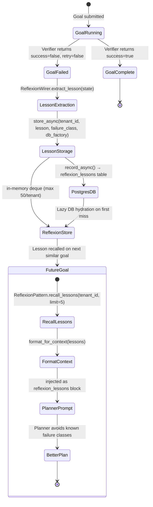
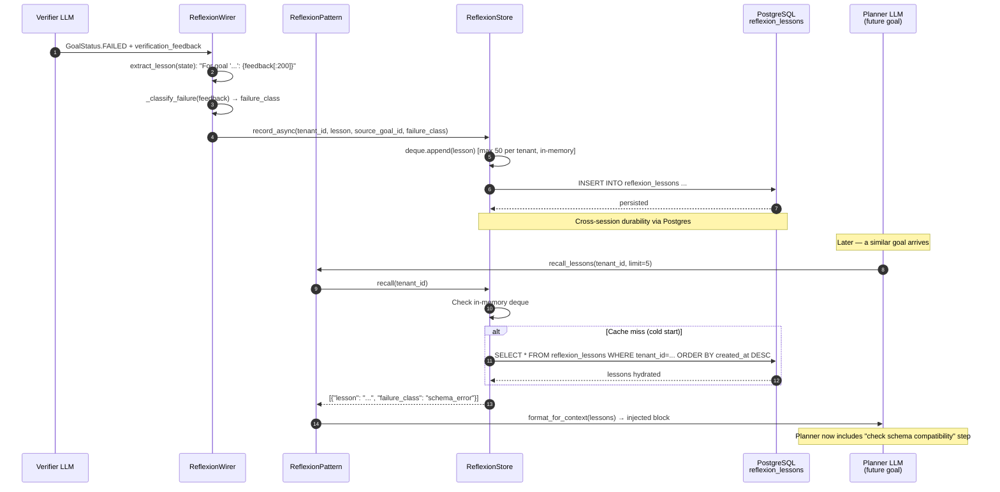
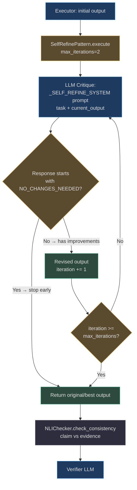
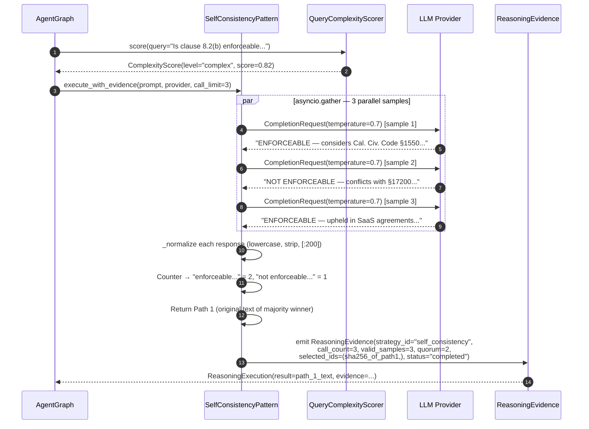
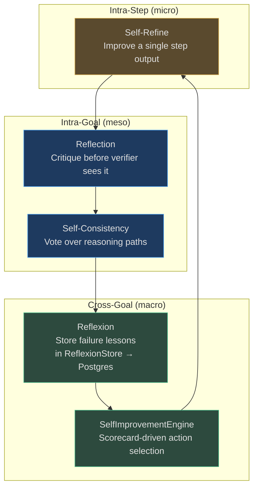

# Self-Improvement Patterns

These four patterns form the **learning layer** of AgentVerse — they are what distinguish a stateless request-response agent from one that improves across goals and sessions. Each pattern operates at a different time horizon and granularity.

| Pattern | When it runs | Time horizon | Backed by |
|---|---|---|---|
| [Reflection](#1-reflection) | After each execution step | Intra-goal | LLM critique node (`_node_reflect`) |
| [Reflexion](#2-reflexion) | After goal failure | Cross-goal (session) | `ReflexionStore` + Postgres |
| [Self-Refine](#3-self-refine) | Before step output is finalized | Intra-step | `SelfRefinePattern.execute()` |
| [Self-Consistency](#4-self-consistency) | At answer synthesis | Per-question | Majority-vote over N parallel LLM samples |

---

## 1. Reflection

**Core idea:** Before the verifier judges the whole goal, each step output is critiqued by the same LLM that produced it. The reflection node [`_node_reflect`](https://github.com/harsh786/agent-verse/blob/main/agent-verse-backend/app/agent/patterns/reflection.py#L22) intercepts poor outputs before they propagate.

### When Reflection Fires

Reflection is gated by [`enable_reflection`](https://github.com/harsh786/agent-verse/blob/main/agent-verse-backend/app/agent/graph.py#L397) on the `AgentGraph`. When enabled, the LangGraph topology gains an additional node:

```
START → rag_retrieval → plan → execute → reflect → verify → ...
                                    ↑__________________________|
                                         (on retry)
```

The `ReflectionPattern.node_name` is `"_node_reflect"` — identical to the Reflexion pattern — but they serve different purposes: Reflection is **intra-goal quality control**; Reflexion is **cross-goal lesson storage**.

### Architecture

```mermaid
graph TB
    EXEC3[Executor LLM<br>step output]:::primary --> REFLECT{Reflection<br>_node_reflect}:::warning
    REFLECT --> CRITIQUE[REFLECTION_SYSTEM prompt<br>self-critique of step output]:::primary
    CRITIQUE --> ISSUES{Issues<br>identified?}:::warning
    ISSUES -- Yes, fixable --> REVISE[Revised step output]:::success
    ISSUES -- No issues --> PASSTHROUGH[Original output passes through]:::neutral
    REVISE --> KG[KnowledgeGraph lookup<br>verify API consistency]:::neutral
    KG --> RAG_Q[Targeted RAG query:<br>"coding conventions for {lang}"]:::primary
    RAG_Q --> VERIFY3[Verifier LLM<br>judges revised output]:::primary
    PASSTHROUGH --> VERIFY3
    VERIFY3 -- success --> NEXT([Next step / COMPLETE]):::success
    VERIFY3 -- retry --> REPLAN2([Replan]):::danger

    classDef primary fill:#1e3a5f,stroke:#4a9eed,color:#e0e0e0
    classDef success fill:#2d4a3e,stroke:#4aba8a,color:#e0e0e0
    classDef warning fill:#5a4a2e,stroke:#d4a84b,color:#e0e0e0
    classDef danger fill:#4a2e2e,stroke:#d45b5b,color:#e0e0e0
    classDef neutral fill:#2d2d3d,stroke:#7a7a8a,color:#e0e0e0
```

<!-- Sources:
- app/agent/patterns/reflection.py (ReflectionPattern, node_name="_node_reflect" L22)
- app/agent/graph.py (enable_reflection flag L397, _node_reflect graph node)
- app/agent/prompts.py (REFLECTION_SYSTEM L55-approx)
- app/context/prompt_builder.py (build_executor_context with reflexion_lessons)
-->

### Real-World Example: Code Review Agent

**Goal:** _"Implement a `validate_user_email()` function following project conventions."_

**Without Reflection:**
```python
def validate_user_email(email):
    import re
    return bool(re.match(r"[^@]+@[^@]+\.[^@]+", email))
```
→ Verifier accepts. Ships with `import` inside function body, missing return type annotation, no docstring.

**With Reflection enabled:**

Step output hits `_node_reflect`. [`REFLECTION_SYSTEM`](https://github.com/harsh786/agent-verse/blob/main/agent-verse-backend/app/agent/prompts.py#L55) generates:

```
Self-critique:
1. Import inside function body — project convention puts imports at module top
2. Missing return type annotation — project enforces Python 3.12 type hints
3. Regex allows invalid TLDs (e.g. "a@b.c" passes) — should use stricter pattern
4. No docstring
```

Reflection also triggers a targeted RAG query: `"email validation coding conventions Python"` against the project's knowledge collection, returning code style guidelines that confirm convention #1 and #2.

**Revised output:**
```python
import re

_EMAIL_RE = re.compile(r"^[a-zA-Z0-9._%+-]+@[a-zA-Z0-9.-]+\.[a-zA-Z]{2,}$")

def validate_user_email(email: str) -> bool:
    """Return True if email is syntactically valid per RFC 5321."""
    return bool(_EMAIL_RE.match(email))
```
→ Verifier accepts the revised version.

### Ecosystem Integration

#### Prompting with Reflexion Lessons

The reflection prompt is built via [`PromptContextBundle`](https://github.com/harsh786/agent-verse/blob/main/agent-verse-backend/app/context/prompt_builder.py) and includes:

| Context field | Source | Purpose |
|---|---|---|
| `current_output` | Last executor step result | The text to critique |
| `coding_standards_chunks` | RAG retrieval on "coding conventions" | Ground the critique in project-specific rules |
| `reflexion_lessons` | `ReflexionStore.recall()` | "Last time we saw this pattern, here's what went wrong" |
| `procedural_memory` | `ProceduralMemory` store | Known-good patterns for this domain |

#### KnowledgeGraph Verification

For code generation goals, the reflection node can query the KnowledgeGraph to verify API consistency — e.g., checking whether the function signature matches the interface it is supposed to implement. The `Function→Calls→Function` and `Class→Implements→Interface` edge types are relevant here.

#### Memory Storage of Reflection Findings

Pattern-specific reflection findings are stored in `ProceduralMemory` (injected into `AgentGraph` as `procedural_memory`). This means: if the reflection catches a specific anti-pattern (e.g., `import` inside function body), that finding is available to future goals via `procedural_memory.recall()`.

### Configuration Reference

| Parameter | Default | How to set | Effect |
|---|---|---|---|
| `enable_reflection` | `False` | `AgentGraph(enable_reflection=True)` | Adds `_node_reflect` to LangGraph topology |
| `REFLECTION_SYSTEM` | See `prompts.py` | Edit `app/agent/prompts.py` | Controls the self-critique prompt |
| Via `runtime_profile` | — | `reasoning_patterns=["reflection"]` | Automatically sets `enable_reflection=True` |

### When NOT to Use Reflection

- **Latency-sensitive goals** — reflection adds one LLM call per step. 5 steps × 2 (execute + reflect) = 10 LLM calls instead of 5
- **Pure data retrieval goals** — reflection adds no value when the step output is just a raw tool result (e.g., `orders.get` returns a JSON record; there's nothing to self-critique)
- **Goals with strict determinism requirements** — reflection may change outputs non-deterministically between runs

### Integration Checklist

- [ ] `enable_reflection=True` passed to `AgentGraph` constructor (or set via `reasoning_patterns` in the runtime profile)
- [ ] `REFLECTION_SYSTEM` prompt reviewed and tuned for the agent's domain
- [ ] `knowledge_store` available for the targeted "coding conventions" RAG query inside reflection
- [ ] `ProceduralMemory` store (optional) for cross-goal pattern learning from reflection findings

---

## 2. Reflexion

**Core idea:** When a goal **fails**, extract the lesson from the verifier's feedback and store it in `ReflexionStore`. When a similar goal runs in the future, recall these lessons and inject them into the planner prompt — so the agent avoids repeating the same mistake.

> Reflexion is the closest AgentVerse comes to **true machine learning without gradient descent**: it learns from failure by storing natural-language lessons in a retrieval-augmented memory.

### Architecture: Failure → Lesson → Memory → Future Plan



<!-- Sources:
- app/agent/patterns/reflexion.py (ReflexionPattern.store_lesson L52, recall_lessons L75, format_for_context L80)
- app/agent/reflexion_wirer.py (ReflexionWirer.extract_lesson L30, maybe_store_async L38)
- app/state_runtime/reflexion_store.py (ReflexionStore, record L20, recall L29, record_async L55, max_per_tenant=50)
- app/agent/state.py (GoalStatus.FAILED L22)
-->

### Real-World Example: Database Migration Failure Recovery

**Monday — Goal fails:**

Goal: _"Migrate users table from MySQL to Postgres."_

Verifier feedback: `"Migration failed: schema mismatch — users.email column is VARCHAR(100) in MySQL but TEXT in Postgres. 3 rows violated NOT NULL constraint on phone_number."`

[`ReflexionWirer.extract_lesson()`](https://github.com/harsh786/agent-verse/blob/main/agent-verse-backend/app/agent/reflexion_wirer.py#L30) fires:
```python
lesson = "For goal 'Migrate users table from MySQL to Postgres': Migration failed: " \
         "schema mismatch — users.email column is VARCHAR(100) in MySQL but TEXT..."
failure_class = _classify_failure(feedback)  # → "schema_error"
```

[`ReflexionPattern.store_lesson()`](https://github.com/harsh786/agent-verse/blob/main/agent-verse-backend/app/agent/patterns/reflexion.py#L52) persists this:
```python
await store.record_async(
    tenant_id="acme-corp",
    lesson=lesson,
    source_goal_id="goal-xyz-123",
    failure_class="schema_error",
    db_factory=db_factory,
)
```
<!-- Source: app/agent/patterns/reflexion.py:65 -->

**Friday — Similar goal:**

Goal: _"Migrate orders table from MySQL to Postgres."_

[`recall_lessons(tenant_id="acme-corp", limit=5)`](https://github.com/harsh786/agent-verse/blob/main/agent-verse-backend/app/agent/patterns/reflexion.py#L75) returns the Monday lesson.

[`format_for_context(lessons)`](https://github.com/harsh786/agent-verse/blob/main/agent-verse-backend/app/agent/patterns/reflexion.py#L80) produces:
```
[Reflexion lessons from past failures — avoid these mistakes:]
  1. For goal 'Migrate users table from MySQL to Postgres': Migration failed: schema mismatch...
     (class: schema_error)
```

This block is injected into the planner prompt. The planner now generates:
```json
{
  "steps": [
    "Step 1: Compare column types between MySQL orders table and target Postgres schema",
    "Step 2: Verify NOT NULL constraints — check for NULL values in all NOT NULL columns",
    "Step 3: Run migration with schema transformation if type mismatches found",
    "Step 4: Validate row counts match between source and target"
  ]
}
```

The Friday migration succeeds. The schema comparison and NULL check steps (Steps 1-2) were added **because of the lesson from Monday**.

### Sequence: Failure → Lesson → Future Goal



<!-- Sources:
- app/agent/reflexion_wirer.py (ReflexionWirer.extract_lesson L30, maybe_store_async L38, _classify_failure)
- app/agent/patterns/reflexion.py (store_lesson L52, recall_lessons L75, format_for_context L80)
- app/state_runtime/reflexion_store.py (record L20, record_async L55, recall L29 with lazy DB hydration)
- app/evals/self_improvement_engine.py (STORE_REFLEXION_LESSON decision L48)
-->

### The Daily Improvement Loop: `process_feedback_batch`

[`SelfImprovementEngine.decide_actions()`](https://github.com/harsh786/agent-verse/blob/main/agent-verse-backend/app/evals/self_improvement_engine.py#L32) runs after every goal and triggers lesson storage when:

```python
if scores.get("goal_success", 1.0) < 0.7 or scores.get("tool_success_rate", 1.0) < 0.5:
    if state and (state.verification_feedback or "").strip():
        actions.append(ImprovementDecision(
            action_type=ImprovementAction.STORE_REFLEXION_LESSON,
            reason="goal failed with actionable feedback",
            metadata={"feedback": (state.verification_feedback or "")[:200]},
        ))
```
<!-- Source: app/evals/self_improvement_engine.py:45 -->

This creates a continuous improvement loop:

```
Low goal_success score
    → SelfImprovementEngine decides STORE_REFLEXION_LESSON
    → ReflexionWirer persists lesson to DB
    → Next similar goal: lesson recalled into planner
    → Planner adds remediation step
    → goal_success improves
    → Loop continues
```

### Ecosystem Integration

| Component | Role in Reflexion |
|---|---|
| `ReflexionStore` | Hot-path in-memory deque + cold-path Postgres persistence |
| `ReflexionWirer` | Triggered after `GoalStatus.FAILED`; classifies failure, extracts lesson |
| `SelfImprovementEngine` | Decides `STORE_REFLEXION_LESSON` when `goal_success < 0.7` |
| `LongTermMemoryStore` | Lessons are also propagated here for cross-agent knowledge sharing |
| `PromptContextBundle.reflexion_lessons` | The planner prompt field that receives formatted lessons |

#### Failure Classification

[`_classify_failure()`](https://github.com/harsh786/agent-verse/blob/main/agent-verse-backend/app/agent/reflexion_wirer.py#L75) maps verifier feedback to structured classes:

| Failure class | Keywords in feedback | What it means |
|---|---|---|
| `schema_error` | schema, column, type mismatch | Data structure incompatibility |
| `auth_error` | permission, unauthorized, credentials | Auth/RBAC failure |
| `network_error` | timeout, connection refused, unreachable | Connectivity failure |
| `tool_error` | tool failed, TOOL FAILED | MCP tool execution failure |
| `unknown` | (default) | Unclassifiable failure |

### Configuration Reference

| Parameter | Default | Location | Effect |
|---|---|---|---|
| `max_per_tenant` | `50` | [`reflexion_store.py:13`](https://github.com/harsh786/agent-verse/blob/main/agent-verse-backend/app/state_runtime/reflexion_store.py#L13) | Max lessons kept per tenant in-memory |
| `limit` in `recall_lessons` | `5` | [`reflexion.py:75`](https://github.com/harsh786/agent-verse/blob/main/agent-verse-backend/app/agent/patterns/reflexion.py#L75) | Max lessons injected into planner prompt |
| `feedback[:200]` | 200 chars | [`reflexion.py:63`](https://github.com/harsh786/agent-verse/blob/main/agent-verse-backend/app/agent/patterns/reflexion.py#L63) | Max feedback length stored per lesson |
| `goal[:60]` | 60 chars | `reflexion.py:57` | Max goal text in lesson prefix |

### When NOT to Use Reflexion

- **Single-run agents** (CI pipelines with no goal history) — no lessons to recall if the agent never fails or always starts fresh
- **High privacy tenants** — lessons contain excerpts from `verification_feedback` which may contain sensitive goal data; consider redacting before storage
- **Agents with extremely varied goals** — lessons from a `schema_error` on a DB migration won't help a customer support agent; similarity-based recall prevents most false matches, but cross-domain pollution can occur

### Integration Checklist

- [ ] `ReflexionWirer` initialized with `store=ReflexionStore()` and `db_factory` for Postgres persistence
- [ ] `ReflexionWirer.maybe_store_async()` called in the goal completion hook (or in `AgentGraph` post-run logic)
- [ ] `SelfImprovementEngine` wired into the post-goal scorecard pipeline
- [ ] Postgres migration `0087` applied (creates `reflexion_lessons` table)
- [ ] `PromptContextBundle` receiving the `reflexion_lessons` field in planner context assembly

---

## 3. Self-Refine

**Core idea:** After the executor generates a step output, the LLM is asked to critique and improve it — up to `max_iterations` rounds. The process terminates early when the LLM signals `NO_CHANGES_NEEDED`.

### Architecture



<!-- Sources:
- app/agent/patterns/self_refine.py (SelfRefinePattern L22, execute L50, _SELF_REFINE_SYSTEM L12)
- app/intelligence/nli_checker.py (NLIChecker.check_consistency L45)
- app/agent/graph.py (enable_self_refine flag, _node_refine)
- app/agent/patterns/self_refine.py (NO_CHANGES_NEEDED sentinel L70)
-->

### Real-World Example: Marketing Email Campaign

**Goal:** _"Write an email campaign for the Q3 product launch."_

**Round 0 — Initial draft:**
```
Subject: Exciting new features in our Q3 product launch!!! (52 chars)
Body: Dear valued customer, we are thrilled to announce...
[CTA buried in paragraph 3]
```

**Round 1 — Self-critique:**
The LLM evaluates against [`_SELF_REFINE_SYSTEM`](https://github.com/harsh786/agent-verse/blob/main/agent-verse-backend/app/agent/patterns/self_refine.py#L12):
```
Issues found:
- Subject line is 52 chars (email clients truncate at ~45)
- CTA "Start Free Trial" is buried in paragraph 3
- Triple exclamation mark looks spammy
- Tone inconsistent with brand voice guidelines
```

**Round 1 — Revised draft:**
```
Subject: Q3 launch: what's new for your team (42 chars) ✓
Body: [Shorter opener] [CTA in paragraph 1] [Brand voice compliant]
```

**Round 2 — Self-critique:**
```
Response: NO_CHANGES_NEEDED
```
→ Early termination. Final output returned after 1 actual improvement round.

The [`execute_with_evidence()`](https://github.com/harsh786/agent-verse/blob/main/agent-verse-backend/app/agent/patterns/self_refine.py#L88) method returns a [`ReasoningExecution`](https://github.com/harsh786/agent-verse/blob/main/agent-verse-backend/app/agent/reasoning_evidence.py#L18) with:
```python
ReasoningEvidence(
    strategy_id="self_refine",
    status="completed",
    call_count=2,           # 1 initial + 1 round of refinement
    critique_categories=("clarity", "evidence"),
    checkpoint_cursor={"round": 1},
    safe_rationale_summary="self-refine completed in 1 round",
)
```

### Sequence: Refine Loop with Evidence Collection

```mermaid
sequenceDiagram
    autonumber
    participant AG as AgentGraph
    participant SR2 as SelfRefinePattern
    participant LLM2 as LLM (temperature=0)
    participant NLI2 as NLIChecker

    AG->>SR2: execute(last_output, task, provider, current_iteration=0)
    SR2->>SR2: Check: iteration(0) < max_iterations(2)? → proceed
    SR2->>LLM2: [_SELF_REFINE_SYSTEM] + task + current_output[:2000]
    LLM2-->>SR2: "Improved version with shorter subject and CTA in para 1..."
    Note over SR2: Response does NOT start with NO_CHANGES_NEEDED
    SR2->>SR2: iteration=1; last_output = revised text

    SR2->>SR2: Check: iteration(1) < max_iterations(2)? → proceed
    SR2->>LLM2: [_SELF_REFINE_SYSTEM] + task + revised_output[:2000]
    LLM2-->>SR2: "NO_CHANGES_NEEDED"
    Note over SR2: Early termination — NO_CHANGES_NEEDED detected
    SR2-->>AG: ReasoningExecution(result=revised_text, call_count=2)

    AG->>NLI2: check_consistency(claim=revised_text, evidence=product_spec)
    NLI2-->>AG: NLIResult(verdict="ENTAILS", confidence=0.9)
    AG->>AG: Proceed to verifier
```

<!-- Sources:
- app/agent/patterns/self_refine.py (execute L50, execute_with_evidence L88, NO_CHANGES_NEEDED L70)
- app/agent/reasoning_evidence.py (ReasoningEvidence L8, ReasoningExecution L28, critique_categories L50)
- app/intelligence/nli_checker.py (NLIChecker, check_consistency, NLIResult L25)
-->

### The `NO_CHANGES_NEEDED` Contract

The system prompt [`_SELF_REFINE_SYSTEM`](https://github.com/harsh786/agent-verse/blob/main/agent-verse-backend/app/agent/patterns/self_refine.py#L12) establishes a binary contract with the LLM:

> "Either return the improved output, or return exactly `NO_CHANGES_NEEDED` if the output is already excellent."

The detection logic:
```python
refined = (resp.content or "").strip()
if refined and not refined.startswith("NO_CHANGES_NEEDED"):
    return refined  # Use the improvement
# else: return last_output unchanged
```
<!-- Source: app/agent/patterns/self_refine.py:72 -->

This is deliberately simple: no complex parsing, no scoring — just a sentinel string. This makes it robust to LLM variability.

### Ecosystem Integration

#### RAG Inside Refinement

Brand voice guidelines, style guides, and successful campaign templates are retrieved via `RAGStrategy.ADAPTIVE` before the refine prompt is built. The retrieved chunks become part of the `task` description:

```
Task: Write an email campaign for Q3 product launch.
Brand guidelines: [retrieved chunk from knowledge base]
Style guide: [retrieved chunk]
Successful template: [retrieved chunk]

Current output:
[previous draft]

Improve this output. If already perfect: NO_CHANGES_NEEDED
```

#### NLI Consistency Check

After refinement, [`NLIChecker.check_consistency()`](https://github.com/harsh786/agent-verse/blob/main/agent-verse-backend/app/intelligence/nli_checker.py#L45) verifies the refined output doesn't fabricate product features:

| Verdict | Meaning | Action |
|---|---|---|
| `ENTAILS` | Evidence clearly supports the claim | Proceed to verifier |
| `CONTRADICTS` | Refined output contradicts product spec | Trigger another refinement round |
| `NEUTRAL` | Unrelated (no grounding issue detected) | Proceed with caution |

The `NLIChecker` uses the same LLM provider as the agent, formatted with `_NLI_PROMPT` ([`nli_checker.py:18`](https://github.com/harsh786/agent-verse/blob/main/agent-verse-backend/app/intelligence/nli_checker.py#L18)).

#### Eval Scoring with ScorecardResult

Each refinement round can be scored independently using [`ScorecardResult`](https://github.com/harsh786/agent-verse/blob/main/agent-verse-backend/app/evals/runtime_scorecard.py#L33). Comparing round scores allows the `SelfImprovementEngine` to detect diminishing returns and stop refinement before `max_iterations`.

### Configuration Reference

| Parameter | Default | Location | Effect |
|---|---|---|---|
| `max_iterations` | `2` | [`self_refine.py:22`](https://github.com/harsh786/agent-verse/blob/main/agent-verse-backend/app/agent/patterns/self_refine.py#L22) | Maximum refinement rounds per step |
| `max_tokens` | `2000` | `execute()` signature | Max tokens for refined output |
| `temperature` | `0.0` | Hard-coded in `execute()` | Deterministic critique — ensures reproducibility |
| `enable_self_refine` | `False` | `AgentGraph.__init__` | Enable `_node_refine` in graph topology |

### Performance vs Cost Tradeoff

```
Single execution : 1 LLM call
  → Cost: 1× token budget
  → Risk: May produce mediocre output on first try

Self-Refine (max=1): 2 LLM calls
  → Cost: 2× token budget  
  → Gain: ~15-25% quality improvement on writing tasks
  → Early stop: If NO_CHANGES_NEEDED on first critique → 0 improvement overhead

Self-Refine (max=2): up to 3 LLM calls
  → Cost: 3× token budget at most
  → Gain: ~20-30% quality improvement on complex writing tasks
  → Diminishing returns after round 2 in most empirical evaluations

Recommendation: max_iterations=1 for most tasks; max_iterations=2 only for 
  high-stakes writing (legal briefs, executive summaries, marketing copy)
```

### When NOT to Use Self-Refine

- **Tool execution steps** — refining `{"tool": "k8s.deploy", "arguments": {...}}` is meaningless; only apply to generative text outputs
- **Data retrieval steps** — query results are facts, not improveable prose
- **Strict latency SLA < 3 seconds** — even one refinement round adds 1-2 seconds of LLM latency
- **Goals where `max_iterations=0`** is forced by `round_limit` in `execute_with_evidence()` — it returns immediately with `status="exhausted"`

### Integration Checklist

- [ ] `enable_self_refine=True` on `AgentGraph` (or via `reasoning_patterns=["self_refine"]` in runtime profile)
- [ ] `NLIChecker` instantiated and wired into the post-refine verification pipeline (optional but recommended for factual domains)
- [ ] Knowledge collection populated with style guides / domain guidelines for RAG-augmented critique prompts
- [ ] `ReasoningEvidence` telemetry pipeline configured to capture `call_count` and `critique_categories`

---

## 4. Self-Consistency

**Core idea:** For high-stakes reasoning questions, sample N independent LLM completions at `temperature > 0` and return the majority-vote answer. Based on [Wang et al. 2022](https://arxiv.org/abs/2203.11171): sampling diverse reasoning paths and voting reduces single-path errors significantly for complex reasoning.

### Architecture

```mermaid
graph TB
    QUERY([Complex query]):::neutral --> SC[SelfConsistencyPattern<br>n_samples=3, temperature=0.7]:::primary
    SC --> CS[QueryComplexityScorer<br>score query first]:::warning
    CS --> GATE{complexity >= 0.65<br>AND enable_self_consistency?}:::warning
    GATE -- No → skip → SINGLE[Single LLM call]:::neutral
    GATE -- Yes → proceed --> P1[Path 1<br>LLM sample]:::primary
    GATE -- Yes --> P2[Path 2<br>LLM sample]:::primary
    GATE -- Yes --> P3[Path 3<br>LLM sample]:::primary
    P1 & P2 & P3 --> asyncio[asyncio.gather<br>all N paths in parallel]:::success
    asyncio --> VOTE[_most_common<br>normalize + Counter]:::warning
    VOTE --> WINNER[Majority-vote answer]:::success
    WINNER --> EVIDENCE[ReasoningEvidence<br>valid_samples, quorum,<br>selected_ids, scores]:::neutral

    classDef primary fill:#1e3a5f,stroke:#4a9eed,color:#e0e0e0
    classDef success fill:#2d4a3e,stroke:#4aba8a,color:#e0e0e0
    classDef warning fill:#5a4a2e,stroke:#d4a84b,color:#e0e0e0
    classDef neutral fill:#2d2d3d,stroke:#7a7a8a,color:#e0e0e0
```

<!-- Sources:
- app/agent/patterns/self_consistency.py (SelfConsistencyPattern L42, execute L70, _most_common L32)
- app/ai_router/complexity_scorer.py (QueryComplexityScorer L50, simple=0.35, complex=0.65)
- app/agent/patterns/self_consistency.py (asyncio.gather in execute_with_evidence)
- app/agent/reasoning_evidence.py (ReasoningEvidence L8)
-->

### Real-World Example: Legal Research Agent

**Goal:** _"Is clause 8.2(b) of the service agreement enforceable under California law?"_

`QueryComplexityScorer.score()` evaluates: high `f_tech` (legal terminology), multi-part question, high `f_length` → score = **0.82** → `"complex"` tier → SC is eligible.

**Sampling 3 independent paths:**

```python
async def _one_sample() -> str:
    resp = await provider.complete(CompletionRequest(
        messages=[
            Message(role="system", content=system_prompt),
            Message(role="user", content=prompt),
        ],
        temperature=0.7,   # diversity across samples
    ))
    return (resp.content or "").strip()

results = await asyncio.gather(*[_one_sample() for _ in range(3)])
```
<!-- Source: app/agent/patterns/self_consistency.py:90 -->

**Results:**
- Path 1: "ENFORCEABLE — The clause satisfies consideration requirements under Cal. Civ. Code §1550..."
- Path 2: "NOT ENFORCEABLE — The limitation of liability in clause 8.2(b) conflicts with Cal. Bus. & Prof. Code §17200..."
- Path 3: "ENFORCEABLE — California courts have upheld similar indemnification clauses in SaaS agreements (Smith v. TechCo, 2019)..."

[`_most_common()`](https://github.com/harsh786/agent-verse/blob/main/agent-verse-backend/app/agent/patterns/self_consistency.py#L32) normalizes all three (lowercase, strip, first 200 chars) and applies `Counter`:
- `"enforceable..."` appears 2×
- `"not enforceable..."` appears 1×

**Winner:** Path 1 (original un-normalized text) — returned as the answer.

### Sequence: Parallel Sampling → Majority Vote



<!-- Sources:
- app/agent/patterns/self_consistency.py (execute_with_evidence L85, _one_sample inner func L89, asyncio.gather)
- app/ai_router/complexity_scorer.py (QueryComplexityScorer.score L56, ComplexityScore L40)
- app/agent/reasoning_evidence.py (ReasoningEvidence L8, opaque_evidence_id L36)
-->

### The Complexity Gate

[`QueryComplexityScorer`](https://github.com/harsh786/agent-verse/blob/main/agent-verse-backend/app/ai_router/complexity_scorer.py#L50) uses 6 lightweight lexical features with these weights:

| Feature | Weight | Detection |
|---|---|---|
| `f_length` | 0.20 | Normalized word count (max at 40 words) |
| `f_clauses` | 0.15 | Count of `,;:` separators |
| `f_tech` | **0.30** | Technical term regex (`algorithm`, `architecture`, `kubernetes`, ...) |
| `f_multi_part` | 0.15 | Conjunctions like "furthermore", "not only...but also" |
| `f_negation` | 0.10 | `not`, `never`, `neither`, `unless` |
| `f_questions` | 0.10 | Count of `?` characters |

**Thresholds from [`complexity_scorer.py:55`](https://github.com/harsh786/agent-verse/blob/main/agent-verse-backend/app/ai_router/complexity_scorer.py#L55):**
- `score < 0.35` → `simple` → use smallest/cheapest model, skip SC
- `0.35 ≤ score < 0.65` → `moderate` → use mid-tier model, skip SC
- `score ≥ 0.65` → `complex` → use largest model, eligible for SC

Self-Consistency is only triggered at `complex` level — protecting against the 3× cost increase for simple queries.

### `ReasoningEvidence`: Privacy-Safe Telemetry

[`ReasoningEvidence`](https://github.com/harsh786/agent-verse/blob/main/agent-verse-backend/app/agent/reasoning_evidence.py#L8) is designed with privacy first:

```python
class ReasoningEvidence(BaseModel):
    model_config = ConfigDict(frozen=True, extra="forbid")

    strategy_id: str                    # "self_consistency"
    call_count: int                     # 3 (N samples attempted)
    valid_samples: int                  # 3 (all succeeded)
    quorum: int                         # 2 (majority vote count)
    selected_ids: tuple[str, ...]       # (opaque sha256 of winning text)
    pruned_ids: tuple[str, ...]         # (opaque sha256s of losers)
    status: Literal[...]                # "completed" | "degraded" | "exhausted"
```

Note: `selected_ids` and `pruned_ids` use [`opaque_evidence_id()`](https://github.com/harsh786/agent-verse/blob/main/agent-verse-backend/app/agent/reasoning_evidence.py#L36) — a SHA-256 hash of the response text. **No raw LLM output is stored in the evidence.** This prevents sensitive reasoning paths from leaking into telemetry.

### Ecosystem Integration

#### Multi-Path RAG

In Self-Consistency, each path independently retrieves from the legal knowledge collection. Using `RAGStrategy.MULTI_HOP` per path ensures each reasoning chain follows a different retrieval chain, maximizing diversity. Query expansion via [`LLMQueryTransformer`](https://github.com/harsh786/agent-verse/blob/main/agent-verse-backend/app/rag/agentic/llm_query_transformer.py) generates slightly different queries for each path.

#### Embedding Strategy for Legal Docs

Legal documents are chunked with `HeadingChunker` (clause sections are distinct semantic units) and embedded with a domain-specific embedding model where available. The `RAGStrategy.COLBERT` (late interaction) strategy provides better precision for clause-level matching.

### Configuration Reference

| Parameter | Default | Location | Effect |
|---|---|---|---|
| `n_samples` | `3` | [`self_consistency.py:42`](https://github.com/harsh786/agent-verse/blob/main/agent-verse-backend/app/agent/patterns/self_consistency.py#L42) | Number of parallel LLM samples |
| `temperature` | `0.7` | `self_consistency.py:43` | Sampling temperature for diversity |
| `enable_self_consistency` | `False` | `settings.enable_self_consistency` | Global feature flag |
| `simple_threshold` | `0.35` | `complexity_scorer.py:55` | Below this → skip SC entirely |
| `complex_threshold` | `0.65` | `complexity_scorer.py:56` | Above this → SC eligible |
| `call_limit` | `n_samples` | `execute_with_evidence()` kwarg | Override sample count per call |

### When NOT to Use Self-Consistency

- **Factual lookups with single correct answers** — `orders.get(id="ORD-2891")` has one correct result; voting over 3 tool calls returns the same result 3× at 3× cost
- **Latency-sensitive queries (SLA < 5s)** — even with `asyncio.gather`, N LLM calls = N× per-request cost
- **Goals already using Self-Refine** — combining SC (3 parallel paths) with Self-Refine (3× iterative) creates 9× token overhead; choose one

### Integration Checklist

- [ ] `settings.enable_self_consistency = True` in environment config
- [ ] `QueryComplexityScorer` wired into the agent's routing logic (so SC only fires on `complex` queries)
- [ ] `AgentGraph(enable_self_consistency=True)` or `reasoning_patterns=["self_consistency"]` in runtime profile
- [ ] `ReasoningEvidence` pipeline connected to observability backend for `call_count` and `quorum` metrics

---

## The Self-Improvement Hierarchy

These four patterns compose into a **layered self-improvement system**:



<!-- Sources:
- app/agent/patterns/self_refine.py (SelfRefinePattern)
- app/agent/patterns/reflection.py (ReflectionPattern)
- app/agent/patterns/self_consistency.py (SelfConsistencyPattern)
- app/agent/patterns/reflexion.py (ReflexionPattern)
- app/evals/self_improvement_engine.py (SelfImprovementEngine)
-->

| Layer | Pattern | Horizon | Cost overhead | Memory effect |
|---|---|---|---|---|
| Micro | Self-Refine | Intra-step | +1-2 LLM calls | None (ephemeral) |
| Meso | Reflection | Intra-goal | +1 LLM call/step | `ProceduralMemory` |
| Meso | Self-Consistency | Intra-goal | +N-1 LLM calls | `ReasoningEvidence` (telemetry) |
| Macro | Reflexion | Cross-goal | ~0 at inference | `ReflexionStore` + Postgres |
| Meta | SelfImprovementEngine | Post-goal | Negligible | Triggers lesson storage |

---

## Related Pages

| Page | Relationship |
|---|---|
| [Core Execution Patterns](./01-core-execution-patterns.md) | Reflection and Reflexion augment Plan-and-Execute and ReAct |
| [Evals & Scorecards](../evals/01-runtime-scorecard.md) | `ScorecardResult` feeds `SelfImprovementEngine.decide_actions()` |
| [Memory Architecture](../memory/01-memory-architecture.md) | `ReflexionStore`, `ExecutionMemory`, `LongTermMemoryStore` |
| [RAG Strategies](../rag/01-rag-strategies.md) | Reflection and Self-Refine trigger targeted RAG queries |
| [Observability](../observability/01-metrics.md) | `ReasoningEvidence` telemetry, `record_goal_completed` |
| [Prompt Engineering](../prompting/01-prompt-builder.md) | `PromptContextBundle.reflexion_lessons` injection |
