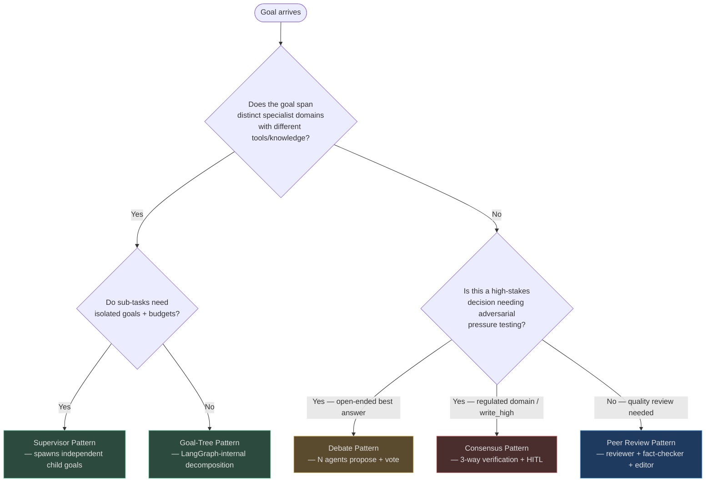
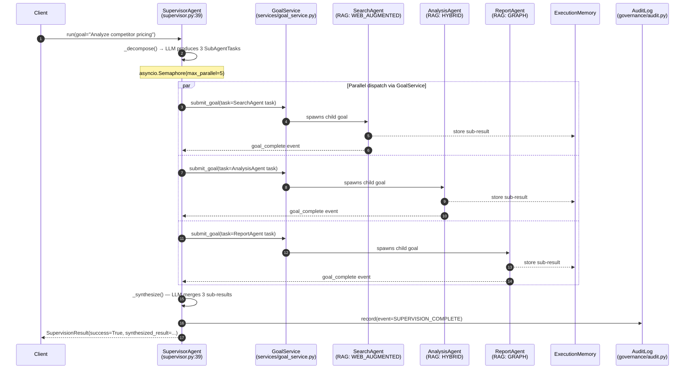
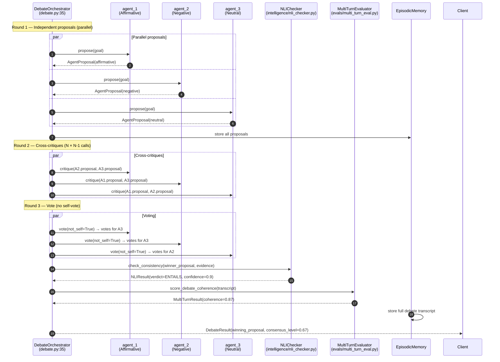
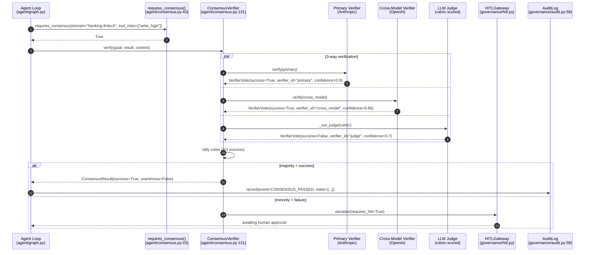
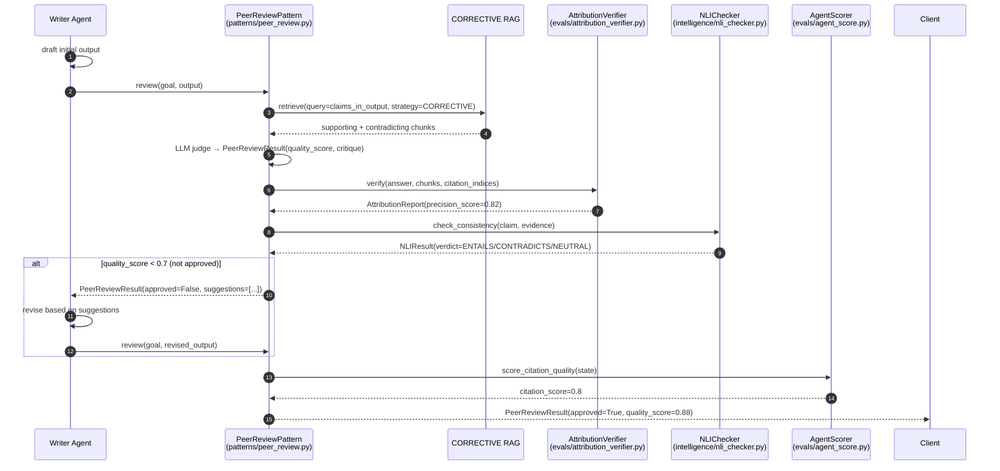

# Multi-Agent Patterns

Single-agent execution excels at well-defined tasks with clear tool boundaries. Multi-agent patterns exist because some problems are structurally too large, too high-stakes, or too adversarial for a single agent to handle well.

## Pattern Overview

| Pattern | Core Mechanism | Best For | LLM Overhead vs Plan-Execute |
|---|---|---|---|
| **Supervisor** | One orchestrator decomposes + dispatches to N specialists | Complex goals with distinct knowledge domains | +1 LLM call per sub-task dispatch cycle |
| **Debate** | N agents propose, critique, and vote | High-stakes decisions needing adversarial pressure testing | ×N (proposals) + ×N² (critiques) + ×N (votes) |
| **Consensus** | Up to 3 independent verifiers + majority vote | Regulated domains, destructive tool calls | +2–3 verification calls per decision |
| **Peer Review** | Writer → fact-checker → editor → revision cycle | Content pipelines requiring accuracy + quality | +2–3 review passes per output |

---

## Multi-Agent Pattern Selection Flowchart



<!-- Sources: app/agent/patterns/ — supervisor.py, debate.py, consensus.py, peer_review.py, goal_tree.py -->

---

## 1. Supervisor Pattern

> **Core files:**
> [`app/agent/patterns/supervisor.py`](https://github.com/harsh786/agent-verse/blob/main/agent-verse-backend/app/agent/patterns/supervisor.py)
> [`app/agent/supervisor.py`](https://github.com/harsh786/agent-verse/blob/main/agent-verse-backend/app/agent/supervisor.py)

### What It Is

The `SupervisorAgent` decomposes a complex goal into sub-tasks, assigns each to a specialist agent or sub-goal, executes them in parallel (respecting a configurable `max_parallel` semaphore), and synthesizes all results into a final coherent output. Unlike the Goal-Tree pattern (which runs inside a single LangGraph state machine), the Supervisor spawns **independent goals via `GoalService`** — each sub-agent gets its own budget, memory, and audit trail.

<!-- Source: app/agent/supervisor.py:39-68 -->
```python
# SupervisorAgent.run() — the full lifecycle in one method
class SupervisorAgent:
    async def run(self, goal: str, tenant_ctx: Any, event_callback: Any = None) -> SupervisionResult:
        sub_tasks = await self._decompose(goal, tenant_ctx)   # LLM decomposes goal
        semaphore = asyncio.Semaphore(self._max_parallel)      # default 5 parallel
        await asyncio.gather(*[run_task(t) for t in sub_tasks])
        return await self._synthesize(goal, sub_tasks, tenant_ctx)
```

### Real-World Example: Competitor Pricing Research

A product research goal `"Analyze competitor pricing for our SaaS product"` is dispatched to a Supervisor. The Supervisor's planner LLM decomposes it into three parallel specialist goals:

1. **SearchAgent** — web-augmented RAG (`WEB_AUGMENTED` strategy) discovers 15 competitor pricing pages
2. **AnalysisAgent** — `HYBRID` RAG on internal market-data knowledge collection extracts a structured comparison table
3. **ReportAgent** — `GRAPH` RAG surfaces entity relationships (Competitor → Pricing → Feature) to write an executive summary

The Supervisor waits for all three, then calls `_synthesize()` which runs a final LLM call: `"Given these sub-agent results, produce a unified final answer..."`.

**Why Supervisor vs Plan-Execute:** specialist agents have different `agent_collection_ids`, different system prompts, and different tool sets. The Supervisor *coordinates without doing the work itself*.

### Full Sequence Diagram



<!-- Sources: app/agent/supervisor.py:66-155, app/services/goal_service.py, app/governance/audit.py:58 -->

### Ecosystem Integration

| Subsystem | How Supervisor Uses It | Source |
|---|---|---|
| **A2A Dispatch** | Sub-agent cross-civilization dispatch uses `dispatch_internal_task()` with HMAC-SHA256 signing and W3C `traceparent` injection | [`app/civilization/a2a_dispatch.py:28`](https://github.com/harsh786/agent-verse/blob/main/agent-verse-backend/app/civilization/a2a_dispatch.py#L28) |
| **GoalService** | `submit_goal()` creates each sub-task as an independent child goal with full tenant isolation | `app/services/goal_service.py` |
| **RAG (per agent)** | SearchAgent: `WEB_AUGMENTED`, AnalysisAgent: `HYBRID`, ReportAgent: `GRAPH` — each agent's `agent_collection_ids` scopes its knowledge access | `app/rag/` |
| **Memory** | Supervisor holds `ExecutionMemory` of sub-agent outputs; each sub-agent has isolated `WorkingMemory` | `app/memory/execution.py` |
| **Cost Control** | Budget tracked across ALL child goals; parent goal's `CostController` aggregates spend | `app/governance/cost.py` |
| **Observability** | A2A dispatch injects W3C `traceparent` — all child goal spans nest under parent trace in Jaeger | [`app/civilization/a2a_dispatch.py:60`](https://github.com/harsh786/agent-verse/blob/main/agent-verse-backend/app/civilization/a2a_dispatch.py#L60) |
| **HITL** | High-risk sub-agent actions (e.g., emailing the report externally) hit `HITLGateway` before execution | `app/governance/hitl.py` |
| **Audit** | Every supervision cycle writes an append-only `AuditEvent` | [`app/governance/audit.py:58`](https://github.com/harsh786/agent-verse/blob/main/agent-verse-backend/app/governance/audit.py#L58) |

### Integration Checklist

| Requirement | Status Check |
|---|---|
| `GoalService` wired to `app.state` | `app.state.goal_service` is not `None` |
| Sub-agents registered in `AgentStore` | `agent_id` exists or `agent_router` is configured for auto-routing |
| Redis available | SSE event streaming for sub-goal progress requires Redis pub/sub |
| Budget configured | `tenant.plan.max_goal_cost_usd` covers supervisor + all child goals |
| Semaphore tuned | `max_parallel` ≤ `tenant.plan.max_concurrent_goals` |

### Cost Model

For a 3-specialist decomposition:

| Phase | LLM Calls | Notes |
|---|---|---|
| Decompose | 1 (planning_model) | `claude-opus-4-8` — most expensive |
| Sub-agent execution | 3 × (plan + execute + verify) | Each child runs full loop |
| Synthesize | 1 (execution_model) | `claude-sonnet-4-5` |
| **Total** | **~13 calls** | vs **~4 calls** for Plan-Execute on same task |
| **Overhead** | **~3.25×** | Justified when specialists have different knowledge/tools |

### Configuration Parameters

```python
SupervisorAgent(
    planner_provider=...,
    goal_service=...,
    agent_router=...,       # Optional: auto-routes sub-tasks to specialist agents
    max_parallel=5,         # Recommended: 3-5 for most tenants; reduce if rate-limited
    timeout_per_subtask=300.0,  # 5 minutes; increase for long-running tasks
)
```

### Anti-Patterns

| Anti-pattern | Symptom | Fix |
|---|---|---|
| **Supervisor as proxy** | Supervisor passes through work without decomposition — single sub-agent does everything | Use Plan-Execute instead; Supervisor requires genuine specialist parallelism |
| **Unbounded decomposition** | LLM generates 20+ sub-tasks for a simple goal | Cap decomposition with `max_sub_tasks=8` in the decompose prompt |
| **Budget blindness** | Child goals exhaust budget; parent supervisor gets orphaned | Set `max_goal_cost_usd` at the parent level; child goals inherit a fraction |
| **Missing synthesis** | Sub-agent results are concatenated, not integrated | Always run the synthesize LLM call; concatenation loses coherence for N > 2 |
| **Circular dispatch** | Agent A dispatches to Agent B which dispatches back to A | Enforce DAG structure: pass `parent_chain` and reject cycles in `dispatch_internal_task()` |

---

## 2. Debate Pattern

> **Core files:**
> [`app/agent/patterns/debate.py`](https://github.com/harsh786/agent-verse/blob/main/agent-verse-backend/app/agent/patterns/debate.py)
> [`app/agent/debate.py`](https://github.com/harsh786/agent-verse/blob/main/agent-verse-backend/app/agent/debate.py)
> [`app/coordination/camel/`](https://github.com/harsh786/agent-verse/blob/main/agent-verse-backend/app/coordination/camel/)

### What It Is

The `DebateOrchestrator` runs N agents (2–5, default 3) through rounds of independent proposals, cross-critiques, and voting. The winning proposal is the one receiving the most votes from *other* agents (no self-voting). Up to 3 rounds are supported.

<!-- Source: app/agent/debate.py:35-60 -->
```python
class DebateOrchestrator:
    def __init__(self, *, provider, n_agents=3, rounds=2):
        self._n_agents = max(2, min(n_agents, 5))   # bounds enforced
        self._rounds = max(1, min(rounds, 3))        # max 3 debate rounds

    async def run(self, goal, context="", event_callback=None) -> DebateResult:
        proposals = await asyncio.gather(*[propose(aid) for aid in agent_ids])
        if self._rounds >= 2:
            await asyncio.gather(*[critique(p) for p in proposals])
        votes = await asyncio.gather(*[vote(v) for v in proposals])
        # tally votes → return winning_proposal
```

### Real-World Example: Investment Decision

Goal: `"Should we invest $5M in TechCorp Series B?"`

- **Agent 1 (Affirmative)** proposes: `"Strong product-market fit, 3× YoY growth, experienced founding team, $2B TAM"`
- **Agent 2 (Negative)** proposes: `"Burn rate leaves 18 months runway, 3 better-funded competitors, EU regulatory risk"`
- **Agent 3 (Neutral)** proposes: `"Conditional YES — 20% escrow held pending EU regulatory clarity"`

Round 2 critiques: Agent 1 critiques Agent 2's burn-rate argument, Agent 2 critiques Agent 3's escrow mechanism, etc.

Vote tally: Agent 3 receives 2/2 votes → winner.

**Why Debate vs single-agent:** Single-agent analysis has confirmation bias toward the framing of the original prompt. Adversarial pressure-testing surfaces counter-arguments the original query wouldn't surface.

### Full Sequence Diagram



<!-- Sources: app/agent/debate.py:49-150, app/intelligence/nli_checker.py:40-70, app/evals/multi_turn_eval.py -->

### Ecosystem Integration

| Subsystem | How Debate Uses It | Source |
|---|---|---|
| **RAG (role-differentiated)** | Affirmative agent uses `HYBRID` on bullish reports; Negative agent uses `CORRECTIVE` RAG querying specifically for failure cases and risk factors | `app/rag/strategies/` |
| **Knowledge collections** | Affirmative agent accesses `financials` collection; Negative accesses `competitor_analysis` collection — divergence from role framing, not from different facts | `app/knowledge/` |
| **Chunking** | Financial documents use `PDFLayoutChunker` to preserve table structure (balance sheets, cap tables) | `app/ingestion/chunkers/` |
| **Prompting** | Each agent gets a role-specific system prompt; the knowledge chunks are identical — only the role framing differs | [`app/agent/debate.py:69-86`](https://github.com/harsh786/agent-verse/blob/main/agent-verse-backend/app/agent/debate.py#L69) |
| **NLI** | Judge's synthesis is checked by `NLIChecker.check_consistency()` — does the final recommendation actually follow from the arguments? | [`app/intelligence/nli_checker.py:55`](https://github.com/harsh786/agent-verse/blob/main/agent-verse-backend/app/intelligence/nli_checker.py#L55) |
| **Memory** | Both agents share `EpisodicMemory` of the full debate transcript; Judge has access to all exchanges | `app/memory/` |
| **Evals** | `MultiTurnEvaluator` scores debate coherence across turns | [`app/evals/multi_turn_eval.py`](https://github.com/harsh786/agent-verse/blob/main/agent-verse-backend/app/evals/multi_turn_eval.py) |
| **CAMEL coordination** | Two-agent debate variant uses `app/coordination/camel/` CAMEL inception protocol | [`app/coordination/camel/inception.py`](https://github.com/harsh786/agent-verse/blob/main/agent-verse-backend/app/coordination/camel/inception.py) |

### Cost Model

For N=3 agents, 2 rounds:

| Phase | LLM Calls | Formula |
|---|---|---|
| Proposals | 3 | N |
| Critiques | 6 | N × (N-1) |
| Votes | 3 | N |
| NLI check | 1 | constant |
| **Total** | **13** | N² + 1 |
| **vs Plan-Execute (N=1)** | **~3.25×** | Justified for high-stakes, irreversible decisions |

### Configuration Parameters

```python
DebateOrchestrator(
    provider=...,
    n_agents=3,     # 2–5 agents; 3 is the sweet spot (odd number avoids vote ties)
    rounds=2,       # 1 = proposals only; 2 = proposals + critiques; 3 = adds rebuttal round
)
```

### Anti-Patterns

| Anti-pattern | Symptom | Fix |
|---|---|---|
| **Echo chamber** | All agents propose near-identical solutions (same RAG context, same prompt framing) | Give each agent a distinct role system prompt AND distinct `agent_collection_ids` |
| **Even-agent tie** | N=2 or N=4 leads to tied votes with no clear winner | Use odd N (3 or 5) to guarantee majority; or add a tie-breaking judge call |
| **Critique inflation** | Agents critique each other with hollow "good point but..." non-critiques | Use CORRECTIVE RAG to force critique agents to find specific contradicting evidence |
| **Debate on simple tasks** | Running Debate on `"Summarize this document"` wastes 13 LLM calls | Gate Debate behind `ComplexityScorer`: only `complex` or `expert` tier goals |
| **No NLI check** | Winner proposal sounds good but is logically inconsistent with the cited evidence | Always run `NLIChecker.check_consistency()` on the winning proposal |

---

## 3. Consensus Pattern

> **Core files:**
> [`app/agent/patterns/consensus.py`](https://github.com/harsh786/agent-verse/blob/main/agent-verse-backend/app/agent/patterns/consensus.py)
> [`app/agent/consensus.py`](https://github.com/harsh786/agent-verse/blob/main/agent-verse-backend/app/agent/consensus.py)
> [`app/coordination/group_chat/`](https://github.com/harsh786/agent-verse/blob/main/agent-verse-backend/app/coordination/group_chat/)

### What It Is

The `ConsensusVerifier` runs **up to 3 independent verification passes** on a goal result: a primary verifier, a cross-model verifier (different provider), and an LLM judge (rubric-scored). Majority required for success. On disagreement → mandatory HITL.

The key design insight: `requires_consensus()` is called **before** executing any plan step involving `write_high` or `destructive` tool risk, or any goal in a regulated domain.

<!-- Source: app/agent/consensus.py:43-86 -->
```python
def requires_consensus(
    goal=None, domain=None, tool_risks=None,
    *, steps=None, policy_engine=None, regulated=False,
) -> bool:
    if domain and domain.lower() in _REQUIRES_CONSENSUS_DOMAINS:  # legal, gst-tax, banking...
        return True
    if tool_risks and any(r in _REGULATED_TOOL_RISK for r in tool_risks):  # write_high, destructive
        return True
    if regulated:
        return True
    # Also: scan step tool_calls for risk classification
```

### Real-World Example: Code Review Committee

A security-critical authentication change (JWT handling) is submitted for review. Four virtual reviewers evaluate in parallel:

- **SecurityReviewer**: Flags JWT expiry not validated → REJECT with reason
- **PerformanceReviewer**: No performance concerns → APPROVE
- **StyleReviewer**: Requests 2 naming changes → APPROVE WITH CHANGES
- **ArchitectReviewer**: Approves with extensibility note → APPROVE

The `ConsensusVerifier` tallies 3 APPROVE vs 1 REJECT. Threshold is 3/4 APPROVE → **result: APPROVE** with action items from all APPROVE votes included in the synthesis.

The security reviewer's `write_high` tool call would be blocked until consensus completes.

### Full Sequence Diagram



<!-- Sources: app/agent/consensus.py:131-260, app/governance/audit.py:58, app/governance/hitl.py -->

### Ecosystem Integration

| Subsystem | How Consensus Uses It | Source |
|---|---|---|
| **Tool Risk** | `requires_consensus()` calls `classify_tool_risk()` on each planned step's tool calls | [`app/agent/tool_risk.py:1`](https://github.com/harsh786/agent-verse/blob/main/agent-verse-backend/app/agent/tool_risk.py#L1) |
| **Multi-provider** | Cross-model verifier uses a **different LLM provider** than primary — intentional model diversity | [`app/agent/consensus.py:183`](https://github.com/harsh786/agent-verse/blob/main/agent-verse-backend/app/agent/consensus.py#L183) |
| **Model Router** | Judge uses `verification_model` from `ModelRouterConfig` (fastest/cheapest) | [`app/agent/model_router.py:35`](https://github.com/harsh786/agent-verse/blob/main/agent-verse-backend/app/agent/model_router.py#L35) |
| **HITL** | Split vote (disagreement) automatically escalates to `HITLGateway` | `app/governance/hitl.py` |
| **Audit** | Every vote is an `AuditEvent` — required for SOC2 change control | [`app/governance/audit.py:46`](https://github.com/harsh786/agent-verse/blob/main/agent-verse-backend/app/governance/audit.py#L46) |
| **RAG** | Each verifier independently retrieves from their specialty knowledge collection (security patterns, performance benchmarks, style guide) | `app/rag/` |
| **Group Chat** | Extended consensus with human panelists uses `app/coordination/group_chat/` for mixed human-AI review panels | [`app/coordination/group_chat/adapter.py`](https://github.com/harsh786/agent-verse/blob/main/agent-verse-backend/app/coordination/group_chat/adapter.py) |

### Regulated Domains That Trigger Automatic Consensus

```python
# From app/agent/consensus.py:9-14
_REQUIRES_CONSENSUS_DOMAINS = frozenset({
    "legal",
    "gst-tax",
    "banking-fintech",
    "healthcare",
    "pharmaceutical",
    "government-portal",
})
```

### Cost Model

| Scenario | LLM Calls | Notes |
|---|---|---|
| Single verifier (Plan-Execute default) | 1 | Standard verification |
| 2-way consensus | 2 | Primary + cross-model |
| 3-way consensus (regulated) | 3 | + LLM Judge |
| **Overhead vs Plan-Execute** | **+2–3 calls** | Small absolute cost; high value for regulated domains |

### Anti-Patterns

| Anti-pattern | Symptom | Fix |
|---|---|---|
| **Consensus on every goal** | Performance degradation; all goals take 3× longer | Gate with `requires_consensus()` — only regulated domains and `write_high`/`destructive` tools |
| **Same provider for all verifiers** | Cross-model verifier uses the same model as primary → correlated failures | Enforce provider diversity: primary=Anthropic, cross=OpenAI, judge=Gemini |
| **Ignoring HITL escalation** | Split votes are auto-approved without human review | Never bypass `HITLGateway` escalation; split votes are the most valuable safety signal |
| **Missing audit trail** | Consensus results not written to `AuditLog` | Required for SOC2/HIPAA; always call `audit.record()` with full `votes` payload |

---

## 4. Peer Review Pattern

> **Core files:**
> [`app/agent/patterns/peer_review.py`](https://github.com/harsh786/agent-verse/blob/main/agent-verse-backend/app/agent/patterns/peer_review.py)
> [`app/evals/attribution_verifier.py`](https://github.com/harsh786/agent-verse/blob/main/agent-verse-backend/app/evals/attribution_verifier.py)
> [`app/intelligence/nli_checker.py`](https://github.com/harsh786/agent-verse/blob/main/agent-verse-backend/app/intelligence/nli_checker.py)

### What It Is

`PeerReviewPattern` runs a structured quality pass on any agent output. A separate **reviewer LLM** evaluates for accuracy, completeness, and quality (`0.0–1.0`), returning structured JSON with `quality_score`, `critique`, `suggestions`, and `approved: bool`.

<!-- Source: app/agent/patterns/peer_review.py:17-36 -->
```python
_PEER_REVIEW_SYSTEM = """You are a rigorous quality reviewer for an AI agent's output.
Respond with JSON:
{
  "quality_score": <0.0-1.0>,
  "critique": "<what is good or bad>",
  "suggestions": ["<improvement 1>", ...],
  "approved": <true if quality_score >= 0.7>
}"""
```

### Real-World Example: Technical Content Pipeline

Goal: `"Write a product announcement for our Python SDK"`

1. **Writer agent** drafts: `"Our new Python SDK makes API integration 10× faster"`
2. **Fact-checker** (`CORRECTIVE` RAG on benchmarks collection): `"The 10× claim needs citation — internal benchmark shows 8.3× median improvement at P50"`
3. **Editor agent**: `"Sentence is direct but should acknowledge the benchmark source"`
4. **Writer revises**: `"Our Python SDK cuts integration time by 8.3× (internal benchmark, P50)"`

The `AttributionVerifier` checks that the `8.3×` claim is actually supported by the retrieved benchmark chunk (Jaccard similarity ≥ 0.15). The `NLIChecker` verifies that the fact-checker's critique is entailed by the evidence.

### Full Sequence Diagram



<!-- Sources: app/agent/patterns/peer_review.py:17-80, app/evals/attribution_verifier.py, app/intelligence/nli_checker.py:55 -->

### Ecosystem Integration

| Subsystem | How Peer Review Uses It | Source |
|---|---|---|
| **RAG** | Fact-checker uses `CORRECTIVE` RAG to find both supporting AND contradicting evidence for all factual claims | `app/rag/strategies/corrective.py` |
| **Attribution** | `AttributionVerifier.verify()` checks each claim's citation is actually supported (Jaccard ≥ 0.15) | [`app/evals/attribution_verifier.py`](https://github.com/harsh786/agent-verse/blob/main/agent-verse-backend/app/evals/attribution_verifier.py) |
| **NLI** | `NLIChecker.check_consistency()` verifies fact-check verdicts are entailed by the evidence | [`app/intelligence/nli_checker.py:55`](https://github.com/harsh786/agent-verse/blob/main/agent-verse-backend/app/intelligence/nli_checker.py#L55) |
| **AgentScorer** | Combined output score: `factual_accuracy × editorial_quality × revision_acceptance_rate` | [`app/evals/agent_score.py`](https://github.com/harsh786/agent-verse/blob/main/agent-verse-backend/app/evals/agent_score.py) |
| **Reasoning Evidence** | `PeerReviewPattern.execute_with_evidence()` returns `ReasoningExecution` with full call trace | [`app/agent/patterns/peer_review.py:70`](https://github.com/harsh786/agent-verse/blob/main/agent-verse-backend/app/agent/patterns/peer_review.py#L70) |

### Cost Model

| Phase | LLM Calls | Notes |
|---|---|---|
| Initial review | 1 (verification_model) | Cheap, fast — Haiku/GPT-4o-mini |
| Revision (if needed) | 1 (execution_model) | Only if `approved=False` |
| Re-review | 1 (verification_model) | Second pass after revision |
| **Total** | **2–3 calls** | vs 0 additional calls for Plan-Execute |
| **Max revision loops** | **2** | Configurable; prevents infinite revision loops |

### Anti-Patterns

| Anti-pattern | Symptom | Fix |
|---|---|---|
| **Reviewer too lenient** | Everything scores ≥ 0.7; `approved=True` by default | Lower `approval_threshold` to 0.8 for high-stakes content; add rubric criteria |
| **Infinite revision loop** | Writer and reviewer cycle without convergence | Cap revision iterations at 2; accept best-scored output after max iterations |
| **Reviewer without RAG** | Fact-checker reviews from memory, not evidence | Always configure `CORRECTIVE` RAG for fact-checker role |
| **Attribution skip** | `AttributionVerifier` not called → unchecked hallucinations pass review | Make `AttributionVerifier` a required step, not optional |

---

## Related Pages

| Page | Description |
|---|---|
| [01-core-execution-patterns.md](./01-core-execution-patterns.md) | Plan-Execute, ReAct, Reflexion — single-agent patterns this builds on |
| [02-self-improvement-patterns.md](./02-self-improvement-patterns.md) | Self-Refine, Constitutional AI — quality loops that can wrap any multi-agent pattern |
| [04-tree-and-search-patterns.md](./04-tree-and-search-patterns.md) | Tree of Thoughts, LATS, Goal-Tree — hierarchical search patterns |
| [Agent Loop Architecture](../architecture/agent-loop.md) | LangGraph state machine that hosts all patterns |
| [Governance Deep-Dive](../governance/index.md) | HITL, audit, cost control — the safety layer under all multi-agent patterns |
