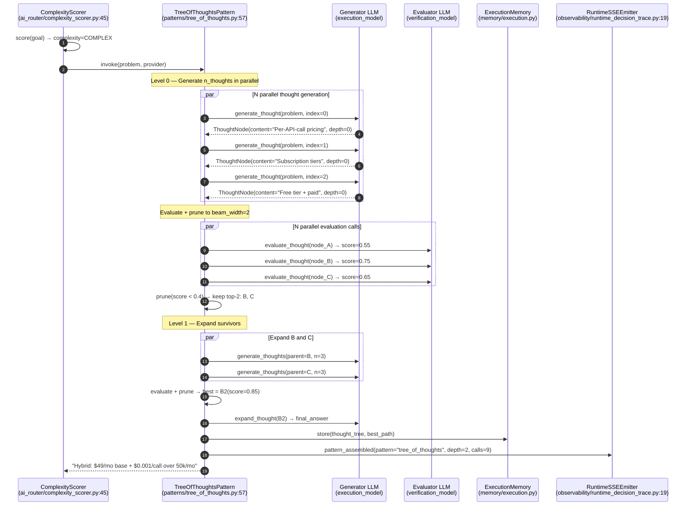
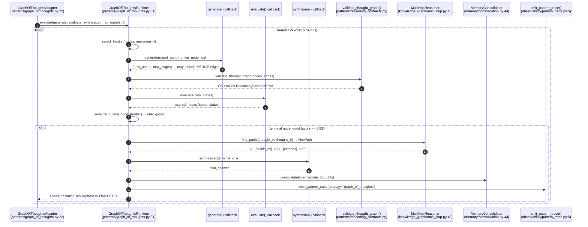
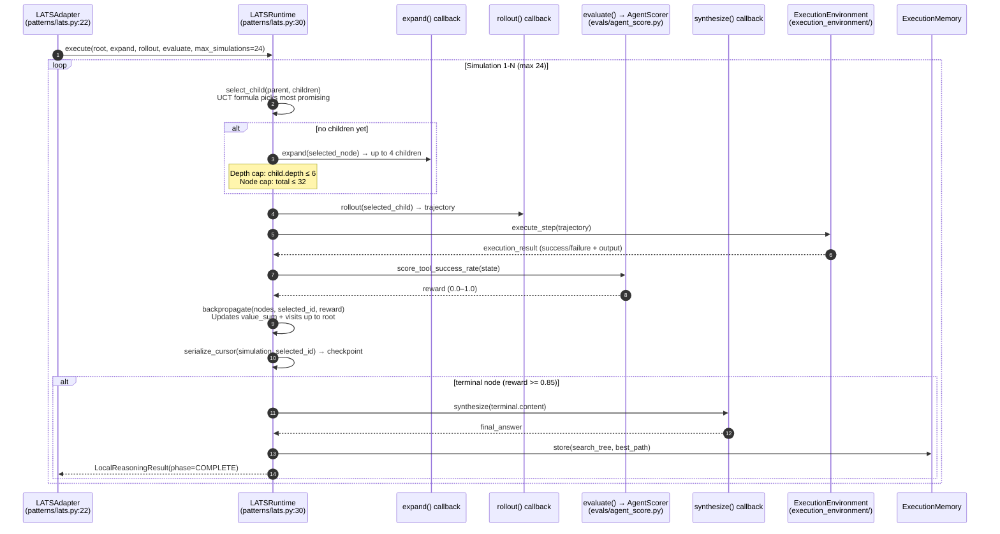
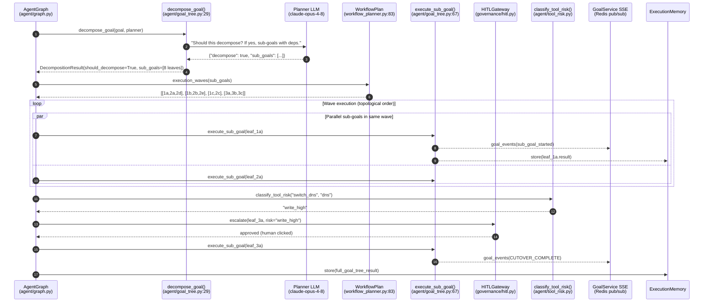
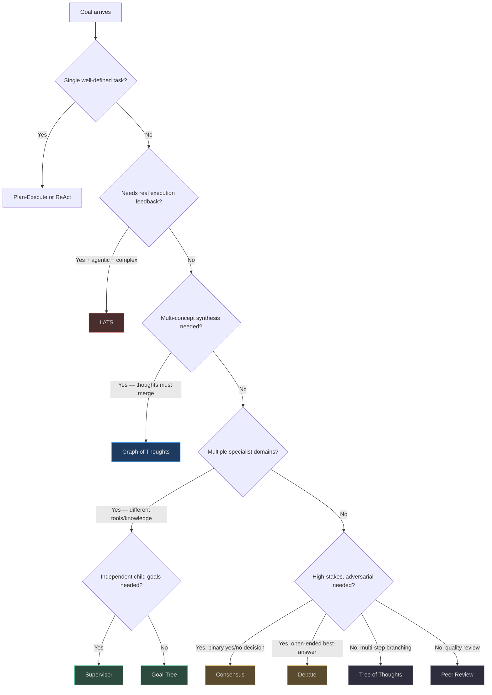

# Tree and Graph Search Patterns

Where single-path reasoning (Plan-Execute, ReAct) follows one trajectory through a problem, search-based patterns explore **multiple trajectories in parallel**, evaluate them, and converge on the best one. The tradeoff: higher LLM call cost in exchange for dramatically better solution quality on complex, open-ended problems.

## Pattern Overview

| Pattern | Search Strategy | Topology | Best For | Call Overhead vs Plan-Execute |
|---|---|---|---|---|
| **Tree of Thoughts** | BFS with beam search and pruning | Tree (no merging) | Multi-step reasoning with branching alternatives | 3–9× (N thoughts × depth) |
| **Graph of Thoughts** | Frontier expansion with convergence | DAG (thoughts can merge) | Problems requiring synthesis of multiple concepts | 4–12× (rounds × expand + evaluate) |
| **LATS** | UCT Monte Carlo Tree Search | Tree with backpropagation | Agentic tasks where execution feedback shapes search | 10–24× (max_simulations LLM calls) |
| **Goal-Tree** | Topological BFS with parallel wave execution | Tree (dependency DAG) | Enterprise goals that decompose hierarchically | 2–4× (sub-goal count) |

---

## 1. Tree of Thoughts (ToT)

> **Core files:**
> [`app/agent/patterns/tree_of_thoughts.py`](https://github.com/harsh786/agent-verse/blob/main/agent-verse-backend/app/agent/patterns/tree_of_thoughts.py)
> [`app/ai_router/complexity_scorer.py`](https://github.com/harsh786/agent-verse/blob/main/agent-verse-backend/app/ai_router/complexity_scorer.py)

### What It Is

`TreeOfThoughtsPattern` implements the BFS variant of Yao et al. 2023. It generates `n_thoughts` candidate next-steps in parallel, evaluates each with a scoring LLM call, prunes the bottom scorers, and expands the top-`beam_width` survivors to the next level. This continues for `max_depth` levels, then the best-scoring leaf is expanded into a final answer.

<!-- Source: app/agent/patterns/tree_of_thoughts.py:57-115 -->
```python
class TreeOfThoughtsPattern(AgentPattern):
    def __init__(self, n_thoughts=3, max_depth=2, beam_width=2):
        self._n = n_thoughts       # parallel thoughts per level
        self._max_depth = max_depth
        self._beam = beam_width    # how many survivors after pruning

    def is_compatible(self, goal_properties):
        if not get_settings().enable_tree_of_thoughts:  # config flag
            return False
        complexity = getattr(goal_properties, "complexity", None)
        return str(complexity).lower() in ("complex", "expert", "moderate")
```

The `is_compatible()` check gates ToT behind two conditions: the `enable_tree_of_thoughts` settings flag *and* the goal's complexity tier. This prevents ToT from being invoked on simple goals where its 3–9× overhead is not justified.

### Real-World Example: API Pricing Strategy

Goal: `"What pricing model maximizes both adoption and revenue for an AI API?"`

**Level 0 — Root:** 3 thoughts generated in parallel:
- **A:** `Per-API-call pricing`
- **B:** `Subscription tiers`
- **C:** `Free tier + enterprise paid`

**Evaluation:** A=0.55, B=0.75, C=0.65 → beam prunes A, keeps B and C.

**Level 1 — Expand B (Subscription tiers):**
- **B1:** `$99/mo starter, $499/mo pro — predictable revenue, reduces experimentation` (score=0.60)
- **B2:** `$49/mo + usage overages — hybrid, captures both segments` (score=0.85)
- **B3:** `$199/mo with free 30-day trial — builds trust but delays revenue` (score=0.65)

**Level 1 — Expand C (Free tier):**
- **C1:** `1M free calls/mo — builds community, high infra cost` (score=0.70)

Beam keeps B2 (0.85) and C1 (0.70). B2 is expanded to final answer: `"Hybrid: $49/mo base + $0.001/call over 50k/mo with a 14-day free trial"`.

**Why ToT vs Plan-Execute:** Plan-Execute would commit to the first pricing model it generates. ToT evaluates 9+ alternatives before committing, discovering B2 through systematic exploration.

### Full Sequence Diagram



<!-- Sources: app/agent/patterns/tree_of_thoughts.py:104-190, app/ai_router/complexity_scorer.py:45, app/memory/execution.py:16, app/observability/runtime_decision_trace.py:114 -->

### Ecosystem Integration

| Subsystem | How ToT Uses It | Source |
|---|---|---|
| **ComplexityScorer** | `is_compatible()` checks goal complexity; ToT only activates for `complex`/`expert`/`moderate` goals | [`app/ai_router/complexity_scorer.py:45`](https://github.com/harsh786/agent-verse/blob/main/agent-verse-backend/app/ai_router/complexity_scorer.py#L45) |
| **Model Router** | Generator uses `execution_model`; Evaluator uses `verification_model` (faster/cheaper) — different models per phase | [`app/agent/model_router.py:35`](https://github.com/harsh786/agent-verse/blob/main/agent-verse-backend/app/agent/model_router.py#L35) |
| **RAG (per node)** | Each thought node can retrieve evidence from knowledge collections; `ADAPTIVE` RAG with query = `{pricing_model} API outcomes` | `app/rag/` |
| **KG** | Pricing entity graph: `Model→ResultsIn→Metric` (adoption_rate, churn, revenue); `GRAPH` RAG scores branches using entity relationships | `app/knowledge_graph/store.py` |
| **Memory** | Full thought tree stored in `ExecutionMemory` for explainability and future recall | [`app/memory/execution.py:16`](https://github.com/harsh786/agent-verse/blob/main/agent-verse-backend/app/memory/execution.py#L16) |
| **Settings flag** | `enable_tree_of_thoughts: bool = True` in `Settings` — can be toggled per-environment | [`app/core/config.py:98`](https://github.com/harsh786/agent-verse/blob/main/agent-verse-backend/app/core/config.py#L98) |
| **Observability** | `RuntimeSSEEmitter.pattern_assembled()` records branching decisions | [`app/observability/runtime_decision_trace.py:114`](https://github.com/harsh786/agent-verse/blob/main/agent-verse-backend/app/observability/runtime_decision_trace.py#L114) |
| **Reasoning Evidence** | `execute_with_evidence()` returns `ReasoningExecution` with full `call_count`, `invalid_samples`, and `safe_rationale_summary` | [`app/agent/patterns/tree_of_thoughts.py:189`](https://github.com/harsh786/agent-verse/blob/main/agent-verse-backend/app/agent/patterns/tree_of_thoughts.py#L189) |

### ToT Evaluation Prompts

```python
# From app/agent/patterns/tree_of_thoughts.py:27-42
_GENERATE_SYSTEM = (
    "Generate a distinct reasoning approach for the given problem. "
    "Provide one clear, concrete thought as a single paragraph."
)

_EVALUATE_SYSTEM = (
    "Evaluate this reasoning thought for solving the given problem. "
    'Respond with JSON: {"score", "promising", "reason"}. '
    "Score 0.9+ for excellent systematic approaches. Below 0.5 for vague/wrong."
)

_EXPAND_SYSTEM = (
    "Continue this reasoning chain to reach a final answer. "
    "Be specific and concrete. Provide the complete solution."
)
```

### Cost Model

For default config (n_thoughts=3, max_depth=2, beam_width=2):

| Phase | LLM Calls | Model | Notes |
|---|---|---|---|
| Level 0: Generate | 3 | execution_model | All parallel |
| Level 0: Evaluate | 3 | verification_model | All parallel |
| Level 1: Generate | beam_width × n_thoughts = 6 | execution_model | Survivors only |
| Level 1: Evaluate | 6 | verification_model | All parallel |
| Final Expand | 1 | execution_model | Best leaf → answer |
| **Total** | **~19 calls** | Mixed | vs 4 for Plan-Execute |
| **Pruning savings** | ~40% | — | Branches with score < 0.4 pruned before expansion |

### Integration Checklist

| Requirement | Check |
|---|---|
| `enable_tree_of_thoughts = True` in Settings | `app.core.config.get_settings().enable_tree_of_thoughts` |
| Goal complexity = `complex`/`expert`/`moderate` | `ComplexityScorer.score(goal).tier` |
| Budget covers ~20 LLM calls | `tenant.plan.max_goal_cost_usd ≥ (estimated_cost × 5)` |
| `ExecutionMemory` available | `app.state.memory` is not `None` |

### Configuration Parameters

```python
TreeOfThoughtsPattern(
    n_thoughts=3,      # Thoughts generated per level; 3 is balanced (2=underdiversified, 5=expensive)
    max_depth=2,       # Depth of BFS; 2 is sufficient for most goals; 3 for very open-ended
    beam_width=2,      # Survivors after pruning per level; set ≤ n_thoughts
)
```

### Anti-Patterns

| Anti-pattern | Symptom | Fix |
|---|---|---|
| **ToT on factual Q&A** | Wastes 19 LLM calls on `"What is the capital of France?"` | Gate with `is_compatible()` + `ComplexityScorer`; score < 0.3 → use direct answer |
| **Zero pruning** | `beam_width=n_thoughts` means no pruning — exponential call growth | Always set `beam_width < n_thoughts`; 2/3 is the recommended ratio |
| **Generator = Evaluator** | Same model generates and scores thoughts — self-validation bias | Use `execution_model` for generation, `verification_model` for evaluation |
| **No evidence grounding** | Thought nodes make unsupported claims without RAG evidence | Enable RAG retrieval at generation time; pass retrieved chunks into the generate prompt |
| **Depth too deep** | `max_depth=4` for a simple 2-level problem → over-exploration | Default `max_depth=2`; only increase if top-2 level thoughts are consistently insufficient |

---

## 2. Graph of Thoughts (GoT)

> **Core files:**
> [`app/agent/patterns/graph_of_thoughts.py`](https://github.com/harsh786/agent-verse/blob/main/agent-verse-backend/app/agent/patterns/graph_of_thoughts.py)
> [`app/agent/patterns/reasoning_contracts.py`](https://github.com/harsh786/agent-verse/blob/main/agent-verse-backend/app/agent/patterns/reasoning_contracts.py)
> [`app/knowledge_graph/multi_hop.py`](https://github.com/harsh786/agent-verse/blob/main/agent-verse-backend/app/knowledge_graph/multi_hop.py)

### What It Is

`GraphOfThoughtsRuntime` extends Tree of Thoughts by allowing thought **merging** — two independent thoughts can combine into a single synthetic thought (DAG instead of tree). This models how human experts synthesize insights from multiple independent lines of reasoning.

The runtime uses a `frontier` selector that picks the highest-scoring unexplored nodes (score ≥ 0.55, not pruned), a `validate_thought_graph()` invariant check after each round, and a `checkpoint_callback` for mid-execution recovery.

<!-- Source: app/agent/patterns/graph_of_thoughts.py:62-110 -->
```python
class GraphOfThoughtsRuntime:
    async def execute(self, *, generate, evaluate, synthesize, max_rounds=6) -> LocalReasoningResult:
        for round_number in range(start_round + 1, min(max_rounds, 6) + 1):
            frontier = self.select_frontier(tuple(nodes))  # score >= 0.55, not pruned
            generated_nodes, generated_edges = await self._invoke(generate, round_number, frontier_ids)
            validate_thought_graph(proposed_nodes, proposed_edges)  # invariant check
            scored = await self._invoke(evaluate, generated_nodes)
            # Check for terminal node (score >= 0.85)
            if terminal: answer = await synthesize((terminal.node_id,))
```

### Real-World Example: Caching Architecture Design

Goal: `"Design the caching layer for a 10M RPS global API"`

Unlike ToT (tree), GoT allows thoughts to **merge and diverge**:

```
Thought A: "Redis Cluster for hot session data"        (score=0.80)
Thought B: "CDN for static asset delivery"             (score=0.75)
Thought C: MERGE(A + B) → "Two-tier: Redis + CDN"      (score=0.88, round 2)
Thought D: "Cache invalidation via event streaming"    (score=0.72)
Thought E: MERGE(C + D) → "Two-tier + event-driven invalidation" (score=0.92, round 3, TERMINAL)
```

The merge in Thought C captures an architectural insight (combining session and static caching) that no single thought branch could express — this is impossible in a tree structure.

### Full Sequence Diagram



<!-- Sources: app/agent/patterns/graph_of_thoughts.py:62-130, app/knowledge_graph/multi_hop.py:61, app/memory/consolidation.py:44, app/observability/pattern_trace.py:5 -->

### Ecosystem Integration

| Subsystem | How GoT Uses It | Source |
|---|---|---|
| **Reasoning Contracts** | `validate_thought_graph()` checks DAG integrity after every round — prevents cycles, duplicate node IDs, and dangling edges | [`app/agent/patterns/reasoning_contracts.py`](https://github.com/harsh786/agent-verse/blob/main/agent-verse-backend/app/agent/patterns/reasoning_contracts.py) |
| **Knowledge Graph** | GoT thoughts map naturally to KG operations; `MultiHopReasoner.find_paths()` traces reasoning chains through the thought graph | [`app/knowledge_graph/multi_hop.py:61`](https://github.com/harsh786/agent-verse/blob/main/agent-verse-backend/app/knowledge_graph/multi_hop.py#L61) |
| **RAG (per node)** | Each thought retrieves from architecture patterns collection; `GRAPH` RAG retrieves nodes adjacent to current thought's entities | `app/rag/strategies/graph.py` |
| **Memory** | Entire GoT DAG stored in `ExecutionMemory`; `MemoryConsolidator` compresses intermediate thoughts for long-horizon tasks | [`app/memory/consolidation.py:44`](https://github.com/harsh786/agent-verse/blob/main/agent-verse-backend/app/memory/consolidation.py#L44) |
| **Checkpoint Recovery** | `checkpoint_callback` + `serialize_cursor()` persist the frontier after each round — GoT can resume from mid-execution if the process restarts | [`app/agent/patterns/graph_of_thoughts.py:47`](https://github.com/harsh786/agent-verse/blob/main/agent-verse-backend/app/agent/patterns/graph_of_thoughts.py#L47) |
| **Cancellation** | `cancelled: asyncio.Event` checked between rounds — GoT can be cleanly stopped without losing completed rounds | [`app/agent/patterns/graph_of_thoughts.py:68`](https://github.com/harsh786/agent-verse/blob/main/agent-verse-backend/app/agent/patterns/graph_of_thoughts.py#L68) |
| **Observability** | `emit_pattern_trace()` records the DAG structure — renders as a visualization in the monitoring dashboard | [`app/observability/pattern_trace.py:5`](https://github.com/harsh786/agent-verse/blob/main/agent-verse-backend/app/observability/pattern_trace.py#L5) |
| **Execution Tier** | `GraphOfThoughtsAdapter.execution_tier = ExecutionTier.LOCAL` — runs in-process, no external calls required | [`app/agent/patterns/graph_of_thoughts.py:22`](https://github.com/harsh786/agent-verse/blob/main/agent-verse-backend/app/agent/patterns/graph_of_thoughts.py#L22) |

### GoT vs ToT: Decision Matrix

| Dimension | Tree of Thoughts | Graph of Thoughts |
|---|---|---|
| **Topology** | Tree (strict parent-child) | DAG (merges allowed) |
| **Best for** | Problems with branching alternatives | Problems requiring synthesis of multiple concepts |
| **Merge support** | No | Yes — merge edges create new synthetic nodes |
| **Checkpointing** | No | Yes — `serialize_cursor()` per round |
| **Invariant checking** | No | Yes — `validate_thought_graph()` |
| **Max rounds** | `max_depth` levels | `min(max_rounds, 6)` hard cap |
| **Terminal detection** | Best leaf score | Score ≥ 0.85 + `status="terminal"` |

### Cost Model

For max_rounds=4, frontier_size=4:

| Phase | LLM Calls | Notes |
|---|---|---|
| Generate (per round) | 1 batch | Returns multiple nodes; 1 LLM call |
| Evaluate (per round) | 1 batch | Scores all generated nodes |
| Synthesize (terminal) | 1 | Only when terminal detected |
| **Total (4 rounds)** | **~9 calls** | Significantly cheaper than N-parallel ToT |
| **vs Plan-Execute** | **~2.25×** | Best search-pattern cost efficiency |

### Anti-Patterns

| Anti-pattern | Symptom | Fix |
|---|---|---|
| **Unchecked cycles** | Thought E merges with Thought A which was already in E's ancestry → infinite loop | `validate_thought_graph()` catches this; never skip it |
| **All nodes terminal** | Every node gets `status="terminal"` → premature synthesis | Reserve `terminal` status only for nodes with score ≥ 0.85 AND a complete answer |
| **No merge signals** | Generate callback never produces merge edges → GoT degrades to tree | Explicitly prompt generate with `"Can any current frontier thoughts be combined?"` |
| **max_rounds > 6** | Bypassing the hard cap causes runaway exploration | The hard cap `min(max_rounds, 6)` is enforced in the runtime; do not try to override it |

---

## 3. LATS (Language Agent Tree Search)

> **Core files:**
> [`app/agent/patterns/lats.py`](https://github.com/harsh786/agent-verse/blob/main/agent-verse-backend/app/agent/patterns/lats.py)
> [`app/execution_environment/`](https://github.com/harsh786/agent-verse/blob/main/agent-verse-backend/app/execution_environment/)
> [`app/evals/agent_score.py`](https://github.com/harsh786/agent-verse/blob/main/agent-verse-backend/app/evals/agent_score.py)

### What It Is

`LATSRuntime` implements Monte Carlo Tree Search (MCTS) for agentic tasks. Unlike ToT/GoT (which reason about *what to do*), LATS actually **executes steps** and uses real outcomes to update search node values via backpropagation. The UCT formula balances exploitation (high-value paths) with exploration (less-visited paths):

```
UCT(child) = mean_value + √2 × √(ln(parent.visits) / child.visits)
```

<!-- Source: app/agent/patterns/lats.py:18, 35-43 -->
```python
UCT_EXPLORATION = 1.41421356237  # = sqrt(2), standard MCTS constant

@staticmethod
def uct_score(parent_visits: int, child: SearchNodeState) -> float:
    if child.visits == 0:
        return math.inf  # unvisited nodes always explored first
    mean = child.value_sum / child.visits
    exploration = UCT_EXPLORATION * math.sqrt(math.log(max(parent_visits, 1)) / child.visits)
    return mean + exploration
```

Nodes are limited to depth ≤ 6 and the tree is capped at 32 nodes total, with `max_simulations=24`.

### Real-World Example: Memory Leak Debugging

Goal: `"Find and fix the memory leak in the user session handler"`

LATS runs 20 simulations (each = selection + expansion + rollout + backpropagation):

| Iteration | Selected Path | Rollout Result | Reward | Notes |
|---|---|---|---|---|
| 1-3 | `add_session_timeout_check` | Leak persists | 0.3 | Partial fix |
| 4-7 | `rewrite_session_handler` | Breaks 3 tests | 0.1 | Dead end |
| 8-12 | `add_session_timeout → fix_weak_reference` | Memory usage drops 40% | 0.7 | Promising |
| 13-15 | `add_session_timeout → fix_weak_reference → run_profiler` | Leak confirmed fixed | 0.92 | **Solution** |
| 16-20 | Backpropagation updates ancestors | — | — | Value estimates converge |

LATS found the minimal 3-step fix vs Plan-Execute's 8-step over-engineered rewrite.

### Full Sequence Diagram



<!-- Sources: app/agent/patterns/lats.py:77-165, app/evals/agent_score.py:12-40, app/execution_environment/ -->

### Ecosystem Integration

| Subsystem | How LATS Uses It | Source |
|---|---|---|
| **UCT Formula** | `uct_score()` balances exploitation (high `value_sum/visits`) with exploration (high `√ln(parent_visits)/visits`) | [`app/agent/patterns/lats.py:35`](https://github.com/harsh786/agent-verse/blob/main/agent-verse-backend/app/agent/patterns/lats.py#L35) |
| **Backpropagation** | `backpropagate()` walks from selected node to root, incrementing `visits` and `value_sum` at every ancestor | [`app/agent/patterns/lats.py:56`](https://github.com/harsh786/agent-verse/blob/main/agent-verse-backend/app/agent/patterns/lats.py#L56) |
| **Execution Environment** | Each `rollout()` actually executes code/tool calls in a sandboxed environment — LATS uses real feedback, not hallucinated outcomes | `app/execution_environment/local_runner.py` |
| **AgentScorer** | `score_tool_success_rate()` serves as the LATS reward function: `1 - (failed_tool_calls / total_tool_calls)` | [`app/evals/agent_score.py:11`](https://github.com/harsh786/agent-verse/blob/main/agent-verse-backend/app/evals/agent_score.py#L11) |
| **ComplexityScorer** | LATS is expensive (up to 24 simulations); `ComplexityScorer` gates it to `complex`/`expert` goals only | [`app/ai_router/complexity_scorer.py:45`](https://github.com/harsh786/agent-verse/blob/main/agent-verse-backend/app/ai_router/complexity_scorer.py#L45) |
| **Memory** | Monte Carlo search tree stored in `ExecutionMemory`; node values updated via backpropagation across simulations | [`app/memory/execution.py:16`](https://github.com/harsh786/agent-verse/blob/main/agent-verse-backend/app/memory/execution.py#L16) |
| **Checkpointing** | `checkpoint_callback` + `serialize_cursor("{simulation}:{node_id}:complete")` — LATS resumes from any simulation | [`app/agent/patterns/lats.py:31`](https://github.com/harsh786/agent-verse/blob/main/agent-verse-backend/app/agent/patterns/lats.py#L31) |
| **Cancellation** | `cancelled: asyncio.Event` checked between simulations — clean graceful stop with partial results | [`app/agent/patterns/lats.py:90`](https://github.com/harsh786/agent-verse/blob/main/agent-verse-backend/app/agent/patterns/lats.py#L90) |
| **Cost Control** | `CostController` monitors LLM spend across simulations; can terminate LATS early if budget exceeded | `app/governance/cost.py` |
| **Execution Tier** | `LATSAdapter.execution_tier = ExecutionTier.LOCAL` | [`app/agent/patterns/lats.py:22`](https://github.com/harsh786/agent-verse/blob/main/agent-verse-backend/app/agent/patterns/lats.py#L22) |

### Cost Model

| Phase | LLM Calls | Notes |
|---|---|---|
| Per simulation: expand | 1 | Generates up to 4 child nodes |
| Per simulation: rollout | 1 | Lightweight trajectory simulation |
| Per simulation: evaluate | 1 | Reward function |
| Synthesize | 1 | Final answer generation |
| **Total (20 simulations)** | **~61 calls** | Hard cap: 24 simulations × 3 = 72 |
| **vs Plan-Execute** | **~15×** | Justified only for genuinely hard agentic tasks |
| **Early termination** | ~40% reduction | Terminal node found before `max_simulations` on most goals |

### Configuration Parameters

```python
LATSRuntime(
    checkpoint_callback=...,   # Callable[[str], Awaitable[None]]; None disables checkpointing
)

# Execute parameters
runtime.execute(
    root=SearchNodeState(node_id="root", content=goal, depth=0),
    expand=expand_fn,          # Callable: node → list[SearchNodeState]
    rollout=rollout_fn,        # Callable: node → trajectory
    evaluate=evaluate_fn,      # Callable: trajectory → float reward (0-1)
    synthesize=synthesize_fn,  # Callable: terminal_ids → str answer
    max_simulations=24,        # Hard cap: min(max_simulations, 24) enforced
)
```

### Anti-Patterns

| Anti-pattern | Symptom | Fix |
|---|---|---|
| **LATS without execution** | `rollout()` uses an LLM to *imagine* outcomes instead of executing them | LATS's value comes from real execution feedback; without it, it's just expensive ToT |
| **Unbounded tree** | `max_simulations=100` exhausts budget and memory | Always use the default cap (24 simulations, 32 nodes, depth 6) |
| **Zero-reward termination** | All nodes get reward=0 → uniform value_sum → UCT reduces to random walk | Reward function must be calibrated: failed execution=0.1, partial=0.5, success=0.9+ |
| **No checkpointing** | Process restart loses all 20 completed simulations | Always configure `checkpoint_callback` for tasks that might run > 60 seconds |
| **LATS on conversational tasks** | `"Summarize this email"` wastes 61 LLM calls | Gate with `ComplexityScorer`; LATS is strictly for multi-step agentic tasks with execution feedback |

---

## 4. Goal-Tree Pattern

> **Core files:**
> [`app/agent/patterns/goal_tree.py`](https://github.com/harsh786/agent-verse/blob/main/agent-verse-backend/app/agent/patterns/goal_tree.py)
> [`app/agent/goal_tree.py`](https://github.com/harsh786/agent-verse/blob/main/agent-verse-backend/app/agent/goal_tree.py)
> [`app/agent/workflow_planner.py`](https://github.com/harsh786/agent-verse/blob/main/agent-verse-backend/app/agent/workflow_planner.py)
> [`app/agent/graph.py`](https://github.com/harsh786/agent-verse/blob/main/agent-verse-backend/app/agent/graph.py)

### What It Is

Goal-Tree is not a search pattern — it's a **hierarchical execution pattern**. The LLM decomposes a complex goal into sub-goals with dependency relationships. Independent sub-goals execute in parallel waves; dependent sub-goals wait for their prerequisites. This is distinct from Supervisor: Goal-Tree runs *inside* the LangGraph state machine with full state inheritance, while Supervisor spawns independent child goals.

<!-- Source: app/agent/goal_tree.py:29-65 -->
```python
async def decompose_goal(goal, planner, tenant_ctx, parent_goal_id) -> DecompositionResult:
    # Asks planner LLM: should this decompose? If yes, what sub-goals with dependencies?
    req = CompletionRequest(
        messages=[
            Message(role="system", content=GOAL_TREE_SYSTEM),  # prompts.py:57
            Message(role="user", content=f"Goal: {goal}"),
        ],
        model="claude-opus-4-8",  # always planning model
    )
    # Returns: {"decompose": true, "sub_goals": [{"id": "sg-0", "depends_on": ["sg-1"]}]}
```

`WorkflowPlan.execution_waves()` then performs topological sort to group independent sub-goals into parallel waves.

### Real-World Example: Oracle → PostgreSQL Zero-Downtime Migration

Goal: `"Migrate all customer data from on-premise Oracle to cloud PostgreSQL with zero downtime"`

**Decomposition result:**

```
Root: Migrate Oracle → PostgreSQL
├── Sub-goal 1: Schema Migration (no dependencies)
│   ├── Leaf 1a: Extract Oracle schema DDL
│   ├── Leaf 1b: Convert to PostgreSQL DDL (depends_on: 1a)
│   └── Leaf 1c: Validate schema (depends_on: 1b)
├── Sub-goal 2: Data Migration (no dependencies from Sub-goal 1)
│   ├── Leaf 2a: Export customers table → S3
│   ├── Leaf 2b: Transform Oracle data types (depends_on: 2a)
│   ├── Leaf 2c: Import to PostgreSQL (depends_on: 2b)
│   ├── Leaf 2d: Export orders table → S3  (parallel with 2a)
│   └── Leaf 2e: Transform + Import orders (depends_on: 2d)
└── Sub-goal 3: Cutover (depends_on: Sub-goal 1 + Sub-goal 2)
    ├── Leaf 3a: Switch DNS (HIGH RISK → HITL required)
    ├── Leaf 3b: Verify connections (depends_on: 3a)
    └── Leaf 3c: Monitor for 24h (depends_on: 3b)
```

**Execution waves** (topological sort):

- **Wave 1:** Leaf 1a, Leaf 2a, Leaf 2d (all independent)
- **Wave 2:** Leaf 1b, Leaf 2b, Leaf 2e (each depends on Wave 1)
- **Wave 3:** Leaf 1c, Leaf 2c (depends on Wave 2)
- **Wave 4:** Leaf 3a (HITL pause), 3b, 3c (sequential)

### Full Sequence Diagram



<!-- Sources: app/agent/goal_tree.py:29-145, app/agent/workflow_planner.py:111, app/governance/hitl.py, app/agent/tool_risk.py:1 -->

### Ecosystem Integration

| Subsystem | How Goal-Tree Uses It | Source |
|---|---|---|
| **GOAL_TREE_SYSTEM prompt** | Planner system prompt instructs the LLM on JSON decomposition format | [`app/agent/prompts.py:57`](https://github.com/harsh786/agent-verse/blob/main/agent-verse-backend/app/agent/prompts.py#L57) |
| **WorkflowPlan.execution_waves()** | Topological sort groups independent sub-goals into parallel execution waves | [`app/agent/workflow_planner.py:111`](https://github.com/harsh786/agent-verse/blob/main/agent-verse-backend/app/agent/workflow_planner.py#L111) |
| **Tool Risk** | `classify_tool_risk()` evaluates each sub-goal's planned tool calls; `write_high`/`destructive` → HITL pause | [`app/agent/tool_risk.py:1`](https://github.com/harsh786/agent-verse/blob/main/agent-verse-backend/app/agent/tool_risk.py#L1) |
| **RAG (per leaf)** | Each leaf retrieves only from its relevant knowledge collection (e.g., PostgreSQL migration guide for schema leaf) | `app/rag/` |
| **Memory** | Goal-tree progress stored in `ExecutionMemory`; sub-goal outputs feed parent goal's context | [`app/memory/execution.py:16`](https://github.com/harsh786/agent-verse/blob/main/agent-verse-backend/app/memory/execution.py#L16) |
| **SSE** | Each sub-goal emits `goal_events` to Redis pub/sub → SSE subscribers see hierarchical progress in real time | `app/services/goal_service.py` |
| **Provenance** | Sub-goal results carry `rag_strategy_trace` and `provenance` — the parent goal accumulates all citations | [`app/agent/goal_tree.py:91`](https://github.com/harsh786/agent-verse/blob/main/agent-verse-backend/app/agent/goal_tree.py#L91) |
| **AgentGraph spawning** | `execute_sub_goal()` spawns a new `AgentGraph` instance via `graph_factory()` — each sub-goal runs full plan-execute-verify loop | [`app/agent/goal_tree.py:67`](https://github.com/harsh786/agent-verse/blob/main/agent-verse-backend/app/agent/goal_tree.py#L67) |
| **Synthesis LLM** | `_synthesize_goal_tree_results()` runs a final LLM call to integrate all sub-goal outputs coherently | [`app/agent/goal_tree.py:103`](https://github.com/harsh786/agent-verse/blob/main/agent-verse-backend/app/agent/goal_tree.py#L103) |

### Goal-Tree vs Supervisor: When to Use Which

| Dimension | Goal-Tree | Supervisor |
|---|---|---|
| **Execution context** | LangGraph-internal; shares parent AgentState | Independent goals via GoalService |
| **State sharing** | Full: sub-goals read parent's context | Isolated: each sub-goal has own memory |
| **Failure handling** | Cascades to parent graph state | Retry/skip/reassign per sub-task |
| **Specialist routing** | All sub-goals use same agent config | Each sub-task can go to different specialist agent |
| **Best for** | Single-agent hierarchical decomposition | Multi-specialist coordination with different tool sets |
| **Audit trail** | Single goal audit entry | Separate audit entries per child goal |

### Cost Model

For an 8-leaf goal tree (3 parallel waves):

| Phase | LLM Calls | Notes |
|---|---|---|
| Decompose | 1 (planning_model) | One-time |
| Per leaf: plan+execute+verify | 3 × 8 = 24 | Full loop per leaf |
| Synthesize | 1 (execution_model) | Final integration |
| **Total** | **~26 calls** | vs 4 calls for Plan-Execute on same task |
| **Parallel efficiency** | Waves execute in parallel | Wall-clock time ≈ deepest wave, not sum of all |

### Integration Checklist

| Requirement | Check |
|---|---|
| `asyncio.Semaphore` configured | `max_parallel` sub-goals per wave; prevents rate-limit |
| HITL gateway available | Required for `write_high`/`destructive` sub-goal leaves |
| Redis for SSE | Sub-goal progress emitted to real-time subscribers |
| `WorkflowPlan.execution_waves()` | Requires valid `depends_on` lists (no cycles) |

### Configuration Parameters

```python
# Decomposition prompt tuning (app/agent/prompts.py:57)
GOAL_TREE_SYSTEM = """..."""  # Controls max sub-goals, dependency format

# Execution bounds (app/agent/goal_tree.py:146+)
execute_goal_tree(
    ...,
    max_depth=3,       # Maximum decomposition nesting; default 3
    max_sub_goals=12,  # Cap on total leaves; prevents runaway decomposition
    semaphore_limit=5, # asyncio.Semaphore(5) for parallel leaf execution
)
```

### Anti-Patterns

| Anti-pattern | Symptom | Fix |
|---|---|---|
| **Decomposing atomic tasks** | LLM decomposes `"Write a haiku"` into 5 sub-goals | Add `should_decompose: false` guidance in prompt for tasks under 2 steps |
| **Circular dependencies** | `depends_on` creates a cycle → topological sort hangs | Validate DAG structure before execution; `WorkflowPlan.execution_waves()` raises on cycles |
| **Missing synthesis** | Sub-goal outputs are concatenated without integration | Always run `_synthesize_goal_tree_results()` for N > 2 sub-goals |
| **No HITL for write_high** | DNS switch executes without approval → irreversible production change | Always classify sub-goal tool risk before leaf execution; block on `write_high`/`destructive` |
| **Unlimited depth** | Recursive decomposition spirals: sub-goals decompose into sub-sub-goals | Enforce `max_depth=3` in `execute_goal_tree()` |

---

## Pattern Selection Guide



<!-- Sources: app/agent/patterns/ — all pattern adapters, app/ai_router/complexity_scorer.py:45 -->

---

## Related Pages

| Page | Description |
|---|---|
| [01-core-execution-patterns.md](./01-core-execution-patterns.md) | Plan-Execute, ReAct, Reflexion — the baselines that search patterns build on |
| [02-self-improvement-patterns.md](./02-self-improvement-patterns.md) | Self-Refine, Constitutional AI — quality loops that can wrap any search pattern |
| [03-multi-agent-patterns.md](./03-multi-agent-patterns.md) | Supervisor, Debate, Consensus — collaborative multi-agent patterns |
| [Agent Graph Architecture](../architecture/agent-loop.md) | LangGraph state machine hosting all patterns |
| [Knowledge Graph](../knowledge/knowledge-graph.md) | `MultiHopReasoner`, entity relationships used by GoT |
| [Memory Architecture](../memory/index.md) | `ExecutionMemory`, `MemoryConsolidator` — search tree storage |
| [Governance Deep-Dive](../governance/index.md) | HITL, cost control — safety layer under Goal-Tree |
