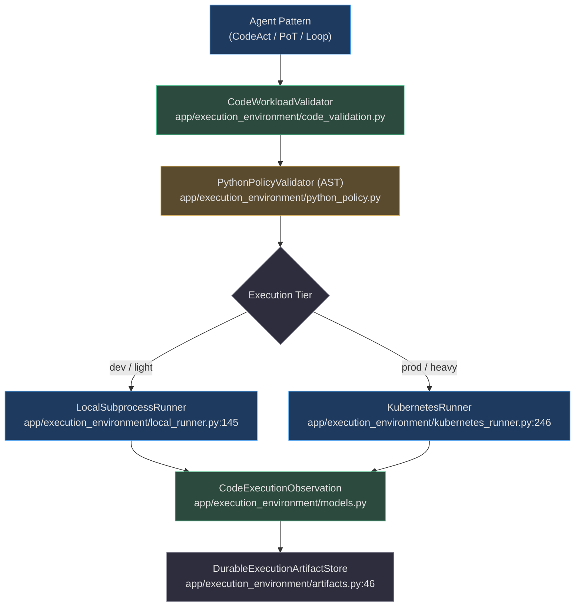
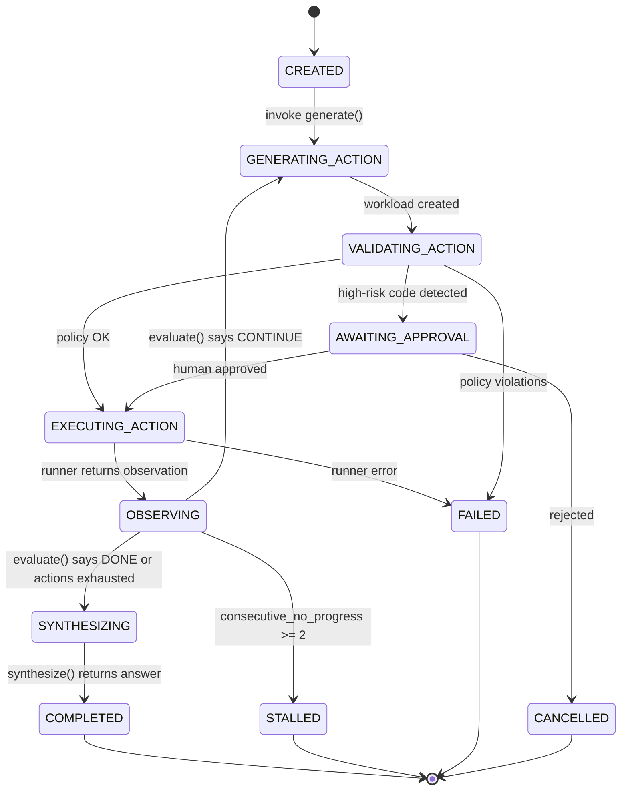
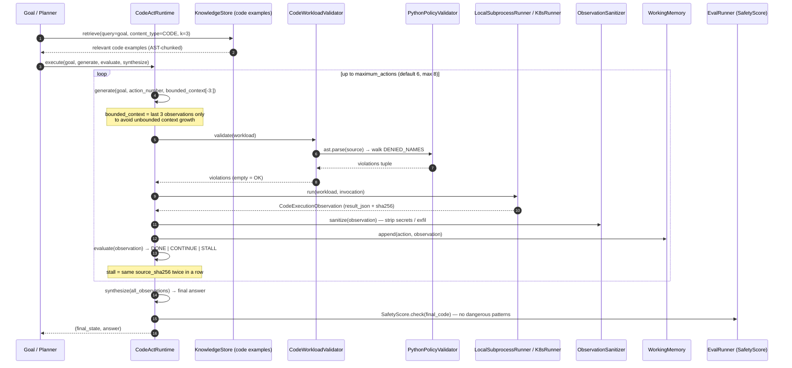
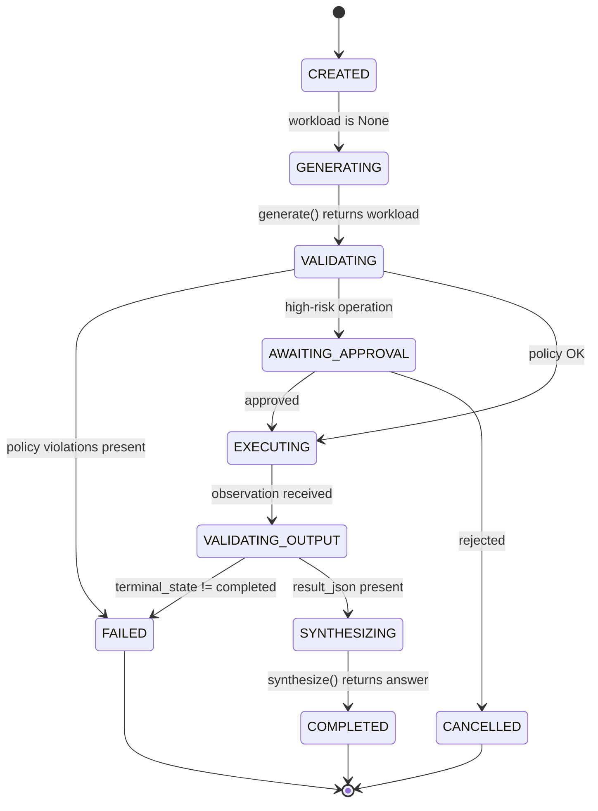
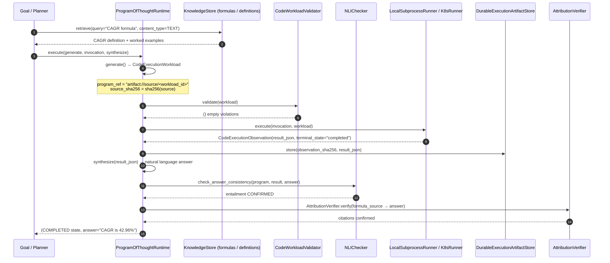
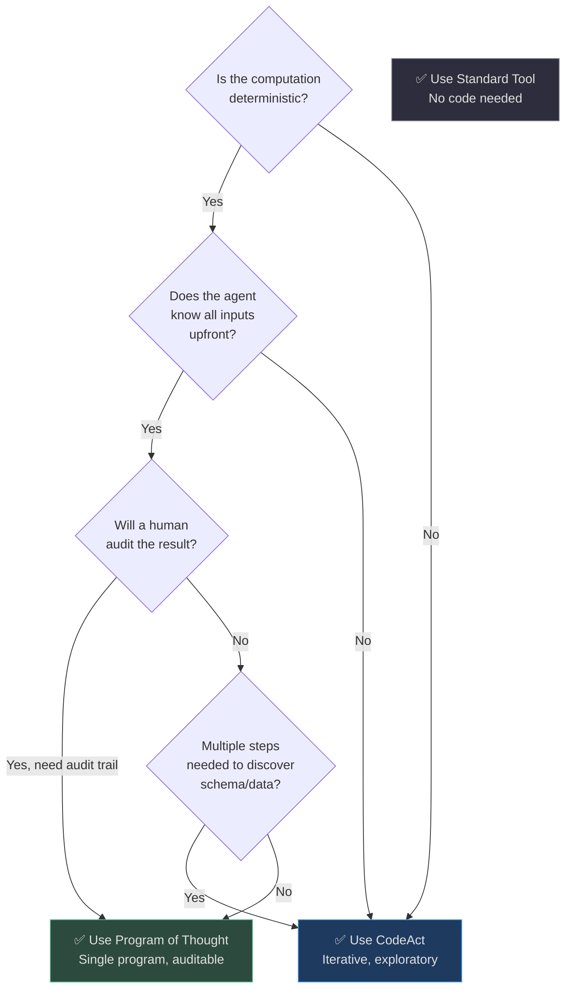
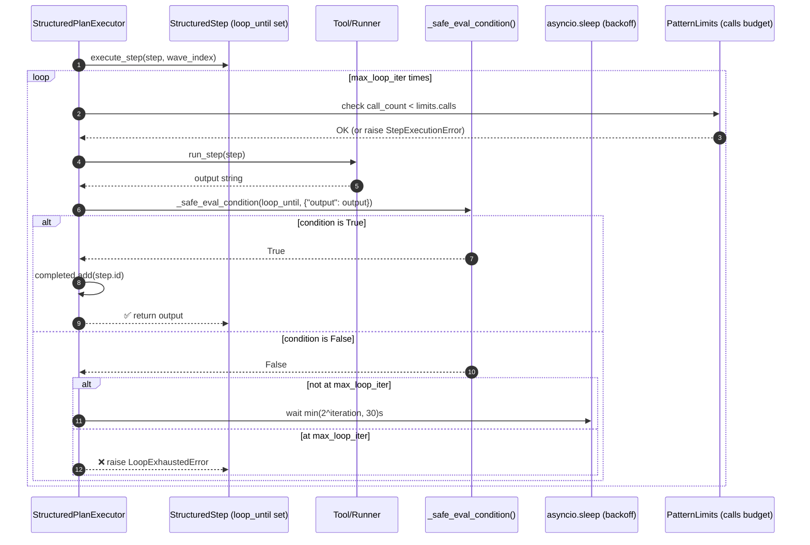
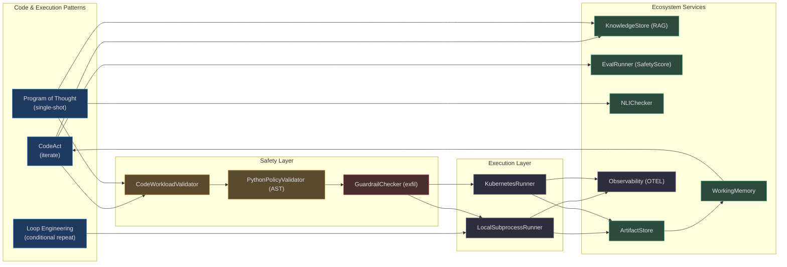

# Code & Execution Patterns

> **Governing principle**: An agent that can write and run code is qualitatively more capable than one that can only call predefined tools. But code is also the most powerful attack surface. These patterns show how AgentVerse makes code execution both maximally capable and deterministically safe.

## Pattern at a Glance

| Pattern | Core Idea | Iterations | Execution Tier | Best For |
|---|---|---|---|---|
| **CodeAct** | Iterative generate→execute→observe loop | 1–8 | `SANDBOX` | Exploratory data work, schema discovery, multi-step debugging |
| **Program-of-Thought** | Single structured program, one-shot execution | 1 | `SANDBOX` | Auditable computation, financial math, reproducible analysis |
| **Loop Engineering** | Conditional repeat until expression or timeout | 1–N | `LOCAL` (caller) | Polling, retry-until-healthy, progressive refinement |

## Shared Infrastructure

All three patterns run through the same **three-layer execution stack**:


<!-- Sources: app/execution_environment/code_validation.py:26, app/execution_environment/python_policy.py:60, app/execution_environment/local_runner.py:145, app/execution_environment/kubernetes_runner.py:246, app/execution_environment/artifacts.py:46 -->

### The Deny-by-Default Python Policy

Before any workload reaches a runner, [`PythonPolicyValidator.validate()`](https://github.com/harsh786/agent-verse/blob/main/agent-verse-backend/app/execution_environment/python_policy.py#L60) performs a full AST walk:

<!-- Source: app/execution_environment/python_policy.py:8-55 -->
```python
ALLOWED_MODULES = frozenset({
    "collections", "datetime", "decimal", "fractions",
    "functools", "itertools", "json", "math", "re", "statistics",
})

DENIED_NAMES = frozenset({
    "__import__", "asyncio", "breakpoint", "compile", "ctypes",
    "eval", "exec", "os", "pathlib", "pickle", "subprocess",
    "sys", "socket", "threading", "open", ...
})
```

This is **deny-by-default** — only 10 safe stdlib modules are explicitly allowed. Any `import` of an unlisted module, or any reference to a name in `DENIED_NAMES`, produces a `CodePolicyViolation` that aborts execution before the subprocess ever starts.

**Workload size limits** ([`CodeWorkloadLimits`](https://github.com/harsh786/agent-verse/blob/main/agent-verse-backend/app/execution_environment/code_validation.py#L12)):

| Limit | Default | Absolute Ceiling |
|---|---|---|
| `source_bytes` | 16 KB | 32 KB |
| `stdin_bytes` | 32 KB | 64 KB |
| `artifact_count` | 8 artifacts | 16 artifacts |
| `ast_depth` | 64 levels | (policy enforced) |

---

## Pattern 1: CodeAct

> **File**: [`app/agent/patterns/codeact.py`](https://github.com/harsh786/agent-verse/blob/main/agent-verse-backend/app/agent/patterns/codeact.py)

### The Core Idea

CodeAct is the agent's equivalent of a programmer at a REPL. Instead of a single tool call, the agent enters an **observe-generate-execute loop**: write code, see what happens, fix and re-run — up to 8 times. The crucial difference from naive code execution is that every action is **hash-stamped** (`source_sha256`), every observation is **content-addressed** (`observation_sha256`), and the loop has a **stall detector** that aborts when no progress is made.

### Real-World Example: Data Analyst Agent

> *Goal*: "Calculate the 30-day rolling average revenue by product category from our sales data."

A standard tool-based approach fails here because the agent doesn't know the table schema. CodeAct turns schema discovery into a first-class step:

| Action | Code Generated | Observation |
|---|---|---|
| **#1** — Introspect | `conn.execute('SHOW TABLES')` | `{tables: ['sales', 'products', 'returns']}` |
| **#2** — Describe | `conn.execute('DESCRIBE sales')` | `{columns: ['date', 'product_id', 'amount', 'category']}` |
| **#3** — Compute | `df.groupby('category').rolling('30D').mean()` | `TypeError: rolling() requires DatetimeIndex` |
| **#4** — Fix | `df.set_index('date').groupby('category')['amount'].rolling(30).mean()` | `{retail: [...], saas: [...], services: [...]}` |
| **#5** — Visualize | `matplotlib.pyplot` chart code | Chart artifact stored |

The agent **discovered the schema, hit a bug, fixed it, and produced the visualization** — all without any predefined tool for "rolling average." This is the power of CodeAct.

### State Machine


<!-- Sources: app/agent/patterns/codeact.py:15-33 (CodeActPhase enum), app/agent/patterns/codeact.py:66-120 (execute loop) -->

### Ecosystem Integration


<!-- Sources: app/agent/patterns/codeact.py:66-150, app/execution_environment/code_validation.py:26-45, app/execution_environment/python_policy.py:60-80, app/execution_environment/local_runner.py:187, app/execution_environment/observation_sanitizer.py -->

### Key Implementation Details

**Stall detection** ([`CodeActState.consecutive_no_progress`](https://github.com/harsh786/agent-verse/blob/main/agent-verse-backend/app/agent/patterns/codeact.py#L49)):

```python
# Prior sources: set of source_sha256 from all previous actions
prior_sources = {item.source_sha256 for item in state.actions}

# If the new code is identical to a prior action's code AND produced
# the same terminal_state — increment consecutive_no_progress.
# At 2 consecutive stalls, phase transitions to STALLED.
```

This prevents infinite loops where the LLM regenerates the same broken code.

**Context bounding** (line ~86):

```python
bounded_context = tuple(
    {
        "observation_sha256": item.observation_sha256,
        "terminal_state": item.terminal_state,
        "result_json": item.result_json,
    }
    for item in observations[-3:]  # Only last 3 observations
)
```

The LLM only ever sees the **last 3 observations** — not the full history. This keeps the context window bounded regardless of how many actions have been taken.

**Checkpointing**: Every state transition calls `checkpoint_callback`, enabling resumption from any point in the action sequence.

### Decision Guide: CodeAct vs Alternatives

| Signal | Choose CodeAct | Choose PoT | Choose Standard Tool |
|---|---|---|---|
| Schema is unknown | ✅ Discovers schema via code | ❌ Schema must be known | ❌ Tool needs schema defined |
| Need to fix your own bugs | ✅ Iterates until success | ❌ One-shot only | ❌ No iteration |
| Result must be auditable/replayable | ⚠️ Action trace available | ✅ Single program artifact | ✅ Tool call logs |
| Computation is purely mathematical | ❌ Overhead not worth it | ✅ Ideal | ✅ Simpler |
| Output involves files/charts | ✅ Artifacts stored | ⚠️ No artifact support | ⚠️ Depends on tool |
| Strict max-latency SLA | ⚠️ Up to 8 iterations | ✅ Single execution | ✅ Single call |

### Anti-Patterns

| Anti-Pattern | Failure Mode | Fix |
|---|---|---|
| **Setting `maximum_actions=8` for simple queries** | 8 LLM calls + 8 executions for a 1-call task | Use PoT for single-computation goals |
| **Missing `evaluate()` logic** | Loop always continues to `maximum_actions` | `evaluate()` must return `DONE` when `terminal_state == "completed"` |
| **Not sanitizing `result_json` before sending to LLM** | Observation contains secrets → prompt injection | Always pipe through `observation_sanitizer.py` |
| **Using CodeAct for fixed-schema queries** | Schema discovery step wasted; slower than direct SQL tool | If schema is known, use a predefined DB tool |
| **`maximum_actions < 3` for exploratory tasks** | Agent can't discover schema AND compute AND visualize | Set to at least 4 for multi-stage analysis |

### Configuration Reference

| Parameter | Default | Range | Guidance |
|---|---|---|---|
| `maximum_actions` | 6 | 1–8 | 3–4 for well-scoped tasks; 6–8 for exploratory data work |
| `source_bytes` limit | 16 KB | up to 32 KB | Increase only for complex ML pipelines |
| `stdin_bytes` limit | 32 KB | up to 64 KB | Increase for large dataset seeds |
| `consecutive_no_progress` threshold | 2 | fixed (1–2) | Do not modify; stall detection is safety-critical |
| `bounded_context` window | 3 | fixed | Increasing risks context overflow with no quality gain |

---

## Pattern 2: Program of Thought

> **File**: [`app/agent/patterns/program_of_thought.py`](https://github.com/harsh786/agent-verse/blob/main/agent-verse-backend/app/agent/patterns/program_of_thought.py)

### The Core Idea

Where CodeAct is iterative and exploratory, Program of Thought (PoT) is **declarative and auditable**. The LLM generates **one program**, the validator approves it, it executes exactly once, and the result is synthesized into an answer. The program itself is a first-class artifact — stored by hash, replayable, reviewable by humans.

Think of PoT as "computation as a document": the program is the audit trail.

### Real-World Example: Financial Computation Agent

> *Goal*: "What is the compound annual growth rate (CAGR) of our ARR from $2.1M in 2022 to $8.7M in 2026?"

```python
# Generated program (structured, human-readable):
arr_2022 = 2_100_000
arr_2026 = 8_700_000
years = 4

cagr = (arr_2026 / arr_2022) ** (1 / years) - 1

# Result: 0.4296... → 42.96%
print({"cagr_pct": round(cagr * 100, 2), "arr_2022": arr_2022, "arr_2026": arr_2026})
```

The program is deterministic. You can re-run it in 6 months and get the same answer. You can share it with an auditor. You cannot do either of those things with a chain-of-thought that lives only in a token stream.

### State Machine


<!-- Sources: app/agent/patterns/program_of_thought.py:17-28 (ProgramOfThoughtPhase), app/agent/patterns/program_of_thought.py:75-130 (execute flow) -->

### Ecosystem Integration


<!-- Sources: app/agent/patterns/program_of_thought.py:75-130, app/execution_environment/code_validation.py, app/intelligence/nli_checker.py:39, app/execution_environment/artifacts.py:46 -->

### PoT vs CodeAct: When to Choose


<!-- Sources: app/agent/patterns/program_of_thought.py:43-50 (ProgramOfThoughtAdapter), app/agent/patterns/codeact.py:60-67 (CodeActAdapter) -->

### Anti-Patterns

| Anti-Pattern | Failure Mode | Fix |
|---|---|---|
| **Using PoT for multi-step analysis** | LLM must write the entire analysis in one program — extremely prone to bugs | Use CodeAct for exploratory multi-step work |
| **No `NLIChecker` verification** | Synthesized answer contradicts computed result | Always verify: `nli.check_answer_consistency(program, result, answer)` |
| **Storing programs without `source_sha256`** | Two programs look identical but compute differently; audit trail broken | Every `ProgramOfThoughtState` stores immutable `source_sha256` |
| **Allowing `pandas` / `numpy` via policy override** | Large attack surface; these modules can do arbitrary I/O | Use only the 10 ALLOWED_MODULES; pull aggregated data as stdin_json |

### Configuration Reference

| Parameter | Default | Guidance |
|---|---|---|
| `source_bytes` | 16 KB | Sufficient for 300–400 line programs |
| `terminal_state` check | `"completed"` | Do not relax to tolerate `"error"` states |
| `synthesize()` | caller-provided | Should produce natural-language answer from `result_json`; keep deterministic |
| `checkpoint_callback` | None | Provide for long-running programs to survive restarts |

---

## Pattern 3: Loop Engineering

> **File**: [`app/agent/patterns/loop_engineering.py`](https://github.com/harsh786/agent-verse/blob/main/agent-verse-backend/app/agent/patterns/loop_engineering.py)
> **Implementation**: [`app/agent/graph.py:_execute_step_with_loop()`](https://github.com/harsh786/agent-verse/blob/main/agent-verse-backend/app/agent/graph.py#L2049) · [`app/agent/structured_executor.py:execute()`](https://github.com/harsh786/agent-verse/blob/main/agent-verse-backend/app/agent/structured_executor.py#L82) · [`app/agent/structured_plan.py:StructuredStep`](https://github.com/harsh786/agent-verse/blob/main/agent-verse-backend/app/agent/structured_plan.py#L108)

### The Core Idea

Loop Engineering is not a separate pattern runtime — it's a **first-class capability built into `StructuredStep`**. Any step in any plan can declare a `loop_until` expression and become a polling/retry loop. The loop integrates with exponential backoff, cancellation signals, and per-tenant cost guards.

### Real-World Example: Deployment Health Monitor

> *Goal*: "Deploy the payments-v2 service and wait until all pods are Running"

```python
# StructuredStep definition (from LLM-generated plan):
StructuredStep(
    id="wait_healthy",
    description="Poll k8s until payments-v2 pods are Running",
    tool="k8s.get_pod_status",
    arguments={"deployment": "payments-v2"},
    loop_until="output.startswith('Running') or 'Error' in output",
    max_loop_iter=20,  # 20 * (exp backoff up to 30s) ≈ 10 minutes max
)
```

| Iteration | t (approx) | output | Action |
|---|---|---|---|
| 1 | 0s | `"Pending"` | Wait 1s (2⁰), retry |
| 2 | 1s | `"ContainerCreating"` | Wait 2s (2¹), retry |
| 3 | 3s | `"ContainerCreating"` | Wait 4s (2²), retry |
| 4 | 7s | `"Running"` | Exit loop ✅ |

The agent never needed to know deployment timing — it adapted.

### Execution Flow


<!-- Sources: app/agent/structured_executor.py:125-196, app/agent/structured_plan.py:100-105 (loop fields), app/agent/graph.py:2049-2095 (_execute_step_with_loop) -->

### Two Loop Implementations

There are **two independent loop implementations** in the codebase, serving different layers:

| Implementation | File | Used By | Key Feature |
|---|---|---|---|
| `_execute_step_with_loop()` | [`graph.py:2049`](https://github.com/harsh786/agent-verse/blob/main/agent-verse-backend/app/agent/graph.py#L2049) | Agent graph directly | Integrates with `AgentState`, SSE events, `CostController` |
| `StructuredPlanExecutor.execute()` | [`structured_executor.py:82`](https://github.com/harsh786/agent-verse/blob/main/agent-verse-backend/app/agent/structured_executor.py#L82) | `LLMCompilerRuntime`, `ReWOORuntime` | Handles wave-level loops, `PatternLimits.fan_out` semaphore |

Both use `_safe_eval_condition()` ([`structured_plan.py`](https://github.com/harsh786/agent-verse/blob/main/agent-verse-backend/app/agent/structured_plan.py#L96)) with a restricted `eval` in a safe builtins context.

### Backoff Strategy

From [`graph.py:2075`](https://github.com/harsh786/agent-verse/blob/main/agent-verse-backend/app/agent/graph.py#L2075):

```python
delay = min(2 ** iteration, 30)  # exponential backoff, max 30s cap
await asyncio.sleep(delay)
```

| Iteration | Delay |
|---|---|
| 0 | 1s |
| 1 | 2s |
| 2 | 4s |
| 3 | 8s |
| 4 | 16s |
| 5+ | 30s (capped) |

### `loop_until` Expression Safety

Loop conditions are evaluated by `_safe_eval_condition()` with restricted builtins:

- **Allowed**: `output`, `iteration`, `iterations` variables; basic string/comparison ops
- **Blocked**: imports, `__builtins__` access, function definitions
- **On error**: defaults to `True` (exit loop safely) — never hangs on bad expressions

### Anti-Patterns

| Anti-Pattern | Failure Mode | Fix |
|---|---|---|
| **`max_loop_iter=100` on an expensive tool** | 100 × LLM executor calls = runaway cost | Set `max_loop_iter` based on timeout budget (e.g., 10 iterations max for 5-minute polling) |
| **`loop_until` references undefined variables** | `_safe_eval_condition` returns `True` (exits immediately) | Test expressions with unit tests; use only `output`, `iteration` variables |
| **No `PatternLimits.calls` budget** | Multi-step plan with multiple looping steps can exhaust the LLM budget | Set `limits.calls` proportional to expected total tool invocations |
| **`loop_until` on WRITE operations** | Loop keeps retrying a write that already succeeded → duplicate writes | Check idempotency; use unique idempotency keys per attempt |

### Configuration Reference

| `StructuredStep` Field | Default | Guidance |
|---|---|---|
| `loop_until` | `None` (no loop) | Python expression; available vars: `output`, `iteration`, `iterations` |
| `max_loop_iter` | 5 | Set to `ceil(timeout_seconds / avg_tool_latency_seconds)` |
| `condition` | `None` (always run) | Pre-condition check; evaluated once before first iteration |
| `can_parallel` | `True` | Set to `False` for steps that must not overlap with other looping steps |

---

## Cross-Pattern Integration: The Full Execution Ecosystem


<!-- Sources: app/agent/patterns/codeact.py, app/agent/patterns/program_of_thought.py, app/agent/graph.py:2049, app/execution_environment/code_validation.py, app/execution_environment/python_policy.py, app/execution_environment/artifacts.py, app/rag/semantic_cache.py:161 -->

---

## Related Pages

| Page | Relationship |
|---|---|
| [01 — Core Execution Patterns](./01-core-execution-patterns.md) | ReAct and plan-execute form the outer loop that CodeAct operates within |
| [02 — Self-Improvement Patterns](./02-self-improvement-patterns.md) | Reflexion can retry a failed CodeAct session with improved prompts |
| [06 — Decomposition & Planning Patterns](./06-decomposition-and-planning-patterns.md) | ReWOO and LLM Compiler can decompose goals into CodeAct steps |
| [04 — Tree & Search Patterns](./04-tree-and-search-patterns.md) | Tree-of-Thoughts can explore multiple CodeAct execution paths simultaneously |
