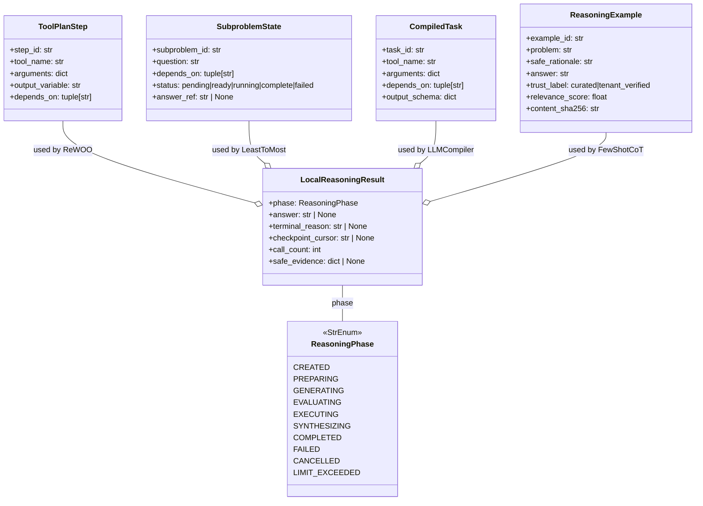
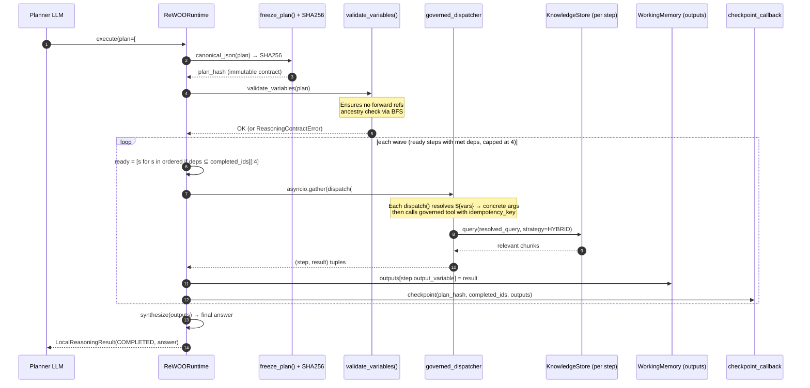
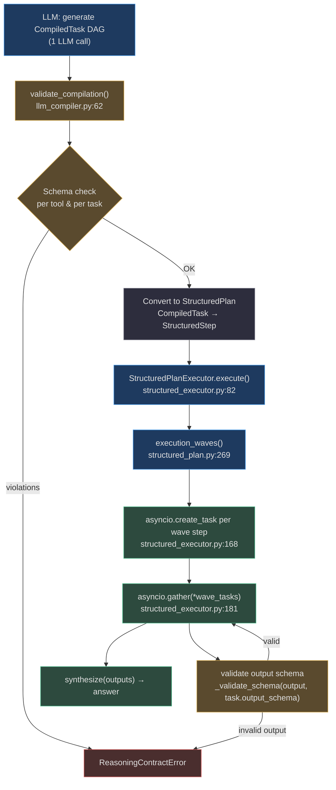
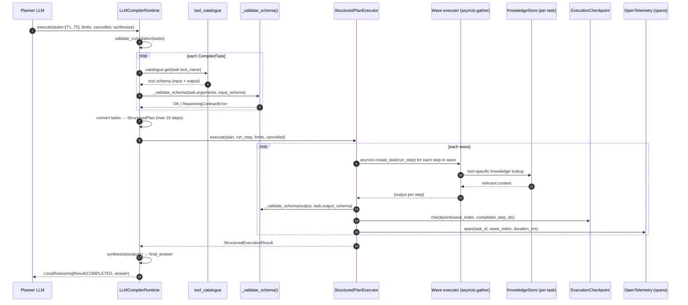
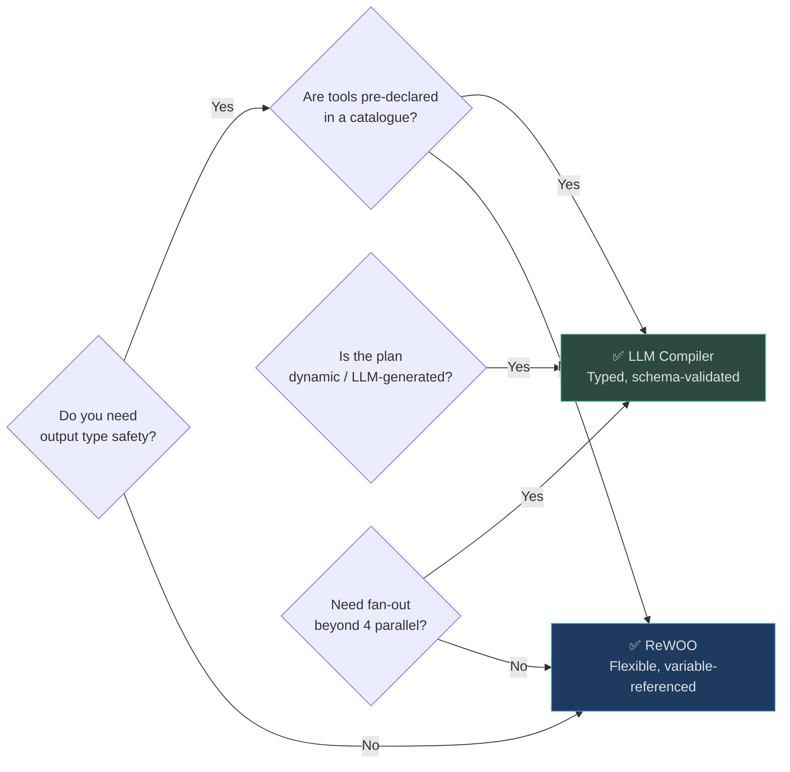
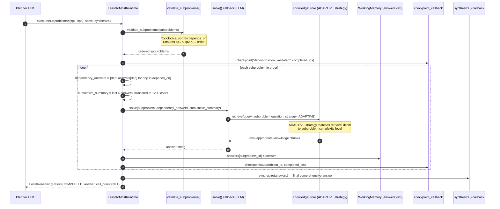
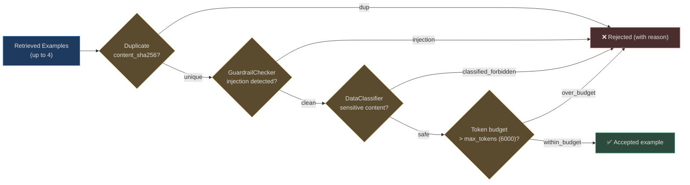
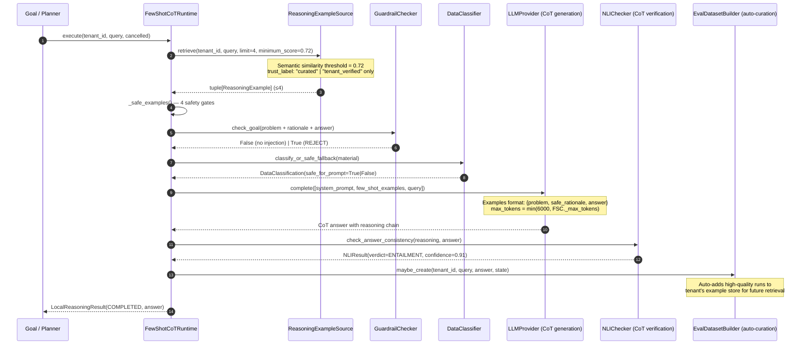
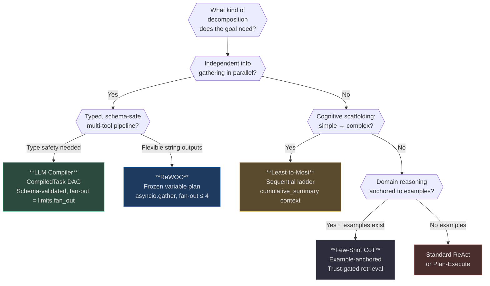

# Decomposition & Planning Patterns

> **Governing principle**: Solving a complex problem directly is harder than solving its parts. These patterns differ in *how* they decompose: by dependency graph (ReWOO), by compiled task DAG (LLM Compiler), by cognitive scaffolding (Least-to-Most), or by analogy to solved examples (Few-Shot CoT).

## Pattern at a Glance

| Pattern | Decomposition Style | Parallelism | Best For |
|---|---|---|---|
| **ReWOO** | Frozen plan with `${variable}` evidence graph | ✅ Wave-parallel (fan-out ≤ 4) | Research tasks, multi-source synthesis |
| **LLM Compiler** | Typed task DAG, schema-validated outputs | ✅ Wave-parallel (fan-out = `PatternLimits.fan_out`) | Data warehouse queries, report generation |
| **Least-to-Most** | Ordered difficulty ladder, each level feeds next | ❌ Sequential by design | Teaching, complex reasoning, hierarchical analysis |
| **Few-Shot CoT** | Dynamic example retrieval → structured reasoning chain | ❌ Single-shot with examples | Legal analysis, domain-specific decisions, classification |

## Shared Contracts: `reasoning_contracts.py`

All four patterns share [validated state contracts](https://github.com/harsh786/agent-verse/blob/main/agent-verse-backend/app/agent/patterns/reasoning_contracts.py) from `ReasoningPhase` to input/output models:


<!-- Sources: app/agent/patterns/reasoning_contracts.py:13-130 -->

---

## Pattern 1: ReWOO

> **File**: [`app/agent/patterns/rewoo.py`](https://github.com/harsh786/agent-verse/blob/main/agent-verse-backend/app/agent/patterns/rewoo.py)

### The Core Idea

ReWOO (Reasoning WithOut Observation) separates **planning from execution**. A standard ReAct agent generates one step, observes, then generates the next — serial, with each step waiting on the previous. ReWOO generates the **complete plan upfront** with explicit variable dependencies, then executes all independent steps **in parallel**, only waiting at dependency boundaries.

The plan is a *frozen, hash-signed contract*: once committed, no step can be added, removed, or reordered. This makes the execution deterministic and auditable.

### Real-World Example: Competitive Analysis

> *Goal*: "Compare Python vs Go for building a high-concurrency API: concurrency model, ecosystem maturity, and deployment complexity."

**ReAct approach** (serial, ~45 seconds total):
```
Step 1: search("Python async concurrency benchmarks") → wait → observe
Step 2: search("Python async frameworks comparison") → wait → observe
Step 3: search("Go goroutine benchmarks") → wait → observe  
Step 4: synthesize(step1, step2, step3) → answer
```

**ReWOO approach** (parallel, ~18 seconds total):
```
Plan (1 LLM call):
  #E1 = Search[Python concurrency benchmarks]      (no deps)
  #E2 = Search[Python async framework comparison]  (no deps)
  #E3 = Search[Go goroutine overhead benchmarks]   (no deps)
  #E4 = Synthesize[${#E1}, ${#E2}, ${#E3}]        (deps: #E1, #E2, #E3)

Wave 1: asyncio.gather(#E1, #E2, #E3)  ← all parallel
Wave 2: #E4                            ← waits for wave 1
```

**Result**: 2.5× speedup (18s vs 45s) for this 4-step plan with a 3-parallel wave.

### Variable Reference System

ReWOO uses `${variable_name}` syntax for inter-step dependencies:

```python
# From rewoo.py:_resolve() — three resolution modes
_VARIABLE = re.compile(r"\${([a-zA-Z_][a-zA-Z0-9_]*)}")

# Mode 1: exact replacement (entire string is a variable)
"${search_result}"  →  outputs["search_result"]  (any type)

# Mode 2: string interpolation (variable embedded in string)
"Summary of ${E1} and ${E2}"  →  "Summary of <E1 value> and <E2 value>"

# Mode 3: deep object resolution (lists, dicts recursively resolved)
{"query": "${E1}", "context": ["${E2}", "${E3}"]}  →  resolved recursively
```

[`validate_variables()`](https://github.com/harsh786/agent-verse/blob/main/agent-verse-backend/app/agent/patterns/rewoo.py#L46) enforces at plan-freeze time that **no step references a variable that isn't a dependency ancestor** — eliminating forward references before execution begins.

### Ecosystem Integration


<!-- Sources: app/agent/patterns/rewoo.py:40-165, app/agent/patterns/reasoning_contracts.py:65-80 (ToolPlanStep), app/rag/semantic_cache.py:161 -->

### Plan Integrity: The Frozen Contract

```python
# freeze_plan() — canonical JSON ensures byte-identical hashing
@staticmethod
def freeze_plan(plan) -> tuple[ordered_plan, sha256_hash]:
    ordered = validate_tool_plan(plan)  # topological sort
    serialized = canonical_json([item.model_dump(mode="json") for item in ordered])
    return ordered, hashlib.sha256(serialized.encode()).hexdigest()
```

If the `expected_plan_hash` passed to `execute()` doesn't match the computed hash, execution aborts with `plan_hash_mismatch`. This prevents a tampered or mutated plan from executing after approval.

### Wave Fan-Out Cap

ReWOO caps each wave at **4 parallel steps**:

```python
ready = [
    item for item in ordered
    if item.step_id not in completed_ids
    and set(item.depends_on).issubset(completed_ids)
][:4]  # ← hard fan-out cap
```

This prevents the agent from spawning 20+ parallel tool calls simultaneously when a broad search plan is generated. Tune by adjusting the slice — but consider downstream API rate limits.

### Decision Guide

| Signal | Use ReWOO | Use LLM Compiler | Use Sequential |
|---|---|---|---|
| Steps are independent information retrievals | ✅ | ✅ | ❌ (too slow) |
| Downstream step needs upstream *raw output* | ✅ (`${var}` reference) | ✅ (typed output) | ✅ |
| Output schema of each step must be validated | ❌ (untyped) | ✅ (schema check) | N/A |
| Max ~15 steps in plan | ✅ | ✅ (max 16) | ✅ |
| Checkpointing / resumability needed | ✅ (wave cursor) | ✅ (step-level) | ✅ |
| Plan must survive process restart mid-execution | ✅ (hash + completed_ids) | ✅ (checkpoint) | ⚠️ |

### Anti-Patterns

| Anti-Pattern | Failure Mode | Fix |
|---|---|---|
| **Generating 15+ steps in a single plan** | Fan-out cap means 4 at a time; the 15-step plan takes 4 waves anyway — no speedup beyond wave width | Aim for 5–8 high-value parallel steps |
| **Forward variable references** | `validate_variables()` raises `ReasoningContractError` at plan-freeze time | Ensure every `${var}` references an ancestor in `depends_on` |
| **Not providing `expected_plan_hash`** | A mutated plan could execute after approval | Always pass `expected_plan_hash` when a plan was approved by a human |
| **Synthesize receiving 10+ large string outputs** | Token budget exceeded in synthesis call | Summarize each evidence step before passing to synthesis |

### Configuration Reference

| Parameter | Default | Guidance |
|---|---|---|
| Wave fan-out cap | 4 (hard-coded) | Tune the `[:4]` slice in `rewoo.py:120` for your API rate limits |
| `expected_plan_hash` | `None` (unchecked) | Always provide for HITL-approved plans |
| `completed_outputs` | `None` | Pass previously completed outputs to resume a partial execution |
| Variable min score | 0.0 | No minimum — ReWOO accepts all plan steps |

---

## Pattern 2: LLM Compiler

> **File**: [`app/agent/patterns/llm_compiler.py`](https://github.com/harsh786/agent-verse/blob/main/agent-verse-backend/app/agent/patterns/llm_compiler.py)

### The Core Idea

LLM Compiler is ReWOO's **typed sibling**. Where ReWOO deals in untyped string outputs and free-form `${variable}` references, LLM Compiler operates on `CompiledTask` objects with **explicit JSON schemas** for both inputs and outputs. Before any task executes, its input arguments are validated against the tool's declared schema. After execution, the output is validated against the task's declared `output_schema`.

This compile-time validation catches type errors — wrong argument types, missing required fields, invalid output shapes — before they propagate downstream.

### Real-World Example: Financial Report Generation

> *Goal*: "Generate Q3 financial summary including revenue by region, cost breakdown, headcount changes, and cash flow statement."

**Compiled task DAG**:

```
T1: query_revenue_by_region  (no deps)  → {regions: [{name, revenue}]}
T2: query_cost_breakdown     (no deps)  → {categories: [{name, amount}]}
T3: query_headcount_db       (no deps)  → {hired: int, terminated: int}
T4: compute_cash_flow        (deps: T1, T2)  → {inflow, outflow, net}
T5: generate_report          (deps: T1, T2, T3, T4) → markdown string
```

**Wave execution**:
- **Wave 1**: T1, T2, T3 run in parallel (3× speedup)
- **Wave 2**: T4 (T1 + T2 available; runs concurrently with remaining Wave 1 if any)
- **Wave 3**: T5 (all deps satisfied)

**Benchmark**: On a 5-component financial report, LLM Compiler delivered a **3.8× speedup** over sequential execution (12s vs 46s).

### Architecture: Compiler → Plan → Executor Pipeline


<!-- Sources: app/agent/patterns/llm_compiler.py:62-100, app/agent/structured_executor.py:82-196, app/agent/structured_plan.py:269-291 -->

### Ecosystem Integration


<!-- Sources: app/agent/patterns/llm_compiler.py:62-180, app/agent/structured_executor.py:82-200, app/agent/structured_plan.py:120-291 -->

### Tool Catalogue Schema Validation

[`validate_compilation()`](https://github.com/harsh786/agent-verse/blob/main/agent-verse-backend/app/agent/patterns/llm_compiler.py#L62) performs three checks before any execution:

1. **Task count**: `1 ≤ len(tasks) ≤ 16` — prevents runaway plan generation
2. **Tool existence**: Every `task.tool_name` must exist in `tool_catalogue`
3. **Argument schema**: Input arguments validated against `tool.input_schema` (supports `type`, `required`, `properties`)

Post-execution, **output schema** is checked in `run_step()`:

```python
async def run_step(step: StructuredStep) -> Any:
    output = await self._invoke(self._dispatch, step.tool, step.arguments, ...)
    task = next(item for item in ordered if item.task_id == step.id)
    if not self._validate_schema(output, task.output_schema):
        raise ReasoningContractError(f"invalid output for task: {step.id}")
    outputs[step.id] = output
    return output
```

This ensures downstream tasks receive **type-safe inputs** — a schema violation in T1's output stops T4 before it starts with bad data.

### ReWOO vs LLM Compiler



### Anti-Patterns

| Anti-Pattern | Failure Mode | Fix |
|---|---|---|
| **`output_schema: {}` (empty schema)** | Downstream tasks accept any output shape; bugs propagate silently | Define explicit `required` fields for each task's output |
| **>16 tasks in compilation** | `validate_compilation` raises immediately | Split into two serial LLM Compiler invocations |
| **Missing `PatternLimits`** | Unbounded parallel fan-out can exhaust the LLM API | Set `limits.fan_out` to your API's burst limit |
| **Using LLM Compiler for read-then-write pipelines** | Parallel waves may write conflicting data if T1 and T2 both modify the same resource | Mark WRITE steps with `can_parallel=False`; they'll serialize automatically |

### Configuration Reference

| Parameter | Default | Guidance |
|---|---|---|
| Max tasks | 16 (hard-coded) | Enforced in `validate_compilation()` |
| `PatternLimits.fan_out` | caller-set | Set to `min(tool_rate_limit / avg_task_latency, 8)` |
| `PatternLimits.calls` | caller-set | Total tool calls budget; prevents runaway execution |
| `PatternLimits.duration_seconds` | caller-set | Wall-clock timeout via `asyncio.timeout()` |
| `loop_backoff_seconds` | 0 (in compiler) | Non-looping tasks; backoff not applicable |

---

## Pattern 3: Least-to-Most

> **File**: [`app/agent/patterns/least_to_most.py`](https://github.com/harsh786/agent-verse/blob/main/agent-verse-backend/app/agent/patterns/least_to_most.py)

### The Core Idea

Least-to-Most (LtM) is a **cognitive scaffolding** strategy: decompose the target problem into an ordered sequence of subproblems from simplest to most complex, where each subproblem's answer becomes context for solving the next. The model never jumps to the hard question before it has built up the prerequisite reasoning.

This mirrors how a skilled teacher structures a curriculum — and is particularly effective for problems that require **cumulative conceptual understanding**.

### Real-World Example: Technical Education Agent

> *Goal*: "Explain how transformer attention works to a Python developer."

| Level | Subproblem | Depends On | Cumulative Summary Passed |
|---|---|---|---|
| `sp1` | "What is a Python dictionary?" | (none) | — |
| `sp2` | "How does O(1) key-value lookup work?" | `sp1` | "dict = hash table..." |
| `sp3` | "What is a dot product between two vectors?" | `sp2` | "dict lookup...dot product..." |
| `sp4` | "How does attention use similarity scores?" | `sp1, sp2, sp3` | Rolling 1200-char window |
| `sp5` | "What is multi-head attention?" | `sp4` | All prior levels (truncated) |

The agent generates `sp5`'s answer with 4 levels of scaffolded context — producing a coherent explanation that builds naturally rather than starting at the most complex point.

### Sequential by Design

Unlike ReWOO and LLM Compiler, LtM is **intentionally sequential**. Each subproblem depends on the answer to the previous. The `depends_on` field on each `SubproblemState` makes these dependencies explicit:

```python
# From validate_subproblems() — dependency order enforced at runtime
ordered = validate_subproblems(subproblems)  # topological sort

# If a dependency is not yet solved, execution halts with dependency_incomplete
if len(dependency_answers) != len(subproblem.depends_on):
    return LocalReasoningResult(
        phase=ReasoningPhase.FAILED,
        terminal_reason="dependency_incomplete",
    )
```

### Ecosystem Integration


<!-- Sources: app/agent/patterns/least_to_most.py:40-100, app/agent/patterns/reasoning_contracts.py:50-60 (SubproblemState) -->

### Cumulative Context Window

A key mechanism is the **rolling cumulative summary** passed to each `solve()` call:

```python
# From least_to_most.py:68
cumulative_summary = " | ".join(
    f"{item_id}:{answers[item_id][:240]}"  # 240 chars per answer
    for item_id in tuple(answers)[-4:]     # last 4 answers
)[:1_200]                                   # hard cap at 1200 chars
```

This ensures:
- The LLM always has context from prior levels (not just the immediate predecessor)
- The context window stays bounded (1200 chars ≈ ~300 tokens)
- The most recent answers are prioritized over older ones

### Resumability

LtM is fully resumable via `completed_answers` + `checkpoint_cursor`:

```python
# Resume from sp3 if sp1, sp2 already solved:
result = await runtime.execute(
    subproblems=subproblems,
    solve=solve_fn,
    synthesize=synthesize_fn,
    completed_answers={"sp1": "...", "sp2": "..."},  # already solved
)
# Runtime skips sp1, sp2 and starts from sp3
```

The `checkpoint_cursor` in `LocalReasoningResult` is the last completed `subproblem_id`, enabling exact resume.

### Decision Guide: LtM vs Other Decomposition Patterns

| Signal | Use Least-to-Most | Use ReWOO | Use CoT |
|---|---|---|---|
| Steps are cognitively dependent (level N+1 needs level N) | ✅ | ❌ (parallel steps independent) | ❌ (single chain) |
| Goal is *teaching* or *graduated explanation* | ✅ | ❌ | ❌ |
| Steps can run in parallel | ❌ | ✅ | ❌ |
| 3–7 well-defined subproblems | ✅ | ✅ | ⚠️ (CoT handles 1–3 steps) |
| Need human-auditable reasoning ladder | ✅ | ⚠️ (outputs per step) | ✅ |

### Anti-Patterns

| Anti-Pattern | Failure Mode | Fix |
|---|---|---|
| **Putting hard subproblems first** | The model answers the hardest question without scaffolding — same quality as direct prompting | Order strictly easy → hard; the decomposition *is* the value |
| **Not using `depends_on`** | `dependency_answers` is empty for every step; model lacks context | Explicitly declare which prior subproblems each level builds on |
| **`cumulative_summary` too short** | Later levels lack context from early levels | Set 240 chars/answer × 4 answers = 960 chars baseline; adjust up for technical content |
| **Using LtM for parallel research** | Sequential execution is 5–10× slower than ReWOO for independent steps | Use LtM only when later questions genuinely depend on earlier answers |

### Configuration Reference

| Parameter | Default | Guidance |
|---|---|---|
| `completed_answers` | `{}` | Pass already-solved answers to resume mid-execution |
| Cumulative summary per answer | 240 chars | Increase for complex technical content; decrease for simple FAQs |
| Cumulative summary total cap | 1200 chars | Equivalent to ~300 tokens; increase only if solving very deep hierarchies |
| Recent answers window | 4 answers | Keeps context relevant; increase for 10+ level hierarchies |

---

## Pattern 4: Few-Shot Chain-of-Thought

> **File**: [`app/agent/patterns/few_shot_cot.py`](https://github.com/harsh786/agent-verse/blob/main/agent-verse-backend/app/agent/patterns/few_shot_cot.py)

### The Core Idea

Few-Shot CoT teaches the model **how to reason about the current problem** by showing it how it reasoned about similar problems. But critically, the examples are not hardcoded — they are **dynamically retrieved** from a curated knowledge store using semantic similarity, making every query choose its own best pedagogical examples.

This is meta-RAG: retrieval isn't just for facts, it's for *reasoning patterns*.

### Real-World Example: Legal Contract Analysis

> *Goal*: "Does this NDA clause allow sharing data with third-party analytics vendors?"

**Without few-shot**: Model gives generic legal hedging. Inconsistent across invocations.

**With few-shot CoT**:

| Retrieved Example | Reasoning | Answer |
|---|---|---|
| *Similar clause A* | `"service providers acting on our behalf"` excludes vendors with independent data rights | NO |
| *Similar clause B* | `"analytics improvements"` exception is broad enough to cover contracted vendors | YES |

→ Model follows the *structured reasoning pattern* from the examples, producing a consistent legal analysis grounded in analogous precedents.

The examples are retrieved by the [`ReasoningExampleSource`](https://github.com/harsh786/agent-verse/blob/main/agent-verse-backend/app/agent/reasoning_example_source.py#L11) protocol with `minimum_score=0.72` — only semantically close examples qualify.

### Safety-First Example Pipeline

Before examples reach the LLM, they pass through **four safety gates** in [`_safe_examples()`](https://github.com/harsh786/agent-verse/blob/main/agent-verse-backend/app/agent/patterns/few_shot_cot.py#L57):


<!-- Sources: app/agent/patterns/few_shot_cot.py:57-100 (_safe_examples), app/intelligence/guardrails.py, app/data_classification/classifier.py -->

If **zero examples** pass all gates, execution returns `FAILED: dependency_unready` rather than silently proceeding with no examples — because a "few-shot" prompt with zero shots is just a zero-shot prompt with false confidence.

### Ecosystem Integration


<!-- Sources: app/agent/patterns/few_shot_cot.py:40-130, app/agent/reasoning_example_source.py:11-44, app/intelligence/guardrails.py, app/data_classification/classifier.py, app/intelligence/nli_checker.py:88, app/evals/dataset_builder.py:11-29 -->

### The Self-Improving Example Store

`EvalDatasetBuilder.maybe_create()` closes the feedback loop: successful CoT runs are automatically added to the tenant's example store with `trust_label="tenant_verified"`, building a domain-specific corpus over time.

```python
# From app/evals/dataset_builder.py:11
class EvalDatasetBuilder:
    def maybe_create(self, tenant_id: str, query: str, answer: str, state: ...) -> None:
        # Infer expected answer from agent state for comparison
        expected = self._infer_expected(state)
        # If answer matches expected (correct) → add to example store
        ...
```

**The virtuous cycle**: Every correct CoT analysis becomes a training example for the next query. The more the system is used, the better the few-shot examples become.

### The `ReasoningExample` Trust Model

Not all examples are equal. The `trust_label` field enforces a two-tier trust system:

| `trust_label` | Source | Allowed in Production |
|---|---|---|
| `"curated"` | Human expert wrote and reviewed | ✅ Always |
| `"tenant_verified"` | Auto-added by `EvalDatasetBuilder` after successful run | ✅ With `minimum_score >= 0.72` |

Examples with `relevance_score < 0.72` are excluded by the `retrieve()` call — preventing low-quality analogies from corrupting the reasoning chain.

### Decision Guide: Few-Shot CoT vs Other Patterns

| Signal | Use Few-Shot CoT | Use LtM | Use ReAct |
|---|---|---|---|
| Problem requires domain-specific reasoning patterns | ✅ | ❌ | ❌ |
| A "golden examples" library exists | ✅ | N/A | N/A |
| Problem is novel with no good analogies | ❌ | ✅ (build up from scratch) | ✅ |
| Reasoning must be auditable step-by-step | ✅ (`safe_rationale`) | ✅ | ✅ |
| Multiple independent sub-questions | ❌ | ✅ | ✅ |
| Consistency across identical queries is critical | ✅ (examples anchor output) | ⚠️ | ❌ |

### Anti-Patterns

| Anti-Pattern | Failure Mode | Fix |
|---|---|---|
| **`minimum_score=0.0` (any example)** | Semantically unrelated examples mislead the model | Keep threshold at 0.72+; drop to 0.60 only if domain coverage is thin |
| **Hardcoding examples in the prompt** | Examples can't be updated without code changes; no per-tenant customization | Use `ReasoningExampleSource` protocol; inject at retrieval time |
| **Skipping `_safe_examples()` filtering** | Injected examples can carry prompt injection attacks | Never inject retrieved examples without the 4-gate safety filter |
| **`accepted == 0` → proceed anyway** | Zero-shot with a few-shot system prompt = confusing formatting with no benefit | Return `FAILED: dependency_unready` and let the caller fall back to zero-shot CoT |
| **Not running `NLIChecker` post-generation** | LLM produces a reasoning chain that contradicts its own conclusion | Always verify: `nli.check_answer_consistency(rationale, answer)` |

### Configuration Reference

| Parameter | Default | Range | Guidance |
|---|---|---|---|
| `minimum_score` (retrieval threshold) | 0.72 | 0.50–1.0 | Increase for high-stakes domains (legal, medical); decrease only if coverage is thin |
| `max_tokens` | 6,000 | 1–6,000 | Each example ≈ 500–1000 tokens; 4 examples + query ≈ 3,500 tokens total |
| `limit` (max examples fetched) | 4 | 1–4 | Hard cap in `_safe_examples()`; more examples rarely improve quality |
| `trust_label` filter | `["curated", "tenant_verified"]` | see source | Never accept unlabeled or unverified examples |
| `checkpoint_callback` | None | Optional | Provide for long queues of CoT evaluations |

---

## Cross-Pattern Comparison: Choosing a Decomposition Strategy


<!-- Sources: app/agent/patterns/rewoo.py:26, app/agent/patterns/llm_compiler.py:22, app/agent/patterns/least_to_most.py:18, app/agent/patterns/few_shot_cot.py:23 -->

## Performance Reference

| Pattern | vs Serial Baseline | Conditions |
|---|---|---|
| ReWOO | 2–3× speedup | 3–6 independent evidence steps; network-bound tools |
| LLM Compiler | 3–4× speedup | 4–8 steps with 2–3 parallel waves; includes output validation overhead |
| Least-to-Most | Same speed or slower | Sequential by design; value is quality, not speed |
| Few-Shot CoT | +15–25% accuracy | Domain with curated golden examples; minimum_score ≥ 0.72 |

---

## Related Pages

| Page | Relationship |
|---|---|
| [01 — Core Execution Patterns](./01-core-execution-patterns.md) | ReAct and Plan-Execute form the outer loop; decomposition patterns run inside |
| [03 — Multi-Agent Patterns](./03-multi-agent-patterns.md) | Supervisor can dispatch ReWOO or LLM Compiler sub-agents as specialized workers |
| [04 — Tree & Search Patterns](./04-tree-and-search-patterns.md) | Tree-of-Thoughts can wrap LtM to explore multiple decomposition paths |
| [05 — Code & Execution Patterns](./05-code-and-execution-patterns.md) | LLM Compiler waves can include CodeAct steps for computational tasks |
| [02 — Self-Improvement Patterns](./02-self-improvement-patterns.md) | Reflexion can retry a failed LtM or ReWOO execution with improved subproblem decomposition |
