# Autonomous & Constitutional Patterns

> **Governing principle**: The most capable agents are the ones that govern themselves. These four patterns represent the frontier of agent autonomy — agents that generate their own tasks, accumulate skills across runs, and impose ethical constraints on their own outputs, all while remaining bounded and auditable by the AgentVerse runtime.

## Pattern at a Glance

| Pattern | Autonomy Model | Key Mechanic | Token Cost | Execution Tier | Best For |
|---|---|---|---|---|---|
| **AutoGPT** | Self-directed task queue | Plans → gates → executes → stagnation-checks | **Very High** | `DISTRIBUTED` | Open-ended research, multi-step autonomous workflows |
| **BabyAGI** | Fixed create→execute loop | Priority-sorted `DurableWorkItem` queue | **High** | `DISTRIBUTED` | Continuous monitoring, systematic enumeration |
| **Voyager** | Curriculum skill synthesis | Evidence-backed `ProcedureContract` publication | **High** | `DISTRIBUTED` | Growing DevOps automation, skill accumulation |
| **Constitutional AI** | Deterministic policy review | Critique → revise under `RuntimeConstraints` | **Low** (`model_calls ≤ 2`) | `LOCAL` | Customer-facing responses, safety-critical outputs |

---

## System-Level Architecture

```mermaid
graph TB
    subgraph AUTONOMOUS["Autonomous Execution Tier (DISTRIBUTED)"]
        AutoGPT["AutoGPTRuntime<br>action loop + stagnation guard"]
        BabyAGI["BabyAGIRuntime<br>work_item queue + priority sort"]
        Voyager["VoyagerRuntime<br>curriculum → synthesize → publish"]
    end

    subgraph CONSTITUTIONAL["Constitutional Review Tier (LOCAL)"]
        CAI["ConstitutionalAIRuntime<br>critique + revise in ≤ 2 calls"]
    end

    subgraph GOVERNANCE["Governance & Safety"]
        PreGate["pre_execution_gate<br>(AutoGPT pre-run guard)"]
        Cost["CostController<br>per_goal_usd / per_tenant_daily_usd"]
        Enforcer["RuntimeEnforcer<br>is_capability_allowed()"]
        Constraints["RuntimeConstraints<br>allowed_capabilities / denied_capabilities"]
    end

    subgraph MEMORY["Memory Subsystem"]
        Prospective["ProspectiveMemory<br>leased task queue"]
        LTM["LongTermMemoryStore<br>cross-session learnings"]
        Salience["SalienceScorer<br>recency + relevance + frequency"]
        Consolidator["MemoryConsolidator<br>cluster + compress"]
        ProcValidator["ProcedureContract<br>versioned + policy-fingerprinted"]
        SkillStore["VoyagerSkillStore<br>publish + immutable versioning"]
    end

    AutoGPT --> PreGate
    AutoGPT --> Cost
    BabyAGI --> Prospective
    Voyager --> SkillStore
    Voyager --> ProcValidator
    CAI --> Enforcer
    CAI --> Constraints
    PreGate --> Enforcer
    LTM --> Salience
    Consolidator --> LTM

    style AutoGPT fill:#1e3a5f,stroke:#4a9eed,color:#e0e0e0
    style BabyAGI fill:#1e3a5f,stroke:#4a9eed,color:#e0e0e0
    style Voyager fill:#1e3a5f,stroke:#4a9eed,color:#e0e0e0
    style CAI fill:#2d4a3e,stroke:#4aba8a,color:#e0e0e0
    style PreGate fill:#4a2e2e,stroke:#d45b5b,color:#e0e0e0
    style Cost fill:#4a2e2e,stroke:#d45b5b,color:#e0e0e0
    style Enforcer fill:#4a2e2e,stroke:#d45b5b,color:#e0e0e0
    style Constraints fill:#4a2e2e,stroke:#d45b5b,color:#e0e0e0
    style Prospective fill:#2d2d3d,stroke:#7a7a8a,color:#e0e0e0
    style LTM fill:#2d2d3d,stroke:#7a7a8a,color:#e0e0e0
    style Salience fill:#2d2d3d,stroke:#7a7a8a,color:#e0e0e0
    style Consolidator fill:#2d2d3d,stroke:#7a7a8a,color:#e0e0e0
    style ProcValidator fill:#5a4a2e,stroke:#d4a84b,color:#e0e0e0
    style SkillStore fill:#5a4a2e,stroke:#d4a84b,color:#e0e0e0
    style AUTONOMOUS fill:#0d1b2e,stroke:#4a9eed,color:#e0e0e0
    style CONSTITUTIONAL fill:#0d2e1e,stroke:#4aba8a,color:#e0e0e0
    style GOVERNANCE fill:#2e0d0d,stroke:#d45b5b,color:#e0e0e0
    style MEMORY fill:#1a1a2e,stroke:#7a7a8a,color:#e0e0e0
```

<!-- Sources: app/agent/patterns/autogpt.py, app/agent/patterns/babyagi.py, app/agent/patterns/voyager.py, app/agent/patterns/constitutional_ai.py, app/memory/prospective.py, app/memory/long_term.py, app/memory/salience.py, app/memory/consolidation.py, app/memory/voyager_skills.py, app/memory/procedural_validator.py, app/governance/cost.py, app/policy_runtime/runtime_enforcer.py, app/policy_runtime/constraint_model.py -->

---

## 1. AutoGPT — Bounded Autonomous Action Loop

### What It Is

AutoGPT is AgentVerse's implementation of the self-directed agent loop: the agent plans an action, passes it through a mandatory pre-execution gate, executes it, and checks whether its work is making progress. The key safety innovations in this implementation are the **pre-execution gate** (all actions must be approved before running) and the **stagnation guard** (repeated identical outputs force human review rather than infinite loops).

### Real-World Example

> **Goal**: "Research and write a comprehensive report on quantum computing threats to current encryption standards"

An AutoGPT agent self-manages its entire workflow:

1. **Plan** → generate action: `{ "tool": "web_search", "query": "quantum computing timeline predictions 2030" }`
2. **Gate** → `pre_execution_gate` approves (low-risk read-only action)
3. **Execute** → returns 8 articles, digest = `sha256("article content...")`
4. **Loop** → `action_count = 1`, `stagnation_count = 0`
5. ...after 12 actions, `result.get("completed") == True` → `phase → "completed"`

If action 7 returns the same digest as action 6: `stagnation_count = 1`. At `maximum_stagnation` (e.g., 3): `phase → "awaiting_human"` with `terminal_reason = "stagnation"` — the agent pauses and escalates rather than burning budget.

### AutoGPT State Machine

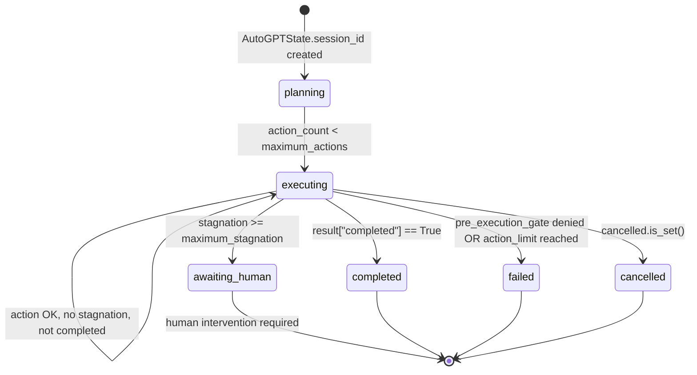

<!-- Sources: app/agent/patterns/autogpt.py:21-23 (phase literals), app/agent/patterns/autogpt.py:97-106 (terminal transitions) -->

### Execution Sequence

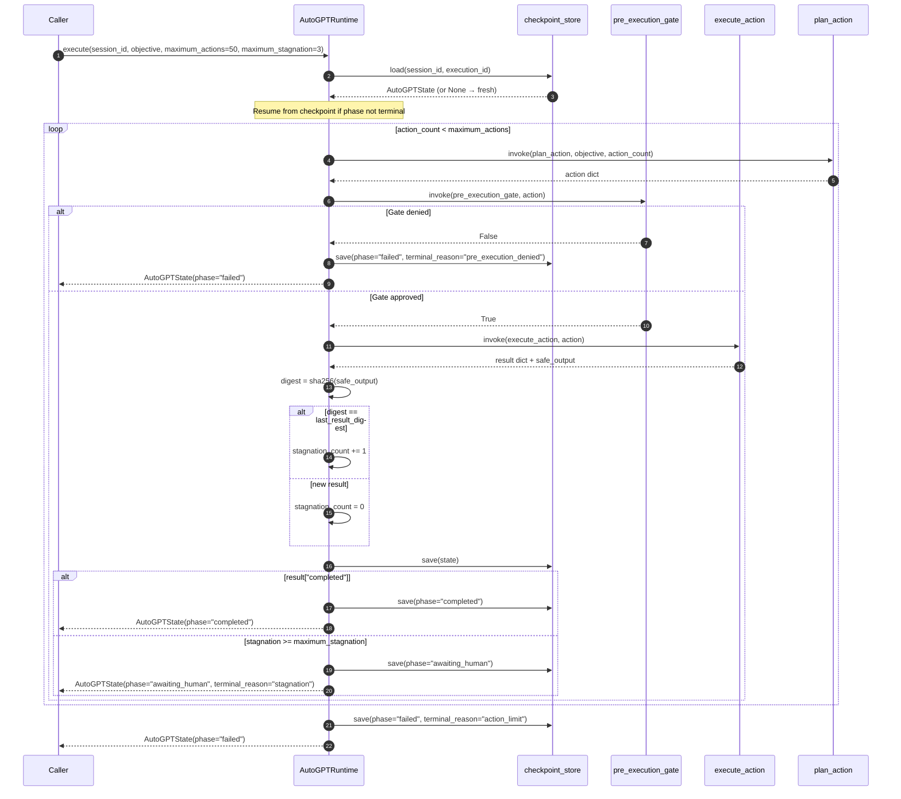

<!-- Sources: app/agent/patterns/autogpt.py:45-108 (execute method), app/agent/patterns/autogpt.py:68-106 (action loop), app/agent/patterns/autogpt.py:76-78 (gate check), app/agent/patterns/autogpt.py:85 (stagnation), app/agent/patterns/autogpt.py:100-102 (stagnation terminal) -->

### Ecosystem Integration

| System | Integration Point | Purpose | Source |
|---|---|---|---|
| **Checkpointing** | `checkpoint_store.save()` after every action | Resume after crash; stagnation state survives restarts | [autogpt.py:44](https://github.com/harsh786/agent-verse/blob/main/agent-verse-backend/app/agent/patterns/autogpt.py#L44) |
| **Pre-Execution Gate** | `await invoke(pre_execution_gate, action)` before every execute | Block dangerous actions before they run | [autogpt.py:76](https://github.com/harsh786/agent-verse/blob/main/agent-verse-backend/app/agent/patterns/autogpt.py#L76) |
| **Stagnation Guard** | `sha256` digest comparison between consecutive outputs | Detect infinite loops automatically | [autogpt.py:85](https://github.com/harsh786/agent-verse/blob/main/agent-verse-backend/app/agent/patterns/autogpt.py#L85) |
| **Cancellation** | `cancelled: asyncio.Event` checked per iteration | Cooperative shutdown without losing progress | [autogpt.py:70](https://github.com/harsh786/agent-verse/blob/main/agent-verse-backend/app/agent/patterns/autogpt.py#L70) |
| **CostController** | Wire `pre_execution_gate` to `CostController.check_and_record()` | Per-goal ($10 default) and daily ($500 default) budget enforcement | [governance/cost.py:29](https://github.com/harsh786/agent-verse/blob/main/agent-verse-backend/app/governance/cost.py#L29) |
| **ProspectiveMemory** | Future tasks stored as `ProspectiveMemory` items | Durable, leased task queue survives process restarts | [memory/prospective.py:13](https://github.com/harsh786/agent-verse/blob/main/agent-verse-backend/app/memory/prospective.py#L13) |
| **LongTermMemoryStore** | `store()` persists high-salience findings | Cross-run knowledge accumulation | [memory/long_term.py:45](https://github.com/harsh786/agent-verse/blob/main/agent-verse-backend/app/memory/long_term.py#L45) |
| **SalienceScorer** | `recency_weight=0.4, relevance_weight=0.45, frequency_weight=0.15` | Determines which findings are worth persisting | [memory/salience.py:55](https://github.com/harsh786/agent-verse/blob/main/agent-verse-backend/app/memory/salience.py#L55) |
| **MemoryConsolidator** | `consolidate_sync()` for long-running sessions | Compresses redundant memories using Jaccard clustering | [memory/consolidation.py:40](https://github.com/harsh786/agent-verse/blob/main/agent-verse-backend/app/memory/consolidation.py#L40) |
| **RuntimeEnforcer** | `is_capability_allowed(capability_id, constraints)` inside gate | Capability-level access control per tenant policy | [policy_runtime/runtime_enforcer.py:7](https://github.com/harsh786/agent-verse/blob/main/agent-verse-backend/app/policy_runtime/runtime_enforcer.py#L7) |

### Key Source Files

| File | Symbol | Lines | Role |
|---|---|---|---|
| [`app/agent/patterns/autogpt.py`](https://github.com/harsh786/agent-verse/blob/main/agent-verse-backend/app/agent/patterns/autogpt.py) | `AutoGPTAdapter`, `AutoGPTRuntime`, `AutoGPTState` | 16, 33, 41 | Pattern implementation |
| [`app/memory/prospective.py`](https://github.com/harsh786/agent-verse/blob/main/agent-verse-backend/app/memory/prospective.py) | `ProspectiveMemory`, `ProspectiveMemoryService` | 13, 36 | Durable task queue |
| [`app/memory/long_term.py`](https://github.com/harsh786/agent-verse/blob/main/agent-verse-backend/app/memory/long_term.py) | `LongTermMemoryStore.store()`, `.recall()` | 45, 49 | Cross-session learnings |
| [`app/memory/salience.py`](https://github.com/harsh786/agent-verse/blob/main/agent-verse-backend/app/memory/salience.py) | `SalienceScorer` | 46 | Memory retention decisions |
| [`app/memory/consolidation.py`](https://github.com/harsh786/agent-verse/blob/main/agent-verse-backend/app/memory/consolidation.py) | `MemoryConsolidator.consolidate_sync()` | 40, 55 | Redundancy elimination |
| [`app/governance/cost.py`](https://github.com/harsh786/agent-verse/blob/main/agent-verse-backend/app/governance/cost.py) | `CostController`, `BudgetConfig` | 43, 29 | Budget enforcement |
| [`app/policy_runtime/runtime_enforcer.py`](https://github.com/harsh786/agent-verse/blob/main/agent-verse-backend/app/policy_runtime/runtime_enforcer.py) | `RuntimeEnforcer.is_capability_allowed()` | 7 | Capability access control |

---

## 2. BabyAGI — Priority-Sorted Durable Work Queue

### What It Is

BabyAGI is a simpler but highly durable execution pattern: create a prioritized list of `DurableWorkItem` objects from a single objective, then execute them in priority order with full checkpoint durability. Unlike AutoGPT's self-replanning loop, BabyAGI creates all tasks **once** at the start, deduplicates by `work_item_id`, and executes them sequentially with progress saved after each step.

The crucial insight: BabyAGI excels at **systematic enumeration** — cases where the full task list is knowable upfront, like "analyse all 50 competitors" or "migrate all 30 database tables." AutoGPT excels at **open exploration** where tasks emerge from results.

### Real-World Example

> **Goal**: "Continuously monitor and analyse our top 5 competitors"

```
create_tasks("monitor top 5 competitors") →
  [
    DurableWorkItem(work_item_id="1", safe_summary="Check TechCorp product page",   priority=3),
    DurableWorkItem(work_item_id="2", safe_summary="Check RivalCo pricing updates", priority=2),
    DurableWorkItem(work_item_id="3", safe_summary="Check StartupX blog",           priority=1),
    DurableWorkItem(work_item_id="4", safe_summary="Check MegaCorp job postings",   priority=2),
    DurableWorkItem(work_item_id="5", safe_summary="Check NicheCo Twitter",         priority=1),
  ]

After priority sort (descending):
  priority=3 → item "1" first
  priority=2 → items "2" and "4" next
  priority=1 → items "3" and "5" last

execute_task(item "1") → result["objective_complete"] = False → continue
execute_task(item "2") → result["objective_complete"] = False → continue
...
execute_task(item "5") → task_limit reached → phase="failed", terminal_reason="task_limit"
```

After run: `current_index = 5`, all items have `state="completed"` with `result_reference` saved. On next scheduled run, `loaded` state resumes from scratch (fresh `work_items` from `create_tasks`).

### BabyAGI State Machine

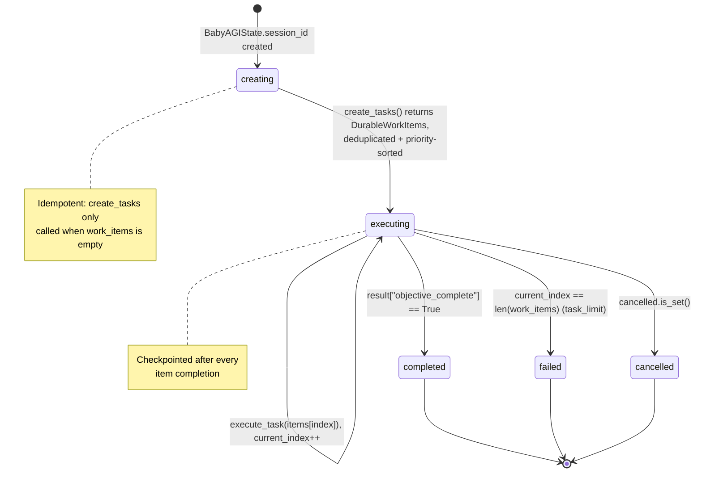

<!-- Sources: app/agent/patterns/babyagi.py:15-25 (BabyAGIState), app/agent/patterns/babyagi.py:59-105 (execute logic) -->

### Execution Sequence

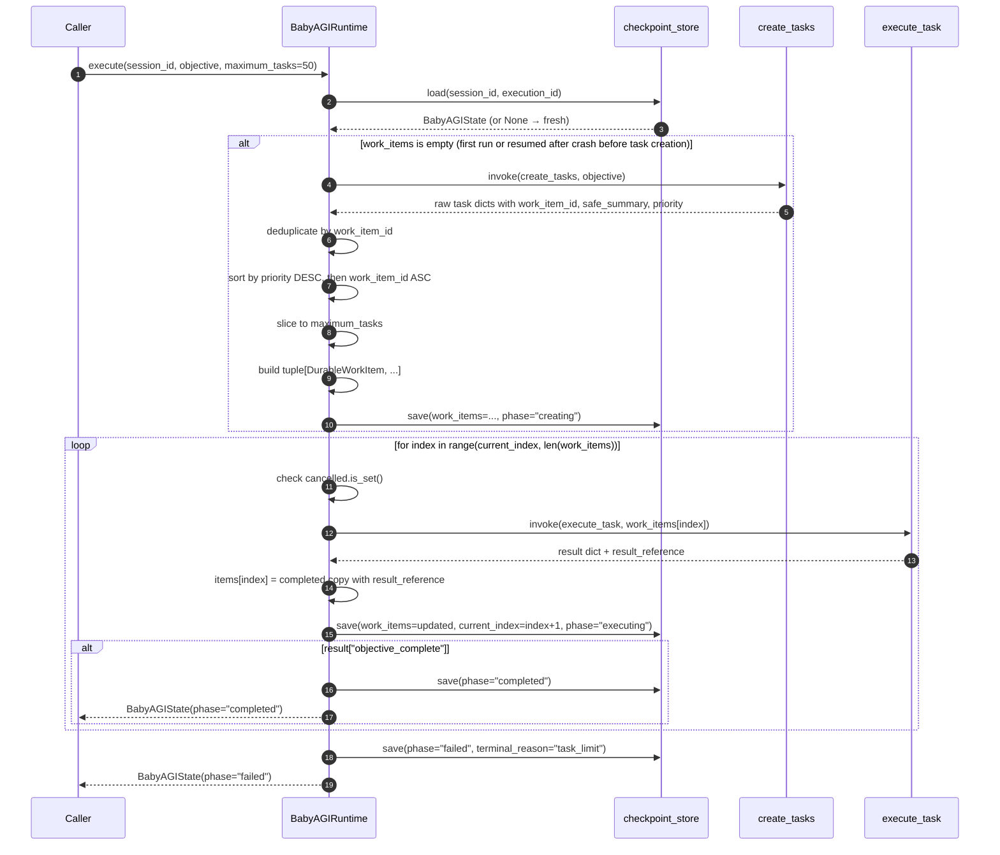

<!-- Sources: app/agent/patterns/babyagi.py:40-105 (execute method), app/agent/patterns/babyagi.py:61-80 (create_tasks + dedup + sort), app/agent/patterns/babyagi.py:82-103 (execution loop) -->

### Ecosystem Integration

| System | Integration Point | Purpose | Source |
|---|---|---|---|
| **Checkpointing** | Saved after every `work_item` completion | Full durability — resume mid-queue after any failure | [babyagi.py:97](https://github.com/harsh786/agent-verse/blob/main/agent-verse-backend/app/agent/patterns/babyagi.py#L97) |
| **DurableWorkItem** | `coordination.patterns.common.DurableWorkItem` | Standardized, serializable task container | [babyagi.py:10](https://github.com/harsh786/agent-verse/blob/main/agent-verse-backend/app/agent/patterns/babyagi.py#L10) |
| **Priority Queue** | `sorted(..., key=lambda: (priority, work_item_id))[:maximum_tasks]` | Highest business-impact tasks execute first | [babyagi.py:69](https://github.com/harsh786/agent-verse/blob/main/agent-verse-backend/app/agent/patterns/babyagi.py#L69) |
| **Idempotent Creation** | `create_tasks` only called when `work_items` is empty | Replaying the request after crash doesn't double-create tasks | [babyagi.py:61](https://github.com/harsh786/agent-verse/blob/main/agent-verse-backend/app/agent/patterns/babyagi.py#L61) |
| **ProspectiveMemory** | Each `DurableWorkItem` maps to a `ProspectiveMemory` entry | Leased execution prevents double-processing in distributed deployments | [memory/prospective.py:52](https://github.com/harsh786/agent-verse/blob/main/agent-verse-backend/app/memory/prospective.py#L52) |
| **NLScheduler** | `NLScheduler.parse()` → `TriggerSpec` | Schedule the BabyAGI cycle: "Run competitor analysis every Monday 9 AM" | [triggers/nl_scheduler.py:32](https://github.com/harsh786/agent-verse/blob/main/agent-verse-backend/app/triggers/nl_scheduler.py#L32) |
| **LongTermMemory** | `store()` after each completed item | Cross-run intelligence accumulation for prioritization improvements | [memory/long_term.py:45](https://github.com/harsh786/agent-verse/blob/main/agent-verse-backend/app/memory/long_term.py#L45) |
| **RegressionBaseline** | `BaselineKey(strategy_id="babyagi")` | Compare this run's intelligence quality against last week's baseline | [evals/regression_baseline.py:12](https://github.com/harsh786/agent-verse/blob/main/agent-verse-backend/app/evals/regression_baseline.py#L12) |

### Key Source Files

| File | Symbol | Lines | Role |
|---|---|---|---|
| [`app/agent/patterns/babyagi.py`](https://github.com/harsh786/agent-verse/blob/main/agent-verse-backend/app/agent/patterns/babyagi.py) | `BabyAGIAdapter`, `BabyAGIRuntime`, `BabyAGIState` | 28, 36, 15 | Pattern implementation |
| [`app/memory/prospective.py`](https://github.com/harsh786/agent-verse/blob/main/agent-verse-backend/app/memory/prospective.py) | `ProspectiveMemoryService.lease_due()` | 52 | Distributed task leasing |
| [`app/triggers/nl_scheduler.py`](https://github.com/harsh786/agent-verse/blob/main/agent-verse-backend/app/triggers/nl_scheduler.py) | `NLScheduler` | 1 | Scheduled cycle triggering |
| [`app/evals/regression_baseline.py`](https://github.com/harsh786/agent-verse/blob/main/agent-verse-backend/app/evals/regression_baseline.py) | `BaselineKey`, `RegressionBaseline` | 12 | Week-over-week quality comparison |

---

## 3. Voyager — Curriculum-Driven Skill Synthesis

### What It Is

Voyager is AgentVerse's implementation of the self-improving agent: after completing a curriculum of tasks, it synthesizes the evidence into a reusable `ProcedureContract` (skill) that is validated and stored in the `VoyagerSkillStore`. Each skill is versioned, policy-fingerprinted, and tenant-scoped — it cannot be reused across tenants or after policy changes.

The core innovation: skills are not just descriptions but **contractual artifacts** that embed the exact tool sequence, required capabilities, connector IDs, and tool schema versions at the time of creation. Stale skills are automatically invalidated.

### Real-World Example

> **Goal**: Fill capability gap `"aws_blue_green_deploy"` using the Voyager curriculum

```
Week 1 — capability_gaps = ("aws_deploy",)
  → run_task("aws_deploy") → evidence_ref = "s3://evidence/task-001"
  → synthesize_skill(("aws_deploy",), ("s3://evidence/task-001",))
  → ProcedureContract(procedure_id="aws_deploy_v1", tool_sequence=("terraform_apply", "health_check"), ...)
  → VoyagerSkillStore.publish(skill, available_tools=..., policy_fingerprint="fp-abc123")
  → published.procedure_id = "aws_deploy_v1"

Week 2 — capability_gaps = ("aws_blue_green_deploy",)
  → run_task("aws_blue_green_deploy") → evidence_ref = "s3://evidence/task-002"
  → synthesize_skill(("aws_blue_green_deploy",), ("s3://evidence/task-001", "s3://evidence/task-002",))
  → ProcedureContract(procedure_id="aws_bgd_v1", tool_sequence=("terraform_apply", "route53_switch", "health_check_v2"), ...)
  → validate_procedure: policy_fingerprint matches ✓, all tools available ✓
  → published.procedure_id = "aws_bgd_v1"
```

### Voyager Curriculum Phase Machine

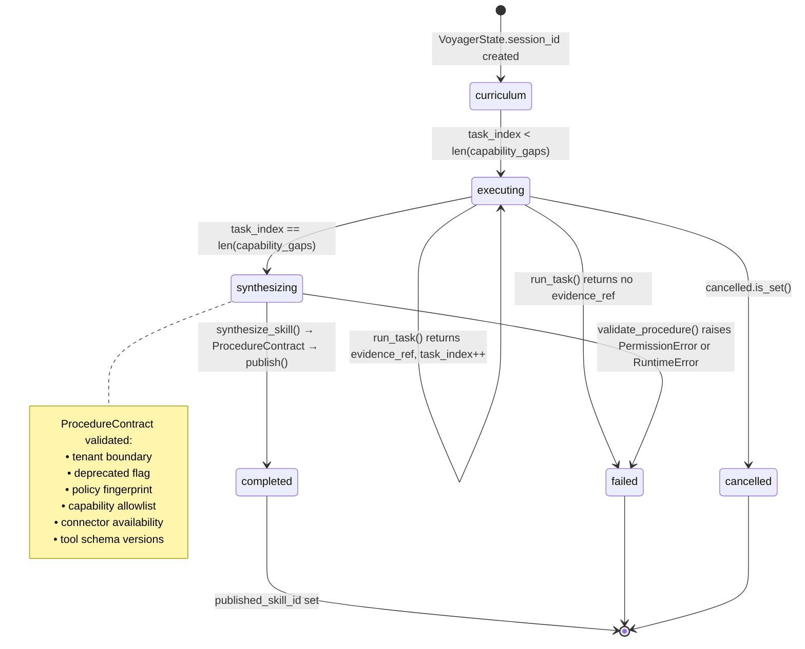

<!-- Sources: app/agent/patterns/voyager.py:21-23 (phase literals), app/agent/patterns/voyager.py:65-96 (phase transitions), app/memory/procedural_validator.py:22-43 (validate_procedure checks) -->

### Execution Sequence

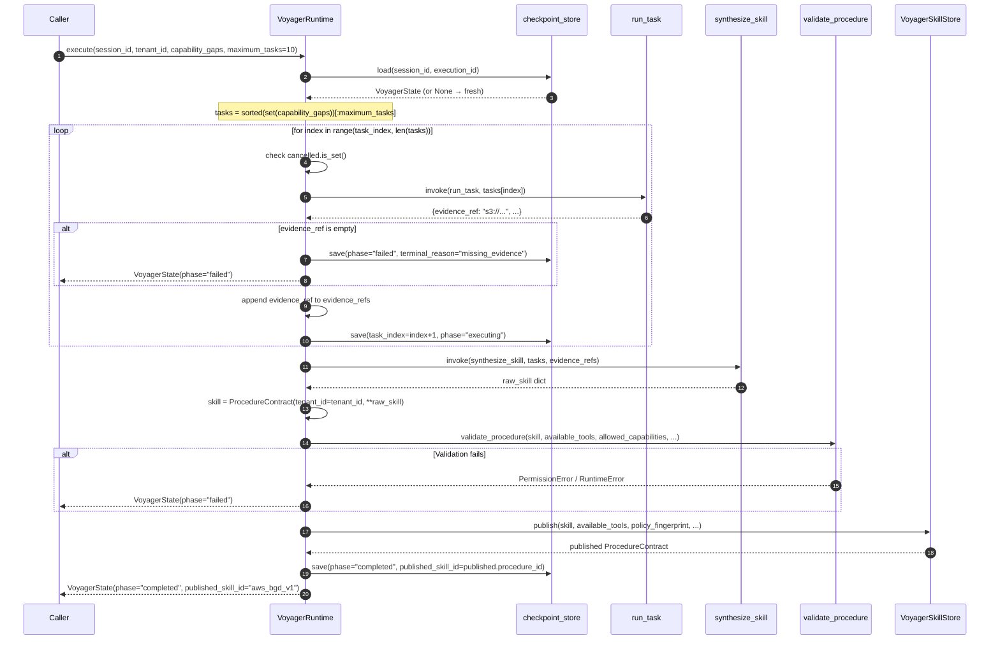

<!-- Sources: app/agent/patterns/voyager.py:44-97 (execute method), app/memory/procedural_validator.py:22-43 (validate_procedure), app/memory/voyager_skills.py:12-33 (publish + immutability) -->

### ProcedureContract Validation — Defence in Depth

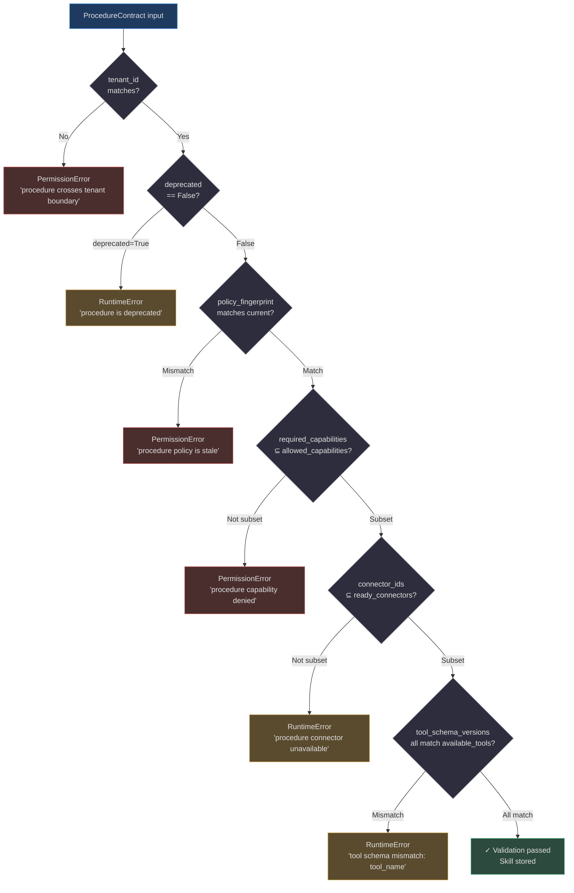

<!-- Sources: app/memory/procedural_validator.py:22-43 (validate_procedure), app/memory/procedural_validator.py:31-43 (all validation checks) -->

### Ecosystem Integration

| System | Integration Point | Purpose | Source |
|---|---|---|---|
| **VoyagerSkillStore** | `publish(skill, policy_fingerprint=...)` | Versioned immutable skill publication with dedup check | [memory/voyager_skills.py:12](https://github.com/harsh786/agent-verse/blob/main/agent-verse-backend/app/memory/voyager_skills.py#L12) |
| **ProcedureContract** | `skill = ProcedureContract(tenant_id=tenant_id, **raw_skill)` | Typed, validated, tenant-scoped skill artifact | [memory/procedural_validator.py:8](https://github.com/harsh786/agent-verse/blob/main/agent-verse-backend/app/memory/procedural_validator.py#L8) |
| **validate_procedure** | 6-step validation chain | Policy staleness, capability grants, schema versions all checked | [memory/procedural_validator.py:22](https://github.com/harsh786/agent-verse/blob/main/agent-verse-backend/app/memory/procedural_validator.py#L22) |
| **Immutability** | `if prior is not None and prior != skill: raise ValueError` | Published skills cannot be silently overwritten | [memory/voyager_skills.py:31](https://github.com/harsh786/agent-verse/blob/main/agent-verse-backend/app/memory/voyager_skills.py#L31) |
| **Evidence accumulation** | `evidence_refs: tuple[str, ...]` grows per task | Provides full provenance chain to the synthesizer | [voyager.py:25](https://github.com/harsh786/agent-verse/blob/main/agent-verse-backend/app/agent/patterns/voyager.py#L25) |
| **RegressionGate** | `RegressionGate` with `_FAILURE_THRESHOLD = 0.6` | Blocks skill publication if success rate < 60% | [evals/regression_gate.py:19](https://github.com/harsh786/agent-verse/blob/main/agent-verse-backend/app/evals/regression_gate.py#L19) |

### Key Source Files

| File | Symbol | Lines | Role |
|---|---|---|---|
| [`app/agent/patterns/voyager.py`](https://github.com/harsh786/agent-verse/blob/main/agent-verse-backend/app/agent/patterns/voyager.py) | `VoyagerAdapter`, `VoyagerRuntime`, `VoyagerState` | 31, 39, 16 | Pattern implementation |
| [`app/memory/voyager_skills.py`](https://github.com/harsh786/agent-verse/blob/main/agent-verse-backend/app/memory/voyager_skills.py) | `VoyagerSkillStore.publish()` | 8, 12 | Versioned skill publication |
| [`app/memory/procedural_validator.py`](https://github.com/harsh786/agent-verse/blob/main/agent-verse-backend/app/memory/procedural_validator.py) | `ProcedureContract`, `validate_procedure()` | 8, 22 | 6-check validation chain |
| [`app/evals/regression_gate.py`](https://github.com/harsh786/agent-verse/blob/main/agent-verse-backend/app/evals/regression_gate.py) | `RegressionGate`, `_FAILURE_THRESHOLD` | 30, 19 | Skill quality gate |

---

## 4. Constitutional AI — Bounded Critique-Revision Under Policy

### What It Is

Constitutional AI (`ConstitutionalAIRuntime`) is AgentVerse's implementation of Anthropic's CAI technique, tightly integrated with the `policy_runtime` layer. Before critiquing and revising, it checks `RuntimeEnforcer.is_capability_allowed()` — if the requested capability is denied in `RuntimeConstraints`, it raises a `PermissionError` before a single LLM call is made. The entire revision costs **at most 2 LLM calls** (`model_calls ≤ 2`), making it one of the most cost-efficient safety mechanisms in the system.

Critical design choice: `ExecutionTier.LOCAL` — this pattern never leaves the local process, ensuring the lowest possible latency and no external serialization overhead for inline safety checks.

### Real-World Example

> **Goal**: Generate response to "How do I cancel my subscription?" with compliance to brand principles

```
original_safe_summary = "To cancel, go to Settings → Subscription → Cancel. Note: you'll lose all your data immediately."

Step 1 — enforcer.is_capability_allowed("response_generation", constraints) → True ✓
Step 2 — principle_ids = ("be_helpful", "be_honest", "be_safe") ✓ (non-empty)

Step 3 — critique_summary = invoke(critique, original, ("be_helpful", "be_honest", "be_safe"))
  → "The response is accurate but omits the data export option (violates be_helpful).
     Data loss immediacy may be incorrect — export takes 24 hours (violates be_honest)."
  → Truncated to 4,000 chars max

Step 4 — revised = invoke(revision, original, critique_summary, principle_ids)
  → "To cancel, go to Settings → Subscription → Cancel.
     Before cancelling, you can export your data from Settings → Export (takes up to 24 hours)."
  → Truncated to 8,000 chars max

Result: ConstitutionalResult(
  original_safe_summary="...",
  critique_safe_summary="...omits export option...",
  revised_safe_summary="...export your data...",
  principle_ids=("be_helpful", "be_honest", "be_safe"),
  model_calls=2
)
```

### Constitutional AI Data Flow

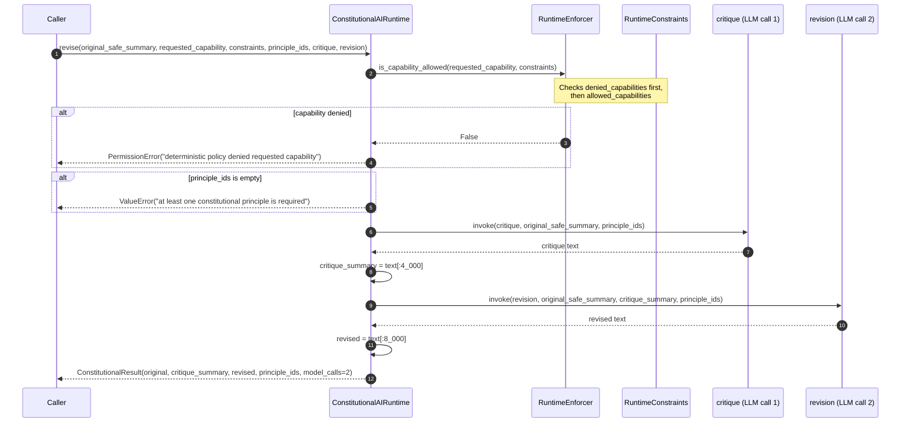

<!-- Sources: app/agent/patterns/constitutional_ai.py:39-60 (revise method), app/agent/patterns/constitutional_ai.py:50-52 (pre-checks), app/agent/patterns/constitutional_ai.py:53-56 (LLM invocations), app/policy_runtime/runtime_enforcer.py:7-10 (is_capability_allowed) -->

### Constitutional AI in the Guardrail Pipeline

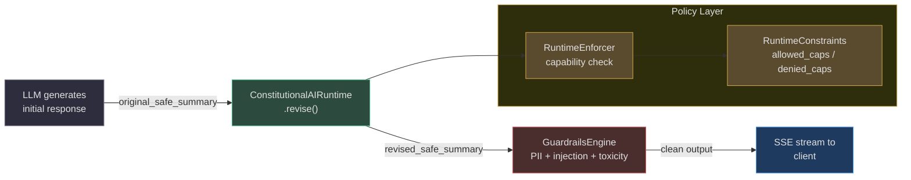

<!-- Sources: app/agent/patterns/constitutional_ai.py:27-29 (ExecutionTier.LOCAL), app/guardrails_v2/engine.py:47 (GuardrailsEngine), app/policy_runtime/runtime_enforcer.py:6-10 -->

### Ecosystem Integration

| System | Integration Point | Purpose | Source |
|---|---|---|---|
| **RuntimeEnforcer** | `is_capability_allowed(requested_capability, constraints)` — called FIRST | Hard block before any LLM call if capability denied | [policy_runtime/runtime_enforcer.py:7](https://github.com/harsh786/agent-verse/blob/main/agent-verse-backend/app/policy_runtime/runtime_enforcer.py#L7) |
| **RuntimeConstraints** | `allowed_capabilities`, `denied_capabilities` per-tenant | Tenant-specific capability policy drives what CAI can do | [policy_runtime/constraint_model.py:7](https://github.com/harsh786/agent-verse/blob/main/agent-verse-backend/app/policy_runtime/constraint_model.py#L7) |
| **ExecutionTier.LOCAL** | In-process execution, no serialization | Sub-millisecond overhead for inline safety review | [constitutional_ai.py:28](https://github.com/harsh786/agent-verse/blob/main/agent-verse-backend/app/agent/patterns/constitutional_ai.py#L28) |
| **Token Budget** | `model_calls ≤ 2`, `critique ≤ 4,000 chars`, `revised ≤ 8,000 chars` | Bounded cost; never exceeds 2 LLM invocations | [constitutional_ai.py:23](https://github.com/harsh786/agent-verse/blob/main/agent-verse-backend/app/agent/patterns/constitutional_ai.py#L23) |
| **GuardrailsEngine** | CAI positioned before `GuardrailsEngine` pattern-matching | Catches semantic violations that regex misses | [guardrails_v2/engine.py:47](https://github.com/harsh786/agent-verse/blob/main/agent-verse-backend/app/guardrails_v2/engine.py#L47) |
| **Principle storage** | Principles stored in knowledge collection, retrieved via `HYBRID` RAG | Dynamic principle loading without code changes | [memory/long_term.py:31](https://github.com/harsh786/agent-verse/blob/main/agent-verse-backend/app/memory/long_term.py#L31) |

### Key Source Files

| File | Symbol | Lines | Role |
|---|---|---|---|
| [`app/agent/patterns/constitutional_ai.py`](https://github.com/harsh786/agent-verse/blob/main/agent-verse-backend/app/agent/patterns/constitutional_ai.py) | `ConstitutionalAIAdapter`, `ConstitutionalAIRuntime`, `ConstitutionalResult` | 27, 35, 16 | Pattern implementation |
| [`app/policy_runtime/runtime_enforcer.py`](https://github.com/harsh786/agent-verse/blob/main/agent-verse-backend/app/policy_runtime/runtime_enforcer.py) | `RuntimeEnforcer.is_capability_allowed()` | 7 | Pre-call capability check |
| [`app/policy_runtime/constraint_model.py`](https://github.com/harsh786/agent-verse/blob/main/agent-verse-backend/app/policy_runtime/constraint_model.py) | `RuntimeConstraints` | 7 | Per-tenant capability policy |
| [`app/guardrails_v2/engine.py`](https://github.com/harsh786/agent-verse/blob/main/agent-verse-backend/app/guardrails_v2/engine.py) | `GuardrailsEngine` | 47 | Post-CAI pattern-matching layer |

---

## Cross-Pattern Comparison

### When to Use Each Autonomous Pattern

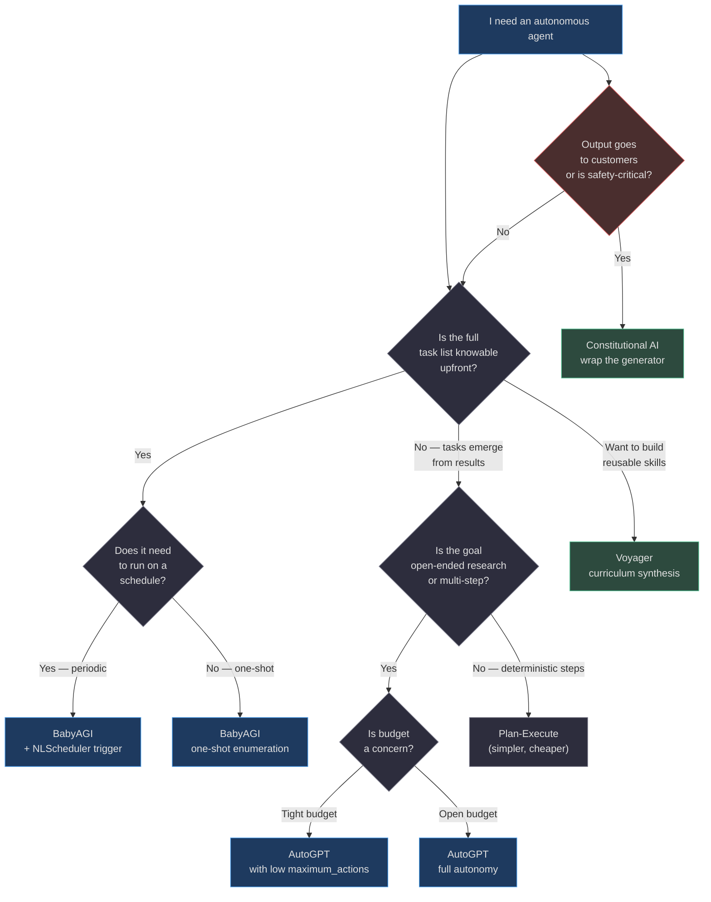

<!-- Sources: app/agent/patterns/autogpt.py:54 (maximum_actions), app/agent/patterns/babyagi.py:46-47 (create_tasks interface), app/agent/patterns/voyager.py:52 (synthesize_skill), app/agent/patterns/constitutional_ai.py:28 (ExecutionTier.LOCAL) -->

### Runtime Characteristics

| Dimension | AutoGPT | BabyAGI | Voyager | Constitutional AI |
|---|---|---|---|---|
| **Execution tier** | `DISTRIBUTED` | `DISTRIBUTED` | `DISTRIBUTED` | `LOCAL` |
| **Checkpoint frequency** | After every action | After every work item | After every task + on completion | None (single invocation) |
| **Cancellation** | `asyncio.Event` per iteration | `asyncio.Event` per iteration | `asyncio.Event` per task | N/A |
| **Max LLM calls** | `maximum_actions × 2` (plan + execute) | `maximum_tasks × 1` (execute) | `maximum_tasks + 1` (tasks + synthesize) | **Exactly 2** (critique + revise) |
| **Output persistence** | `safe_output` (last 8,000 chars) | `result_reference` per item | `published_skill_id` | `revised_safe_summary` (8,000 chars) |
| **Failure modes** | `action_limit`, `stagnation`, `pre_execution_denied` | `task_limit`, `cancelled` | `missing_evidence`, validation errors | `PermissionError`, `ValueError` |
| **Self-healing** | Stagnation → `awaiting_human` | No auto-recovery | Validation failure → `failed` | Hard fail on policy violation |

---

## Related Pages

| Page | Description |
|---|---|
| [01 — Core Execution](./01-core-execution-patterns.md) | Plan-Execute, ReAct, Workflow — the foundational execution patterns |
| [02 — Self-Improvement](./02-self-improvement-patterns.md) | Reflection, Reflexion, Self-Refine, Self-Consistency |
| [03 — Multi-Agent](./03-multi-agent-patterns.md) | Supervisor, Debate, Consensus, Peer Review |
| [04 — Tree & Search](./04-tree-and-search-patterns.md) | Tree of Thoughts, Graph of Thoughts, LATS, Goal Tree |
| [05 — Code & Execution](./05-code-and-execution-patterns.md) | CodeAct, Program of Thought, Loop Engineering |
| [06 — Decomposition](./06-decomposition-and-planning-patterns.md) | ReWOO, LLM Compiler, Least-to-Most, Few-Shot CoT |
| [README — Master Index](./README.md) | All 28 patterns: quick reference, decision tree, ecosystem matrix |
