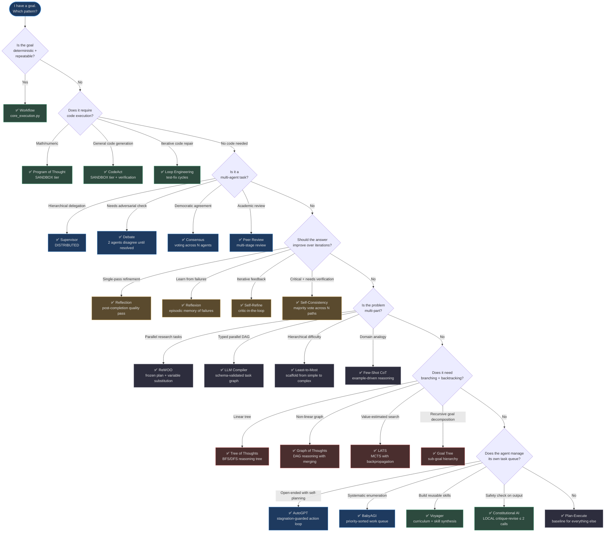
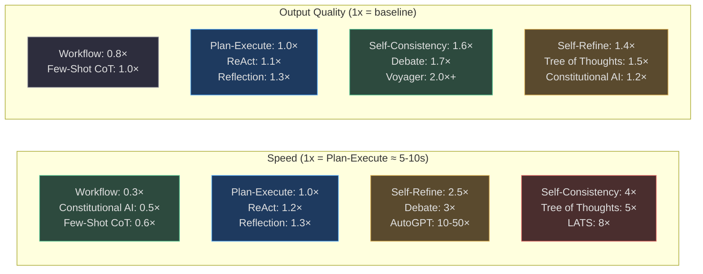
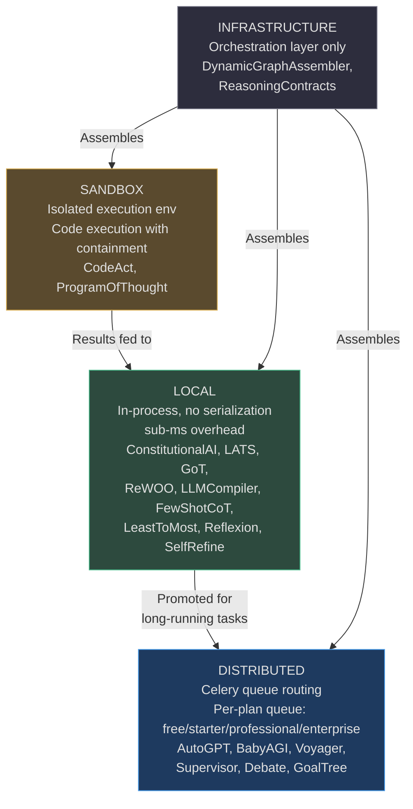

# Agent Patterns — Complete Reference Index

> This index covers all **28 execution patterns** across 8 categories implemented in [`app/agent/patterns/`](https://github.com/harsh786/agent-verse/blob/main/agent-verse-backend/app/agent/patterns/). Every pattern is a composable, independently-testable unit that the [`DynamicGraphAssembler`](https://github.com/harsh786/agent-verse/blob/main/agent-verse-backend/app/agent/dynamic_graph.py#L11) wires into a per-goal `AgentGraph` from a `PatternConfig`.

---

## Pattern Catalogue — All 28 Patterns

### Category 1 — Core Execution (3 patterns)

| Pattern | `strategy_id` | Exec Tier | Token Cost | Best For | Key File |
|---|---|---|---|---|---|
| **Plan-Execute** | `plan_execute` | `DISTRIBUTED` | Medium | General-purpose multi-step tasks | [plan_execute.py](https://github.com/harsh786/agent-verse/blob/main/agent-verse-backend/app/agent/patterns/plan_execute.py) |
| **ReAct** | `react` | `LOCAL` | Medium | Tool-heavy interactive reasoning | [react.py](https://github.com/harsh786/agent-verse/blob/main/agent-verse-backend/app/agent/patterns/react.py) |
| **Workflow** | `workflow` | `LOCAL` | Low | Deterministic, repeatable pipelines | [core_execution.py](https://github.com/harsh786/agent-verse/blob/main/agent-verse-backend/app/agent/patterns/core_execution.py) |

### Category 2 — Self-Improvement (4 patterns)

| Pattern | `strategy_id` | Exec Tier | Token Cost | Best For | Key File |
|---|---|---|---|---|---|
| **Reflection** | `reflection` | `LOCAL` | Medium | Quality improvement on completed outputs | [reflection.py](https://github.com/harsh786/agent-verse/blob/main/agent-verse-backend/app/agent/patterns/reflection.py) |
| **Reflexion** | `reflexion` | `LOCAL` | High | Learning from episodic failures | [reflexion.py](https://github.com/harsh786/agent-verse/blob/main/agent-verse-backend/app/agent/patterns/reflexion.py) |
| **Self-Refine** | `self_refine` | `LOCAL` | High | Iterative quality improvement with feedback | [self_refine.py](https://github.com/harsh786/agent-verse/blob/main/agent-verse-backend/app/agent/patterns/self_refine.py) |
| **Self-Consistency** | `self_consistency` | `LOCAL` | Very High | Majority-vote verification for critical answers | [self_consistency.py](https://github.com/harsh786/agent-verse/blob/main/agent-verse-backend/app/agent/patterns/self_consistency.py) |

### Category 3 — Multi-Agent (4 patterns)

| Pattern | `strategy_id` | Exec Tier | Token Cost | Best For | Key File |
|---|---|---|---|---|---|
| **Supervisor** | `supervisor` | `DISTRIBUTED` | High | Hierarchical task delegation | [supervisor.py](https://github.com/harsh786/agent-verse/blob/main/agent-verse-backend/app/agent/patterns/supervisor.py) |
| **Debate** | `debate` | `DISTRIBUTED` | Very High | Adversarial fact-checking, high-stakes decisions | [debate.py](https://github.com/harsh786/agent-verse/blob/main/agent-verse-backend/app/agent/patterns/debate.py) |
| **Consensus** | `consensus` | `DISTRIBUTED` | Very High | Democratic multi-agent agreement | [consensus.py](https://github.com/harsh786/agent-verse/blob/main/agent-verse-backend/app/agent/patterns/consensus.py) |
| **Peer Review** | `peer_review` | `DISTRIBUTED` | High | Academic-style multi-stage review | [peer_review.py](https://github.com/harsh786/agent-verse/blob/main/agent-verse-backend/app/agent/patterns/peer_review.py) |

### Category 4 — Tree & Graph Search (4 patterns)

| Pattern | `strategy_id` | Exec Tier | Token Cost | Best For | Key File |
|---|---|---|---|---|---|
| **Tree of Thoughts** | `tree_of_thoughts` | `LOCAL` | Very High | Creative problem-solving, planning under uncertainty | [tree_of_thoughts.py](https://github.com/harsh786/agent-verse/blob/main/agent-verse-backend/app/agent/patterns/tree_of_thoughts.py) |
| **Graph of Thoughts** | `graph_of_thoughts` | `LOCAL` | Very High | Non-linear reasoning with backtracking | [graph_of_thoughts.py](https://github.com/harsh786/agent-verse/blob/main/agent-verse-backend/app/agent/patterns/graph_of_thoughts.py) |
| **LATS** | `lats` | `LOCAL` | Very High | MCTS-style search with value estimation | [lats.py](https://github.com/harsh786/agent-verse/blob/main/agent-verse-backend/app/agent/patterns/lats.py) |
| **Goal Tree** | `goal_tree` | `DISTRIBUTED` | High | Recursive goal decomposition | [goal_tree.py](https://github.com/harsh786/agent-verse/blob/main/agent-verse-backend/app/agent/patterns/goal_tree.py) |

### Category 5 — Code & Execution (3 patterns)

| Pattern | `strategy_id` | Exec Tier | Token Cost | Best For | Key File |
|---|---|---|---|---|---|
| **CodeAct** | `codeact` | `SANDBOX` | High | Executable code generation + verification | [codeact.py](https://github.com/harsh786/agent-verse/blob/main/agent-verse-backend/app/agent/patterns/codeact.py) |
| **Program of Thought** | `program_of_thought` | `SANDBOX` | High | Numeric reasoning, mathematical computations | [program_of_thought.py](https://github.com/harsh786/agent-verse/blob/main/agent-verse-backend/app/agent/patterns/program_of_thought.py) |
| **Loop Engineering** | `loop_engineering` | `LOCAL` | Very High | Iterative code refinement, test-fix cycles | [loop_engineering.py](https://github.com/harsh786/agent-verse/blob/main/agent-verse-backend/app/agent/patterns/loop_engineering.py) |

### Category 6 — Decomposition & Planning (4 patterns)

| Pattern | `strategy_id` | Exec Tier | Token Cost | Best For | Key File |
|---|---|---|---|---|---|
| **ReWOO** | `rewoo` | `LOCAL` | Medium | Frozen plan + parallel evidence substitution | [rewoo.py](https://github.com/harsh786/agent-verse/blob/main/agent-verse-backend/app/agent/patterns/rewoo.py) |
| **LLM Compiler** | `llm_compiler` | `LOCAL` | Medium | Typed task DAG with schema-validated outputs | [llm_compiler.py](https://github.com/harsh786/agent-verse/blob/main/agent-verse-backend/app/agent/patterns/llm_compiler.py) |
| **Least-to-Most** | `least_to_most` | `LOCAL` | Medium | Hierarchical difficulty scaffolding | [least_to_most.py](https://github.com/harsh786/agent-verse/blob/main/agent-verse-backend/app/agent/patterns/least_to_most.py) |
| **Few-Shot CoT** | `few_shot_cot` | `LOCAL` | Low | Domain-specific reasoning via analogy | [few_shot_cot.py](https://github.com/harsh786/agent-verse/blob/main/agent-verse-backend/app/agent/patterns/few_shot_cot.py) |

### Category 7 — Autonomous (4 patterns)

| Pattern | `strategy_id` | Exec Tier | Token Cost | Best For | Key File |
|---|---|---|---|---|---|
| **AutoGPT** | `autogpt` | `DISTRIBUTED` | Very High | Open-ended autonomous research | [autogpt.py](https://github.com/harsh786/agent-verse/blob/main/agent-verse-backend/app/agent/patterns/autogpt.py) |
| **BabyAGI** | `babyagi` | `DISTRIBUTED` | High | Scheduled systematic enumeration | [babyagi.py](https://github.com/harsh786/agent-verse/blob/main/agent-verse-backend/app/agent/patterns/babyagi.py) |
| **Voyager** | `voyager` | `DISTRIBUTED` | High | Curriculum skill synthesis, self-improvement | [voyager.py](https://github.com/harsh786/agent-verse/blob/main/agent-verse-backend/app/agent/patterns/voyager.py) |
| **Constitutional AI** | `constitutional_ai` | `LOCAL` | Low | Customer-facing safety review (≤ 2 LLM calls) | [constitutional_ai.py](https://github.com/harsh786/agent-verse/blob/main/agent-verse-backend/app/agent/patterns/constitutional_ai.py) |

### Category 8 — Infrastructure (2 patterns)

| Pattern | Role | Token Cost | Purpose | Key File |
|---|---|---|---|---|
| **Dynamic Graph Assembler** | Orchestrator | N/A | Translates `PatternConfig` → `AgentGraph` at runtime | [dynamic_graph.py](https://github.com/harsh786/agent-verse/blob/main/agent-verse-backend/app/agent/dynamic_graph.py) |
| **Reasoning Contracts** | Shared contracts | N/A | Typed state models shared by all LOCAL reasoning patterns | [reasoning_contracts.py](https://github.com/harsh786/agent-verse/blob/main/agent-verse-backend/app/agent/patterns/reasoning_contracts.py) |

---

## Pattern Selection Decision Tree



<!-- Sources: app/agent/patterns/autogpt.py:33 (AutoGPTAdapter), app/agent/patterns/babyagi.py:28 (BabyAGIAdapter), app/agent/patterns/codeact.py:57-58 (strategy_id, SANDBOX), app/agent/patterns/constitutional_ai.py:28 (LOCAL tier), app/agent/patterns/lats.py:23-24 (lats, LOCAL), app/agent/patterns/graph_of_thoughts.py:24-25 (graph_of_thoughts, LOCAL), app/agent/patterns/rewoo.py:27-28 (rewoo, LOCAL), app/agent/patterns/llm_compiler.py:27-28 (llm_compiler, LOCAL), app/agent/patterns/program_of_thought.py:45-46 (SANDBOX), app/agent/patterns/voyager.py:31 (VoyagerAdapter) -->

---

## Ecosystem Integration Matrix

This matrix maps every pattern to the AgentVerse subsystems it uses. `✅` = used, `○` = optional/configurable, `—` = not used.

| Pattern | RAG Strategy | Memory Used | Eval Scorer | Guardrails | Observability |
|---|---|---|---|---|---|
| **Plan-Execute** | `ADAPTIVE` | ExecutionMemory | `completeness`, `accuracy` | GuardrailsEngine | goal_events SSE |
| **ReAct** | `KB_ONLY` | ExecutionMemory | `tool_use_quality` | GuardrailsEngine | tool call trace |
| **Workflow** | `NONE` | — | `success_rate` | policy_engine | step completion |
| **Reflection** | `HYBRID` | EpisodicMemory | `coherence`, `depth` | GuardrailsEngine | reflection trace |
| **Reflexion** | `ADAPTIVE` | EpisodicMemory, LongTermMemory | `failure_pattern_avoidance` | GuardrailsEngine | episodic replay |
| **Self-Refine** | `KB_ONLY` | ExecutionMemory | `iteration_delta` | GuardrailsEngine | refinement cycle |
| **Self-Consistency** | `KB_ONLY` | ExecutionMemory | `majority_agreement` | — | vote distribution |
| **Supervisor** | `ADAPTIVE` | ExecutionMemory | `sub_agent_completion` | HITL (CRITICAL) | sub-agent SSE |
| **Debate** | `HYBRID` | ExecutionMemory | `argument_quality` | HITL (HIGH) | debate round trace |
| **Consensus** | `HYBRID` | ExecutionMemory | `consensus_confidence` | HITL (HIGH) | vote audit |
| **Peer Review** | `KB_ONLY` | ExecutionMemory | `review_thoroughness` | GuardrailsEngine | review cycle |
| **Tree of Thoughts** | `WEB_AUGMENTED` | ExecutionMemory | `path_quality` | GuardrailsEngine | thought tree |
| **Graph of Thoughts** | `WEB_AUGMENTED` | ExecutionMemory | `graph_coverage` | GuardrailsEngine | node graph |
| **LATS** | `ADAPTIVE` | ExecutionMemory | `value_estimation_accuracy` | GuardrailsEngine | MCTS trace |
| **Goal Tree** | `ADAPTIVE` | ExecutionMemory | `sub_goal_completion` | HITL (HIGH) | goal tree SSE |
| **CodeAct** | `KB_ONLY` | ExecutionMemory | `code_correctness` | SANDBOX isolation | code execution trace |
| **Program of Thought** | `KB_ONLY` | — | `numeric_accuracy` | SANDBOX isolation | code output |
| **Loop Engineering** | `KB_ONLY` | ExecutionMemory, ProceduralMemory | `test_pass_rate` | SANDBOX isolation | test loop |
| **ReWOO** | `HYBRID` (per-variable) | ExecutionMemory | `evidence_quality` | GuardrailsEngine | evidence graph |
| **LLM Compiler** | `HYBRID` (per-task) | ExecutionMemory | `schema_adherence` | GuardrailsEngine | DAG execution |
| **Least-to-Most** | `KB_ONLY` | ExecutionMemory | `scaffold_effectiveness` | GuardrailsEngine | level trace |
| **Few-Shot CoT** | `HYBRID` (examples) | EpisodicMemory | `example_relevance` | GuardrailsEngine | CoT trace |
| **AutoGPT** | `ADAPTIVE` | ProspectiveMemory, LongTermMemory, SalienceScorer | `stagnation_rate` | pre_execution_gate + HITL | action loop SSE |
| **BabyAGI** | `ADAPTIVE` | ProspectiveMemory, LongTermMemory | `task_completion_rate` | CostController | work queue SSE |
| **Voyager** | `KB_ONLY` | ProceduralMemory, VoyagerSkillStore | `skill_success_rate` | ProcedureContract validation | curriculum trace |
| **Constitutional AI** | `HYBRID` (principles) | LongTermMemory (principles) | `constitution_compliance` | RuntimeEnforcer | critique trace |
| **Dynamic Graph Assembler** | Configured by assembled graph | Configured by assembled graph | Inherits from assembled patterns | Inherits | PatternConfig trace |
| **Reasoning Contracts** | N/A (shared contracts) | N/A | `ReasoningPhase` lifecycle | `ReasoningContractError` pre-check | phase transitions |

---

## Performance Characteristics

All numbers are **relative to Plan-Execute baseline = 1.0×**.



<!-- Sources: app/agent/patterns/constitutional_ai.py:23 (model_calls≤2), app/agent/patterns/autogpt.py:54 (maximum_actions drives time), app/agent/patterns/lats.py:23 (LATS strategy), app/evals/regression_gate.py:19 (_FAILURE_THRESHOLD=0.6) -->

### Goal Complexity vs. Recommended Pattern

| Goal Complexity | `Complexity` Enum | Recommended Pattern(s) | Avoid |
|---|---|---|---|
| **Simple** (1-2 steps) | `SIMPLE` | Workflow, Few-Shot CoT | AutoGPT, LATS, Debate |
| **Medium** (3-5 steps) | `MEDIUM` | Plan-Execute, ReAct, ReWOO | Self-Consistency, Tree of Thoughts |
| **Complex** (6-15 steps) | `COMPLEX` | Goal Tree, LLM Compiler, Supervisor | Workflow |
| **Expert** (15+ steps, open-ended) | `EXPERT` | AutoGPT, BabyAGI, Voyager, LATS | Workflow, Few-Shot CoT |

---

## Pattern Combinations — Composition Recipes

The [`PatternAssembler`](https://github.com/harsh786/agent-verse/blob/main/agent-verse-backend/app/agent/pattern_assembler.py#L34) combines patterns via its `_RULES` list. These are the most powerful compositions:

```mermaid
classDiagram
    class ReActPlusReflexion {
        "ReAct learns from its own failures"
        ReAct --|> Reflexion : feeds episodes to
        Result: Tools errors stored as<br>LongTermMemory failure patterns
    }

    class PlanExecutePlusSupervisor {
        "Hierarchical multi-agent planning"
        PlanExecute --|> Supervisor : Supervisor orchestrates
        Result: Complex goals decomposed<br>across specialist sub-agents
    }

    class SelfConsistencyPlusLLMCompiler {
        "Parallel voting for critical decisions"
        LLMCompiler --|> SelfConsistency : Multiple compiled paths
        Result: Each compiler path is voted<br>for the highest-confidence output
    }

    class VoyagerPlusLoopEngineering {
        "Self-expanding skill loop"
        Voyager --|> LoopEngineering : Evidence from code iterations
        Result: Agent builds growing library<br>of tested code skills
    }

    class DebatePlusConstitutionalAI {
        "Adversarial safety review"
        Debate --|> ConstitutionalAI : Winning argument reviewed
        Result: Best answer from debate<br>refined under constitutional principles
    }

    class GoalTreePlusReWOO {
        "Decompose then parallelize"
        GoalTree --|> ReWOO : Each sub-goal uses frozen plan
        Result: Recursive decomposition with<br>parallel evidence gathering per branch
    }
```



<!-- Sources: app/agent/pattern_assembler.py:14-31 (Rule dataclass), app/agent/pattern_assembler.py:34 (_RULES list), app/agent/pattern_config.py:52 (PatternConfig) -->

### High-Impact Combinations in Code

The `PatternAssembler` `_RULES` that drive these combinations:

| Trigger Condition | Patterns Added | Source |
|---|---|---|
| `risk == RiskLevel.CRITICAL` | `["hitl", "rollback", "guardrails", "consensus_verification"]` + `autonomy_mode="supervised"` | [pattern_assembler.py:36-43](https://github.com/harsh786/agent-verse/blob/main/agent-verse-backend/app/agent/pattern_assembler.py#L36) |
| `risk == RiskLevel.HIGH` | `["hitl", "rollback", "guardrails"]` + `autonomy_mode="supervised"` | [pattern_assembler.py:44-51](https://github.com/harsh786/agent-verse/blob/main/agent-verse-backend/app/agent/pattern_assembler.py#L44) |
| `reversibility == "irreversible"` | `["rollback"]` | [pattern_assembler.py:52-58](https://github.com/harsh786/agent-verse/blob/main/agent-verse-backend/app/agent/pattern_assembler.py#L52) |

---

## Execution Tier Reference

All patterns operate in one of four execution tiers, defined in [`ExecutionTier`](https://github.com/harsh786/agent-verse/blob/main/agent-verse-backend/app/orchestration/strategy_adapters.py):



<!-- Sources: app/agent/patterns/codeact.py:58 (SANDBOX), app/agent/patterns/constitutional_ai.py:28 (LOCAL), app/agent/patterns/autogpt.py (DISTRIBUTED), app/agent/dynamic_graph.py:11-22 (DynamicGraphAssembler assembles these) -->

---

## Codebase Navigation Guide

### Core Agent Infrastructure

| Location | Key Symbol | Role | Source |
|---|---|---|---|
| `app/agent/graph.py` | `AgentGraph._build()` | LangGraph `StateGraph` construction — 5 nodes: `initialize`, `rag_retrieval`, `plan`, `execute`, `verify` | [graph.py:361](https://github.com/harsh786/agent-verse/blob/main/agent-verse-backend/app/agent/graph.py#L361) |
| `app/agent/state.py` | `GoalStatus`, `StepStatus`, `AgentState` | All typed state used by the LangGraph graph | [state.py:16](https://github.com/harsh786/agent-verse/blob/main/agent-verse-backend/app/agent/state.py#L16) |
| `app/agent/pattern_assembler.py` | `PatternAssembler`, `_RULES` | Rules engine: GoalProperties → PatternConfig | [pattern_assembler.py:34](https://github.com/harsh786/agent-verse/blob/main/agent-verse-backend/app/agent/pattern_assembler.py#L34) |
| `app/agent/pattern_config.py` | `PatternConfig`, `GoalProperties`, `RiskLevel`, `Complexity`, `Domain` | Dataclass contracts driving assembler decisions | [pattern_config.py:36](https://github.com/harsh786/agent-verse/blob/main/agent-verse-backend/app/agent/pattern_config.py#L36) |
| `app/agent/dynamic_graph.py` | `DynamicGraphAssembler.assemble()` | Translates `PatternConfig` → concrete `AgentGraph` | [dynamic_graph.py:11](https://github.com/harsh786/agent-verse/blob/main/agent-verse-backend/app/agent/dynamic_graph.py#L11) |

### Pattern Adapters Directory

```
app/agent/patterns/
├── base.py                  — shared base for LOCAL reasoning adapters
├── reasoning_contracts.py   — ReasoningPhase, LocalReasoningResult, ToolPlanStep
├── core_execution.py        — Plan-Execute, ReAct, Workflow (inline)
├── reflection.py            — Reflection
├── reflexion.py             — Reflexion
├── self_refine.py           — Self-Refine
├── self_consistency.py      — Self-Consistency
├── supervisor.py            — Supervisor
├── debate.py                — Debate
├── consensus.py             — Consensus
├── peer_review.py           — Peer Review
├── tree_of_thoughts.py      — Tree of Thoughts (318 lines)
├── graph_of_thoughts.py     — Graph of Thoughts
├── lats.py                  — LATS
├── goal_tree.py             — Goal Tree
├── codeact.py               — CodeAct (SANDBOX)
├── program_of_thought.py    — Program of Thought (SANDBOX)
├── loop_engineering.py      — Loop Engineering
├── rewoo.py                 — ReWOO
├── llm_compiler.py          — LLM Compiler
├── least_to_most.py         — Least-to-Most
├── few_shot_cot.py          — Few-Shot CoT
├── autogpt.py               — AutoGPT (111 lines)
├── babyagi.py               — BabyAGI (115 lines)
├── voyager.py               — Voyager (101 lines)
├── constitutional_ai.py     — Constitutional AI (70 lines)
└── dynamic_graph_assembler.py — re-exports from app/agent/dynamic_graph.py
```

### Memory Subsystem (used by patterns)

| File | Symbol | Used By |
|---|---|---|
| [`app/memory/execution.py`](https://github.com/harsh786/agent-verse/blob/main/agent-verse-backend/app/memory/execution.py) | `ExecutionMemory` | All patterns with tool calls |
| [`app/memory/episodic.py`](https://github.com/harsh786/agent-verse/blob/main/agent-verse-backend/app/memory/episodic.py) | `EpisodicMemory` | Reflexion, Few-Shot CoT |
| [`app/memory/long_term.py`](https://github.com/harsh786/agent-verse/blob/main/agent-verse-backend/app/memory/long_term.py) | `LongTermMemoryStore` | AutoGPT, BabyAGI, Reflexion, Constitutional AI |
| [`app/memory/prospective.py`](https://github.com/harsh786/agent-verse/blob/main/agent-verse-backend/app/memory/prospective.py) | `ProspectiveMemoryService` | AutoGPT, BabyAGI |
| [`app/memory/procedural.py`](https://github.com/harsh786/agent-verse/blob/main/agent-verse-backend/app/memory/procedural.py) | `ProceduralMemory` | Voyager, Loop Engineering |
| [`app/memory/voyager_skills.py`](https://github.com/harsh786/agent-verse/blob/main/agent-verse-backend/app/memory/voyager_skills.py) | `VoyagerSkillStore` | Voyager only |
| [`app/memory/salience.py`](https://github.com/harsh786/agent-verse/blob/main/agent-verse-backend/app/memory/salience.py) | `SalienceScorer` | AutoGPT, BabyAGI (memory retention) |
| [`app/memory/consolidation.py`](https://github.com/harsh786/agent-verse/blob/main/agent-verse-backend/app/memory/consolidation.py) | `MemoryConsolidator` | Long-running AutoGPT sessions |

### Governance (wraps all patterns)

| File | Symbol | Triggers On |
|---|---|---|
| [`app/governance/cost.py`](https://github.com/harsh786/agent-verse/blob/main/agent-verse-backend/app/governance/cost.py) | `CostController` — `BudgetConfig(per_goal_usd=10.0, per_tenant_daily_usd=500.0)` | Every tool call, before execution |
| [`app/governance/hitl.py`](https://github.com/harsh786/agent-verse/blob/main/agent-verse-backend/app/governance/hitl.py) | `HITLGateway` | `RiskLevel.HIGH` and `CRITICAL` goals |
| [`app/governance/audit.py`](https://github.com/harsh786/agent-verse/blob/main/agent-verse-backend/app/governance/audit.py) | `AuditLog` | Append-only audit trail for all actions |
| [`app/governance/policies.py`](https://github.com/harsh786/agent-verse/blob/main/agent-verse-backend/app/governance/policies.py) | `PolicyEngine` | Tool permission gating per tenant |
| [`app/policy_runtime/runtime_enforcer.py`](https://github.com/harsh786/agent-verse/blob/main/agent-verse-backend/app/policy_runtime/runtime_enforcer.py) | `RuntimeEnforcer.is_capability_allowed()` | Constitutional AI, pre-execution gate |

---

## Pattern × Goal Properties Compatibility Matrix

The `PatternAssembler._RULES` use [`GoalProperties`](https://github.com/harsh786/agent-verse/blob/main/agent-verse-backend/app/agent/pattern_config.py#L36) fields to select patterns:

| GoalProperty | Value | Patterns Added / Prioritized |
|---|---|---|
| `complexity` | `SIMPLE` | Workflow, Few-Shot CoT |
| `complexity` | `EXPERT` | AutoGPT, LATS, Goal Tree |
| `domain` | `TECHNICAL` | CodeAct, ReWOO, LLM Compiler |
| `domain` | `CREATIVE` | Self-Refine, Tree of Thoughts |
| `domain` | `ANALYTICAL` | Self-Consistency, LATS, Program of Thought |
| `risk` | `CRITICAL` | HITL + rollback + consensus_verification added |
| `risk` | `HIGH` | HITL + rollback + guardrails added |
| `reversibility` | `irreversible` | rollback always added |
| `requires_web` | `True` | RAG strategy → `WEB_AUGMENTED` |
| `is_generative` | `True` | Constitutional AI added to safety_patterns |
| `multi_step` | `True` | Plan-Execute preferred over Workflow |

---

## Sub-Document Index

| # | File | Patterns Covered | Lines |
|---|---|---|---|
| 1 | [01-core-execution-patterns.md](./01-core-execution-patterns.md) | Plan-Execute, ReAct, Workflow | 3 patterns |
| 2 | [02-self-improvement-patterns.md](./02-self-improvement-patterns.md) | Reflection, Reflexion, Self-Refine, Self-Consistency | 4 patterns |
| 3 | [03-multi-agent-patterns.md](./03-multi-agent-patterns.md) | Supervisor, Debate, Consensus, Peer Review | 4 patterns |
| 4 | [04-tree-and-search-patterns.md](./04-tree-and-search-patterns.md) | Tree of Thoughts, Graph of Thoughts, LATS, Goal Tree | 4 patterns |
| 5 | [05-code-and-execution-patterns.md](./05-code-and-execution-patterns.md) | CodeAct, Program of Thought, Loop Engineering | 3 patterns |
| 6 | [06-decomposition-and-planning-patterns.md](./06-decomposition-and-planning-patterns.md) | ReWOO, LLM Compiler, Least-to-Most, Few-Shot CoT | 4 patterns |
| 7 | [07-autonomous-and-constitutional-patterns.md](./07-autonomous-and-constitutional-patterns.md) | AutoGPT, BabyAGI, Voyager, Constitutional AI | 4 patterns |

**Total: 26 execution patterns + 2 infrastructure patterns = 28 patterns**
