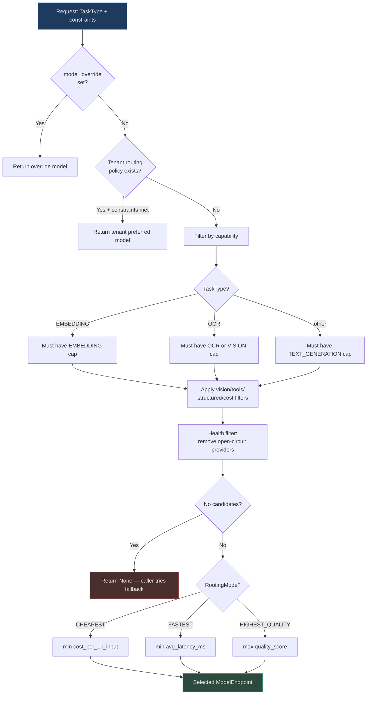
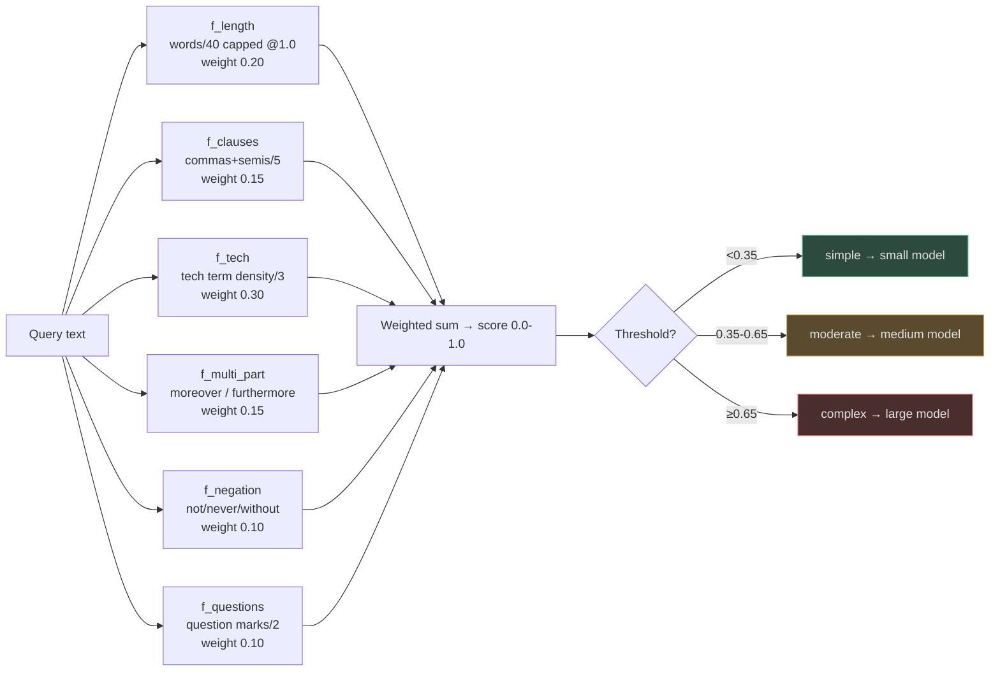
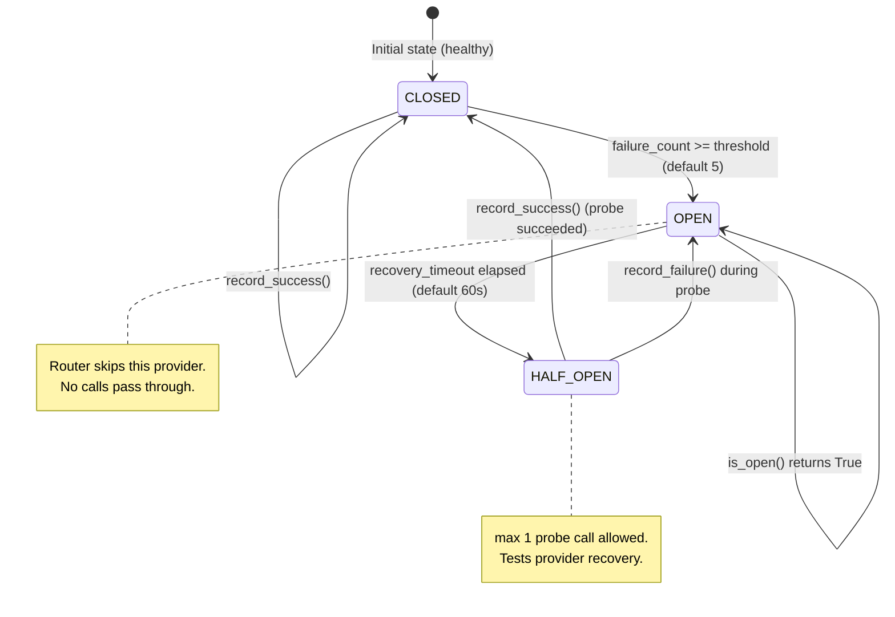
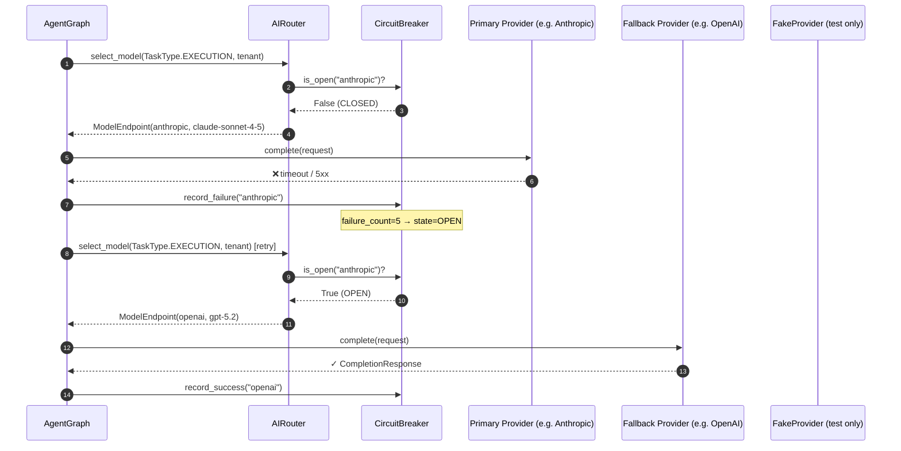

# AI Model Router

AgentVerse never hardcodes a model. Every LLM call passes through a **five-layer routing stack** that picks the optimal model from a multi-vendor registry based on task role, tenant plan, query complexity, and live provider health.

## Routing Stack Summary

| Layer | Class | File | Decision |
|---|---|---|---|
| 1. Override | `AIRouter.select_model()` | `ai_router/router.py` | Explicit `model_override` wins |
| 2. Tenant policy | `ModelRoutePolicy` | `ai_router/registry.py` | Preferred provider/model for tenant |
| 3. Capability filter | `AIRouter` | `ai_router/router.py` | Remove models missing required caps |
| 4. Health filter | `ProviderCircuitBreaker` | `providers/circuit_breaker.py` | Remove open-circuit providers |
| 5. Routing mode | `RoutingMode` | `ai_router/models.py` | CHEAPEST / FASTEST / HIGHEST_QUALITY |

---

## 1. Routing Decision Flowchart


<!-- Sources: app/ai_router/router.py:1-100, app/ai_router/models.py:1-80, app/ai_router/registry.py:1-100 -->

---

## 2. Model Capability Matrix

The [`BUILTIN_MODELS`](https://github.com/harsh786/agent-verse/blob/main/agent-verse-backend/app/ai_router/registry.py#L20-L100) catalog ships with 10+ preconfigured endpoints:

| Provider | Model | TG | Tools | Vision | Embed | Cost/1k in | Quality |
|---|---|---|---|---|---|---|---|
| Anthropic | `claude-opus-4-5` | ✓ | ✓ | ✓ | — | $0.015 | 0.97 |
| Anthropic | `claude-sonnet-4-5` | ✓ | ✓ | ✓ | — | $0.003 | 0.92 |
| Anthropic | `claude-haiku-3-5` | ✓ | ✓ | — | — | $0.0008 | 0.82 |
| OpenAI | `gpt-5.2` | ✓ | ✓ | ✓ | — | $0.005 | 0.94 |
| OpenAI | `gpt-4o-mini` | ✓ | ✓ | ✓ | — | $0.00015 | 0.80 |
| OpenAI | `text-embedding-3-large` | — | — | — | ✓ | $0.00013 | 0.93 |
| Gemini | `gemini-2.0-flash` | ✓ | ✓ | ✓ | — | $0.0001 | 0.85 |
| Gemini | `gemini-2.5-pro` | ✓ | ✓ | ✓ | Video | $0.00125 | 0.95 |
| Groq | `llama-3.3-70b` | ✓ | ✓ | — | — | $0.00059 | 0.86 |
| Groq | `llama-3.1-8b-instant` | ✓ | ✓ | — | — | $0.00005 | 0.72 |

**TG** = TEXT_GENERATION, **Tools** = TOOL_USE, **Embed** = EMBEDDING

---

## 3. Task Types and Role Requirements

Each `TaskType` in [`app/ai_router/models.py`](https://github.com/harsh786/agent-verse/blob/main/agent-verse-backend/app/ai_router/models.py#L37-L49) maps to a distinct set of capability requirements:

| Task Type | Requires | Typical Model Tier |
|---|---|---|
| `PLANNING` | TEXT_GENERATION + TOOL_USE | large (complex reasoning) |
| `EXECUTION` | TEXT_GENERATION + TOOL_USE | large (tool calling + code gen) |
| `VERIFICATION` | TEXT_GENERATION | medium (faithfulness judge) |
| `JUDGE` | TEXT_GENERATION | large (strong calibration) |
| `EMBEDDING` | EMBEDDING cap only | embedding-specialist |
| `OCR` | OCR or VISION | vision-capable |
| `SPEECH` | SPEECH_TO_TEXT | ASR-specialist |
| `VIDEO` | VIDEO_UNDERSTANDING | Gemini 2.5 Pro or equivalent |
| `TEXT_GENERATION` | TEXT_GENERATION | tier by complexity |

---

## 4. Query Complexity Scorer

Before routing, [`QueryComplexityScorer`](https://github.com/harsh786/agent-verse/blob/main/agent-verse-backend/app/ai_router/complexity_scorer.py#L1-L100) scores the incoming query using **6 lightweight lexical features** (zero LLM calls, <1ms):


<!-- Sources: app/ai_router/complexity_scorer.py:1-100 -->

### Feature Weight Table

| Feature | Signal | Weight | Max Raw Value |
|---|---|---|---|
| `f_length` | Word count | 0.20 | 40 words → 1.0 |
| `f_clauses` | Commas + semicolons + colons | 0.15 | 5 separators → 1.0 |
| `f_technical` | Regex tech-term matches | **0.30** | 3 terms → 1.0 |
| `f_multi_part` | Transition words (moreover, etc.) | 0.15 | Binary 0/1 |
| `f_negation` | not / never / without / unless | 0.10 | 3 negations → 1.0 |
| `f_questions` | Question marks | 0.10 | 2 marks → 1.0 |

Technical density is the **dominant signal** (0.30 weight) — a single "transformer architecture" phrase shifts a query from simple to moderate.

---

## 5. Circuit Breaker State Machine

[`ProviderCircuitBreaker`](https://github.com/harsh786/agent-verse/blob/main/agent-verse-backend/app/providers/circuit_breaker.py#L8-L75) implements per-provider circuit breaking with three states:


<!-- Sources: app/providers/circuit_breaker.py:1-100 -->

The module-level `_provider_cb` singleton is shared across all `AgentGraph` instances within a process. Configuration:

| Parameter | Default | Description |
|---|---|---|
| `failure_threshold` | 5 | Failures before OPEN |
| `recovery_timeout` | 60 s | Time in OPEN before HALF_OPEN probe |
| `half_open_max` | 1 | Max probe calls in HALF_OPEN |
| `LLM_CALL_TIMEOUT_SECONDS` (env) | 60 s | Timeout per call before recording failure |

---

## 6. Provider Fallback Chain


<!-- Sources: app/providers/circuit_breaker.py:65-100, app/ai_router/router.py:35-50 -->

---

## 7. Shadow Routing

[`ShadowRouter`](https://github.com/harsh786/agent-verse/blob/main/agent-verse-backend/app/ai_router/shadow_router.py#L44-L120) enables **zero-impact A/B model evaluation**:

```mermaid
flowchart LR
    REQ[Incoming Request] --> SR{Shadow<br>enabled?}
    SR -->|No| PP[Primary Provider only]
    SR -->|Yes: sample?] --> COIN{random() < sample_rate<br>default 0.10}
    COIN -->|No| PP
    COIN -->|Yes| BOTH[Fire both concurrently<br>asyncio.create_task]

    BOTH --> PRI[Primary → await]
    BOTH --> SHA[Shadow → asyncio.wait_for<br>timeout=30s]

    PRI --> RESP[Return primary to caller]
    SHA -->|success| LOG[ShadowResult stored<br>in-memory ring buffer<br>max 100 entries]
    SHA -->|timeout/error| CANCEL[shadow_task.cancel<br>silent failure]

    LOG --> API[GET /shadow-log<br>offline analysis]

    style RESP fill:#2d4a3e,stroke:#4aba8a,color:#e0e0e0
    style CANCEL fill:#2d2d3d,stroke:#7a7a8a,color:#e0e0e0
```
<!-- Sources: app/ai_router/shadow_router.py:1-120 -->

Key properties:
- **Shadow failures are always silent** — `except Exception: shadow_task.cancel()` ensures the primary path is never blocked
- **Sample rate** defaults to 10% (`sample_rate=0.1`) — configurable per deployment
- **Result log** is a capped in-memory ring buffer (default 100 entries) exposed at `/shadow-log` for offline analysis

---

## Related Pages

| Page | Relevance |
|---|---|
| [Platform Workflows](platform-workflows.md) | Where `select_model()` is called in the agent loop |
| [Multimodal Processing](multimodal.md) | Vision / ASR task types routed here |
| [Hallucination Handling](hallucination-handling.md) | NLI judge routed via `TaskType.JUDGE` |
| [Chunking Strategies](chunking-strategies.md) | Embedding model selection via `TaskType.EMBEDDING` |
