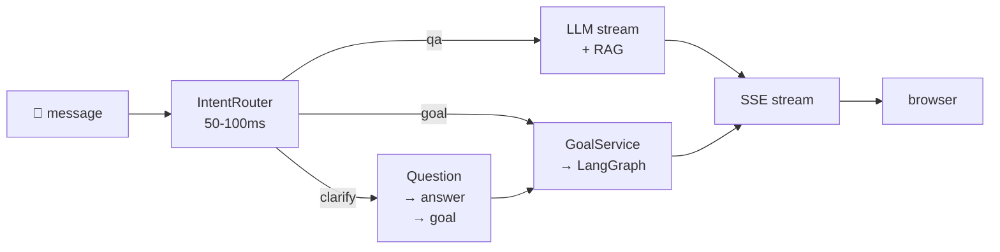

# Chat Interface

AgentVerse Chat is a GitHub Copilot / Claude-style conversational interface. A single input box handles everything: factual questions get a direct streaming answer; action-oriented messages trigger the full agent goal execution engine with live step-by-step updates — all without the user needing to know which path runs.

This page covers:
- The **intent routing** architecture (QA / GOAL / CLARIFY)
- **Session persistence** — 7-day TTL, pinnable forever, cross-session memory
- **Goal execution streaming** — 11 SSE event types, Redis bridge, stop/cancel
- **Clarification flows** — pre-execution, mid-execution, multi-turn (3 questions max)
- **HITL gate** — high-risk step approval with 10-minute timeout
- **Frontend UX** — world-class components, keyboard shortcuts, accessibility, file handling
- The **REST API** — 7 endpoints

---

## 1. Architecture



All three paths deliver output through a single persistent SSE stream per session. The GoalService, LangGraph, and all MCP tools are invoked unchanged.

---

## 2. Data Model

| Table | Key columns |
|---|---|
| `chat_sessions` | `id`, `tenant_id`, `title`, `pinned`, `ttl_days`, `agent_id` |
| `chat_messages` | `id`, `session_id`, `role`, `content`, `metadata JSONB` |

RLS enforces tenant isolation at the database layer. Sessions expire after `ttl_days` (default 7) unless `pinned = true`.

---

## 3. SSE Event Types

| Type | Trigger |
|---|---|
| `routing` | Intent classified |
| `token` | Q&A LLM token |
| `step_started` | Goal step begins |
| `step_complete` | Goal step finishes |
| `tool_call` | MCP tool invoked |
| `goal_complete` | Goal succeeded |
| `goal_failed` | Goal failed |
| `clarify_needed` | Mid-execution question |
| `hitl_required` | High-risk approval gate |
| `message_complete` | Message persisted |
| `error` | Stream-level error |

---

## 4. Clarification Flows

1. **Pre-execution** — `IntentRouter` returns `CLARIFY`; agent asks one question; user answers; goal starts
2. **Mid-execution** — executor emits `clarify_needed`; goal pauses; user answers via chat; goal resumes
3. **Multi-turn** — up to 3 sequential questions; then executes with defaults
4. **Quick-reply chips** — questions include `options[]` rendered as one-click pill buttons

---

## 5. Frontend Components

```
ChatPage
├── ChatSidebar         session list, search, pin, TTL badges, agent selector
├── ChatThread          virtualized message list, auto-scroll, date separators
│   ├── ChatMessage     markdown + code blocks, copy, thumbs, retry
│   ├── ChatStepCard    step status (⏳→✅→❌) + expandable tool detail
│   ├── ChatGoalSummary completion card + follow-up chips + download
│   ├── ChatClarifyCard question + quick-reply chips + countdown
│   └── ChatHITLCard    approve/reject + countdown
└── ChatInputArea       textarea, file drop, @mentions, /commands, #context, send
```

---

## 6. World-Class UX Features

**Input:**  file drag-drop, image paste (Ctrl+V), `@agent` mentions, `/slash` commands, `#file` context references, auto-grow textarea, Shift+Enter newline

**Thread:**  token-by-token streaming with cursor, inline step cards, expandable tool details, stop/cancel button, goal complete summary, suggested follow-ups, session export (markdown/PDF)

**Session:**  pinning, 7-day TTL with expiry badges, search, groups (Today/Yesterday/This Week), agent selector, background push notifications when goal completes

**Rendering:**  full GFM markdown, syntax-highlighted code blocks, tables, copy button per block, links in new tab

**Keyboard:**  Enter=send, Shift+Enter=newline, Ctrl/Cmd+K=new chat, ↑=edit last message, Escape=close sidebar

**Accessibility:**  WCAG 2.2 AA, `aria-live` announcements, focus trapping in HITL cards, skip-to-main link, 44×44px touch targets

**Responsive:**  desktop (sidebar fixed), tablet (icon rail), mobile (drawer)

---

## 7. Deep-Dive Files

| File | Topic |
|---|---|
| [chat/01-architecture-and-intent-routing.md](chat/01-architecture-and-intent-routing.md) | Request lifecycle, intent classifier, QA vs GOAL vs CLARIFY |
| [chat/02-session-management-and-persistence.md](chat/02-session-management-and-persistence.md) | Data model, TTL, pinning, RLS, cross-session memory, context compression |
| [chat/03-goal-execution-and-sse-streaming.md](chat/03-goal-execution-and-sse-streaming.md) | SSE schema, Redis bridge, reconnect, step rendering, push notifications |
| [chat/04-clarification-flows-and-hitl.md](chat/04-clarification-flows-and-hitl.md) | Pre/mid-execution clarify, multi-turn, quick-reply chips, HITL gate |
| [chat/05-frontend-components-and-ux.md](chat/05-frontend-components-and-ux.md) | All React components, layout, dark mode, responsive, accessibility |
| [chat/06-api-reference.md](chat/06-api-reference.md) | All 7 endpoints, request/response schemas, error codes, rate limits |
