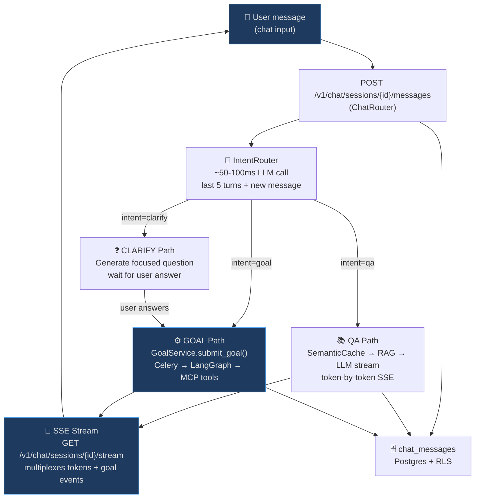

# Architecture & Intent Routing

## Overview

AgentVerse Chat is a thin orchestration layer that routes natural-language messages to one of three execution paths — without the user needing to know or care which one runs.



---

## Backend Package: `app/chat/`

```
app/chat/
  __init__.py
  models.py        # ChatSession, ChatMessage — SQLAlchemy ORM
  router.py        # FastAPI router — 7 endpoints
  service.py       # ChatService: session CRUD, message dispatch, history
  intent.py        # IntentRouter: classify QA / GOAL / CLARIFY
  stream.py        # SSE stream generator: tokens + goal events
  context.py       # ConversationContext: last-20-turns builder
```

---

## Intent Classification

`IntentRouter` makes a single fast LLM call (~50-100ms) and returns one of three intents:

| Intent | Trigger Signals | Execution |
|---|---|---|
| `QA` | Question words (what, how, why, explain, describe), factual queries, "what is X" | Direct LLM stream with conversation history + optional RAG |
| `GOAL` | Action verbs (deploy, create, run, fix, build, analyze, generate, test, migrate) | `GoalService.submit_goal()` → LangGraph → MCP tools |
| `CLARIFY` | Action verb present but required params missing (env not specified, ambiguous target) | Generate one focused question, wait, resubmit |

### Classification Prompt

```python
# app/chat/intent.py

INTENT_SYSTEM = """
You are a message classifier for an AI agent platform.
Classify the user message into one of: qa, goal, clarify.

qa: factual questions, explanations, how-does-X-work
goal: actions to perform (deploy, run, create, fix, analyze, test, migrate, etc.)
clarify: action is clear but critical parameters are missing

Return JSON: {"intent": "qa|goal|clarify", "reason": "one-line explanation"}
Respond in < 100 tokens.
"""

class IntentRouter:
    async def classify(self, message: str, history: list[dict]) -> Intent:
        last_5 = history[-5:] if len(history) >= 5 else history
        response = await self.provider.complete(
            messages=[
                {"role": "system", "content": INTENT_SYSTEM},
                *last_5,
                {"role": "user", "content": message},
            ],
            max_tokens=100,
        )
        data = json.loads(response.content)
        return Intent(data["intent"])
```

---

## QA Path

For factual questions and explanations:

```
1. SemanticCache.lookup(message)   → cache hit: stream cached answer
2. KnowledgeStore.search(message)  → retrieve top-3 RAG chunks (optional)
3. LLM stream with:
   - system: agent context + knowledge chunks
   - history: last 20 turns
   - user: new message
4. Token-by-token SSE → chat thread
5. Complete message saved to chat_messages
```

**SemanticCache** deduplicates identical/near-identical questions across users (same tenant), saving LLM calls and reducing latency to < 50ms for repeated questions.

---

## GOAL Path

For action-oriented messages:

```python
# app/chat/service.py

async def submit_as_goal(
    self, session_id: UUID, message: str, tenant_id: UUID, agent_id: UUID | None
) -> UUID:
    # Build compact context from last 20 turns
    history = await self._get_history(session_id, limit=20)
    context = summarize_history(history, max_tokens=500)

    # Submit to existing GoalService — UNCHANGED
    goal_id = await self.goal_service.submit_goal(
        text=message,
        tenant_id=tenant_id,
        context=context,
        agent_id=agent_id,          # None = auto-route
        source="chat",
        metadata={"session_id": str(session_id)},
    )

    # Bridge Redis pub/sub → chat SSE stream
    await self.stream_service.bridge_goal(session_id, goal_id)
    return goal_id
```

**Zero changes to GoalService, LangGraph, Celery, or any MCP tool.** The chat layer is purely additive.

---

## Two-Transport Architecture

```
User browser
    │
    ├── POST /v1/chat/sessions/{id}/messages  [request/response]
    │   → saves user message, triggers intent routing, returns {message_id}
    │
    └── GET  /v1/chat/sessions/{id}/stream    [persistent SSE]
        → all events flow here:
          - QA tokens (from LLM)
          - goal step events (from Redis pub/sub → bridged)
          - clarify questions
          - HITL approvals
          - errors
```

The SSE connection is opened once per session load and stays open. Message submission and streaming are completely decoupled.

---

## Integration with Existing Systems

| System | How Chat Uses It |
|---|---|
| `GoalService` | `submit_goal()` called directly — no changes |
| `LangGraph` | Executes goals unchanged — chat adds no overhead |
| `SemanticCache` | Q&A lookups reduce latency + LLM cost |
| `KnowledgeStore` | RAG retrieval for grounded Q&A |
| `LongTermMemoryStore` | Cross-session user preferences injected as system context |
| `AgentMemory` | Per-goal working memory — active automatically |
| `ModelRouter` | Selects best LLM per role (planner/executor/verifier) |
| `CostControl` | Budget enforcement per tenant — unchanged |
| `Guardrails` | Injection detection on user messages — unchanged |
| `TenantMiddleware` | API key auth, RLS — unchanged |
| `AuditLog` | Chat messages + goal triggers logged for compliance |
