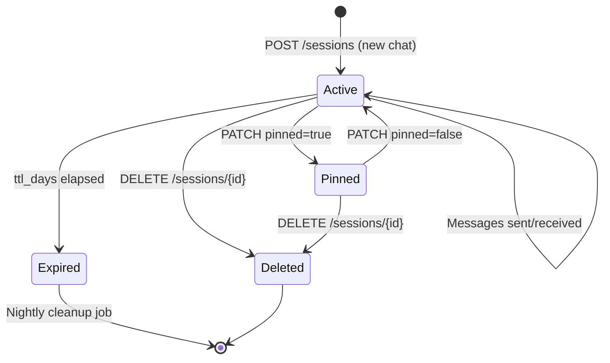

# Session Management & Persistence

## Data Model

### `chat_sessions`

```sql
CREATE TABLE chat_sessions (
    id           UUID        DEFAULT gen_random_uuid() PRIMARY KEY,
    tenant_id    UUID        NOT NULL REFERENCES tenants(id),
    user_id      UUID        NOT NULL,                    -- future: user identity
    title        TEXT        NOT NULL,                    -- auto-generated, editable
    pinned       BOOLEAN     DEFAULT false,
    ttl_days     INTEGER     DEFAULT 7,                   -- null = pinned forever
    agent_id     UUID        REFERENCES agents(id),       -- preferred agent for this session
    created_at   TIMESTAMPTZ DEFAULT now(),
    updated_at   TIMESTAMPTZ DEFAULT now()
);

-- Indexes
CREATE INDEX idx_chat_sessions_tenant     ON chat_sessions (tenant_id, updated_at DESC);
CREATE INDEX idx_chat_sessions_pinned     ON chat_sessions (tenant_id, pinned)
    WHERE pinned = true;
CREATE INDEX idx_chat_sessions_ttl        ON chat_sessions (ttl_days, updated_at)
    WHERE ttl_days IS NOT NULL AND pinned = false;
```

### `chat_messages`

```sql
CREATE TABLE chat_messages (
    id           UUID        DEFAULT gen_random_uuid() PRIMARY KEY,
    session_id   UUID        NOT NULL REFERENCES chat_sessions(id) ON DELETE CASCADE,
    tenant_id    UUID        NOT NULL,                              -- RLS
    role         TEXT        NOT NULL CHECK (role IN ('user', 'assistant', 'system')),
    content      TEXT        NOT NULL,
    metadata     JSONB,      -- {intent, goal_id, step_count, latency_ms, tool_calls, files}
    created_at   TIMESTAMPTZ DEFAULT now()
);

-- Indexes
CREATE INDEX idx_chat_messages_session ON chat_messages (session_id, created_at DESC);
CREATE INDEX idx_chat_messages_tenant  ON chat_messages (tenant_id, created_at DESC);
-- Full-text search within session
CREATE INDEX idx_chat_messages_fts ON chat_messages
    USING GIN (to_tsvector('english', content));
```

---

## Row-Level Security

Every query is automatically scoped to the current tenant via `SET LOCAL app.tenant_id`. Users can only see their own sessions and messages — no cross-tenant data leakage.

```sql
-- RLS policies
ALTER TABLE chat_sessions ENABLE ROW LEVEL SECURITY;
CREATE POLICY chat_sessions_tenant ON chat_sessions
    USING (tenant_id = current_setting('app.tenant_id')::uuid);

ALTER TABLE chat_messages ENABLE ROW LEVEL SECURITY;
CREATE POLICY chat_messages_tenant ON chat_messages
    USING (tenant_id = current_setting('app.tenant_id')::uuid);
```

---

## Session Lifecycle



### TTL Cleanup

A nightly Celery beat task soft-deletes sessions past their TTL:

```python
# app/scaling/tasks.py (existing Celery infrastructure)

@celery_app.task
async def cleanup_expired_chat_sessions():
    cutoff = datetime.utcnow() - timedelta(days=1)  # grace period
    await db.execute("""
        DELETE FROM chat_sessions
        WHERE pinned = false
          AND ttl_days IS NOT NULL
          AND updated_at < now() - (ttl_days || ' days')::interval
    """)
```

### Auto-Generated Titles

The session title is generated from the first user message on creation:

```python
def generate_title(message: str, max_length: int = 60) -> str:
    # Strip whitespace, take first sentence or truncate
    title = message.strip().split('\n')[0][:max_length]
    return title + ("…" if len(message) > max_length else "")
```

---

## Conversation Context Building

For every new message, `ConversationContext` builds the LLM context:

```python
# app/chat/context.py

class ConversationContext:
    MAX_TURNS = 20          # last N turns in context
    GOAL_SUMMARY_TOKENS = 500  # compact context for goal planner

    async def build_for_qa(self, session_id: UUID) -> list[dict]:
        """Full turns for direct LLM Q&A"""
        rows = await self.db.fetch("""
            SELECT role, content FROM chat_messages
            WHERE session_id = $1
            ORDER BY created_at DESC LIMIT $2
        """, session_id, self.MAX_TURNS)
        return [{"role": r["role"], "content": r["content"]}
                for r in reversed(rows)]

    async def build_for_goal(self, session_id: UUID) -> str:
        """Compact summary for goal planner (saves tokens)"""
        turns = await self.build_for_qa(session_id)
        if not turns:
            return ""
        # Summarize to avoid overwhelming the planner
        return f"Previous conversation context:\n" + "\n".join(
            f"[{t['role']}]: {t['content'][:200]}..." if len(t['content']) > 200
            else f"[{t['role']}]: {t['content']}"
            for t in turns[-5:]  # only last 5 for goal context
        )
```

### Long-Session Context Compression

When a session exceeds **100 messages**, the context builder automatically compresses old turns:

```python
async def build_for_qa(self, session_id: UUID) -> list[dict]:
    count = await self.db.fetchval(
        "SELECT COUNT(*) FROM chat_messages WHERE session_id = $1", session_id
    )

    if count > 100:
        # Summarize oldest turns into a single system message
        old_turns = await self._fetch_turns(session_id, offset=self.MAX_TURNS, limit=50)
        summary = await self._summarize(old_turns)
        recent_turns = await self._fetch_turns(session_id, limit=self.MAX_TURNS)
        return [
            {"role": "system", "content": f"[Earlier conversation summary]: {summary}"},
            *recent_turns,
        ]
    else:
        return await self._fetch_turns(session_id, limit=self.MAX_TURNS)
```

---

## Cross-Session Memory Integration

AgentVerse's `LongTermMemoryStore` stores user preferences and patterns across sessions. The chat context builder injects relevant memories as a system prefix:

```python
# app/chat/context.py

async def inject_long_term_memory(
    self, tenant_id: UUID, message: str, turns: list[dict]
) -> list[dict]:
    # Retrieve top-3 relevant memories for this message
    memories = await self.memory_store.retrieve(
        query=message,
        tenant_id=tenant_id,
        limit=3,
        min_relevance=0.7,
    )

    if not memories:
        return turns

    memory_text = "\n".join(f"- {m.content}" for m in memories)
    system_injection = {
        "role": "system",
        "content": f"User preferences (from past sessions):\n{memory_text}",
    }
    # Insert after any existing system messages
    return [system_injection, *turns]
```

**Examples of injected memories:**
- "User prefers Python 3.12 and type annotations"
- "User always deploys to staging before production"
- "User works on the payments service in the backend"

---

## Sidebar Session Groups

The frontend groups sessions for display:

| Group | Condition |
|---|---|
| 📌 Pinned | `pinned = true` |
| Today | `created_at >= today midnight` |
| Yesterday | `created_at >= yesterday midnight AND < today` |
| This Week | `created_at >= 7 days ago AND < yesterday` |
| Older | Everything else |

Sessions within each group are sorted by `updated_at DESC`.
