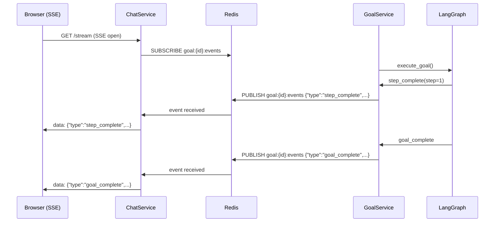

# Goal Execution & SSE Streaming

## SSE Event Schema

All events are delivered on `GET /v1/chat/sessions/{id}/stream` as `text/event-stream`.

| Event Type | When Emitted | Key Fields |
|---|---|---|
| `routing` | Message received, intent classified | `intent`, `message_id` |
| `token` | Q&A LLM generating | `content` (one token), `message_id` |
| `step_started` | Agent begins a goal step | `step`, `description`, `goal_id` |
| `step_complete` | Agent finishes a step | `step`, `result`, `goal_id`, `latency_ms` |
| `tool_call` | Agent calling an MCP tool | `tool`, `args`, `goal_id` |
| `goal_complete` | Goal execution finished | `goal_id`, `summary`, `latency_ms` |
| `goal_failed` | Goal execution failed | `goal_id`, `error`, `code` |
| `clarify_needed` | Agent needs input | `question`, `options[]`, `goal_id`, `timeout_seconds` |
| `hitl_required` | High-risk step approval | `action`, `risk`, `goal_id` |
| `message_complete` | Full message persisted | `message_id`, `role` |
| `error` | Stream-level error | `message`, `code` |

```json
// Examples of each event type:
{"type":"routing",       "intent":"goal",         "message_id":"msg-123"}
{"type":"token",         "content":"The deploy",  "message_id":"msg-124"}
{"type":"step_started",  "step":1, "description":"Running tests", "goal_id":"g-001"}
{"type":"step_complete", "step":1, "result":"47 passed", "goal_id":"g-001","latency_ms":2340}
{"type":"tool_call",     "tool":"run_command", "args":{"cmd":"pytest"}, "goal_id":"g-001"}
{"type":"goal_complete", "goal_id":"g-001", "summary":"All tests pass", "latency_ms":4300}
{"type":"clarify_needed","question":"Which env?","options":["staging","prod"],"goal_id":"g-001","timeout_seconds":600}
{"type":"hitl_required", "action":"Deploy v2 to prod?", "risk":"high", "goal_id":"g-001"}
{"type":"message_complete","message_id":"msg-124", "role":"assistant"}
{"type":"error",         "message":"Rate limit exceeded", "code":"RATE_LIMIT"}
```

---

## Stream Generator

```python
# app/chat/stream.py

async def stream_session(session_id: UUID, tenant_id: UUID) -> AsyncIterator[str]:
    """
    Multiplex SSE events from two sources:
    1. LLM tokens (from in-process async generator)
    2. Goal step events (from Redis pub/sub)
    """
    queue: asyncio.Queue[dict] = asyncio.Queue()

    async def _push_llm_tokens(tokens_gen):
        async for token in tokens_gen:
            await queue.put({"type": "token", "content": token})
        await queue.put({"type": "_llm_done"})

    async def _push_goal_events(goal_id: UUID):
        async with redis.subscribe(f"goal:{goal_id}:events") as chan:
            async for raw in chan:
                event = json.loads(raw)
                await queue.put(event)
                if event["type"] in ("goal_complete", "goal_failed"):
                    break

    # Items flow into queue from either source; yield them in order
    while True:
        event = await asyncio.wait_for(queue.get(), timeout=30.0)
        if event["type"] == "_llm_done":
            break
        yield f"data: {json.dumps(event)}\n\n"
```

---

## Redis Pub/Sub Bridge

The existing `GoalService` publishes step events to Redis. `ChatService` subscribes and forwards them:



**Key property:** The GoalService and LangGraph are completely unaware of the chat layer. They publish to Redis as they always have. The chat stream layer subscribes and forwards.

---

## SSE Reconnect Strategy

The frontend `useChatStream` hook implements exponential backoff:

```typescript
// src/features/chat/hooks/useChatStream.ts

const BACKOFF = [1000, 2000, 4000, 8000, 16000, 30000]; // ms

function useChatStream(sessionId: string) {
  const retryRef = useRef(0);

  const connect = useCallback(() => {
    const es = new EventSource(`/v1/chat/sessions/${sessionId}/stream`, {
      withCredentials: true,
    });

    es.onopen = () => { retryRef.current = 0; }; // reset on success

    es.onerror = () => {
      es.close();
      const delay = BACKOFF[Math.min(retryRef.current, BACKOFF.length - 1)];
      retryRef.current++;
      setTimeout(connect, delay);
    };

    es.onmessage = (e) => {
      const event = JSON.parse(e.data) as ChatSSEEvent;
      dispatch({ type: 'SSE_EVENT', payload: event });
    };

    return es;
  }, [sessionId]);

  useEffect(() => {
    const es = connect();
    return () => es.close();
  }, [connect]);
}
```

---

## Inline Step Rendering

Each `step_started` event creates a **step card** in the thread. The card transitions through states as subsequent events arrive:

```
step_started  →  ⏳ Running...   [spinner]   [■ Stop]
step_complete →  ✅ Passed       [2.3s]      [▼ expand]
goal_failed   →  ❌ Failed       [details]   [↺ Retry]
```

### Step Card State Machine

```typescript
// src/features/chat/ChatStepCard.tsx

type StepState = 'pending' | 'running' | 'complete' | 'failed' | 'skipped';

interface StepCard {
  step: number;
  description: string;
  state: StepState;
  result?: string;
  toolCalls: ToolCall[];
  latencyMs?: number;
  expanded: boolean;
}
```

When expanded, the card shows:
- Tool name + truncated args (first 200 chars)
- Tool output / return value
- Raw LLM reasoning (if available)

---

## Goal Complete Card

After `goal_complete`, a summary card replaces the final step:

```
┌─────────────────────────────────────────────────────┐
│  ✅ Goal completed in 4.3s                          │
│  "All 50 tests now passing. 3 fixes applied."        │
│                                                     │
│  [View full trace]  [Copy summary]  [Run again]     │
│                                                     │
│  Suggested next steps:                              │
│  [Create a PR]  [Deploy to staging]  [Show diff]    │
└─────────────────────────────────────────────────────┘
```

Suggested follow-ups are generated by a lightweight LLM call that looks at the goal result and generates 2-3 contextual next-action chips.

---

## Stop / Cancel

The `[■ Stop]` button is visible while any goal is running in the session:

```typescript
const handleStop = async () => {
  await goalApi.cancelGoal(activeGoalId);
  // Chat SSE receives: {"type":"goal_failed","code":"USER_CANCELLED",...}
};
```

The cancellation propagates through GoalService to the Celery task, which signals LangGraph to stop at the next safe checkpoint.

---

## Notification When Goal Completes (Background)

If the user navigates away from the chat page while a goal is running, they receive a **browser push notification** when it completes:

```typescript
// Register service worker push on session start
if ('serviceWorker' in navigator && 'PushManager' in window) {
  const reg = await navigator.serviceWorker.register('/sw.js');
  const sub = await reg.pushManager.subscribe({ ... });
  await chatApi.registerPushSubscription(sessionId, sub);
}
```

The backend delivers a Web Push notification when `goal_complete` or `goal_failed` events fire. The notification title is the session title; the body is the goal summary.

**Fallback:** If push notifications are not supported or not granted, the browser tab shows a badge counter `(1)` in the title.
