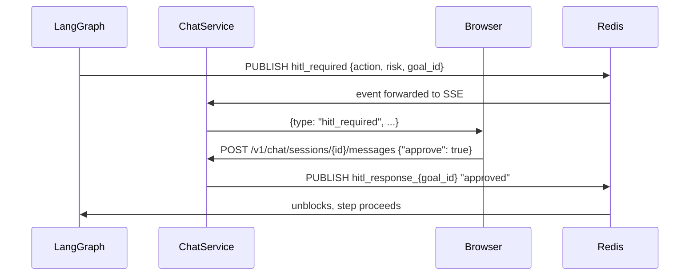

# Clarification Flows & HITL

## Three Clarification Patterns

| Pattern | When | Blocks execution? |
|---|---|---|
| Pre-execution clarification | Intent = CLARIFY (goal underspecified) | Yes — goal not started until answered |
| Mid-execution `clarify_needed` | Executor hits missing required param | Yes — goal paused, resumes after answer |
| HITL approval gate | High-risk step (deploy, delete, prod) | Yes — step held, auto-rejected after 10min |

---

## 1. Pre-Execution Clarification

When `IntentRouter` returns `CLARIFY`, the agent generates one focused question before starting execution.

```
User:   "Deploy the app"
Chat:   ❓ Which environment should I deploy to?
        [staging]  [production]  [I'll specify in my answer]
User:   "staging"
Chat:   🔵 Routing to agent...
        ⚙️ Step 1: Run test suite ...
```

### Flow

```python
# app/chat/service.py

async def handle_clarify_intent(
    self, session_id: UUID, message: str, history: list[dict]
) -> ClarifyResponse:
    # Generate focused question from the underspecified message
    question = await self.intent_router.generate_clarifying_question(
        message=message, history=history
    )
    # Save question as assistant message
    q_msg = await self.save_message(
        session_id, role="assistant", content=question.text,
        metadata={"type": "clarify", "options": question.options}
    )
    # The SSE stream emits the question text as tokens
    # + a clarify_card event with options chips
    return ClarifyResponse(message_id=q_msg.id, question=question)
```

When the user sends their answer (a new chat message), `ChatService` recognizes it as a clarification response because the previous assistant message had `metadata.type == "clarify"`. It appends the answer to the original message and resubmits as a complete goal.

---

## 2. Mid-Execution `clarify_needed`

During goal execution, the LangGraph executor can emit a `clarify_needed` event when a step requires missing information.

```json
{
  "type": "clarify_needed",
  "goal_id": "g-001",
  "question": "Which S3 bucket should I upload to?",
  "options": ["app-assets-prod", "app-assets-staging", "other"],
  "required": true,
  "timeout_seconds": 600
}
```

### UI Rendering

```
⚙️ Step 2: Upload artifact to S3    ⏸ Waiting for input
  ❓ Which S3 bucket should I upload to?
     [app-assets-staging]  [app-assets-prod]  [other]

     ⏱ Expires in 9:47
```

### Implementation

The goal executor signals the pause:

```python
# Within LangGraph executor node (app/agent/graph.py)

if missing_params := self._detect_missing_params(tool, args):
    self.event_publisher.publish(goal_id, {
        "type": "clarify_needed",
        "question": f"Which {missing_params[0]}?",
        "options": await self._suggest_options(missing_params[0]),
        "required": True,
        "timeout_seconds": 600,
    })
    # Pause execution: wait on Redis key
    answer = await redis.blpop(
        f"goal:{goal_id}:clarify_answer",
        timeout=600
    )
    if answer is None:
        raise GoalTimeout("No clarification received within 10 minutes")
    # Resume with injected answer
    args[missing_params[0]] = json.loads(answer[1])
```

When the user sends a reply in chat, `ChatService` checks if any active goal for that session is waiting on a clarification answer. If so, it pushes the answer to Redis and the goal resumes.

---

## 3. Multi-Turn Goal Refinement

For complex underspecified goals, the agent may ask **up to 3 sequential clarifying questions** before starting execution.

```
User:   "Set up the CI pipeline"

Agent:  ❓ Q1: Which branches should trigger CI?
        [main only]  [main + develop]  [all branches]
User:   "main + develop"

Agent:  ❓ Q2: Should tests run in parallel?
        [parallel (faster)]  [sequential (safer)]
User:   "parallel"

Agent:  🔵 Starting execution with your answers...
        Context: branches=main+develop, parallel=true
```

After 3 questions, execution starts regardless — using defaults for anything still unresolved. This prevents infinite question loops.

```python
# app/chat/intent.py

MAX_CLARIFY_ROUNDS = 3

async def should_ask_another_question(
    self, session_id: UUID, history: list[dict]
) -> bool:
    # Count clarify messages in last N turns
    clarify_count = sum(
        1 for m in history[-20:]
        if m.get("metadata", {}).get("type") == "clarify"
    )
    return clarify_count < self.MAX_CLARIFY_ROUNDS
```

---

## 4. Quick-Reply Chips

Questions with `options` render as **pill buttons** the user can click — or they can type a free-form answer. Clicking a chip sends the answer as a normal chat message (visible in history):

```tsx
// src/features/chat/ChatClarifyCard.tsx

function ChatClarifyCard({ question, options, onAnswer }: Props) {
  return (
    <div className="clarify-card" role="group" aria-label="Clarification needed">
      <span className="clarify-icon">❓</span>
      <p className="clarify-question">{question}</p>
      {options && (
        <div className="clarify-options" role="list">
          {options.map(opt => (
            <button
              key={opt}
              role="listitem"
              className="chip"
              onClick={() => onAnswer(opt)}
              aria-label={`Answer: ${opt}`}
            >
              {opt}
            </button>
          ))}
        </div>
      )}
      {timeout && <CountdownBadge seconds={timeout} />}
    </div>
  );
}
```

The `onAnswer` callback sends `POST /v1/chat/sessions/{id}/messages` with the selected value.

---

## 5. HITL Approval Gate

High-risk steps (`deploy`, `delete`, `drop`, `format`, `push --force`) trigger an approval gate before the step executes:

```
⚠️ Human approval required
"Deploy v2.4.1 to production cluster (acme-prod)?"

Risk: HIGH — irreversible operation

[✓ Approve]  [✗ Reject]  [💬 Ask a question first]

⏱ Auto-rejected in 9:47
```

### Risk Classification

```python
# app/agent/tool_risk.py (existing)

RISK_HIGH_KEYWORDS = {"deploy", "delete", "drop", "purge", "truncate", "push --force"}

def classify_risk(step_description: str) -> RiskLevel:
    lower = step_description.lower()
    if any(kw in lower for kw in RISK_HIGH_KEYWORDS):
        return RiskLevel.HIGH
    return RiskLevel.MEDIUM
```

### HITL Event Flow



### Timeout Behavior

If no approval within 10 minutes:
1. Goal status → `failed` with code `HITL_TIMEOUT`
2. Chat SSE receives `goal_failed` event
3. User sees: "❌ Approval timed out. Use [↺ Retry] to restart."
