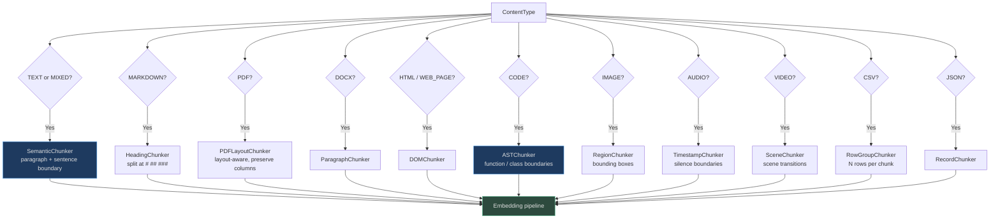
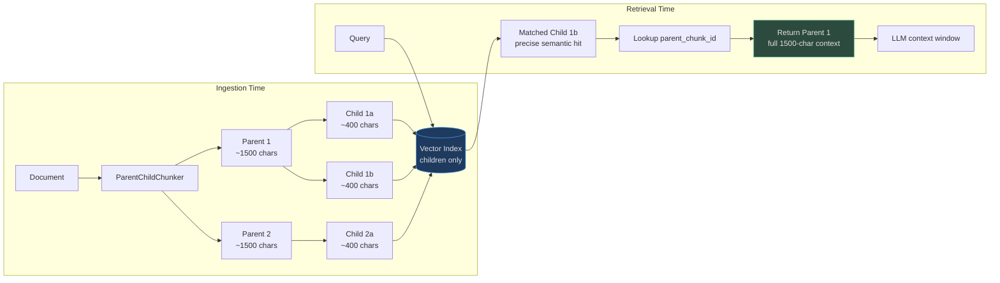
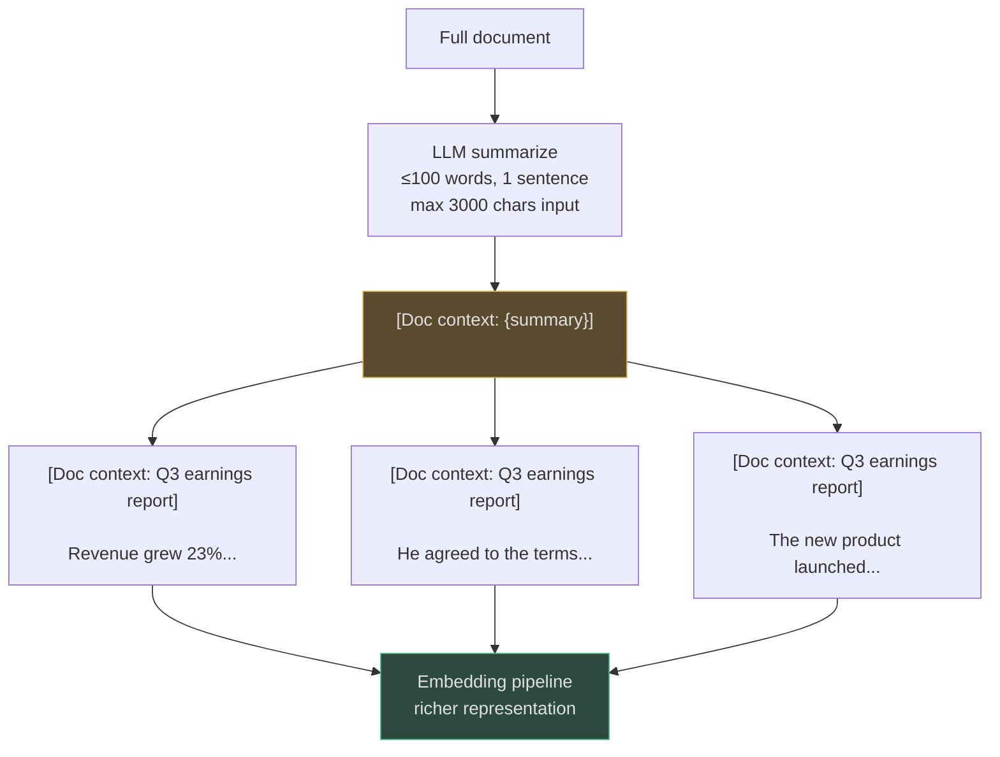
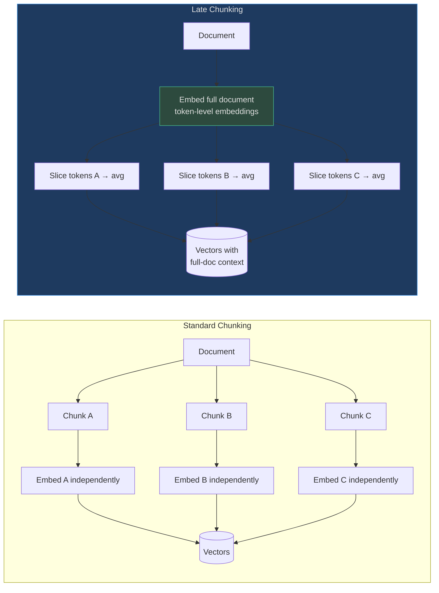
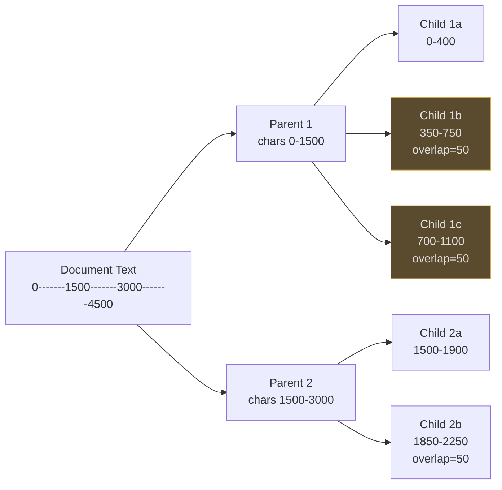

# Chunking Strategies

Chunking is one of the highest-leverage decisions in RAG. Using the wrong strategy — fixed-size splitting for code, or AST chunking for plain prose — degrades retrieval quality far more than model choice.

AgentVerse ships **15 distinct chunkers** auto-selected by content type, with four advanced retrieval-time patterns that can be overlaid on any strategy.

---

## 1. Strategy Selection Decision Flowchart

[`ChunkingStrategySelector`](https://github.com/harsh786/agent-verse/blob/main/agent-verse-backend/app/ingestion/chunking_strategy_selector.py#L1-L48) maps `ContentType` → strategy automatically:


<!-- Sources: app/ingestion/chunking_strategy_selector.py:1-48 -->

Advanced strategies (`parent_child`, `sentence_window`, `fixed`, `agentic`, `agentic_chunking`) can be set at the **collection level** and override the content-type default.

---

## 2. All Chunker Comparison Table

| # | Chunker | File | When To Use | Chunk Size | Quality | LLM Cost |
|---|---|---|---|---|---|---|
| 1 | `SemanticChunker` | `chunkers/semantic.py` | Plain text, prose | 512 tokens (2048 chars) | ★★★★☆ | None |
| 2 | `HeadingChunker` | `chunkers/heading.py` | Markdown docs, wikis | Per section | ★★★★★ | None |
| 3 | `ASTChunker` | `chunkers/ast_chunker.py` | Python/JS/Go code | Per function/class | ★★★★★ | None |
| 4 | `PDFLayoutChunker` | `chunkers/pdf_layout.py` | PDFs with columns, tables | Per page region | ★★★★☆ | None |
| 5 | `TimestampChunker` | `chunkers/timestamp.py` | Audio/video transcripts | Per silence boundary | ★★★★☆ | None |
| 6 | `SceneChunker` | `chunkers/scene.py` | Video | Per scene transition | ★★★★☆ | None |
| 7 | `TableChunker` | `chunkers/table.py` | CSV, JSON row groups | N rows per chunk | ★★★☆☆ | None |
| 8 | `ParentChildChunker` | `rag/parent_child_chunker.py` | Any — precision + context | Parent 1500 / Child 400 chars | ★★★★★ | None |
| 9 | `SentenceWindowChunker` | `rag/sentence_window.py` | Any prose | Sentence-level | ★★★★★ | None |
| 10 | `ContextualChunkEnricher` | `rag/contextual_enricher.py` | Any — ambiguous pronouns | Adds prefix to each chunk | ★★★★★ | Low (1 LLM call/doc) |
| 11 | `LateChunker` | `rag/late_chunker.py` | Long-range references | Full doc → token slices | ★★★★★ | Medium (full embed) |
| 12 | `DOMChunker` | parsers | HTML, web pages | Per DOM block | ★★★☆☆ | None |
| 13 | `ParagraphChunker` | chunkers | DOCX, RTF | Per paragraph | ★★★☆☆ | None |
| 14 | `RowGroupChunker` | chunkers | CSV | N rows | ★★★☆☆ | None |
| 15 | `RecordChunker` | chunkers | JSON arrays | Per record | ★★★☆☆ | None |

---

## 3. Core Chunker Implementations

### SemanticChunker

[`SemanticChunker`](https://github.com/harsh786/agent-verse/blob/main/agent-verse-backend/app/ingestion/chunkers/semantic.py#L1-L55) splits at paragraph boundaries (`\n\n`) then falls back to sentence splitting when a paragraph exceeds `max_chunk_tokens * 4` characters:

- Default: `max_chunk_tokens=512` → 2048 chars
- Hierarchy: paragraph → sentence → word-level
- Overlap: none at paragraph level (sentences are contiguous)

### ASTChunker

[`ASTChunker`](https://github.com/harsh786/agent-verse/blob/main/agent-verse-backend/app/ingestion/chunkers/ast_chunker.py#L1-L45) uses Python's `ast` module to extract `FunctionDef`, `AsyncFunctionDef`, and `ClassDef` nodes with exact line ranges:

```python
# Source: app/ingestion/chunkers/ast_chunker.py:13-25
for node in ast.walk(tree):
    if isinstance(node, (ast.FunctionDef, ast.AsyncFunctionDef, ast.ClassDef)):
        start = node.lineno - 1
        end = getattr(node, "end_lineno", start + 10)
        symbol_content = "".join(lines[start:end]).strip()
```

Falls back to regex-based splitting on `def |class |function |const |let |var |public class` patterns for non-Python code.

---

## 4. Parent-Child Retrieval

The parent-child pattern solves the precision–context tradeoff: **index small children for precise matching; return large parents for context-rich generation**.


<!-- Sources: app/rag/parent_child_chunker.py:1-100 -->

[`ParentChildChunker`](https://github.com/harsh786/agent-verse/blob/main/agent-verse-backend/app/rag/parent_child_chunker.py#L43-L80) parameters:

| Parameter | Default | Effect |
|---|---|---|
| `parent_chunk_size` | 1500 chars (~500 tokens) | Context richness per retrieved chunk |
| `child_chunk_size` | 400 chars (~130 tokens) | Retrieval precision |
| `child_overlap` | 50 chars | Prevents context loss at boundaries |

---

## 5. Sentence Window Retrieval

[`SentenceWindowChunker`](https://github.com/harsh786/agent-verse/blob/main/agent-verse-backend/app/rag/sentence_window.py#L28-L65) indexes individual sentences but stores a ±N window in chunk metadata:

```mermaid
flowchart LR
    subgraph Index
        SENT[Sentence 7<br>"He agreed."]
        SENT --> META["metadata.window_context =<br>Sentence 5 + 6 + 7 + 8 + 9"]
    end
    subgraph Retrieval
        Q[Query: "Who agreed?"] --> SENT
        SENT --> EXP[SentenceWindowRetriever.expand]
        EXP --> WIN[Window context 5-9<br>returned to LLM]
    end

    style WIN fill:#2d4a3e,stroke:#4aba8a,color:#e0e0e0
```
<!-- Sources: app/rag/sentence_window.py:1-80 -->

Default `window_size=2` → returns 5 sentences (target ± 2 neighbours). The matched sentence is stored as `content` for vector search; `metadata.window_context` is the expanded text used for generation.

---

## 6. Contextual Enrichment

[`ContextualChunkEnricher`](https://github.com/harsh786/agent-verse/blob/main/agent-verse-backend/app/rag/contextual_enricher.py#L1-L100) prepends a document-level summary to each chunk **before embedding**, improving recall for context-dependent chunks:


<!-- Sources: app/rag/contextual_enricher.py:1-100 -->

Two enrichment modes:

| Mode | Method | LLM Cost | Use When |
|---|---|---|---|
| Fast | `enrich(chunks, summary_str)` | None | Summary pre-computed or provided |
| LLM | `enrich_with_llm(chunks, full_content, provider)` | 1 call/doc + N calls per chunk | Maximum context quality needed |

The `_CONTEXT_PREFIX_TEMPLATE = "[Doc context: {summary}]\n\n"` prefix is stripped from displayed results but improves embedding quality.

---

## 7. Late Chunking vs Standard Chunking


<!-- Sources: app/rag/late_chunker.py:1-100 -->

[`LateChunker`](https://github.com/harsh786/agent-verse/blob/main/agent-verse-backend/app/rag/late_chunker.py#L1-L100) checks `is_supported(provider)` — it requires `provider.embed_tokens()` returning per-token embeddings. Most commercial APIs (OpenAI, Anthropic) expose only sentence-level embeddings, so `LateChunker` falls back to `chunk_and_embed_standard()` transparently.

| Method | Provider Requirement | Benefit |
|---|---|---|
| `chunk_and_embed_with_token_embeddings` | `embed_tokens()` API | True late chunking — cross-chunk context |
| `chunk_and_embed_standard` | Any embedder | Identical to standard RAG (fallback) |
| `chunk_and_embed` | Auto-detects | Tries late, falls back gracefully |

---

## 8. Chunk Overlap Mechanics


<!-- Sources: app/rag/parent_child_chunker.py:55-75 -->

Overlap ensures that sentence-spanning semantic units are not split across chunk boundaries. With `child_overlap=50` chars, each child chunk shares 50 characters with the next child, preventing context loss at boundaries.

---

## Related Pages

| Page | Relevance |
|---|---|
| [Multimodal Processing](multimodal.md) | `ContentType` values fed into `ChunkingStrategySelector` |
| [AI Model Router](ai-model-router.md) | Embedding model selected after chunking |
| [Hallucination Handling](hallucination-handling.md) | Chunk quality directly affects grounding |
| [Platform Workflows](platform-workflows.md) | Where chunking fits in the ingestion pipeline |
