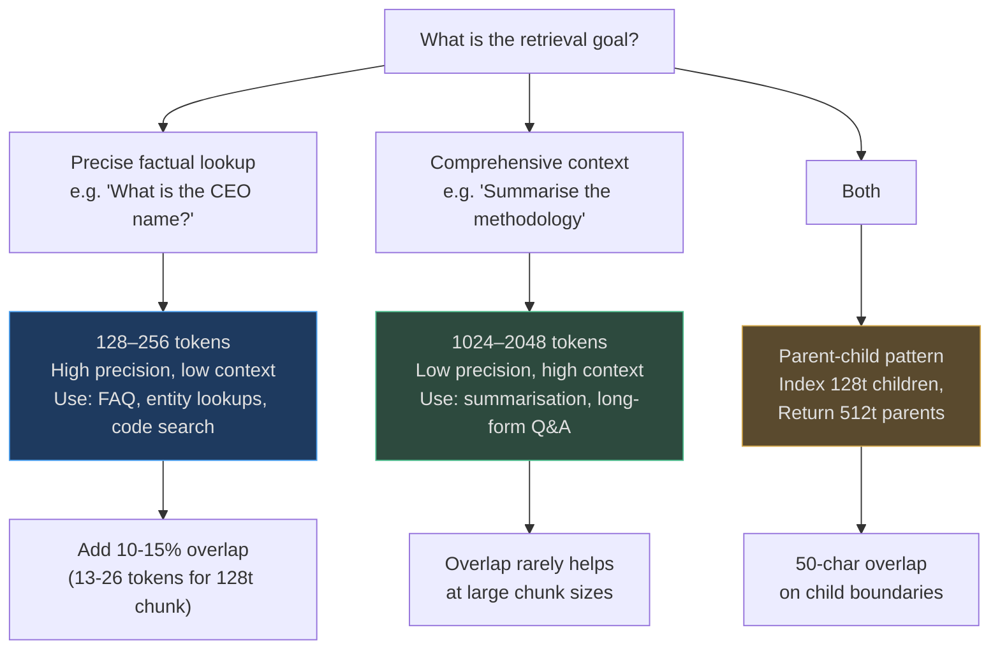
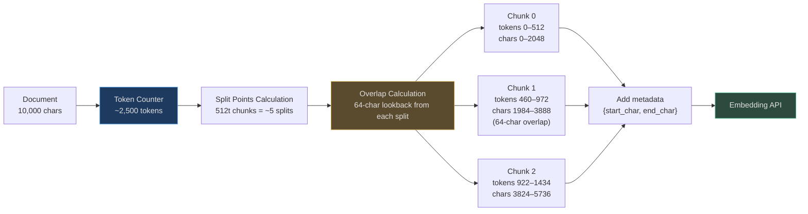

# Fixed and Token-Aware Chunking

The simplest family of chunking strategies: split a document at regular intervals.
No language awareness, no structure detection — just arithmetic on character or token counts.

Used as **fallback strategies** and for **uniform-density content** where every token
carries equal information density. Misused everywhere else.

---

## Fixed Character Chunking

Split at exactly N characters with an overlap of W characters. The `SemanticChunker`
in `rag/chunker.py` supports this as its `'fixed'` source_type mode.

### How It Works

```
Document: "The quick brown fox jumped over the lazy dog. It ran away quickly..."
max_chars=20, overlap_chars=5

Chunk 0: "The quick brown fox "   (chars 0–20)
Chunk 1: "ox jumped over the l"   (chars 15–35, 5-char overlap)
Chunk 2: "he lazy dog. It ran "   (chars 30–50)
Chunk 3: "an away quickly..."     (chars 45–end)
```

The `overlap_chars` parameter creates a sliding window that ensures no information is
silently dropped at a boundary. Without overlap, a key phrase like "increased by 23%"
that spans two chunks produces two low-quality embeddings — neither captures the
complete fact.

### Implementation

<!-- Sources: app/rag/chunker.py:35-95 -->

```python
# app/rag/chunker.py — SemanticChunker (rag implementation)
class SemanticChunker:
    def __init__(
        self,
        max_chars: int = 512,
        overlap_chars: int = 64,    # ~12% overlap — typical sweet spot
        min_chunk_chars: int = 50,  # discard stubs shorter than 50 chars
    ) -> None: ...
```

The RAG `SemanticChunker` differs from the ingestion `SemanticChunker`. The ingestion
version (`app/ingestion/chunkers/semantic.py`) uses `max_chunk_tokens * 4` (4 chars/token)
as its character limit and does **not** apply an overlap — it uses semantic paragraph
boundaries instead. The RAG version adds explicit overlap and a minimum chunk size guard.

---

## Token-Aware Chunking

Fixed chunking in **token space** instead of character space. Critical for content that
will be placed into an LLM context window, where token budget is the constraint.

### Why Characters ≠ Tokens

| Content Type | Avg chars/token |
|---|---|
| English prose | 3.5–4.5 |
| Python code | 2.5–3.5 (keywords, indentation) |
| JSON/XML | 2.0–3.0 (structural chars) |
| CJK text (Chinese/Japanese) | 1.0–1.5 (one token per character often) |

The ingestion `SemanticChunker` uses a fixed approximation:

<!-- Sources: app/ingestion/chunkers/semantic.py:4-7 -->

```python
# app/ingestion/chunkers/semantic.py
_CHARS_PER_TOKEN = 4

class SemanticChunker(ChunkerBase):
    def __init__(self, max_chunk_tokens: int = 512) -> None:
        self._max_chars = max_chunk_tokens * _CHARS_PER_TOKEN  # 512 * 4 = 2048 chars
```

This heuristic works well for English prose but underestimates token count for code
(where `async def get_user_by_id(user_id: UUID) -> Optional[User]:` is ~14 tokens for
~45 characters — a 3.2 chars/token ratio). For precise token counting, integrate
`tiktoken` before the chunker.

### Chunk Size Decision Guide



---

## The Overlap Problem

### Why Overlap Exists

When chunking at character boundaries, a sentence like:
```
...increased EBITDA by 23% year-over-year, driven primarily by cost reductions...
```
can be split as:
```
Chunk 4: "...increased EBITDA by 23% year-ov"
Chunk 5: "er-year, driven primarily by cost r"
```

Both chunks embed an incomplete phrase. A query for "EBITDA growth percentage" retrieves
neither chunk reliably because neither chunk contains "EBITDA" near a complete number.

### The Sweet Spot: 10–20% Overlap

| Chunk Size | Optimal Overlap | Reasoning |
|---|---|---|
| 128 tokens | 13–26 tokens | Enough to capture most two-sentence facts |
| 256 tokens | 26–52 tokens | Standard for technical docs |
| 512 tokens | 50–100 tokens | The `rag/chunker.py` default is 64 chars (~16 tokens) |
| 1024+ tokens | ≤5% | Large chunks already contain full context; overlap adds noise |

**Over-overlapping is wasteful.** At 50% overlap, you double your chunk count and
embedding cost with diminishing quality return. The sweet spot is confirmed empirically
at 10–20% for most English prose.

### Overlap in the Ingestion vs RAG Implementations

| Chunker | File | Overlap |
|---|---|---|
| `SemanticChunker` (ingestion) | `app/ingestion/chunkers/semantic.py` | None — uses semantic boundaries instead |
| `SemanticChunker` (rag) | `app/rag/chunker.py` | 64 chars (`overlap_chars` configurable) |
| `ParentChildChunker` | `app/rag/parent_child_chunker.py` | 50 chars (`child_overlap`) on child boundaries |

---

## When to Use Fixed/Token Chunking

| Use Fixed/Token When | Avoid Fixed/Token When |
|---|---|
| Content has uniform density (news articles, wiki prose) | Document has structure (headings, code, tables) |
| You need a deterministic, reproducible chunking | Semantic coherence is critical (legal clauses, medical records) |
| You're building a baseline before optimizing | You care about embedding cost (semantic boundaries produce fewer, better chunks) |
| Legacy document archive with no structural metadata | The document has AST-parsable syntax (source code) |

---

## Real-World Example 1: Wikipedia Article

**Document:** "History of the Internet" Wikipedia article (8,200 words, ~11,000 tokens)

```
Strategy: fixed token (512 tokens, 50-token overlap)
Chunks produced: ~22 chunks
Processing time: <1ms
Embedding calls: 22

Query: "When was the first email sent?"
Chunk 8 (tokens 3584–4096): "...Ray Tomlinson sent the first email in 1971..."
Retrieval: Chunk 8, cosine similarity 0.92 ✓

Query: "What protocol did ARPANET use?"
Failure case: "TCP/IP" split across Chunk 11 boundary
Chunk 11: "...the network adopted TCP/IP\n"
Chunk 12: "in 1983, replacing NCP..."
Result: Both returned, but Chunk 12 without "adopted" is confusing ✗
Fix: Add 100-token overlap or switch to semantic chunking
```

---

## Real-World Example 2: Uniform Log Files

**Document:** Server access log, 50,000 lines, 2MB

```
Strategy: fixed character (2048 chars, no overlap)
Rationale: Each line is independent; no cross-line context
Chunks produced: ~1000 chunks
Processing time: 2ms

Query: "GET /api/users 500 errors from 10.0.0.1"
Retrieval: Exact line match in Chunk 347 ✓

This is the correct choice. Semantic chunking would merge log lines
into paragraph-like units that make the boundaries arbitrary anyway.
Fixed chunking is optimal for row-oriented, independent-entry content.
```

---

## Mermaid: Token-Aware Chunking Pipeline



---

## Latency and Cost

| Operation | Time | Notes |
|---|---|---|
| Character split (10K chars) | <0.1ms | Pure Python string operations |
| Token count heuristic (×4) | <0.1ms | No tiktoken required; ±15% accuracy |
| Exact tiktoken count | ~1ms per 10K chars | Requires `tiktoken` library |
| Overlap calculation | <0.1ms | Slice operation |
| **Total per document** | **<1ms** | Fixed chunking is the fastest strategy |

At 1M documents/day, fixed chunking consumes **<17 CPU-minutes** for the chunking step
itself. Embedding calls dominate: at 20 chunks/document, that is 20M embedding calls/day.

---

## Failure Modes

| Failure | Trigger | Example | Consequence |
|---|---|---|---|
| Mid-sentence split | Short sentence near boundary | "Revenue grew 23%.\nN" + "et income..." | Two low-quality embeddings |
| Mid-codeblock split | Code in markdown chunked by chars | `def f` in chunk N, `unc():` in N+1 | Code search returns broken function |
| Mid-table split | CSV chunked by chars | Header in chunk 0, no header in chunk 1 | Column meaning lost for row chunks |
| Semantic fragmentation | Dense technical text | 512-token chunk contains 3 unrelated paragraphs | Embedding averages over 3 topics, retrieval noise |

**When fixed chunking fails, switch to semantic or heading.** Do not increase chunk size
as a workaround — larger fixed chunks degrade precision without fixing the boundary problem.
