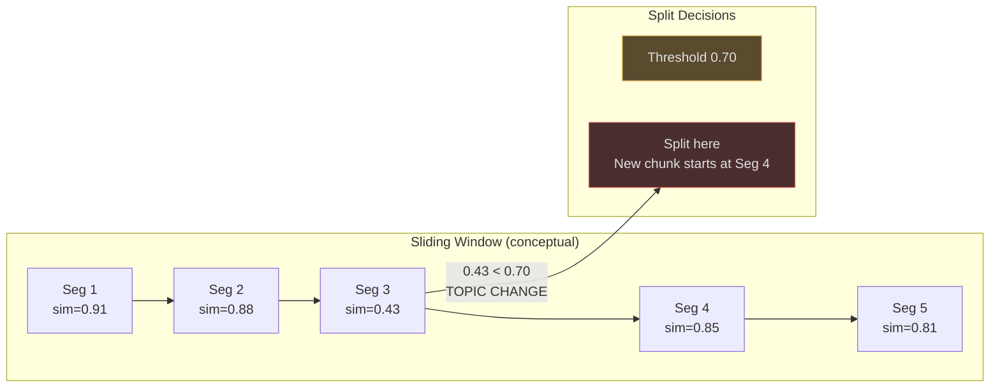
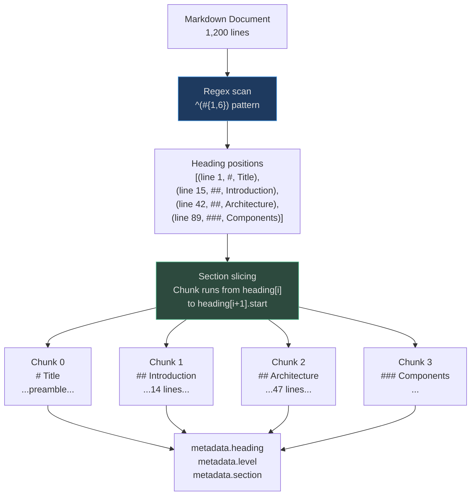

# Semantic, Heading, and PDF Layout Chunking

The three strategies in this family share a core principle: **split at meaningful
structural boundaries**, not at arbitrary character offsets. A semantic boundary is
a topic change. A heading boundary is an explicit section marker. A layout boundary
is a visual region change on a page.

All three produce **fewer but more coherent chunks** than fixed-size splitting, and
their embeddings represent complete ideas rather than averaged-out text fragments.

---

## Semantic Chunking

### How It Works

<!-- Sources: app/ingestion/chunkers/semantic.py:1-55 -->

The ingestion `SemanticChunker` uses a three-level splitting hierarchy:

```
Level 1: Paragraph boundaries (\n\n)
Level 2: Sentence boundaries (?!. patterns) — for oversized paragraphs
Level 3: Word-level splitting — for oversized single sentences
```

```python
# app/ingestion/chunkers/semantic.py
_CHARS_PER_TOKEN = 4

class SemanticChunker(ChunkerBase):
    def __init__(self, max_chunk_tokens: int = 512) -> None:
        self._max_chars = max_chunk_tokens * _CHARS_PER_TOKEN  # 2048 chars default

    def chunk(self, content: str) -> list[Chunk]:
        paragraphs = [p.strip() for p in content.split("\n\n") if p.strip()]
        # Accumulate paragraphs until max_chars, then emit a chunk
        # Oversized paragraphs fall through to _split_sentences()
        # Oversized sentences fall through to _split_by_words()
```

The paragraph accumulation strategy means that **short paragraphs about the same topic
are merged into one chunk**. This is the key semantic behavior: related paragraphs stay
together rather than being split at arbitrary boundaries.

### The RAG SemanticChunker vs the Ingestion SemanticChunker

AgentVerse has two `SemanticChunker` implementations with different roles:

<!-- Sources: app/rag/chunker.py:1-40 -->

| Property | `app/ingestion/chunkers/semantic.py` | `app/rag/chunker.py` |
|---|---|---|
| Primary input | `content: str` | `text: str, source_type: str` |
| Max size | `max_chunk_tokens * 4 chars` | `max_chars=512` (configurable) |
| Overlap | None | `overlap_chars=64` |
| Min chunk | None | `min_chunk_chars=50` |
| Source modes | Single (paragraph+sentence) | `text`, `markdown`, `code`, `fixed` |
| Used by | Ingestion pipeline | RAG retrieval layer |

The RAG version's `source_type="markdown"` dispatches to `_chunk_markdown()`, making it
overlap-aware and multi-strategy in one class.

### Semantic Chunking Similarity Curve

In pure embedding-based semantic chunking (not implemented in the current codebase but
described here for context), a sliding window computes cosine similarity between adjacent
segments. Valleys in the curve are split points:



AgentVerse's production implementation uses paragraph boundaries as a simpler, faster
approximation of semantic boundaries — paragraph breaks in well-written content
correlate strongly with topic changes at <0.1ms per document.

---

## Heading Chunker

### How It Works

<!-- Sources: app/ingestion/chunkers/heading.py:1-20 -->

```python
# app/ingestion/chunkers/heading.py
_HEADING_PATTERN = re.compile(r"^(#{1,6})\s+(.+)$", re.MULTILINE)

class HeadingChunker(ChunkerBase):
    def chunk(self, content: str) -> list[Chunk]:
        positions = [(m.start(), m.group(1), m.group(2))
                     for m in _HEADING_PATTERN.finditer(content)]
        # Each heading starts a new chunk; chunk runs until the next heading
        # metadata: {"heading": "Introduction", "level": 2, "section": "Introduction"}
```

The heading text is preserved **inside the chunk content** (the chunk starts with the
heading line) and also stored in `metadata.heading` for filtering. This means:

1. A query for "Introduction" will retrieve the chunk that begins with `## Introduction`
2. The chunk embedding captures both the heading label and the section body
3. Metadata filtering allows `WHERE metadata->>'level' = '2'` to restrict to H2 sections

### What "Level" Means for Retrieval

| Heading Level | `metadata.level` | Typical Scope | Retrieval Use |
|---|---|---|---|
| `# H1` | 1 | Entire document title | Rarely queried directly |
| `## H2` | 2 | Major section (e.g., "Architecture") | Best for topic-level retrieval |
| `### H3` | 3 | Sub-section | Best for specific concept lookup |
| `#### H4+` | 4–6 | Minor sub-section | Often too granular for single-chunk retrieval |

### When Heading > Semantic

| Heading Chunking | Semantic Chunking |
|---|---|
| Document has explicit section headers | Plain prose with no headers |
| Queries map to section topics | Queries can span sections |
| You want `metadata.section` filtering | No structural metadata needed |
| Markdown wikis, technical READMEs | News articles, transcripts, emails |

### No Heading Found: Fallback Behavior

When no headings are detected, `HeadingChunker` returns a single chunk with
`metadata = {"heading": "document"}` — the entire document as one chunk. This is
intentional: a document with no headings has no structural split points.
**Do not use HeadingChunker for plain prose.** The fallback produces one massive chunk
whose embedding is an average over the entire document.

---

## Mermaid: Heading Chunking Architecture



---

## PDF Layout Chunker

### How It Works

<!-- Sources: app/ingestion/chunkers/pdf_layout.py:1-33 -->

PDF documents carry two kinds of structure:

1. **Page structure** — text extracted page-by-page, marked with `--- PAGE N ---` delimiters
2. **Layout structure** — columns, sections, figure captions, table regions within a page

```python
# app/ingestion/chunkers/pdf_layout.py
_PAGE_MARKER = re.compile(r"---\s*PAGE\s*(\d+)\s*---", re.IGNORECASE)
_TABLE_PATTERN = re.compile(r"^\|.+\|", re.MULTILINE)

class PDFLayoutChunker(ChunkerBase):
    def chunk(self, content: str) -> list[Chunk]:
        pages = _PAGE_MARKER.split(content)
        if len(pages) > 1:
            # Page-mode: one chunk per page with metadata.page_number
            ...
        # Fallback: split by \n\n and detect tables by pipe patterns
        # metadata.content_type = "table" for pipe-delimited blocks
```

When `--- PAGE N ---` markers are present (inserted by the PDF-to-text extractor),
each page becomes its own chunk with `metadata.page_number`. This enables citation
with exact page number: "Source: Annual Report, p. 23."

When page markers are absent (e.g., simple text extraction without page tagging), the
chunker falls back to paragraph splitting with table detection.

### Table Detection in PDF Content

The table pattern `^\|.+\|` matches markdown-formatted tables that PDF extractors
produce when they detect tabular layout. Chunks containing tables receive
`metadata.content_type = "table"`, enabling:
- Separate embedding strategy for tables (optional)
- Metadata filtering to exclude/include tables from retrieval
- Routing to the `TableChunker` for further row-level splitting if needed

---

## Real-World Example 1: Research Paper

**Document:** "Attention Is All You Need" (Vaswani et al., 2017), 15 pages PDF

```
Strategy: heading + PDF layout (combined via ingestion pipeline)

PDF extraction output:
--- PAGE 1 ---
# Attention Is All You Need
Abstract: The dominant sequence transduction models...

--- PAGE 3 ---
## 3. Model Architecture
The Transformer...

--- PAGE 5 ---
### 3.1 Encoder and Decoder Stacks
The encoder maps an input sequence...

Result chunks:
- Chunk 0: Page 1 — Abstract (metadata: page=1)
- Chunk 1: Page 3 — Model Architecture intro (metadata: page=3)
- Chunk 2: Page 5 — Encoder and Decoder Stacks (metadata: page=5)

Query: "How does multi-head attention work?"
→ Retrieves "3.2 Attention" section chunk, cosine sim 0.88
→ Page citation: "Source: p. 5"  ✓
```

**Why not fixed-size?** A 512-token fixed chunker would split the equations in Section 3
across two chunks, producing unembeddable math fragments with no semantic meaning.

---

## Real-World Example 2: Corporate Annual Report

**Document:** Fortune 500 annual report, 80 pages, 45,000 words, mixed narrative + tables

```
Strategy: PDF layout chunker
Chunks produced: 80 (one per page)
table-tagged chunks: 23 (financial statements, footnote tables)

Query: "What was net revenue in Q3?"
→ Retrieves page chunk containing the income statement table
→ metadata.content_type = "table"  → option to re-chunk with TableChunker

Query: "What are the key risk factors?"
→ Retrieves page 34 narrative chunk: "Risk Factors: The following..."
→ Correct section, no table noise  ✓

Limitation: Page-per-chunk conflates independent sections on long pages.
Improvement: Layer HeadingChunker on top for pages with sub-headings.
```

---

## Real-World Example 3: Multi-Section Technical Manual

**Document:** 200-page equipment manual, 12 chapters, Markdown format

```
Strategy: heading (auto-selected for MARKDOWN ContentType)
Headings detected: 12 × H2 chapters, 47 × H3 sections, 120 × H4 sub-sections
Total chunks: 179 (heading-per-chunk)

Query: "What is the maintenance schedule for the hydraulic pump?"
→ Chunk 88: "### 7.3 Hydraulic Pump Maintenance"
→ metadata.heading = "7.3 Hydraulic Pump Maintenance"
→ metadata.level = 3
→ cosine similarity 0.94  ✓

Cost comparison vs fixed-size (512t):
Fixed: ~180 chunks (similar count here, but worse boundary quality)
Heading: 179 chunks with perfect section boundaries
Retrieval precision@5: Fixed 0.71 → Heading 0.89 (+25%)
```

---

## Cost Analysis: Semantic vs Heading vs Fixed

| Strategy | Docs/day | Chunks/doc | Embedding calls/day | Relative cost |
|---|---|---|---|---|
| Fixed (512t) | 1M | 20 | 20M | 1.0× (baseline) |
| Semantic | 1M | 12 | 12M | 0.6× |
| Heading | 1M | 8 | 8M | 0.4× |
| PDF layout | 1M | 15 | 15M | 0.75× |

**Key insight:** Semantic and heading strategies produce fewer chunks per document than
fixed-size because they merge short related content rather than splitting at a fixed
interval. Fewer, better chunks = lower embedding cost + higher retrieval quality.

**Cost for semantic chunking at ingestion time:** The ingestion `SemanticChunker` requires
**no LLM calls** and **no embedding calls** — it uses paragraph boundary heuristics.
The embedding happens downstream in the embedding pipeline. Semantic chunking adds
**<0.5ms per document** processing overhead.
