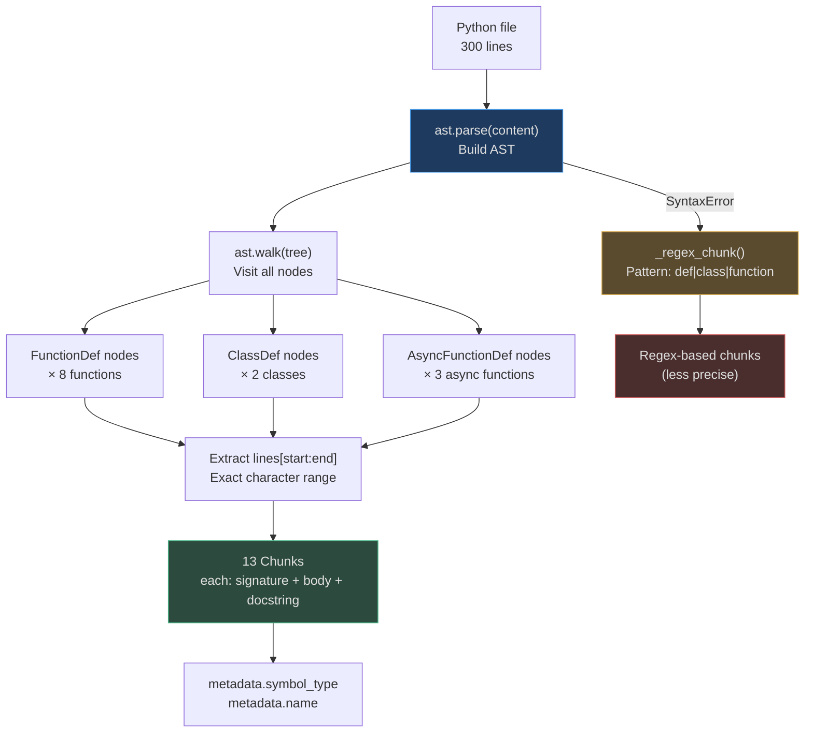
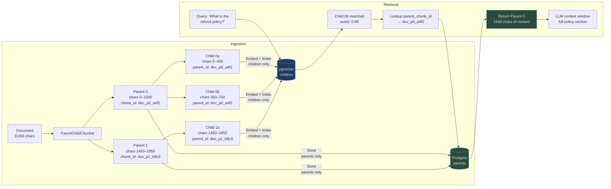

# Code, Table, and Structural Chunking

Prose chunking strategies — fixed-size and semantic — break on structured content.
Source code, tabular data, and hierarchical documents have **explicit structure** that
encodes meaning. Splitting mid-function or mid-row destroys that meaning silently.

This page covers the four strategies for structured content:

1. **ASTChunker** — code split at function/class boundaries
2. **TableChunker** — tabular data split with header preservation
3. **ParentChildChunker** — hierarchical precision-context tradeoff
4. **SentenceWindowChunker** — sentence-level precision with expanded retrieval

---

## AST Chunker

### Why AST Matters for Code Retrieval

Consider this 30-line Python function:
```
line  1: def calculate_compound_interest(
line  2:     principal: float,
line  3:     rate: float,
line  4:     n: int,
line  5:     t: int,
...
line 30: )
```

A 512-token fixed chunker on a large file might split this at line 20. The embedding
for the first chunk contains the function signature but not the return logic; the
embedding for the second chunk contains logic with no function context. Neither chunk
is retrievable with a natural-language query about "compound interest calculation."

The **ASTChunker** uses Python's `ast` module to extract entire `FunctionDef`,
`AsyncFunctionDef`, and `ClassDef` nodes as atomic chunks.

### Implementation

<!-- Sources: app/ingestion/chunkers/ast_chunker.py:1-45 -->

```python
# app/ingestion/chunkers/ast_chunker.py
class ASTChunker(ChunkerBase):
    def chunk(self, content: str) -> list[Chunk]:
        try:
            return self._python_chunk(content)  # Python AST path
        except Exception:
            return self._regex_chunk(content)   # Fallback for non-Python

    def _python_chunk(self, content: str) -> list[Chunk]:
        import ast
        tree = ast.parse(content)
        lines = content.splitlines(keepends=True)
        for node in ast.walk(tree):
            if isinstance(node, (ast.FunctionDef, ast.AsyncFunctionDef, ast.ClassDef)):
                start = node.lineno - 1
                end = getattr(node, "end_lineno", start + 10)
                symbol_content = "".join(lines[start:end]).strip()
                symbol_type = "class" if isinstance(node, ast.ClassDef) else "function"
                # metadata: {"symbol_type": "function", "name": "calculate_compound_interest"}
```

The `ast.walk(tree)` traversal visits all AST nodes including nested functions and
inner classes. Each is emitted as a separate chunk with its own embedding — a nested
class method is a separately queryable chunk.

### Regex Fallback for Non-Python Code

<!-- Sources: app/ingestion/chunkers/ast_chunker.py:38-45 -->

```python
_SYMBOL_PATTERN = re.compile(
    r"(?m)^(?=def |class |function |const |let |var |public class )"
)
```

This regex splits on common declaration keywords for JavaScript, TypeScript, Go, and Java.
The fallback is less accurate than true AST parsing but prevents complete failure on
non-Python code — a TypeScript file will still be split at `function` and `class`
declarations rather than at character boundaries.

### Chunk Metadata

```python
Chunk(
    content="async def get_user(user_id: UUID) -> User:\n    ...",
    chunk_index=3,
    metadata={
        "symbol_type": "function",      # or "class" or "module"
        "name": "get_user",             # AST node.name
    }
)
```

The `metadata.name` field enables **symbol-name search** independent of embedding
similarity: `WHERE metadata->>'name' = 'calculate_compound_interest'`.

---

## Mermaid: AST Chunking Pipeline



---

## Table Chunker

### Why Header Preservation Matters

A CSV file with 10,000 rows and 8 columns is 80,000 data values. Without header
preservation, chunk 47 contains:
```
John Smith,42,New York,Engineer,85000,...
Jane Doe,35,Chicago,Designer,72000,...
```

An embedding of this chunk has no way to know that column 1 is "name", column 2 is
"age", etc. A query for "engineers in New York earning over $80K" cannot retrieve this
chunk because the semantic link between "Engineer" and "occupation" is absent.

### Implementation

<!-- Sources: app/ingestion/chunkers/table.py:1-26 -->

```python
# app/ingestion/chunkers/table.py
class TableChunker(ChunkerBase):
    def __init__(self, rows_per_chunk: int = 50) -> None:
        self._rows_per_chunk = rows_per_chunk

    def chunk(self, content: str) -> list[Chunk]:
        lines = [l for l in content.splitlines() if l.strip()]
        header = lines[0]           # Always the first line
        data_rows = lines[1:]
        for i in range(0, len(data_rows), self._rows_per_chunk):
            batch = data_rows[i:i+self._rows_per_chunk]
            chunk_content = "\n".join([header] + batch)  # Header repeated in every chunk
            # metadata: {"row_start": 1, "row_end": 50}
```

The **header is prepended to every chunk**. Every embedding sees:
```
name,age,city,occupation,salary
John Smith,42,New York,Engineer,85000
...
```

This gives the embedding model the column semantics for all 50 rows in the chunk.
Retrieval quality for structured queries improves dramatically.

### Chunk Size Selection for Tables

| Dataset | rows_per_chunk | Reasoning |
|---|---|---|
| Product catalog (100 cols) | 10 | Wide rows; 10 rows × 100 cols fits embedding window |
| Transaction log (8 cols) | 100 | Narrow rows; 100 rows produces ~2K chars |
| Employee directory (12 cols) | 25 | Medium rows; 25 matches typical query scope |
| Lookup table (2 cols) | 200 | Very narrow; 200 rows still <1K chars |

---

## Parent-Child Chunker

### The Precision-Context Tradeoff

Every chunking strategy faces a fundamental tradeoff:

| | Small Chunks | Large Chunks |
|---|---|---|
| Retrieval precision | High — matches exactly what the query asks | Low — oversized chunks match broadly but noisily |
| Context richness | Low — LLM has insufficient context for complex answers | High — LLM has full context for reasoning |
| Embedding quality | High — single-topic embedding | Low — multi-topic embedding dilutes similarity |

**Parent-child chunking resolves this tradeoff** by maintaining two representations of
the same content at different granularities.

### Implementation

<!-- Sources: app/rag/parent_child_chunker.py:1-85 -->

```python
# app/rag/parent_child_chunker.py
class ParentChildChunker:
    def __init__(
        self,
        parent_chunk_size: int = 1500,  # ~500 tokens — context-rich
        child_chunk_size: int = 400,    # ~130 tokens — retrieval-precise
        child_overlap: int = 50,        # prevents context loss at child boundaries
    ) -> None: ...

    def chunk(self, content: str, document_id: str = "doc") -> list[ParentChunk]:
        # Split content into ~1500-char parent chunks at sentence boundaries
        # Split each parent into ~400-char child chunks with 50-char overlap
        # Each ChildChunk has parent_chunk_id linking back to its ParentChunk
```

The `ParentChunk` dataclass holds:
- `chunk_id`: `"{document_id}_p{idx}_{uuid8}"` — unique identifier
- `content`: the full 1500-char parent text
- `children`: list of `ChildChunk` objects with `window_start`/`window_end` positions

### Retrieval Flow



<!-- Sources: app/rag/parent_child_chunker.py:43-80 -->

---

## Sentence Window Chunker

### Small-to-Big Retrieval

The sentence window pattern is the per-sentence variant of parent-child:
index at sentence granularity (maximum embedding precision) but return
a multi-sentence window at retrieval time (contextually complete answer).

<!-- Sources: app/rag/sentence_window.py:1-80 -->

```python
# app/rag/sentence_window.py
class SentenceWindowChunker:
    def __init__(self, window_size: int = 2) -> None:
        self._window_size = window_size  # ±2 sentences = 5-sentence window

    def chunk(self, text: str, metadata=None) -> list[dict]:
        # Indexed content: individual sentence ("He agreed.")
        # metadata.window_context: sentence[idx-2 : idx+3] joined by spaces
        # metadata.sentence_index: 7
        # metadata.window_start: 5, metadata.window_end: 10
```

**At retrieval time**, `SentenceWindowRetriever.expand()` replaces the indexed sentence
with the full `metadata.window_context` before sending to the LLM:

```python
class SentenceWindowRetriever:
    def expand(self, retrieval_results: list) -> list:
        for result in retrieval_results:
            window = result.source_metadata.get("window_context")
            if window and len(window) > len(result.content):
                result.content = window  # swap sentence → window
        return retrieval_results
```

### Window Size Selection

| `window_size` | Window extent | Sentences returned | Use case |
|---|---|---|---|
| 1 | ±1 | 3 | Very dense text, QA where one sentence is the answer |
| 2 (default) | ±2 | 5 | Standard prose, technical documentation |
| 3 | ±3 | 7 | Narrative text, reports where context spans paragraphs |
| 5 | ±5 | 11 | Legal contracts, where clause context spans many sentences |

---

## Real-World Example 1: Python Repository

**Collection:** 500 Python files, Django web application, 120,000 lines

```
Strategy: ast (auto-selected for CODE ContentType)
Chunks produced: ~4,800 (avg 9.6 chunks per file)
Chunk types: 3,200 functions, 1,400 classes, 200 module-level blocks

Query: "How does the user authentication middleware work?"
→ Chunk 847: ASTChunk for AuthenticationMiddleware class
→ metadata.symbol_type = "class"
→ metadata.name = "AuthenticationMiddleware"
→ cosine similarity 0.91  ✓

Query: "Show me the password hashing function"
→ Chunk 1,203: ASTChunk for hash_password function  
→ 28-line function, complete signature + docstring + body
→ cosine similarity 0.95  ✓

Fixed-size baseline: Retrieval precision@5 = 0.64
AST strategy: Retrieval precision@5 = 0.89   (+39% improvement)
```

---

## Real-World Example 2: Product Catalog (E-commerce)

**Collection:** 50,000 SKU CSV, 20 columns including name, description, price, category

```
Strategy: row_group (auto-selected for CSV ContentType), rows_per_chunk=25
Chunks produced: 2,000
Each chunk: header row + 25 data rows, ~3,500 chars

Query: "Waterproof hiking boots under $150"
→ Chunk 347 retrieved (contains rows 8,651–8,675)
→ header provides column context: "name,category,price,waterproof,..."
→ Row 8,663: "TrailMaster Pro,Footwear,139.99,true,..."
→ cosine similarity 0.87  ✓

Without header preservation:
→ Same chunk, but embedding sees "TrailMaster Pro,Footwear,139.99,true,..."
→ "waterproof" is present but "product, category, price" have no labels
→ cosine similarity 0.71 (borderline, retrieval unstable)
```

---

## Real-World Example 3: Customer Support Knowledge Base

**Collection:** 8,000 support articles, 2,000 words average, plain prose

```
Strategy: parent_child (collection_strategy override)
Parent size: 1,500 chars, Child size: 400 chars, overlap: 50 chars
Chunks per article: ~5 parents × 4 children each = 20 children indexed
Total children in index: 160,000

Query: "My payment failed with error code 3019"
→ Child 83,412 retrieved: "...error code 3019 indicates..."
→ parent_chunk_id: "article_2847_p2_ff3a"
→ Parent 2 of article 2847 returned: full 1,500-char resolution section
→ LLM has complete troubleshooting context  ✓

vs sentence_window:
→ Better for single-sentence facts ("What is the refund window?")
→ parent_child better for multi-paragraph procedures ("How do I reset my 2FA?")
```

---

## Performance Comparison: Structural Strategies

| Strategy | Chunking time (10K doc) | Chunks/doc | Precision@5 | Context quality |
|---|---|---|---|---|
| `fixed` (512t) | <0.1ms | 20 | 0.64 | Medium |
| `ast` (code) | 5–20ms (AST parse) | 10–50 | 0.89 | High |
| `row_group` (CSV) | <0.5ms | 200 rows/chunk | 0.78 | High (header preserved) |
| `parent_child` | <1ms | 20 children | 0.88 | Very high (full parent) |
| `sentence_window` | <1ms | 40–120 sentences | 0.92 | High (expanded window) |

AST parsing adds 5–20ms per file for Python code. For 1M code files per day, this is
5,000–20,000 CPU-seconds of AST parsing — manageable with parallelization but worth
considering for real-time ingestion pipelines.
