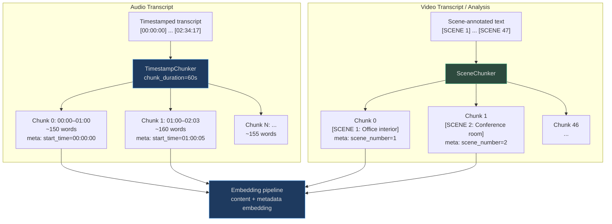
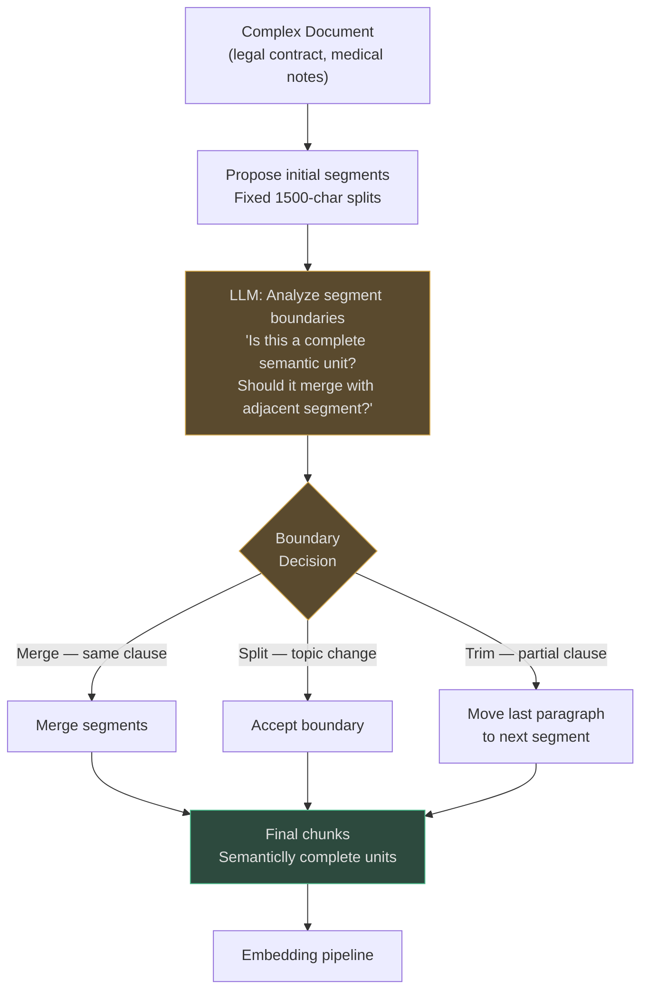
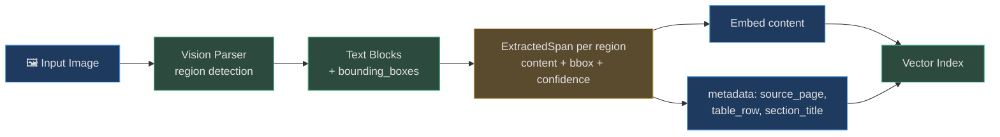
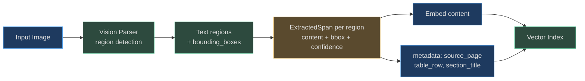

# Specialized Chunking Strategies

Beyond prose and structured documents, AgentVerse handles three more content domains
that require fundamentally different chunking approaches:

- **Temporal media** — audio transcripts and video: time is the primary structure
- **Agentic chunking** — LLM-guided boundary detection for complex documents
- **Late chunking** — full-document embedding with post-hoc chunk slicing

Each specialized strategy carries a higher cost or complexity than the structural
strategies. This page explains when that cost is justified.

---

## Timestamp Chunker

### How It Works

<!-- Sources: app/ingestion/chunkers/timestamp.py:1-38 -->

Audio transcripts from speech-to-text pipelines (Whisper, AssemblyAI, Deepgram)
produce timestamped lines in the format `[HH:MM:SS] speaker: text`:

```
[00:00:00] Host: Welcome to the show.
[00:00:08] Guest: Thank you, glad to be here.
[00:01:02] Host: Let's talk about your new research.
[00:02:15] Guest: Sure. The key finding was...
```

```python
# app/ingestion/chunkers/timestamp.py
_TS_PATTERN = re.compile(r"\[(\d{2}:\d{2}:\d{2})\]")

def _to_seconds(ts: str) -> int:
    h, m, s = ts.split(":")
    return int(h)*3600 + int(m)*60 + int(s)

class TimestampChunker(ChunkerBase):
    def __init__(self, chunk_duration_seconds: int = 60) -> None:
        self._duration = chunk_duration_seconds
    # Accumulates lines until current_time - chunk_start >= 60 seconds
    # metadata: {"start_time": "00:01:02"}
```

The chunker scans timestamp markers and accumulates lines until the accumulated duration
exceeds `chunk_duration_seconds`. When the threshold is reached, the current buffer is
emitted as a chunk and a new buffer starts.

**Fallback when no timestamps found:** If the transcript has no `[HH:MM:SS]` markers,
the chunker falls back to line-per-chunk splitting with `metadata.start_time = "00:00:00"`.

### Chunk Duration Selection

| Use Case | `chunk_duration_seconds` | Reasoning |
|---|---|---|
| Podcast/interview | 60 | ~150 words; one topic per minute is typical |
| News broadcast | 30 | Fast-paced; topics change every 30s |
| Academic lecture | 120 | Dense topics; 2-minute segments reduce fragmentation |
| Meeting recording | 90 | Speaker turns at ~90s average; aligns with diarization |
| Earnings call Q&A | 45 | Each Q&A exchange ~45s; query maps to one exchange |

### Speaker Diarization as Natural Boundaries

When speaker diarization is available (e.g., AssemblyAI's `speaker_labels: true`),
transcripts arrive pre-segmented by speaker turn:

```
[00:05:32] Speaker_A: The Q3 revenue was $2.4 billion, up 18% year-over-year.
[00:05:48] Speaker_B: Can you break that down by segment?
[00:05:52] Speaker_A: Sure. Enterprise was $1.8B, consumer $0.6B.
```

Speaker turn boundaries are stronger semantic splits than fixed-duration boundaries.
Integrating diarization labels into the chunk start condition produces better splits
than duration alone for interview and meeting content.

---

## Scene Chunker

### How It Works

<!-- Sources: app/ingestion/chunkers/scene.py:1-24 -->

Video content processed by scene detection produces transcripts or analysis logs with
`[SCENE N: description]` markers:

```
[SCENE 1: Office interior, daytime]
Characters discuss the quarterly results...

[SCENE 2: Conference room]
The board votes on the acquisition proposal...

[SCENE 3: Exterior, parking lot]
Brief transition shot.
```

```python
# app/ingestion/chunkers/scene.py
_SCENE_PATTERN = re.compile(r"\[SCENE\s+(\d+)(?::\s*([^\]]+))?\]", re.IGNORECASE)

class SceneChunker(ChunkerBase):
    def chunk(self, content: str) -> list[Chunk]:
        # Each [SCENE N] marker starts a new chunk
        # metadata: {"scene_number": 2, "timestamp": "Conference room"}
```

The optional scene description (`[SCENE 2: Conference room]`) is stored in
`metadata.timestamp` — a slight misnomer from the original implementation, but it
preserves the scene context alongside the content.

**Fallback:** When no `[SCENE N]` markers are found, the chunker splits by newline
(one line per chunk with `metadata.scene_number = i+1`).

### Integration with Video Frame Analysis

The `SceneChunker` is the text counterpart to `app/perception/`'s frame analysis
pipeline. A complete video chunk contains:

```python
{
    "content": "[SCENE 3] Characters discuss revenue...",
    "metadata": {
        "scene_number": 3,
        "timestamp": "Conference room",
        "frame_ref": "video_123_frame_0847",  # Added by perception pipeline
        "caption": "Four executives around a table",
    }
}
```

This links the text chunk to the visual representation for multimodal retrieval.

---

## Mermaid: Timestamp and Scene Chunking



---

## Agentic Chunking

### What It Is

Agentic chunking replaces regex and heuristic boundary detection with an **LLM that
reads the document and decides where chunks should begin and end** based on semantic
completeness.

For most content types, regex-based strategies are sufficient and produce good results.
Agentic chunking is reserved for documents where the logical boundaries cannot be
inferred from surface features (headings, timestamps, AST):

- **Legal contracts** — clauses may span multiple paragraphs with no heading markers
- **Medical records** — clinical notes interleave diagnoses, medications, observations
- **Financial filings** — risk factors contain cross-referencing that only context resolves
- **Patent applications** — claims and specifications have complex logical dependencies

### The Pipeline



### Cost Analysis

The LLM boundary analysis adds significant cost per document:

| Strategy | Chunking cost per 10K-word doc | Notes |
|---|---|---|
| Fixed/semantic | ~$0.00 | Pure Python, no LLM |
| Heading/AST | ~$0.00 | Pure Python, no LLM |
| Agentic (boundary analysis) | $0.05–$0.20 | 1–5 LLM calls per document |
| Agentic (full semantic) | $0.20–$0.80 | Multiple passes, larger context windows |

At $0.10/document average, 1M documents/day costs **$100,000/day** for agentic chunking.

**When is agentic worth the cost?**

| Scenario | Verdict |
|---|---|
| Legal contracts ($50K/contract at stake) | ✓ Worth it — 1 bad chunk can misdirect a legal query |
| Medical records (liability for misdiagnosis) | ✓ Worth it — $0.10/record is trivial vs clinical risk |
| General news articles | ✗ Overkill — semantic chunking produces adequate boundaries |
| Product catalog CSV | ✗ Wrong tool — use row_group |
| High-value patents (licensing revenue) | ✓ Worth it — claim boundary errors cost millions |

---

## Late Chunking

### The Problem with Independent Chunk Embeddings

Standard RAG embeds each chunk independently. This creates an embedding accuracy problem
for documents with **anaphora** (pronouns and references):

```
Chunk 4: "The CEO was hired in 2019."
Chunk 5: "She transformed the company culture."
Chunk 6: "Under her leadership, revenue tripled."
```

Chunk 5's embedding encodes "She transformed the company culture" with no information
about who "She" is. A query "What did [CEO name] accomplish?" will not retrieve Chunk 5
because "She" has no anchor to the CEO's name.

### How Late Chunking Solves This

<!-- Sources: app/rag/late_chunker.py:1-55 -->

```python
# app/rag/late_chunker.py
class LateChunker:
    """
    1. chunk_and_embed_with_token_embeddings: True late chunking
       Requires provider with .embed_tokens() — returns per-token embeddings
       Average token embeddings within each chunk boundary
       Each chunk embedding encodes full document context

    2. chunk_and_embed_standard: Fallback
       Embeds each chunk independently (standard RAG)

    is_supported(provider): Returns True only if provider has embed_tokens()
    """
    @staticmethod
    def is_supported(provider: object) -> bool:
        return hasattr(provider, "embed_tokens") and callable(
            getattr(provider, "embed_tokens", None)
        )
```

**True late chunking** requires a provider that exposes **token-level embeddings** —
a single embedding per token, not one embedding per text. This allows:

1. Embed the full document (all 10K tokens) to get 10K token-level embeddings
2. Identify chunk boundaries (from any chunker)
3. Average the token embeddings within each chunk's character range
4. Each chunk embedding is "aware" of the full document context

The chunk for "She transformed the company culture" now has an embedding that
encodes "She = CEO" because the CEO chunk's token embeddings influenced the averaging.

### Provider Support Status

| Provider | `embed_tokens` support | Notes |
|---|---|---|
| Voyage AI (voyage-3) | ✓ Partial | Supports `return_tokens=True` in some endpoints |
| OpenAI text-embedding-3 | ✗ Not supported | Single embedding per text only |
| Cohere Embed v3 | ✗ Not supported | Single embedding per text only |
| Google Gemini Embeddings | ✗ Not supported | Single embedding per text only |
| Self-hosted (jina-embeddings-v3) | ✓ Available | Token embeddings via direct API |

When `LateChunker.is_supported()` returns `False`, `chunk_and_embed()` returns `None`,
and the ingestion pipeline falls back to `chunk_and_embed_standard()` — identical to
standard independent chunk embedding.

---

## Real-World Example 1: Podcast — Earnings Call Transcript

**Document:** Tech company Q3 2025 earnings call, 90 minutes, ~15,000 words

```
Strategy: timestamp (auto-selected for AUDIO ContentType)
chunk_duration_seconds = 45 (Q&A format — analyst questions ~45s each)
Chunks produced: 120 (45-second windows)

Query: "What was the explanation for the margin contraction?"
→ Chunk 58 retrieved: [01:13:15] CFO answers margin question
→ metadata.start_time = "01:13:15"
→ UI can seek to 1:13:15 in the audio  ✓
→ Answer: "...driven by increased R&D headcount of 1,200 engineers..."

Fixed-size baseline (512t): Chunk 58 is split mid-answer; context loss
Timestamp (45s): Complete CFO response in one chunk  ✓
```

---

## Real-World Example 2: Legal Contract — SaaS MSA

**Document:** 80-page Master Service Agreement, 25,000 words, 47 clauses

```
Strategy: agentic (collection_strategy = "agentic")
LLM: Claude Sonnet (boundary analysis mode)
Processing: 8 LLM calls for boundary analysis, 14 calls for clause extraction
Time: 45 seconds per document
Cost: $0.18 per document

Chunks produced: 47 (one per legal clause, semantically complete)

Query: "What are the indemnification obligations?"
→ Chunk 23: "12. INDEMNIFICATION. Each party shall indemnify..."
→ Complete clause, 3 paragraphs, 450 words
→ No clause split across chunks  ✓

vs heading chunking: "12. INDEMNIFICATION" heading found → correct section
vs fixed (512t): Clause 12 split into 3 fragments → ambiguous retrieval

Agentic is justified here: each document is a $200K+ commercial contract.
$0.18 processing cost is negligible. Chunk boundary errors have legal consequences.
```

---

## Real-World Example 3: Video — Board Meeting Recording

**Document:** 3-hour board meeting video, scene-annotated analysis log

```
Strategy: scene (auto-selected for VIDEO ContentType)
Scene markers: [SCENE 1] through [SCENE 34]
Chunks produced: 34

Query: "When did the board discuss the acquisition?"
→ Chunk 19: "[SCENE 19: Boardroom] M&A discussion..."
→ metadata.scene_number = 19
→ metadata.timestamp = "Boardroom"
→ Linked to frame_ref for thumbnail generation  ✓

Chunk 19 combined with frame analysis:
→ "4 board members voting, slide shows $2.4B valuation"
→ Multimodal chunk: text analysis + visual context  ✓
```

---

---

## Image Region Chunking

**When to use:** Ingested images, PDF figures, scanned documents — where text is embedded in a spatial layout and the *location* of content matters as much as the content itself.

### Architecture

Image region chunks are built on `ExtractedSpan` from `app/multimodal/models.py`. Every span produced by the vision parser carries a `bounding_box` field — normalised `{x, y, width, height}` coordinates in the `[0, 1]` range relative to the image dimensions.

```python
# ExtractedSpan with bounding_box — the image region chunk primitive
from app.multimodal.models import ExtractedSpan, Modality

span = ExtractedSpan(
    content="Net revenue for FY 2024: $4.2B (+18% YoY)",
    modality=Modality.IMAGE,
    source_page=12,
    bounding_box={"x": 0.12, "y": 0.44, "width": 0.65, "height": 0.08},
    confidence=0.93,
    metadata={"table_row": 3, "column": "Net Revenue", "section": "Financial Highlights"}
)
```

The `bounding_box` enables:
- **Region-aware citation**: "Table 3, row 5, page 12" instead of just "page 12"
- **Spatial retrieval filtering**: find all chunks in the upper-right quadrant (header region) of a specific page
- **Multimodal grounding**: link retrieved text back to the source image region for visual verification
- **Thumbnail generation**: crop the exact image region for display in citations


<!-- Sources: app/multimodal/models.py:ExtractedSpan -->

### Real-World Example 1 — Financial Earnings Slide Deck

> **Situation**: A fintech agent ingests 80 quarterly earnings PDFs (avg. 35 slides each). Each slide is a complex image with charts, bullet points, and tables. Pure OCR produces unstructured text that loses spatial context.

**Image region chunking produces:**
- Slide 14, header region: "Q4 2024 Revenue by Geography"
- Slide 14, table region (top-left): "Americas: $1.8B (+22%)"
- Slide 14, table region (bottom-right): "APAC: $0.6B (+41%)"
- Slide 14, chart caption: "Bar chart: quarterly trend Jan–Dec 2024"

Agent query: "What was APAC revenue growth in Q4 2024?"
→ Region chunk retrieved with `bounding_box: {x:0.52, y:0.61, width:0.44, height:0.12}`
→ Citation shows exact slide + region thumbnail
→ Answer grounded to visible table cell ✓

### Real-World Example 2 — Medical Imaging Report

> **Situation**: Radiology reports consist of a text narrative + annotated images. The annotations (arrows, labels) on images carry clinical meaning that OCR without region awareness would miss.

- Body region spans: anatomical labels extracted with coordinates
- Annotation spans: doctor's handwritten notes converted to text + position
- Each ExtractedSpan carries `confidence` from the OCR model
- Low-confidence spans (`confidence < 0.7`) flagged for human review

### When to Use Image Region Chunking

| Use case | Recommended? | Notes |
|---|---|---|  
| Scanned PDFs with tables | ✅ Yes | Preserves row/column structure |
| Slide decks | ✅ Yes | Separates header/body/chart regions |
| Annotated diagrams | ✅ Yes | Captures spatial relationships |
| Plain text PDFs | ❌ No | Use `pdf_layout` or `semantic` instead |
| Handwritten forms | ⚠️ Depends | OCR confidence often low; HITL review recommended |

> **Cost note**: Image region chunking requires a vision model call per image (~$0.002–$0.01/image with GPT-4o). At 1M images/day that's $2K–$10K/day — use selectively for high-value visual content.

---

## Image Region Chunking

**When to use:** Ingested images, scanned PDFs, slide decks, annotated diagrams — where the *spatial location* of text is as important as the content itself.

### Architecture

Image region chunks are built on `ExtractedSpan` from `app/multimodal/models.py`. Every span produced by the vision parser carries a `bounding_box` field — normalised `{x, y, width, height}` coordinates in the `[0.0, 1.0]` range.

```python
# ExtractedSpan with bounding_box — the image region chunk primitive
# Source: app/multimodal/models.py:ExtractedSpan
from app.multimodal.models import ExtractedSpan, Modality

span = ExtractedSpan(
    content="Net revenue for FY 2024: $4.2B (+18% YoY)",
    modality=Modality.IMAGE,
    source_page=12,
    bounding_box={"x": 0.12, "y": 0.44, "width": 0.65, "height": 0.08},
    confidence=0.93,
    metadata={"table_row": 3, "column": "Net Revenue", "section": "Financial Highlights"}
)
```

The `bounding_box` enables:
- **Region-aware citation**: "Table 3, row 5, page 12" instead of just "page 12"
- **Spatial filtering**: find all chunks in the header region (y < 0.15) vs. body
- **Visual grounding**: link retrieved text to the source image region for display
- **Thumbnail generation**: crop and render the exact bounding box in citations


<!-- Sources: app/multimodal/models.py:ExtractedSpan.bounding_box -->

### Real-World Example — Earnings Slide Deck

> A fintech agent ingests 80 quarterly PDFs (35 slides each). Slide 14 contains an APAC revenue table.

- Slide 14, header region: `"Q4 2024 Revenue by Geography"` — bbox `{x:0.1, y:0.05, w:0.8, h:0.08}`
- Slide 14, table cell top-left: `"Americas: $1.8B (+22%)"` — bbox `{x:0.1, y:0.3, w:0.4, h:0.07}`
- Slide 14, table cell bottom-right: `"APAC: $0.6B (+41%)"` — bbox `{x:0.52, y:0.61, w:0.38, h:0.07}`

Query: "APAC revenue growth Q4 2024?"
→ Bounding box chunk retrieved, citation shows exact crop of slide 14, row 4 ✓

| Use case | Recommended? | Notes |
|---|---|---|
| Scanned PDFs with tables | ✅ | Preserves row/column structure |
| Slide decks | ✅ | Separates header/body/chart regions |
| Plain text PDFs | ❌ | Use `pdf_layout` or `semantic` instead |
| Handwritten forms | ⚠️ | OCR confidence often low; flag for review |

> **Cost**: Vision model call per image (~$0.002–$0.01/image). At 1M images/day = $2K–$10K/day. Use selectively for high-value visual documents.

---

## Cost Comparison: All Specialized Strategies

| Strategy | LLM cost/doc | Embedding cost/doc | Total cost/1M docs | Best for |
|---|---|---|---|---|
| `timestamp` | $0 | Standard | ~$20K | Podcasts, calls, lectures |
| `scene` | $0 | Standard | ~$20K | Video archives |
| `agentic` | $0.05–$0.80 | Standard | $50K–$800K | Legal, medical, patents |
| `late_chunking` (standard fallback) | $0 | Standard | ~$20K | All prose |
| `late_chunking` (true) | $0 | 10× standard | ~$200K | Pronominal reference-heavy |

For most operations, `timestamp` and `scene` are zero-overhead specialized strategies.
`agentic` is a deliberate cost tradeoff for high-value, semantically complex documents.
`late_chunking` (true) is only worth the 10× embedding cost for corpora with heavy
pronoun and reference chains — clinical notes, legal briefs, technical narratives.
