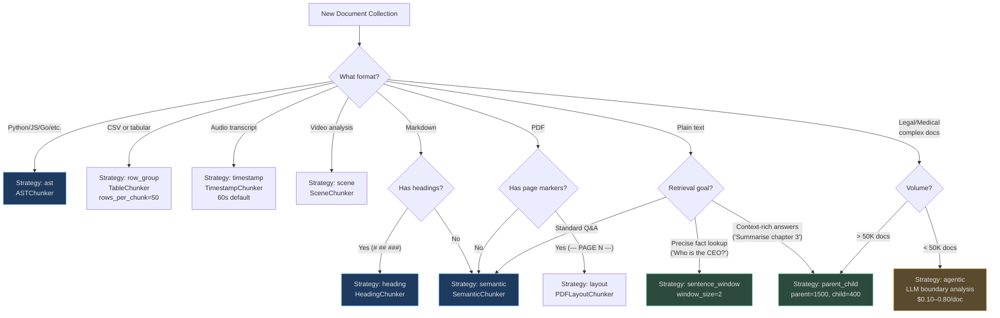

# Strategy Selection Guide

Strategy selection is a two-level decision in AgentVerse:

1. **Automatic** — `ChunkingStrategySelector` maps `ContentType` → strategy for every
   document at ingestion time with zero configuration required
2. **Manual override** — any collection can declare `collection_strategy` to force a
   specific strategy for all documents in that collection

This page covers both levels, plus how to evaluate chunking quality, run A/B tests,
and scale to 1M+ documents per day.

---

## ChunkingStrategySelector: Implementation Detail

<!-- Sources: app/ingestion/chunking_strategy_selector.py:1-50 -->

```python
# app/ingestion/chunking_strategy_selector.py

_STRATEGY_MAP: dict[ContentType, str] = {
    ContentType.TEXT:     "semantic",
    ContentType.MARKDOWN: "heading",
    ContentType.PDF:      "layout",
    ContentType.DOCX:     "paragraph",
    ContentType.HTML:     "dom",
    ContentType.CODE:     "ast",
    ContentType.IMAGE:    "region",
    ContentType.AUDIO:    "timestamp",
    ContentType.VIDEO:    "scene",
    ContentType.CSV:      "row_group",
    ContentType.JSON:     "record",
    ContentType.WEB_PAGE: "dom",
    ContentType.MIXED:    "semantic",
}

_ADVANCED_STRATEGIES: frozenset[str] = frozenset({
    "parent_child", "sentence_window", "fixed", "agentic", "agentic_chunking",
})

class ChunkingStrategySelector:
    def select(self, content_type: ContentType) -> str:
        return _STRATEGY_MAP.get(content_type, "semantic")  # default fallback

    def select_advanced(self, content_type: ContentType, collection_strategy: str | None) -> str:
        if collection_strategy and collection_strategy in _ADVANCED_STRATEGIES:
            return collection_strategy   # Collection override wins
        return self.select(content_type)

    @staticmethod
    def is_advanced(strategy: str) -> bool:
        return strategy in _ADVANCED_STRATEGIES  # Routes to special orchestrator
```

### Two-Level Priority

```
Priority 1: collection_strategy (if set AND in _ADVANCED_STRATEGIES)
Priority 2: _STRATEGY_MAP[content_type]
Priority 3: "semantic" (universal fallback for unknown content types)
```

Note: collection-level overrides only work for **advanced strategies**. You cannot
force `"heading"` as a collection override for a CODE collection — `heading` is not
in `_ADVANCED_STRATEGIES`. To use a non-default standard strategy, you would need to
modify the `_STRATEGY_MAP` or add the strategy to `_ADVANCED_STRATEGIES`.

---

## Decision Tree: Choosing a Strategy



---

## Override Options

### Setting a Collection-Level Strategy

```python
# Creating a collection with parent_child override
collection = await knowledge_store.create_collection(
    name="support_articles",
    collection_strategy="parent_child",   # All docs use parent_child regardless of ContentType
    parent_chunk_size=1500,
    child_chunk_size=400,
)
```

```python
# The selector respects the override
selector = ChunkingStrategySelector()
strategy = selector.select_advanced(
    content_type=ContentType.TEXT,
    collection_strategy="parent_child",   # → returns "parent_child"
)
assert ChunkingStrategySelector.is_advanced(strategy)  # → True → special dispatch
```

### Per-Document Override (Advanced Use)

For documents that need a different strategy within an otherwise uniform collection:

```python
# Override at ingestion time for a specific document
await ingest_document(
    content=code_content,
    content_type=ContentType.CODE,
    strategy_override="ast",   # Force AST even if collection uses parent_child
)
```

---

## Evaluating Chunking Quality

### Metrics

The primary metric for chunking evaluation is **retrieval recall** — the fraction of
relevant documents retrieved in the top-K results for a set of evaluation queries.

| Metric | Formula | Target |
|---|---|---|
| Recall@5 | (Relevant in top 5) / (Total relevant) | > 0.85 |
| Precision@5 | (Relevant in top 5) / 5 | > 0.70 |
| MRR (Mean Reciprocal Rank) | avg(1 / rank of first relevant) | > 0.80 |
| Answer faithfulness | LLM-graded: does the answer follow from retrieved chunks? | > 0.90 |

### Evaluation Procedure

```python
# Evaluation workflow (pseudocode)
eval_questions = [
    ("What was the EBITDA margin?", [chunk_id_42, chunk_id_43]),  # ground truth
    ("How does authentication work?", [chunk_id_201]),
    ...
]

for question, relevant_chunks in eval_questions:
    retrieved = knowledge_store.search(question, top_k=5)
    recall = len(set(retrieved) & set(relevant_chunks)) / len(relevant_chunks)
    precision = len(set(retrieved) & set(relevant_chunks)) / len(retrieved)
```

Create your evaluation set by:
1. Sample 100–200 representative queries for the collection domain
2. Manually identify ground-truth relevant chunks for each query
3. Run retrieval and score against ground truth
4. Compare across chunking strategies by re-chunking and re-embedding the same documents

### Common Combination Strategies

| Primary Chunking | Overlay Pattern | When to Combine |
|---|---|---|
| `semantic` | `sentence_window` | Prose with specific factual queries |
| `heading` | contextual enrichment | Wikis with out-of-context section references |
| `ast` | `parent_child` | Large code files with many small functions |
| `layout` (PDF) | `sentence_window` | Dense academic papers |
| `row_group` | No overlay needed | Tabular data has structure; window adds noise |
| `timestamp` | No overlay needed | Audio is linear; window would merge speakers |

---

## A/B Testing Chunking Strategies

A/B testing chunking requires re-embedding the same documents with a different strategy,
which has a cost. Here is a structured process:

### Step 1: Define the Test

```
Collection: "technical_support_kb" (10,000 articles)
Strategy A: semantic (current production)
Strategy B: parent_child (candidate)
Eval set: 200 queries with ground-truth relevant chunks
Cost of re-embedding: 10,000 docs × 20 chunks × $0.0001 = $20
```

### Step 2: Create Shadow Index

```python
shadow_collection = await knowledge_store.create_collection(
    name="technical_support_kb_b",
    collection_strategy="parent_child",
)
await ingest_documents(docs, collection=shadow_collection)
```

### Step 3: Run Parallel Retrieval

```python
results_a = await collection_a.search(query, top_k=5)
results_b = await shadow_collection.search(query, top_k=5)
```

### Step 4: Evaluate and Decide

```
Strategy A (semantic):  Recall@5 = 0.74, Precision@5 = 0.62
Strategy B (parent_child): Recall@5 = 0.89, Precision@5 = 0.81
Delta: +20% recall, +31% precision
Decision: Migrate to parent_child
```

### Step 5: Migration

Re-ingest production collection with new strategy. The old embedding index remains
until the new one is fully populated and validated.

---

## Real-World Experiment: Medical Literature

**Collection:** 50,000 PubMed abstracts + full-text papers, clinical Q&A chatbot

```
Experiment: Compare chunking strategies on clinical query precision

Baseline (fixed, 512t):
  Precision@5 = 0.61, Recall@5 = 0.72
  Common failure: Method and Results sections mixed in same chunk

Test 1 (heading):
  Precision@5 = 0.77, Recall@5 = 0.83 (+26%)
  Most papers have structured headings (Abstract, Methods, Results, Discussion)
  Heading chunks map cleanly to clinical query types

Test 2 (semantic, paragraph boundaries):
  Precision@5 = 0.71, Recall@5 = 0.79 (+15%)
  Better than fixed but misses section boundaries

Test 3 (parent_child + heading):
  heading for initial split → parent_child for sub-section content
  Precision@5 = 0.84, Recall@5 = 0.91 (+38% vs baseline)
  Best overall: section-level precision + full paragraph context

Decision: Deploy parent_child with heading-based parent boundaries
Annual value: 12,000 clinician queries/day × 38% improvement in accurate retrieval
```

---

## Performance at 1M Documents/Day

### Chunking Processing Budget

At 1M documents/day average document size of 5,000 characters:

| Strategy | Chunking time/doc | Total CPU time/day | Parallelizable |
|---|---|---|---|
| `fixed` | <0.1ms | <100 CPU-seconds | Yes |
| `semantic` | <0.5ms | <500 CPU-seconds | Yes |
| `heading` | <0.5ms | <500 CPU-seconds | Yes |
| `ast` | 5–20ms | 5,000–20,000 CPU-seconds | Yes |
| `row_group` | <0.5ms | <500 CPU-seconds | Yes |
| `timestamp` | <1ms | <1,000 CPU-seconds | Yes |
| `parent_child` | <1ms | <1,000 CPU-seconds | Yes |
| `sentence_window` | <1ms | <1,000 CPU-seconds | Yes |
| `agentic` | 30,000–180,000ms | 8,000–50,000 CPU-hours | LLM-rate-limited |

Chunking is **never the bottleneck** for non-agentic strategies. The bottleneck is
always the embedding API call count — typically 10–20 calls per document.

### How the Selector Parallelizes at Scale

The `ChunkingStrategySelector.select()` is a pure dictionary lookup — O(1), no I/O.
At ingestion time, documents are processed in batches:

```
Ingestion worker receives batch of 1,000 documents
│
├── ContentType detected (parallel) — 1,000 parallel type detections
├── Strategy selected (parallel) — 1,000 O(1) dict lookups
├── Chunking dispatched (parallel) — 1,000 parallel chunk() calls
│   ├── Semantic: 200 docs → SemanticChunker workers
│   ├── AST: 150 docs → ASTChunker workers
│   ├── Heading: 300 docs → HeadingChunker workers
│   └── ...
├── Chunks collected — merge results
└── Embedding batch sent — 1 batch API call per 100 chunks (batching reduces cost)
```

Effective throughput with 8 Celery workers:
- Non-agentic strategies: **800,000–1,200,000 documents/day** per worker pool
- AST chunking (code-heavy repos): **400,000 documents/day** (AST parse overhead)
- Agentic: **10,000–100,000 documents/day** (LLM rate limits)

---

## Full Performance Table

| Strategy | Speed | Memory/doc | Retrieval precision | Best for | Avoid for |
|---|---|---|---|---|---|
| `fixed` | ★★★★★ | Low | ★★★☆☆ | Uniform prose, fallback | Code, tables, structured docs |
| `semantic` | ★★★★★ | Low | ★★★★☆ | Plain text, articles | Markdown with headings |
| `heading` | ★★★★★ | Low | ★★★★★ | Markdown, wikis | Prose without headings |
| `layout` | ★★★★☆ | Low | ★★★★☆ | PDFs with page markers | Unstructured PDF extracts |
| `ast` | ★★★★☆ | Low | ★★★★★ | Source code | Non-code content |
| `row_group` | ★★★★★ | Low | ★★★★☆ | CSV, tabular data | Non-tabular content |
| `timestamp` | ★★★★★ | Low | ★★★★☆ | Audio transcripts | Video without timestamps |
| `scene` | ★★★★★ | Low | ★★★★☆ | Video with scene markers | Unmarked video |
| `parent_child` | ★★★★☆ | Medium | ★★★★★ | Long prose, support KB | Short documents (<500 words) |
| `sentence_window` | ★★★★☆ | Medium | ★★★★★ | Fact lookup in prose | Dense tabular content |
| `agentic` | ★☆☆☆☆ | High (LLM) | ★★★★★ | Legal, medical, patents | High-volume collections |
| `late_chunking` | ★★★☆☆ | High (full embed) | ★★★★★ | Reference-heavy documents | Short documents |
