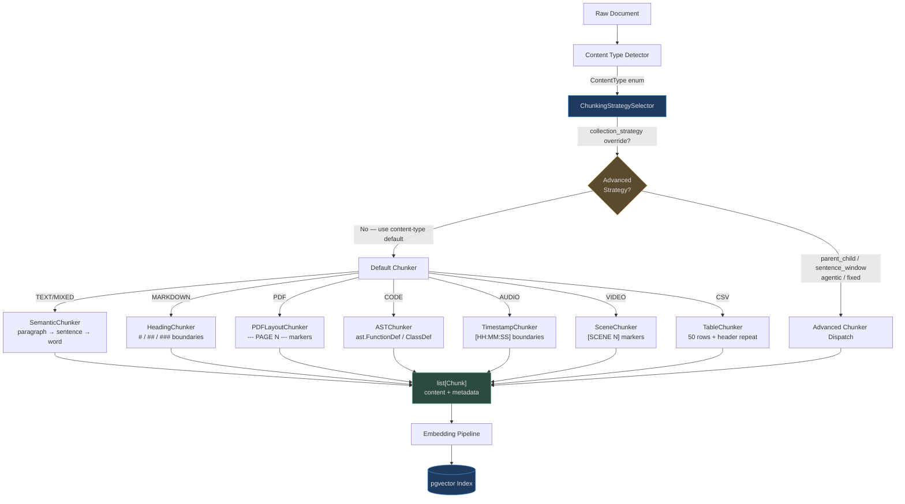

# Chunking Strategies

Chunking is the highest-leverage decision in a RAG pipeline. The right strategy determines
whether your retrieval is surgical or scattershot. A mismatched chunker — fixed-size splitting
on source code, or AST chunking on a legal brief — degrades retrieval quality more than any
model choice or similarity threshold.

AgentVerse ships **15 distinct chunkers** organized into:
- **Content-type defaults** — automatically selected by `ChunkingStrategySelector`
- **Advanced patterns** — `parent_child`, `sentence_window`, `fixed`, `agentic` — overridable
  at the collection level

---

## Why Chunking Strategy Matters

| Decision | Impact |
|---|---|
| Chunk too large | Low retrieval precision; LLM receives irrelevant context |
| Chunk too small | Loss of context; pronouns and references lose their antecedents |
| Mid-sentence boundary | Embedding represents an incomplete thought; retrieval degrades |
| Mid-table boundary | Header is missing from data row chunks; semantic search fails |
| AST-unaware code split | Function signature split from body; code search fails |

An **improper chunk boundary** embeds an incomplete semantic unit. The embedding model
cannot compensate for a `Chunk` whose `content` field ends mid-thought. The defect is
**silent** — the embedding and indexing pipeline succeeds, but retrieval quality is quietly
degraded.

---

## All Strategies: Comparison Table

<!-- Sources: app/ingestion/chunking_strategy_selector.py:4-20 -->

| # | Strategy | Class | Content Type | Avg Chunk | Overlap | Complexity | LLM Cost |
|---|---|---|---|---|---|---|---|
| 1 | `semantic` | `SemanticChunker` | TEXT, MIXED | 512 tokens | None | Low | None |
| 2 | `heading` | `HeadingChunker` | MARKDOWN | Per section | None | Low | None |
| 3 | `layout` | `PDFLayoutChunker` | PDF | Per page/region | None | Low | None |
| 4 | `paragraph` | `ParagraphChunker` | DOCX | Per paragraph | None | Low | None |
| 5 | `dom` | `DOMChunker` | HTML, WEB_PAGE | Per DOM block | None | Low | None |
| 6 | `ast` | `ASTChunker` | CODE | Per function/class | None | Medium | None |
| 7 | `region` | `RegionChunker` | IMAGE | Per bounding box | None | Medium | None |
| 8 | `timestamp` | `TimestampChunker` | AUDIO | 60s duration | None | Low | None |
| 9 | `scene` | `SceneChunker` | VIDEO | Per scene | None | Low | None |
| 10 | `row_group` | `TableChunker` | CSV | 50 rows | None | Low | None |
| 11 | `record` | `RecordChunker` | JSON | Per record | None | Low | None |
| 12 | `parent_child` | `ParentChildChunker` | Any | P:1500 / C:400 chars | 50 chars | High | None |
| 13 | `sentence_window` | `SentenceWindowChunker` | Any prose | Per sentence | ±2 sentences | Medium | None |
| 14 | `fixed` | `SemanticChunker(fixed)` | Any (fallback) | Configurable | Configurable | Low | None |
| 15 | `agentic` | LLM-dispatched | Any complex doc | Semantic boundaries | None | Very High | Medium |

---

## Architecture: Document → Chunks → Index



<!-- Sources: app/ingestion/chunking_strategy_selector.py:1-50 -->

---

## How `ChunkingStrategySelector` Works

<!-- Sources: app/ingestion/chunking_strategy_selector.py:32-50 -->

```python
# app/ingestion/chunking_strategy_selector.py
class ChunkingStrategySelector:
    def select(self, content_type: ContentType) -> str:
        return _STRATEGY_MAP.get(content_type, "semantic")  # "semantic" is the safe default

    def select_advanced(self, content_type: ContentType, collection_strategy: str | None) -> str:
        if collection_strategy and collection_strategy in _ADVANCED_STRATEGIES:
            return collection_strategy      # Collection-level override wins
        return self.select(content_type)    # Else fall back to content-type default

    @staticmethod
    def is_advanced(strategy: str) -> bool:
        return strategy in _ADVANCED_STRATEGIES  # Triggers special orchestrator dispatch
```

The selector implements two-level priority:

1. **Collection-level override** — Any collection can declare `collection_strategy = "parent_child"`,
   which overrides the content-type default for every document ingested into that collection.
2. **Content-type default** — When no override is set, `_STRATEGY_MAP` provides the correct
   strategy for the `ContentType` detected by the ingestion pipeline.

The five **advanced strategies** (`parent_child`, `sentence_window`, `fixed`, `agentic`,
`agentic_chunking`) route through a separate orchestrator path because they require
multi-step processing (parent–child linking, window metadata, LLM calls).

---

## Chunking and Retrieval Quality

The chain from chunking to answer quality:

```
Document          Chunking          Embedding          Retrieval        Generation
─────────         ────────          ─────────          ─────────        ──────────
10K tokens   →   20 × 512t   →   20 vectors     →   top-k match  →   LLM answer
              (heading: 8     (per chunk,          (cosine sim       (chunks in
               sections)       full semantics)      threshold ≥0.7)   context window)
```

| Chunking Choice | Effect on Embedding | Effect on Retrieval | Effect on Answer |
|---|---|---|---|
| 512-token fixed | Generic "average" semantics | Moderate precision | Complete but sometimes noisy |
| Heading-based | One embedding per topic section | High precision for topic queries | On-topic, low noise |
| AST function | Embedding of signature + body | Exact code search | Complete function returned |
| Sentence-level | High-precision sentence semantics | Very precise, low recall | Needs window expansion |
| Parent-child | Children indexed (precise) | High precision + full context | Best of both worlds |

---

## Common Chunking Mistakes

| Mistake | Symptom | Root Cause | Fix |
|---|---|---|---|
| Fixed-size on code | `def function_name` split from body | Character boundary ignores AST | Use `ast` strategy for CODE |
| Semantic on a CSV | Row mixed with adjacent rows | Paragraph splitter ignores column structure | Use `row_group` for CSV |
| Heading on plain prose | Single giant chunk | No `# headings` found → falls back to full doc | Use `semantic` for TEXT |
| Large chunks (2K+ tokens) | Retrieval returns irrelevant sections within the chunk | Too much noise in one embedding | Reduce chunk size or use parent-child |
| No overlap on technical docs | Cross-boundary context loss | Two-sentence definitions split across chunks | Add `overlap_chars=64` via `fixed` mode |
| `agentic` on 1M docs | Processing budget exceeded | 1 LLM call per boundary decision | Reserve agentic for <10K high-value docs |

---

## How Chunking Connects to Embedding Cost

Every chunk generates **one embedding API call**. Chunking strategy directly controls
embedding volume and cost:

| Document | Strategy | Chunks | Embedding Calls | Cost @ $0.0001/1K tokens |
|---|---|---|---|---|
| 10K-word research paper | `fixed` (512t) | ~20 | 20 | ~$0.002 |
| 10K-word research paper | `heading` (8 sections) | 8 | 8 | ~$0.001 |
| 500-line Python file | `ast` (12 functions) | 12 | 12 | ~$0.001 |
| 500-line Python file | `fixed` (512t) | ~8 | 8 | ~$0.001 |
| 10K-word paper | `sentence_window` | ~120 | 120 | ~$0.012 |

At **1M documents/day**, a difference of 10 chunks per document costs an additional 10M
embedding calls per day. Strategy selection is also a cost optimization.

---

## Navigation Guide

| File | Covers |
|---|---|
| [01-fixed-and-token-aware.md](./01-fixed-and-token-aware.md) | Fixed-size, token-aware, overlap mechanics |
| [02-semantic-and-heading.md](./02-semantic-and-heading.md) | Semantic, heading, PDF layout chunking |
| [03-code-table-and-structural.md](./03-code-table-and-structural.md) | AST chunker, table chunker, parent-child, sentence window |
| [04-specialized-strategies.md](./04-specialized-strategies.md) | Timestamp, scene, agentic, late chunking |
| [05-strategy-selection-guide.md](./05-strategy-selection-guide.md) | `ChunkingStrategySelector`, evaluation, A/B testing, performance table |
