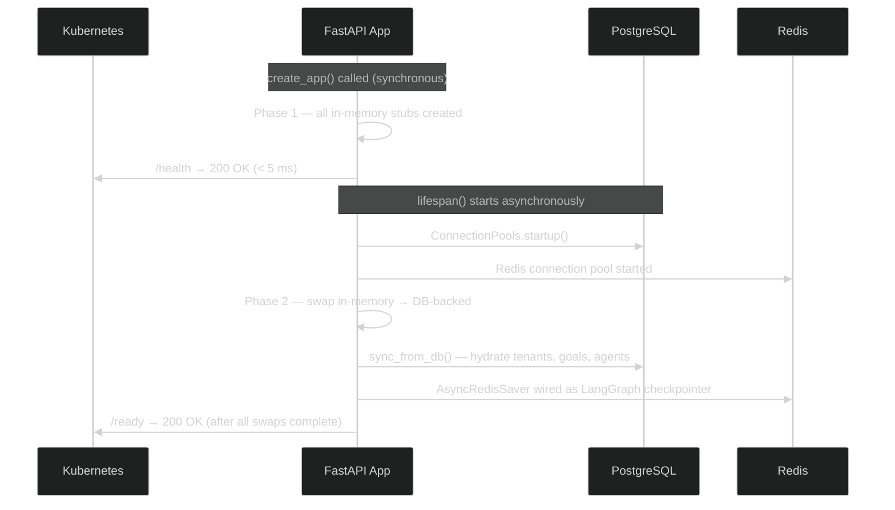

# App Startup and Service Wiring

Understanding how AgentVerse starts up is the single most important key to debugging production issues. The platform uses a **two-phase service wiring pattern** that deliberately separates fast synchronous construction from slow async database connections.

<!-- Sources: app/main.py:475-1150, app/core/pools.py, app/services/goal_service.py:1-150 -->

---

## Why a Factory Pattern?

`create_app()` in `app/main.py` is a **pure factory function** — it accepts optional overrides for every service and returns a fully configured `FastAPI` instance. This design enables three critical capabilities:

1. **Test isolation:** Tests call `create_app(goal_service=FakeGoalService())` to inject fakes without touching real infrastructure.
2. **Startup before DB is ready:** Kubernetes pods need to pass readiness probes before the database is reachable. Phase 1 services allow `/health` to respond in < 5 ms.
3. **Deterministic configuration:** Every service is constructed in one place, making the dependency graph visible and auditable.

```python
# app/main.py:475
def create_app(
    settings: Settings | None = None,
    health_checks: Sequence[HealthCheck] | None = None,
    pools: ConnectionPools | None = None,
    manage_pools: bool = False,
    tenant_service: Any = None,   # injectable for tests
    goal_service: Any = None,     # injectable for tests
    mcp_registry: MCPRegistry | None = None,
) -> FastAPI:
```

Setting `MANAGE_POOLS=true` in the environment enables Phase 2 when the factory is invoked by uvicorn (no code change needed).

---

## Phase 1: In-Memory Service Construction

Immediately inside `create_app()`, every service is constructed as a **lightweight in-memory stub**. No network calls, no database connections, no blocking I/O.

### Services Created in Phase 1

| Service | In-Memory Stub | Backed By |
|---------|---------------|-----------|
| `TenantService` | Dict-based tenant store | `TenantService()` |
| `GoalService` | `asyncio.Queue`-based events | `GoalService(audit_log, hitl)` |
| `MCPRegistry` | `_FakeRedis` dict store | `MCPRegistry(redis=_fake_redis)` |
| `MCPClient` | Full HTTP client (real) | Built after registry |
| `KnowledgeStore` | In-memory vector store | `KnowledgeStore()` |
| `AuditLog` | Dict-based per-tenant log | `AuditLog()` |
| `CostController` | Counter-based budget | `CostController()` |
| `PolicyEngine` | In-memory policy list | `PolicyEngine()` |
| `AgentStore` | Dict-based agent config | `AgentStore()` |
| `LongTermMemoryStore` | In-memory episodic store | `LongTermMemoryStore()` |
| `EvalRunner` | 5-dimension scorer | `EvalRunner()` |
| `HITLGateway` | In-memory approval queue | `HITLGateway()` |

The `_FakeRedis` stub (defined inside `main.py`) implements the full async Redis API using Python dicts and `asyncio.Lock`. It supports string ops, set ops, sorted sets, and TTL — enough for the rate limiter, MCPRegistry, and SessionStore to function correctly in tests.

### Why Phase 1 Exists



Kubernetes calls `/health` first. The app passes immediately because Phase 1 is synchronous and instant. Kubernetes then calls `/ready` — the app only marks itself ready after Phase 2 completes. This separation prevents premature traffic routing to a half-initialized service.

---

## Phase 2: Lifespan DB/Redis Upgrade

Phase 2 runs inside the `@asynccontextmanager async def lifespan()` function, which FastAPI calls automatically after startup. It only runs when `manage_pools=True`.

### Step-by-Step Phase 2 Sequence

```mermaid
%%{init: {'theme': 'dark', 'themeVariables': {'primaryColor': '#1e3a5f', 'fontFamily': 'monospace'}}}%%
flowchart TD
    A["ConnectionPools.startup()"] --> B["real_redis = active.redis"]
    B --> C1["MCPRegistry ← real Redis"]
    B --> C2["RedisCostController ← real Redis"]
    B --> C3["CostTracker._redis ← real Redis"]
    B --> C4["LLMConfigStore ← real Redis"]
    B --> C5["LangGraph Checkpointer"]
    C5 --> D1{AsyncRedisSaver?}
    D1 -->|"langgraph-checkpoint-redis installed"| E1["AsyncRedisSaver.from_conn_string()"]
    D1 -->|"ImportError"| E2["RedisSaver (sync fallback)"]
    E2 -->|"ImportError"| E3["MemorySaver ⚠ (no persistence)"]
    E1 & E2 & E3 --> F["db_factory = get_session_factory()"]
    F --> G1["TenantService(db_factory)"]
    F --> G2["GoalService(db_factory, event_store)"]
    F --> G3["AgentStore(db_factory)"]
    G1 --> H1["sync_from_db() — tenants hydrated"]
    G2 --> H2["sync_from_db() — goals hydrated"]
    G3 --> H3["sync_from_db() — agents hydrated"]
    H1 & H2 & H3 --> I["app.state swapped"]
    I --> J["Built-in MCP servers registered per tenant"]
    J --> K["ExecutionMemory DB wired"]
    K --> L["AuditLog, ScheduleStore, KnowledgeStore upgraded"]
    L --> M["✅ App is READY"]

    style E3 fill:#5a1e1e,stroke:#af4a4a
    style M fill:#1e3a1e,stroke:#4aaf4a
```



### The Service Swap

The critical moment is the swap itself:

```python
# app/main.py:1005-1015
_tenant_svc_with_db = TenantService(db_session_factory=db_factory)
_goal_svc_with_db = GoalService(
    audit_log=_audit_log,
    hitl=_hitl,
    db_session_factory=db_factory,
    event_store=event_store,
    task_queue=_task_queue,
)
_agent_store_with_db = AgentStore(db_session_factory=db_factory)

await _tenant_svc_with_db.sync_from_db()   # idempotent hydration
await _goal_svc_with_db.sync_from_db()
await _agent_store_with_db.sync_from_db()

app.state.tenant_service = _tenant_svc_with_db   # ← SWAP
app.state.goal_service = _goal_svc_with_db        # ← SWAP
app.state.agent_store = _agent_store_with_db      # ← SWAP
```

After the swap, `app.state.goal_service` is the DB-backed version. Dependency injection functions in routers resolve from `app.state` dynamically, so all subsequent requests automatically use the DB-backed service. In-flight requests using the in-memory service complete normally.

### sync_from_db() — State Hydration

`sync_from_db()` is idempotent — it only loads records not already in the in-memory cache. This prevents double-loading if `lifespan()` were somehow called twice. In practice it:

- Loads all active tenants from the `tenants` table
- Loads `running` and `pending` goals (not `complete` or `failed`) from the `goals` table
- Loads all agent configs from the `agent_configs` table

At scale with 1,000 tenants and 200 in-flight goals, hydration completes in ~150–300 ms over a local Postgres connection.

---

## LangGraph Checkpointer Wiring

The checkpointer is the mechanism that allows agent state to survive worker crashes and enables goal resumption. The wiring is a three-tier fallback:

```python
# app/main.py:845-875
try:
    from langgraph.checkpoint.redis.aio import AsyncRedisSaver
    _raw_cm = AsyncRedisSaver.from_conn_string(str(settings.redis_url))
    _actual_saver = await _raw_cm.__aenter__()
    await _actual_saver.setup()
    app.state.langgraph_checkpointer = _actual_saver
    logger.info("async_redis_saver_checkpointer_wired")
except ImportError:
    # Fall back to sync RedisSaver
    from langgraph.checkpoint.redis import RedisSaver
    _sync_saver = RedisSaver.from_conn_string(str(settings.redis_url)).__enter__()
    app.state.langgraph_checkpointer = _sync_saver
except Exception:
    # Last resort
    app.state.langgraph_checkpointer = MemorySaver()
    logger.warning("using_memory_saver_checkpointer_no_persistence")
```

| Checkpointer | Crash Recovery | Multi-Replica Safe | When Used |
|-------------|---------------|-------------------|-----------|
| `AsyncRedisSaver` | ✅ Yes | ✅ Yes | Production (recommended) |
| `RedisSaver` (sync) | ✅ Yes | ✅ Yes | Older library version |
| `MemorySaver` | ❌ No (in-memory) | ❌ No (process-local) | Tests / no Redis |

> **Critical:** If `MemorySaver` is active in production, a Celery worker crash loses all in-flight goal state. Monitor for `using_memory_saver_checkpointer_no_persistence` in your log pipeline and alert on it.

Celery workers independently wire their own checkpointer via the `@worker_init` signal in `app/scaling/tasks.py`. This is a separate code path from the API process because Celery workers are separate OS processes.

---

## Configuration Reference

Key environment variables that control startup behavior:

| Variable | Default | Effect |
|----------|---------|--------|
| `MANAGE_POOLS` | `false` | Set to `true` to enable Phase 2 when uvicorn starts |
| `DATABASE_URL` | None | asyncpg DSN for PostgreSQL. Required in production |
| `REDIS_URL` | `redis://localhost:6379/0` | Redis connection for checkpointer, rate limiter, MCPRegistry |
| `REDIS_SENTINEL_URLS` | None | Comma-separated Sentinel nodes. Overrides `REDIS_URL` for HA |
| `ENVIRONMENT` | `development` | `production` blocks FakeProvider and raises on missing LLM keys |
| `ANTHROPIC_API_KEY` | None | Primary LLM provider. Set at least one LLM key in production |
| `OPENAI_API_KEY` | None | Primary LLM provider (alternative to Anthropic) |
| `VERIFIER_API_KEY` | None | Dedicated verifier LLM key. Falls back to cross-model if unset |
| `LOG_LEVEL` | `INFO` | Structured log level |
| `CORS_ORIGINS` | `*` (dev) | Comma-separated allowed origins in production |
| `SENTENCE_TRANSFORMERS_MODEL` | None | Enables local embedding without any API key |

### Production Safety Guards

`create_app()` enforces two safety checks that prevent misconfigured deployments:

1. **FakeProvider blocked in production:** If `ENVIRONMENT=production` and no LLM API key is set, the process exits with a fatal error before serving any traffic.
2. **Default credentials blocked in production:** The Postgres connection string `agentverse:agentverse@` is rejected in production mode to prevent accidental deployment with test credentials.

---

## Real-World: 1,000-Tenant Cold Start

**Scenario:** A Kubernetes pod starts fresh with 1,000 active tenants, 50 in-flight goals, and the full service mesh.

| Phase | Duration | What Happens |
|-------|----------|--------------|
| Phase 1 (sync) | ~50 ms | All in-memory stubs created, `FakeRedis` ready |
| Redis connection | ~20 ms | Pool established, checkpointer context entered |
| DB connection pool | ~30 ms | AsyncPG pool opened with 10 connections |
| `sync_from_db()` for tenants | ~120 ms | 1,000 tenant rows loaded |
| `sync_from_db()` for goals | ~80 ms | 50 running goals rehydrated |
| `sync_from_db()` for agents | ~60 ms | Agent configs loaded |
| Built-in MCP registration | ~150 ms | Builtin handlers wired for each tenant |
| ExecutionMemory hydration | async | Fired as background task; doesn't block readiness |
| **Total to /ready** | **~520 ms** | Pods behind load balancer receive traffic at ~600 ms |

---

## Common Startup Bugs

### "AttributeError: app.state has no attribute 'goal_service'"

**Cause:** A test builds `create_app()` but reads `app.state.goal_service` before Phase 2 runs. In-memory mode, `app.state.goal_service` is set in Phase 1 for the mock service.

**Fix:** Pass `goal_service=YourService()` to `create_app()` explicitly, or set `manage_pools=True` and wire a test database.

### "works in tests, fails in prod with DB constraint violation"

**Cause:** Tests use Phase 1 in-memory `GoalService` which doesn't enforce DB constraints. Production Phase 2 uses the real Postgres-backed service.

**Fix:** Add integration tests that call `create_app(manage_pools=True)` with testcontainers Postgres.

### "LangGraph checkpointer is MemorySaver in production"

**Cause:** `langgraph-checkpoint-redis` package is not installed or `REDIS_URL` is unset.

**Fix:** `pip install langgraph-checkpoint-redis` and ensure `REDIS_URL` is set. Monitor for the `using_memory_saver_checkpointer_no_persistence` warning log.
