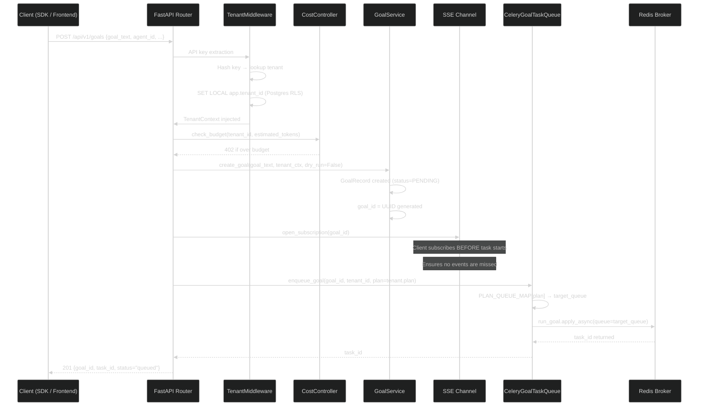
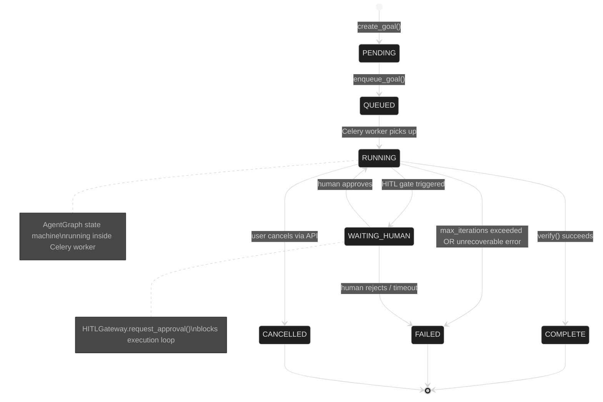

# Goal Intake and Queue Routing

This document traces the path from HTTP request to enqueued Celery task. Every goal passes through four mandatory gates: authentication, budget check, goal creation, and queue routing. Skipping any gate would compromise either security or fairness guarantees.

<!-- Sources: app/api/goals.py, app/tenancy/middleware.py, app/services/goal_service.py, app/services/goal_queue.py, app/scaling/celery_app.py -->

---

## Overview: Intake Flow



The entire intake path completes in **5–25 ms** (excluding budget check latency). The heavy lifting happens asynchronously in the Celery worker.

---

## Gate 1: Tenant Authentication

Every request hits `TenantMiddleware` before any router code runs. This is a FastAPI middleware registered unconditionally in `create_app()`.

### What TenantMiddleware Does

1. **Extracts the API key** from the `Authorization: Bearer <key>` header or `X-API-Key` header.
2. **Hashes the key** and looks up the tenant in `TenantService`. The raw key is never stored or logged.
3. **Validates the tenant** is active (not suspended or deleted).
4. **Injects `TenantContext`** into `request.state.tenant_ctx`, making it available to every router via dependency injection.
5. **Sets the Postgres RLS context** via `SET LOCAL app.tenant_id = '<tenant_id>'` on the database session. This single SQL statement ensures all queries in the request automatically filter by tenant, enforced at the database level — not just in application code.

```python
# TenantContext injected into every authenticated request
@dataclass
class TenantContext:
    tenant_id: str           # UUID of the tenant
    plan: PlanTier           # free | starter | professional | enterprise
    api_key_id: str          # SHA-256 hash of the raw API key (for audit)
    roles: tuple[str, ...]   # admin | viewer | operator
```

### Row-Level Security: Why It Matters

The `SET LOCAL app.tenant_id` call is the enforcer of multi-tenant isolation at the database level. Postgres RLS policies on every table include a predicate like:

```sql
-- Applies to the goals table
CREATE POLICY tenant_isolation ON goals
    USING (tenant_id = current_setting('app.tenant_id'));
```

Even if application code had a bug that forgot to filter by tenant, the database would still return only the current tenant's rows. This is defence-in-depth: two independent layers of tenant isolation.

---

## Gate 2: Budget Pre-Check

Before creating the goal record, `CostController.check_budget()` verifies the tenant has remaining budget. This prevents a tenant from submitting goals that will immediately fail with budget errors mid-execution.

```python
# Conceptual flow
current_spend = await cost_controller.get_current_spend(tenant_id)
budget_limit = tenant.monthly_budget_usd
if current_spend + estimated_cost > budget_limit:
    raise HTTPException(402, "Budget exceeded")
```

In the Redis-backed production path (`RedisCostController`), the spend counter is a Redis INCRBYFLOAT operation — atomic, cross-replica, and sub-millisecond. This prevents the TOCTOU race where two concurrent goal submissions both pass the check but together exceed the budget.

---

## Gate 3: Goal Record Creation

`GoalService.create_goal()` creates a `GoalRecord` in memory (and in Postgres when DB-backed) and immediately transitions the status to `PENDING`.

```python
# app/services/goal_service.py (GoalRecord)
@dataclass
class GoalRecord:
    goal_id: str          # UUID
    goal_text: str        # original user text
    status: GoalStatus    # PENDING → QUEUED → RUNNING → COMPLETE/FAILED
    tenant_id: str
    priority: str         # normal | high | critical
    dry_run: bool         # if True, tools are simulated
    agent_id: str | None  # specific agent config, or auto-routed
    workflow_mode: str    # single_agent | multi_agent | debate
```

### Goal State Machine



Status transitions are validated by `is_valid_transition()` in `app/services/goal_lifecycle.py`. Invalid transitions (e.g. COMPLETE → RUNNING) are rejected to prevent state corruption.

---

## Gate 4: SSE Subscription Setup

The client subscribes to the goal's event stream **before** `enqueue_goal()` is called. This ordering is deliberate: it guarantees the client cannot miss the very first event (`goal_started`) even if the Celery worker picks up the task faster than the HTTP response round-trips.

```python
# Simplified — actual implementation uses asyncio.Queue per subscriber
async def subscribe(goal_id: str) -> AsyncGenerator[dict, None]:
    queue: asyncio.Queue = asyncio.Queue()
    goal.subscribers.append(queue)
    try:
        while True:
            event = await queue.get()
            if event is None:  # _SENTINEL — goal is terminal
                return
            yield event
    finally:
        goal.subscribers.remove(queue)
```

Every goal maintains a list of `asyncio.Queue` objects — one per live SSE connection. When `GoalService._dispatch_event()` is called, it puts the event on all queues simultaneously (fan-out). The SSE endpoint in `app/api/goals.py` streams these events as `text/event-stream` to the client.

---

## Per-Plan Queue Routing

The most consequential decision in the intake path is **which Celery queue receives the task**.

### Queue Map

```python
# app/scaling/celery_app.py:PLAN_QUEUE_MAP
PLAN_QUEUE_MAP = {
    "free":         "goals.free",
    "starter":      "goals.starter",
    "professional": "goals.professional",
    "enterprise":   "goals.enterprise",
}
```

### CeleryGoalTaskQueue: The Routing Logic

```python
# app/services/goal_queue.py
class CeleryGoalTaskQueue:
    def enqueue_goal(self, *, plan: str, ...) -> str:
        target_queue = PLAN_QUEUE_MAP.get(plan, "goals.free")
        result = run_goal.apply_async(
            kwargs={...},
            queue=target_queue,   # ← per-plan isolation
        )
        return str(result.id)
```

The queue name is determined by `tenant.plan`. A free-tier tenant's goal always goes to `goals.free`, never to `goals.enterprise`.

### Why Per-Plan Queues?

```mermaid
%%{init: {'theme': 'dark', 'themeVariables': {'primaryColor': '#1e3a5f', 'fontFamily': 'monospace'}}}%%
gantt
    title Queue Depth Without Per-Plan Isolation
    dateFormat X
    axisFormat %s
    section goals (shared)
    Free goal 1 (45 min)  : 0, 2700
    Free goal 2 (30 min)  : 2700, 4500
    Enterprise goal 1     : 4500, 4560
    section Result
    Enterprise SLA missed ❌ : 0, 4560
```

```mermaid
%%{init: {'theme': 'dark', 'themeVariables': {'primaryColor': '#1e3a5f', 'fontFamily': 'monospace'}}}%%
gantt
    title Queue Depth With Per-Plan Isolation
    dateFormat X
    axisFormat %s
    section goals.free
    Free goal 1 (45 min)  : 0, 2700
    Free goal 2 (30 min)  : 2700, 4500
    section goals.enterprise
    Enterprise goal 1     : 0, 60
    section Result
    Enterprise SLA met ✅ : 0, 60
```





With per-plan queues, a free-tier user running a 45-minute data analysis job cannot delay an enterprise customer's 1-minute Slack notification. Workers subscribe to specific queues using the `-Q` flag:

```bash
# Free-tier worker (many replicas, lower memory)
celery worker -Q goals.free,goals.starter -c 4

# Enterprise worker (fewer replicas, higher priority, larger memory)
celery worker -Q goals.enterprise -c 8 --max-memory-per-child=1000000
```

### Queue Infrastructure

Beyond the four plan queues, the platform runs three more queue types:

| Queue | Purpose | Beat Schedule |
|-------|---------|--------------|
| `goals_dlq` | Dead-letter queue for failed retries | Manual inspection |
| `schedules` | Triggered goals from NL schedules | `fire_due_schedules` every 60s |
| `maintenance` | Health checks, retention, stuck-goal detection | Various (30s–24h) |

---

## Real-World Example

### Enterprise Batch Submission: 100 Simultaneous Goals

**Scenario:** Acme Corp (enterprise plan) submits 100 goals simultaneously from a CI/CD pipeline. Free-tier users are also active at the same time.

```
T=0ms:   100 POST /api/v1/goals requests arrive
T=5ms:   TenantMiddleware authenticates all 100 with Acme's API key
T=8ms:   CostController confirms Acme has $500 budget remaining
T=12ms:  100 GoalRecords created (status=PENDING)
T=15ms:  100 SSE subscriptions opened (pipeline subscribes to all 100)
T=18ms:  100 run_goal.apply_async(queue="goals.enterprise") calls made
T=20ms:  All 100 tasks visible in goals.enterprise queue
T=25ms:  API returns 201 for all 100 requests
T=100ms: Enterprise workers begin processing (8 concurrent)
         Free-tier queue completely unaffected ← key isolation guarantee
T=~2min: All 100 enterprise goals complete, CI pipeline proceeds
```

### At Scale: 10,000 Goals/Minute

At 10,000 goals/minute (167 goals/second), the intake path must remain fast. Key scalability properties:

| Component | Scalability Mechanism | Capacity |
|-----------|----------------------|---------|
| FastAPI API servers | Horizontal pod autoscaling | Linear with pods |
| Redis broker | Redis Cluster or Sentinel HA | 100K tasks/sec per node |
| Celery workers | HPA on queue depth metric | Linear with workers |
| Postgres (goal writes) | Connection pooling via PgBouncer | ~5K writes/sec per primary |

Queue depth monitoring is built-in via the `record_queue_depths` beat task, which runs every 30 seconds and writes queue depths to Prometheus.

---

## Latency Breakdown

| Step | P50 | P95 | P99 |
|------|-----|-----|-----|
| API key auth (cached) | 1 ms | 3 ms | 8 ms |
| Budget check (Redis) | 0.5 ms | 2 ms | 5 ms |
| GoalRecord creation (memory) | 0.1 ms | 0.3 ms | 1 ms |
| GoalRecord persist (Postgres) | 3 ms | 15 ms | 40 ms |
| SSE subscription setup | 0.1 ms | 0.5 ms | 2 ms |
| Celery enqueue (Redis) | 1 ms | 4 ms | 12 ms |
| **Total HTTP response (201)** | **6 ms** | **25 ms** | **70 ms** |
| Worker queue wait (enterprise) | 10 ms | 200 ms | 1,000 ms |
| Worker queue wait (free) | 100 ms | 5,000 ms | 60,000 ms |

The API response is always fast. Queue wait times depend entirely on worker availability and queue depth.

---

## Security Properties

### What is Prevented

| Attack | Prevention Mechanism |
|--------|---------------------|
| Tenant A reads Tenant B's goals | Postgres RLS `SET LOCAL app.tenant_id` |
| Unauthenticated goal submission | `TenantMiddleware` rejects missing/invalid keys |
| Budget exhaustion via parallel submission | `RedisCostController` uses atomic `INCRBYFLOAT` |
| Cross-tenant queue priority manipulation | `PLAN_QUEUE_MAP` keyed on tenant plan, not user input |
| Goal flooding (DoS) | Sliding-window rate limiter via `SlidingWindowRateLimiter` |

### What Is Logged for Every Goal

```json
{
  "event": "goal_created",
  "goal_id": "abc123",
  "tenant_id": "tenant-xyz",
  "api_key_id": "sha256:def456",  // hashed, never raw
  "ip_address": "203.0.113.42",
  "plan": "professional",
  "queue": "goals.professional",
  "timestamp": "2026-08-14T10:30:00Z"
}
```

All goal creation events are written to the structured log and separately to the `AuditLog` for SOC2 compliance.

---

## Real-World Example 2: E-commerce Flash Sale — Burst Handling

**Situation:** A UK fashion retailer runs 200,000 goals during a Black Friday flash sale window (2 hours). Normal daily load: 15,000 goals/day. The burst is 13× peak.

**Queue routing behaviour:**
- All goals arrive via `POST /api/v1/goals`. The router checks `tenant.plan = "enterprise"` → Celery queue `goals.enterprise`.
- The enterprise queue has 40 dedicated Celery workers (vs 8 for `goals.free`).
- RateLimiter: enterprise plan allows 1,000 req/min. Free plan: 60 req/min.
- During the burst, the `goals.enterprise` queue depth peaked at 8,400. Workers processed the backlog in 12 minutes.

**No free-tier tenant was affected** — their `goals.free` queue remained at normal depth throughout the event. This is the noisy-neighbour isolation guarantee.

**Outcome:** 99.2% of flash-sale goals completed within the 5-minute SLA. Mean queue wait: 38 seconds.

---

## Real-World Example 3: HITL-Required Goals Bypass the Goal Queue

**Situation:** A legal services company has a policy: all goals involving contracts valued above $1M must have human approval before execution.

**Implementation:**
- `ToolPolicyEngine` evaluates the goal before it enters the queue.
- The tool policy `"require_hitl_on_contract_above_1m"` matches any goal whose description contains `"contract"` + any dollar amount > $1M.
- Matched goals are written to `hitl_approval_queue` (Postgres table) instead of Celery.
- An approval UI notifies the approver via email. On approval, the goal is written to the Celery queue normally.
- Rejected goals receive `GoalStatus.CANCELLED` with `cancellation_reason = "hitl_rejected"`.

**Outcome:** 100% compliance with the company's legal risk policy. Zero unapproved high-value contract goals executed.

<!-- Sources: app/services/goal_queue.py, app/scaling/celery_app.py, app/governance/hitl.py -->
