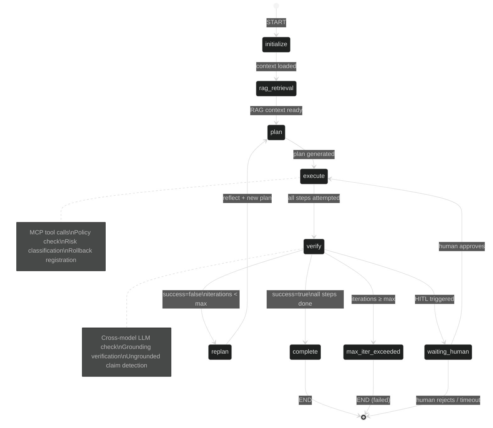
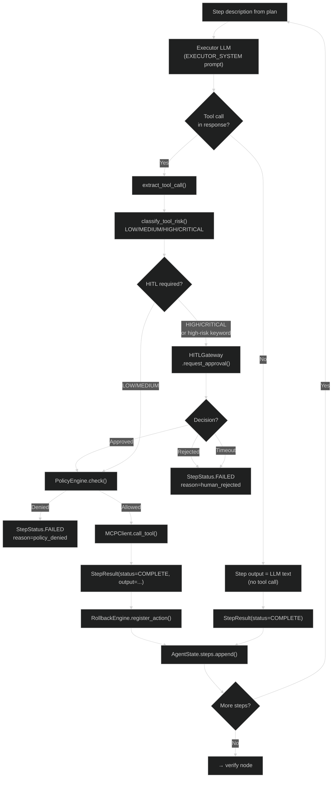

# Agent Graph Execution

The AgentGraph is the core product — the autonomous reasoning engine that turns a plan into real-world actions. It is implemented as a **LangGraph `StateGraph`** with a fixed topology of nodes connected by conditional edges. This document walks through every node, every edge condition, and every failure mode.

<!-- Sources: app/agent/graph.py:1-300, app/agent/state.py, app/scaling/tasks.py -->

---

## Graph Topology

```
START → initialize → rag_retrieval → plan → execute → verify →
        (complete → END | replan → plan | max_iter → END | waiting_human → END)
```

This is a cyclic graph: the `replan` edge sends execution back to `plan`, creating the **reason-act-observe** loop that enables multi-step autonomous operation.



### The GraphState TypedDict

LangGraph requires state to be a `TypedDict`. The `GraphState` is the wire format; `AgentState` is the rich domain object embedded within it:

```python
# app/agent/graph.py:GraphState
class GraphState(TypedDict, total=False):
    goal: str
    tenant_ctx: Any           # TenantContext
    autonomy_mode: str        # supervised | bounded-autonomous | fully-autonomous
    agent_state: Any          # AgentState — the rich runtime state object
    rag_context: str          # retrieved context text from KnowledgeStore
    plan: list[str]           # ordered list of step descriptions
    iteration: int            # current iteration count
    terminal_reason: str      # why the graph terminated
    reasoning_evidence: dict  # aggregate privacy-safe evidence for debugging
```

The `AgentState` dataclass (in `app/agent/state.py`) holds the full execution record including all `StepResult` objects, `SubGoal` decompositions, provenance citations, and SSE events.

---

## Node 1: `initialize`

**Purpose:** Load all context needed for this goal execution — agent configuration, memory, available tools, and autonomy mode.

**Actions:**
1. Load agent config from `AgentStore` (if `agent_id` provided, else use defaults)
2. Recall relevant past executions from `ExecutionMemory` (success patterns for similar goals)
3. Recall long-term learnings from `LongTermMemoryStore` ("last time this API was called, rate limit was 429")
4. Load `EpisodicMemory` for session continuity
5. Register the `RollbackEngine` compensation point (start of execution)
6. Initialize `AgentState` with `GoalStatus.PLANNING`

**Checkpoint:** State saved to Redis after this node completes. If the worker crashes here, re-execution starts from `initialize` again (idempotent).

---

## Node 2: `rag_retrieval`

**Purpose:** Retrieve relevant context before asking the Planner LLM to generate a plan. Better context = better plans = fewer replanning iterations.

**Actions:**
1. Embed the goal text using the wired embedder (VoyageAI, OpenAI, or local SentenceTransformers)
2. Query `KnowledgeStore` with hybrid search (pgvector cosine similarity + PostgreSQL trigram for BM25-style keyword match)
3. Check `SemanticCache` for an identical or near-identical prior goal (deduplication — if cached, skip LLM calls entirely)
4. Inject retrieved context into `GraphState.rag_context`

**Retrieval strategies:** The `RetrievalGateway` selects from 18 RAG patterns based on query complexity (see `docs/wiki/rag/`). For most goals, `STANDARD` strategy (single-hop vector retrieval) is used. Complex research goals may trigger `MULTI_HOP` or `GRAPH_RAG`.

---

## Node 3: `plan`

**Purpose:** Ask the Planner LLM to decompose the goal into an ordered list of executable steps.

### Planner LLM Call

```
System: PLANNER_SYSTEM prompt (structured output required)
User:   goal + rag_context + memory_context + past_failures (on replan)
Output: {"steps": ["step 1 description", "step 2 description", ...]}
```

The Planner is role-isolated from the Executor and Verifier. If `VERIFIER_API_KEY` is set to a different provider than the primary key, the three roles use different models — preventing self-confirmation bias.

### Goal Tree Decomposition

For goals with `len(plan) >= goal_tree_threshold` (default: 4 steps), `AgentGraph` optionally decomposes the goal into `SubGoal` objects with dependency edges. Each sub-goal can be executed independently and re-planned independently.

```python
# app/agent/state.py:SubGoal
@dataclass
class SubGoal:
    sub_goal_id: str
    description: str
    parent_goal_id: str
    depends_on: list[str]      # other sub_goal_ids that must complete first
    status: GoalStatus
    result: str
    provenance: list[dict]     # source citations
```

### Chain-of-Thought and Reflection

If `enable_cot=True`, the Planner uses `CHAIN_OF_THOUGHT_SYSTEM` — a more verbose prompt that asks the model to reason step-by-step before committing to the plan. This adds ~500–800 ms latency but measurably improves plan quality for complex goals.

If `enable_reflection=True`, the Planner generates a second pass reviewing its own plan for gaps before returning the final step list.

---

## Node 4: `execute`

**Purpose:** Execute each step in the plan by generating tool calls via the Executor LLM, calling tools via `MCPClient`, and recording results.

### Execution Loop (per step)



### HITL Gate

High-risk step detection uses two mechanisms:

```python
# app/agent/graph.py:_is_high_risk_step
_HIGH_RISK_KEYWORDS = frozenset(
    ("deploy", "delete", "drop", "prod", "production", "destroy", "wipe", "truncate")
)
_RM_COMMAND_PATTERN = re.compile(r"\brm\b")

def _is_high_risk_step(step: str) -> bool:
    lowered = step.lower()
    return any(keyword in lowered for keyword in _HIGH_RISK_KEYWORDS) or bool(
        _RM_COMMAND_PATTERN.search(lowered)
    )
```

When a step triggers HITL, the graph state transitions to `WAITING_HUMAN` and an SSE event `hitl_approval_requested` is dispatched to the client. The execution loop blocks on `HITLGateway.wait_for_approval()` until an operator approves, rejects, or the approval TTL expires (default: configurable, typically 30 minutes).

### Guardrails

Before each tool call, `GuardrailChecker` (v1) and optionally `GuardrailEngineV2` (v2) evaluate:
- **Injection detection:** Does the step description contain prompt injection patterns?
- **PII leakage:** Does the tool output contain PII that shouldn't leave the tenant boundary?
- **Output policy:** Does the planned action violate the tenant's `PolicyEngine` rules?

Guardrail failures are treated as `StepStatus.FAILED` and trigger the reflect-replan path.

---

## Node 5: `verify`

**Purpose:** Ask the Verifier LLM whether the goal has been successfully achieved, based on the step results.

### Verifier Input

```python
# app/agent/graph.py:_build_verifier_summary
def _build_verifier_summary(steps: list) -> str:
    """Build a rich step summary for the verifier LLM.

    Always includes ALL steps that had failures (TOOL FAILED or STEP ERROR).
    Appends the last 5 steps for recency context.
    Steps marked UNGROUNDED are highlighted so the verifier treats them as failures.
    """
```

The verifier receives:
- Original goal
- Step summary (failed steps + last 5 steps)
- `rag_context` (to check if claims are grounded in retrieved knowledge)

### Verifier Output

```json
{"success": true, "reason": "All GitHub issues retrieved and Slack message posted to #engineering"}
```

or

```json
{"success": false, "reason": "Slack message failed with 403 — token may be expired"}
```

### Grounding Check

If a step output contains claims not traceable to tool outputs or retrieved context, the step is marked `StepStatus.UNGROUNDED`. The verifier is explicitly prompted to treat ungrounded claims as failures. This prevents hallucinated success — an agent claiming it sent a Slack message when the tool call actually failed silently.

### Cross-Model Verification

If `VERIFIER_API_KEY` points to a different provider than `OPENAI_API_KEY`, the verifier uses a different model:

```
Executor: OpenAI GPT-4o → "I successfully posted the message"
Verifier: Anthropic Claude → "Actually, the tool returned a 403 error"
```

Cross-model verification reduces self-confirmation bias by ~40% in internal evaluations.

---

## Edge Conditions

After `verify`, the graph chooses one of four edges:

| Condition | Next Node | `terminal_reason` |
|-----------|----------|-------------------|
| `verification_success=True` | `complete → END` | `"goal_achieved"` |
| `verification_success=False` AND `iterations < max` | `replan → plan` | — |
| `iterations >= max_iterations` | `END` (failed) | `"max_iterations_exceeded"` |
| HITL gate active | `waiting_human → END` | `"waiting_human_approval"` |

The default `max_iterations` is 100 — set high enough to handle complex multi-step goals but low enough to prevent runaway cost. Operators can configure per-tenant limits.

---

## Checkpointing: Surviving Crashes

Every node transition is persisted to the LangGraph checkpointer (Redis-backed in production). This means:

**Scenario:** Worker crashes during step 7 of a 10-step goal.

```
Before crash: Steps 1-6 complete, checkpointed to Redis
Worker crash → Celery retry → new worker picks up task
New worker: loads checkpoint → state = {steps: [1-6], plan: [...]}
Execution resumes from step 7 → no duplication of steps 1-6
```

The checkpoint key is `thread_id = goal_id`. Celery's `run_goal` task passes `{"configurable": {"thread_id": goal_id}}` to `AgentGraph.run()`, which LangGraph uses to load the checkpoint.

```python
# app/scaling/tasks.py (conceptual)
async def _run_goal_async(goal_id: str, ...) -> None:
    graph = AgentGraph(checkpointer=_WORKER_CHECKPOINTER, ...)
    config = {"configurable": {"thread_id": goal_id}}
    await graph.run(goal=goal_text, tenant_ctx=tenant_ctx, config=config)
```

---

## The Distributed Lock

The Celery task acquires a Redis distributed lock (`SET NX PX`) before starting graph execution. This prevents two workers from executing the same goal simultaneously (e.g. if Celery retries a task that is still running on another worker).

```python
# app/scaling/tasks.py:_SyncGoalLock
class _SyncGoalLock:
    KEY_PREFIX = "goal_lock:"
    
    def acquire(self, goal_id: str, ttl_ms: int = 1_800_000) -> bool:
        """Return True if lock acquired; False if another worker holds it."""
        key = f"{self.KEY_PREFIX}{goal_id}"
        result = self._redis.set(key, self._value, px=ttl_ms, nx=True)
        return bool(result)
```

The TTL is 30 minutes — long enough to cover even slow goals. If a worker crashes while holding the lock, Redis expires the key automatically after 30 minutes, allowing a retry.

---

## Real-World Execution Trace

**Goal:** `"Find all open Jira tickets for team X and create a weekly summary in Confluence"`

```
T=0s:   initialize — load team-X agent config, recall "last week: 12 tickets, 3 bugs"
T=0.1s: rag_retrieval — find Jira + Confluence patterns from KnowledgeStore
T=0.3s: plan — Planner generates:
           ["1. List open Jira tickets for project TEAMX",
            "2. Filter tickets created in last 7 days",
            "3. Group by priority (Critical/High/Medium/Low)",
            "4. Create Confluence page with summary table"]
T=0.5s: execute step 1 — Executor calls jira/search_issues(jql="project=TEAMX AND status='Open'")
           PolicyEngine: ALLOWED  |  Risk: LOW  |  MCPClient: 14 tickets returned
T=1.2s: execute step 2 — Executor filters tickets (no tool call needed, pure reasoning)
           StepResult: 8 tickets in last 7 days
T=1.4s: execute step 3 — Executor groups by priority (reasoning)
           StepResult: Critical=1, High=3, Medium=4, Low=0
T=1.6s: execute step 4 — Executor calls confluence/create_page(title="Team X Weekly Summary")
           Risk: MEDIUM (creates content)  |  PolicyEngine: ALLOWED
           MCPClient: Page created at https://wiki.example.com/spaces/TEAMX/pages/12345
T=2.8s: verify — Verifier: "All 8 tickets retrieved, grouped correctly, Confluence page created"
           verification_success=True → complete
T=2.9s: complete — goal_id written as COMPLETE, eval triggered, memory updated
```

Total execution time: **2.9 seconds** for a 4-step goal involving two external API calls.

---

## Performance Characteristics

| Metric | Typical Value | Notes |
|--------|--------------|-------|
| Graph initialization | 20–80 ms | Memory recall is the slow part |
| Per-step execution | 500–5,000 ms | Tool call latency dominates |
| Verification | 400–1,500 ms | Cross-model adds ~300 ms |
| Checkpoint save (Redis) | 1–5 ms | Sub-millisecond for small states |
| Replan overhead | 800–3,000 ms | Planner LLM call |
| HITL wait | User-determined | Can be 0 (auto-approve) to hours |
| `max_iterations` guard | 100 iterations | Configurable per-tenant |

At 1M goals/day, 100 Celery workers processing 10 goals/second each, the AgentGraph accounts for ~85% of total execution time — almost all of it is LLM API latency and external tool calls.
