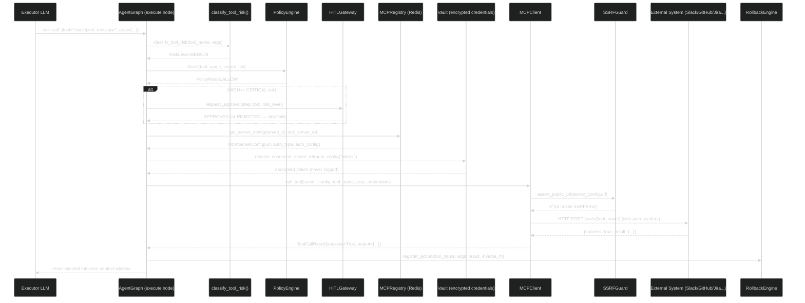

# Tool Discovery and Execution

Tools are what transform language model output into real-world action. This document covers the complete lifecycle of a tool invocation: how it is discovered, how credentials are resolved from the vault without being leaked, how risk is classified, how the tool is called, and how the action can be undone if something goes wrong.

<!-- Sources: app/mcp/registry.py, app/mcp/client.py, app/agent/tool_risk.py, app/reliability/rollback.py, app/providers/vault.py -->

---

## Overview: Tool Invocation Flow



---

## MCPRegistry: Per-Tenant Tool Catalogue

The `MCPRegistry` is a **Redis-backed, per-tenant registry** of MCP server configurations. Every tenant has an independent set of connectors — Tenant A's Slack credentials are completely isolated from Tenant B's.

### Data Structure

```
Redis keys:
  mcp:servers:{tenant_id}:{server_id}  → JSON MCPServerConfig
  mcp:server_ids:{tenant_id}           → Redis SET of server_id strings
```

This layout enables:
- **No-restart registration:** Adding a connector in the UI writes to Redis and is immediately available to all workers.
- **Per-tenant isolation:** Key prefix includes `tenant_id`, so a worker can never accidentally read another tenant's connector.
- **Process-local builtin handlers:** The `_BUILTIN_HANDLER_REGISTRY` dict holds Python callable handlers for built-in servers (Jira, Slack, GitHub, etc.). This dict is populated at worker startup via `register_builtin_servers()` and never serialized to Redis.

### MCPServerConfig

```python
# app/mcp/registry.py:MCPServerConfig
class MCPServerConfig(BaseModel):
    server_id: str            # UUID, auto-generated
    name: str                 # "my-slack-workspace"
    url: str                  # base URL of the MCP server endpoint
    base_url: str             # alias for url (both kept in sync)
    auth_type: AuthType       # bearer | api_key | oauth_ac | pkce | none | ...
    auth_config: dict         # {"token": "vault:ref:abc123"} — vault refs, not plain text
    status: ServerStatus      # active | draining | unhealthy | removed
    tool_definitions: list    # cached tool schemas (refreshed on health check)
    builtin_handler: Any      # process-local Python callable (not serialized)
    transport: str            # "http" | "ws" | "websocket"
```

Supported `AuthType` values cover every enterprise integration pattern:

| Auth Type | Used For |
|-----------|---------|
| `bearer` | GitHub, Slack (token-based) |
| `api_key` | SendGrid, Stripe |
| `oauth_ac` | Google Workspace, Salesforce (authorization code flow) |
| `pkce` | Atlassian Cloud, Microsoft 365 (PKCE) |
| `basic` | Legacy enterprise APIs |
| `hmac` | Webhook receivers |
| `mtls` | High-security B2B integrations |
| `none` | Internal MCP servers with network-level security |

### Built-in vs Custom Servers

AgentVerse ships **built-in handlers** for common connectors (Jira, Confluence, Slack, GitHub, Linear, etc.) that run as in-process Python functions. This avoids the overhead of an HTTP hop for every tool call on popular connectors.

Custom connectors point to external MCP server URLs (HTTP or WebSocket). The `MCPClient` dispatches either to the built-in handler (if `builtin_handler` is set on the config) or to the remote HTTP/WS endpoint.

---

## Tool Discovery: `list_tools()`

At `AgentGraph` initialization, the executor loads the available tool set for the current tenant:

```python
# Conceptual — actual implementation in AgentGraph.__init__ and execute node
tools = await mcp_client.list_tools(tenant_ctx=tenant_ctx)
# Returns: [ToolDefinition(name="slack/post_message", description="...", input_schema={...}), ...]
```

The `MCPClient.list_tools()` flow:
1. Queries `MCPRegistry.list_servers(tenant_id)` — all active server configs
2. For each server, returns cached `tool_definitions` from the config (populated during health check)
3. Combines all tools into a flat list with `server_id` and `server_name` metadata

The tool list is injected into the Executor LLM's system prompt as a JSON schema, enabling the model to generate valid tool calls with correct argument structures.

---

## Vault Credential Resolution

Credentials stored in `auth_config` are **never stored in plaintext**. They are stored as vault references: strings of the form `vault:ref:<encrypted_blob>`.

### Resolution Flow

```python
# app/providers/vault.py
def is_connector_secret_ref(value: str) -> bool:
    return value.startswith("vault:ref:")

def resolve_connector_secret_ref(ref: str) -> str:
    encrypted_blob = ref.removeprefix("vault:ref:")
    return get_vault().decrypt(encrypted_blob)
```

The `Vault` uses AES-256-GCM encryption. The encryption key is derived from `SECRET_KEY` in environment variables. In production, `SECRET_KEY` should be injected from a secrets manager (AWS Secrets Manager, HashiCorp Vault, etc.), not from a `.env` file.

### Credential Injection into HTTP Calls

The `MCPClient._inject_auth()` method takes the resolved (decrypted) credentials and injects them as HTTP headers:

```python
# For AuthType.BEARER → Authorization: Bearer <token>
# For AuthType.API_KEY → X-API-Key: <key> (or custom header name from auth_config)
# For AuthType.BASIC → Authorization: Basic base64(user:pass)
# For AuthType.CUSTOM_HEADER → <header_name>: <value>
```

Resolved credentials are **never logged** — the `sanitize_event_value()` function strips any value matching known secret patterns from all event payloads before they reach the SSE stream or audit log.

---

## SSRF Protection

Before any HTTP call to an external MCP server, `SSRFGuard.assert_public_url()` validates the URL:

```python
# app/net/ssrf_guard.py
def assert_public_url(url: str) -> None:
    """Raise SSRFError if url resolves to a private/loopback/link-local IP."""
```

Blocked addresses include:
- `127.0.0.0/8` (loopback)
- `10.0.0.0/8`, `172.16.0.0/12`, `192.168.0.0/16` (RFC 1918 private)
- `169.254.0.0/16` (link-local — AWS metadata endpoint)
- `::1/128`, `fc00::/7` (IPv6 loopback and ULA)

This prevents a malicious tenant from registering a connector pointing to `http://169.254.169.254/latest/meta-data/` (AWS IMDSv1) and exfiltrating instance credentials.

---

## Tool Risk Classification

Before executing any tool call, `classify_tool_risk()` assigns a risk level based on the tool name and arguments:

```python
# app/agent/tool_risk.py (conceptual)
class RiskLevel(enum.StrEnum):
    LOW      = "low"       # read-only: list, get, search
    MEDIUM   = "medium"    # write with recoverable effect: create, post, send
    HIGH     = "high"      # destructive but bounded: update, modify, patch
    CRITICAL = "critical"  # irreversible: delete, drop, destroy, wipe, truncate
```

### Risk Classification Matrix

| Tool Pattern | Risk Level | HITL Required? |
|-------------|-----------|----------------|
| `*/list_*`, `*/get_*`, `*/search_*` | LOW | Never |
| `*/create_*`, `*/post_*`, `*/send_*` | MEDIUM | Only if `autonomy_mode=supervised` |
| `*/update_*`, `*/modify_*`, `*/patch_*` | HIGH | If step contains high-risk keywords |
| `*/delete_*`, `*/drop_*`, `*/destroy_*` | CRITICAL | Always |
| Step contains: `deploy`, `prod`, `rm`, `truncate`, `wipe` | HIGH/CRITICAL | Always |

The `_is_high_risk_step()` function checks the **step description** (generated by the Planner), not just the tool name. This catches cases where a LOW-risk tool is used in a HIGH-risk context (e.g., a "post message" tool being used to announce "deleting all production data").

---

## Tool Execution via MCPClient

```python
# app/mcp/client.py:MCPClient
async def call_tool(
    server_config: MCPServerConfig,
    tool_name: str,
    arguments: dict,
    secret_resolver: SecretResolver | None = None,
) -> ToolCallResult:
```

### Dispatch Decision

```mermaid
%%{init: {'theme': 'dark', 'themeVariables': {'primaryColor': '#1e3a5f', 'fontFamily': 'monospace'}}}%%
flowchart TD
    A["call_tool(server_config, tool_name, args)"] --> B{builtin_handler\nregistered?}
    B -->|Yes| C["Direct Python call\nBuiltin handler invoked"]
    B -->|No| D{transport type?}
    D -->|"http (default)"| E["HTTP POST\n{url}/tools/{tool_name}"]
    D -->|"ws / websocket"| F["WebSocket\nJSON-RPC call"]
    C & E & F --> G["ToolCallResult"]
    G --> H{success?}
    H -->|True| I["Return result"]
    H -->|False| J["Retry with backoff\n(max 3 attempts)"]
    J --> K{Still failing?}
    K -->|Yes| L["ToolCallResult(success=False, error=...)"]
    K -->|No| I

    style C fill:#1e3a1e,stroke:#4aaf4a
    style L fill:#3a1e1e,stroke:#af4a4a
```



For HTTP connectors, the request follows the MCP spec:
```
POST {server_url}/tools/{tool_name}
Content-Type: application/json
Authorization: Bearer {resolved_token}

{"arguments": {...}}
```

Response parsing handles both the standard MCP response format (`{"content": [...]}`) and a simplified format (`{"result": ...}`) used by older connectors.

---

## Tool Rollback via RollbackEngine

Every **non-read-only** tool call registers a compensating action in the `RollbackEngine`. If a later step fails and the agent decides to roll back, the engine replays the compensating actions in reverse order.

```python
# app/reliability/rollback.py (conceptual)
class RollbackEngine:
    def register_action(
        self,
        tool_name: str,
        arguments: dict,
        result: ToolCallResult,
        inverse_fn: Callable | None = None,
    ) -> None:
        """Record the action and its inverse for potential rollback."""
```

### Inverse Actions (from `app/reliability/tool_inverses.py`)

| Tool | Inverse |
|------|---------|
| `github/create_issue` | `github/close_issue(issue_id)` |
| `slack/post_message` | `slack/delete_message(message_id)` |
| `confluence/create_page` | `confluence/delete_page(page_id)` |
| `jira/create_ticket` | `jira/delete_ticket(ticket_id)` |
| `**/delete_*` | None (irreversible — CRITICAL risk) |

When rollback is triggered, the engine calls the inverse functions in LIFO order. Rollback is triggered automatically when a goal reaches `FAILED` status after partial execution, but only if the `RollbackEngine` has recorded inverses for all steps.

---

## Real-World Example: Slack Connector

**Goal Step:** `"Post a message to #engineering-standup with the weekly summary"`

```
1. Agent generates tool call:
   {tool: "slack/post_message", args: {channel: "#engineering-standup", text: "Weekly Summary:\n..."}}

2. classify_tool_risk("slack/post_message", args) → MEDIUM (write, recoverable)

3. PolicyEngine.check("slack/post_message", tenant_ctx) → ALLOW
   (tenant has a policy: allow_slack_channels=["#engineering-*"])

4. MCPRegistry.get_server("tenant-123", "slack-builtin") →
   MCPServerConfig{name="Acme Slack", auth_type=BEARER, auth_config={"token": "vault:ref:xyz"}}

5. resolve_connector_secret_ref("vault:ref:xyz") → "xoxb-..."  (Slack Bot token)

6. MCPClient: builtin_handler("slack/post_message", {channel: "#engineering-standup", text: "..."})
   → Slack API call: POST https://slack.com/api/chat.postMessage
   ← {ok: true, ts: "1234567890.123456", channel: "C0ABC123"}

7. ToolCallResult{success=True, output={ts: "1234567890.123456"}}

8. RollbackEngine.register_action(
       "slack/post_message",
       args={channel: "#engineering-standup"},
       result={ts: "1234567890.123456"},
       inverse_fn=lambda: slack/delete_message(ts="1234567890.123456")
   )

9. StepResult{status=COMPLETE, tool_calls=[{tool_name="slack/post_message", success=True}]}
```

**Total latency for this step:** ~350 ms (Slack API round-trip ~200 ms + overhead ~150 ms)

---

## Error Handling and Retry

Tool call failures are handled by `MCPClient` with exponential backoff (max 3 retries, 100 ms initial delay). After retries are exhausted, `ToolCallResult(success=False, error=...)` is returned to the agent.

The agent's execute node records the failure in `StepResult.tool_calls` with `"success": false`. The verifier detects the failure via `_build_verifier_summary()` which explicitly includes all failed tool calls. This triggers a `verify → replan` cycle where the Planner sees the failure context and generates an alternative approach (e.g., "Slack rate-limited — retry in 60 seconds" → Planner generates a step with a delay).

---

## Security Properties

| Property | Mechanism |
|----------|-----------|
| Credentials never in plaintext | Vault AES-256-GCM encryption; `vault:ref:` prefix in storage |
| Credentials never logged | `sanitize_event_value()` strips secrets from all event payloads |
| SSRF prevention | `SSRFGuard` blocks all private/internal IP ranges |
| Tenant tool isolation | `MCPRegistry` namespaces keys by `tenant_id` |
| Tool policy enforcement | `PolicyEngine.check()` before every tool call |
| Irreversible action gates | CRITICAL risk always triggers HITL approval |
| Audit trail | Every tool call → `AuditEvent` in `AuditLog` |

---

## At Scale: 1M Tool Calls/Day

At 1M goals/day, averaging 5 tool calls per goal, the system processes ~57 tool calls per second.

| Bottleneck | Capacity | Mitigation |
|-----------|----------|-----------|
| Redis key lookups (MCPRegistry) | ~500K ops/sec per node | Redis Cluster sharding |
| Vault decryption (AES-256-GCM) | ~100K ops/sec per CPU | In-process; no network hop |
| HTTP calls to external systems | Rate-limit dependent | Per-connector circuit breakers |
| Builtin handler calls | ~50K/sec per worker | Pure Python; no I/O |
| `PolicyEngine.check()` | ~1M checks/sec | In-memory policy evaluation |

The `SemanticCache` (wired into the RAG layer) deduplicates identical tool call + context combinations — if 1,000 users ask the same question about a Jira project, the second through 1,000th calls skip the LLM and tool calls entirely, returning the cached result.

---

**Real-World Example 2 — DevOps Agent / GitHub + Jira + Slack Multi-Connector Goal**

> A platform engineering team configures an AgentVerse agent with the goal "For every failing CI run on main, open a Jira incident and notify #oncall-alerts in Slack." Their tenant (`devops-co-prod`) has 3 connectors in `MCPRegistry`: `github-connector` (`auth_type=bearer, auth_config={"token": "vault:ref:enc_abc123"}`), `jira-connector` (`auth_type=bearer, auth_config={"token": "vault:ref:enc_def456"}`), and `slack-connector` (`auth_type=bearer, auth_config={"token": "vault:ref:enc_ghi789"}`). The Planner generates a 3-step plan; `classify_tool_risk` assigns LOW to the GitHub read, MEDIUM to the Jira create, and MEDIUM to the Slack post — no HITL approval required. **Step 1**: `MCPRegistry.get_server_config("devops-co-prod", "github-connector")` returns the config; `resolve_connector_secret_ref("vault:ref:enc_abc123")` decrypts the GitHub PAT in ~0.02 ms via in-process AES-256-GCM; `MCPClient` calls `GET /repos/devops-co/app/actions/runs/9887123` and returns the failing run details in 210 ms. **Step 2**: A fresh `resolve_connector_secret_ref("vault:ref:enc_def456")` retrieves the Jira API token; `jira/create_issue` opens ticket `DEV-5531` in 340 ms; `RollbackEngine.register_action()` records `inverse_fn=jira/delete_ticket("DEV-5531")`. **Step 3**: `resolve_connector_secret_ref("vault:ref:enc_ghi789")` retrieves the Slack bot token; `slack/post_message` notifies `#oncall-alerts` in 190 ms; rollback inverse `slack/delete_message(ts="1720000000.000001")` is registered. Three distinct `vault:ref:` encrypted blobs are resolved and consumed — none appear in SSE payloads, audit events, or application logs at any point in the pipeline.
