# Memory, Audit, Eval, and SSE Delivery

Goal completion is not just a status change. It triggers a parallel post-execution pipeline that writes to memory, scores the outcome, seals the audit trail, records final costs, and fans events out to every subscriber. Understanding this pipeline is essential for debugging observability gaps and building reliable client integrations.

<!-- Sources: app/services/goal_service.py, app/memory/execution.py, app/memory/long_term.py, app/intelligence/eval_runner.py, app/governance/audit.py, app/governance/cost.py -->

---

## Post-Execution Pipeline Overview

When `AgentGraph` emits `GoalStatus.COMPLETE` or `GoalStatus.FAILED`, the following pipeline runs **in parallel** (all writes are non-blocking and don't affect the final status):

```mermaid
%%{init: {'theme': 'dark', 'themeVariables': {'primaryColor': '#1e3a5f', 'fontFamily': 'monospace'}}}%%
flowchart TD
    A["GoalStatus.COMPLETE\nAgentGraph exits"] --> B["GoalService._on_goal_complete()"]
    B --> C{Parallel execution}
    C --> D["① ExecutionMemory.write()\nStep-level trace"]
    C --> E["② LongTermMemory.update()\nCross-session learnings"]
    C --> F["③ EvalRunner.score()\n5-dimension scoring"]
    C --> G["④ AuditLog.seal()\nAppend-only trail"]
    C --> H["⑤ CostController.record_final()\nRedis + Postgres ledger"]
    D & E & F & G & H --> I["_dispatch_event('goal_completed')"]
    I --> J["Redis Pub/Sub\npublish goal_events:{tenant_id}"]
    J --> K["SSE Emitter\nfan-out to all subscribers"]
    K --> L["Browser / SDK / GitHub Action\nreceive final event"]

    style A fill:#1e3a1e,stroke:#4aaf4a
    style L fill:#1e3a5f,stroke:#4a90d9
```



The post-execution pipeline is designed to be **fire-and-forget**: none of the writes block the delivery of the `goal_completed` event to the client. A memory write failure is logged as a warning but never surfaces as a goal failure.

---

## ① Memory Write: ExecutionMemory

`ExecutionMemory` stores the step-level execution trace for the current goal. Its primary purpose is **recall in future goals** — the agent can recall "last time I ran a similar goal, step 3 failed because the Jira token was expired" and adjust its plan accordingly.

### What Gets Written

```python
# app/memory/execution.py (conceptual structure)
@dataclass
class ExecutionTrace:
    goal_id: str
    goal_text: str
    tenant_id: str
    status: GoalStatus           # COMPLETE or FAILED
    steps: list[StepResult]      # full step-by-step trace
    plan: list[str]              # original plan
    tool_calls: list[dict]       # all tool calls with outcomes
    rag_context: str             # retrieved context used during planning
    duration_seconds: float
    token_count: int
    created_at: datetime
```

The trace is stored in two places:
- **In-memory cache** (the `ExecutionMemory._cache` dict): for fast recall during the current session
- **Postgres `execution_memory` table**: for persistence across sessions and worker restarts

### DB Wiring

`ExecutionMemory._db` is `None` during Phase 1 (tests) and set to `db_factory` during Phase 2 (production lifespan). Write failures are caught and logged; they never propagate to the agent.

---

## ② Long-Term Memory: LongTermMemoryStore

`LongTermMemoryStore` stores **durable learnings** that persist across multiple goal executions and sessions. Unlike `ExecutionMemory` (step-level, goal-scoped), long-term memories are abstracted generalizations: "Jira API rate limit is 100 requests/minute for this tenant's instance."

### Memory Formation

Long-term memories are extracted from the execution trace by the `LongTermMemoryStore.update()` method:

1. **Successful patterns:** "Goal type: Jira → Confluence weekly report. Steps that worked: 4-step plan with jira/search_issues → confluence/create_page."
2. **Failure patterns:** "Tool confluence/update_page fails with 412 when the page was last edited < 5 seconds ago — add a 10-second wait."
3. **Connector quirks:** "GitHub connector requires `Accept: application/vnd.github.v3+json` header for search results."

These memories are retrieved during the `rag_retrieval` and `initialize` nodes of future goal executions via `LongTermMemoryStore.recall(goal_text, tenant_id)`.

### Storage Structure

```
DB table: long_term_memory
  tenant_id, memory_text, embedding (vector), goal_ids (source goals),
  access_count, last_accessed_at, created_at
```

Retrieval uses cosine similarity on the embedding column (pgvector). The most relevant 5–10 memories are injected into the Planner's context window.

---

## ③ Evaluation: EvalRunner

After goal completion, `EvalRunner.score()` grades the execution on **5 dimensions**. These scores are stored and used by `SelfOptimizer` to improve future goal executions.

### Evaluation Dimensions

| Dimension | What It Measures | Example Score |
|-----------|-----------------|--------------|
| **Goal Completion** | Did the agent achieve what was asked? | 0.95 — "issues found and posted" |
| **Tool Efficiency** | Were tools called with minimal redundancy? | 0.80 — "2 redundant list calls" |
| **Grounding Accuracy** | Were claims backed by tool outputs? | 1.0 — "all claims verified" |
| **Plan Quality** | Was the plan optimal for the goal? | 0.70 — "3-step could have been 2-step" |
| **Cost Efficiency** | Tokens used vs goal complexity? | 0.85 — "slightly over-prompted" |

```python
# app/intelligence/eval_runner.py (conceptual)
@dataclass
class GoalScore:
    goal_id: str
    tenant_id: str
    dimensions: dict[str, float]  # 0.0 – 1.0 per dimension
    overall: float                # weighted average
    feedback: str                 # LLM-generated improvement suggestion
    created_at: datetime
```

The `overall` score drives `SelfOptimizer`: goals with `overall < 0.7` are passed to `SelfOptimizer.analyze()`, which generates prompt improvement suggestions and logs them for operator review.

### EvalSuiteRunner

`EvalSuiteRunner` runs batched evaluations across a collection of goals — used for offline A/B testing of planner prompt changes. It is not triggered on every goal completion; it runs on-demand via the `/api/v1/evals/suites` endpoint.

---

## ④ Audit Log: Sealed at Completion

The `AuditLog` records a **`goal_completed` event** (or `goal_failed`) containing the complete forensic record of the execution. This event is the authoritative post-mortem record for SOC2 auditors.

### Audit Event at Goal Completion

```python
# app/governance/audit.py:AuditEvent
AuditEvent(
    goal_id="abc123",
    tool_name="goal_completed",          # synthetic event type
    action_level=ActionLevel.INFO,
    outcome="complete",
    step_id="",
    # SOC2-required fields
    ip_address="203.0.113.42",          # client IP from intake request
    user_agent="agentverse-sdk/1.0.0",
    api_key_id="sha256:def456",         # hashed, never raw key
    request_id="req-xyz789",
)
```

All tool-level audit events (one per tool call) were already written during goal execution. The completion event is the **seal** that closes the audit trail for this goal.

### Postgres Immutability

In production, the `audit_log` Postgres table has an immutability trigger that blocks `UPDATE` and `DELETE` operations:

```sql
CREATE RULE no_update_audit AS ON UPDATE TO audit_log DO INSTEAD NOTHING;
CREATE RULE no_delete_audit AS ON DELETE TO audit_log DO INSTEAD NOTHING;
```

This structural guarantee means audit records cannot be tampered with even if the application has a bug or a credential is compromised.

---

## ⑤ Cost Recording

`CostController.record_final()` writes the definitive token cost for the goal to both Redis and Postgres:

- **Redis** (`INCRBYFLOAT`): updates the tenant's running monthly spend counter atomically
- **Postgres**: writes an immutable cost record for billing and auditing

```python
# Conceptual cost record
CostRecord(
    goal_id="abc123",
    tenant_id="tenant-xyz",
    input_tokens=12_400,
    output_tokens=3_200,
    total_tokens=15_600,
    cost_usd=0.0468,            # based on model pricing
    model="claude-3-5-sonnet",
    created_at="2026-08-14T10:32:55Z",
)
```

### CostTracker vs CostController

`CostTracker` (in `app/intelligence/cost_tracker.py`) tracks **real-time** per-request token costs during execution (incremental, mid-goal). `CostController` records the **final** goal cost at completion and enforces budget limits. Both use Redis INCRBYFLOAT for cross-replica safety.

---

## SSE Event Delivery

### Event Types

Every significant transition in the goal lifecycle emits an SSE event. Clients can build real-time progress UIs from these events alone.

| Event Type | When Emitted | Payload |
|-----------|-------------|---------|
| `goal_started` | Worker picks up task | `{goal_id, status: "running"}` |
| `plan_generated` | Planner completes | `{goal_id, plan: ["step 1", ...]}` |
| `step_started` | Execute node begins a step | `{goal_id, step_id, description}` |
| `tool_called` | MCPClient dispatches a call | `{goal_id, step_id, tool_name, server}` |
| `tool_result` | Tool call returns | `{goal_id, step_id, tool_name, success, preview}` |
| `step_completed` | Step finishes | `{goal_id, step_id, status, output_preview}` |
| `hitl_approval_requested` | High-risk step paused | `{goal_id, step_id, tool, risk_level}` |
| `hitl_approved` | Operator approves | `{goal_id, step_id, approver}` |
| `goal_replanning` | Verify fails, replanning | `{goal_id, reason, iteration}` |
| `goal_completed` | Goal succeeds | `{goal_id, status: "complete", duration_ms, cost_usd}` |
| `goal_failed` | Goal fails definitively | `{goal_id, status: "failed", error, reason}` |

### Fan-Out Architecture

```mermaid
%%{init: {'theme': 'dark', 'themeVariables': {'primaryColor': '#1e3a5f', 'fontFamily': 'monospace'}}}%%
flowchart TD
    GS["GoalService._dispatch_event(event)"]
    GS --> MEM["In-memory fan-out\nasyncio.Queue per subscriber"]
    GS --> REDIS["Redis PUBLISH\ngoal_events:{tenant_id}:{goal_id}"]
    
    MEM --> SSE1["SSE Subscriber 1\n(browser tab 1)"]
    MEM --> SSE2["SSE Subscriber 2\n(browser tab 2)"]
    MEM --> SSE3["SSE Subscriber 3\n(SDK listener)"]
    
    REDIS --> W1["API Worker 1\nREDIS SUBSCRIBE"]
    REDIS --> W2["API Worker 2\nREDIS SUBSCRIBE"]
    W1 & W2 --> SSE4["SSE Subscriber 4\n(on different API pod)"]

    style REDIS fill:#5a1e1e,stroke:#af4a4a
    note right of REDIS: Cross-replica delivery:\nneeded when client connects\nto a different API pod\nthan the Celery worker
```

The dual delivery path (asyncio.Queue + Redis pub/sub) is necessary for **multi-replica deployments**: the Celery worker that executes the goal and the API pod serving the SSE stream are different processes. The worker publishes to Redis; all API pods subscribed to that channel fan-out to their local SSE subscribers.

---

## SDK Integration

### Python SDK: Streaming Events

The Python SDK (`agent-verse-sdk-python`) provides a streaming interface that consumes the SSE event stream:

```python
from agentverse import AgentVerseClient

client = AgentVerseClient(api_key="sk-...")

# Streaming — events arrive as they happen
async for event in client.goals.run_and_stream("Summarize open GitHub issues"):
    if event.type == "step_completed":
        print(f"Step: {event.step_description} → {event.status}")
    elif event.type == "goal_completed":
        print(f"Done! Cost: ${event.cost_usd:.4f}")

# Blocking — waits for completion
result = await client.goals.run("Summarize open GitHub issues")
print(result.output)
```

The SDK internally opens a GET `/api/v1/goals/{goal_id}/events` SSE stream and yields parsed event objects.

### TypeScript/JavaScript SDK

```typescript
import { AgentVerseClient } from "@agentverse/sdk";

const client = new AgentVerseClient({ apiKey: "sk-..." });

const stream = client.goals.stream("Summarize open GitHub issues");

for await (const event of stream) {
  if (event.type === "goal_completed") {
    console.log(`Done: ${event.output}`);
  }
}
```

### GitHub Action

The `agent-verse-github-action` wraps the Python SDK for CI/CD use:

```yaml
# .github/workflows/ci.yml
- uses: agentverse/run-goal@v1
  with:
    api_key: ${{ secrets.AGENTVERSE_API_KEY }}
    goal: "Review PR #${{ github.event.number }} and post a summary comment"
    timeout: 300   # 5 minutes max
    wait_for: "goal_completed"  # blocks until complete
```

The action submits the goal, subscribes to the SSE stream, and exits with code 0 (success) or 1 (failure) based on the final event type. CI pipelines can chain goals: "analyze test failures → create Jira tickets → notify Slack" as sequential steps in a workflow.

---

## Frontend Update Path

On goal completion, the frontend refreshes in under **100 ms** end-to-end:

```
1. GoalService._dispatch_event("goal_completed")       (in Celery worker process)
2. Redis PUBLISH goal_events:{tenant_id}:{goal_id}     (~1 ms)
3. API pod receives SUBSCRIBE message                   (~1 ms)
4. SSE emitter puts event on subscriber asyncio.Queue  (~0.1 ms)
5. FastAPI streaming response flushes SSE frame        (~2 ms)
6. Browser EventSource receives event                  (~5 ms RTT)
7. TanStack Query invalidation: queryClient.invalidateQueries(["goals"])
8. React re-render with updated goal status            (~10 ms)
```

Total frontend refresh latency: **~20 ms** from Celery worker write to browser render. This is fast enough for users to perceive goal completion as nearly instantaneous.

---

## At Scale: 1M Goal Completions/Day

At 1M completions/day (~12 completions/second), the post-execution pipeline must handle:

| Write | Volume | Mechanism |
|-------|--------|-----------|
| ExecutionMemory (in-memory) | 12/sec | dict append; O(1) |
| ExecutionMemory (Postgres) | 12/sec | INSERT; 3–15 ms each |
| LongTermMemory updates | ~3/sec | Only for goals with learnings |
| EvalRunner scoring | 12/sec | LLM call; can be async/lazy |
| AuditLog (Postgres) | ~60/sec | All tool events + completion |
| CostController (Redis) | 12/sec | INCRBYFLOAT; sub-millisecond |
| CostController (Postgres) | 12/sec | INSERT; 3–15 ms each |
| SSE events | ~300/sec | 5 events per completion avg |
| Redis pub/sub publishes | ~300/sec | ~0.5 ms each |

The EvalRunner scoring LLM call is the most expensive post-execution operation. At scale, scoring is **lazy**: the LLM call is deferred to a background `maintenance` queue task, decoupled from the goal completion acknowledgment. The `GoalScore` is computed within 60 seconds of goal completion for observability, but does not block the `goal_completed` event delivery.

---

## Debugging Post-Execution Issues

### "Goal shows COMPLETE but memory has nothing"

**Cause:** `ExecutionMemory._db` is `None` (Phase 1 / test mode). Writes succeed in-memory but are not persisted.

**Fix:** In production, ensure `manage_pools=True` and `DATABASE_URL` is set. The lifespan wires `_exec_memory._db = db_factory`.

### "SSE stream shows events but browser never updates"

**Cause:** TanStack Query cache is not invalidated. The SSE event arrives but the query for goal status is stale-while-revalidate.

**Fix:** In the frontend, ensure the SSE event handler calls `queryClient.invalidateQueries(["goals", goalId])` on `goal_completed` and `goal_failed` events.

### "Redis pub/sub events missing on secondary API pod"

**Cause:** The secondary pod's Redis SUBSCRIBE channel name doesn't match the publishing channel.

**Fix:** Channel naming follows `goal_events:{tenant_id}:{goal_id}`. Verify all pods use the same naming convention and that `REDIS_URL` points to the same Redis instance/cluster.

### "EvalRunner score is always 0"

**Cause:** LLM provider is `FakeProvider` (no real LLM configured). `FakeProvider.complete()` returns a hardcoded success response that the eval parser interprets as 0-scored.

**Fix:** Set `ANTHROPIC_API_KEY` or `OPENAI_API_KEY` for real eval scoring, or add custom `FakeProvider` responses that include evaluation scores in the test setup.
