# Core Platform Workflows

This section documents the complete lifecycle of a goal in AgentVerse — from the moment a user types a natural-language instruction to the moment memory is updated, the audit log sealed, and the UI refreshed. Understanding these workflows is the master key to the entire codebase.

<!-- Sources: app/main.py:475, app/agent/graph.py:1, app/scaling/celery_app.py:1 -->

---

## The Big Picture

Every goal execution traverses **five ordered phases**:

| Phase | Layer | Where |
|-------|-------|-------|
| **1. Intake** | REST API + auth + budget check | `app/api/goals.py`, `app/tenancy/middleware.py` |
| **2. Queue** | Celery per-plan queue routing | `app/scaling/celery_app.py`, `app/services/goal_queue.py` |
| **3. Execute** | AgentGraph: plan → tool calls → verify | `app/agent/graph.py`, `app/mcp/client.py` |
| **4. Complete** | Memory + eval + audit + cost | `app/memory/`, `app/intelligence/eval_runner.py`, `app/governance/audit.py` |
| **5. Deliver** | SSE/WebSocket fan-out to subscribers | `app/services/goal_service.py`, Redis pub/sub |

No phase is skippable. Each one enforces a contract: authentication before queuing, budget before executing, verification before completing, audit before delivering.

---

## App Startup: Two-Phase Service Wiring

Before any goal can be processed, the platform boots through a **two-phase wiring protocol** that is fundamental to understanding why tests behave differently from production.

```
Phase 1 (synchronous, before event loop):
  All services created as lightweight in-memory stubs.
  App can serve /health immediately.

Phase 2 (async, inside FastAPI lifespan):
  ConnectionPools.startup() → real Postgres + Redis connections.
  Each in-memory stub SWAPPED for DB/Redis-backed version.
  sync_from_db() hydrates in-memory state from Postgres.
  AsyncRedisSaver wired as LangGraph checkpointer.
```

This design lets the app accept health-check traffic before the database is ready (critical for Kubernetes readiness probes), and enables tests to run without any infrastructure by staying in Phase 1.

> **Key debugging insight:** "It works in tests but not in production" almost always traces back to Phase 1 vs Phase 2. Tests call `create_app()` without `manage_pools=True`, so they always use the in-memory stubs. Production uses the DB-backed versions.

---

## Architecture Diagram

```mermaid
%%{init: {'theme': 'dark', 'themeVariables': {'primaryColor': '#1e3a5f', 'edgeLabelBackground': '#1a1a2e', 'fontFamily': 'monospace'}}}%%
flowchart TD
    subgraph Client ["Client Layer"]
        FE["Frontend\n(React + TanStack Query)"]
        SDK["Python/TS SDK\nor GitHub Action"]
        REST["REST /api/v1/goals"]
    end

    subgraph API ["API Layer (FastAPI)"]
        AUTH["TenantMiddleware\nAPI-key auth + RLS"]
        BUDGET["CostController\nBudget pre-check"]
        GOALS["GoalService\nGoal record created"]
        SSE["SSE Subscription\nclient subscribes"]
    end

    subgraph Queue ["Queue Layer (Celery + Redis)"]
        QR["CeleryGoalTaskQueue\nPlan-based routing"]
        Q_FREE["goals.free"]
        Q_STARTER["goals.starter"]
        Q_PRO["goals.professional"]
        Q_ENT["goals.enterprise"]
    end

    subgraph Worker ["Worker Layer (Celery Worker)"]
        TASK["run_goal task\nDistributed lock acquired"]
        GRAPH["AgentGraph\nLangGraph StateGraph"]
    end

    subgraph AgentGraph ["AgentGraph Nodes"]
        INIT["initialize\nLoad context + memory"]
        RAG["rag_retrieval\nKnowledgeStore + SemanticCache"]
        PLAN["plan\nPlanner LLM"]
        EXEC["execute\nExecutor LLM + MCP"]
        VERIFY["verify\nVerifier LLM"]
        DONE["complete / replan"]
    end

    subgraph PostExec ["Post-Execution"]
        MEM["Memory Write\nExecution + LongTerm"]
        EVAL["EvalRunner\nGoal scoring"]
        AUDIT["AuditLog\nAppend-only trail"]
        COST["CostController\nFinal cost record"]
    end

    subgraph Delivery ["Event Delivery"]
        PUBSUB["Redis Pub/Sub\ngoal_events channel"]
        EMIT["SSE Emitter\nper-subscriber queue"]
        UI["Frontend UI\nTanStack Query invalidation"]
    end

    FE & SDK --> REST
    REST --> AUTH --> BUDGET --> GOALS --> SSE
    GOALS --> QR
    QR --> Q_FREE & Q_STARTER & Q_PRO & Q_ENT
    Q_FREE & Q_STARTER & Q_PRO & Q_ENT --> TASK
    TASK --> GRAPH --> INIT --> RAG --> PLAN --> EXEC --> VERIFY --> DONE
    DONE --> MEM & EVAL & AUDIT & COST
    MEM & EVAL & AUDIT & COST --> PUBSUB --> EMIT --> UI

    style Client fill:#1e3a5f,stroke:#4a90d9
    style API fill:#1a3a2a,stroke:#4aaf7a
    style Queue fill:#3a1e1e,stroke:#af4a4a
    style Worker fill:#2a1e3a,stroke:#8a4aaf
    style AgentGraph fill:#1e2a3a,stroke:#4a7aaf
    style PostExec fill:#2a2a1e,stroke:#afaf4a
    style Delivery fill:#3a2a1e,stroke:#af7a4a
```



---

## How 18 Components Work Together in One Goal Execution

A single goal execution touches every major subsystem. Here is the complete dependency chain for the goal `"Summarise all open GitHub issues for project X and post to #engineering Slack channel"`:

```
1.  TenantMiddleware          → authenticates API key, sets RLS context
2.  CostController            → checks tenant budget, pre-reserves tokens
3.  GoalService               → creates GoalRecord, opens SSE channel
4.  CeleryGoalTaskQueue       → routes to goals.professional queue
5.  Celery Worker             → acquires distributed lock on goal_id
6.  AgentGraph (initialize)   → loads TenantContext, agent config, ExecutionMemory
7.  AgentGraph (rag_retrieval)→ KnowledgeStore → finds past GitHub + Slack patterns
8.  AgentGraph (plan)         → Planner LLM generates 4-step plan
9.  AgentGraph (execute)      → Executor LLM calls MCPClient.call_tool("github/list_issues")
10. MCPRegistry               → resolves GitHub connector config + Vault credentials
11. MCPClient                 → HTTP call to GitHub MCP server with resolved token
12. PolicyEngine              → validates tool call against tenant policy
13. HITLGateway               → (not triggered — no high-risk keywords)
14. RollbackEngine            → records compensating action in case of failure
15. AgentGraph (verify)       → Verifier LLM confirms issues retrieved and message posted
16. AuditLog                  → records all tool calls, outcomes, and approval status
17. CostController            → records final token cost to Redis + Postgres
18. LongTermMemoryStore       → stores "GitHub + Slack workflow succeeded for project X"
```

---

## Why Each Layer Exists

| Layer | Without It | With It |
|-------|-----------|---------|
| **TenantMiddleware** | Any request could access any tenant's data | Enforces API-key auth + Postgres RLS at the DB level |
| **CostController** | Free tier users could run unlimited goals | Pre-checks and post-records token budgets per tenant |
| **Per-plan queues** | Free-tier 10-hour jobs starve enterprise SLA goals | Enterprise goals never queue behind free tier workloads |
| **Distributed lock** | Two workers could run the same goal simultaneously | `SET NX PX` prevents duplicate execution across replicas |
| **LangGraph checkpoints** | Worker crash = goal lost | Every node transition saved to Redis; resume on restart |
| **HITL gateway** | Agent could delete prod database without approval | High-risk keywords pause execution for human sign-off |
| **Verifier LLM** | Executor self-confirms hallucinated success | Cross-model verification (OpenAI executor + Anthropic verifier) |
| **AuditLog** | No forensic trail for compliance | Append-only SOC2-compliant record with IP, key, and outcome |

---

## Latency Budget (P95, end-to-end)

| Phase | Typical Latency | At Scale (1M goals/day) |
|-------|----------------|------------------------|
| API auth + budget check | 5–15 ms | Same (cached in Redis) |
| Celery enqueue | 2–8 ms | Same |
| Worker queue wait | 50–500 ms | Depends on queue depth |
| AgentGraph initialization | 20–80 ms | Same |
| RAG retrieval | 30–200 ms | pgvector query |
| Planning (LLM) | 800–3,000 ms | Model-dependent |
| Execution (per step) | 500–5,000 ms | Tool latency dominant |
| Verification (LLM) | 400–1,500 ms | Model-dependent |
| Post-exec (memory + audit) | 10–50 ms | Parallel writes |
| SSE delivery to client | 1–5 ms | Redis pub/sub |
| **Total (simple 3-step goal)** | **4–12 seconds** | — |

---

## Navigation

| File | Content |
|------|---------|
| [01-startup-and-service-wiring.md](./01-startup-and-service-wiring.md) | `create_app()` factory, Phase 1 vs Phase 2, LangGraph checkpointer setup |
| [02-goal-intake-and-queue-routing.md](./02-goal-intake-and-queue-routing.md) | REST intake, tenant auth, budget, Celery per-plan queue routing |
| [03-agent-graph-execution.md](./03-agent-graph-execution.md) | LangGraph state machine, plan/execute/verify nodes, HITL, checkpointing |
| [04-tool-discovery-and-execution.md](./04-tool-discovery-and-execution.md) | MCPRegistry, vault credential resolution, tool risk, rollback |
| [05-memory-audit-eval-and-sse.md](./05-memory-audit-eval-and-sse.md) | Post-execution: memory writes, eval scoring, audit, SSE event delivery |
