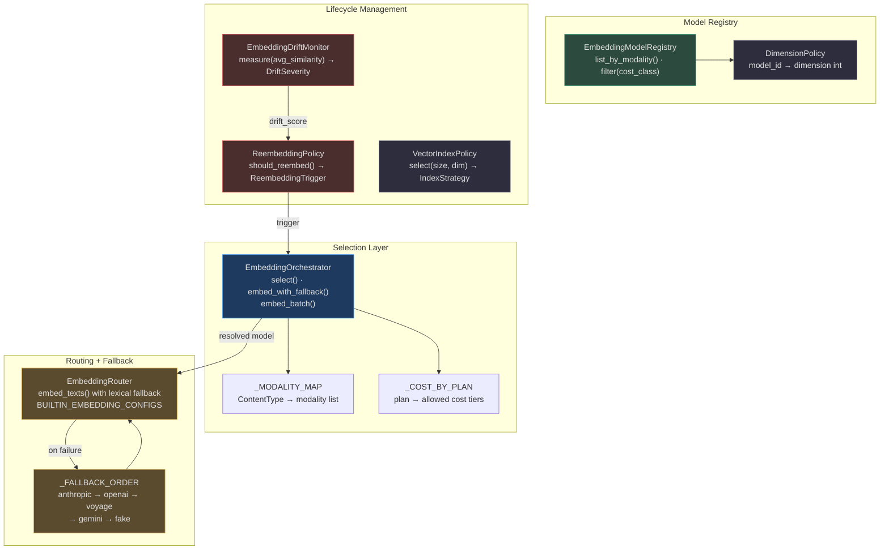
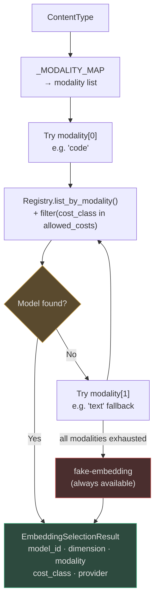
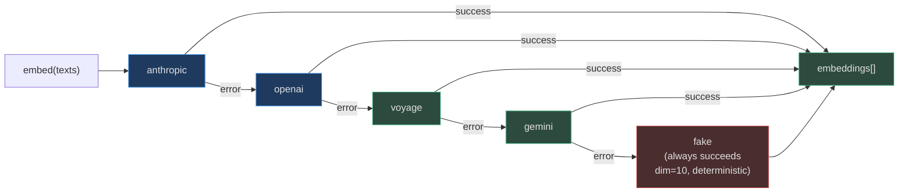
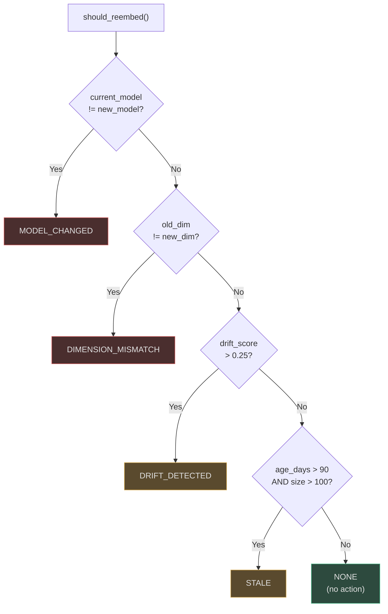
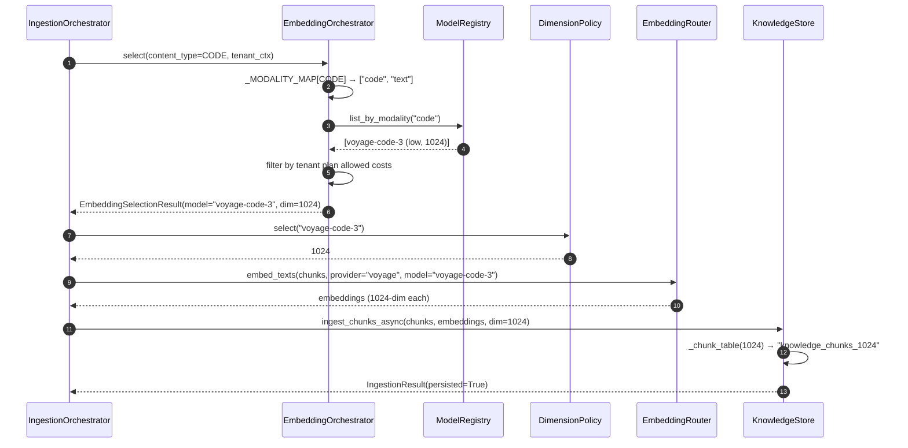

# Embedding System

The embedding system is responsible for converting content into dense vector representations for semantic search. It abstracts over multiple providers (OpenAI, Voyage, Gemini, Anthropic, and a deterministic fake for testing), selects the right model based on content type and tenant plan, and handles provider failures through an ordered fallback chain.

---

## Architecture Overview



<!-- Sources: app/embedding/orchestrator.py:1-80, app/embedding/router.py:1-80, app/embedding/model_registry.py:1-55, app/embedding/drift_monitor.py:1-35, app/embedding/reembedding_policy.py:1-50 -->

---

## Embedding Model Registry

**Class**: `EmbeddingModelRegistry` — [`app/embedding/model_registry.py:16`](https://github.com/harsh786/agent-verse/blob/main/agent-verse-backend/app/embedding/model_registry.py#L16)

### Default Models (`build_default()`)

| `model_id` | Provider | Modality | Dimension | Cost Class | Max Tokens | Source |
|---|---|---|---|---|---|---|
| `text-embedding-3-small` | `openai` | `text` | **1 536** | `low` | 8 192 | [model_registry.py:37](https://github.com/harsh786/agent-verse/blob/main/agent-verse-backend/app/embedding/model_registry.py#L37) |
| `text-embedding-3-large` | `openai` | `text` | **3 072** | `medium` | 8 192 | [model_registry.py:39](https://github.com/harsh786/agent-verse/blob/main/agent-verse-backend/app/embedding/model_registry.py#L39) |
| `voyage-3-lite` | `voyage` | `text` | **1 024** | `low` | 8 192 | [model_registry.py:41](https://github.com/harsh786/agent-verse/blob/main/agent-verse-backend/app/embedding/model_registry.py#L41) |
| `voyage-code-3` | `voyage` | `code` | **1 024** | `low` | 8 192 | [model_registry.py:43](https://github.com/harsh786/agent-verse/blob/main/agent-verse-backend/app/embedding/model_registry.py#L43) |
| `voyage-multimodal-3` | `voyage` | `multimodal` | **1 024** | `medium` | 8 192 | [model_registry.py:45](https://github.com/harsh786/agent-verse/blob/main/agent-verse-backend/app/embedding/model_registry.py#L45) |
| `fake-embedding` | `fake` | `text` | **10** | `free` | — | [model_registry.py:47](https://github.com/harsh786/agent-verse/blob/main/agent-verse-backend/app/embedding/model_registry.py#L47) |

### EmbeddingRouter Built-in Configs

The `EmbeddingRouter` also maintains its own `BUILTIN_EMBEDDING_CONFIGS` with per-1k token cost:

| Router Key | Dimension | Cost/1k tokens |
|---|---|---|
| `openai/text-embedding-3-large` | 3 072 | $0.00013 |
| `openai/text-embedding-3-small` | 1 536 | $0.00002 |
| `voyage/voyage-3-large` | 1 024 | $0.00018 |
| `voyage/voyage-3-lite` | 512 | $0.000016 |
| `gemini/text-embedding-004` | 768 | $0.00000 (free) |

Source: [`app/embedding/router.py:17-33`](https://github.com/harsh786/agent-verse/blob/main/agent-verse-backend/app/embedding/router.py#L17)

### Dimension Policy

**Class**: `DimensionPolicy` — [`app/embedding/dimension_policy.py`](https://github.com/harsh786/agent-verse/blob/main/agent-verse-backend/app/embedding/dimension_policy.py)

Maps `model_id → dimension` for the pgvector table routing:

```python
# Source: app/embedding/dimension_policy.py:6-14
_DIMENSION_MAP = {
    "text-embedding-3-small": 1536,
    "text-embedding-3-large": 3072,
    "voyage-3-lite":          1024,
    "voyage-code-3":          1024,
    "voyage-multimodal-3":    1024,
    "fake-embedding":         10,
}
```

Only four dimensions are supported by the database schema: `{768, 1024, 1536, 3072}`. Dimensions outside this set raise `ValueError` in `_chunk_table()`.

---

## Selection Logic

**Class**: `EmbeddingOrchestrator.select()` — [`app/embedding/orchestrator.py:62`](https://github.com/harsh786/agent-verse/blob/main/agent-verse-backend/app/embedding/orchestrator.py#L62)

### Modality Map

Content types are mapped to **ordered modality preference lists**:

| `ContentType` | Modality Preference Order |
|---|---|
| `TEXT`, `MARKDOWN`, `PDF`, `DOCX`, `HTML`, `CSV`, `JSON` | `["text"]` |
| `CODE` | `["code", "text"]` |
| `IMAGE` | `["multimodal", "image", "text"]` |
| `AUDIO` | `["text"]` — transcript is embedded, not the audio |
| `VIDEO` | `["multimodal", "text"]` |

Source: [`app/embedding/orchestrator.py:16-28`](https://github.com/harsh786/agent-verse/blob/main/agent-verse-backend/app/embedding/orchestrator.py#L16)

### Cost Tier by Plan

| Tenant Plan | Allowed Cost Classes |
|---|---|
| `free` | `free`, `low` |
| `starter` | `free`, `low` |
| `professional` | `free`, `low`, `medium` |
| `enterprise` | `free`, `low`, `medium`, `high` |

Source: [`app/embedding/orchestrator.py:30-35`](https://github.com/harsh786/agent-verse/blob/main/agent-verse-backend/app/embedding/orchestrator.py#L30)

### Selection Flowchart



<!-- Sources: app/embedding/orchestrator.py:62-95 -->

`EmbeddingSelectionResult` carries a `selection_reason` string explaining why this model was chosen — useful for debugging unexpected model selection.

---

## Fallback Chain

**Method**: `embed_with_fallback()` — tries providers in `_FALLBACK_ORDER` until one succeeds.

```
_FALLBACK_ORDER = ["anthropic", "openai", "voyage", "gemini", "fake"]
```

Source: [`app/embedding/orchestrator.py:39`](https://github.com/harsh786/agent-verse/blob/main/agent-verse-backend/app/embedding/orchestrator.py#L39)



<!-- Sources: app/embedding/orchestrator.py:39-80 -->

### `embed_batch()` Behaviour

`embed_batch()` splits the input texts into sub-batches of `_DEFAULT_BATCH_SIZE=32` and applies the fallback chain **per batch**. A `BatchEmbeddingResult` carries:
- `embeddings`: all successful vectors
- `errors`: per-batch error messages for any failed batches
- `model_id` and `provider`: the model that succeeded

### EmbeddingRouter — Lexical Fallback

`EmbeddingRouter.embed_texts()` also implements a **lexical (TF-IDF) fallback** when `fallback_lexical=True` (default). If all LLM providers fail and the fake provider is also unavailable, term-frequency vectors are returned. This is a last-resort — dimensions are unpredictable and not suitable for production retrieval.

---

## Provider Comparison

| Provider | Models | Strengths | Availability Requirement |
|---|---|---|---|
| **OpenAI** | `text-embedding-3-small`, `text-embedding-3-large` | Strong general-purpose text | `OPENAI_API_KEY` env var |
| **Voyage** | `voyage-3-lite`, `voyage-code-3`, `voyage-multimodal-3` | Best-in-class code + multimodal | `VOYAGE_API_KEY` env var |
| **Gemini** | `text-embedding-004` | Free tier, solid multilingual | `GOOGLE_API_KEY` env var |
| **Anthropic** | (listed in fallback; not in default registry) | Claude-aligned embeddings | `ANTHROPIC_API_KEY` env var |
| **Fake** | `fake-embedding` (dim=10) | Tests + offline dev, always deterministic | None — always available |

---

## Drift Monitoring

**Class**: `EmbeddingDriftMonitor` — [`app/embedding/drift_monitor.py`](https://github.com/harsh786/agent-verse/blob/main/agent-verse-backend/app/embedding/drift_monitor.py)

Drift is measured as the **average cosine similarity** between newly embedded chunks and the collection baseline. A drop in average similarity indicates distribution shift (model change, domain shift, or data corruption).

### Drift Severity Thresholds

| `avg_similarity` | `DriftSeverity` | Action |
|---|---|---|
| ≥ 0.85 | `STABLE` | No action needed |
| ≥ 0.70 | `LOW` | Monitor |
| ≥ 0.55 | `MEDIUM` | Schedule reembedding |
| ≥ 0.40 | `HIGH` | Trigger reembedding soon |
| < 0.40 | `CRITICAL` | Immediate reembedding required |

`drift_score(avg_similarity) = max(0.0, min(1.0, 1.0 − avg_similarity))`

Source: [`app/embedding/drift_monitor.py:14-28`](https://github.com/harsh786/agent-verse/blob/main/agent-verse-backend/app/embedding/drift_monitor.py#L14)

---

## Reembedding Policy

**Class**: `ReembeddingPolicy` — [`app/embedding/reembedding_policy.py`](https://github.com/harsh786/agent-verse/blob/main/agent-verse-backend/app/embedding/reembedding_policy.py)

Decides *when* to re-embed an entire collection based on four trigger conditions:



<!-- Sources: app/embedding/reembedding_policy.py:18-50 -->

| Trigger | Condition | Typical Cause |
|---|---|---|
| `MODEL_CHANGED` | `current_model != new_model` | Upgrading from `voyage-3-lite` to `voyage-code-3` |
| `DIMENSION_MISMATCH` | `old_dim != new_dim` | Switching from 1536-dim to 3072-dim model |
| `DRIFT_DETECTED` | `drift_score > 0.25` | Training data shift in upstream model |
| `STALE` | `age_days > 90 AND collection_size > 100` | Long-lived collection with potential model improvements |
| `NONE` | All checks pass | No reembedding needed |

Source: [`app/embedding/reembedding_policy.py:18-40`](https://github.com/harsh786/agent-verse/blob/main/agent-verse-backend/app/embedding/reembedding_policy.py#L18)

---

## Vector Index Strategy

**Class**: `VectorIndexPolicy` — [`app/embedding/vector_index_policy.py`](https://github.com/harsh786/agent-verse/blob/main/agent-verse-backend/app/embedding/vector_index_policy.py)

Selects the PostgreSQL pgvector index type based on collection size:

| Collection Size | Index Strategy | Notes |
|---|---|---|
| < 1 000 chunks | `EXACT` (brute-force) | Full sequential scan — optimal for small collections |
| 1 000 – 100 000 | `HNSW` | Hierarchical Navigable Small World — best recall/speed tradeoff |
| ≥ 100 000 | `IVF` | Inverted File Index — best throughput for large collections |

Supported dimensions: `{768, 1024, 1536, 3072}`. Any dimension outside this set is rejected by `is_supported_dimension()`.

`is_dimension_compatible(old_dim, new_dim) → bool` — returns `True` only when dimensions are identical. Dimension changes always require schema migration.

Source: [`app/embedding/vector_index_policy.py:12-28`](https://github.com/harsh786/agent-verse/blob/main/agent-verse-backend/app/embedding/vector_index_policy.py#L12)

---

## Dimension and Cost Reference

| Model | Provider | Dim | Cost Class | $/1k tokens | Modality | Plan Required |
|---|---|---|---|---|---|---|
| `fake-embedding` | fake | 10 | free | $0 | text | Any |
| `gemini/text-embedding-004` | gemini | 768 | free | $0 | text | Any |
| `voyage-3-lite` | voyage | 1 024 | low | $0.000016 | text | free+ |
| `voyage-code-3` | voyage | 1 024 | low | ~low | code | free+ |
| `openai/text-embedding-3-small` | openai | 1 536 | low | $0.00002 | text | free+ |
| `voyage-multimodal-3` | voyage | 1 024 | medium | ~medium | multimodal | professional+ |
| `openai/text-embedding-3-large` | openai | 3 072 | medium | $0.00013 | text | professional+ |

---

## End-to-End Embedding Flow



<!-- Sources: app/embedding/orchestrator.py:62-95, app/embedding/router.py:50-80, app/embedding/dimension_policy.py:6-14, app/rag/store.py:21-29 -->

---

## Related Pages

| Page | Description |
|---|---|
| [Ingestion Pipeline](./ingestion-pipeline.md) | How content reaches the embedding step |
| [Knowledge & KG](./knowledge-and-kg.md) | Where embeddings are stored in pgvector |
| [RAG System](./rag-system.md) | How query embeddings are used for retrieval |
