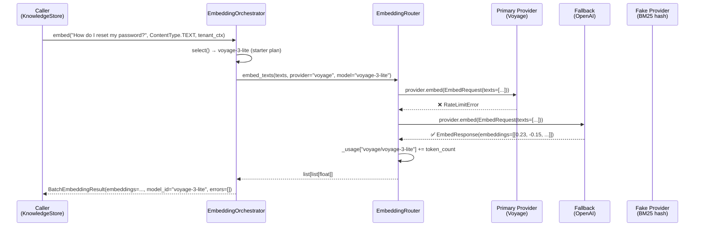

# Provider Abstraction

The embedding provider abstraction ensures that the rest of the system never cares _which_
vendor is producing the vectors — it only cares that it receives a `list[list[float]]`.
This separation allows providers to be swapped, upgraded, or price-optimised without
touching the retrieval, caching, or drift-monitoring code.

## The Provider Protocol

All providers satisfy the `LLMProvider` structural protocol defined in `app/providers/base.py`.
For embedding, the critical method is:

```python
# app/providers/base.py
@dataclass
class EmbedRequest:
    texts: list[str]

@dataclass
class EmbedResponse:
    embeddings: list[list[float]]

class LLMProvider(Protocol):
    async def embed(self, request: EmbedRequest) -> EmbedResponse: ...
```

No inheritance is required — any class implementing `embed()` qualifies. This duck-typed
approach lets third-party provider adapters integrate without modifying the core codebase.

## EmbeddingRouter

`app/embedding/router.py` is the lowest-level component: it calls `provider.embed()` and
returns raw vectors. It also tracks per-model usage and error counts for observability.

### Built-in Configurations

```python
BUILTIN_EMBEDDING_CONFIGS = {
    "openai/text-embedding-3-large": EmbeddingConfig(
        provider="openai", model="text-embedding-3-large",
        dimension=3072, max_batch_size=100, max_tokens=8192, cost_per_1k=0.00013
    ),
    "openai/text-embedding-3-small": EmbeddingConfig(
        provider="openai", model="text-embedding-3-small",
        dimension=1536, max_batch_size=100, max_tokens=8192, cost_per_1k=0.00002
    ),
    "voyage/voyage-3-large": EmbeddingConfig(
        provider="voyage", model="voyage-3-large",
        dimension=1024, cost_per_1k=0.00018
    ),
    "voyage/voyage-3-lite": EmbeddingConfig(
        provider="voyage", model="voyage-3-lite",
        dimension=512, cost_per_1k=0.000016
    ),
    "gemini/text-embedding-004": EmbeddingConfig(
        provider="gemini", model="text-embedding-004",
        dimension=768, cost_per_1k=0.00000  # Free
    ),
}
```

### Lexical Fallback

When all real providers fail, `EmbeddingRouter._lexical_embed()` generates a
**deterministic sparse vector** using character-level hashing into 384 dimensions.
This guarantees the system returns _something_ rather than crashing — though quality
drops significantly.

```python
def _lexical_embed(self, text: str, dim: int = 384) -> list[float]:
    vec = [0.0] * dim
    for word in text.lower().split():
        idx = hash(word) % dim
        vec[idx] += 1.0
    norm = math.sqrt(sum(x * x for x in vec)) or 1.0
    return [x / norm for x in vec]
```

## EmbeddingOrchestrator

`app/embedding/orchestrator.py` sits above the router and adds **content-type routing**
and **tenant plan gating**. It maps incoming content types to embedding modalities, then
selects the best affordable model for the tenant.

### Content Type → Modality Mapping

```python
_MODALITY_MAP = {
    ContentType.TEXT:     ["text"],
    ContentType.MARKDOWN: ["text"],
    ContentType.CODE:     ["code", "text"],   # try code first, fall back to text
    ContentType.PDF:      ["text"],
    ContentType.IMAGE:    ["multimodal", "image", "text"],
    ContentType.VIDEO:    ["multimodal", "text"],
    ContentType.AUDIO:    ["text"],            # transcript embedding
    ContentType.CSV:      ["text"],
    ContentType.JSON:     ["text"],
}
```

### Tenant Plan Cost Gates

```python
_COST_BY_PLAN = {
    "free":         ["free", "low"],
    "starter":      ["free", "low"],
    "professional": ["free", "low", "medium"],
    "enterprise":   ["free", "low", "medium", "high"],
}
```

When a `TenantContext` is available, the orchestrator filters the model registry to only
affordable cost classes, then picks the **highest-dimension** (highest quality) model
within budget.

### Model Selection Algorithm

```python
def select(self, content_type, tenant_ctx, collection_size=0) -> EmbeddingSelectionResult:
    modalities = _MODALITY_MAP.get(content_type, ["text"])
    allowed_costs = _COST_BY_PLAN.get(tenant_ctx.plan.value, ["low"])

    for modality in modalities:                        # preferred modality first
        candidates = registry.list_by_modality(modality)
        affordable = [c for c in candidates if c.cost_class in allowed_costs]
        if affordable:
            best = max(affordable, key=lambda m: m.dimension)  # highest quality
            return EmbeddingSelectionResult(...)
```

### Provider Fallback Chain

```python
_FALLBACK_ORDER = ["anthropic", "openai", "voyage", "gemini", "fake"]
```

`embed_with_fallback()` tries each provider in order, catching exceptions and advancing
to the next. The `fake` provider at the tail is always available — it never throws.

## Request → Vector Flow



## Provider Comparison

### Real-World Scenario 1: E-commerce Product Search

A fashion retailer uploads 2M product descriptions (text), 500K product images (multimodal),
and 50K inventory spreadsheets (CSV). Each content type routes independently:

| Content | ContentType | Selected Model (Professional Plan) | Dimension | Monthly Cost |
|---|---|---|---|---|
| Product descriptions | TEXT | voyage-3-large | 1024 | ~$72 |
| Product images | IMAGE | voyage-multimodal-3 | 1024 | ~$45 |
| Inventory CSVs | CSV | voyage-3-lite | 512 | ~$6 |
| **Total** | | | | **~$123/month** |

A naive approach using text-embedding-3-large for everything would cost $390/month —
**3x more for no quality gain** on images.

### Real-World Scenario 2: Software Company (Free Tier)

A startup on the free tier uploads their entire codebase (200K files, ContentType.CODE).
The orchestrator selects `voyage-code-3` (1024 dims, cost_class=low) — the only available
code-optimised model within the free tier budget. Code-specific models achieve ~25% better
precision on function retrieval compared to general text embeddings.

### Real-World Scenario 3: Provider Outage During Market Hours

A hedge fund runs AgentVerse during market open (9:30 AM ET). OpenAI experiences a 15-minute
outage. The fallback chain automatically routes through Voyage (same dimensions, compatible
index). The shift is transparent to the agent — goals continue executing without manual intervention.
Post-outage metrics show error_rate=0.12% for the 15-minute window.

## Observability

`EmbeddingRouter.get_drift_metrics()` returns:

```python
{
    "total_tokens_embedded": 48_312_000,
    "total_errors": 234,
    "error_rate": 0.0048,       # 0.48% — acceptable, triggers page if > 1%
    "models_used": ["openai/text-embedding-3-small", "voyage/voyage-3-lite"],
    "usage_by_model": {"openai/text-embedding-3-small": 45_000_000, ...},
    "errors_by_model": {"openai/text-embedding-3-small": 234},
}
```

These metrics feed into the Drift Monitor (see [03-drift-and-reembedding.md](./03-drift-and-reembedding.md)).

<!-- Sources: app/embedding/router.py, app/embedding/orchestrator.py, app/providers/base.py -->
