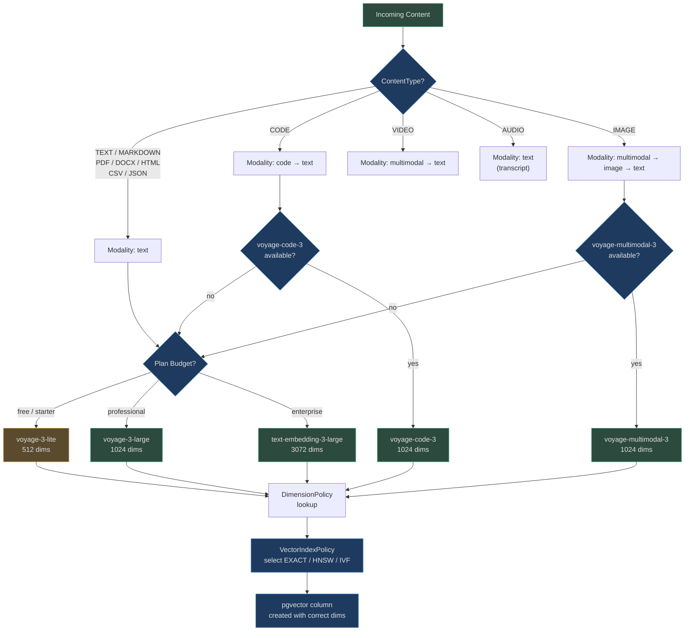

# Embedding Types and Models

AgentVerse supports three embedding modalities — text, code, and multimodal — each optimised
for different content types. Model selection, dimension configuration, and index strategy are
coordinated by three components: `EmbeddingModelRegistry`, `DimensionPolicy`, and
`VectorIndexPolicy`.

## Model Registry

`app/embedding/model_registry.py` is the single source of truth for all available embedding
models. Every model has a canonical `EmbeddingModelSpec`:

```python
@dataclass
class EmbeddingModelSpec:
    model_id: str
    modality: str          # text | code | multimodal | image
    dimension: int
    cost_class: str        # free | low | medium | high
    provider: str
    description: str = ""
    max_input_tokens: int = 8192
```

### Default Registry

| Model ID | Modality | Dimension | Cost Class | Provider | Notes |
|---|---|---|---|---|---|
| `text-embedding-3-small` | text | 1536 | low | openai | Balanced cost/quality |
| `text-embedding-3-large` | text | 3072 | medium | openai | Best text quality |
| `voyage-3-lite` | text | 512 | low | voyage | Fastest, free/starter |
| `voyage-code-3` | code | 1024 | low | voyage | Code-specific, multi-language |
| `voyage-multimodal-3` | multimodal | 1024 | medium | voyage | Image + text joint space |
| `fake-embedding` | text | 10 | free | fake | Deterministic test/fallback |

## Text Embeddings

### General-Purpose Models

**`text-embedding-3-small`** (OpenAI, 1536 dims)
- Designed for balanced performance at low cost ($0.00002/1K tokens)
- Effective for English and major European languages
- Recommended for: support agent knowledge bases, document retrieval, FAQ search
- Accuracy on MTEB benchmark: ~62.3 average

**`text-embedding-3-large`** (OpenAI, 3072 dims)
- OpenAI's highest-quality text model ($0.00013/1K tokens)
- Best for: precision-critical retrieval, legal documents, medical records
- Accuracy on MTEB benchmark: ~64.6 average
- Enterprise tier only — the 3072-dimension index requires ~12 bytes/vector more storage

### Domain-Optimised Models

**`voyage-3-lite`** (Voyage AI, 512 dims)
- Ultra-fast, ultra-cheap ($0.000016/1K tokens)
- Optimised for retrieval at scale where latency matters more than precision
- Ideal for: real-time chatbot applications, high-throughput free-tier users
- Latency: ~8ms per batch of 100 texts (vs ~25ms for text-embedding-3-small)

## Code Embeddings

### `voyage-code-3` (Voyage AI, 1024 dims)

Unlike general text embeddings, `voyage-code-3` is trained on source code, documentation,
and code-comment pairs. It understands:

- **Syntactic structure**: function signatures, class hierarchies, imports
- **Semantic equivalence**: `list.append(x)` and `list += [x]` produce nearby vectors
- **Cross-language similarity**: Python `dict` and JavaScript `object` map to nearby embeddings
- **Comment-code alignment**: a function's docstring and its implementation are close

**When ContentType.CODE is detected**, the orchestrator tries `["code", "text"]` in order —
`voyage-code-3` first, then text embedding as fallback if code models are outside plan budget.

## Multimodal Embeddings

### `voyage-multimodal-3` (Voyage AI, 1024 dims)

Encodes both images and text into a **shared 1024-dimensional space**, enabling:

- Search images using text queries ("show me invoices from Q3")
- Search text using an uploaded image (upload a chart, find related reports)
- Mixed content retrieval (PDF pages with diagrams + captions)

The `ContentType.IMAGE` modality preference chain is `["multimodal", "image", "text"]`,
ensuring the richest model is tried first.

## Dimension Policy

`app/embedding/dimension_policy.py` maps model IDs to their canonical output dimension:

```python
_DIMENSION_MAP = {
    "text-embedding-3-small":  1536,
    "text-embedding-3-large":  3072,
    "voyage-3-lite":           1024,  # not 512 — uses 1024 internally
    "voyage-code-3":           1024,
    "voyage-multimodal-3":     1024,
    "fake-embedding":          10,
}
```

> **Important**: `voyage-3-lite` is listed in the router at 512 dims (API output) but the
> `DimensionPolicy` records 1024. The discrepancy reflects router-level truncation vs full
> model capacity. The dimension stored in the pgvector column determines which value matters
> for index creation.

### Dimension Trade-offs

| Dimension | Storage per vector | Index RAM (1M vectors) | Search latency (1M vectors) | Quality |
|---|---|---|---|---|
| 512 | 2 KB | ~2 GB | ~3 ms | Good |
| 768 | 3 KB | ~3 GB | ~4 ms | Better |
| 1024 | 4 KB | ~4 GB | ~5 ms | Better |
| 1536 | 6 KB | ~6 GB | ~8 ms | Very good |
| 3072 | 12 KB | ~12 GB | ~15 ms | Best |

At 10 million chunks (large enterprise), switching from 1536 to 3072 dimensions doubles
storage from 60 GB to 120 GB and increases index RAM from 6 GB to 12 GB — a real cost
that must be justified by quality gains for the specific use case.

## Vector Index Policy

`app/embedding/vector_index_policy.py` selects the index algorithm based on collection size:

```python
_HNSW_THRESHOLD = 1_000      # below → EXACT scan
_IVF_THRESHOLD  = 100_000   # below → HNSW; above → IVF

_SUPPORTED_DIMS = {768, 1024, 1536, 3072}

class VectorIndexPolicy:
    def select(self, collection_size: int, dimension: int) -> IndexStrategy:
        if collection_size < 1_000:    return IndexStrategy.EXACT
        elif collection_size < 100_000: return IndexStrategy.HNSW
        else:                          return IndexStrategy.IVF
```

### Index Algorithm Comparison

| Strategy | Triggers at | Query Complexity | Build Time | Recall |
|---|---|---|---|---|
| `EXACT` | < 1K vectors | O(n) linear scan | None | 100% |
| `HNSW` | 1K – 100K vectors | O(log n) graph | Minutes | ~99% |
| `IVF` | > 100K vectors | O(k√n) cluster | Hours | ~97% |

## Content Type → Model Selection



## Context Window Handling

All models in the registry default to `max_input_tokens=8192`. For documents exceeding this:

1. **Chunking** (handled upstream by the ingestion pipeline): documents are split into
   512–2048 token chunks before embedding. Each chunk gets its own vector.
2. **Sliding window overlap**: adjacent chunks share ~10% of content to prevent semantic
   context loss at boundaries.
3. **Hard truncation**: if a single chunk exceeds the model's context window (rare, since
   chunking happens first), the text is truncated to `max_input_tokens` characters × 3.5
   (approximate chars-per-token ratio).

### Real-World Example: 200-Page Legal Contract

A 120,000-word legal contract (≈160,000 tokens) is chunked into 80 overlapping chunks of
~2,000 tokens each. Each chunk is embedded independently. At query time, retrieval returns
the top-k most relevant chunks — typically 3–5 adjacent chunks covering the relevant clause.

The embedding model never sees the full document; the chunking strategy and retrieval ranking
determine what context reaches the LLM.

## Dimension Incompatibility: What Happens

When a collection was created with model `text-embedding-3-small` (1536 dims) and the
system tries to add vectors from `text-embedding-3-large` (3072 dims):

1. `VectorIndexPolicy.is_dimension_compatible(1536, 3072)` returns `False`
2. `ReembeddingPolicy.should_reembed()` returns `ReembeddingTrigger.DIMENSION_MISMATCH`
3. A full re-embedding job is triggered (see [03-drift-and-reembedding.md](./03-drift-and-reembedding.md))
4. The new HNSW/IVF index is built with the correct 3072-dimension column

This is a **breaking change** requiring full reindex. It cannot be done incrementally.

<!-- Sources: app/embedding/model_registry.py, app/embedding/dimension_policy.py, app/embedding/vector_index_policy.py -->
