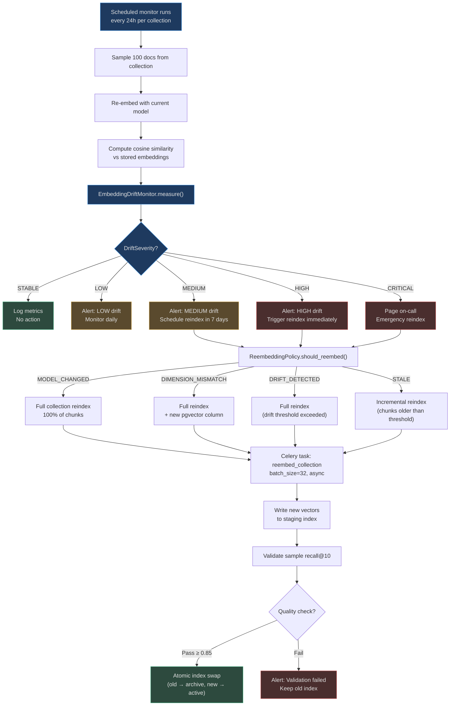

# Drift Detection and Re-embedding

Embedding models are not static. Providers release improved versions — Voyage v2 might
produce vectors that are 15% different from v1 for the same text. If a collection was
indexed with the old model and retrieval now uses the new model, **cosine similarity breaks**:
queries match to wrong or irrelevant chunks despite being semantically correct.

Drift monitoring detects this degradation early. The re-embedding policy decides what to do
about it. Together they form an automated feedback loop that keeps vector indexes aligned
with the active embedding model.

## What Is Embedding Drift?

Drift occurs when the geometric relationship between vectors in a collection no longer
reflects true semantic similarity. It has two causes:

1. **Model update**: the provider releases a new checkpoint with different weight initialization
   or training data, producing subtly different vector geometry.
2. **Domain shift**: the knowledge base content changes significantly (e.g., a company
   adds 500K new documents from a new vertical), but the model was not retrained on this domain.

### Measuring Drift: Cosine Similarity

The `EmbeddingDriftMonitor` measures the **average cosine similarity** between the old and
new embedding of the same text for a sample of documents:

```python
class EmbeddingDriftMonitor:
    def measure(self, avg_similarity: float, sample_size: int = 100) -> DriftSeverity:
        if avg_similarity >= 0.85:  return DriftSeverity.STABLE
        elif avg_similarity >= 0.70: return DriftSeverity.LOW
        elif avg_similarity >= 0.55: return DriftSeverity.MEDIUM
        elif avg_similarity >= 0.40: return DriftSeverity.HIGH
        else:                        return DriftSeverity.CRITICAL

    def drift_score(self, avg_similarity: float) -> float:
        return max(0.0, min(1.0, 1.0 - avg_similarity))
```

A cosine similarity of 1.0 means identical vectors (no drift). A value of 0.40 means
HIGH drift — about 40% of the semantic geometry has changed. Below 0.40 is CRITICAL:
retrieval quality has collapsed to near-random.

### Drift Severity Reference

| Severity | Avg Cosine Similarity | Drift Score | Meaning | Action |
|---|---|---|---|---|
| STABLE | ≥ 0.85 | ≤ 0.15 | Negligible change | None |
| LOW | 0.70 – 0.85 | 0.15 – 0.30 | Minor shift | Monitor closely |
| MEDIUM | 0.55 – 0.70 | 0.30 – 0.45 | Noticeable degradation | Schedule reindex |
| HIGH | 0.40 – 0.55 | 0.45 – 0.60 | Significant quality loss | Trigger reindex now |
| CRITICAL | < 0.40 | > 0.60 | Near-random retrieval | Emergency reindex |

## Re-embedding Policy

`app/embedding/reembedding_policy.py` has a single decision method that evaluates four
independent triggers in priority order:

```python
class ReembeddingPolicy:
    def should_reembed(
        self,
        current_model: str,
        new_model: str,
        collection_size: int,
        drift_score: float = 0.0,        # from DriftMonitor.drift_score()
        age_days: int = 0,
        staleness_threshold_days: int = 90,
        old_dim: int | None = None,
        new_dim: int | None = None,
    ) -> ReembeddingTrigger:
        if current_model != new_model:
            return ReembeddingTrigger.MODEL_CHANGED    # highest priority
        if old_dim is not None and new_dim is not None and old_dim != new_dim:
            return ReembeddingTrigger.DIMENSION_MISMATCH
        if drift_score > 0.25:                         # > 25% semantic shift
            return ReembeddingTrigger.DRIFT_DETECTED
        if age_days > staleness_threshold_days and collection_size > 100:
            return ReembeddingTrigger.STALE
        return ReembeddingTrigger.NONE
```

### Trigger Priority

| Priority | Trigger | Condition | Effect |
|---|---|---|---|
| 1st | `MODEL_CHANGED` | `current_model != new_model` | Full reindex required |
| 2nd | `DIMENSION_MISMATCH` | `old_dim != new_dim` | Full reindex (breaking change) |
| 3rd | `DRIFT_DETECTED` | `drift_score > 0.25` | Full or incremental reindex |
| 4th | `STALE` | `age_days > 90 AND size > 100` | Scheduled reindex |
| — | `NONE` | No trigger matches | No action |

## Re-embedding Lifecycle



## Handling Dimension Mismatches

A dimension mismatch is the most disruptive form of re-embedding. When the new model
produces different dimensions than the existing pgvector column, the process is:

1. **Detect**: `VectorIndexPolicy.is_dimension_compatible(old_dim, new_dim)` returns `False`
2. **Create shadow column**: a new pgvector column (`embedding_v2`) is added to the table
3. **Backfill in batches**: `embed_batch()` processes chunks in groups of 32
4. **Build new index**: HNSW or IVF built on `embedding_v2`
5. **Validate**: run recall@10 against a held-out query set
6. **Atomic rename**: `embedding` → `embedding_v1_archive`, `embedding_v2` → `embedding`
7. **Drop old**: after 7-day observation window

This zero-downtime migration means retrieval continues using the old index during backfill.

## Cost of Re-embedding at Scale

Re-embedding a large collection has a real cost. Formula:

```
reembed_cost = (total_chunks × avg_tokens_per_chunk / 1000) × cost_per_1k
```

| Collection Size | Avg Chunk Tokens | Model | Cost/1K tokens | Reembed Cost | Time (32 batch) |
|---|---|---|---|---|---|
| 100K chunks | 512 tokens | voyage-3-lite | $0.000016 | **$0.82** | ~2 hours |
| 1M chunks | 512 tokens | voyage-3-lite | $0.000016 | **$8.19** | ~20 hours |
| 10M chunks | 512 tokens | voyage-3-lite | $0.000016 | **$81.92** | ~8 days |
| 10M chunks | 512 tokens | text-embedding-3-large | $0.00013 | **$665** | ~8 days |

For 10M-chunk enterprise collections, re-embedding with a premium model is a significant
infrastructure event requiring advance planning and budget approval.

## Real-World Examples

### Example 1: Voyage v2 Model Release

A legal tech firm has indexed 5M contract chunks with `voyage-3-lite`. Voyage AI releases
`voyage-3-large` (same 1024 dims, better quality). The daily drift monitor samples 100 chunks:

- `avg_similarity = 0.71` → DriftSeverity.LOW
- `drift_score = 0.29` → exceeds threshold 0.25
- `should_reembed()` → `DRIFT_DETECTED`
- Scheduled reindex triggered over the next weekend
- New model achieves recall@10 improvement from 78% → 89%

### Example 2: Plan Upgrade Triggering Model Change

A company upgrades from `starter` to `professional` plan. The system can now use
`voyage-3-large` instead of `voyage-3-lite`. Both are 1024 dims — no dimension mismatch.

- `current_model = "voyage-3-lite"`, `new_model = "voyage-3-large"`
- `should_reembed()` → `MODEL_CHANGED` (different model IDs)
- Full reindex triggered; cost ≈ $8 for 1M chunks
- Retrieval quality improvement justifies the one-time cost

### Example 3: Stale Collection After 3 Months Inactivity

A team stops adding documents for 120 days. The staleness monitor fires:

- `age_days = 120 > staleness_threshold_days = 90`
- `collection_size = 250 > 100` (minimum threshold)
- `should_reembed()` → `STALE`
- Incremental reindex of chunks older than 90 days (scheduled for off-peak hours)

<!-- Sources: app/embedding/drift_monitor.py, app/embedding/reembedding_policy.py, app/embedding/vector_index_policy.py -->
