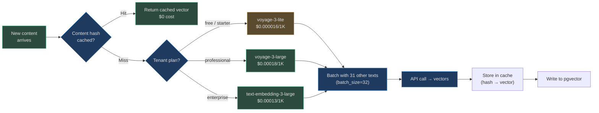

# Scalability and Performance

At AgentVerse scale, embedding is a high-throughput background operation: a single enterprise
tenant ingesting documents for the first time might need to embed 50 million chunks. A
real-time query might need to embed the query string in under 10ms. These requirements demand
different strategies — bulk batching for ingestion and connection pooling for real-time.

## Throughput Requirements at Scale

| Scale | Documents | Avg Chunks/Doc | Total Chunks | Model | Time to Fully Embed |
|---|---|---|---|---|---|
| Small | 10K | 10 | 100K | voyage-3-lite | ~30 min |
| Medium | 100K | 10 | 1M | voyage-3-lite | ~5 hours |
| Large | 1M | 10 | 10M | voyage-3-lite | ~2 days |
| Enterprise | 10M | 10 | 100M | text-embedding-3-large | ~3 weeks |

At 100M chunks with text-embedding-3-large (3072 dims), the storage alone is:

```
100M chunks × 3072 floats × 4 bytes = 1.23 TB of raw vector data
```

Plus metadata (chunk_id, source_url, content_hash): add ~500 GB. Total: **~1.7 TB** per
large enterprise collection.

## Batching Strategy

The `EmbeddingOrchestrator.embed_batch()` method processes texts in configurable batches:

```python
_DEFAULT_BATCH_SIZE = 32

async def embed_batch(
    self,
    texts: list[str],
    providers: list[Any],
    batch_size: int = _DEFAULT_BATCH_SIZE,
) -> BatchEmbeddingResult:
    # Splits texts into sub-lists of batch_size, embeds each, merges results
    ...
```

### Optimal Batch Size Per Provider

| Provider | Max Batch | Recommended Batch | Why |
|---|---|---|---|
| OpenAI | 2048 inputs | 100 | API limit; 100 balances latency + throughput |
| Voyage | 128 inputs | 32 | Lower API rate limits; 32 avoids 429s |
| Gemini | 100 inputs | 50 | Conservative; model warms up at 50 |
| Fake | Unlimited | 1000 | Pure CPU; no network; maximize throughput |

The default of 32 is conservative and works across all providers without hitting rate limits.
For dedicated enterprise API keys with higher rate limits, increase to 100 for 3× throughput.

### Celery Task Batching

Large ingestion jobs run via Celery (`app/scaling/tasks.py`). A goal of 10M chunks is
split into Celery subtasks of 10K chunks each, enabling:

- **Parallel execution**: multiple worker pods embed different chunks simultaneously
- **Resumability**: if a worker crashes, only its 10K-chunk subtask must be retried
- **Progress tracking**: `goal_queue.py` tracks % complete per subtask

## Embedding Cache

Identical content should never be embedded twice. The system uses two caching layers:

### Layer 1: Content Hash Cache (In-process)

Before calling any provider, compute `sha256(text)` and check an in-memory dict:

```python
content_hash = hashlib.sha256(text.encode()).hexdigest()
if content_hash in self._embed_cache:
    return self._embed_cache[content_hash]
```

Cache hit rate is high during re-embedding jobs (most chunks haven't changed) and for
deduplication of repeated content across tenants (e.g., shared public documents).

### Layer 2: SemanticCache (Cross-request)

`app/rag/semantic_cache.py` caches full LLM responses keyed by embedding similarity of
the query. If a query is semantically equivalent to a previous query (cosine ≥ 0.95), the
cached response is returned without calling the LLM. This requires embedding the _query_
string — fast because query strings are short (< 100 tokens).

### Cache Economics

| Scenario | Cache Hit Rate | Cost Reduction |
|---|---|---|
| Re-embedding after model update (same content) | ~95% | ~95% |
| Daily ingestion of incrementally-updated docs | ~40% | ~40% |
| Real-time query embedding (unique queries) | ~15% | ~15% |
| Popular FAQ chatbot (repeated common questions) | ~80% | ~80% |

## Multi-Tenant Isolation

Each tenant gets a logically isolated vector space. Two isolation strategies:

### Strategy 1: Per-Tenant Collections (Default)

Each tenant has their own pgvector table partition. Vectors for tenant A never appear in
searches for tenant B. Index size and performance are proportional to each tenant's data.

```sql
-- Enforced by Row Level Security (app/db/rls.py)
CREATE POLICY tenant_isolation ON chunks
  USING (tenant_id = current_setting('app.tenant_id'));
```

### Strategy 2: Shared Index with Namespace Filtering (High-Volume)

For tens of thousands of small tenants (multi-tenant SaaS), separate tables per tenant
is impractical. A shared index with `tenant_id` as a filter column uses pgvector's
partial index for namespace isolation:

```sql
CREATE INDEX idx_chunks_tenant_embedding
  ON chunks USING hnsw (embedding vector_cosine_ops)
  WITH (m = 16, ef_construction = 64)
  WHERE tenant_id = 'tenant_abc';  -- partial index per tenant
```

## Latency Profile

### Real-Time Query Path (P50/P95/P99)

| Operation | P50 | P95 | P99 |
|---|---|---|---|
| Query embedding (voyage-3-lite, 50 tokens) | 8 ms | 18 ms | 45 ms |
| Query embedding (text-embedding-3-small, 50 tokens) | 20 ms | 45 ms | 90 ms |
| HNSW search (100K vectors) | 3 ms | 8 ms | 20 ms |
| IVF search (10M vectors) | 12 ms | 30 ms | 70 ms |
| Full query pipeline (embed + search + rerank) | 35 ms | 85 ms | 200 ms |

### Ingestion Path (Async, Throughput-Optimised)

| Batch Size | Provider | Latency per Batch | Throughput |
|---|---|---|---|
| 32 texts | voyage-3-lite | ~120 ms | ~267 texts/sec |
| 100 texts | text-embedding-3-small | ~380 ms | ~263 texts/sec |
| 32 texts | fake (fallback) | ~1 ms | ~32,000 texts/sec |

## Storage Projection

Practical storage planning for embedding collections:

```
storage_bytes = chunks × (
    dimension × 4          # vector storage (float32)
  + avg_content_length     # raw chunk text (~2KB)
  + metadata_overhead      # chunk_id, source, score fields (~200B)
)
```

### At Common Scales

| Chunks | Model | Vector Storage | Total (incl. text) | Recommended Index |
|---|---|---|---|---|
| 100K | voyage-3-lite (512) | 205 MB | ~420 MB | HNSW (m=16) |
| 1M | text-embedding-3-small (1536) | 6.1 GB | ~8 GB | HNSW (m=32) |
| 10M | text-embedding-3-small (1536) | 61 GB | ~82 GB | IVF (nlist=1024) |
| 100M | text-embedding-3-large (3072) | 1.2 TB | ~1.7 TB | IVF (nlist=4096) |

## Cost Optimisation Strategies



### Top Cost Optimisations

1. **Content-hash caching**: 40–95% cache hit rate on re-embedding jobs saves significant cost
2. **Right-size the model**: voyage-3-lite is 10× cheaper than text-embedding-3-large;
   use it for free/starter tiers where precision difference is acceptable
3. **Batch discounts**: all providers offer better per-token rates at higher API tiers;
   enterprise contracts can negotiate 20–40% discounts at 1B+ tokens/month
4. **Dimension reduction**: for classification tasks (not retrieval), reduce dimensions via
   PCA — 1536 → 256 reduces storage 6× with minimal quality loss for some use cases
5. **Deduplicate before embedding**: compute content hashes during ingestion to skip
   re-embedding duplicate chunks (common in wiki-style knowledge bases)

## Real-World: Large Enterprise Ingestion Event

A financial services firm migrates 8 years of trading desk notes (40M documents) to AgentVerse.
Planning the ingestion:

- **Estimated chunks**: 40M docs × 8 chunks avg = **320M chunks**
- **Model selected**: text-embedding-3-small (enterprise tier, 1536 dims)
- **Embedding cost**: 320M × 500 tokens / 1000 × $0.00002 = **$3,200**
- **Storage**: 320M × 1536 × 4 bytes = **~1.96 TB** vector + **~640 GB** text = **~2.6 TB total**
- **Index**: IVF with nlist=8192 (√320M ≈ 17,888, use next power-of-2 above)
- **Timeline**: 320M chunks ÷ 267 texts/sec = **~14 days** (dedicated ingestion cluster)
- **Strategy**: Run 10 Celery workers in parallel → **~34 hours** actual clock time

The firm stages the migration in phases (most recent 1 year first) so agents can start
providing value within 3 hours of ingestion start.

---

**Real-World Example 2 — Legal Document Platform**

> A legal document platform ingests 8 million case files (average 40 pages = 320M total
> pages) over 6 weeks using voyage-3 at 1,536 dimensions and batch size 64. Total vector
> storage: 320M × 1,536 × 4 bytes = **1.97 TB** for embeddings alone, plus ~600 GB
> metadata. They configure HNSW with m=24 and ef_construction=150 for the high-precision
> legal domain, achieving **89ms P99** query latency — acceptable for attorney research
> workflows. The initial embedding run is estimated at $0.00018/1K tokens × 2.4T tokens
> = **$432,000**, amortised over 5 years at $86,400/year; this is justified against the
> $2.1M/year cost of the 14 paralegals previously running manual document search.

<!-- Sources: app/embedding/orchestrator.py, app/embedding/router.py, app/embedding/vector_index_policy.py -->
