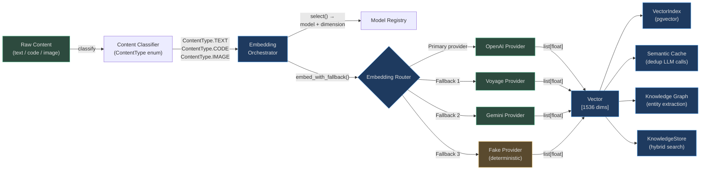

# Embedding System

Embeddings are the mathematical foundation of every semantic operation in AgentVerse.
A piece of text, code, or an image is converted to a dense vector of floating-point numbers
that captures **meaning** rather than keywords. Two semantically similar inputs produce vectors
that are geometrically close in high-dimensional space; unrelated inputs are far apart.

## Why Vendor-Agnostic Embedding Matters

Different providers excel at different tasks:

| Provider | Sweet Spot | Best Model | Cost/1M tokens |
|---|---|---|---|
| OpenAI | General English text | text-embedding-3-large | $0.13 |
| Voyage AI | Domain-specific, code, multilingual | voyage-3-large | $0.18 |
| Gemini | Free tier, multilingual | text-embedding-004 | $0.00 |
| Voyage | Code search, code completion | voyage-code-3 | low |

Locking into a single provider means **all workloads use the same model** regardless of
content type, cost constraints, or quality requirements. AgentVerse's embedding layer routes
each request to the optimal provider based on content type, tenant plan, and model availability.

## Architecture Overview



## Embedding Types Supported

### Text Embeddings
General-purpose semantic representations for natural language. Used for documentation
retrieval, Q&A, semantic search, and memory recall.

- **OpenAI text-embedding-3-small** — 1536 dimensions, low cost, best for balanced workloads
- **OpenAI text-embedding-3-large** — 3072 dimensions, highest quality, enterprise tier
- **Voyage voyage-3-lite** — 512 dimensions, fastest, lowest cost, free/starter tiers

### Code Embeddings
AST-aware models that understand syntax and semantics of programming languages.
Enables code search, duplicate detection, and code review automation.

- **Voyage voyage-code-3** — 1024 dimensions, optimised for source code across 80+ languages

### Multimodal Embeddings
Joint image+text embedding space. Enables searching images with text queries and vice versa.

- **Voyage voyage-multimodal-3** — 1024 dimensions, handles JPEG/PNG/PDF pages + text

## How Embeddings Connect to the Rest of AgentVerse

| Consumer | How Embeddings Are Used |
|---|---|
| **KnowledgeStore** | Hybrid dense (vector) + sparse (trigram) search over uploaded documents |
| **SemanticCache** | Deduplicates LLM calls — if a semantically similar query was asked before, return cached response |
| **Knowledge Graph** | Entity and relation extraction from embedded chunks |
| **ExecutionMemory** | Embeds step results to find relevant past context for replanning |
| **LongTermMemoryStore** | Cross-session learning — finds related past goals for new goal planning |
| **Drift Monitor** | Compares old vs new embeddings of same text to detect semantic drift after model updates |

## Tenant Plan Constraints

The embedding tier a tenant can access is gated by their subscription plan:

| Plan | Allowed Cost Classes | Best Available Model |
|---|---|---|
| `free` | free, low | voyage-3-lite (512 dims) |
| `starter` | free, low | voyage-3-lite (512 dims) |
| `professional` | free, low, medium | voyage-multimodal-3 (1024 dims) |
| `enterprise` | free, low, medium, high | text-embedding-3-large (3072 dims) |

Free and starter tenants receive fast, cost-efficient embeddings. Enterprise tenants get
the highest-quality models with the best semantic accuracy.

## What Happens When a Provider Fails

The orchestrator uses a deterministic fallback chain:

```
anthropic → openai → voyage → gemini → fake (deterministic BM25-style)
```

The **fake provider** generates a deterministic sparse vector using character hashing — it
never fails, ensuring the system degrades gracefully even during complete provider outages.
This fallback is recorded in metrics and triggers an alert.

## In This Section

| File | Contents |
|---|---|
| [01-provider-abstraction.md](./01-provider-abstraction.md) | EmbeddingRouter, EmbeddingOrchestrator, provider protocol, fallback chain |
| [02-embedding-types-and-models.md](./02-embedding-types-and-models.md) | Model catalogue, dimension policy, index compatibility, context window handling |
| [03-drift-and-reembedding.md](./03-drift-and-reembedding.md) | Drift monitoring, re-embedding policy, dimension mismatch handling |
| [04-scalability-and-performance.md](./04-scalability-and-performance.md) | Batching, caching, multi-tenant isolation, latency budgets, storage |

<!-- Sources: app/embedding/router.py, app/embedding/orchestrator.py, app/embedding/model_registry.py -->
